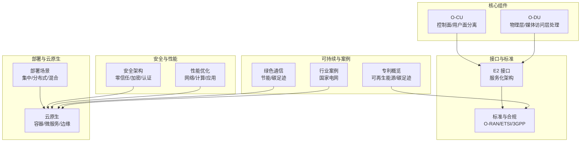
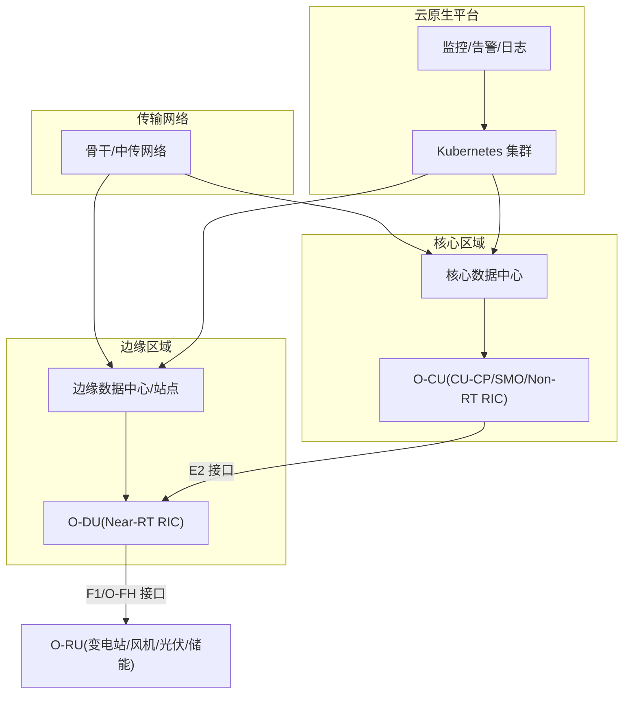
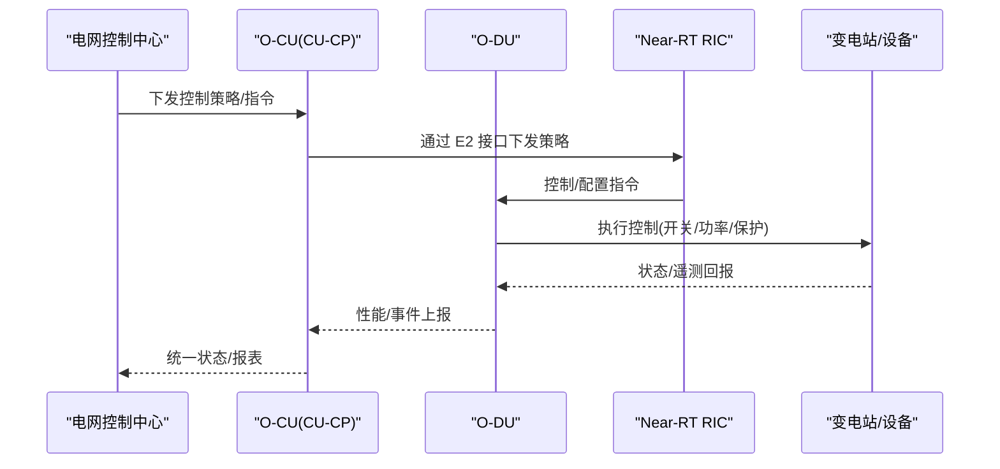
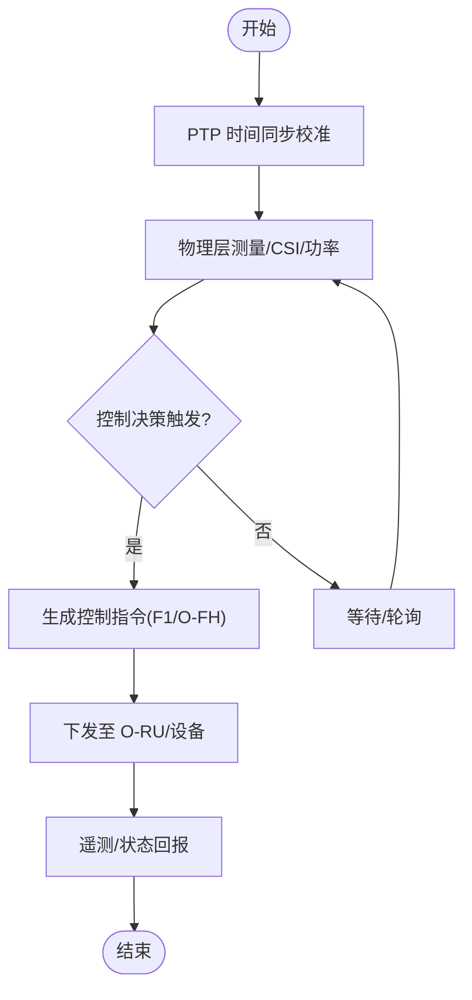
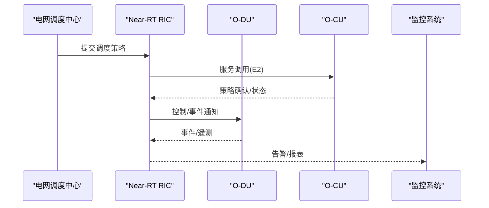
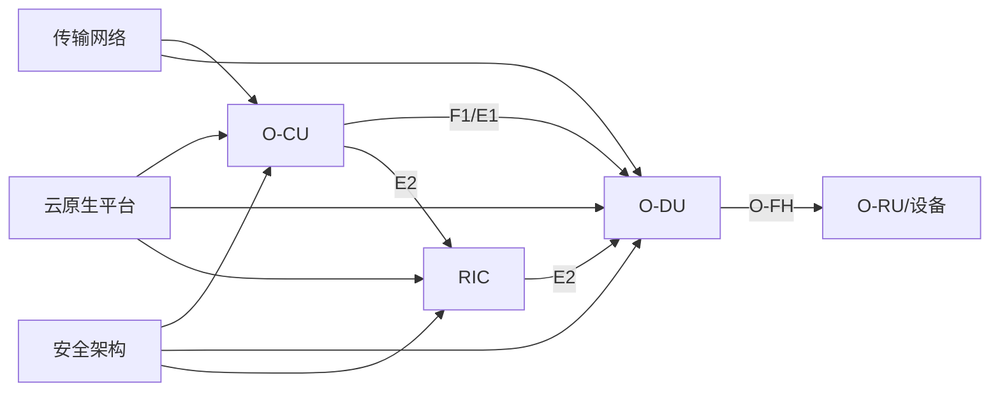

# 能源行业解决方案

<cite>
**本文引用的文件**
- [O-RAN 核心组件：O-CU](file://02-core-components/o-cu.md)
- [O-RAN 核心组件：O-DU](file://02-core-components/o-du.md)
- [E2 接口](file://03-interface-standards/e2-interface.md)
- [部署场景分析](file://04-disaggregation-options/deployment-scenarios.md)
- [云原生架构与 O-RAN 集成](file://05-cloud-integration/cloud-native-architecture.md)
- [O-RAN 标准与规范](file://09-standards-compliance/readme-zh.md)
- [安全架构参考](file://12-security-privacy/security-architecture/security-reference-architecture.md)
- [性能优化框架](file://14-operations-management/performance-optimization/performance-optimization-framework.md)
- [绿色通信技术与可持续发展](file://24-sustainable-development/environmental-protection/o-ran-environmental-sustainability.md)
- [行业应用案例：国家电网智能电网](file://21-case-studies/industry-applications/vertical-industry-o-ran-cases.md)
- [O-RAN 专利概览：可再生能源集成与碳足迹监测](file://comprehensive-oran-patent-table.md)
</cite>

## 目录
1. [引言](#引言)
2. [项目结构](#项目结构)
3. [核心组件](#核心组件)
4. [架构总览](#架构总览)
5. [详细组件分析](#详细组件分析)
6. [依赖关系分析](#依赖关系分析)
7. [性能与可靠性考量](#性能与可靠性考量)
8. [故障定位与运维指南](#故障定位与运维指南)
9. [结论](#结论)
10. [附录](#附录)

## 引言
本文件面向能源行业，系统化阐述 O-RAN 技术在智能电网、可再生能源并网与能源效率优化中的应用实践。围绕电网监控、负荷管理与故障定位，结合风能、太阳能与储能系统的并网技术要求，给出数字化智能调度、能耗分析与碳排放管理的解决方案，并提供电力设备监测、变电站自动化与输电线路监控的部署方案。文档同时覆盖网络架构设计、技术标准与实施案例，强调能源行业的特殊安全与可靠性标准。

## 项目结构
本仓库提供了 O-RAN 架构的完整知识体系，涵盖核心组件、接口标准、部署场景、云原生集成、标准与合规、安全架构、性能优化、可持续发展、行业案例与专利概览。针对能源行业应用，建议重点参考以下模块：
- 核心组件：O-CU、O-DU 的功能与部署
- 接口标准：E2 接口的服务化能力
- 部署场景：集中式/分布式/混合式部署
- 云原生：容器化、微服务与边缘部署
- 标准与合规：O-RAN、ETSI、3GPP 标准
- 安全架构：零信任、加密与认证
- 性能优化：网络、计算与应用层优化
- 可持续发展：节能与碳足迹管理
- 行业案例：国家电网智能电网实践
- 专利：可再生能源集成与碳足迹监测

**图表来源**
- [O-RAN 核心组件：O-CU](file://02-core-components/o-cu.md#L1-L419)
- [O-RAN 核心组件：O-DU](file://02-core-components/o-du.md#L1-L415)
- [E2 接口](file://03-interface-standards/e2-interface.md#L1-L337)
- [部署场景分析](file://04-disaggregation-options/deployment-scenarios.md#L1-L563)
- [云原生架构与 O-RAN 集成](file://05-cloud-integration/cloud-native-architecture.md#L1-L481)
- [O-RAN 标准与规范](file://09-standards-compliance/readme-zh.md#L1-L371)
- [安全架构参考](file://12-security-privacy/security-architecture/security-reference-architecture.md#L1-L559)
- [性能优化框架](file://14-operations-management/performance-optimization/performance-optimization-framework.md#L1-L650)
- [绿色通信技术与可持续发展](file://24-sustainable-development/environmental-protection/o-ran-environmental-sustainability.md#L1-L50)
- [行业应用案例：国家电网智能电网](file://21-case-studies/industry-applications/vertical-industry-o-ran-cases.md#L237-L278)
- [O-RAN 专利概览：可再生能源集成与碳足迹监测](file://comprehensive-oran-patent-table.md#L125-L136)

**章节来源**
- [O-RAN 核心组件：O-CU](file://02-core-components/o-cu.md#L1-L419)
- [O-RAN 核心组件：O-DU](file://02-core-components/o-du.md#L1-L415)
- [E2 接口](file://03-interface-standards/e2-interface.md#L1-L337)
- [部署场景分析](file://04-disaggregation-options/deployment-scenarios.md#L1-L563)
- [云原生架构与 O-RAN 集成](file://05-cloud-integration/cloud-native-architecture.md#L1-L481)
- [O-RAN 标准与规范](file://09-standards-compliance/readme-zh.md#L1-L371)
- [安全架构参考](file://12-security-privacy/security-architecture/security-reference-architecture.md#L1-L559)
- [性能优化框架](file://14-operations-management/performance-optimization/performance-optimization-framework.md#L1-L650)
- [绿色通信技术与可持续发展](file://24-sustainable-development/environmental-protection/o-ran-environmental-sustainability.md#L1-L50)
- [行业应用案例：国家电网智能电网](file://21-case-studies/industry-applications/vertical-industry-o-ran-cases.md#L237-L278)
- [O-RAN 专利概览：可再生能源集成与碳足迹监测](file://comprehensive-oran-patent-table.md#L125-L136)

## 核心组件
- O-CU（集中式单元）：负责非实时高层协议栈，控制面（CU-CP）与用户面（CU-UP）分离，支持 E1 接口、NG/F1 接口，具备容器化与云原生部署能力。
- O-DU（分布式单元）：负责物理层与部分 MAC 层处理，对实时性要求高，支持 F1、O-FH、E2 接口，具备边缘部署与同步能力。

**章节来源**
- [O-RAN 核心组件：O-CU](file://02-core-components/o-cu.md#L1-L419)
- [O-RAN 核心组件：O-DU](file://02-core-components/o-du.md#L1-L415)

## 架构总览
O-RAN 在能源行业可采用“核心集中、边缘分布”的混合架构：核心数据中心部署 O-CU（CU-CP/SMO/Non-RT RIC），边缘部署 O-DU（Near-RT RIC）、部分 CU-UP 与 DU，通过 E2 接口实现 RIC 与 CU/DU 的服务化控制，结合云原生实现弹性与可观测性。

**图表来源**
- [部署场景分析](file://04-disaggregation-options/deployment-scenarios.md#L164-L189)
- [E2 接口](file://03-interface-standards/e2-interface.md#L111-L129)
- [云原生架构与 O-RAN 集成](file://05-cloud-integration/cloud-native-architecture.md#L235-L296)

## 详细组件分析

### O-CU 在智能电网中的应用
- 控制面（CU-CP）：支持与 AMF 的 NG 接口、RRC/移动性/QoS 管理，适配电网控制指令下发与状态同步。
- 用户面（CU-UP）：支持 PDCP/SDAP 与用户面转发，满足变电站自动化、负荷管理与监控数据的高吞吐转发。
- 部署：集中式部署于核心数据中心，结合 E1 接口与传输网络，实现跨区域的统一管理与资源调度。

**图表来源**
- [O-RAN 核心组件：O-CU](file://02-core-components/o-cu.md#L1-L419)
- [E2 接口](file://03-interface-standards/e2-interface.md#L1-L337)
- [O-RAN 核心组件：O-DU](file://02-core-components/o-du.md#L1-L415)

**章节来源**
- [O-RAN 核心组件：O-CU](file://02-core-components/o-cu.md#L1-L419)
- [O-RAN 核心组件：O-DU](file://02-core-components/o-du.md#L1-L415)
- [E2 接口](file://03-interface-standards/e2-interface.md#L1-L337)

### O-DU 在边缘控制与实时性保障中的作用
- 物理层/媒体访问层：支持风电机组/光伏板/储能系统的本地控制与测量，满足 URLLC 的低延迟与高可靠。
- 同步与前传：通过 O-FH 接口与 O-RU 通信，满足 PTP 时间同步精度，保障多站点协同控制。
- 部署：边缘部署 O-DU，靠近变电站与发电设备，降低端到端延迟，支撑故障快速隔离与恢复。

**图表来源**
- [O-RAN 核心组件：O-DU](file://02-core-components/o-du.md#L51-L67)
- [O-RAN 核心组件：O-DU](file://02-core-components/o-du.md#L190-L206)

**章节来源**
- [O-RAN 核心组件：O-DU](file://02-core-components/o-du.md#L1-L415)

### E2 接口在智能调度与事件管理中的应用
- 服务化接口：支持 RIC 与 CU/DU 的服务发现、调用、事件通知与订阅管理，满足电网侧的动态调度与告警联动。
- 部署：Near-RT RIC 分布式部署，降低 E2 接口延迟，满足毫秒级控制闭环。
- 安全：mTLS 认证、消息完整性与访问控制，保障调度指令与遥测数据安全。

**图表来源**
- [E2 接口](file://03-interface-standards/e2-interface.md#L1-L337)
- [安全架构参考](file://12-security-privacy/security-architecture/security-reference-architecture.md#L247-L283)

**章节来源**
- [E2 接口](file://03-interface-standards/e2-interface.md#L1-L337)
- [安全架构参考](file://12-security-privacy/security-architecture/security-reference-architecture.md#L247-L283)

### 部署场景与网络架构设计
- 集中式：核心区域集中部署 O-CU，适合广覆盖与统一管理。
- 分布式：边缘部署 O-DU/Near-RT RIC，满足 URLLC 与低延迟。
- 混合式：核心-边缘协同，兼顾管理效率与性能。
- 传输网络：骨干/中传/前传三层网络，QoS 保障与冗余设计，满足不同业务 SLA。

**章节来源**
- [部署场景分析](file://04-disaggregation-options/deployment-scenarios.md#L1-L563)

### 云原生与自动化运维
- 容器化与微服务：O-CU/O-DU/RIC/S-MO 服务化部署，支持弹性扩缩容与故障自愈。
- 边缘云：K3s 等轻量化集群在工业园区/变电站部署，降低延迟。
- 监控与告警：Prometheus/Grafana/Jaeger/ELK 集成，实现端到端可观测性。

**章节来源**
- [云原生架构与 O-RAN 集成](file://05-cloud-integration/cloud-native-architecture.md#L1-L481)
- [性能优化框架](file://14-operations-management/performance-optimization/performance-optimization-framework.md#L1-L650)

### 安全与合规
- 零信任：按域分段、最小权限、持续验证与微分段。
- 加密与认证：mTLS、证书颁发与吊销、密钥管理与轮换。
- 合规：GDPR、NIST、ISO 27001、3GPP 安全要求，建立审计与合规流程。

**章节来源**
- [安全架构参考](file://12-security-privacy/security-architecture/security-reference-architecture.md#L1-L559)
- [O-RAN 标准与规范](file://09-standards-compliance/readme-zh.md#L1-L371)

### 可持续发展与碳排放管理
- 节能优化：动态休眠、智能电源管理、可再生能源集成与储能协同。
- 碳足迹监测：全生命周期碳强度计算、减排目标设定与进度跟踪。
- 绿色通信：降低传输与设备能耗，支持碳中和路径。

**章节来源**
- [绿色通信技术与可持续发展](file://24-sustainable-development/environmental-protection/o-ran-environmental-sustainability.md#L1-L50)
- [O-RAN 专利概览：可再生能源集成与碳足迹监测](file://comprehensive-oran-patent-table.md#L125-L136)

### 行业应用案例：国家电网智能电网
- 全网连接：LPWAN/5G/边缘计算/卫星备份，支撑智能计量与广域监控。
- 可再生能源：风电/光伏/储能并网与运行优化。
- 智能调度：实时负荷平衡、故障检测与自动恢复、电压/频率调节。
- 成果：可再生能源占比提升、电网可靠性与能效改善、碳强度下降。

**章节来源**
- [行业应用案例：国家电网智能电网](file://21-case-studies/industry-applications/vertical-industry-o-ran-cases.md#L237-L278)

## 依赖关系分析
O-RAN 能源应用的耦合关系主要体现在：
- O-CU 与 O-DU 通过 F1/E1 接口协同，E2 接口驱动 RIC 与 CU/DU 的服务化控制。
- 传输网络对实时性与可靠性提出严格要求，需与同步、QoS、冗余设计协同。
- 云原生平台提供编排、监控与安全能力，支撑自动化运维与弹性伸缩。
- 安全架构贯穿基础设施、平台、应用与数据全链路。

**图表来源**
- [O-RAN 核心组件：O-CU](file://02-core-components/o-cu.md#L101-L121)
- [O-RAN 核心组件：O-DU](file://02-core-components/o-du.md#L68-L86)
- [E2 接口](file://03-interface-standards/e2-interface.md#L63-L90)
- [云原生架构与 O-RAN 集成](file://05-cloud-integration/cloud-native-architecture.md#L65-L122)
- [安全架构参考](file://12-security-privacy/security-architecture/security-reference-architecture.md#L6-L71)

**章节来源**
- [O-RAN 核心组件：O-CU](file://02-core-components/o-cu.md#L1-L419)
- [O-RAN 核心组件：O-DU](file://02-core-components/o-du.md#L1-L415)
- [E2 接口](file://03-interface-standards/e2-interface.md#L1-L337)
- [云原生架构与 O-RAN 集成](file://05-cloud-integration/cloud-native-architecture.md#L1-L481)
- [安全架构参考](file://12-security-privacy/security-architecture/security-reference-architecture.md#L1-L559)

## 性能与可靠性考量
- 网络层：Jumbo 帧、NUMA 绑定、中断亲和、优先级队列与 O-RAN 流量标记，降低延迟与抖动。
- 计算层：CPU 亲和、进程优先级、内核调度参数优化，保障 Near-RT RIC 与 O-DU 实时性。
- 应用层：容器资源请求/限制、垃圾回收与并发参数、NUMA 内存绑定，提升稳定性与资源利用率。
- 监控与优化：端到端指标采集、趋势分析与自动化调优，持续改进性能与成本。

**章节来源**
- [性能优化框架](file://14-operations-management/performance-optimization/performance-optimization-framework.md#L1-L650)

## 故障定位与运维指南
- 监控与告警：建立分层监控体系，覆盖基础设施、容器、服务与业务，结合智能告警与根因分析。
- 故障处理：告警分级、关联分析、日志与信令分析、测试验证与回退机制。
- 安全运维：证书与密钥管理、访问控制、入侵检测与事件响应。
- 自动化：CI/CD、基础设施即代码、自动扩缩容与故障自愈。

**章节来源**
- [安全架构参考](file://12-security-privacy/security-architecture/security-reference-architecture.md#L339-L513)
- [O-RAN 标准与规范](file://09-standards-compliance/readme-zh.md#L310-L335)

## 结论
O-RAN 通过服务化接口与云原生能力，为能源行业提供灵活、低延迟、可扩展的网络支撑。结合集中/分布式/混合部署策略，配合 E2 接口的智能调度与安全架构，可在智能电网、可再生能源并网与能效优化中实现高可靠与高效率。通过标准化与自动化运维，持续优化性能与成本，支撑碳达峰与碳中和目标。

## 附录
- 技术标准与合规：O-RAN、ETSI、3GPP 标准与认证流程。
- 专利与创新：可再生能源集成与碳足迹监测相关专利。
- 行业案例：国家电网智能电网实践，展示全网连接、可再生能源集成与智能调度成果。

**章节来源**
- [O-RAN 标准与规范](file://09-standards-compliance/readme-zh.md#L1-L371)
- [O-RAN 专利概览：可再生能源集成与碳足迹监测](file://comprehensive-oran-patent-table.md#L125-L136)
- [行业应用案例：国家电网智能电网](file://21-case-studies/industry-applications/vertical-industry-o-ran-cases.md#L237-L278)