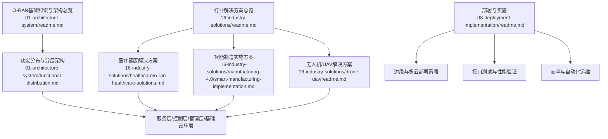
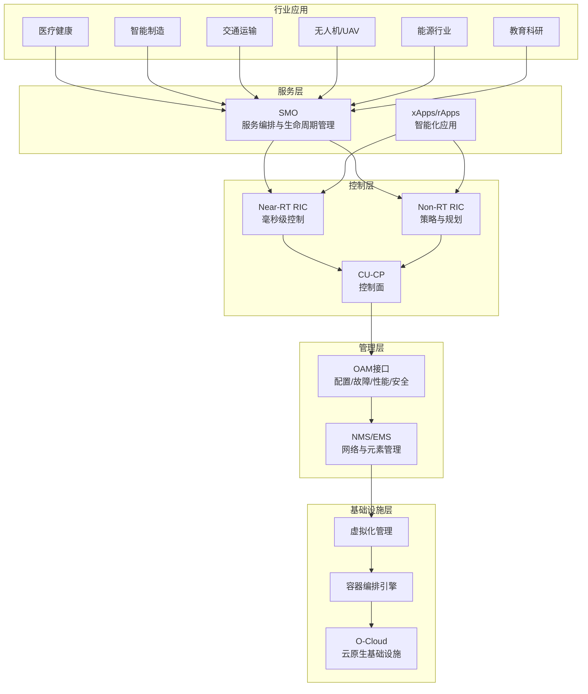
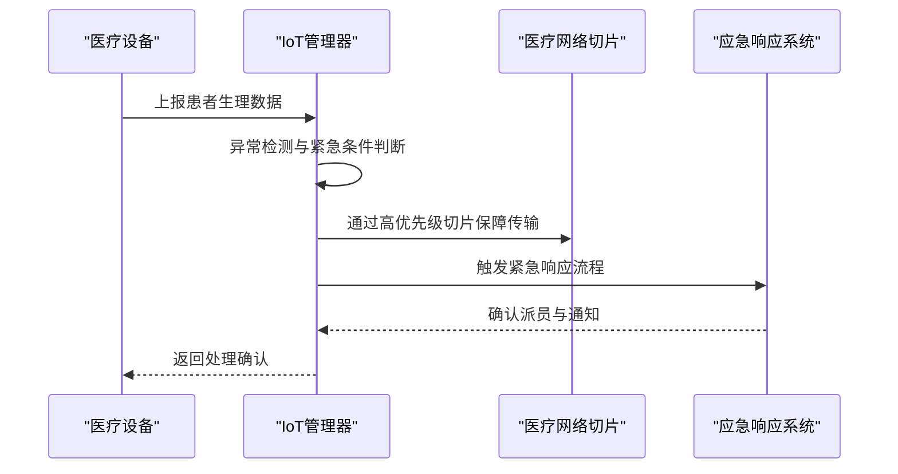
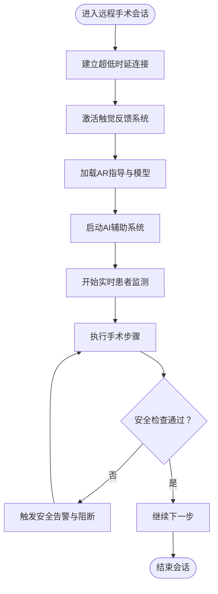
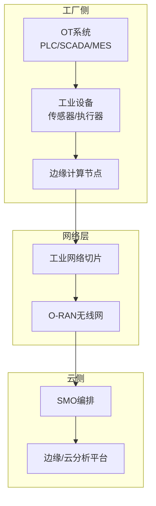
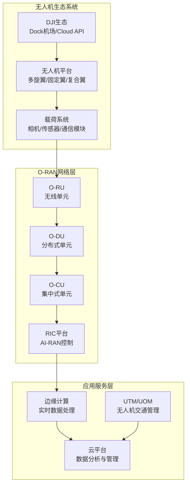
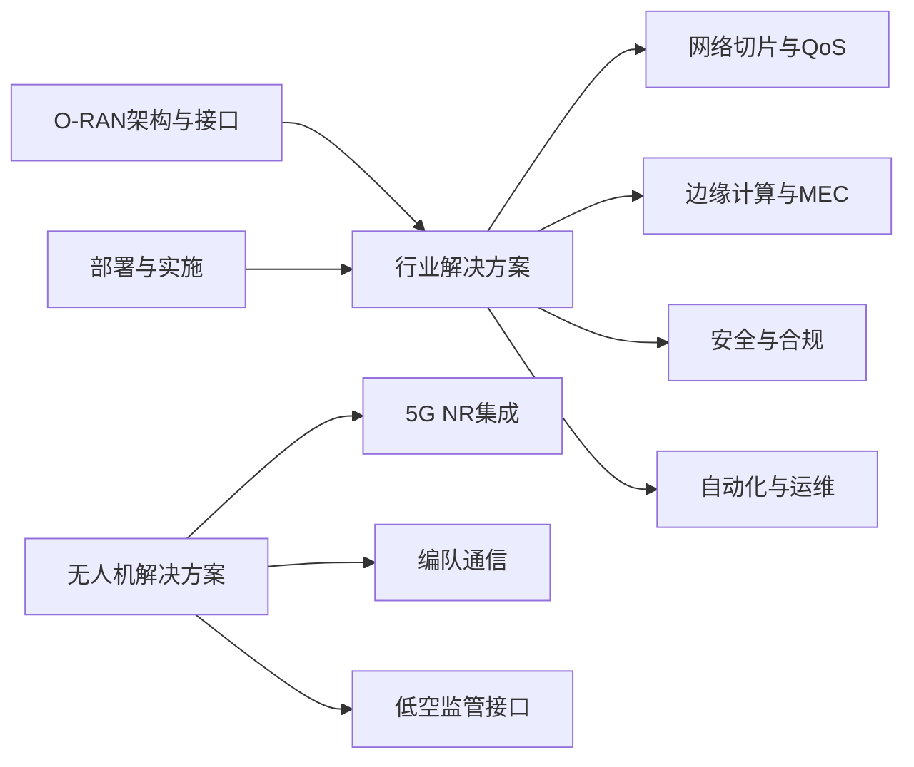

# 行业解决方案

<cite>
**本文引用的文件**
- [行业解决方案总览](file://16-industry-solutions/readme.md)
- [无人机/UAV 行业 AI-RAN 解决方案](file://16-industry-solutions/drone-uav/readme.md)
- [O-RAN无人机应用场景与案例](file://16-industry-solutions/drone-uav/drone-application-scenarios.md)
- [医疗健康解决方案（英文）](file://16-industry-solutions/healthcare/o-ran-healthcare-solutions.md)
- [医疗健康解决方案（中文）](file://16-industry-solutions/healthcare/o-ran-healthcare-solutions-zh.md)
- [智能制造实施方案（英文）](file://16-industry-solutions/manufacturing-4.0/smart-manufacturing-implementation.md)
- [O-RAN 基础知识与架构总览](file://01-architecture-system/readme.md)
- [O-RAN 功能分布与分层架构](file://01-architecture-system/functional-distribution.md)
- [O-RAN 部署与实施](file://08-deployment-implementation/readme.md)
</cite>

## 更新摘要
**所做更改**
- 新增无人机/UAV行业解决方案章节，涵盖5G连接无人机、大疆定制AI-RAN解决方案、无人机集群协调和低空智能网络等关键亮点
- 扩展行业应用领域，增加低空经济相关应用场景
- 更新架构图和依赖关系，体现无人机解决方案的集成
- 增强边缘计算和网络切片在无人机场景中的应用说明

## 目录
1. [引言](#引言)
2. [项目结构](#项目结构)
3. [核心组件](#核心组件)
4. [架构总览](#架构总览)
5. [详细组件分析](#详细组件分析)
6. [依赖分析](#依赖分析)
7. [性能考虑](#性能考虑)
8. [故障排查指南](#故障排查指南)
9. [结论](#结论)
10. [附录](#附录)

## 引言
本文件面向O-RAN行业解决方案的落地与推广，聚焦于教育科研、能源行业、医疗健康、制造4.0、交通运输以及新兴的低空经济等垂直行业的应用实践。围绕医疗健康领域，系统阐述远程医疗、远程患者监测、医疗物联网集成与面向医疗场景的网络切片技术；围绕制造4.0，给出智能工厂的工业场景需求、私有网络部署、QoS保障与OT系统集成策略；同时提供智慧城市综合解决方案、交通运输应用（智能交通、车联网、交通管理优化）以及无人机/UAV应用（5G网联无人机、DJI生态合作、编队协同与应急通信）的部署策略、技术要求与实施案例参考。所有方案均以O-RAN架构与接口为技术底座，结合部署实施与运维能力，形成可复制、可扩展的行业交付范式。

## 项目结构
本仓库按主题域组织O-RAN知识与实践，行业解决方案位于"16-industry-solutions"目录，涵盖医疗健康、制造4.0、无人机/UAV等重点行业，并配套O-RAN架构、部署与实施等基础能力文档，支撑行业方案的设计与落地。

图表来源
- [行业解决方案总览:1-75](file://16-industry-solutions/readme.md#L1-L75)
- [无人机/UAV 行业 AI-RAN 解决方案:1-44](file://16-industry-solutions/drone-uav/readme.md#L1-L44)
- [O-RAN 基础知识与架构总览:1-161](file://01-architecture-system/readme.md#L1-L161)
- [O-RAN 功能分布与分层架构:1-325](file://01-architecture-system/functional-distribution.md#L1-L325)
- [O-RAN 部署与实施:1-353](file://08-deployment-implementation/readme.md#L1-L353)

章节来源
- [行业解决方案总览:1-75](file://16-industry-solutions/readme.md#L1-L75)
- [O-RAN 基础知识与架构总览:1-161](file://01-architecture-system/readme.md#L1-L161)

## 核心组件
- 行业网络切片：面向不同业务SLA的切片设计与QoS保障，确保关键业务的确定性性能。
- 医疗物联网与数据处理：设备注册、数据采集、异常检测与紧急响应联动。
- 远程医疗与远程手术：超低时延、高可靠连接与AI/AR辅助、触觉反馈系统。
- 智能制造网络：工业控制、边缘计算、QoS与OT系统融合。
- **无人机通信网络**：5G网联无人机、BVLOS超视距作业、UAS/UTM监管集成、编队协同与应急通信。
- 部署与运维：集中/分布式/混合/边缘/多云部署架构，接口测试与自动化运维。

章节来源
- [行业解决方案总览:38-75](file://16-industry-solutions/readme.md#L38-L75)
- [无人机/UAV 行业 AI-RAN 解决方案:26-32](file://16-industry-solutions/drone-uav/readme.md#L26-L32)
- [O-RAN 基础知识与架构总览:8-60](file://01-architecture-system/readme.md#L8-L60)
- [O-RAN 功能分布与分层架构:34-92](file://01-architecture-system/functional-distribution.md#L34-L92)
- [O-RAN 部署与实施:8-39](file://08-deployment-implementation/readme.md#L8-L39)

## 架构总览
O-RAN通过分层架构实现业务、控制、管理与基础设施的解耦与协同，配合网络切片与边缘计算，支撑行业应用的差异化需求，包括传统行业和新兴的低空经济应用。

图表来源
- [O-RAN 基础知识与架构总览:15-35](file://01-architecture-system/readme.md#L15-L35)
- [O-RAN 功能分布与分层架构:34-137](file://01-architecture-system/functional-distribution.md#L34-L137)
- [O-RAN 部署与实施:56-59](file://08-deployment-implementation/readme.md#L56-L59)
- [行业解决方案总览:18-53](file://16-industry-solutions/readme.md#L18-L53)

## 详细组件分析

### 医疗健康解决方案
- 医疗级网络切片：针对远程手术、远程患者监测、行政类业务分别设计优先级、时延、可靠性与带宽目标，确保关键医疗业务的确定性性能。
- 医疗物联网集成：设备注册、数据采集、异常检测与紧急响应联动，支持心率、血压、血氧等关键指标的实时处理与告警。
- 远程医疗与远程手术：高质量视频咨询平台与远程手术辅助系统，强调超低时延、高可靠连接、AI/AR辅助与触觉反馈系统。
- 医疗数据分析：基于电子病历、医学影像、可穿戴设备、检验与处方数据进行预测建模、队列分析与资源优化，同时采用差分隐私、联邦学习等隐私保护技术。

图表来源
- [医疗健康解决方案（英文）:84-181](file://16-industry-solutions/healthcare/o-ran-healthcare-solutions.md#L84-L181)
- [O-RAN 基础知识与架构总览:21-24](file://01-architecture-system/readme.md#L21-L24)

图表来源
- [医疗健康解决方案（英文）:302-377](file://16-industry-solutions/healthcare/o-ran-healthcare-solutions.md#L302-L377)

章节来源
- [医疗健康解决方案（英文）:1-484](file://16-industry-solutions/healthcare/o-ran-healthcare-solutions.md#L1-L484)
- [医疗健康解决方案（中文）:1-484](file://16-industry-solutions/healthcare/o-ran-healthcare-solutions-zh.md#L1-L484)

### 制造4.0智能工厂
- 工业场景需求：自动化产线、机器人协作、质量控制、数字孪生、柔性制造。
- 私有网络部署：结合边缘计算节点与网络切片，满足工业控制、设备联网、预测性维护与可视化监控等差异化SLA。
- QoS保障：基于切片与边缘分流，确保控制面与用户面的确定性转发与低抖动。
- OT系统集成：与MES/SCADA/PLC/DCS等系统打通，实现数据采集、分析与控制闭环。

图表来源
- [智能制造实施方案（英文）](file://16-industry-solutions/manufacturing-4.0/smart-manufacturing-implementation.md)
- [O-RAN 功能分布与分层架构:145-196](file://01-architecture-system/functional-distribution.md#L145-L196)

章节来源
- [行业解决方案总览:8-13](file://16-industry-solutions/readme.md#L8-L13)
- [O-RAN 部署与实施:21-39](file://08-deployment-implementation/readme.md#L21-L39)

### 无人机/UAV低空经济解决方案
**更新** 新增无人机/UAV行业解决方案，涵盖5G网联无人机、DJI生态合作、编队协同与应急通信等关键能力。

- **5G网联无人机**：基于3GPP UAS（Rel-16+）标准，支持BVLOS超视距作业、UAS NF网络功能、网络切片保障和UTM监管集成。
- **DJI定制化AI-RAN解决方案**：DJI Dock边缘节点部署、Cloud API集成、生态合作伙伴模式，提供完整的无人机运营基础设施。
- **无人机集群协调**：MBS多播广播支持编队控制、UAV挂载便携式O-RU快速网络恢复、蜂群协同作业能力。
- **低空智联网**：ISAC通感一体化、低空覆盖规划、空中UE切换/波束xApp、低空经济新基建。

图表来源
- [无人机/UAV 行业 AI-RAN 解决方案:26-32](file://16-industry-solutions/drone-uav/readme.md#L26-L32)
- [O-RAN 功能分布与分层架构:34-137](file://01-architecture-system/functional-distribution.md#L34-L137)

章节来源
- [行业解决方案总览:48-53](file://16-industry-solutions/readme.md#L48-L53)
- [无人机/UAV 行业 AI-RAN 解决方案:11-44](file://16-industry-solutions/drone-uav/readme.md#L11-L44)

### 智慧城市综合方案
- 城市管理需求：交通管理、公共安全、环境监测、应急通信、能源管理。
- 综合部署方案：集中/分布式/边缘/多云混合部署，结合MEC与网络切片，支撑视频监控、环境感知、应急指挥等多样化业务。
- 应急通信：通过网络切片与边缘缓存，保障灾难场景下的关键通信与数据回传。
- 能源管理：结合配用电侧物联网与边缘分析，实现负荷预测、能效优化与碳排放管理。

章节来源
- [行业解决方案总览:14-18](file://16-industry-solutions/readme.md#L14-L18)
- [O-RAN 部署与实施:27-39](file://08-deployment-implementation/readme.md#L27-L39)

### 交通运输应用
- 智能交通系统：信号优化、拥堵缓解、事件检测与协同管控。
- 车联网通信：车路协同、车路感知与高可靠短时延通信。
- 交通管理优化：基于实时数据与AI模型的动态调度与路径优化。

章节来源
- [行业解决方案总览:20-24](file://16-industry-solutions/readme.md#L20-L24)
- [O-RAN 基础知识与架构总览:21-24](file://01-architecture-system/readme.md#L21-L24)

## 依赖分析
- 行业方案依赖O-RAN分层架构与接口标准，服务层通过A1/E2接口与控制层交互，管理层通过O1/OAM接口管理基础设施层。
- 部署实施文档提供接口测试、性能验证、安全加固与自动化运维能力，保障行业方案的可落地性与可运营性。
- **无人机解决方案**特别依赖5G NR集成、边缘AI推理、编队通信协议和低空监管接口。

图表来源
- [O-RAN 基础知识与架构总览:27-35](file://01-architecture-system/readme.md#L27-L35)
- [O-RAN 功能分布与分层架构:197-222](file://01-architecture-system/functional-distribution.md#L197-L222)
- [O-RAN 部署与实施:62-93](file://08-deployment-implementation/readme.md#L62-L93)
- [无人机/UAV 行业 AI-RAN 解决方案:26-32](file://16-industry-solutions/drone-uav/readme.md#L26-L32)

章节来源
- [O-RAN 基础知识与架构总览:1-161](file://01-architecture-system/readme.md#L1-L161)
- [O-RAN 功能分布与分层架构:1-325](file://01-architecture-system/functional-distribution.md#L1-L325)
- [O-RAN 部署与实施:1-353](file://08-deployment-implementation/readme.md#L1-L353)

## 性能考虑
- 网络切片与边缘分流：针对不同业务设定时延、抖动、丢包与带宽目标，结合边缘计算就近处理，降低端到端时延。
- 接口测试与性能验证：通过端到端负载与压力测试、时延与吞吐测试，确保在高并发与极限条件下满足SLA。
- 自动化与可观测性：通过Prometheus/Grafana等工具建立KPI/KQI监控，结合CI/CD与自动化部署，提升稳定性与可维护性。
- **无人机特定性能要求**：超低时延控制链路（<10ms）、高可靠数据传输（99.999%）、广覆盖支持（BVLOS作业）、多机协同通信质量。

章节来源
- [O-RAN 部署与实施:75-92](file://08-deployment-implementation/readme.md#L75-L92)
- [O-RAN 部署与实施:94-125](file://08-deployment-implementation/readme.md#L94-L125)
- [无人机/UAV 行业 AI-RAN 解决方案:26-32](file://16-industry-solutions/drone-uav/readme.md#L26-L32)

## 故障排查指南
- 问题分类：接口故障（E2/A1/O1/O-FH/F1）、性能问题（时延/吞吐/丢包）、可用性问题、配置问题、兼容性问题。
- 排查流程：问题定义与范围界定、信息收集（日志/指标/配置）、假设验证、根因分析（5 Why/Fishbone/FT分析/时间线/关联分析）、方案实施与验证。
- 诊断工具：Wireshark/tcpdump、协议分析器、ELK/Splunk、性能分析工具、网络监控工具。
- SOP：故障响应、升级、沟通、复盘与知识库更新。
- **无人机专项排查**：通信链路中断、编队同步失败、GPS信号丢失、电池电量异常、天气影响等特定问题的诊断与处理。

章节来源
- [O-RAN 部署与实施:126-157](file://08-deployment-implementation/readme.md#L126-L157)

## 结论
O-RAN以开放接口与云原生架构为基础，为教育科研、能源、医疗健康、制造4.0、交通运输以及新兴的低空经济等垂直行业提供了可定制、可扩展的网络能力。通过网络切片、边缘计算、自动化与安全体系，结合完善的部署与运维能力，能够有效支撑远程医疗、智能工厂、智慧城市、交通管理以及无人机应用等关键场景的落地与演进。特别是无人机/UAV解决方案，为低空经济发展提供了强大的通信基础设施和技术支撑。

## 附录
- 行业方案成功要素：深入理解业务需求、技术方案适配性、成本与收益平衡、风险控制与持续优化。
- 实施清单：需求分析与场景识别、网络规划与设计、设备选型与部署、系统集成与测试、运维与支持。
- **无人机实施要点**：空域审批、频谱规划、地面站建设、飞控系统集成、监管平台对接、安全保障措施。

章节来源
- [行业解决方案总览:70-75](file://16-industry-solutions/readme.md#L70-L75)
- [O-RAN 部署与实施:197-206](file://08-deployment-implementation/readme.md#L197-L206)
- [无人机/UAV 行业 AI-RAN 解决方案:33-38](file://16-industry-solutions/drone-uav/readme.md#L33-L38)