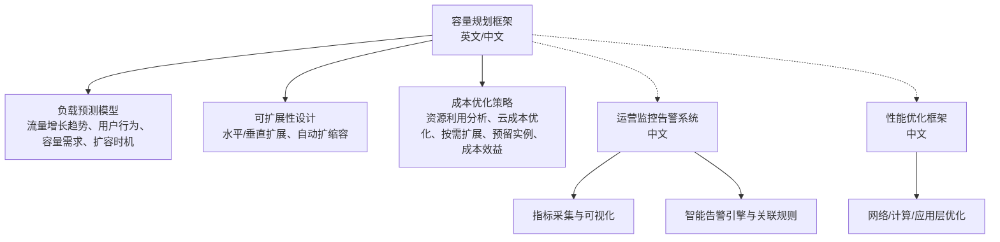
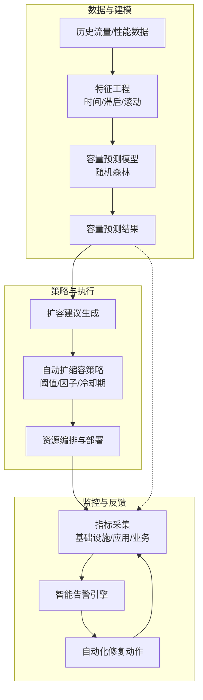
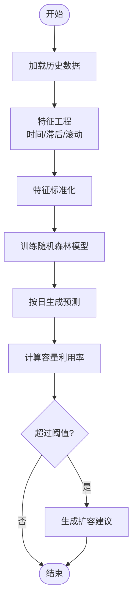
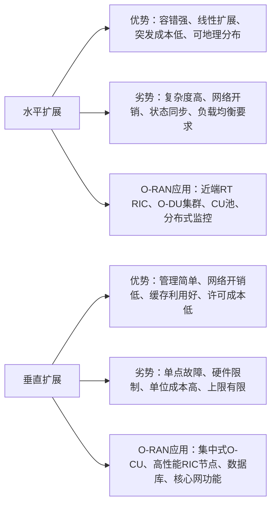
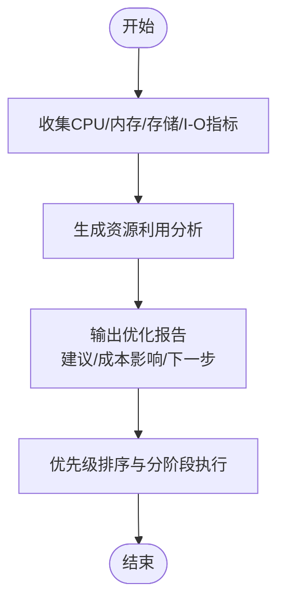
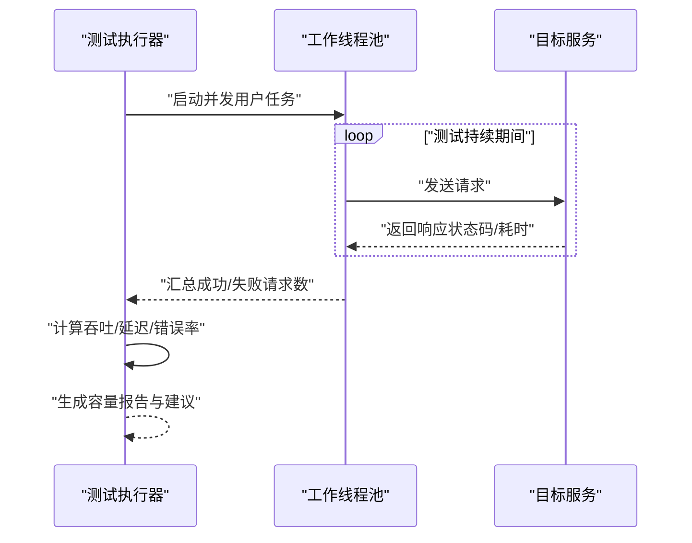
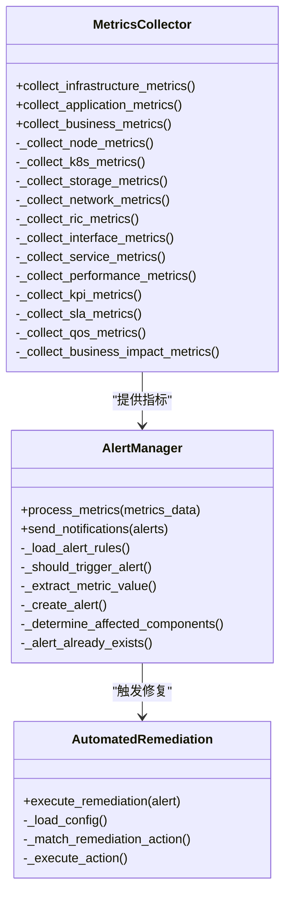
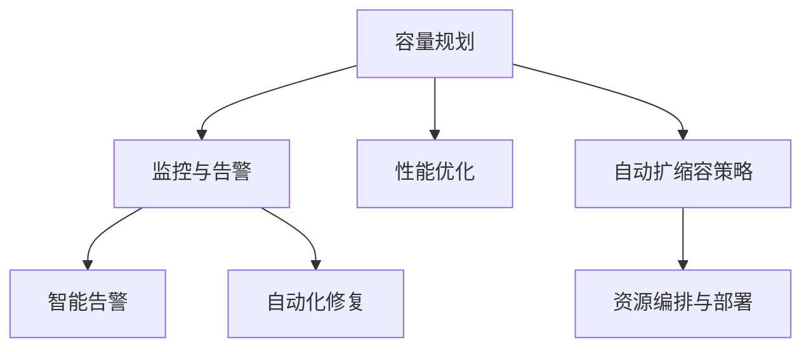

# 容量规划

<cite>
**本文引用的文件**
- [容量规划框架（英文）](file://14-operations-management/capacity-planning/capacity-planning-framework.md)
- [容量规划框架（中文）](file://14-operations-management/capacity-planning/capacity-planning-framework-zh.md)
- [运营监控告警系统（中文）](file://14-operations-management/monitoring-alerting/operations-monitoring-framework-zh.md)
- [性能优化框架（中文）](file://14-operations-management/performance-optimization/performance-optimization-framework-zh.md)
</cite>

## 目录
1. [引言](#引言)
2. [项目结构](#项目结构)
3. [核心组件](#核心组件)
4. [架构总览](#架构总览)
5. [详细组件分析](#详细组件分析)
6. [依赖关系分析](#依赖关系分析)
7. [性能考量](#性能考量)
8. [故障排查指南](#故障排查指南)
9. [结论](#结论)
10. [附录](#附录)

## 引言
本文件面向O-RAN系统的容量规划与运维，围绕“负载预测模型”“可扩展性设计”“成本优化策略”“实施流程”“监控与预警机制”等主题，提供系统化、可落地的指导。内容来源于仓库中的容量规划框架与运营监控告警体系，结合性能优化实践，帮助读者建立从数据到决策再到执行的闭环能力。

## 项目结构
本主题涉及的文档主要分布在以下目录：
- 14-operations-management/capacity-planning：容量规划框架（含英文与中文）
- 14-operations-management/monitoring-alerting：运营监控与告警框架（含中文）
- 14-operations-management/performance-optimization：性能优化框架（含中文）

**图表来源**
- [容量规划框架（英文）](file://14-operations-management/capacity-planning/capacity-planning-framework.md#L1-L505)
- [容量规划框架（中文）](file://14-operations-management/capacity-planning/capacity-planning-framework-zh.md#L1-L505)
- [运营监控告警系统（中文）](file://14-operations-management/monitoring-alerting/operations-monitoring-framework-zh.md#L1-L909)
- [性能优化框架（中文）](file://14-operations-management/performance-optimization/performance-optimization-framework-zh.md#L1-L342)

**章节来源**
- [容量规划框架（英文）](file://14-operations-management/capacity-planning/capacity-planning-framework.md#L1-L505)
- [容量规划框架（中文）](file://14-operations-management/capacity-planning/capacity-planning-framework-zh.md#L1-L505)
- [运营监控告警系统（中文）](file://14-operations-management/monitoring-alerting/operations-monitoring-framework-zh.md#L1-L909)
- [性能优化框架（中文）](file://14-operations-management/performance-optimization/performance-optimization-framework-zh.md#L1-L342)

## 核心组件
- 负载预测与容量需求分析：基于历史流量与性能数据，提取时间特征、滞后特征与滚动统计，训练随机森林回归模型进行容量预测，并生成扩容建议。
- 可扩展性设计：对比水平扩展与垂直扩展的优劣势，给出针对近端RT RIC、O-DU集群、CU池等组件的自动扩缩容策略配置。
- 成本优化：提供资源利用分析脚本与优化报告模板，覆盖CPU、内存、存储与I/O指标，形成短期与长期优化路线。
- 监控与告警：多层监控指标体系（基础设施/应用/业务），智能告警引擎与规则，以及自动化修复动作框架。
- 性能基准测试：容量扫描测试，评估不同并发下的吞吐、延迟与错误率，输出容量建议与缓冲策略。

**章节来源**
- [容量规划框架（英文）](file://14-operations-management/capacity-planning/capacity-planning-framework.md#L8-L186)
- [容量规划框架（中文）](file://14-operations-management/capacity-planning/capacity-planning-framework-zh.md#L8-L186)
- [运营监控告警系统（中文）](file://14-operations-management/monitoring-alerting/operations-monitoring-framework-zh.md#L10-L260)
- [性能优化框架（中文）](file://14-operations-management/performance-optimization/performance-optimization-framework-zh.md#L1-L342)

## 架构总览
容量规划的端到端流程由“数据采集—建模预测—策略制定—执行与监控—反馈优化”构成。监控与告警作为闭环反馈的关键环节，贯穿于容量评估、扩容执行与效果验证全过程。

**图表来源**
- [容量规划框架（英文）](file://14-operations-management/capacity-planning/capacity-planning-framework.md#L54-L150)
- [容量规划框架（中文）](file://14-operations-management/capacity-planning/capacity-planning-framework-zh.md#L54-L150)
- [运营监控告警系统（中文）](file://14-operations-management/monitoring-alerting/operations-monitoring-framework-zh.md#L56-L486)

## 详细组件分析

### 负载预测模型与容量需求分析
- 数据准备：时间戳解析、时间特征（小时、星期、月份、周末）、滞后特征（1小时、24小时、168小时）、滚动均值与标准差。
- 模型训练：标准化特征后使用随机森林回归器拟合，输出特征重要性。
- 预测与建议：按日生成预测结果，计算容量利用率，识别高利用率与临界时段，输出短期与长期规划建议。

**图表来源**
- [容量规划框架（英文）](file://14-operations-management/capacity-planning/capacity-planning-framework.md#L34-L150)
- [容量规划框架（中文）](file://14-operations-management/capacity-planning/capacity-planning-framework-zh.md#L34-L150)

**章节来源**
- [容量规划框架（英文）](file://14-operations-management/capacity-planning/capacity-planning-framework.md#L8-L186)
- [容量规划框架（中文）](file://14-operations-management/capacity-planning/capacity-planning-framework-zh.md#L8-L186)

### 可扩展性设计方案
- 水平扩展 vs 垂直扩展：对比容错、性能扩展、成本、复杂度、网络开销、状态同步与负载均衡等维度，给出近端RT RIC、O-DU集群、CU池、分布式监控等应用场景。
- 自动扩缩容配置：定义指标（CPU利用率、连接用户数、吞吐量）、高/低阈值、扩展/缩减因子、冷却期、最小/最大实例数等参数，确保弹性与稳定性平衡。

**图表来源**
- [容量规划框架（英文）](file://14-operations-management/capacity-planning/capacity-planning-framework.md#L190-L266)
- [容量规划框架（中文）](file://14-operations-management/capacity-planning/capacity-planning-framework-zh.md#L190-L266)

**章节来源**
- [容量规划框架（英文）](file://14-operations-management/capacity-planning/capacity-planning-framework.md#L188-L266)
- [容量规划框架（中文）](file://14-operations-management/capacity-planning/capacity-planning-framework-zh.md#L188-L266)

### 成本优化策略
- 资源利用分析：收集CPU、内存、存储与I/O指标，生成优化报告，提出短期与长期优化路线（立即行动、短期改进、长期策略）。
- 成本效益评估：估算月节省金额、投资回报周期与实施难度，明确下一步行动计划。

**图表来源**
- [容量规划框架（英文）](file://14-operations-management/capacity-planning/capacity-planning-framework.md#L270-L359)
- [容量规划框架（中文）](file://14-operations-management/capacity-planning/capacity-planning-framework-zh.md#L270-L359)

**章节来源**
- [容量规划框架（英文）](file://14-operations-management/capacity-planning/capacity-planning-framework.md#L268-L359)
- [容量规划框架（中文）](file://14-operations-management/capacity-planning/capacity-planning-framework-zh.md#L268-L359)

### 容量基准测试与规划建议
- 负载测试：在不同并发用户数下运行测试，统计吞吐、延迟与错误率。
- 报告输出：给出最大可持续吞吐、最佳并发用户数、峰值时延迟与错误率，并提供容量缓冲与增长规划建议。

**图表来源**
- [容量规划框架（英文）](file://14-operations-management/capacity-planning/capacity-planning-framework.md#L364-L503)
- [容量规划框架（中文）](file://14-operations-management/capacity-planning/capacity-planning-framework-zh.md#L364-L503)

**章节来源**
- [容量规划框架（英文）](file://14-operations-management/capacity-planning/capacity-planning-framework.md#L361-L503)
- [容量规划框架（中文）](file://14-operations-management/capacity-planning/capacity-planning-framework-zh.md#L361-L503)

### 监控与预警机制
- 多层监控：基础设施（CPU/内存/磁盘/网络）、应用（RIC/接口/API/性能）、业务（KPI/SLA/QoS/业务影响）。
- 指标采集：封装MetricsCollector类，分别采集节点、K8s、存储、网络、RIC、接口、服务、性能、KPI、SLA、QoS、业务影响等指标。
- 智能告警：定义告警严重级别与类别，加载阈值规则，异步处理指标并生成告警；支持通知通道与关联规则。
- 自动化修复：根据告警类型匹配修复动作，记录执行历史，支持超时与重试控制。

**图表来源**
- [运营监控告警系统（中文）](file://14-operations-management/monitoring-alerting/operations-monitoring-framework-zh.md#L48-L486)

**章节来源**
- [运营监控告警系统（中文）](file://14-operations-management/monitoring-alerting/operations-monitoring-framework-zh.md#L6-L486)

### 性能优化与可观测性
- 网络优化：禁用特定网络卸载、设置巨帧、配置队列与优先级、NUMA感知绑定中断。
- 计算优化：CPU亲和性与进程优先级、内核调度器参数调优。
- 应用层优化：容器资源请求/限制、探针配置、环境变量优化。
- 监控仪表板：Prometheus查询表达式、阈值与可视化配置。

**章节来源**
- [性能优化框架（中文）](file://14-operations-management/performance-optimization/performance-optimization-framework-zh.md#L1-L342)

## 依赖关系分析
- 容量规划依赖监控与告警提供的指标与告警能力，形成“预测—执行—反馈”的闭环。
- 自动扩缩容策略依赖容量预测结果与监控阈值，避免误触发与抖动。
- 成本优化依赖资源利用分析与容量基准测试，支撑预算与ROI评估。

**图表来源**
- [容量规划框架（英文）](file://14-operations-management/capacity-planning/capacity-planning-framework.md#L188-L266)
- [运营监控告警系统（中文）](file://14-operations-management/monitoring-alerting/operations-monitoring-framework-zh.md#L264-L486)
- [性能优化框架（中文）](file://14-operations-management/performance-optimization/performance-optimization-framework-zh.md#L1-L342)

**章节来源**
- [容量规划框架（英文）](file://14-operations-management/capacity-planning/capacity-planning-framework.md#L188-L266)
- [运营监控告警系统（中文）](file://14-operations-management/monitoring-alerting/operations-monitoring-framework-zh.md#L264-L486)
- [性能优化框架（中文）](file://14-operations-management/performance-optimization/performance-optimization-framework-zh.md#L1-L342)

## 性能考量
- 预测模型：特征工程的质量直接影响预测精度；建议定期回滚与再训练，结合业务事件（节假日、促销）进行修正。
- 扩展策略：优先水平扩展以提升容错与弹性；对热点组件采用就近扩展与负载均衡；合理设置冷却期，避免频繁扩缩。
- 成本优化：通过资源利用分析识别过度配置与闲置资源；结合容量基准测试设定安全缓冲，避免盲目扩容。
- 监控与告警：建立多层次阈值与关联规则，减少误报与漏报；对关键路径组件设置更严格的告警与通知策略。

## 故障排查指南
- 告警定位：根据告警类别与严重级别快速定位受影响组件，结合指标趋势与关联规则判断根因。
- 自愈执行：自动化修复动作按预设顺序执行，记录每次尝试的结果与错误信息，必要时人工接管。
- 性能回归：在扩容或变更后进行容量基准测试，确认吞吐、延迟与错误率在预期范围内。

**章节来源**
- [运营监控告警系统（中文）](file://14-operations-management/monitoring-alerting/operations-monitoring-framework-zh.md#L262-L486)

## 结论
通过将“容量预测—可扩展性设计—成本优化—监控告警—性能优化”整合为统一的运营体系，O-RAN系统可在保证性能与可靠性的同时，实现资源的高效利用与成本可控。建议以容量基准测试与预测模型为基础，配合自动扩缩容与智能告警，持续迭代优化策略与阈值，形成闭环的容量治理能力。

## 附录
- 实施流程建议（需求分析—容量评估—规划制定—资源采购—部署实施—效果监控）可结合容量预测与基准测试结果，分阶段推进并持续验证。
- 成本优化报告模板与优化建议清单可作为定期评审与改进的依据。