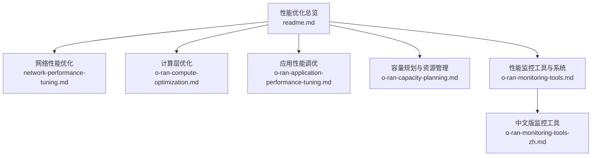
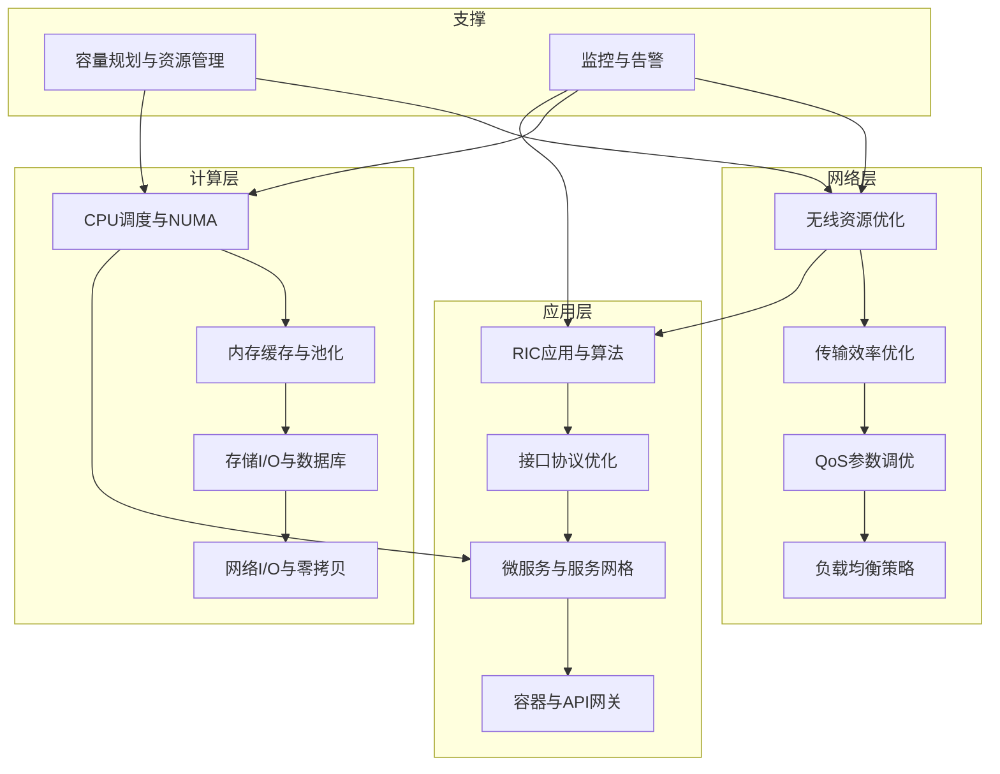
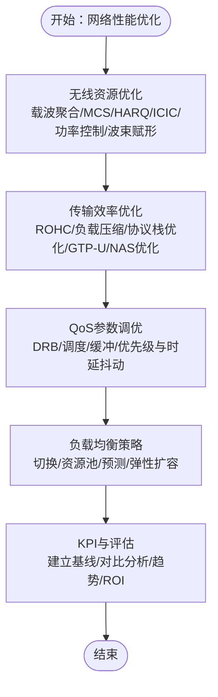
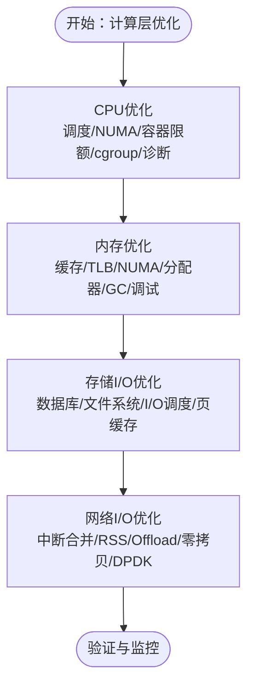
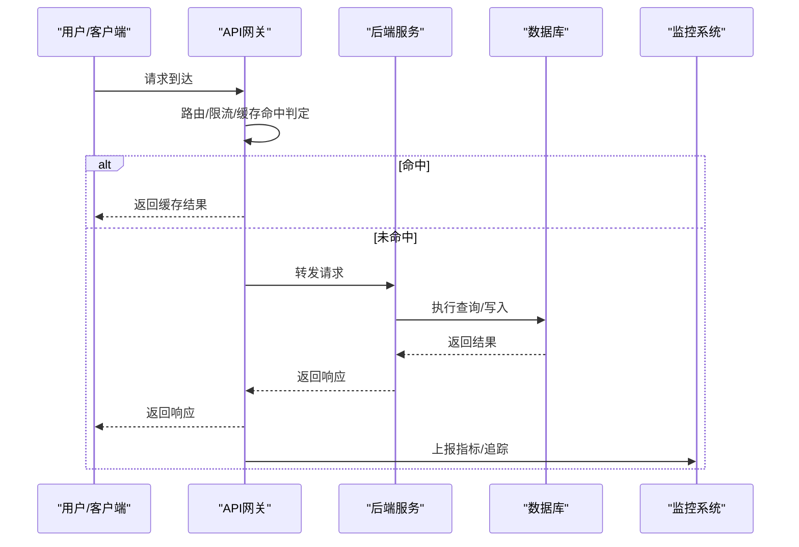
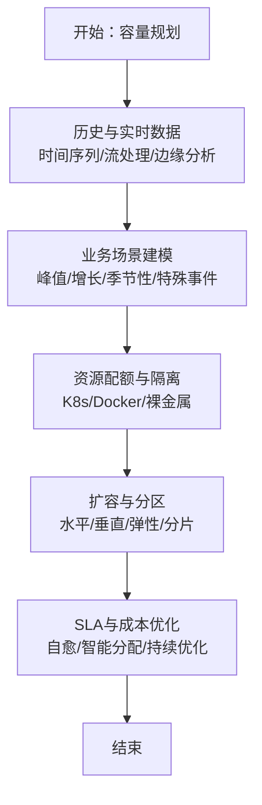
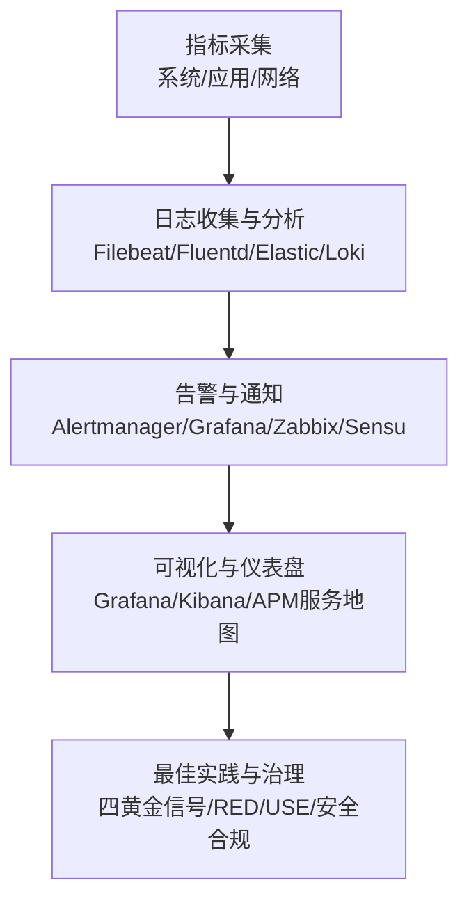
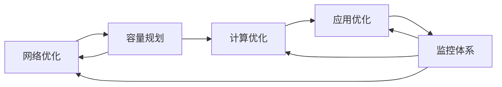

# 性能优化

<cite>
**本文引用的文件**
- [O-RAN 性能优化与调优（总览）](file://26-performance-optimization/readme.md)
- [O-RAN 网络性能优化实践](file://26-performance-optimization/network-optimization/network-performance-tuning.md)
- [O-RAN 计算层优化](file://26-performance-optimization/compute-optimization/o-ran-compute-optimization.md)
- [O-RAN 应用性能调优](file://26-performance-optimization/application-tuning/o-ran-application-performance-tuning.md)
- [O-RAN 容量规划与资源管理](file://26-performance-optimization/capacity-planning/o-ran-capacity-planning.md)
- [O-RAN 性能监控工具与系统](file://26-performance-optimization/monitoring-tools/o-ran-monitoring-tools.md)
- [O-RAN 性能监控工具与系统（中文）](file://26-performance-optimization/monitoring-tools/o-ran-monitoring-tools-zh.md)
</cite>

## 目录
1. [简介](#简介)
2. [项目结构](#项目结构)
3. [核心组件](#核心组件)
4. [架构总览](#架构总览)
5. [详细组件分析](#详细组件分析)
6. [依赖关系分析](#依赖关系分析)
7. [性能考量](#性能考量)
8. [故障排查指南](#故障排查指南)
9. [结论](#结论)
10. [附录](#附录)

## 简介
本文件面向O-RAN系统的性能优化，围绕网络层、计算层、应用层与容量规划、监控体系等维度，提供可落地的优化策略、工具链与实施流程。内容基于仓库中“性能优化”专题文档整理，强调从指标定义、测试验证到持续优化的闭环方法。

## 项目结构
“性能优化”专题位于26-performance-optimization目录下，包含网络优化、计算优化、应用调优、容量规划与监控工具等子主题，形成端到端的性能优化知识体系。

**图示来源**
- [O-RAN 性能优化与调优（总览）](file://26-performance-optimization/readme.md#L1-L67)
- [O-RAN 网络性能优化实践](file://26-performance-optimization/network-optimization/network-performance-tuning.md#L1-L98)
- [O-RAN 计算层优化](file://26-performance-optimization/compute-optimization/o-ran-compute-optimization.md#L1-L473)
- [O-RAN 应用性能调优](file://26-performance-optimization/application-tuning/o-ran-application-performance-tuning.md#L1-L266)
- [O-RAN 容量规划与资源管理](file://26-performance-optimization/capacity-planning/o-ran-capacity-planning.md#L1-L285)
- [O-RAN 性能监控工具与系统](file://26-performance-optimization/monitoring-tools/o-ran-monitoring-tools.md#L1-L355)
- [O-RAN 性能监控工具与系统（中文）](file://26-performance-optimization/monitoring-tools/o-ran-monitoring-tools-zh.md#L1-L355)

**章节来源**
- [O-RAN 性能优化与调优（总览）](file://26-performance-optimization/readme.md#L1-L67)

## 核心组件
- 网络层优化：无线资源优化、传输效率优化、QoS参数调优、负载均衡策略与关键KPI。
- 计算层优化：CPU调度与NUMA亲和、容器CPU限额、内存缓存与池化、数据库与文件系统I/O、网络中断合并与零拷贝。
- 应用层优化：RIC应用（xApps/rApps）、接口协议（E2/A1/O1）、微服务与服务网格、容器性能与API网关。
- 容量规划：负载预测模型、资源配额管理、水平/垂直/混合/弹性扩容、SLA与成本优化。
- 监控体系：指标采集、日志分析、自动化告警、可视化仪表盘与最佳实践。

**章节来源**
- [O-RAN 性能优化与调优（总览）](file://26-performance-optimization/readme.md#L6-L25)
- [O-RAN 网络性能优化实践](file://26-performance-optimization/network-optimization/network-performance-tuning.md#L6-L98)
- [O-RAN 计算层优化](file://26-performance-optimization/compute-optimization/o-ran-compute-optimization.md#L6-L473)
- [O-RAN 应用性能调优](file://26-performance-optimization/application-tuning/o-ran-application-performance-tuning.md#L6-L266)
- [O-RAN 容量规划与资源管理](file://26-performance-optimization/capacity-planning/o-ran-capacity-planning.md#L6-L285)
- [O-RAN 性能监控工具与系统](file://26-performance-optimization/monitoring-tools/o-ran-monitoring-tools.md#L6-L355)

## 架构总览
性能优化贯穿三层：网络层（无线与传输）、计算层（CPU/内存/存储/网络I/O）、应用层（协议与服务编排），并由容量规划与监控体系保障持续优化与风险控制。

**图示来源**
- [O-RAN 性能优化与调优（总览）](file://26-performance-optimization/readme.md#L6-L25)
- [O-RAN 网络性能优化实践](file://26-performance-optimization/network-optimization/network-performance-tuning.md#L6-L98)
- [O-RAN 计算层优化](file://26-performance-optimization/compute-optimization/o-ran-compute-optimization.md#L6-L473)
- [O-RAN 应用性能调优](file://26-performance-optimization/application-tuning/o-ran-application-performance-tuning.md#L6-L266)
- [O-RAN 容量规划与资源管理](file://26-performance-optimization/capacity-planning/o-ran-capacity-planning.md#L6-L285)
- [O-RAN 性能监控工具与系统](file://26-performance-optimization/monitoring-tools/o-ran-monitoring-tools.md#L6-L355)

## 详细组件分析

### 网络性能优化
- 无线资源优化：载波聚合、MCS自适应、HARQ重传、ICIC、功率控制、波束赋形、干扰随机化。
- 传输效率优化：ROHC头部压缩、负载数据压缩、协议栈优化、GTP-U/NAS/S1AP消息优化、5QI精细化配置、PDU会话优化。
- QoS参数调优：DRB配置、调度策略、缓冲区管理、优先级映射与时延抖动控制（WFQ/SP、自适应缓冲、令牌桶整形）。
- 负载均衡：切换参数、负载均衡算法、小区间协调、动态资源池、负载预测、容量弹性与节能休眠。
- 关键KPI与评估：RSRP/SINR、吞吐量、时延/抖动、用户分布不均衡度，以及基准建立、对比分析与ROI评估。

**图示来源**
- [O-RAN 网络性能优化实践](file://26-performance-optimization/network-optimization/network-performance-tuning.md#L6-L98)

**章节来源**
- [O-RAN 网络性能优化实践](file://26-performance-optimization/network-optimization/network-performance-tuning.md#L6-L98)

### 计算层优化
- CPU优化：实时调度（SCHED_FIFO/RR/OTHER）、NUMA亲和、CPU集与隔离、容器CPU请求/限额、cgroup参数；配套perf/内核跟踪诊断。
- 内存优化：L1/L2缓存与指令缓存、TLB与大页、NUMA本地化、缓存一致性与伪共享避免、jemalloc/tcmalloc定制分配器、GC调优、Valgrind/ASan等分析工具。
- 存储I/O优化：PostgreSQL/MySQL/MariaDB/Redis/MongoDB/时序库参数与索引、WAL/Checkpoint/复制优化；ext4/XFS/Btrfs/ZFS参数、I/O调度器、脏页与页面回收、Direct I/O权衡。
- 网络I/O优化：NIC中断合并、RSS、多队列、TSO/GSO/LRO/GRO、DMA与PCIe、NVMe队列深度、RDMA/DPDK/AF_XDP/io_uring、事件驱动与环形缓冲。

**图示来源**
- [O-RAN 计算层优化](file://26-performance-optimization/compute-optimization/o-ran-compute-optimization.md#L6-L473)

**章节来源**
- [O-RAN 计算层优化](file://26-performance-optimization/compute-optimization/o-ran-compute-optimization.md#L6-L473)

### 应用层优化
- RIC应用：xApps/rApps资源分配（CPU亲和/内存/网络/存储优先级）、消息序列化/批处理/异步处理、状态管理与缓存预热、ML加速与实时分析。
- 接口协议：E2AP编码/解码与连接池、订阅与事件过滤、A1策略分发与冲突解决、O1 NETCONF/YANG与SNMP/CLI优化。
- 微服务与服务网格：Istio/Envoy侧车优化、连接池/负载均衡/熔断/超时、服务发现/DNS、遥测与可观测性。
- 容器与API网关：资源限额/启动时间/运行时优化、镜像分层/基础镜像/扫描优化、路由/限流/缓存/安全。

**图示来源**
- [O-RAN 应用性能调优](file://26-performance-optimization/application-tuning/o-ran-application-performance-tuning.md#L131-L199)

**章节来源**
- [O-RAN 应用性能调优](file://26-performance-optimization/application-tuning/o-ran-application-performance-tuning.md#L6-L266)

### 容量规划与资源管理
- 负载预测：时间序列建模（ARIMA/季节分解/平滑/傅里叶）、用户行为聚类/异常检测、实时流处理与边缘分析、可视化与仪表盘。
- 资源配额：Kubernetes Pod资源请求/限制/HPA/VPA/ClusterAutoscaler、Docker/Cgroups资源约束、裸金属CPU集/NUMA/隔离与预留。
- 扩容策略：水平/垂直/混合/弹性扩容、多区域/多数据中心、服务发现与数据分片、滚动升级与零停机。
- 性能与成本：二进制打包/负载分布/能耗/SLA保证、自愈/智能分配/持续优化循环。

**图示来源**
- [O-RAN 容量规划与资源管理](file://26-performance-optimization/capacity-planning/o-ran-capacity-planning.md#L6-L285)

**章节来源**
- [O-RAN 容量规划与资源管理](file://26-performance-optimization/capacity-planning/o-ran-capacity-planning.md#L6-L285)

### 性能监控与工具链
- 观测性框架：基础设施（Node Exporter/云/虚拟化）、应用（APM/服务网格/数据库/API网关）、网络（设备/无线/服务品质/安全）指标采集与分析。
- 日志体系：Filebeat/Fluentd/Logstash/Rsyslog、Elastic/OpenSearch/Loki/ClickHouse存储与分析，Kibana/Grafana可视化。
- 自动化告警：Alertmanager/Grafana/Zabbix/Sensu多通道通知、事件关联与ML降噪、业务影响评估与自愈联动。
- 最佳实践：四黄金信号/RED/USE方法、告警设计与噪音控制、高可用与安全合规、持续改进。

**图示来源**
- [O-RAN 性能监控工具与系统](file://26-performance-optimization/monitoring-tools/o-ran-monitoring-tools.md#L6-L355)
- [O-RAN 性能监控工具与系统（中文）](file://26-performance-optimization/monitoring-tools/o-ran-monitoring-tools-zh.md#L6-L355)

**章节来源**
- [O-RAN 性能监控工具与系统](file://26-performance-optimization/monitoring-tools/o-ran-monitoring-tools.md#L6-L355)
- [O-RAN 性能监控工具与系统（中文）](file://26-performance-optimization/monitoring-tools/o-ran-monitoring-tools-zh.md#L6-L355)

## 依赖关系分析
- 网络优化依赖容量规划提供的负载预测与资源配额，以实现动态调度与弹性扩容。
- 计算层优化为应用层提供稳定高效的运行基座（CPU/内存/存储/网络I/O）。
- 应用层优化（协议与微服务）依赖监控体系进行端到端可观测与告警。
- 监控体系贯穿各层，形成闭环反馈，驱动容量规划与持续优化。

**图示来源**
- [O-RAN 性能优化与调优（总览）](file://26-performance-optimization/readme.md#L6-L25)
- [O-RAN 网络性能优化实践](file://26-performance-optimization/network-optimization/network-performance-tuning.md#L6-L98)
- [O-RAN 计算层优化](file://26-performance-optimization/compute-optimization/o-ran-compute-optimization.md#L6-L473)
- [O-RAN 应用性能调优](file://26-performance-optimization/application-tuning/o-ran-application-performance-tuning.md#L6-L266)
- [O-RAN 容量规划与资源管理](file://26-performance-optimization/capacity-planning/o-ran-capacity-planning.md#L6-L285)
- [O-RAN 性能监控工具与系统](file://26-performance-optimization/monitoring-tools/o-ran-monitoring-tools.md#L6-L355)

## 性能考量
- 指标定义：结合四黄金信号/RED/USE方法，明确延迟、流量、错误率与饱和度；网络层关注RSRP/SINR、吞吐量、时延/抖动、用户分布不均衡度。
- 测试与验证：合成负载测试（JMeter/Gatling/Locust）、真实场景验证（生产类环境/金丝雀）、混沌工程与持续监控、回归测试与门禁。
- 资源与成本：在满足SLA前提下平衡成本，利用Spot实例/预留/多云策略，配合bin-packing与能耗优化。
- 可靠性与安全：监控系统高可用、数据加密与审计、合规要求与持续改进。

[本节为通用指导，无需具体文件引用]

## 故障排查指南
- 快速定位：使用top/htop/vmstat/sar/strace/perf定位CPU瓶颈；使用iotop/iostat/vmstat定位磁盘瓶颈；使用iftop/tcpdump抓包定位网络瓶颈。
- 日志与追踪：集中式日志（ELK/OpenSearch/Loki）+ 分布式追踪（Jaeger/OpenTelemetry）+ 仪表盘（Grafana/Kibana）。
- 告警与自愈：基于业务影响的分级告警、事件关联与根因分析、ChatOps/Runbook自动化处置。
- 回归与复盘：版本对比分析、性能delta识别、优化效果验证与知识沉淀。

**章节来源**
- [O-RAN 性能监控工具与系统](file://26-performance-optimization/monitoring-tools/o-ran-monitoring-tools.md#L286-L355)

## 结论
通过系统化的网络、计算、应用与容量规划优化，并辅以完善的监控与告警体系，O-RAN系统可在复杂场景下实现高吞吐、低时延、高可靠与低成本的综合性能目标。建议以“建立基线—识别瓶颈—制定策略—验证—部署—评估”的闭环流程推进优化工作。

[本节为总结，无需具体文件引用]

## 附录
- 性能优化实施流程（总览）
  1) 建立性能基线：采集正常工况下的关键指标。
  2) 识别瓶颈：利用系统/网络/应用/日志工具定位。
  3) 根因分析：结合容量规划与架构特性进行深入分析。
  4) 制定策略：针对网络/计算/应用/容量维度提出优化方案。
  5) 效果验证：合成/真实场景测试与回归分析。
  6) 部署与监控：灰度发布、自动化告警与可视化跟踪。
  7) 持续优化：定期评估、迭代改进与知识沉淀。

**章节来源**
- [O-RAN 性能优化与调优（总览）](file://26-performance-optimization/readme.md#L26-L34)