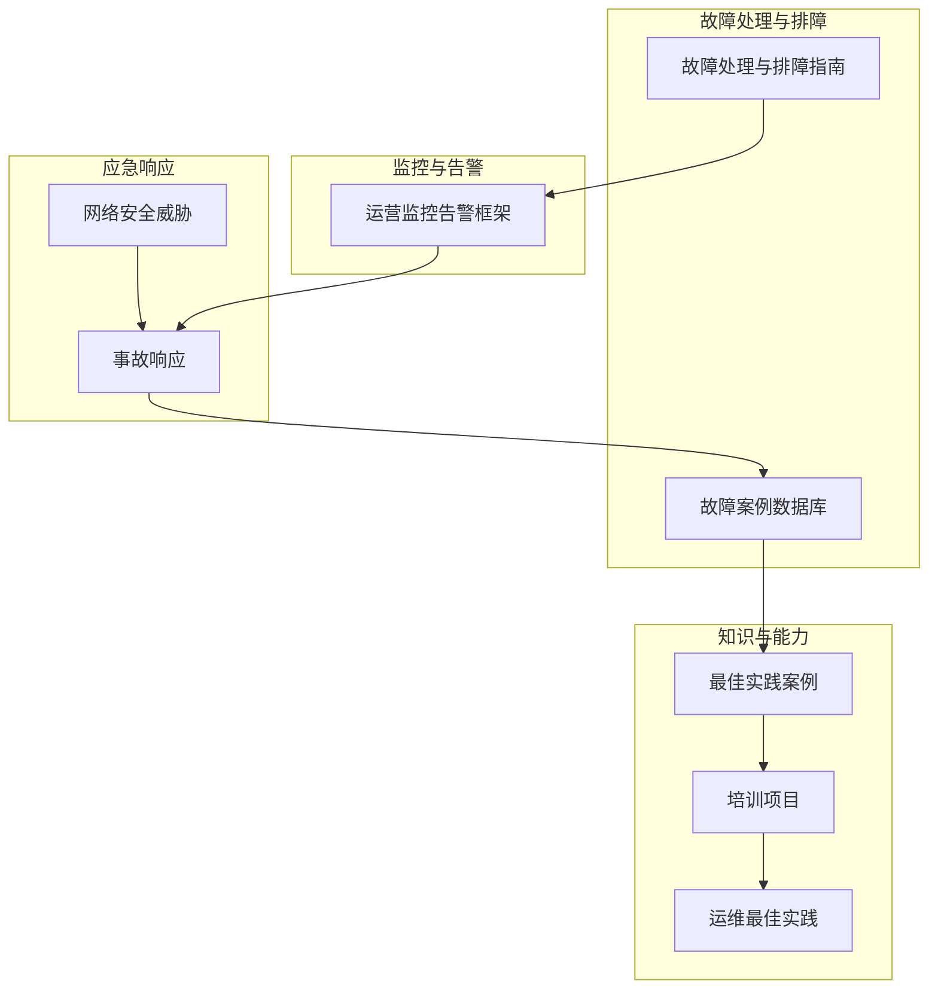
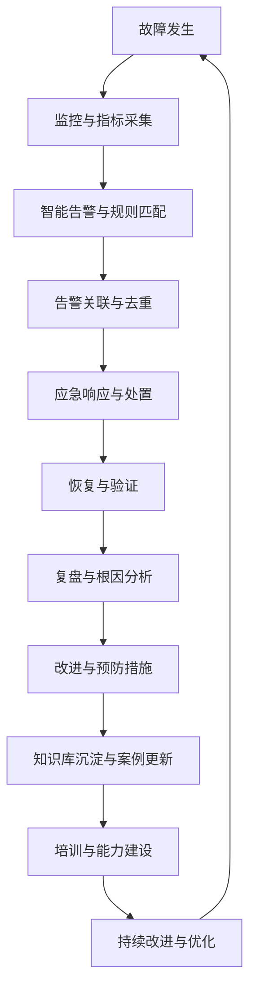
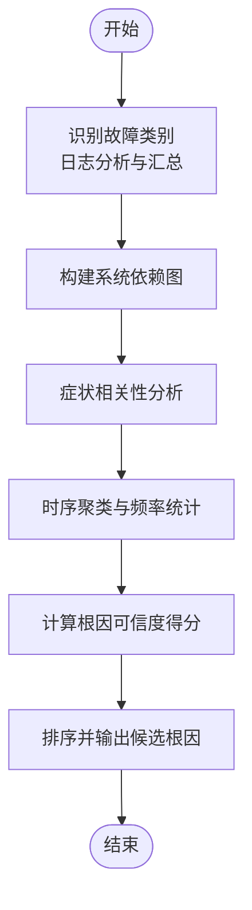
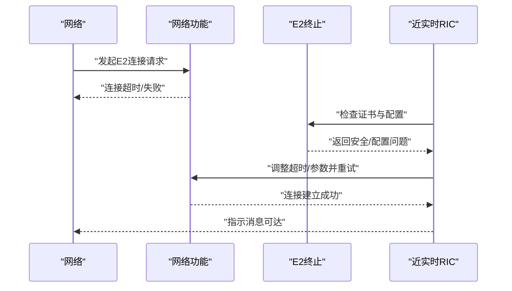
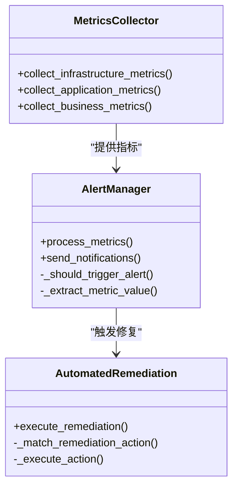
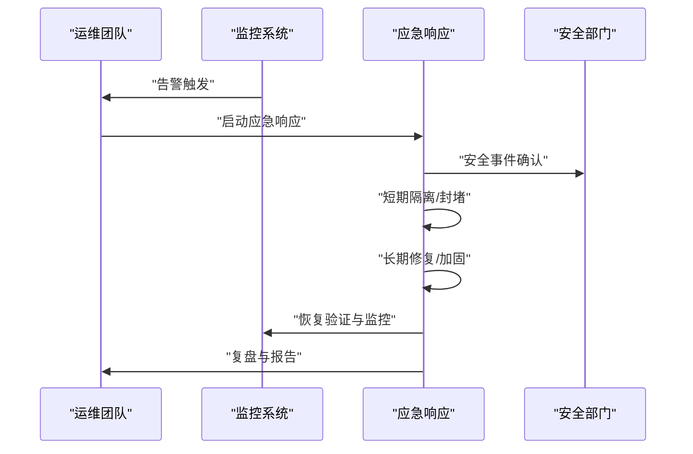
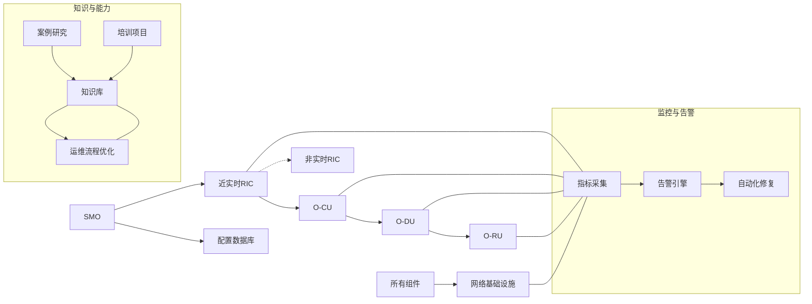
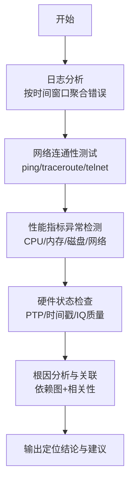
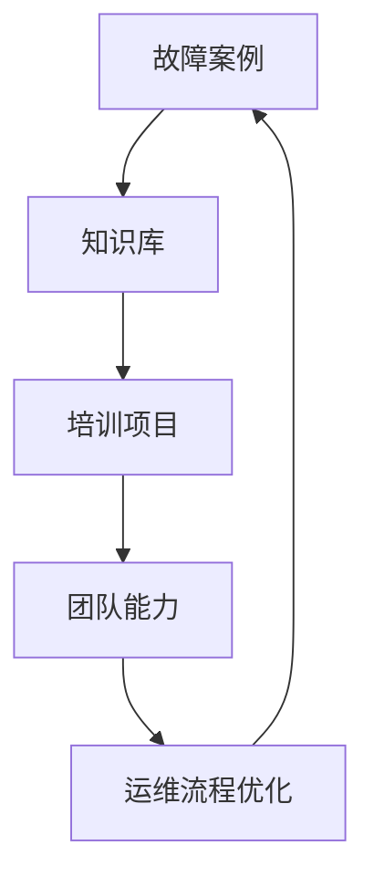

# 故障处理

<cite>
**本文引用的文件**
- [故障处理与排障指南（英文）](file://14-operations-management/fault-handling/fault-troubleshooting-guide.md)
- [运营监控告警框架（中文）](file://14-operations-management/monitoring-alerting/operations-monitoring-framework-zh.md)
- [O-RAN 最佳实践案例（中文）](file://21-case-studies/best-practices/o-ran-best-practice-cases-zh.md)
- [O-RAN 培训项目（中文）](file://19-talent-development/training-programs/o-ran-training-framework-zh.md)
- [O-RAN 故障案例数据库（中文）](file://27-troubleshooting-diagnosis/fault-library/o-ran-fault-case-database-zh.md)
- [O-RAN 事故响应（英文）](file://29-security-threats/incident-response/o-ran-incident-response.md)
- [O-RAN 运维最佳实践（英文）](file://30-best-practices/operations-practices/o-ran-operations-best-practices.md)
- [O-RAN 网络安全威胁（中文）](file://29-security-threats/threat-analysis/network-security-threats.md)
</cite>

## 目录
1. [简介](#简介)
2. [项目结构](#项目结构)
3. [核心组件](#核心组件)
4. [架构总览](#架构总览)
5. [详细组件分析](#详细组件分析)
6. [依赖分析](#依赖分析)
7. [性能考量](#性能考量)
8. [故障定位与诊断](#故障定位与诊断)
9. [紧急响应程序](#紧急响应程序)
10. [故障恢复与最佳实践](#故障恢复与最佳实践)
11. [事后分析与改进](#事后分析与改进)
12. [知识库建设与团队能力提升](#知识库建设与团队能力提升)
13. [结论](#结论)

## 简介
本文件面向O-RAN网络的故障处理与运维管理，系统化梳理快速故障定位方法、紧急响应流程、恢复策略与事后改进，并结合知识库建设与团队能力建设，形成闭环的运维体系。内容来源于仓库中的故障处理、监控告警、案例研究、培训体系、事故响应与最佳实践等文档，旨在帮助读者建立可落地的故障管理体系。

## 项目结构
围绕故障处理，仓库中与之直接相关的主要模块如下：
- 故障处理与排障指南：提供故障分类、诊断方法、常见场景与恢复步骤
- 运营监控告警框架：提供多层监控、指标采集、智能告警与自动化修复
- 案例研究：汇集最佳实践，提炼可复制的经验与方法论
- 培训项目：提供从基础到专业的系统化培训路径
- 故障案例数据库：沉淀故障案例、预防性维护与知识共享
- 事故响应：提供检测、分析、处置、恢复与复盘的标准流程
- 运维最佳实践：涵盖知识管理、持续改进与团队能力建设

**图表来源**
- [故障处理与排障指南（英文）](file://14-operations-management/fault-handling/fault-troubleshooting-guide.md#L1-L633)
- [运营监控告警框架（中文）](file://14-operations-management/monitoring-alerting/operations-monitoring-framework-zh.md#L1-L909)
- [O-RAN 最佳实践案例（中文）](file://21-case-studies/best-practices/o-ran-best-practice-cases-zh.md#L1-L210)
- [O-RAN 培训项目（中文）](file://19-talent-development/training-programs/o-ran-training-framework-zh.md#L1-L329)
- [O-RAN 故障案例数据库（中文）](file://27-troubleshooting-diagnosis/fault-library/o-ran-fault-case-database-zh.md#L171-L225)
- [O-RAN 事故响应（英文）](file://29-security-threats/incident-response/o-ran-incident-response.md#L45-L105)
- [O-RAN 网络安全威胁（中文）](file://29-security-threats/threat-analysis/network-security-threats.md#L1-L200)

**章节来源**
- [故障处理与排障指南（英文）](file://14-operations-management/fault-handling/fault-troubleshooting-guide.md#L1-L633)
- [运营监控告警框架（中文）](file://14-operations-management/monitoring-alerting/operations-monitoring-framework-zh.md#L1-L909)

## 核心组件
- 故障分类与影响评估：按网络功能、接口协议、基础设施三大类划分，明确各类故障的典型症状与影响范围
- 诊断方法论：包含初始问题识别、根因分析框架、相关性分析与依赖图建模
- 常见场景与恢复：覆盖E2/F1/O-FH接口问题、同步与时钟问题、性能与资源瓶颈等
- 监控与告警：多层指标采集、阈值规则、告警关联与去重、通知通道与自动化修复
- 应急响应：检测与分析、短期/长期处置、恢复与复盘
- 知识库与培训：案例沉淀、预防性维护、培训体系与持续改进

**章节来源**
- [故障处理与排障指南（英文）](file://14-operations-management/fault-handling/fault-troubleshooting-guide.md#L6-L30)
- [运营监控告警框架（中文）](file://14-operations-management/monitoring-alerting/operations-monitoring-framework-zh.md#L10-L44)

## 架构总览
下图展示了从“故障发生”到“知识沉淀”的闭环架构，强调“监控-告警-处置-恢复-复盘-改进-培训-知识库”的循环。

**图表来源**
- [运营监控告警框架（中文）](file://14-operations-management/monitoring-alerting/operations-monitoring-framework-zh.md#L262-L528)
- [O-RAN 事故响应（英文）](file://29-security-threats/incident-response/o-ran-incident-response.md#L45-L105)
- [O-RAN 故障案例数据库（中文）](file://27-troubleshooting-diagnosis/fault-library/o-ran-fault-case-database-zh.md#L171-L225)
- [O-RAN 培训项目（中文）](file://19-talent-development/training-programs/o-ran-training-framework-zh.md#L1-L329)

## 详细组件分析

### 1) 故障分类与影响评估
- 网络功能故障：RIC、O-RU、O-DU、O-CU、SMO等组件失效
- 接口与协议故障：E2/F1/O-FH接口、控制/用户平面问题
- 基础设施与平台故障：计算/存储/网络/安全/监控系统问题
- 影响评估：从服务可用性、性能、业务KPI等维度量化影响

**章节来源**
- [故障处理与排障指南（英文）](file://14-operations-management/fault-handling/fault-troubleshooting-guide.md#L8-L30)

### 2) 诊断方法论与根因分析
- 初始问题识别：脚本化识别故障类别、日志分析与汇总
- 根因分析框架：构建依赖图、症状相关性分析、时序聚类与严重度评估
- 依赖图建模：SMO→RIC→CU→DU→RU，以及RIC间与基础设施的关系

**图表来源**
- [故障处理与排障指南（英文）](file://14-operations-management/fault-handling/fault-troubleshooting-guide.md#L100-L180)

**章节来源**
- [故障处理与排障指南（英文）](file://14-operations-management/fault-handling/fault-troubleshooting-guide.md#L31-L180)

### 3) 常见故障场景与恢复步骤
- E2接口连接建立失败：网络连通性、证书与安全、配置参数校验；重启服务、重新配置安全、调整超时
- F1接口性能问题：吞吐与延迟、资源利用率、流量分析；网络参数调优、QoS与缓冲、拆分选项优化
- O-FH同步问题：PTP同步、硬件时间戳、信号质量；主时钟稳定、网络优化、校准补偿

**图表来源**
- [故障处理与排障指南（英文）](file://14-operations-management/fault-handling/fault-troubleshooting-guide.md#L266-L344)

**章节来源**
- [故障处理与排障指南（英文）](file://14-operations-management/fault-handling/fault-troubleshooting-guide.md#L266-L537)

### 4) 监控与告警系统
- 多层监控：基础设施、应用、业务三层指标
- 指标采集：CPU/内存/磁盘/网络、K8s状态、存储、服务与性能、KPI/SLA/QoS/业务影响
- 智能告警：阈值规则、告警分类与严重度、关联与去重、通知通道
- 自愈动作：针对CPU/内存/RIC无响应等场景的自动修复流程

**图表来源**
- [运营监控告警框架（中文）](file://14-operations-management/monitoring-alerting/operations-monitoring-framework-zh.md#L48-L260)
- [运营监控告警框架（中文）](file://14-operations-management/monitoring-alerting/operations-monitoring-framework-zh.md#L266-L528)
- [运营监控告警框架（中文）](file://14-operations-management/monitoring-alerting/operations-monitoring-framework-zh.md#L698-L806)

**章节来源**
- [运营监控告警框架（中文）](file://14-operations-management/monitoring-alerting/operations-monitoring-framework-zh.md#L46-L528)

### 5) 应急响应程序
- 准备阶段：预案文档、联系人清单、工具与备份、演练与培训
- 检测与分析：自动告警、人工上报、第三方通知、主动发现；初步分级与资源动员
- 隔离与消除：短期/长期隔离、永久修复、配置加固、访问控制更新、监控增强
- 恢复与复盘：系统重建、数据恢复、功能验证、安全验证；根因调查、影响评估、经验总结、报告生成

**图表来源**
- [O-RAN 事故响应（英文）](file://29-security-threats/incident-response/o-ran-incident-response.md#L45-L105)

**章节来源**
- [O-RAN 事故响应（英文）](file://29-security-threats/incident-response/o-ran-incident-response.md#L45-L105)

## 依赖分析
- 组件耦合：SMO→RIC→CU→DU→RU的链路是故障传播的关键路径；RIC之间与配置数据库也存在依赖
- 监控与告警：指标采集层为告警引擎提供输入，告警触发自动化修复；修复结果反馈到监控形成闭环
- 知识与能力：案例与培训支撑知识库建设，知识库沉淀推动流程优化与能力建设

**图表来源**
- [故障处理与排障指南（英文）](file://14-operations-management/fault-handling/fault-troubleshooting-guide.md#L113-L126)
- [运营监控告警框架（中文）](file://14-operations-management/monitoring-alerting/operations-monitoring-framework-zh.md#L48-L260)
- [O-RAN 最佳实践案例（中文）](file://21-case-studies/best-practices/o-ran-best-practice-cases-zh.md#L130-L177)
- [O-RAN 培训项目（中文）](file://19-talent-development/training-programs/o-ran-training-framework-zh.md#L1-L329)

**章节来源**
- [故障处理与排障指南（英文）](file://14-operations-management/fault-handling/fault-troubleshooting-guide.md#L113-L126)
- [运营监控告警框架（中文）](file://14-operations-management/monitoring-alerting/operations-monitoring-framework-zh.md#L48-L260)

## 性能考量
- 指标粒度与频率：基础设施层每30秒采集一次，应用层与业务层按需调整，避免过度采样造成开销
- 告警阈值与去重：基于历史基线与趋势设定阈值，避免噪声告警；通过关联规则合并相似事件
- 自愈动作的超时与重试：为修复动作设置最大尝试次数与超时，防止雪崩效应
- 仪表板与可视化：实时展示系统状态、关键指标与活跃告警，便于快速判断

**章节来源**
- [运营监控告警框架（中文）](file://14-operations-management/monitoring-alerting/operations-monitoring-framework-zh.md#L48-L260)
- [运营监控告警框架（中文）](file://14-operations-management/monitoring-alerting/operations-monitoring-framework-zh.md#L266-L528)

## 故障定位与诊断
- 快速定位方法
  - 日志分析：按时间窗口聚合关键错误、组件错误与错误模式统计
  - 网络连通性：基础ping/路由、端口telnet、抓包分析E2/F1/O-FH流量
  - 性能指标异常检测：CPU/内存/磁盘/网络IO/软中断统计、应用层指标
  - 硬件状态检查：PTP同步、硬件时间戳、IQ样本质量、环境温湿度
- 工具与脚本
  - 日志分析脚本：journalctl过滤、组件日志聚合、错误模式统计
  - 抓包与分析：tcpdump/tshark对E2/F1/O-FH进行协议分析与统计
  - 资源监控：top/free/iostat/ethtool/软中断统计
  - 同步校验：ptp4l/pmc/硬件时间戳校验与补偿

**图表来源**
- [故障处理与排障指南（英文）](file://14-operations-management/fault-handling/fault-troubleshooting-guide.md#L35-L97)
- [故障处理与排障指南（英文）](file://14-operations-management/fault-handling/fault-troubleshooting-guide.md#L184-L261)

**章节来源**
- [故障处理与排障指南（英文）](file://14-operations-management/fault-handling/fault-troubleshooting-guide.md#L35-L97)
- [故障处理与排障指南（英文）](file://14-operations-management/fault-handling/fault-troubleshooting-guide.md#L184-L261)

## 紧急响应程序
- 故障报告：告警触发后，自动记录告警元数据与受影响组件
- 影响评估：基于业务KPI与SLA评估影响范围与严重度
- 应急决策：依据预案与自动化修复能力，决定隔离、降级或快速修复
- 资源调配：按严重度调派相应级别人员与工具
- 响应记录：全程记录处置过程、决策依据与结果，形成可追溯的工单

**章节来源**
- [O-RAN 事故响应（英文）](file://29-security-threats/incident-response/o-ran-incident-response.md#L45-L105)
- [运营监控告警框架（中文）](file://14-operations-management/monitoring-alerting/operations-monitoring-framework-zh.md#L266-L528)

## 故障恢复与最佳实践
- 隔离策略：网络隔离、账户冻结、服务关停、证据保全
- 降级方案：启用备用路径、降低QoS保障关键业务、临时关闭非关键功能
- 快速修复：重启服务、调整参数、更新证书、优化网络与缓冲
- 系统恢复验证：干净重建、从备份恢复、功能与安全验证
- 预防机制：补丁与更新管理、配置审计、性能基线维护、预测性维护

**章节来源**
- [O-RAN 事故响应（英文）](file://29-security-threats/incident-response/o-ran-incident-response.md#L77-L105)
- [运营监控告警框架（中文）](file://14-operations-management/monitoring-alerting/operations-monitoring-framework-zh.md#L698-L806)
- [O-RAN 故障案例数据库（中文）](file://27-troubleshooting-diagnosis/fault-library/o-ran-fault-case-database-zh.md#L171-L225)

## 事后分析与改进
- 故障复盘会议：根因分析、影响评估、责任认定与改进建议
- 根因分析：使用依赖图与相关性分析，结合历史案例与趋势
- 改进措施：完善流程、工具与培训，建立预防机制
- 预防机制：补丁管理、配置基线、性能基线、知识库更新

**章节来源**
- [O-RAN 事故响应（英文）](file://29-security-threats/incident-response/o-ran-incident-response.md#L92-L105)
- [O-RAN 故障案例数据库（中文）](file://27-troubleshooting-diagnosis/fault-library/o-ran-fault-case-database-zh.md#L171-L225)
- [O-RAN 事故响应（英文）](file://29-security-threats/incident-response/o-ran-incident-response.md#L45-L105)

## 知识库建设与团队能力提升
- 故障案例整理：标准化案例格式、根因分析、解决程序、知识共享
- 经验总结：定期案例审查、最佳实践提炼、流程优化
- 知识分类与共享：集中存储库、搜索功能、版本控制、培训材料
- 持续的知识传承：导师项目、工作坊、认证与能力评估、职业发展支持

**图表来源**
- [O-RAN 故障案例数据库（中文）](file://27-troubleshooting-diagnosis/fault-library/o-ran-fault-case-database-zh.md#L208-L225)
- [O-RAN 培训项目（中文）](file://19-talent-development/training-programs/o-ran-training-framework-zh.md#L1-L329)
- [O-RAN 事故响应（英文）](file://29-security-threats/incident-response/o-ran-incident-response.md#L92-L105)

**章节来源**
- [O-RAN 故障案例数据库（中文）](file://27-troubleshooting-diagnosis/fault-library/o-ran-fault-case-database-zh.md#L171-L225)
- [O-RAN 培训项目（中文）](file://19-talent-development/training-programs/o-ran-training-framework-zh.md#L1-L329)
- [O-RAN 事故响应（英文）](file://29-security-threats/incident-response/o-ran-incident-response.md#L92-L105)

## 结论
通过系统化的故障分类、科学的诊断方法、完善的监控告警与应急响应、严格的恢复验证与预防机制，以及持续的知识库建设与团队能力建设，O-RAN网络可以显著降低故障影响、缩短恢复时间并提升整体可靠性。建议将上述流程固化为标准作业程序（SOP），并结合案例与培训持续优化，形成可持续演进的运维体系。