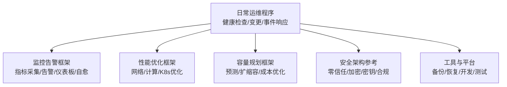
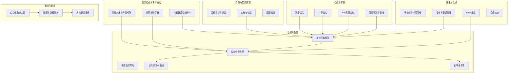
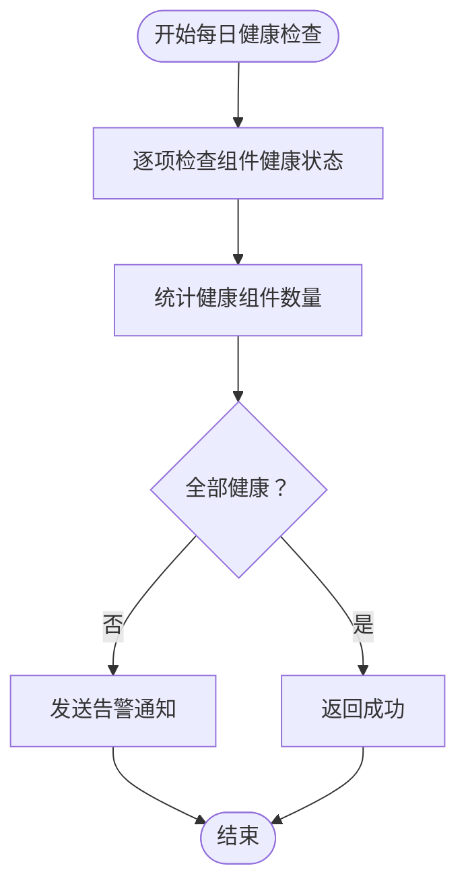
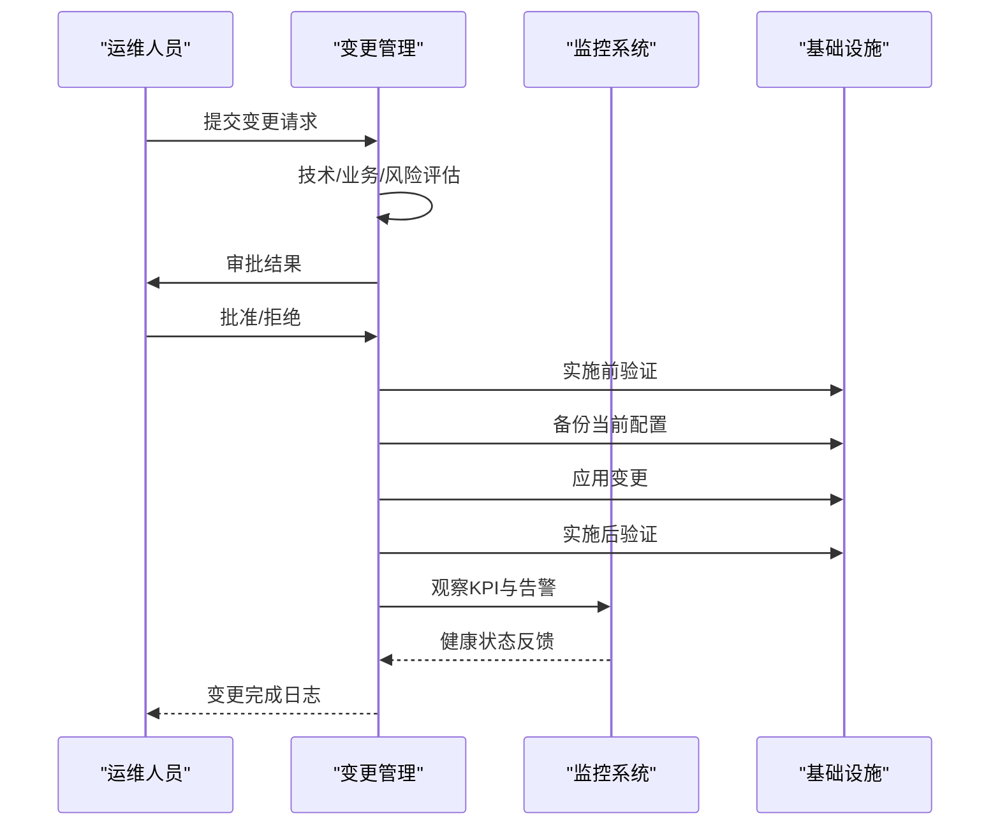
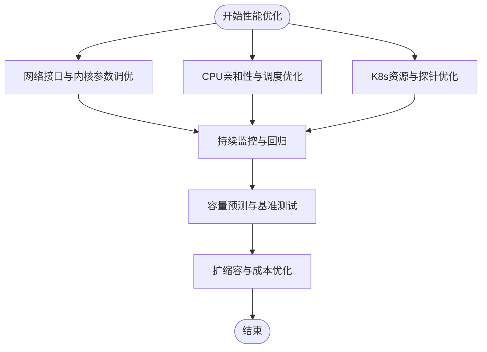
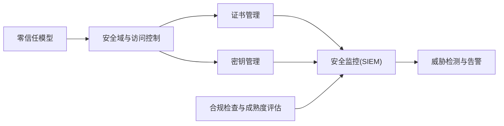
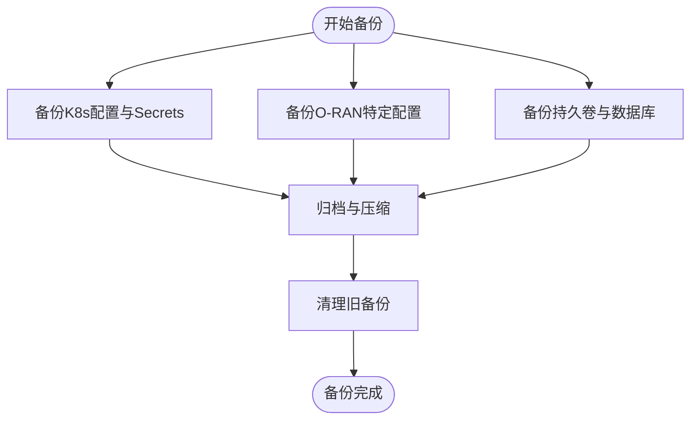
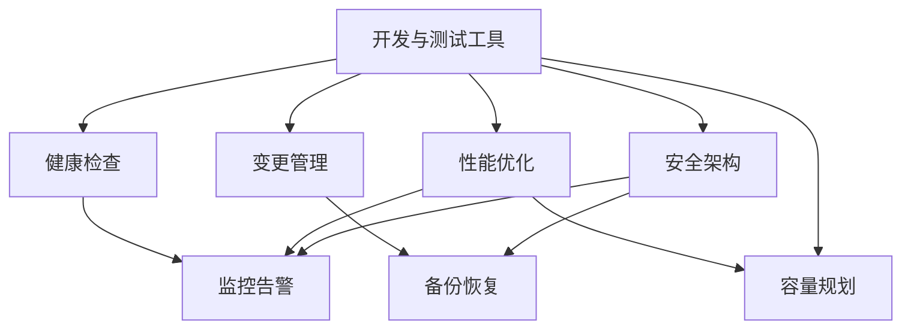
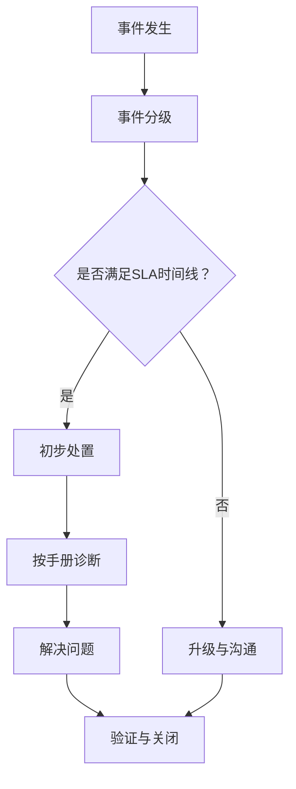

# 日常运维

<cite>
**本文引用的文件**   
- [日常运维程序（中文）](file://14-operations-management/daily-operations/daily-operation-procedures-zh.md)
- [运营监控告警系统（中文）](file://14-operations-management/monitoring-alerting/operations-monitoring-framework-zh.md)
- [性能优化框架（中文）](file://14-operations-management/performance-optimization/performance-optimization-framework-zh.md)
- [容量规划框架（中文）](file://14-operations-management/capacity-planning/capacity-planning-framework-zh.md)
- [安全架构参考（中文）](file://12-security-privacy/security-architecture/security-reference-architecture-zh.md)
- [O-RAN配置备份工具（中文）](file://22-tool-platforms/utility-programs/o-ran-utility-programs-zh.md)
- [O-RAN开发工具包（中文）](file://22-tool-platforms/development-tools/o-ran-development-toolkit-zh.md)
</cite>

## 目录
1. [引言](#引言)
2. [项目结构](#项目结构)
3. [核心组件](#核心组件)
4. [架构总览](#架构总览)
5. [详细组件分析](#详细组件分析)
6. [依赖分析](#依赖分析)
7. [性能考量](#性能考量)
8. [故障排查指南](#故障排查指南)
9. [结论](#结论)
10. [附录](#附录)

## 引言
本文件面向O-RAN日常运维，围绕系统健康状态检查、配置变更管理、软件版本升级策略、补丁与安全更新、备份与恢复等关键运维主题，提供可落地的操作指导与流程规范。内容来源于仓库中的运维、监控、安全、开发与工具平台文档，确保读者能够依据现有材料建立标准化的运维体系。

## 项目结构
本仓库包含大量与O-RAN相关的专题文档，其中与“日常运维”直接相关的内容主要分布在以下主题：
- 运维与日常操作：健康检查、变更管理、事件响应、故障排除
- 监控与告警：多层监控、指标采集、智能告警、仪表板、自动化修复
- 性能优化：网络与计算层优化、Kubernetes资源优化、性能仪表板
- 容量规划：负载预测、自动扩缩容、成本优化、容量基准测试
- 安全架构：零信任模型、加密与证书管理、密钥管理、SIEM集成
- 工具与平台：备份与恢复工具、开发与测试工具、CI/CD流水线

**章节来源**
- file://14-operations-management/daily-operations/daily-operation-procedures-zh.md#L1-L419
- file://14-operations-management/monitoring-alerting/operations-monitoring-framework-zh.md#L1-L909
- file://14-operations-management/performance-optimization/performance-optimization-framework-zh.md#L1-L342
- file://14-operations-management/capacity-planning/capacity-planning-framework-zh.md#L1-L505
- file://12-security-privacy/security-architecture/security-reference-architecture-zh.md#L1-L530
- file://22-tool-platforms/utility-programs/o-ran-utility-programs-zh.md#L563-L626
- file://22-tool-platforms/development-tools/o-ran-development-toolkit-zh.md#L1-L488

## 核心组件
- 健康检查与网络监控：提供每日健康检查脚本、网络接口监控与告警、KPI仪表板与性能告警规则
- 配置管理与变更流程：标准化变更请求、评估与审批、实施与验证、回滚机制
- 性能与容量：网络与计算层优化、Kubernetes资源优化、容量预测与基准测试
- 安全与合规：零信任与纵深防御、证书与密钥管理、SIEM集成与合规检查
- 备份与恢复：自动化备份工具、配置与数据保护、灾难恢复编排

**章节来源**
- file://14-operations-management/daily-operations/daily-operation-procedures-zh.md#L6-L66
- file://14-operations-management/daily-operations/daily-operation-procedures-zh.md#L163-L281
- file://14-operations-management/monitoring-alerting/operations-monitoring-framework-zh.md#L46-L260
- file://14-operations-management/performance-optimization/performance-optimization-framework-zh.md#L8-L101
- file://14-operations-management/capacity-planning/capacity-planning-framework-zh.md#L8-L186
- file://12-security-privacy/security-architecture/security-reference-architecture-zh.md#L8-L71
- file://22-tool-platforms/utility-programs/o-ran-utility-programs-zh.md#L563-L626

## 架构总览
运维体系由“健康检查—监控告警—变更管理—性能优化—容量规划—安全合规—备份恢复—工具平台”构成闭环，支撑O-RAN系统的稳定运行与持续演进。

**图示来源**
- file://14-operations-management/daily-operations/daily-operation-procedures-zh.md#L6-L66
- file://14-operations-management/monitoring-alerting/operations-monitoring-framework-zh.md#L6-L260
- file://14-operations-management/performance-optimization/performance-optimization-framework-zh.md#L8-L101
- file://14-operations-management/capacity-planning/capacity-planning-framework-zh.md#L8-L186
- file://12-security-privacy/security-architecture/security-reference-architecture-zh.md#L8-L71
- file://22-tool-platforms/utility-programs/o-ran-utility-programs-zh.md#L563-L626

## 详细组件分析

### 健康检查与网络监控
- 每日健康检查：对近端RT RIC、O-DU、O-CU、SMO等组件进行健康检查，统计健康组件数量并触发告警
- 网络接口监控：基于psutil监控接口状态、错误率、带宽利用率，设定阈值并发送告警
- KPI仪表板与性能告警：Prometheus查询表达式与告警规则，保障系统可用性与性能

**图示来源**
- file://14-operations-management/daily-operations/daily-operation-procedures-zh.md#L8-L66

**章节来源**
- file://14-operations-management/daily-operations/daily-operation-procedures-zh.md#L6-L66
- file://14-operations-management/monitoring-alerting/operations-monitoring-framework-zh.md#L361-L417

### 配置管理与变更流程
- 配置备份与恢复：定义备份计划、位置与配置项，提供备份脚本示例
- 变更管理流程：变更请求、技术与业务评估、审批、实施前/后验证、回滚机制
- 变更实施脚本：标准化变更实施步骤，包含验证与日志记录

**图示来源**
- file://14-operations-management/daily-operations/daily-operation-procedures-zh.md#L165-L281

**章节来源**
- file://14-operations-management/daily-operations/daily-operation-procedures-zh.md#L163-L281

### 性能优化与容量规划
- 网络性能优化：接口调优、内核参数、NUMA感知绑定与流量优先级队列
- 计算性能优化：CPU亲和性与调度、内核调度器调优
- Kubernetes资源优化：Deployment资源配置、探针与环境变量
- 容量规划：负载预测模型、自动扩缩容策略、成本优化与容量基准测试

**图示来源**
- file://14-operations-management/performance-optimization/performance-optimization-framework-zh.md#L8-L101
- file://14-operations-management/performance-optimization/performance-optimization-framework-zh.md#L103-L234
- file://14-operations-management/performance-optimization/performance-optimization-framework-zh.md#L236-L340
- file://14-operations-management/capacity-planning/capacity-planning-framework-zh.md#L8-L186
- file://14-operations-management/capacity-planning/capacity-planning-framework-zh.md#L230-L266

**章节来源**
- file://14-operations-management/performance-optimization/performance-optimization-framework-zh.md#L8-L342
- file://14-operations-management/capacity-planning/capacity-planning-framework-zh.md#L8-L505

### 安全架构与合规
- 零信任与纵深防御：安全域划分、访问控制与加密要求
- 证书与密钥管理：CA层次结构、组件证书颁发与密钥派生
- SIEM集成：安全事件收集、威胁检测与告警
- 合规检查：自动化合规脚本与成熟度评估

**图示来源**
- file://12-security-privacy/security-architecture/security-reference-architecture-zh.md#L8-L71
- file://12-security-privacy/security-architecture/security-reference-architecture-zh.md#L73-L245
- file://12-security-privacy/security-architecture/security-reference-architecture-zh.md#L339-L484

**章节来源**
- file://12-security-privacy/security-architecture/security-reference-architecture-zh.md#L1-L530

### 备份与恢复
- 自动化备份工具：配置、数据与日志的结构化备份，归档与清理策略
- 配置与数据保护：Kubernetes资源、Secrets、ConfigMaps、持久卷与数据库备份
- 灾难恢复编排：时间点恢复、自动化恢复程序与回滚机制

**图示来源**
- file://22-tool-platforms/utility-programs/o-ran-utility-programs-zh.md#L584-L626

**章节来源**
- file://22-tool-platforms/utility-programs/o-ran-utility-programs-zh.md#L563-L626

### 开发与测试工具（支撑运维）
- 开发环境与版本控制：IDE扩展、分支策略与Git钩子
- 代码质量与安全扫描：SonarQube、SAST/SCA/容器扫描
- 仿真与测试：NS-3 O-RAN扩展、协议分析、Docker/K8s开发环境
- API与CI/CD：OpenAPI规范、Postman/ Newman、GitHub Actions流水线

**章节来源**
- file://22-tool-platforms/development-tools/o-ran-development-toolkit-zh.md#L64-L109
- file://22-tool-platforms/development-tools/o-ran-development-toolkit-zh.md#L111-L172
- file://22-tool-platforms/development-tools/o-ran-development-toolkit-zh.md#L174-L257
- file://22-tool-platforms/development-tools/o-ran-development-toolkit-zh.md#L259-L366
- file://22-tool-platforms/development-tools/o-ran-development-toolkit-zh.md#L419-L488

## 依赖分析
- 健康检查依赖监控系统提供的指标与告警通道
- 变更流程依赖配置备份与恢复工具，确保可回滚
- 性能优化依赖容量规划与监控告警的反馈闭环
- 安全架构为监控、备份与变更提供合规与风险基线
- 工具平台为上述流程提供自动化与标准化支撑

**图示来源**
- file://14-operations-management/daily-operations/daily-operation-procedures-zh.md#L6-L66
- file://14-operations-management/monitoring-alerting/operations-monitoring-framework-zh.md#L6-L260
- file://14-operations-management/performance-optimization/performance-optimization-framework-zh.md#L8-L101
- file://14-operations-management/capacity-planning/capacity-planning-framework-zh.md#L8-L186
- file://12-security-privacy/security-architecture/security-reference-architecture-zh.md#L8-L71
- file://22-tool-platforms/utility-programs/o-ran-utility-programs-zh.md#L563-L626
- file://22-tool-platforms/development-tools/o-ran-development-toolkit-zh.md#L64-L109

## 性能考量
- 监控与告警：通过Prometheus与告警规则实现阈值驱动的性能治理
- 自动化修复：针对常见性能问题的自愈动作，降低人工干预成本
- 优化闭环：网络与计算层优化结合容量规划，形成持续改进机制

**章节来源**
- file://14-operations-management/monitoring-alerting/operations-monitoring-framework-zh.md#L385-L417
- file://14-operations-management/monitoring-alerting/operations-monitoring-framework-zh.md#L694-L782
- file://14-operations-management/performance-optimization/performance-optimization-framework-zh.md#L8-L342
- file://14-operations-management/capacity-planning/capacity-planning-framework-zh.md#L8-L186

## 故障排查指南
- 事件分级与升级：明确严重性等级、响应与解决目标，规范沟通协议
- 故障排除手册：针对E2/F1/O-FH等接口的典型问题提供诊断步骤与解决措施
- 监控与告警：通过仪表板与告警规则快速定位异常

**图示来源**
- file://14-operations-management/daily-operations/daily-operation-procedures-zh.md#L283-L307
- file://14-operations-management/daily-operations/daily-operation-procedures-zh.md#L309-L359

**章节来源**
- file://14-operations-management/daily-operations/daily-operation-procedures-zh.md#L283-L359

## 结论
通过将健康检查、监控告警、变更管理、性能优化、容量规划、安全合规与备份恢复有机整合，O-RAN日常运维可形成标准化、自动化与可追溯的闭环体系。建议结合现有文档建立制度化的流程与工具链，持续优化运维效率与系统韧性。

## 附录
- 变更管理流程要点
  - 变更请求：标准化表单与影响评估
  - 评估与审批：技术/安全/业务三维度评估
  - 实施与验证：实施前后验证与日志记录
  - 回滚机制：触发条件与自动化脚本
- 软件版本升级策略
  - 升级计划：窗口选择与回滚准备
  - 兼容性测试：自动化回归与性能基准
  - 升级后验证：KPI与告警监控
- 补丁与安全更新
  - 漏洞评估：扫描与风险矩阵
  - 补丁验证：测试与灰度发布
  - 部署与效果确认：自动化与回滚
- 备份与恢复
  - 备份策略：全量/增量/归档与多地存储
  - 数据完整性：校验与恢复测试
  - 灾难恢复：演练与编排

**章节来源**
- file://14-operations-management/daily-operations/daily-operation-procedures-zh.md#L163-L281
- file://14-operations-management/performance-optimization/performance-optimization-framework-zh.md#L8-L342
- file://14-operations-management/capacity-planning/capacity-planning-framework-zh.md#L8-L186
- file://12-security-privacy/security-architecture/security-reference-architecture-zh.md#L8-L71
- file://22-tool-platforms/utility-programs/o-ran-utility-programs-zh.md#L563-L626
- file://22-tool-platforms/development-tools/o-ran-development-toolkit-zh.md#L419-L488