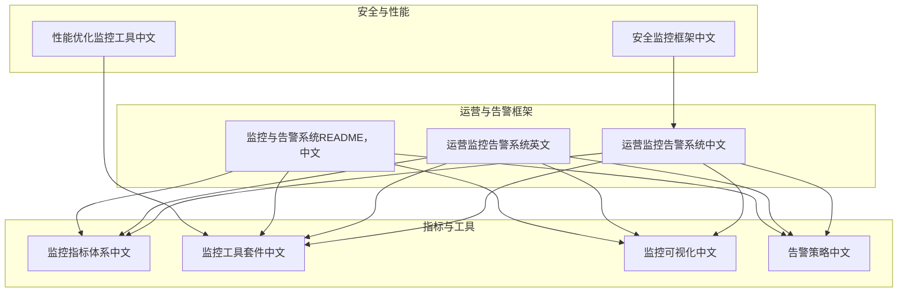
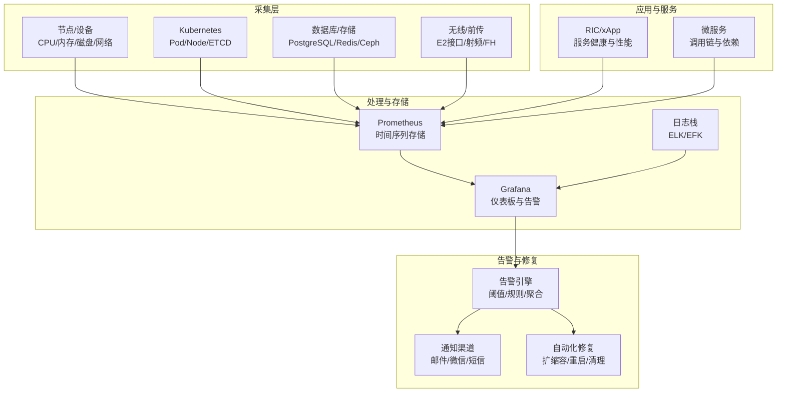
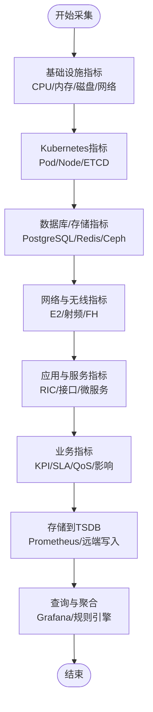
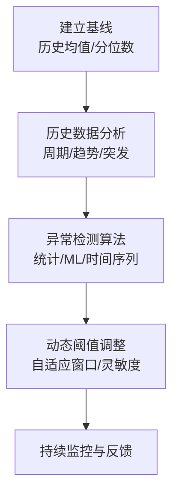
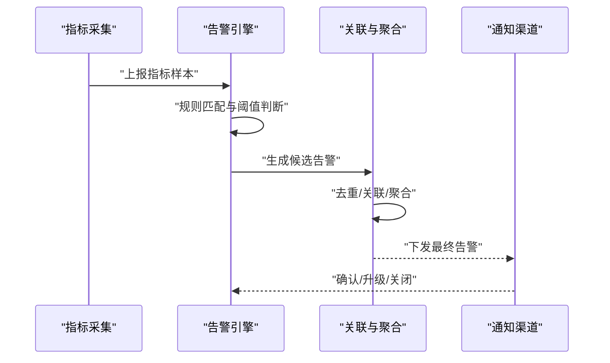
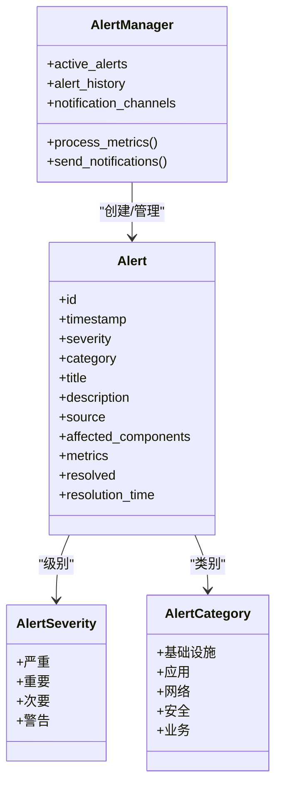
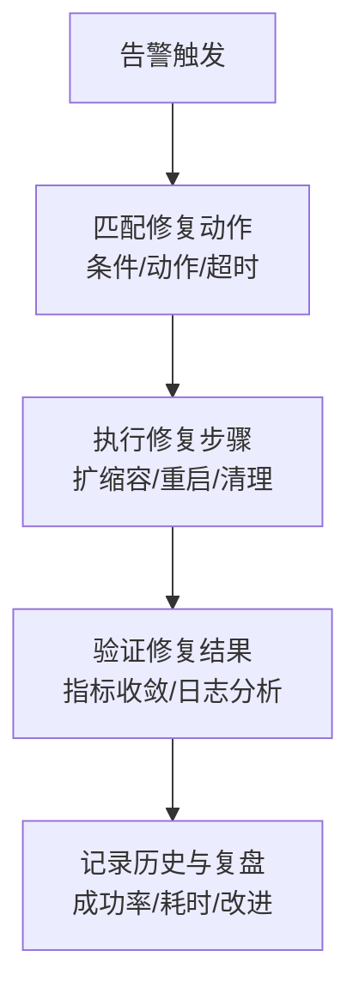
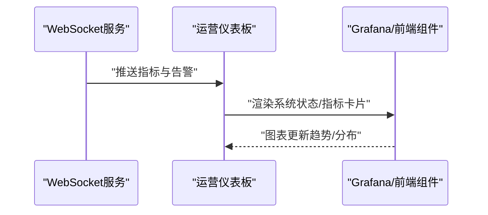
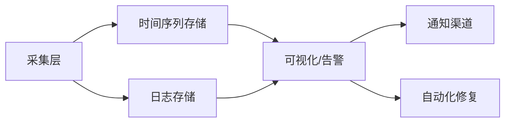

# 监控告警

<cite>
**本文引用的文件**
- [O-RAN 运营监控告警系统（中文）](file://14-operations-management/monitoring-alerting/operations-monitoring-framework-zh.md)
- [O-RAN 监控与告警系统（英文）](file://14-operations-management/monitoring-alerting/operations-monitoring-framework.md)
- [O-RAN 监控与告警系统（README，中文）](file://28-monitoring-alerting/readme.md)
- [O-RAN 监控工具套件（中文）](file://28-monitoring-alerting/monitoring-tools/o-ran-monitoring-tools-zh.md)
- [O-RAN 监控指标体系（中文）](file://28-monitoring-alerting/metric-system/monitoring-metrics-framework-zh.md)
- [O-RAN 监控可视化（中文）](file://28-monitoring-alerting/visualization/o-ran-monitoring-visualization-zh.md)
- [O-RAN 告警策略（中文）](file://28-monitoring-alerting/alert-strategy/o-ran-alert-strategy-zh.md)
- [O-RAN 安全监控框架（中文）](file://12-security-privacy/monitoring-alerting/security-monitoring-framework-zh.md)
- [O-RAN 性能优化监控工具（中文）](file://26-performance-optimization/monitoring-tools/o-ran-monitoring-tools-zh.md)
</cite>

## 目录
1. [简介](#简介)
2. [项目结构](#项目结构)
3. [核心组件](#核心组件)
4. [架构总览](#架构总览)
5. [详细组件分析](#详细组件分析)
6. [依赖关系分析](#依赖关系分析)
7. [性能考量](#性能考量)
8. [故障排查指南](#故障排查指南)
9. [结论](#结论)
10. [附录](#附录)

## 简介
本指导面向O-RAN监控告警系统的运维与工程实践，围绕实时性能监控的架构设计与实现进行系统化梳理，覆盖指标定义、采集频率、存储策略、查询优化；关键指标阈值设置的方法论（基线建立、历史数据分析、异常检测算法、动态阈值调整）；异常行为检测技术（机器学习、统计分析、规则引擎、智能告警聚合）；告警分类与通知机制（级别定义、渠道选择、接收人配置、通知策略）；以及根因分析工具的使用方法（关联分析、时间序列分析、依赖关系追踪、故障定位辅助）。文档以仓库现有资料为基础，结合概念性流程图帮助读者快速建立整体认知。

## 项目结构
该仓库在“14-operations-management/monitoring-alerting”与“28-monitoring-alerting”等目录下提供了监控与告警的完整主题内容，包含运营框架、指标体系、工具套件、可视化与告警策略等模块。这些内容共同构成O-RAN监控告警的“方法论+工具链+实践”的知识体系。

**图表来源**
- [O-RAN 运营监控告警系统（中文）](file://14-operations-management/monitoring-alerting/operations-monitoring-framework-zh.md#L1-L909)
- [O-RAN 监控与告警系统（README，中文）](file://28-monitoring-alerting/readme.md#L1-L95)
- [O-RAN 监控工具套件（中文）](file://28-monitoring-alerting/monitoring-tools/o-ran-monitoring-tools-zh.md#L1-L284)
- [O-RAN 监控指标体系（中文）](file://28-monitoring-alerting/metric-system/monitoring-metrics-framework-zh.md#L1-L200)
- [O-RAN 监控可视化（中文）](file://28-monitoring-alerting/visualization/o-ran-monitoring-visualization-zh.md#L1-L200)
- [O-RAN 告警策略（中文）](file://28-monitoring-alerting/alert-strategy/o-ran-alert-strategy-zh.md#L1-L200)
- [O-RAN 安全监控框架（中文）](file://12-security-privacy/monitoring-alerting/security-monitoring-framework-zh.md#L1-L200)
- [O-RAN 性能优化监控工具（中文）](file://26-performance-optimization/monitoring-tools/o-ran-monitoring-tools-zh.md#L1-L200)

**章节来源**
- [O-RAN 运营监控告警系统（中文）](file://14-operations-management/monitoring-alerting/operations-monitoring-framework-zh.md#L1-L909)
- [O-RAN 监控与告警系统（README，中文）](file://28-monitoring-alerting/readme.md#L1-L95)

## 核心组件
- 多层监控系统：基础设施层、应用层、业务层，分别覆盖节点/集群/存储/网络、O-RAN服务与接口、KPI/SLA/客户体验等。
- 指标采集框架：按层级收集系统、K8s、存储、网络、RIC、接口、服务、性能、KPI、SLA、QoS、业务影响等指标。
- 智能告警引擎：基于阈值规则、持续时间、类别与严重性，生成告警并进行通知；具备告警关联与去重能力。
- 可视化与仪表板：提供实时运营看板、系统健康状态、关键指标展示与图表。
- 自动化修复：依据告警类型匹配修复动作，执行扩缩容、重启、清理等操作，并记录历史。
- 工具链与生态：Prometheus/Grafana/ELK、容器平台监控、数据库/存储监控、网络遥测、应用性能管理、智能分析平台。

**章节来源**
- [O-RAN 运营监控告警系统（中文）](file://14-operations-management/monitoring-alerting/operations-monitoring-framework-zh.md#L10-L44)
- [O-RAN 运营监控告警系统（中文）](file://14-operations-management/monitoring-alerting/operations-monitoring-framework-zh.md#L48-L260)
- [O-RAN 运营监控告警系统（中文）](file://14-operations-management/monitoring-alerting/operations-monitoring-framework-zh.md#L266-L486)
- [O-RAN 运营监控告警系统（中文）](file://14-operations-management/monitoring-alerting/operations-monitoring-framework-zh.md#L534-L692)
- [O-RAN 运营监控告警系统（中文）](file://14-operations-management/monitoring-alerting/operations-monitoring-framework-zh.md#L698-L909)
- [O-RAN 监控与告警系统（README，中文）](file://28-monitoring-alerting/readme.md#L6-L76)

## 架构总览
下图展示了O-RAN监控告警系统的总体架构：从边缘节点与网络设备采集指标，经由Prometheus等采集与存储，再由Grafana等进行可视化与告警展示；告警由规则引擎判定并触发通知与自动化修复，形成闭环。

**图表来源**
- [O-RAN 监控工具套件（中文）](file://28-monitoring-alerting/monitoring-tools/o-ran-monitoring-tools-zh.md#L10-L77)
- [O-RAN 监控工具套件（中文）](file://28-monitoring-alerting/monitoring-tools/o-ran-monitoring-tools-zh.md#L164-L181)
- [O-RAN 监控与告警系统（README，中文）](file://28-monitoring-alerting/readme.md#L63-L76)
- [O-RAN 运营监控告警系统（中文）](file://14-operations-management/monitoring-alerting/operations-monitoring-framework-zh.md#L266-L486)
- [O-RAN 运营监控告警系统（中文）](file://14-operations-management/monitoring-alerting/operations-monitoring-framework-zh.md#L698-L909)

## 详细组件分析

### 指标体系与采集
- 多层指标定义：基础设施（CPU/内存/磁盘/网络、K8s、存储）、应用（RIC、接口、服务、性能）、业务（KPI、SLA、QoS、业务影响）。
- 采集频率：示例采用30秒间隔；工具链文档给出15秒采集周期的配置参考。
- 存储策略：Prometheus作为时间序列数据库；日志通过ELK存储；可选Thanos/Cortex/VictoriaMetrics等扩展长期存储与联邦查询。
- 查询优化：通过索引、分区、采样与查询规划降低开销；合理设置保留周期与压缩策略。

**图表来源**
- [O-RAN 运营监控告警系统（中文）](file://14-operations-management/monitoring-alerting/operations-monitoring-framework-zh.md#L10-L44)
- [O-RAN 监控工具套件（中文）](file://28-monitoring-alerting/monitoring-tools/o-ran-monitoring-tools-zh.md#L10-L77)
- [O-RAN 监控工具套件（中文）](file://28-monitoring-alerting/monitoring-tools/o-ran-monitoring-tools-zh.md#L176-L181)

**章节来源**
- [O-RAN 运营监控告警系统（中文）](file://14-operations-management/monitoring-alerting/operations-monitoring-framework-zh.md#L48-L260)
- [O-RAN 监控工具套件（中文）](file://28-monitoring-alerting/monitoring-tools/o-ran-monitoring-tools-zh.md#L10-L77)
- [O-RAN 监控工具套件（中文）](file://28-monitoring-alerting/monitoring-tools/o-ran-monitoring-tools-zh.md#L176-L181)

### 阈值设置与动态调整
- 基线建立：基于历史数据计算均值/分位数，设定静态阈值；结合业务SLA与容量规划确定目标。
- 历史数据分析：识别周期性、趋势性与突发性特征，区分正常波动与异常事件。
- 异常检测算法：统计控制图、回归分析、Isolation Forest等无监督学习方法；时间序列预测用于趋势预警。
- 动态阈值调整：根据负载变化、季节性与告警密度，自适应调整阈值窗口与灵敏度。

**图表来源**
- [O-RAN 监控工具套件（中文）](file://28-monitoring-alerting/monitoring-tools/o-ran-monitoring-tools-zh.md#L185-L214)

**章节来源**
- [O-RAN 监控工具套件（中文）](file://28-monitoring-alerting/monitoring-tools/o-ran-monitoring-tools-zh.md#L185-L214)

### 异常行为检测与智能告警聚合
- 规则引擎：基于阈值、持续时间、指标路径匹配生成告警；支持重复抑制、依赖抑制与时段抑制。
- 关联分析：将多个告警按模式聚类，识别级联故障、资源耗尽等复合场景。
- 智能聚合：合并相似告警，提升可读性与处理效率；按严重性与影响范围分级。

**图表来源**
- [O-RAN 运营监控告警系统（中文）](file://14-operations-management/monitoring-alerting/operations-monitoring-framework-zh.md#L266-L486)
- [O-RAN 运营监控告警系统（中文）](file://14-operations-management/monitoring-alerting/operations-monitoring-framework-zh.md#L488-L528)

**章节来源**
- [O-RAN 运营监控告警系统（中文）](file://14-operations-management/monitoring-alerting/operations-monitoring-framework-zh.md#L266-L486)
- [O-RAN 运营监控告警系统（中文）](file://14-operations-management/monitoring-alerting/operations-monitoring-framework-zh.md#L488-L528)

### 告警分类与通知机制
- 告警级别：严重、重要、次要、警告；与业务影响与系统可用性挂钩。
- 通知渠道：邮件、微信、短信等；严重级别触发短信直达。
- 接收人配置：按职责域（基础设施/应用/网络/安全/业务）与值班表联动。
- 通知策略：重复抑制、时段静默、智能聚合、升级与回退机制。

**图表来源**
- [O-RAN 运营监控告警系统（中文）](file://14-operations-management/monitoring-alerting/operations-monitoring-framework-zh.md#L274-L486)

**章节来源**
- [O-RAN 运营监控告警系统（中文）](file://14-operations-management/monitoring-alerting/operations-monitoring-framework-zh.md#L266-L486)
- [O-RAN 监控与告警系统（README，中文）](file://28-monitoring-alerting/readme.md#L26-L48)

### 自动化修复与根因分析
- 自愈动作框架：匹配告警到修复动作（扩缩容、重启、清理），设定超时与最大尝试次数，记录历史。
- 根因分析：结合关联分析、时间序列趋势、服务依赖拓扑与日志检索，定位故障根因并验证修复效果。

**图表来源**
- [O-RAN 运营监控告警系统（中文）](file://14-operations-management/monitoring-alerting/operations-monitoring-framework-zh.md#L698-L909)

**章节来源**
- [O-RAN 运营监控告警系统（中文）](file://14-operations-management/monitoring-alerting/operations-monitoring-framework-zh.md#L698-L909)

### 可视化与仪表板
- 实时运营仪表板：系统健康状态指示、关键指标卡片、活跃告警列表、趋势与分布图表。
- 集成方案：WebSocket推送指标与告警，Grafana仪表板展示多维指标与告警聚合。

**图表来源**
- [O-RAN 运营监控告警系统（中文）](file://14-operations-management/monitoring-alerting/operations-monitoring-framework-zh.md#L534-L692)

**章节来源**
- [O-RAN 运营监控告警系统（中文）](file://14-operations-management/monitoring-alerting/operations-monitoring-framework-zh.md#L534-L692)

## 依赖关系分析
- 组件耦合：采集层与存储层解耦，通过标准化指标格式与远端写入实现扩展；告警引擎与通知渠道解耦，便于替换与扩展。
- 外部依赖：Prometheus/Grafana/ELK等开源生态；容器平台监控（kube-state-metrics/cAdvisor/kubelet）；数据库/存储导出器；网络遥测与服务网格可观测性。
- 潜在风险：指标基数爆炸、查询风暴、存储膨胀；需通过采样、分区、压缩与容量规划控制成本。

**图表来源**
- [O-RAN 监控工具套件（中文）](file://28-monitoring-alerting/monitoring-tools/o-ran-monitoring-tools-zh.md#L10-L77)
- [O-RAN 监控工具套件（中文）](file://28-monitoring-alerting/monitoring-tools/o-ran-monitoring-tools-zh.md#L176-L181)
- [O-RAN 监控与告警系统（README，中文）](file://28-monitoring-alerting/readme.md#L63-L76)

**章节来源**
- [O-RAN 监控工具套件（中文）](file://28-monitoring-alerting/monitoring-tools/o-ran-monitoring-tools-zh.md#L10-L77)
- [O-RAN 监控工具套件（中文）](file://28-monitoring-alerting/monitoring-tools/o-ran-monitoring-tools-zh.md#L176-L181)
- [O-RAN 监控与告警系统（README，中文）](file://28-monitoring-alerting/readme.md#L63-L76)

## 性能考量
- 可扩展性：Prometheus联邦、Thanos/Cortex/VictoriaMetrics等实现水平扩展与长期存储；Kubernetes监控通过Operator简化部署与管理。
- 查询优化：合理设置抓取间隔、采样率与查询窗口；对高频指标进行聚合与降采样；使用索引与分区策略。
- 容量规划：估算指标基数、存储需求、网络带宽与计算资源；制定数据保留与压缩策略；预留峰值缓冲。

**章节来源**
- [O-RAN 监控工具套件（中文）](file://28-monitoring-alerting/monitoring-tools/o-ran-monitoring-tools-zh.md#L237-L282)

## 故障排查指南
- 告警不触发：检查采集配置、抓取间隔、规则表达式与阈值；确认指标路径与字段映射正确。
- 告警风暴：启用重复抑制、依赖抑制与智能聚合；审查规则粒度与阈值设置；必要时引入时段静默。
- 通知失败：核对通知渠道配置与凭据；检查网络连通性与限流策略；验证严重级别触发条件。
- 修复失败：查看自动化修复历史与错误详情；确认kubectl/系统命令权限与超时设置；回滚至稳定版本并复盘。

**章节来源**
- [O-RAN 运营监控告警系统（中文）](file://14-operations-management/monitoring-alerting/operations-monitoring-framework-zh.md#L266-L486)
- [O-RAN 运营监控告警系统（中文）](file://14-operations-management/monitoring-alerting/operations-monitoring-framework-zh.md#L698-L909)

## 结论
本指导基于仓库现有资料，系统化梳理了O-RAN监控告警的指标体系、采集与存储、告警规则与通知、可视化与自动化修复，并给出了性能优化与故障排查建议。建议在实际落地中结合业务场景细化指标与阈值，完善规则与聚合策略，强化根因分析与持续改进机制，以实现“可观测、可预警、可自愈”的智能化运维目标。

## 附录
- 相关文件清单与用途概览
  - 运营监控告警系统（中文/英文）：提供多层监控、采集框架、告警引擎、可视化与自动化修复的实现思路与示例。
  - 监控与告警系统（README，中文）：概述指标体系、告警策略、可视化与工具链选型。
  - 监控工具套件（中文）：提供Prometheus/Grafana/ELK等生态集成、容器平台监控、数据库/存储监控、网络遥测与智能分析平台的实践要点。
  - 监控指标体系（中文）：定义基础设施、网络性能、应用服务、业务KPI等指标维度与采集要点。
  - 监控可视化（中文）：介绍仪表板设计、拓扑图、趋势分析与告警中心的实现思路。
  - 告警策略（中文）：明确告警级别、规则配置、抑制与聚合策略。
  - 安全监控框架（中文）：补充安全事件监控与告警处置流程。
  - 性能优化监控工具（中文）：提供容量规划、查询优化与可扩展性模式。

**章节来源**
- [O-RAN 运营监控告警系统（中文）](file://14-operations-management/monitoring-alerting/operations-monitoring-framework-zh.md#L1-L909)
- [O-RAN 监控与告警系统（README，中文）](file://28-monitoring-alerting/readme.md#L1-L95)
- [O-RAN 监控工具套件（中文）](file://28-monitoring-alerting/monitoring-tools/o-ran-monitoring-tools-zh.md#L1-L284)
- [O-RAN 监控指标体系（中文）](file://28-monitoring-alerting/metric-system/monitoring-metrics-framework-zh.md#L1-L200)
- [O-RAN 监控可视化（中文）](file://28-monitoring-alerting/visualization/o-ran-monitoring-visualization-zh.md#L1-L200)
- [O-RAN 告警策略（中文）](file://28-monitoring-alerting/alert-strategy/o-ran-alert-strategy-zh.md#L1-L200)
- [O-RAN 安全监控框架（中文）](file://12-security-privacy/monitoring-alerting/security-monitoring-framework-zh.md#L1-L200)
- [O-RAN 性能优化监控工具（中文）](file://26-performance-optimization/monitoring-tools/o-ran-monitoring-tools-zh.md#L1-L200)