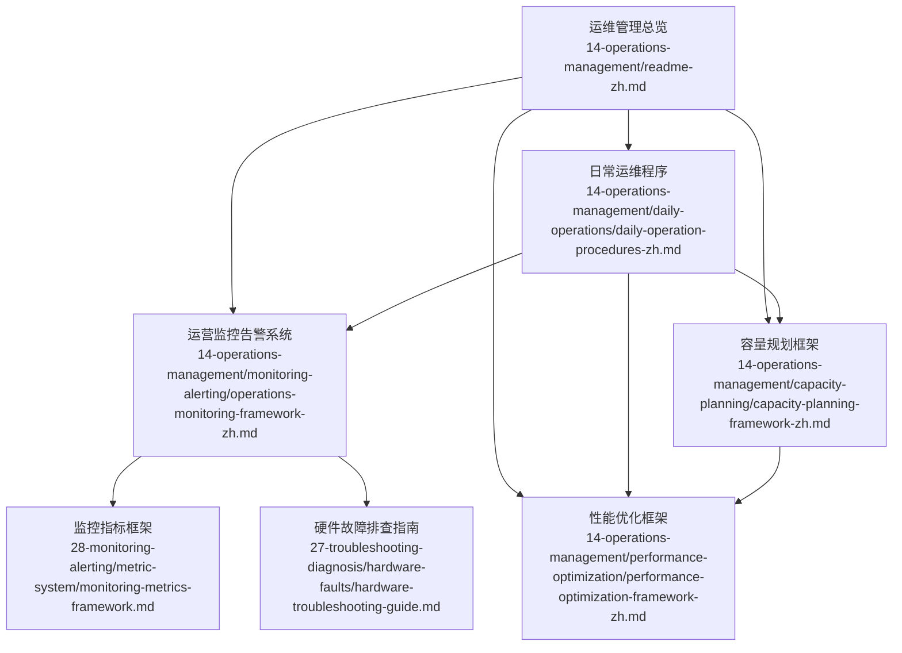
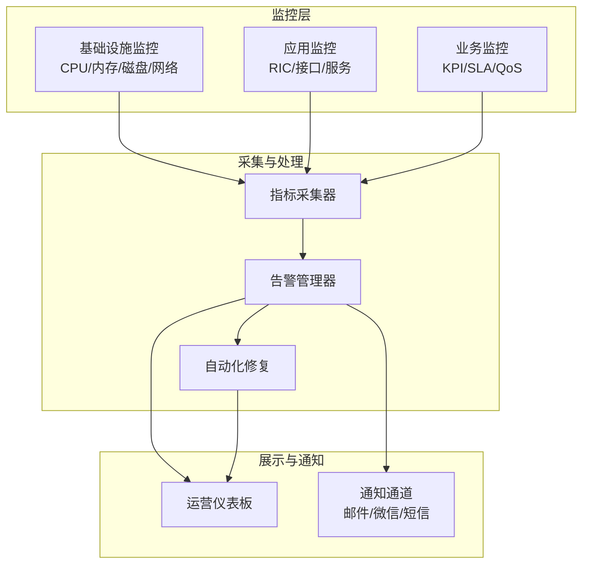
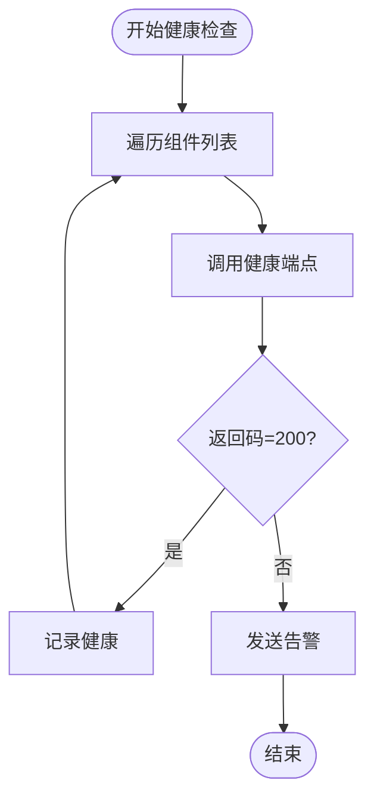
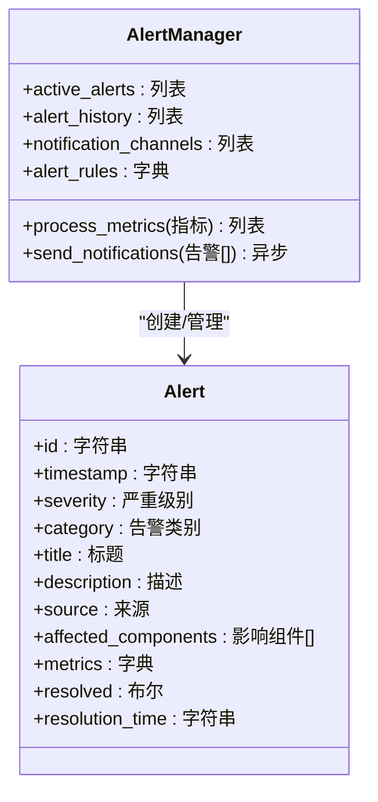
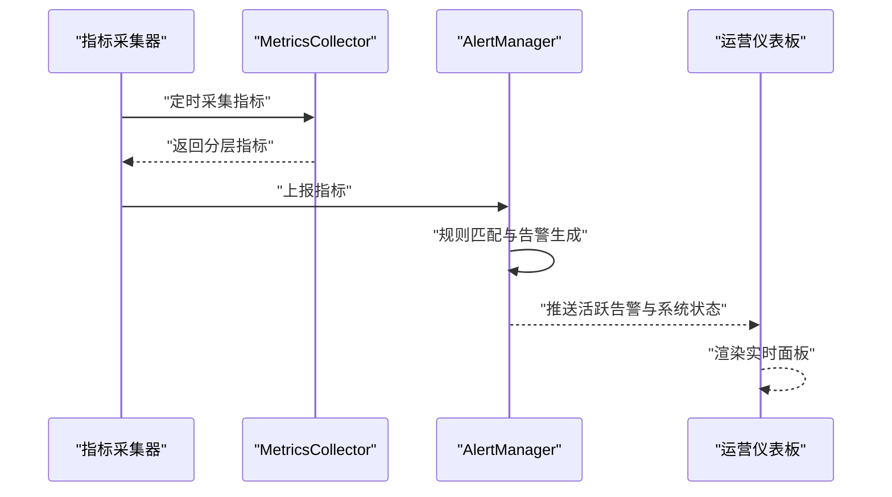
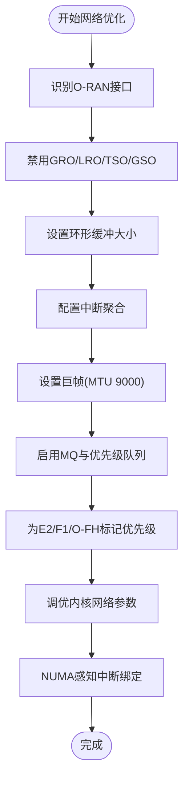
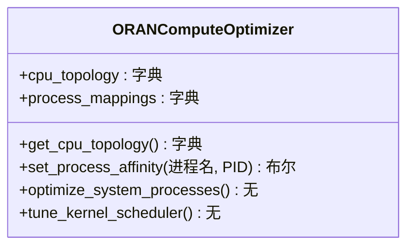
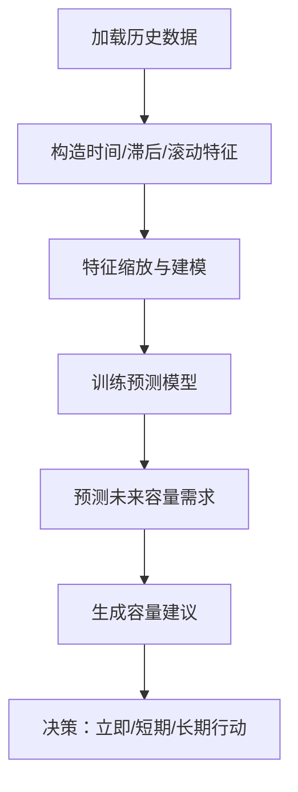
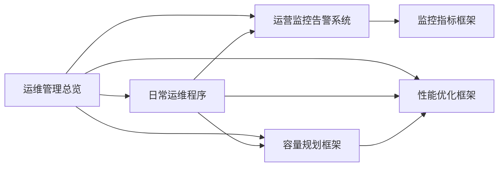

# 运维管理

<cite>
**本文引用的文件**
- [运维管理总览](file://14-operations-management/readme-zh.md)
- [日常运维程序](file://14-operations-management/daily-operations/daily-operation-procedures-zh.md)
- [运营监控告警系统](file://14-operations-management/monitoring-alerting/operations-monitoring-framework-zh.md)
- [性能优化框架](file://14-operations-management/performance-optimization/performance-optimization-framework-zh.md)
- [容量规划框架](file://14-operations-management/capacity-planning/capacity-planning-framework-zh.md)
- [监控指标框架](file://28-monitoring-alerting/metric-system/monitoring-metrics-framework.md)
- [硬件故障排查指南](file://27-troubleshooting-diagnosis/hardware-faults/hardware-troubleshooting-guide.md)
</cite>

## 目录
1. [引言](#引言)
2. [项目结构](#项目结构)
3. [核心组件](#核心组件)
4. [架构总览](#架构总览)
5. [详细组件分析](#详细组件分析)
6. [依赖关系分析](#依赖关系分析)
7. [性能考量](#性能考量)
8. [故障排查指南](#故障排查指南)
9. [结论](#结论)
10. [附录](#附录)

## 引言
本文件面向O-RAN运维团队，提供系统化的运维指导：覆盖日常健康检查、配置变更与回滚、版本升级策略、自动化运维流程；深入解析监控告警体系（多层级监控、智能告警引擎、自动化修复）；给出故障处理的快速定位、应急响应、恢复最佳实践与系统化排查方法；总结性能优化策略（网络调优、资源优化、负载均衡、高级优化技术）；并提供容量规划方法（负载预测、可扩展性设计、成本优化、资源利用率规划）。最后补充团队协作、知识管理与持续改进的最佳实践，帮助构建稳定、高效、可扩展的O-RAN运维体系。

## 项目结构
该仓库围绕O-RAN运维管理形成清晰的知识域划分：
- 运维管理总览：概述运维实践、监控告警、故障处理、自动化运维、性能优化、容量规划、生命周期管理与运营管理。
- 日常运维程序：包含健康检查脚本、网络监控与告警、配置备份与恢复、变更管理流程、事件响应与故障排除手册、性能监控与告警规则等。
- 运营监控告警系统：定义多层监控架构（基础设施/应用/业务）、指标采集框架、智能告警引擎、告警关联与去重、实时仪表板、自动化修复。
- 性能优化框架：涵盖网络接口调优、内核参数优化、NUMA感知绑定、CPU亲和性与调度、容器资源优化、性能仪表板配置。
- 容量规划框架：提供流量增长预测模型、可扩展性设计原则、自动扩展配置、资源利用分析与成本优化、容量基准测试。
- 监控指标框架：提供统一的监控指标体系与采集规范，支撑上层告警与仪表板。
- 硬件故障排查指南：提供硬件层面的常见问题定位与处理流程。

**图示来源**
- [运维管理总览](file://14-operations-management/readme-zh.md#L1-L126)
- [日常运维程序](file://14-operations-management/daily-operations/daily-operation-procedures-zh.md#L1-L419)
- [运营监控告警系统](file://14-operations-management/monitoring-alerting/operations-monitoring-framework-zh.md#L1-L909)
- [性能优化框架](file://14-operations-management/performance-optimization/performance-optimization-framework-zh.md#L1-L342)
- [容量规划框架](file://14-operations-management/capacity-planning/capacity-planning-framework-zh.md#L1-L505)
- [监控指标框架](file://28-monitoring-alerting/metric-system/monitoring-metrics-framework.md)
- [硬件故障排查指南](file://27-troubleshooting-diagnosis/hardware-faults/hardware-troubleshooting-guide.md)

**章节来源**
- [运维管理总览](file://14-operations-management/readme-zh.md#L1-L126)

## 核心组件
- 日常健康检查与网络监控：提供组件健康检查脚本、网络接口监控与告警、带宽利用率计算与阈值告警。
- 配置管理与变更流程：定义备份策略、变更请求模板、审批与排期、实施前后验证、回滚程序。
- 监控告警体系：多层监控架构（基础设施/应用/业务）、指标采集框架、智能告警引擎、告警关联与去重、通知通道、自动化修复。
- 性能优化：网络接口调优（巨帧、环形缓冲、中断聚合、优先级队列）、内核参数优化（TCP BBR、缓冲区、延迟）、NUMA绑定、CPU亲和性与调度器调优、容器资源优化。
- 容量规划：流量预测模型（随机森林）、可扩展性设计（水平/垂直扩展）、自动扩展策略、资源利用分析与成本优化、容量基准测试。
- 故障处理：事件分级与升级矩阵、常见接口问题（E2/F1/O-FH）的诊断与解决步骤、硬件故障排查流程。

**章节来源**
- [日常运维程序](file://14-operations-management/daily-operations/daily-operation-procedures-zh.md#L6-L419)
- [运营监控告警系统](file://14-operations-management/monitoring-alerting/operations-monitoring-framework-zh.md#L1-L909)
- [性能优化框架](file://14-operations-management/performance-optimization/performance-optimization-framework-zh.md#L1-L342)
- [容量规划框架](file://14-operations-management/capacity-planning/capacity-planning-framework-zh.md#L1-L505)

## 架构总览
O-RAN运维管理采用“三层监控 + 智能告警 + 自动化修复”的闭环架构：
- 多层监控：基础设施（CPU/内存/磁盘/网络）、应用（RIC/接口/服务）、业务（KPI/SLA/QoS）。
- 指标采集：本地采集器定时拉取系统/应用/业务指标，统一上报至监控平台。
- 告警引擎：基于阈值与趋势规则触发告警，支持关联与去重，按严重级别分发通知。
- 自动化修复：针对常见故障场景执行预定义修复动作，缩短MTTR。
- 仪表板：实时展示系统状态、关键指标与活跃告警，支持趋势分析与根因定位。

**图示来源**
- [运营监控告警系统](file://14-operations-management/monitoring-alerting/operations-monitoring-framework-zh.md#L8-L486)

## 详细组件分析

### 日常健康检查与网络监控
- 组件健康检查：遍历近端RT RIC、O-DU、O-CU、SMO等组件，通过HTTP健康端点校验可用性，不健康时触发告警。
- 网络接口监控：基于psutil统计接口状态、错误计数、收发字节，计算带宽利用率并设置阈值告警，周期性轮询。
- 配置备份与恢复：定义备份计划（全量/增量/归档）、多位置存储（本地/S3/Azure），按组件类型与频率打包备份，并同步到远端存储。
- 变更管理流程：标准化变更请求、技术与业务影响评估、风险矩阵、多级审批与排期；实施前后验证与回滚程序。
- 事件响应与故障排除：事件分级与升级矩阵、沟通协议；常见接口问题（E2/F1/O-FH）的诊断步骤与解决措施。

**图示来源**
- [日常运维程序](file://14-operations-management/daily-operations/daily-operation-procedures-zh.md#L8-L66)

**章节来源**
- [日常运维程序](file://14-operations-management/daily-operations/daily-operation-procedures-zh.md#L6-L419)

### 智能告警引擎与自动化修复
- 告警规则：基于阈值与持续时间触发，支持多类别（基础设施/应用/网络/安全/业务），自动去重避免重复告警。
- 告警关联：识别资源耗尽、级联系统故障、网络性能下降等模式，合并为更高严重级别的关联告警并提升升级级别。
- 通知通道：邮件、微信、短信等多通道并行通知，支持紧急级别短信直达。
- 自动化修复：按告警类型匹配修复动作（如扩容、重启、清理缓存、检查连接），记录执行历史与成功率。

**图示来源**
- [运营监控告警系统](file://14-operations-management/monitoring-alerting/operations-monitoring-framework-zh.md#L264-L486)

**章节来源**
- [运营监控告警系统](file://14-operations-management/monitoring-alerting/operations-monitoring-framework-zh.md#L264-L528)

### 指标采集与监控仪表板
- 指标采集：分层采集基础设施、应用与业务指标，统一时间戳与结构化存储，便于告警与可视化。
- 仪表板：实时展示系统状态、关键指标（CPU/内存/磁盘/网络、RIC响应时间、吞吐量、延迟、丢包率、连接用户数、可用性、QoE评分），并提供图表趋势与告警分布。

**图示来源**
- [运营监控告警系统](file://14-operations-management/monitoring-alerting/operations-monitoring-framework-zh.md#L46-L260)

**章节来源**
- [运营监控告警系统](file://14-operations-management/monitoring-alerting/operations-monitoring-framework-zh.md#L46-L260)

### 网络性能优化
- 接口调优：禁用可能导致问题的网络卸载、设置环形缓冲、中断聚合、巨帧（MTU 9000）、启用多队列与优先级队列。
- 内核参数：增大TCP/网络缓冲、启用BBR拥塞控制、减少TCP延迟参数、应用变更。
- NUMA绑定：将网络中断绑定到特定CPU核心，降低跨NUMA访问开销。

**图示来源**
- [性能优化框架](file://14-operations-management/performance-optimization/performance-optimization-framework-zh.md#L9-L101)

**章节来源**
- [性能优化框架](file://14-operations-management/performance-optimization/performance-optimization-framework-zh.md#L9-L101)

### 计算性能优化
- CPU亲和性与调度：为近端RT RIC、O-DU、O-CU、SMO等进程设置CPU亲和性核心与优先级，避免上下文切换抖动。
- 内核调度器：调优迁移成本、cfs带宽切片、实时调度参数，降低延迟抖动。
- 容器资源：合理设置requests/limits、GC参数、并发数，结合探针保障就绪与存活。

**图示来源**
- [性能优化框架](file://14-operations-management/performance-optimization/performance-optimization-framework-zh.md#L106-L234)

**章节来源**
- [性能优化框架](file://14-operations-management/performance-optimization/performance-optimization-framework-zh.md#L106-L234)

### 容量规划与成本优化
- 流量预测：基于历史数据构建特征（时间、滞后、滚动统计），使用随机森林模型预测吞吐量与连接用户数。
- 可扩展性设计：权衡水平扩展（容错、线性扩展、地理分布）与垂直扩展（管理简单、低网络开销），结合场景选择。
- 自动扩展：按CPU/用户数/吞吐量设置高/低阈值、扩展/缩减因子、冷却期与实例上下限。
- 成本优化：资源利用分析（CPU/内存/存储/IOPS）、生成优化报告与成本影响评估、分阶段实施。

**图示来源**
- [容量规划框架](file://14-operations-management/capacity-planning/capacity-planning-framework-zh.md#L8-L186)

**章节来源**
- [容量规划框架](file://14-operations-management/capacity-planning/capacity-planning-framework-zh.md#L8-L186)

### 硬件故障排查
- 硬件层面常见问题：接口链路异常、电源/风扇故障、内存/存储错误、时钟同步问题、光模块/线缆劣化。
- 排查流程：隔离法（逐段替换）、交叉验证（对侧对比）、日志分析（内核/驱动/固件）、工具辅助（光功率计、误码仪、热成像）。

**章节来源**
- [硬件故障排查指南](file://27-troubleshooting-diagnosis/hardware-faults/hardware-troubleshooting-guide.md)

## 依赖关系分析
- 运维管理总览作为顶层指引，串联日常运维、监控告警、性能优化、容量规划四大支柱。
- 日常运维程序依赖监控告警系统提供的指标与告警能力，同时为容量规划提供历史数据来源。
- 监控告警系统依赖监控指标框架定义的指标体系，通过采集器与告警引擎形成闭环。
- 性能优化与容量规划分别服务于系统运行效率与资源投入产出比，二者相互印证。

**图示来源**
- [运维管理总览](file://14-operations-management/readme-zh.md#L1-L126)
- [运营监控告警系统](file://14-operations-management/monitoring-alerting/operations-monitoring-framework-zh.md#L1-L909)
- [性能优化框架](file://14-operations-management/performance-optimization/performance-optimization-framework-zh.md#L1-L342)
- [容量规划框架](file://14-operations-management/capacity-planning/capacity-planning-framework-zh.md#L1-L505)
- [监控指标框架](file://28-monitoring-alerting/metric-system/monitoring-metrics-framework.md)

**章节来源**
- [运维管理总览](file://14-operations-management/readme-zh.md#L1-L126)

## 性能考量
- 网络层面：巨帧、优先级队列、中断聚合、NUMA绑定、BBR拥塞控制显著降低延迟与抖动。
- 计算层面：CPU亲和性与调度器调优减少上下文切换，容器资源限制避免资源争用。
- 监控与告警：通过阈值与趋势规则及时发现性能退化，联动自动化修复缩短恢复时间。
- 容量规划：基于预测模型与容量基准测试，提前规划扩展与成本优化，避免尾部延迟与拥塞。

[本节为通用性能讨论，无需列出章节来源]

## 故障排查指南
- 快速定位：结合仪表板与告警，先确认影响范围与严重级别，再缩小到具体组件或接口。
- 应急响应：遵循事件分级与升级矩阵，启动通知流程，必要时执行降级与隔离策略。
- 恢复最佳实践：优先执行自动化修复动作，若无效则按变更流程回滚至上一个稳定版本，最后进行根因分析。
- 系统化排查：参考常见接口问题的诊断步骤（E2/F1/O-FH），结合硬件排查流程，逐步排除软硬件因素。

**章节来源**
- [日常运维程序](file://14-operations-management/daily-operations/daily-operation-procedures-zh.md#L283-L359)
- [硬件故障排查指南](file://27-troubleshooting-diagnosis/hardware-faults/hardware-troubleshooting-guide.md)

## 结论
通过“健康检查—监控告警—自动化修复—性能优化—容量规划—故障处理—团队协作”的闭环体系，O-RAN运维可在复杂网络环境中实现高可用、低延迟与高性价比。建议以监控指标框架为基础，持续完善告警规则与修复动作，结合容量预测与成本分析，动态优化资源配置与扩展策略，最终达成稳定、高效、可持续的运维目标。

[本节为总结性内容，无需列出章节来源]

## 附录
- 运维团队协作：明确组织架构、技能矩阵、知识分享机制、跨部门协作流程与持续学习文化。
- 知识管理：维护运维手册、操作指南、故障处理文档、最佳实践总结与知识传承机制。
- 持续改进：定期回顾SLA与KPI、风险管控与应急预案、服务改进计划与客户满意度管理。

**章节来源**
- [运维管理总览](file://14-operations-management/readme-zh.md#L105-L126)