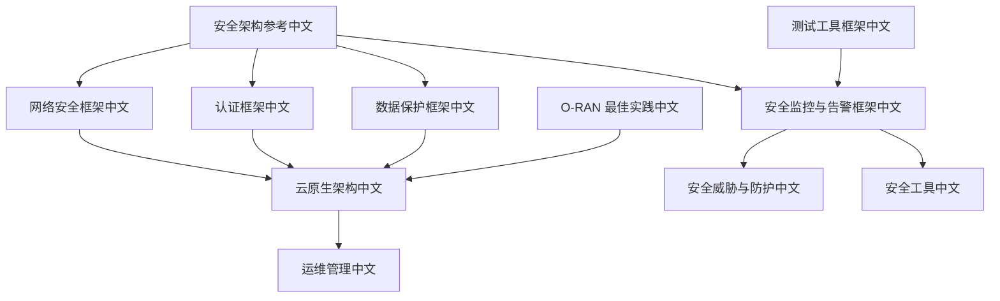
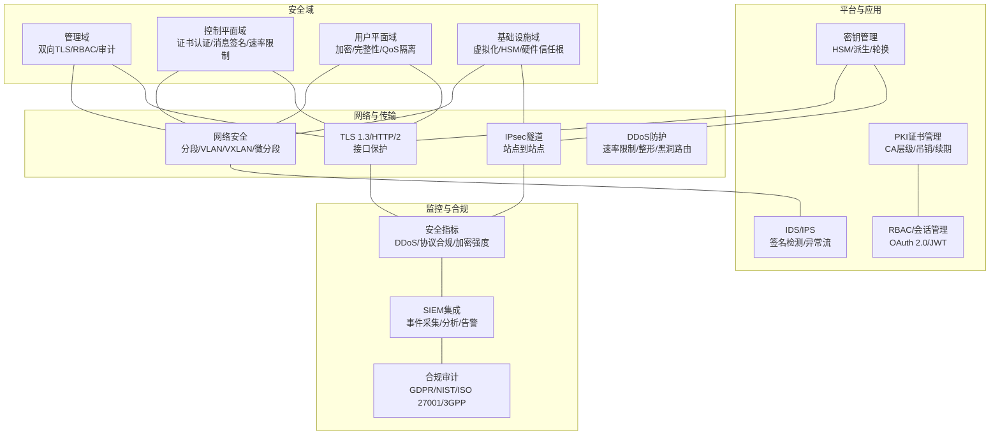
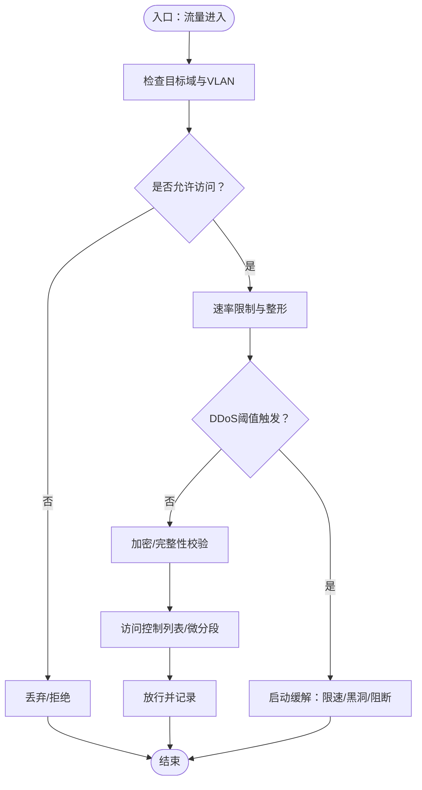
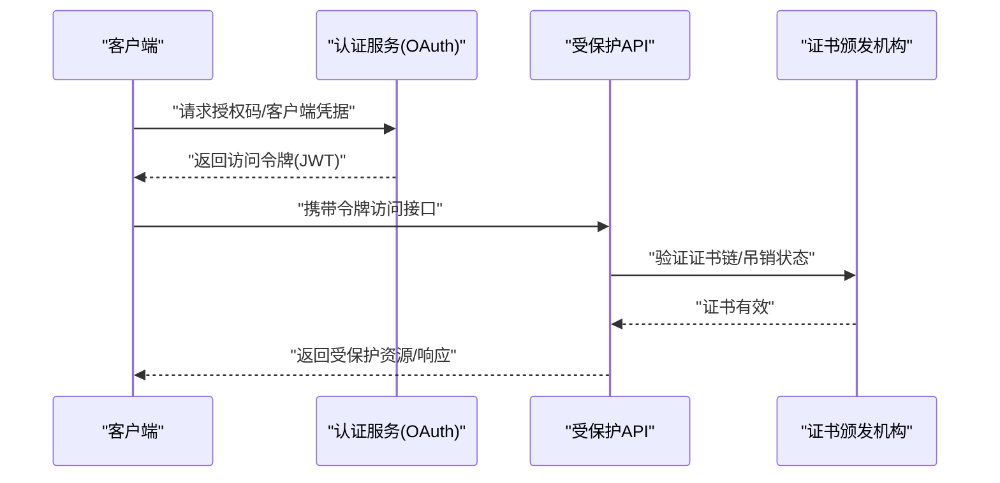
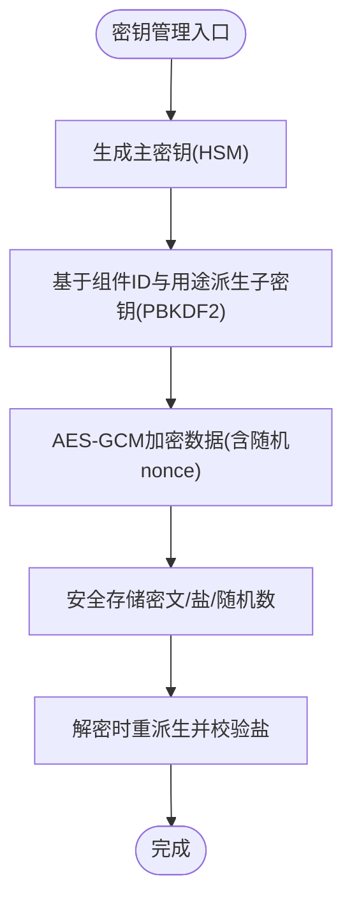
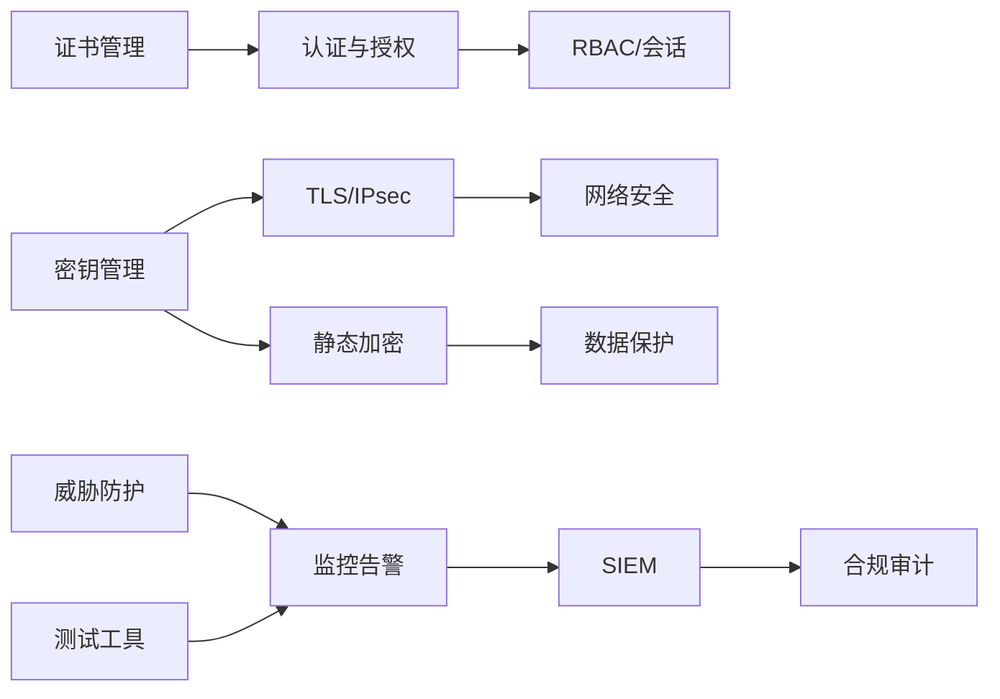

# 安全实施

<cite>
**本文引用的文件**
- [安全架构参考（中文）](file://12-security-privacy/security-architecture/security-reference-architecture-zh.md)
- [网络安全框架（中文）](file://12-security-privacy/network-security/network-security-framework-zh.md)
- [认证框架（中文）](file://12-security-privacy/authentication/authentication-framework-zh.md)
- [数据保护框架（中文）](file://12-security-privacy/data-protection/data-protection-framework-zh.md)
- [安全监控与告警框架（中文）](file://12-security-privacy/monitoring-alerting/security-monitoring-framework-zh.md)
- [云原生架构（中文）](file://05-cloud-integration/cloud-native-architecture.md)
- [运维管理（中文）](file://14-operations-management/readme-zh.md)
- [安全威胁与防护（中文）](file://29-security-threats/attack-protection/o-ran-attack-protection.md)
- [安全工具（中文）](file://29-security-threats/security-tools/o-ran-security-tools.md)
- [测试工具框架（中文）](file://13-testing-validation/testing-tools/testing-tools-frameworks.md)
- [O-RAN 最佳实践（中文）](file://30-best-practices/readme-zh.md)
</cite>

## 目录
1. [引言](#引言)
2. [项目结构](#项目结构)
3. [核心组件](#核心组件)
4. [架构总览](#架构总览)
5. [详细组件分析](#详细组件分析)
6. [依赖分析](#依赖分析)
7. [性能考虑](#性能考虑)
8. [故障排查指南](#故障排查指南)
9. [结论](#结论)
10. [附录](#附录)

## 引言
本文件面向O-RAN安全实施，围绕网络安全分段与隔离、访问控制、加密传输、DDoS防护、接口认证与授权、API安全、消息完整性、系统与容器安全、应用与数据安全、安全监控与合规审计等维度，结合仓库中的安全架构、网络安全、认证、数据保护、监控告警、云原生、运维、威胁防护、测试工具与最佳实践等资料，形成一套可落地的安全指导与实施建议，帮助运营商与厂商在部署与运维O-RAN系统时构建纵深防御、满足合规要求并提升整体韧性。

## 项目结构
本仓库中与安全实施直接相关的核心文档主要分布在“12-security-privacy”目录下，并与“05-cloud-integration”“14-operations-management”“29-security-threats”“13-testing-validation”“30-best-practices”等目录协同支撑安全体系的落地执行。

**图示来源**
- [安全架构参考（中文）](file://12-security-privacy/security-architecture/security-reference-architecture-zh.md#L1-L530)
- [网络安全框架（中文）](file://12-security-privacy/network-security/network-security-framework-zh.md#L1-L473)
- [认证框架（中文）](file://12-security-privacy/authentication/authentication-framework-zh.md#L1-L208)
- [数据保护框架（中文）](file://12-security-privacy/data-protection/data-protection-framework-zh.md#L1-L376)
- [安全监控与告警框架（中文）](file://12-security-privacy/monitoring-alerting/security-monitoring-framework-zh.md#L1-L731)
- [云原生架构（中文）](file://05-cloud-integration/cloud-native-architecture.md#L328-L376)
- [运维管理（中文）](file://14-operations-management/readme-zh.md#L1-L126)
- [安全威胁与防护（中文）](file://29-security-threats/attack-protection/o-ran-attack-protection.md#L70-L98)
- [安全工具（中文）](file://29-security-threats/security-tools/o-ran-security-tools.md#L85-L115)
- [测试工具框架（中文）](file://13-testing-validation/testing-tools/testing-tools-frameworks.md#L561-L598)
- [O-RAN 最佳实践（中文）](file://30-best-practices/readme-zh.md#L1-L113)

**章节来源**
- [安全架构参考（中文）](file://12-security-privacy/security-architecture/security-reference-architecture-zh.md#L1-L530)
- [网络安全框架（中文）](file://12-security-privacy/network-security/network-security-framework-zh.md#L1-L473)
- [认证框架（中文）](file://12-security-privacy/authentication/authentication-framework-zh.md#L1-L208)
- [数据保护框架（中文）](file://12-security-privacy/data-protection/data-protection-framework-zh.md#L1-L376)
- [安全监控与告警框架（中文）](file://12-security-privacy/monitoring-alerting/security-monitoring-framework-zh.md#L1-L731)
- [云原生架构（中文）](file://05-cloud-integration/cloud-native-architecture.md#L328-L376)
- [运维管理（中文）](file://14-operations-management/readme-zh.md#L1-L126)
- [安全威胁与防护（中文）](file://29-security-threats/attack-protection/o-ran-attack-protection.md#L70-L98)
- [安全工具（中文）](file://29-security-threats/security-tools/o-ran-security-tools.md#L85-L115)
- [测试工具框架（中文）](file://13-testing-validation/testing-tools/testing-tools-frameworks.md#L561-L598)
- [O-RAN 最佳实践（中文）](file://30-best-practices/readme-zh.md#L1-L113)

## 核心组件
- 零信任与纵深防御：以零信任原则贯穿各域，结合物理、网络、平台、应用、数据五层安全控制，形成多层协同的纵深防御体系。
- 网络安全域与分段：管理域、控制平面域、用户平面域、基础设施域，分别配置mTLS、证书认证、速率限制、加密与完整性保护、网络隔离与微分段。
- 认证与授权：双向TLS、OAuth 2.0/JWT、RBAC角色映射、会话管理与令牌校验。
- 加密与密钥管理：证书管理框架、密钥派生与轮换、HSM集成、静态与传输中加密策略。
- 安全监控与告警：SIEM集成、威胁检测、异常行为分析、安全事件采集与处置。
- 合规与审计：GDPR、NIST、ISO 27001、3GPP等合规要求与审计清单。
- 云原生与容器安全：镜像扫描、运行时保护、RBAC、网络策略、Secrets管理。
- 测试与攻防演练：自动化安全扫描、渗透测试、威胁狩猎与取证分析。

**章节来源**
- [安全架构参考（中文）](file://12-security-privacy/security-architecture/security-reference-architecture-zh.md#L8-L71)
- [网络安全框架（中文）](file://12-security-privacy/network-security/network-security-framework-zh.md#L8-L40)
- [认证框架（中文）](file://12-security-privacy/authentication/authentication-framework-zh.md#L8-L23)
- [数据保护框架（中文）](file://12-security-privacy/data-protection/data-protection-framework-zh.md#L8-L28)
- [安全监控与告警框架（中文）](file://12-security-privacy/monitoring-alerting/security-monitoring-framework-zh.md#L33-L116)
- [云原生架构（中文）](file://05-cloud-integration/cloud-native-architecture.md#L342-L376)

## 架构总览
下图展示了O-RAN安全架构的关键要素与交互关系，覆盖域划分、加密与认证、监控与告警、云原生与容器安全、合规与审计等。

**图示来源**
- [安全架构参考（中文）](file://12-security-privacy/security-architecture/security-reference-architecture-zh.md#L8-L71)
- [网络安全框架（中文）](file://12-security-privacy/network-security/network-security-framework-zh.md#L42-L112)
- [认证框架（中文）](file://12-security-privacy/authentication/authentication-framework-zh.md#L25-L124)
- [数据保护框架（中文）](file://12-security-privacy/data-protection/data-protection-framework-zh.md#L30-L96)
- [安全监控与告警框架（中文）](file://12-security-privacy/monitoring-alerting/security-monitoring-framework-zh.md#L33-L116)

## 详细组件分析

### 网络安全与分段
- 零信任与微分段：按域划分网络命名空间与VLAN，结合802.1X、防火墙、入侵检测与速率限制，实现最小权限与持续验证。
- VLAN与VXLAN：为不同域创建独立VLAN接口，结合VXLAN实现跨三层的微分段与隔离。
- 网络切片：在用户平面域通过QoS与队列整形保障关键业务带宽与延迟。
- DDoS缓解：iptables/NFTables规则、SYN洪泛与ICMP限制、连接数限制、突发阈值与黑洞路由联动。

**图示来源**
- [网络安全框架（中文）](file://12-security-privacy/network-security/network-security-framework-zh.md#L42-L112)
- [网络安全框架（中文）](file://12-security-privacy/network-security/network-security-framework-zh.md#L261-L426)

**章节来源**
- [网络安全框架（中文）](file://12-security-privacy/network-security/network-security-framework-zh.md#L6-L40)
- [网络安全框架（中文）](file://12-security-privacy/network-security/network-security-framework-zh.md#L42-L112)
- [网络安全框架（中文）](file://12-security-privacy/network-security/network-security-framework-zh.md#L261-L426)

### 访问控制与认证
- 双向TLS：E2/F1/管理接口分别配置CA、吊销检查（OCSP/CRL）、密码套件与有效期。
- OAuth 2.0/JWT：授权服务器、令牌端点、客户端注册、作用域与JWT签名算法。
- RBAC：角色权限矩阵与LDAP组映射，支持全局、域特定与安全域范围。
- 会话管理：基于会话ID与令牌的校验、超时与最后活动时间更新。

**图示来源**
- [认证框架（中文）](file://12-security-privacy/authentication/authentication-framework-zh.md#L71-L96)
- [认证框架（中文）](file://12-security-privacy/authentication/authentication-framework-zh.md#L100-L124)
- [认证框架（中文）](file://12-security-privacy/authentication/authentication-framework-zh.md#L126-L185)

**章节来源**
- [认证框架（中文）](file://12-security-privacy/authentication/authentication-framework-zh.md#L8-L23)
- [认证框架（中文）](file://12-security-privacy/authentication/authentication-framework-zh.md#L71-L124)
- [认证框架（中文）](file://12-security-privacy/authentication/authentication-framework-zh.md#L126-L185)

### 加密传输与密钥管理
- 传输中加密：TLS 1.3/HTTP2、IPsec站点到站点隧道、nginx配置示例。
- 静态数据加密：数据库与文件系统加密策略、密钥推导参数。
- 密钥管理：主密钥生成、组件密钥派生、HSM集成、AES-GCM与PBKDF2。

**图示来源**
- [数据保护框架（中文）](file://12-security-privacy/data-protection/data-protection-framework-zh.md#L98-L184)
- [安全架构参考（中文）](file://12-security-privacy/security-architecture/security-reference-architecture-zh.md#L147-L245)

**章节来源**
- [数据保护框架（中文）](file://12-security-privacy/data-protection/data-protection-framework-zh.md#L8-L28)
- [数据保护框架（中文）](file://12-security-privacy/data-protection/data-protection-framework-zh.md#L30-L96)
- [数据保护框架（中文）](file://12-security-privacy/data-protection/data-protection-framework-zh.md#L98-L184)
- [安全架构参考（中文）](file://12-security-privacy/security-architecture/security-reference-architecture-zh.md#L73-L145)
- [安全架构参考（中文）](file://12-security-privacy/security-architecture/security-reference-architecture-zh.md#L147-L245)

### API安全与消息完整性
- 限流与输入验证：基于Nginx的速率限制区域、请求体校验与参数清理。
- 消息完整性：结合证书链验证与会话令牌，确保端到端可信与不可否认。
- 授权策略：RBAC与OAuth 2.0结合，细粒度权限控制与审计日志。

**章节来源**
- [网络安全框架（中文）](file://12-security-privacy/network-security/network-security-framework-zh.md#L428-L471)
- [认证框架（中文）](file://12-security-privacy/authentication/authentication-framework-zh.md#L25-L68)
- [认证框架（中文）](file://12-security-privacy/authentication/authentication-framework-zh.md#L284-L337)

### 系统与容器安全
- 操作系统加固：内核版本、安全基线、补丁管理与最小权限。
- 容器安全：镜像扫描、只读文件系统、非root运行、网络策略与RBAC。
- 应用安全：代码审计、依赖检查、输入输出编码与安全头部。

**章节来源**
- [云原生架构（中文）](file://05-cloud-integration/cloud-native-architecture.md#L342-L376)
- [运维管理（中文）](file://14-operations-management/readme-zh.md#L8-L13)
- [测试工具框架（中文）](file://13-testing-validation/testing-tools/testing-tools-frameworks.md#L561-L598)

### 数据安全与隐私
- 加密策略：静态与传输中加密、密钥轮换与备份。
- 隐私增强：差分隐私机制，适用于网络性能统计等场景。
- DLP：分类规则、端点保护与网络监控策略。

**章节来源**
- [数据保护框架（中文）](file://12-security-privacy/data-protection/data-protection-framework-zh.md#L8-L28)
- [数据保护框架（中文）](file://12-security-privacy/data-protection/data-protection-framework-zh.md#L186-L249)
- [数据保护框架（中文）](file://12-security-privacy/data-protection/data-protection-framework-zh.md#L251-L297)

### 安全监控与合规
- SIEM集成：事件采集、威胁检测、告警生成与处置。
- 指标与成熟度：安全指标采集、威胁检测与响应成熟度评估。
- 合规框架：GDPR、NIST、ISO 27001、3GPP安全要求与审计清单。

**章节来源**
- [安全监控与告警框架（中文）](file://12-security-privacy/monitoring-alerting/security-monitoring-framework-zh.md#L33-L116)
- [安全监控与告警框架（中文）](file://12-security-privacy/monitoring-alerting/security-monitoring-framework-zh.md#L639-L731)
- [安全架构参考（中文）](file://12-security-privacy/security-architecture/security-reference-architecture-zh.md#L486-L528)

## 依赖分析
- 组件耦合：认证与授权依赖证书管理与会话管理；加密与密钥管理为传输与存储提供基础；监控与告警依赖指标采集与合规框架。
- 外部依赖：HSM、NTP、证书透明度日志、第三方威胁情报平台、漏洞扫描与渗透测试工具。
- 风险点：证书吊销检查与续期流程、密钥轮换与备份、DDoS缓解与黑洞路由联动、RBAC权限与OAuth 2.0策略一致性。

**图示来源**
- [认证框架（中文）](file://12-security-privacy/authentication/authentication-framework-zh.md#L25-L124)
- [数据保护框架（中文）](file://12-security-privacy/data-protection/data-protection-framework-zh.md#L98-L184)
- [网络安全框架（中文）](file://12-security-privacy/network-security/network-security-framework-zh.md#L428-L471)
- [安全监控与告警框架（中文）](file://12-security-privacy/monitoring-alerting/security-monitoring-framework-zh.md#L33-L116)
- [安全威胁与防护（中文）](file://29-security-threats/attack-protection/o-ran-attack-protection.md#L70-L98)
- [安全工具（中文）](file://29-security-threats/security-tools/o-ran-security-tools.md#L85-L115)

**章节来源**
- [认证框架（中文）](file://12-security-privacy/authentication/authentication-framework-zh.md#L25-L124)
- [数据保护框架（中文）](file://12-security-privacy/data-protection/data-protection-framework-zh.md#L98-L184)
- [网络安全框架（中文）](file://12-security-privacy/network-security/network-security-framework-zh.md#L428-L471)
- [安全监控与告警框架（中文）](file://12-security-privacy/monitoring-alerting/security-monitoring-framework-zh.md#L33-L116)
- [安全威胁与防护（中文）](file://29-security-threats/attack-protection/o-ran-attack-protection.md#L70-L98)
- [安全工具（中文）](file://29-security-threats/security-tools/o-ran-security-tools.md#L85-L115)

## 性能考虑
- 网络性能：VXLAN与微分段在保证隔离的同时，需关注封装开销与转发路径；QoS与队列整形保障关键业务SLA。
- 加密性能：TLS 1.3与硬件加速（如HSM）可降低CPU占用；IPsec参数与密钥长度需平衡安全与性能。
- 监控与告警：实时指标采集与机器学习检测应避免对业务造成额外负载，采用采样与阈值优化。
- 容器与云原生：镜像扫描与运行时保护应与CI/CD流水线集成，减少部署时延。

[本节为通用指导，无需具体文件引用]

## 故障排查指南
- 预防性维护：定期硬件健康检查、环境监控、配置审计、补丁与更新管理、性能基线维护与知识库建设。
- 快速定位：分层排查、对比分析、替换验证、日志关联分析。
- 安全事件：认证失败与暴力破解检测、未授权访问与配置变更审计、DDoS流量异常与缓解策略联动。

**章节来源**
- [运维管理（中文）](file://14-operations-management/readme-zh.md#L171-L225)
- [安全监控与告警框架（中文）](file://12-security-privacy/monitoring-alerting/security-monitoring-framework-zh.md#L33-L116)
- [网络安全框架（中文）](file://12-security-privacy/network-security/network-security-framework-zh.md#L261-L426)

## 结论
通过零信任与纵深防御的总体设计，结合网络安全分段、访问控制与加密传输、DDoS防护、接口认证与授权、API安全与消息完整性、系统与容器安全、应用与数据安全、安全监控与合规审计等关键能力，O-RAN系统可在满足GDPR、NIST、ISO 27001、3GPP等合规要求的同时，实现对复杂威胁的有效抵御与持续优化。建议将上述能力纳入DevSecOps流程，配合自动化测试与攻防演练，持续提升安全成熟度与韧性。

[本节为总结性内容，无需具体文件引用]

## 附录
- 最佳实践：架构设计、部署实施、运维管理、性能优化、故障处理、团队协作等最佳实践要点。
- 测试与验证：自动化安全扫描、DAST、容器镜像扫描、网络渗透测试与报告生成。

**章节来源**
- [O-RAN 最佳实践（中文）](file://30-best-practices/readme-zh.md#L1-L113)
- [测试工具框架（中文）](file://13-testing-validation/testing-tools/testing-tools-frameworks.md#L561-L598)