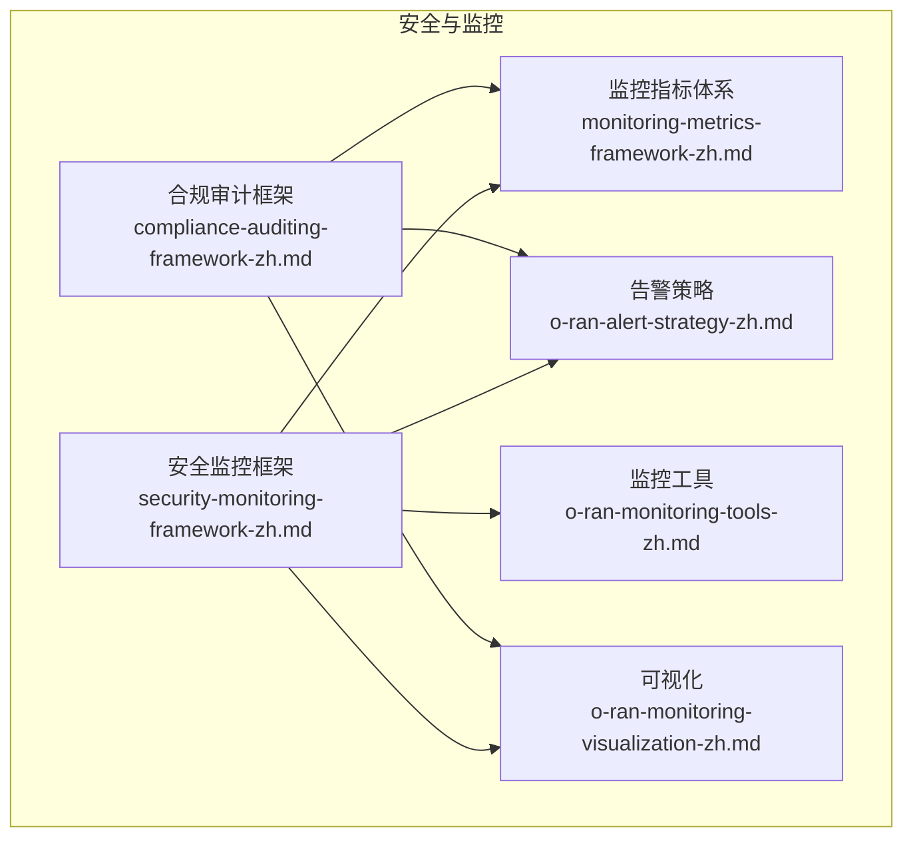
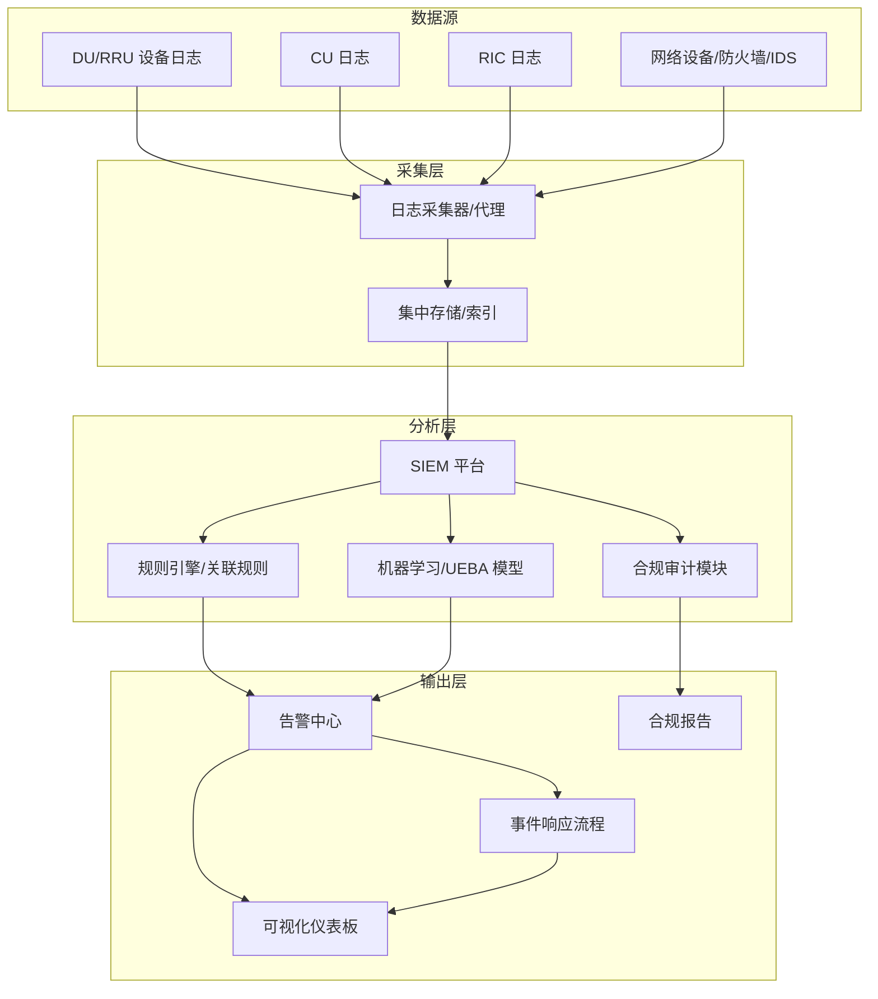
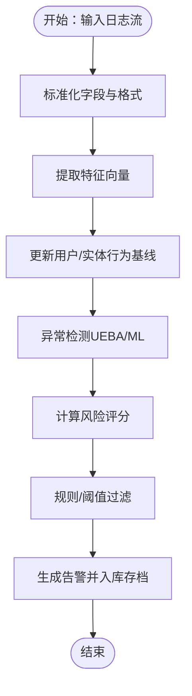
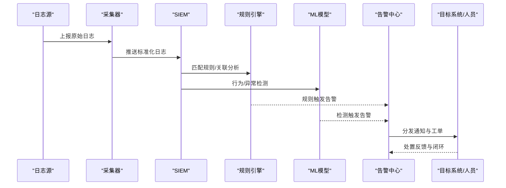
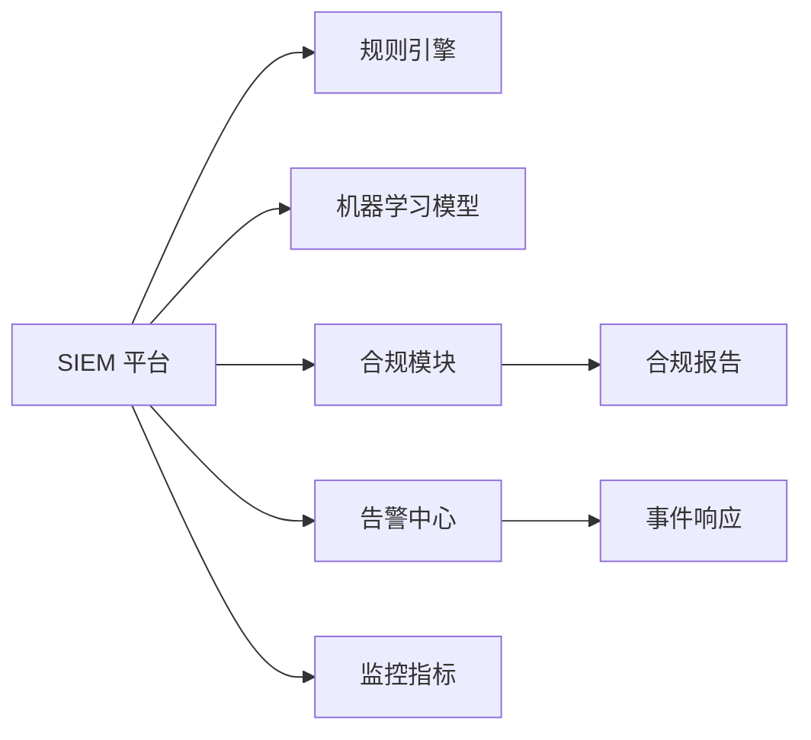

# 安全监控

<cite>
**本文引用的文件**
- [安全监控框架（中文）](file://12-security-privacy/monitoring-alerting/security-monitoring-framework-zh.md)
- [安全监控框架（英文）](file://12-security-privacy/monitoring-alerting/security-monitoring-framework.md)
- [合规审计框架（中文）](file://12-security-privacy/compliance-auditing/compliance-auditing-framework-zh.md)
- [合规审计框架（英文）](file://12-security-privacy/compliance-auditing/compliance-auditing-framework.md)
- [监控指标体系（中文）](file://28-monitoring-alerting/metric-system/monitoring-metrics-framework-zh.md)
- [监控指标体系（英文）](file://28-monitoring-alerting/metric-system/monitoring-metrics-framework.md)
- [告警策略（中文）](file://28-monitoring-alerting/alert-strategy/o-ran-alert-strategy-zh.md)
- [告警策略（英文）](file://28-monitoring-alerting/alert-strategy/o-ran-alert-strategy.md)
- [监控工具（中文）](file://28-monitoring-alerting/monitoring-tools/o-ran-monitoring-tools-zh.md)
- [监控工具（英文）](file://28-monitoring-alerting/monitoring-tools/o-ran-monitoring-tools.md)
- [可视化（中文）](file://28-monitoring-alerting/visualization/o-ran-monitoring-visualization-zh.md)
- [可视化（英文）](file://28-monitoring-alerting/visualization/o-ran-monitoring-visualization.md)
</cite>

## 目录
1. [引言](#引言)
2. [项目结构](#项目结构)
3. [核心组件](#核心组件)
4. [架构总览](#架构总览)
5. [详细组件分析](#详细组件分析)
6. [依赖关系分析](#依赖关系分析)
7. [性能考量](#性能考量)
8. [故障排查指南](#故障排查指南)
9. [结论](#结论)
10. [附录](#附录)

## 引言
本文件面向O-RAN网络的安全监控与合规运营，围绕SIEM系统部署、日志采集与事件关联分析、异常检测（UEBA与ML）、实时告警机制、漏洞扫描与修复、合规审计与报告生成、监控仪表板与事件响应流程等主题，提供可操作的实施指南与运维最佳实践。内容基于仓库中“安全隐私”与“监控告警”两大领域的权威文档进行系统化整合与提炼。

## 项目结构
本仓库在“12-security-privacy”与“28-monitoring-alerting”目录下提供了安全监控与合规审计的核心框架文档，涵盖：
- 安全监控框架：定义SIEM部署、日志采集、事件关联与告警策略
- 合规审计框架：定义合规检查、审计日志管理与报告生成
- 监控指标体系：定义关键监控指标与阈值基线
- 告警策略：定义告警分级、触发条件与处置流程
- 监控工具与可视化：定义可用工具清单与仪表板设计要点

**图示来源**
- [安全监控框架（中文）](file://12-security-privacy/monitoring-alerting/security-monitoring-framework-zh.md#L1-L200)
- [合规审计框架（中文）](file://12-security-privacy/compliance-auditing/compliance-auditing-framework-zh.md#L1-L200)
- [监控指标体系（中文）](file://28-monitoring-alerting/metric-system/monitoring-metrics-framework-zh.md#L1-L200)
- [告警策略（中文）](file://28-monitoring-alerting/alert-strategy/o-ran-alert-strategy-zh.md#L1-L200)
- [监控工具（中文）](file://28-monitoring-alerting/monitoring-tools/o-ran-monitoring-tools-zh.md#L1-L200)
- [可视化（中文）](file://28-monitoring-alerting/visualization/o-ran-monitoring-visualization-zh.md#L1-L200)

**章节来源**
- [安全监控框架（中文）](file://12-security-privacy/monitoring-alerting/security-monitoring-framework-zh.md#L1-L200)
- [监控指标体系（中文）](file://28-monitoring-alerting/metric-system/monitoring-metrics-framework-zh.md#L1-L200)

## 核心组件
- SIEM系统与日志采集：定义集中式日志收集、标准化字段映射、数据保留与索引策略
- 事件关联分析：定义规则引擎、时间窗聚合、相关性分析与威胁狩猎
- 异常检测（UEBA/ML）：定义用户行为基线、离群点检测、动态阈值与反馈闭环
- 实时告警：定义告警分级、路由策略、抑制与升级机制
- 漏洞扫描与修复：定义扫描周期、测试范围、修复优先级与验证流程
- 合规审计：定义检查项、日志留存、审计轨迹与报告模板
- 可视化与仪表板：定义KPI面板、趋势图、热力图与应急看板

**章节来源**
- [安全监控框架（中文）](file://12-security-privacy/monitoring-alerting/security-monitoring-framework-zh.md#L1-L200)
- [告警策略（中文）](file://28-monitoring-alerting/alert-strategy/o-ran-alert-strategy-zh.md#L1-L200)
- [合规审计框架（中文）](file://12-security-privacy/compliance-auditing/compliance-auditing-framework-zh.md#L1-L200)

## 架构总览
下图展示了O-RAN安全监控的整体架构：从设备与网络侧采集原始日志，经由采集器/代理汇聚到SIEM平台，进行清洗、关联与分析，输出告警并驱动处置流程；同时结合合规审计与可视化，形成闭环。

**图示来源**
- [安全监控框架（中文）](file://12-security-privacy/monitoring-alerting/security-monitoring-framework-zh.md#L1-L200)
- [监控指标体系（中文）](file://28-monitoring-alerting/metric-system/monitoring-metrics-framework-zh.md#L1-L200)
- [告警策略（中文）](file://28-monitoring-alerting/alert-strategy/o-ran-alert-strategy-zh.md#L1-L200)
- [合规审计框架（中文）](file://12-security-privacy/compliance-auditing/compliance-auditing-framework-zh.md#L1-L200)
- [可视化（中文）](file://28-monitoring-alerting/visualization/o-ran-monitoring-visualization-zh.md#L1-L200)

## 详细组件分析

### SIEM系统部署与日志采集
- 部署模式：建议采用分布式SIEM集群，结合高可用与弹性伸缩能力，满足O-RAN大规模日志吞吐
- 数据采集：统一采集协议（如Syslog/TLS、HTTP/HTTPS、消息队列），实现设备侧、网络侧与应用侧日志的标准化
- 字段映射：建立统一的字段命名规范与映射表，确保跨域日志可比对与关联
- 索引与保留：按日志类型与合规要求设定索引策略与保留期，兼顾检索效率与成本控制

**章节来源**
- [安全监控框架（中文）](file://12-security-privacy/monitoring-alerting/security-monitoring-framework-zh.md#L1-L200)

### 事件关联分析
- 规则引擎：基于时间窗、会话上下文与实体关系构建关联规则，识别潜在攻击链
- 关联维度：设备、用户、会话、切片、频段等多维组合，提升误报过滤能力
- 威胁狩猎：结合威胁情报与历史攻击模式，主动挖掘隐藏风险

**章节来源**
- [安全监控框架（中文）](file://12-security-privacy/monitoring-alerting/security-monitoring-framework-zh.md#L1-L200)

### 异常检测（UEBA与机器学习）
- 用户行为分析（UEBA）：建立用户行为基线，识别登录时间/地点异常、权限滥用、高频操作等
- 机器学习检测：使用无监督/半监督模型识别未知攻击模式，结合反馈持续优化
- 动态阈值：根据网络负载、时段与业务类型调整检测阈值，降低误报与漏报

**图示来源**
- [安全监控框架（中文）](file://12-security-privacy/monitoring-alerting/security-monitoring-framework-zh.md#L1-L200)

**章节来源**
- [安全监控框架（中文）](file://12-security-privacy/monitoring-alerting/security-monitoring-framework-zh.md#L1-L200)

### 实时告警机制
- 告警分级：按影响面与紧急度划分等级，明确处置时限与升级路径
- 路由策略：依据告警类型与责任域自动路由至对应团队或系统
- 抑制与去噪：通过时间窗与相关性抑制重复告警，避免告警风暴
- 多通道通知：邮件、IM、短信与工单系统联动，确保及时触达

**图示来源**
- [告警策略（中文）](file://28-monitoring-alerting/alert-strategy/o-ran-alert-strategy-zh.md#L1-L200)
- [安全监控框架（中文）](file://12-security-privacy/monitoring-alerting/security-monitoring-framework-zh.md#L1-L200)

**章节来源**
- [告警策略（中文）](file://28-monitoring-alerting/alert-strategy/o-ran-alert-strategy-zh.md#L1-L200)

### 漏洞扫描与修复流程
- 扫描策略：制定季度/月度扫描计划，覆盖网元软件、操作系统、中间件与第三方组件
- 渗透测试：在受控环境中模拟真实攻击，验证防护有效性与响应能力
- 修复流程：建立漏洞分级、修复时限、验证与回归测试的闭环流程

**章节来源**
- [安全监控框架（中文）](file://12-security-privacy/monitoring-alerting/security-monitoring-framework-zh.md#L1-L200)

### 合规审计与报告
- 合规检查：对照监管与内部政策，逐项核查配置、日志、访问与变更记录
- 审计日志管理：确保不可否认性、完整性与时效性，满足举证需求
- 报告生成：自动化生成周报/月报/专项报告，支持导出与归档

**章节来源**
- [合规审计框架（中文）](file://12-security-privacy/compliance-auditing/compliance-auditing-framework-zh.md#L1-L200)

### 监控仪表板与可视化
- KPI面板：端到端时延、丢包率、告警趋势、处置时效等关键指标
- 趋势与热力图：展示攻击分布、热点区域与异常时段
- 应急看板：事件状态、处置进度与资源占用的实时视图

**章节来源**
- [可视化（中文）](file://28-monitoring-alerting/visualization/o-ran-monitoring-visualization-zh.md#L1-L200)

## 依赖关系分析
- 组件耦合：SIEM与规则引擎、ML模型、告警中心强耦合；与合规模块弱耦合但共享日志与指标
- 外部依赖：日志源协议、合规标准、威胁情报源、可视化组件
- 循环依赖：通过接口与消息队列解耦，避免直接循环调用

**图示来源**
- [监控指标体系（中文）](file://28-monitoring-alerting/metric-system/monitoring-metrics-framework-zh.md#L1-L200)
- [告警策略（中文）](file://28-monitoring-alerting/alert-strategy/o-ran-alert-strategy-zh.md#L1-L200)
- [合规审计框架（中文）](file://12-security-privacy/compliance-auditing/compliance-auditing-framework-zh.md#L1-L200)

**章节来源**
- [监控指标体系（中文）](file://28-monitoring-alerting/metric-system/monitoring-metrics-framework-zh.md#L1-L200)
- [告警策略（中文）](file://28-monitoring-alerting/alert-strategy/o-ran-alert-strategy-zh.md#L1-L200)

## 性能考量
- 扩展性：采用分片索引与分布式计算，支撑TB级日志的实时处理
- 低延迟：对高频事件启用内存缓存与异步写入，缩短告警延迟
- 成本控制：按日志类型与访问频率分层存储，减少热数据成本
- 可靠性：多副本与故障切换，保障7×24小时运行

[本节为通用性能建议，不直接分析具体文件]

## 故障排查指南
- 日志采集问题：核对采集器配置、网络连通性与目标端口状态
- 关联规则失效：检查时间窗设置、字段映射与实体关系配置
- 告警风暴：启用抑制规则、调整阈值或拆分告警域
- 可视化异常：确认数据刷新间隔、查询超时与后端服务状态

**章节来源**
- [监控工具（中文）](file://28-monitoring-alerting/monitoring-tools/o-ran-monitoring-tools-zh.md#L1-L200)

## 结论
通过SIEM集中化治理、规则与ML协同的事件关联分析、分级告警与可视化看板，以及合规审计与漏洞修复闭环，O-RAN网络可实现从“被动响应”到“主动预警”的安全运营转型。建议以指标体系为基准，持续优化规则与模型，完善事件响应流程，确保安全监控体系的可持续演进。

[本节为总结性内容，不直接分析具体文件]

## 附录
- 实施步骤建议
  - 第一阶段：完成日志采集与标准化、建立基础指标与阈值
  - 第二阶段：上线规则引擎与ML模型，开启异常检测
  - 第三阶段：完善告警策略与可视化，接入合规审计
  - 第四阶段：引入威胁狩猎与渗透测试，持续优化
- 运维最佳实践
  - 定期评审规则与模型，剔除无效告警
  - 建立变更与回滚机制，确保稳定性
  - 加强跨团队协作与演练，提升处置效率

[本节为通用实践建议，不直接分析具体文件]