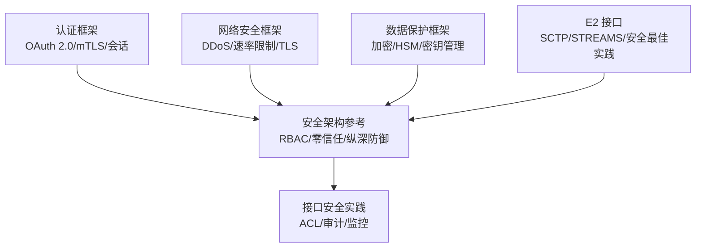
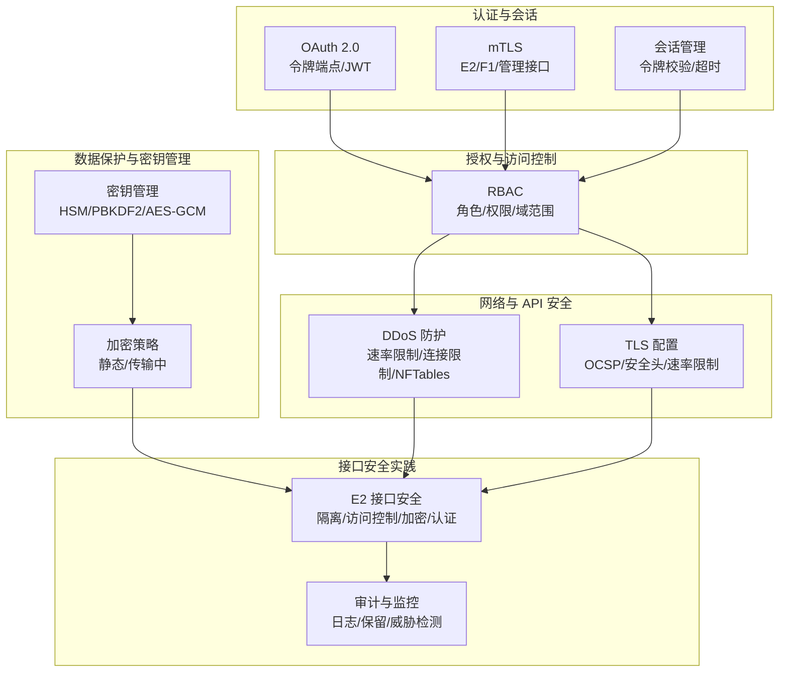
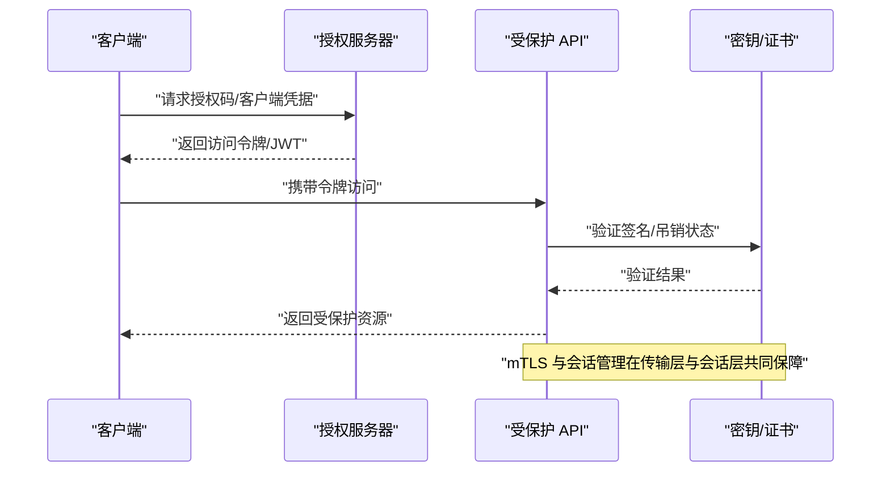
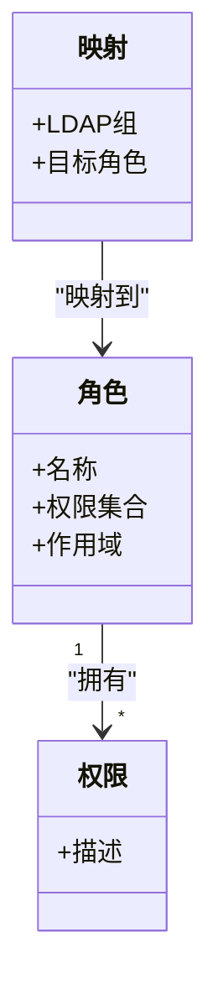
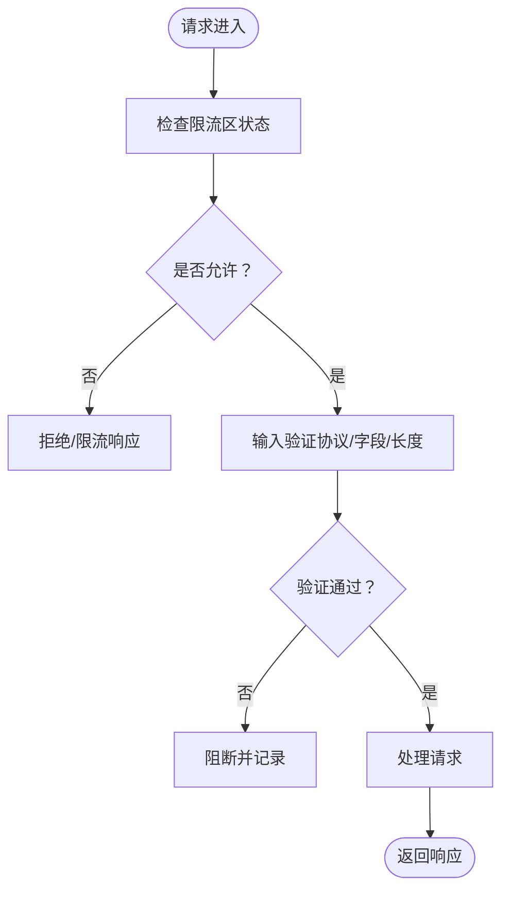
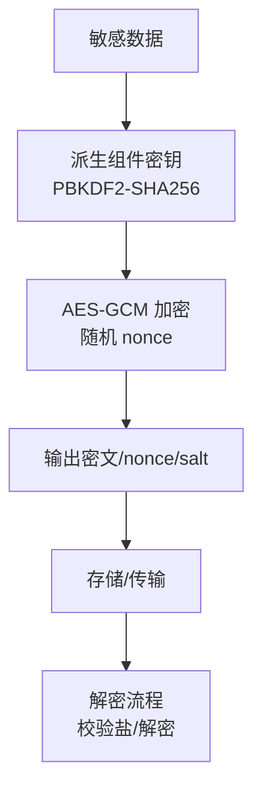
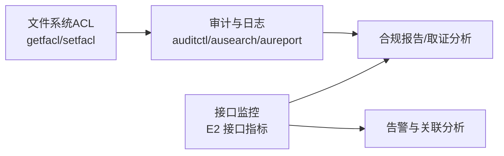
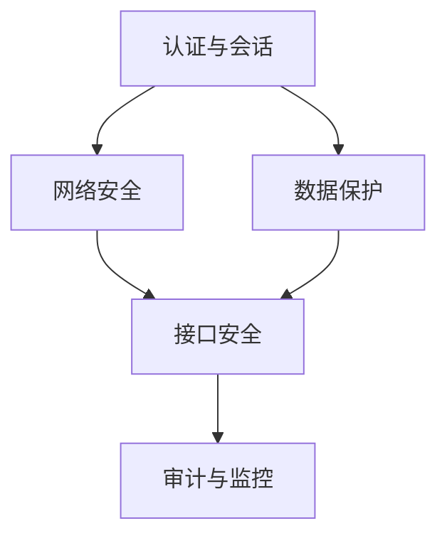

# 接口安全

<cite>
**本文引用的文件**
- [认证框架（中文）](file://12-security-privacy/authentication/authentication-framework-zh.md)
- [安全架构参考（中文）](file://12-security-privacy/security-architecture/security-reference-architecture-zh.md)
- [网络安全框架（中文）](file://12-security-privacy/network-security/network-security-framework-zh.md)
- [数据保护框架（中文）](file://12-security-privacy/data-protection/data-protection-framework-zh.md)
- [E2 接口（中文）](file://03-interface-standards/e2-interface.md)
</cite>

## 目录
1. [引言](#引言)
2. [项目结构](#项目结构)
3. [核心组件](#核心组件)
4. [架构总览](#架构总览)
5. [详细组件分析](#详细组件分析)
6. [依赖分析](#依赖分析)
7. [性能考虑](#性能考虑)
8. [故障排查指南](#故障排查指南)
9. [结论](#结论)
10. [附录](#附录)

## 引言
本文件面向 O-RAN 接口安全，围绕认证与会话、双向 TLS（mTLS）、证书管理、授权与访问控制（RBAC/ABAC）、API 安全（限流与输入验证）、消息完整性与加密、访问控制列表（ACL）、安全审计与监控、设计标准与实施流程、安全测试方法等方面，提供系统化、可落地的安全指导。内容直接来源于仓库中的安全与接口标准文档，并结合接口规范形成端到端的安全视图。

## 项目结构
本仓库中与接口安全直接相关的核心文档分布如下：
- 认证与会话：认证框架（OAuth 2.0、mTLS、会话管理）
- 授权与访问控制：安全架构参考（RBAC 角色设计）
- 网络与 API 安全：网络安全框架（DDoS 防护、速率限制、TLS 配置）
- 数据保护与密钥管理：数据保护框架（静态/传输加密、HSM 集成、密钥派生）
- 接口标准：E2 接口（服务化、SCTP/STREAMS、安全最佳实践）

**图表来源**
- [认证框架（中文）](file://12-security-privacy/authentication/authentication-framework-zh.md#L71-L185)
- [安全架构参考（中文）](file://12-security-privacy/security-architecture/security-reference-architecture-zh.md#L8-L71)
- [网络安全框架（中文）](file://12-security-privacy/network-security/network-security-framework-zh.md#L261-L473)
- [数据保护框架（中文）](file://12-security-privacy/data-protection/data-protection-framework-zh.md#L98-L184)
- [E2 接口（中文）](file://03-interface-standards/e2-interface.md#L241-L260)

**章节来源**
- [认证框架（中文）](file://12-security-privacy/authentication/authentication-framework-zh.md#L1-L208)
- [安全架构参考（中文）](file://12-security-privacy/security-architecture/security-reference-architecture-zh.md#L1-L530)
- [网络安全框架（中文）](file://12-security-privacy/network-security/network-security-framework-zh.md#L1-L473)
- [数据保护框架（中文）](file://12-security-privacy/data-protection/data-protection-framework-zh.md#L1-L376)
- [E2 接口（中文）](file://03-interface-standards/e2-interface.md#L1-L337)

## 核心组件
- 认证与会话
  - OAuth 2.0 授权服务器、令牌端点、客户端注册、JWT 配置
  - mTLS 双向 TLS 配置（E2/F1/管理接口）
  - 会话管理（会话创建、令牌校验、超时与活动更新）
- 授权与访问控制
  - RBAC 角色与权限映射（系统管理员、网络工程师、安全分析师、RIC 开发者）
- 网络与 API 安全
  - DDoS 防护（速率限制、连接限制、NFTables/iptables）
  - 速率限制与流量整形（Nginx 限流区）
  - TLS 配置（OCSP Stapling、安全头）
- 数据保护与密钥管理
  - 静态/传输中加密策略
  - HSM 集成与密钥派生（PBKDF2、AES-GCM）
- 接口安全
  - E2 接口安全最佳实践（网络隔离、访问控制、加密、认证授权）
  - 安全审计与监控（日志格式、保留策略、威胁检测）

**章节来源**
- [认证框架（中文）](file://12-security-privacy/authentication/authentication-framework-zh.md#L71-L185)
- [安全架构参考（中文）](file://12-security-privacy/security-architecture/security-reference-architecture-zh.md#L284-L337)
- [网络安全框架（中文）](file://12-security-privacy/network-security/network-security-framework-zh.md#L261-L473)
- [数据保护框架（中文）](file://12-security-privacy/data-protection/data-protection-framework-zh.md#L98-L184)
- [E2 接口（中文）](file://03-interface-standards/e2-interface.md#L241-L260)

## 架构总览
下图展示 O-RAN 接口安全的整体架构：认证与会话层、授权与访问控制层、网络与 API 安全层、数据保护与密钥管理层、接口安全实践层，以及安全审计与监控层。

**图表来源**
- [认证框架（中文）](file://12-security-privacy/authentication/authentication-framework-zh.md#L71-L185)
- [安全架构参考（中文）](file://12-security-privacy/security-architecture/security-reference-architecture-zh.md#L284-L337)
- [网络安全框架（中文）](file://12-security-privacy/network-security/network-security-framework-zh.md#L261-L473)
- [数据保护框架（中文）](file://12-security-privacy/data-protection/data-protection-framework-zh.md#L98-L184)
- [E2 接口（中文）](file://03-interface-standards/e2-interface.md#L241-L260)

## 详细组件分析

### 认证机制：OAuth 2.0、mTLS 与会话管理
- OAuth 2.0
  - 授权服务器与令牌端点
  - 客户端注册（ID/密钥/重定向 URI/授权类型/作用域）
  - JWT 配置（签名算法、有效期、发行方）
- mTLS
  - E2/F1/管理接口的 CA、吊销检查（OCSP/CRL）、密码套件
- 会话管理
  - 会话创建（随机 ID、基于时间与用户信息的令牌）
  - 会话校验（令牌一致性、超时、活动更新）

**图表来源**
- [认证框架（中文）](file://12-security-privacy/authentication/authentication-framework-zh.md#L71-L124)
- [认证框架（中文）](file://12-security-privacy/authentication/authentication-framework-zh.md#L126-L185)

**章节来源**
- [认证框架（中文）](file://12-security-privacy/authentication/authentication-framework-zh.md#L71-L185)

### 授权管理：RBAC 角色设计与权限控制
- 角色与权限
  - 系统管理员（全局）
  - 网络工程师（域特定）
  - 安全分析师（安全域）
  - RIC 开发者（RIC 域）
- 映射与范围
  - LDAP 组映射到角色
  - 权限范围限定（全局/域特定/安全域/RIC 域）

**图表来源**
- [安全架构参考（中文）](file://12-security-privacy/security-architecture/security-reference-architecture-zh.md#L284-L337)

**章节来源**
- [安全架构参考（中文）](file://12-security-privacy/security-architecture/security-reference-architecture-zh.md#L284-L337)

### API 安全：限流策略、输入验证与 API 网关配置
- 限流策略
  - 全局限速与每源限速
  - 突发允许与持续时间
  - NFTables/iptables 规则（SYN 限制、ICMP 限制、连接数限制）
- 速率限制与流量整形
  - Nginx 限流区（zone/burst/rate）
  - 接口级带宽限制与队列类型
- 输入验证
  - 结合接口标准（E2 接口）的消息格式与字段约束
  - 传输层与应用层的双重校验（SCTP/STREAMS 与 API 层）

**图表来源**
- [网络安全框架（中文）](file://12-security-privacy/network-security/network-security-framework-zh.md#L261-L310)
- [网络安全框架（中文）](file://12-security-privacy/network-security/network-security-framework-zh.md#L311-L426)
- [网络安全框架（中文）](file://12-security-privacy/network-security/network-security-framework-zh.md#L428-L473)

**章节来源**
- [网络安全框架（中文）](file://12-security-privacy/network-security/network-security-framework-zh.md#L261-L473)
- [E2 接口（中文）](file://03-interface-standards/e2-interface.md#L241-L260)

### 消息完整性保护与加密
- 静态数据加密
  - 数据库加密（AES-256-GCM）、文件系统加密（LUKS/dm-crypt）、对象存储加密（服务端/客户端）
- 传输中数据加密
  - IPsec 隧道（IKEv2、AES-GCM/SHA256、MODP4096）
  - TLS 证书配置（Nginx/E2 接口）
- 密钥管理与派生
  - HSM 集成（可选）
  - PBKDF2-SHA256 迭代 100000，AES-GCM 随机 nonce
  - 组件级密钥派生与盐校验

**图表来源**
- [数据保护框架（中文）](file://12-security-privacy/data-protection/data-protection-framework-zh.md#L98-L184)
- [数据保护框架（中文）](file://12-security-privacy/data-protection/data-protection-framework-zh.md#L30-L96)

**章节来源**
- [数据保护框架（中文）](file://12-security-privacy/data-protection/data-protection-framework-zh.md#L98-L184)
- [数据保护框架（中文）](file://12-security-privacy/data-protection/data-protection-framework-zh.md#L30-L96)

### 接口安全：访问控制列表、安全审计与接口监控
- 访问控制列表（ACL）
  - 文件系统 ACL（getfacl/setfacl），默认 ACL 与继承
  - 审计与日志系统（auditctl/ausearch/aureport）
- 安全审计
  - 审计日志类别（认证/授权/配置变更/数据访问/系统/安全事件）
  - 日志格式（时间戳/严重性/组件/事件类型/用户/会话/IP/动作详情）
  - 保留策略（安全/操作/调试/归档）
- 接口监控
  - E2 接口监控（连接状态/吞吐量/延迟/错误率）
  - 告警分级与关联分析
  - 与其他监控系统集成

**图表来源**
- [数据保护框架（中文）](file://12-security-privacy/data-protection/data-protection-framework-zh.md#L342-L376)
- [E2 接口（中文）](file://03-interface-standards/e2-interface.md#L150-L169)

**章节来源**
- [数据保护框架（中文）](file://12-security-privacy/data-protection/data-protection-framework-zh.md#L342-L376)
- [E2 接口（中文）](file://03-interface-standards/e2-interface.md#L150-L169)

## 依赖分析
- 组件耦合
  - 认证与授权：OAuth 2.0 与 RBAC 协同，mTLS 与会话管理共同提供端到端安全
  - 网络安全与接口安全：DDoS 防护与速率限制为接口提供抗压能力；TLS 与证书管理保障传输安全
  - 数据保护与密钥管理：HSM 与密钥派生为静态与传输中数据提供加密保障
- 外部依赖
  - 证书颁发机构（CA）与吊销机制（OCSP/CRL）
  - HSM 设备（可选）
  - Nginx/NFTables/iptables 等基础设施组件

**图表来源**
- [认证框架（中文）](file://12-security-privacy/authentication/authentication-framework-zh.md#L71-L185)
- [安全架构参考（中文）](file://12-security-privacy/security-architecture/security-reference-architecture-zh.md#L284-L337)
- [网络安全框架（中文）](file://12-security-privacy/network-security/network-security-framework-zh.md#L261-L473)
- [数据保护框架（中文）](file://12-security-privacy/data-protection/data-protection-framework-zh.md#L98-L184)
- [E2 接口（中文）](file://03-interface-standards/e2-interface.md#L241-L260)

**章节来源**
- [认证框架（中文）](file://12-security-privacy/authentication/authentication-framework-zh.md#L71-L185)
- [安全架构参考（中文）](file://12-security-privacy/security-architecture/security-reference-architecture-zh.md#L284-L337)
- [网络安全框架（中文）](file://12-security-privacy/network-security/network-security-framework-zh.md#L261-L473)
- [数据保护框架（中文）](file://12-security-privacy/data-protection/data-protection-framework-zh.md#L98-L184)
- [E2 接口（中文）](file://03-interface-standards/e2-interface.md#L241-L260)

## 性能考虑
- 传输层优化
  - E2 接口 SCTP 多流与多路径提升可靠性与带宽
  - 网络加速（SR-IOV/DPDK）降低延迟
- 应用层优化
  - 消息压缩与批量处理减少交互次数
  - 缓存机制减少重复计算与数据传输
- 网络安全开销
  - TLS 会话缓存与 OCSP Stapling 降低握手与吊销检查开销
  - 速率限制与流量整形在保证安全的同时避免过度丢包

**章节来源**
- [E2 接口（中文）](file://03-interface-standards/e2-interface.md#L131-L147)
- [网络安全框架（中文）](file://12-security-privacy/network-security/network-security-framework-zh.md#L428-L473)

## 故障排查指南
- 认证与会话
  - 会话令牌不一致或过期：检查会话创建与校验逻辑、超时配置
  - mTLS 失败：确认证书链、吊销检查（OCSP/CRL）、密码套件兼容
- 授权与访问控制
  - RBAC 拒绝：核对角色权限与作用域、LDAP 映射
- 网络与 API 安全
  - DDoS 攻击症状：检查速率限制规则、连接数阈值、Nginx/NFTables 配置
  - TLS 握手失败：验证证书有效性、协议版本、安全头
- 数据保护与密钥管理
  - 解密失败：核对盐与密钥派生参数、HSM 连接状态
- 接口安全
  - E2 接口异常：检查连接状态、消息吞吐与延迟、告警关联分析

**章节来源**
- [认证框架（中文）](file://12-security-privacy/authentication/authentication-framework-zh.md#L126-L185)
- [网络安全框架（中文）](file://12-security-privacy/network-security/network-security-framework-zh.md#L311-L426)
- [数据保护框架（中文）](file://12-security-privacy/data-protection/data-protection-framework-zh.md#L98-L184)
- [E2 接口（中文）](file://03-interface-standards/e2-interface.md#L170-L189)

## 结论
本文件基于仓库中的安全与接口标准文档，构建了 O-RAN 接口安全的系统化指导：以 OAuth 2.0 与 mTLS 为基础认证，以 RBAC 为核心授权，以 DDoS 防护与速率限制保障 API 安全，以 HSM 与密钥派生实现数据保护，以 ACL、审计与监控强化接口安全与合规。建议在实施过程中遵循零信任与纵深防御原则，结合接口标准进行端到端安全设计与验证。

## 附录
- 设计标准与实施流程
  - 零信任与安全域划分（管理/控制平面/用户平面/基础设施）
  - 纵深防御（物理/网络/平台/应用/数据）
  - 证书管理与密钥轮换策略
- 安全测试方法
  - 自动化合规检查脚本（TLS/证书/访问控制/防火墙）
  - 压力与抗压测试（DDoS/速率限制/接口延迟）
  - 渗透测试与漏洞扫描（网络与应用层）

**章节来源**
- [安全架构参考（中文）](file://12-security-privacy/security-architecture/security-reference-architecture-zh.md#L8-L71)
- [网络安全框架（中文）](file://12-security-privacy/network-security/network-security-framework-zh.md#L306-L440)