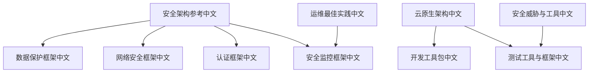
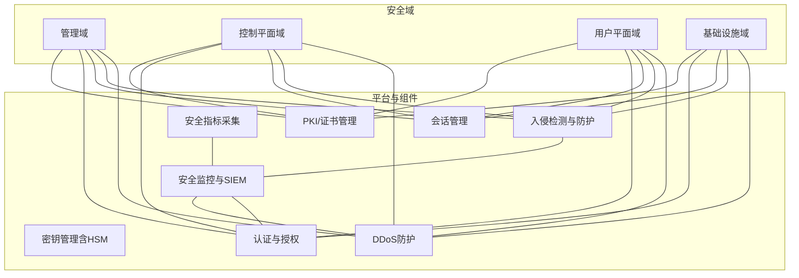
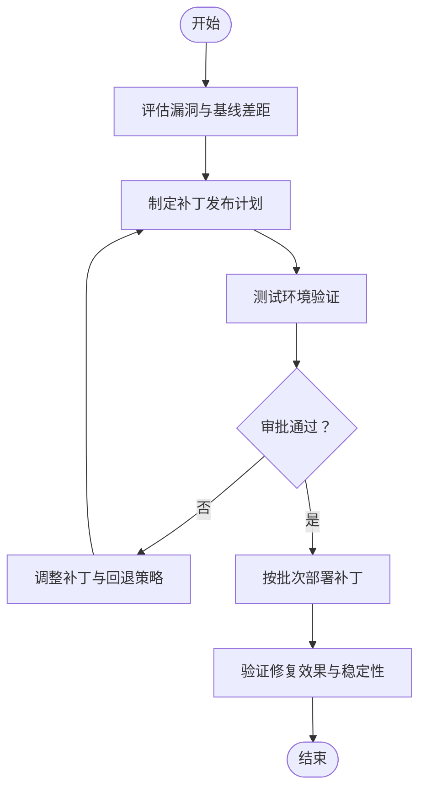
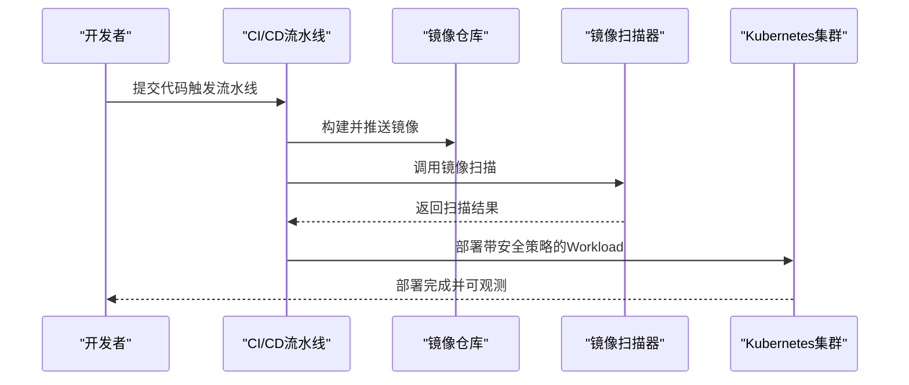
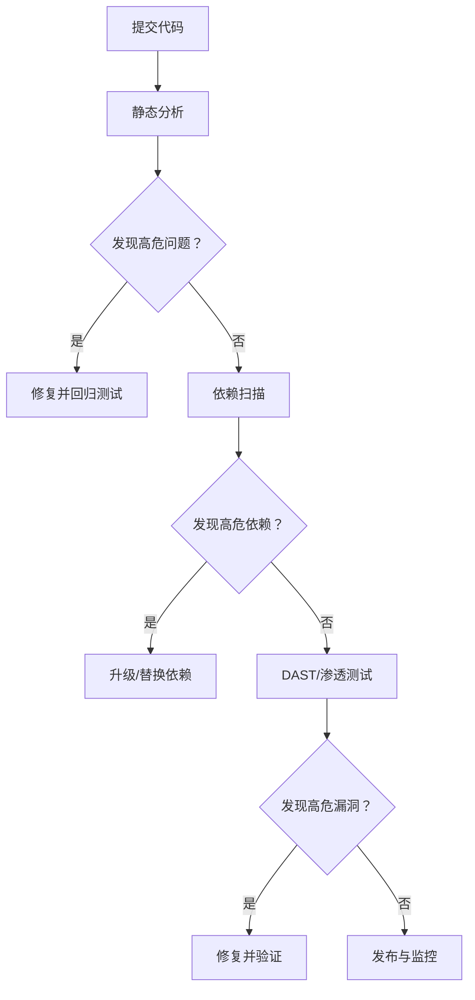
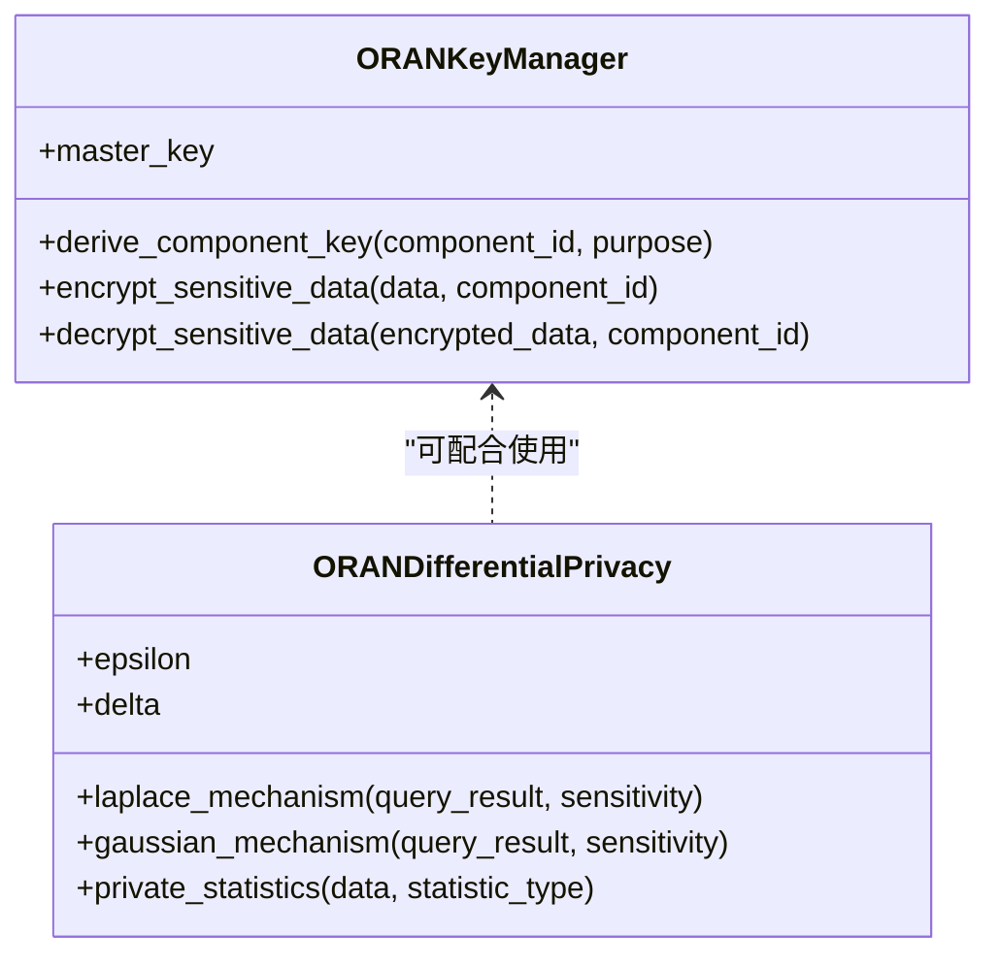
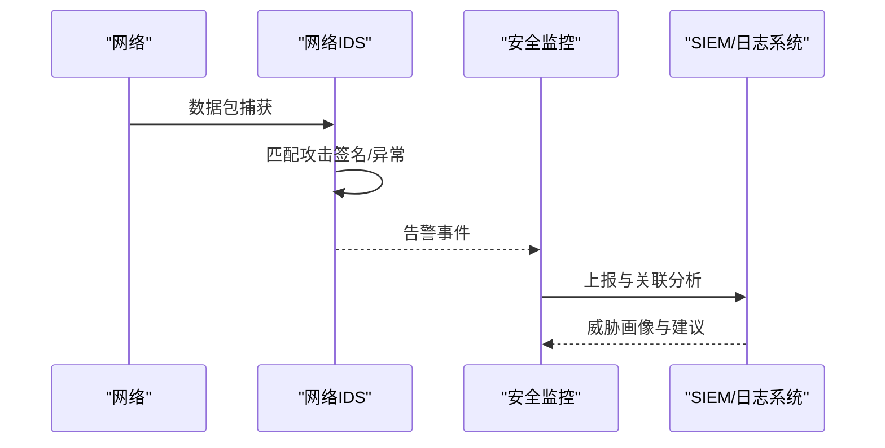
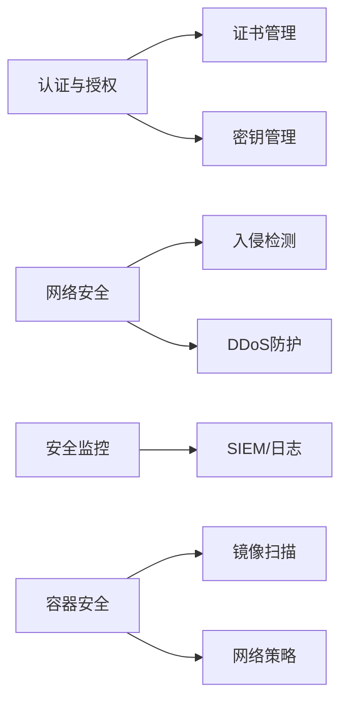

# 系统安全

<cite>
**本文引用的文件**
- [安全架构参考（中文）](file://12-security-privacy/security-architecture/security-reference-architecture-zh.md)
- [数据保护框架（中文）](file://12-security-privacy/data-protection/data-protection-framework-zh.md)
- [网络安全框架（中文）](file://12-security-privacy/network-security/network-security-framework-zh.md)
- [认证框架（中文）](file://12-security-privacy/authentication/authentication-framework-zh.md)
- [安全监控框架（中文）](file://12-security-privacy/monitoring-alerting/security-monitoring-framework-zh.md)
- [安全威胁与工具（中文）](file://29-security-threats/security-tools/o-ran-security-tools.md)
- [云原生架构（中文）](file://05-cloud-integration/cloud-native-architecture.md)
- [开发工具包（中文）](file://22-tool-platforms/development-tools/o-ran-development-toolkit-zh.md)
- [测试工具与框架（中文）](file://13-testing-validation/testing-tools/testing-tools-frameworks.md)
- [运维最佳实践（中文）](file://30-best-practices/operations-practices/o-ran-operations-best-practices.md)
</cite>

## 目录
1. [引言](#引言)
2. [项目结构](#项目结构)
3. [核心组件](#核心组件)
4. [架构总览](#架构总览)
5. [详细组件分析](#详细组件分析)
6. [依赖分析](#依赖分析)
7. [性能考虑](#性能考虑)
8. [故障排查指南](#故障排查指南)
9. [结论](#结论)
10. [附录](#附录)

## 引言
本文件面向O-RAN系统的安全建设，围绕“系统安全”主题，系统梳理并输出以下维度的安全指导：操作系统加固与补丁管理、安全配置与权限控制；容器安全（镜像扫描、运行时保护、网络策略）；应用安全（代码审计、依赖检查、漏洞扫描）；数据安全（加密存储、数据脱敏、密钥管理）；系统安全（入侵检测、日志审计、安全监控）；并给出设计原则、实施标准与安全评估方法，帮助在O-RAN部署中构建纵深防御、持续演进的安全体系。

## 项目结构
本仓库中与“系统安全”直接相关的内容主要集中在“12-security-privacy”目录下，覆盖安全架构、数据保护、网络安全、认证与会话管理、以及安全监控等主题；同时，“05-cloud-integration”、“13-testing-validation”、“22-tool-platforms”、“29-security-threats”、“30-best-practices”等目录提供了云原生安全、测试与工具链、威胁与运维最佳实践等支撑材料。

**图示来源**
- [安全架构参考（中文）](file://12-security-privacy/security-architecture/security-reference-architecture-zh.md#L1-L530)
- [数据保护框架（中文）](file://12-security-privacy/data-protection/data-protection-framework-zh.md#L1-L376)
- [网络安全框架（中文）](file://12-security-privacy/network-security/network-security-framework-zh.md#L1-L473)
- [认证框架（中文）](file://12-security-privacy/authentication/authentication-framework-zh.md#L1-L208)
- [安全监控框架（中文）](file://12-security-privacy/monitoring-alerting/security-monitoring-framework-zh.md#L1-L117)
- [云原生架构（中文）](file://05-cloud-integration/cloud-native-architecture.md#L342-L376)
- [开发工具包（中文）](file://22-tool-platforms/development-tools/o-ran-development-toolkit-zh.md#L222-L257)
- [测试工具与框架（中文）](file://13-testing-validation/testing-tools/testing-tools-frameworks.md#L561-L598)
- [安全威胁与工具（中文）](file://29-security-threats/security-tools/o-ran-security-tools.md#L181-L211)
- [运维最佳实践（中文）](file://30-best-practices/operations-practices/o-ran-operations-best-practices.md#L100-L130)

**章节来源**
- [安全架构参考（中文）](file://12-security-privacy/security-architecture/security-reference-architecture-zh.md#L1-L530)
- [网络安全框架（中文）](file://12-security-privacy/network-security/network-security-framework-zh.md#L1-L473)
- [数据保护框架（中文）](file://12-security-privacy/data-protection/data-protection-framework-zh.md#L1-L376)
- [认证框架（中文）](file://12-security-privacy/authentication/authentication-framework-zh.md#L1-L208)
- [安全监控框架（中文）](file://12-security-privacy/monitoring-alerting/security-monitoring-framework-zh.md#L1-L117)
- [云原生架构（中文）](file://05-cloud-integration/cloud-native-architecture.md#L342-L376)
- [开发工具包（中文）](file://22-tool-platforms/development-tools/o-ran-development-toolkit-zh.md#L222-L257)
- [测试工具与框架（中文）](file://13-testing-validation/testing-tools/testing-tools-frameworks.md#L561-L598)
- [安全威胁与工具（中文）](file://29-security-threats/security-tools/o-ran-security-tools.md#L181-L211)
- [运维最佳实践（中文）](file://30-best-practices/operations-practices/o-ran-operations-best-practices.md#L100-L130)

## 核心组件
- 安全架构与设计原则：零信任模型、纵深防御、安全域划分、证书与密钥管理、认证与授权、安全监控与SIEM集成。
- 网络安全：零信任网络分段、微分段、mTLS、入侵检测与DDoS防护、速率限制与流量整形。
- 数据安全：静态与传输中加密、密钥管理（含HSM）、差分隐私、DLP策略、审计日志与合规。
- 应用安全：会话管理、API安全、输入/输出处理、安全头部、代码与依赖安全扫描。
- 容器安全：镜像扫描、运行时保护、网络策略、RBAC、Secrets管理、最小权限与只读文件系统。
- 安全监控：事件采集、威胁检测、告警生成、响应建议、日志分析与取证。

**章节来源**
- [安全架构参考（中文）](file://12-security-privacy/security-architecture/security-reference-architecture-zh.md#L6-L71)
- [网络安全框架（中文）](file://12-security-privacy/network-security/network-security-framework-zh.md#L6-L41)
- [数据保护框架（中文）](file://12-security-privacy/data-protection/data-protection-framework-zh.md#L6-L28)
- [认证框架（中文）](file://12-security-privacy/authentication/authentication-framework-zh.md#L6-L23)
- [安全监控框架（中文）](file://12-security-privacy/monitoring-alerting/security-monitoring-framework-zh.md#L33-L117)

## 架构总览
下图展示O-RAN系统安全的整体架构：以零信任与纵深防御为核心，通过安全域划分实现网络隔离；以证书与密钥管理体系保障端到端加密与身份可信；以认证与授权、会话管理保障访问控制；以IDS/IPS、DDoS缓解、日志审计与SIEM实现持续监控与威胁处置；以容器与应用安全、测试与工具链支撑安全开发生命周期。

**图示来源**
- [安全架构参考（中文）](file://12-security-privacy/security-architecture/security-reference-architecture-zh.md#L8-L36)
- [网络安全框架（中文）](file://12-security-privacy/network-security/network-security-framework-zh.md#L10-L40)
- [数据保护框架（中文）](file://12-security-privacy/data-protection/data-protection-framework-zh.md#L98-L184)
- [认证框架（中文）](file://12-security-privacy/authentication/authentication-framework-zh.md#L126-L185)
- [安全监控框架（中文）](file://12-security-privacy/monitoring-alerting/security-monitoring-framework-zh.md#L33-L117)

## 详细组件分析

### 操作系统加固与补丁管理、安全配置与权限控制
- 补丁管理与更新：建立周期性评估、测试与发布的流程，结合漏洞扫描与基线核查，确保系统与中间件及时修复已知风险。
- 安全配置：最小权限原则、禁用不必要的服务与端口、强化SSH与内核参数、启用审计与日志聚合。
- 权限控制：基于角色的访问控制（RBAC）、最小权限授予、定期权限复审、账户生命周期管理。

**图示来源**
- [运维最佳实践（中文）](file://30-best-practices/operations-practices/o-ran-operations-best-practices.md#L198-L202)

**章节来源**
- [运维最佳实践（中文）](file://30-best-practices/operations-practices/o-ran-operations-best-practices.md#L198-L202)

### 容器安全：镜像扫描、运行时保护与网络策略
- 镜像扫描：在CI/CD流水线中集成静态镜像扫描（如Trivy、Clair），识别高危漏洞与恶意软件。
- 运行时保护：最小权限（非root）、只读文件系统、资源配额、健康检查与安全策略（Pod Security Standards）。
- 网络策略：Kubernetes网络策略限制Pod间通信，结合入口/出口流量控制与mTLS，实现微分段。

**图示来源**
- [测试工具与框架（中文）](file://13-testing-validation/testing-tools/testing-tools-frameworks.md#L580-L583)
- [云原生架构（中文）](file://05-cloud-integration/cloud-native-architecture.md#L360-L370)
- [开发工具包（中文）](file://22-tool-platforms/development-tools/o-ran-development-toolkit-zh.md#L252-L256)

**章节来源**
- [测试工具与框架（中文）](file://13-testing-validation/testing-tools/testing-tools-frameworks.md#L580-L583)
- [云原生架构（中文）](file://05-cloud-integration/cloud-native-architecture.md#L360-L370)
- [开发工具包（中文）](file://22-tool-platforms/development-tools/o-ran-development-toolkit-zh.md#L252-L256)

### 应用安全：代码审计、依赖检查与漏洞扫描
- 代码审计：静态分析（SonarQube）、动态应用安全测试（DAST，如OWASP ZAP）、覆盖率与质量门禁。
- 依赖检查：SBOM生成、第三方组件漏洞扫描、供应链风险评估。
- 漏洞扫描：容器镜像、网络端口与协议、API安全与配置错误扫描。

**图示来源**
- [测试工具与框架（中文）](file://13-testing-validation/testing-tools/testing-tools-frameworks.md#L568-L595)

**章节来源**
- [测试工具与框架（中文）](file://13-testing-validation/testing-tools/testing-tools-frameworks.md#L568-L595)

### 数据安全：加密存储、数据脱敏与密钥管理
- 加密策略：数据库与文件系统（LUKS/dm-crypt）采用AES-256-GCM；对象存储支持服务端与客户端加密。
- 传输加密：IPsec隧道与TLS 1.3，接口层面强制加密与完整性校验。
- 密钥管理：主密钥生成与派生、PBKDF2迭代、AES-GCM封装、HSM集成与密钥轮换。
- 隐私增强：差分隐私（拉普拉斯/高斯机制）用于统计分析；DLP策略识别与阻断敏感数据外泄。
- 审计日志：统一日志格式、分级保留、实时监控与取证分析。

**图示来源**
- [数据保护框架（中文）](file://12-security-privacy/data-protection/data-protection-framework-zh.md#L100-L184)
- [数据保护框架（中文）](file://12-security-privacy/data-protection/data-protection-framework-zh.md#L188-L249)

**章节来源**
- [数据保护框架（中文）](file://12-security-privacy/data-protection/data-protection-framework-zh.md#L8-L28)
- [数据保护框架（中文）](file://12-security-privacy/data-protection/data-protection-framework-zh.md#L30-L96)
- [数据保护框架（中文）](file://12-security-privacy/data-protection/data-protection-framework-zh.md#L98-L184)
- [数据保护框架（中文）](file://12-security-privacy/data-protection/data-protection-framework-zh.md#L186-L249)
- [数据保护框架（中文）](file://12-security-privacy/data-protection/data-protection-framework-zh.md#L251-L298)
- [数据保护框架（中文）](file://12-security-privacy/data-protection/data-protection-framework-zh.md#L342-L374)

### 系统安全：入侵检测、日志审计与安全监控
- 入侵检测与防护：基于签名与异常的IDS，端口扫描与畸形包检测，告警与日志记录。
- DDoS防护：速率限制、连接限制、NFTables/iptables规则、流量监控与缓解策略。
- 安全监控：事件采集、威胁检测、告警生成与响应建议、SIEM集成与可视化。

**图示来源**
- [网络安全框架（中文）](file://12-security-privacy/network-security/network-security-framework-zh.md#L116-L259)
- [安全监控框架（中文）](file://12-security-privacy/monitoring-alerting/security-monitoring-framework-zh.md#L33-L117)

**章节来源**
- [网络安全框架（中文）](file://12-security-privacy/network-security/network-security-framework-zh.md#L114-L426)
- [安全监控框架（中文）](file://12-security-privacy/monitoring-alerting/security-monitoring-framework-zh.md#L33-L117)

### 设计原则、实施标准与安全评估方法
- 设计原则：零信任、最小权限、持续验证、微分段、纵深防御、隐私设计与可审计性。
- 实施标准：TLS 1.3、IPSec、mTLS、RBAC、网络策略、最小权限容器、HSM密钥管理、差分隐私、DLP。
- 评估方法：漏洞扫描、渗透测试、配置基线核查、日志与告警有效性验证、合规性检查（GDPR、NIST、ISO 27001、3GPP）。

**章节来源**
- [安全架构参考（中文）](file://12-security-privacy/security-architecture/security-reference-architecture-zh.md#L38-L71)
- [安全架构参考（中文）](file://12-security-privacy/security-architecture/security-reference-architecture-zh.md#L486-L528)
- [数据保护框架（中文）](file://12-security-privacy/data-protection/data-protection-framework-zh.md#L300-L340)

## 依赖分析
- 组件耦合：认证与授权依赖证书与密钥管理；网络策略与mTLS共同保障通信安全；安全监控依赖日志与指标采集；容器安全依赖镜像扫描与网络策略。
- 外部依赖：HSM、SIEM、扫描工具（Trivy、ZAP、Nmap）、协议分析工具（Wireshark插件）。
- 风险点：证书轮换与吊销、密钥派生一致性、日志保留与取证、DDoS缓解与黑洞路由的自动化联动。

**图示来源**
- [认证框架（中文）](file://12-security-privacy/authentication/authentication-framework-zh.md#L100-L124)
- [数据保护框架（中文）](file://12-security-privacy/data-protection/data-protection-framework-zh.md#L98-L184)
- [网络安全框架（中文）](file://12-security-privacy/network-security/network-security-framework-zh.md#L114-L426)
- [安全监控框架（中文）](file://12-security-privacy/monitoring-alerting/security-monitoring-framework-zh.md#L33-L117)
- [测试工具与框架（中文）](file://13-testing-validation/testing-tools/testing-tools-frameworks.md#L580-L583)
- [云原生架构（中文）](file://05-cloud-integration/cloud-native-architecture.md#L360-L370)

**章节来源**
- [认证框架（中文）](file://12-security-privacy/authentication/authentication-framework-zh.md#L100-L124)
- [数据保护框架（中文）](file://12-security-privacy/data-protection/data-protection-framework-zh.md#L98-L184)
- [网络安全框架（中文）](file://12-security-privacy/network-security/network-security-framework-zh.md#L114-L426)
- [安全监控框架（中文）](file://12-security-privacy/monitoring-alerting/security-monitoring-framework-zh.md#L33-L117)
- [测试工具与框架（中文）](file://13-testing-validation/testing-tools/testing-tools-frameworks.md#L580-L583)
- [云原生架构（中文）](file://05-cloud-integration/cloud-native-architecture.md#L360-L370)

## 性能考虑
- 加密与完整性：在保证安全的前提下，选择高性能算法（AES-GCM、ChaCha20-Poly1305）与硬件加速（如Intel AES-NI）。
- 网络策略与mTLS：避免过度严格的策略导致延迟增加；通过合理的会话缓存与OCSP Stapling降低握手开销。
- IDS/IPS与DDoS：采用基于会话状态的快速路径与阈值调优，减少误报与漏报；结合流量整形与队列调度维持关键业务QoS。
- 日志与监控：采用异步写入、压缩与分区归档；指标聚合与采样策略降低监控系统自身开销。

## 故障排查指南
- 认证失败与会话异常：检查证书链、吊销状态、会话令牌一致性与超时配置；核对LDAP/SAML映射与RBAC权限。
- 网络异常与DDoS：检查iptables/NFTables规则、速率限制阈值、黑洞路由联动；分析IDS告警与流量模式。
- 数据访问与脱敏：确认密钥派生参数一致、HSM可用性、DLP策略匹配规则；核对日志保留与取证能力。
- 容器部署问题：验证镜像扫描结果、网络策略放通、RBAC授权、Secrets挂载与权限；检查只读文件系统与资源配额。

**章节来源**
- [认证框架（中文）](file://12-security-privacy/authentication/authentication-framework-zh.md#L126-L185)
- [网络安全框架（中文）](file://12-security-privacy/network-security/network-security-framework-zh.md#L311-L426)
- [数据保护框架（中文）](file://12-security-privacy/data-protection/data-protection-framework-zh.md#L251-L298)
- [云原生架构（中文）](file://05-cloud-integration/cloud-native-architecture.md#L360-L370)

## 结论
O-RAN系统安全应以零信任与纵深防御为核心，贯穿“系统—网络—数据—应用—容器—监控”的全栈安全体系。通过完善的证书与密钥管理、严格的访问控制与权限最小化、持续的漏洞扫描与补丁管理、以及基于威胁情报的监控与响应，可显著提升系统的抗攻击能力与合规水平。建议将安全纳入开发生命周期（DevSecOps），并建立常态化的评估与改进机制。

## 附录
- 合规矩阵与审计要点：GDPR、NIST网络安全框架、ISO 27001、3GPP TS 33.501/33.102/33.401。
- 威胁与工具：SOAR平台、API与集成管理、安全自动化与编排。

**章节来源**
- [安全架构参考（中文）](file://12-security-privacy/security-architecture/security-reference-architecture-zh.md#L486-L528)
- [安全威胁与工具（中文）](file://29-security-threats/security-tools/o-ran-security-tools.md#L181-L211)