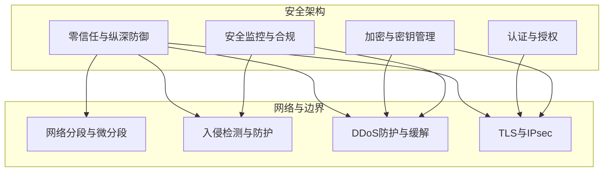
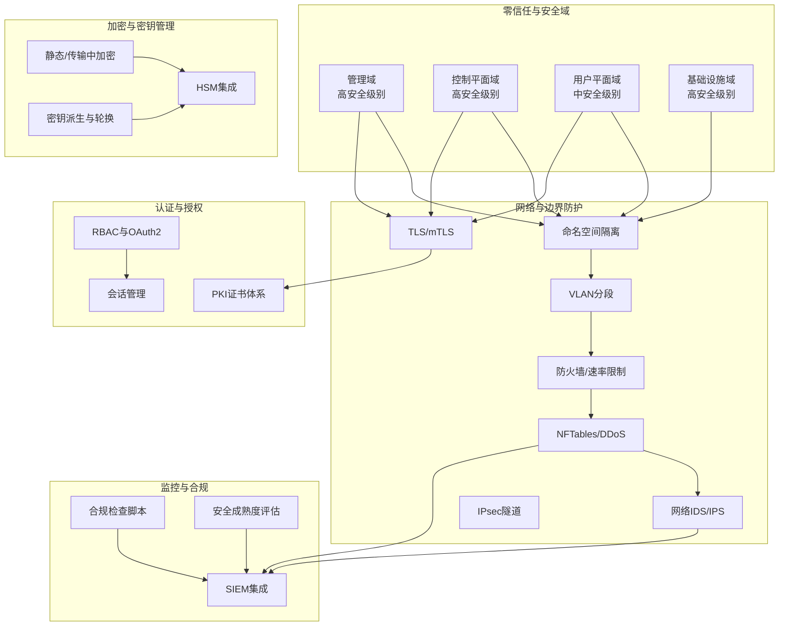
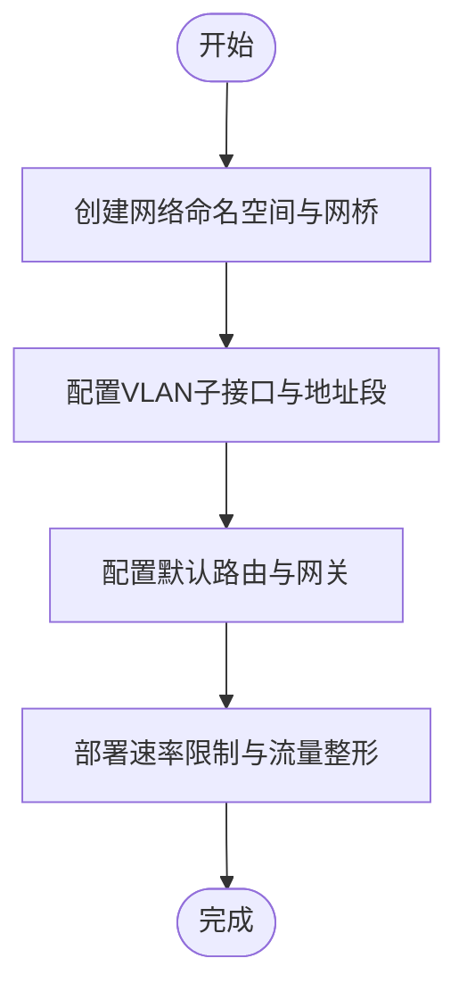
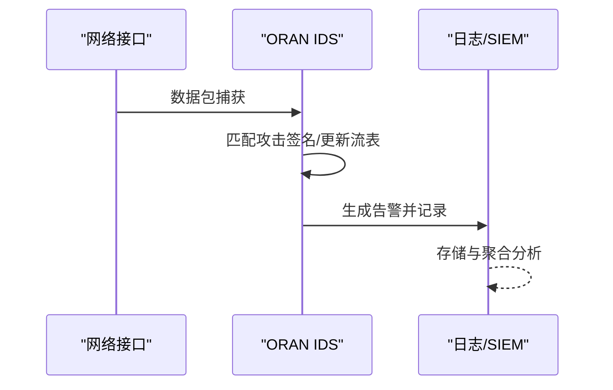
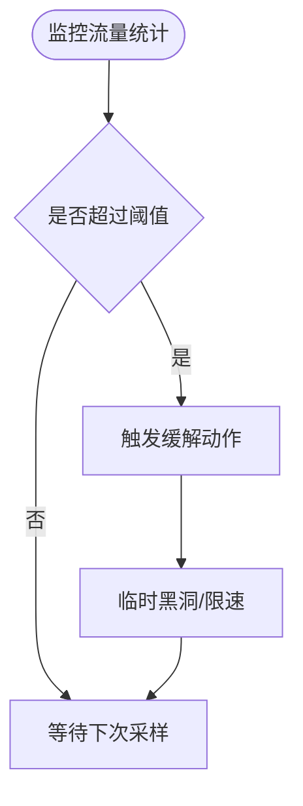
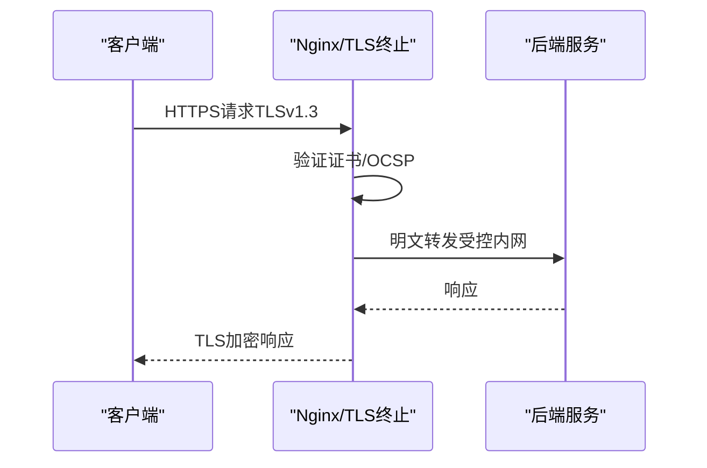
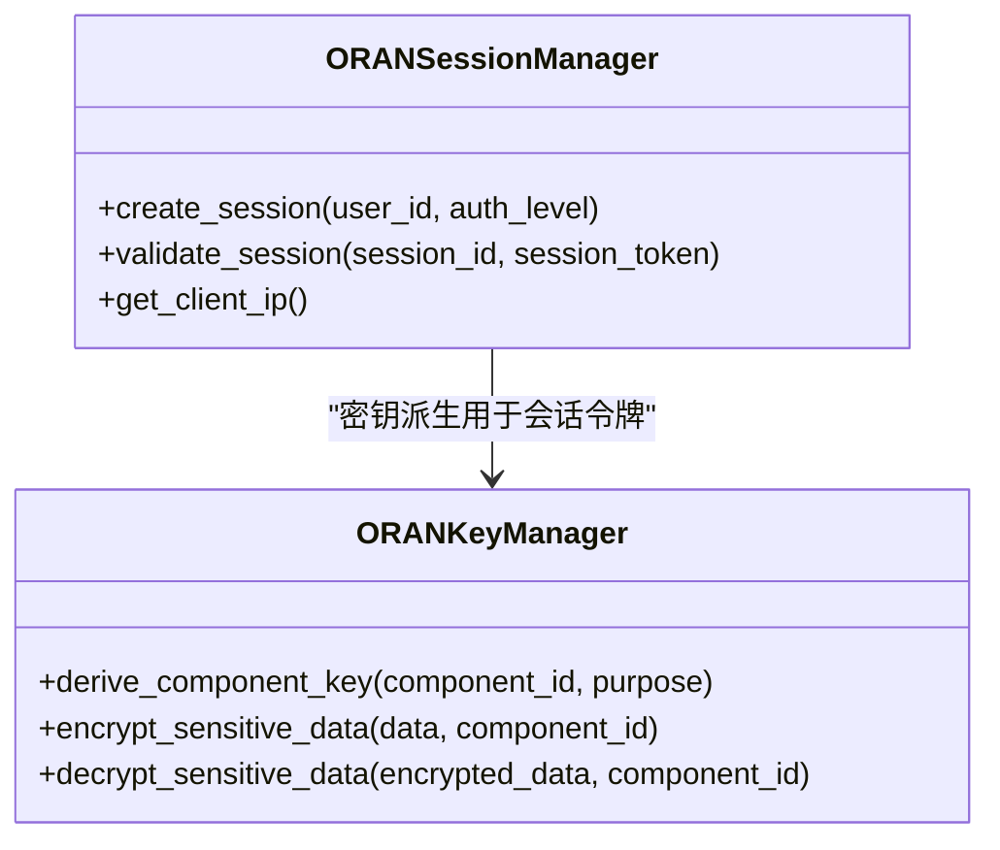
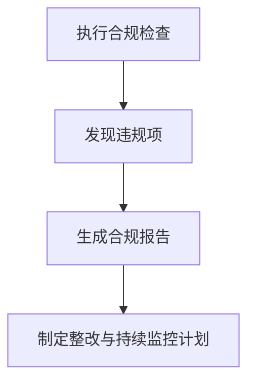
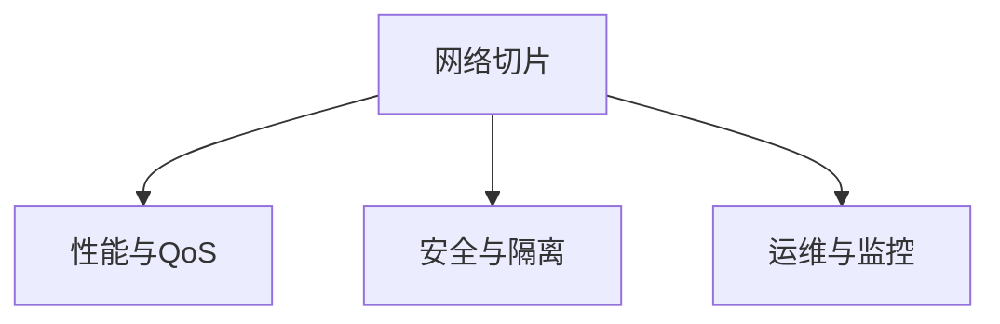
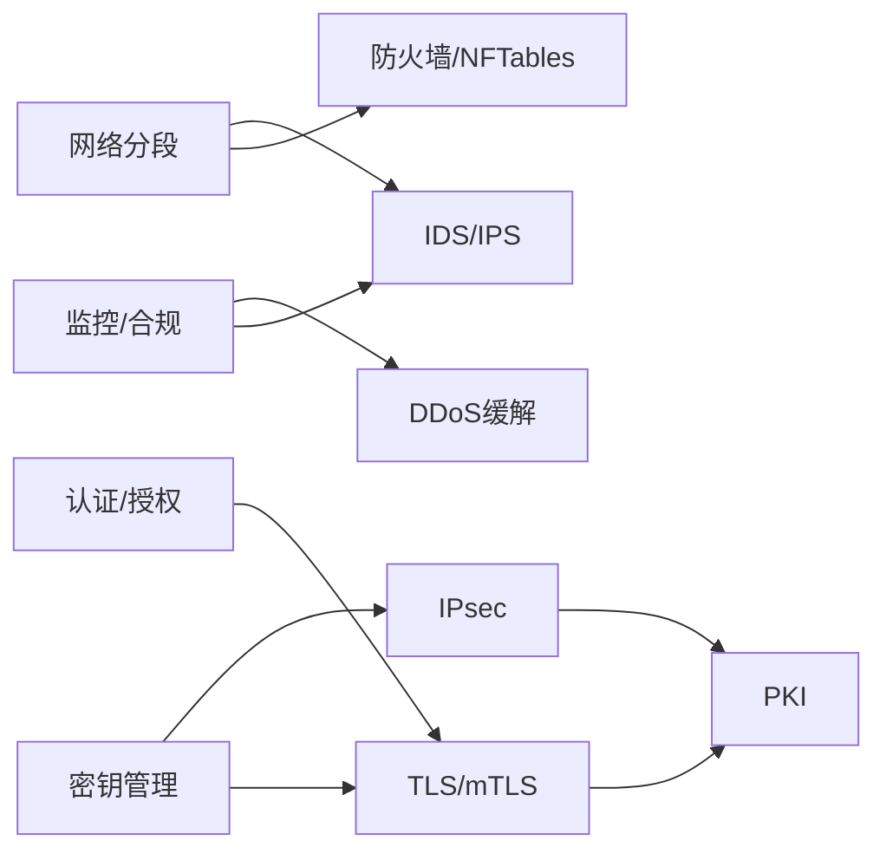

# 网络安全

<cite>
**本文引用的文件**
- [网络安全框架（中文）](file://12-security-privacy/network-security/network-security-framework-zh.md)
- [网络安全框架（英文）](file://12-security-privacy/network-security/network-security-framework.md)
- [安全架构参考（中文）](file://12-security-privacy/security-architecture/security-reference-architecture-zh.md)
- [认证框架（中文）](file://12-security-privacy/authentication/authentication-framework-zh.md)
- [数据保护框架（中文）](file://12-security-privacy/data-protection/data-protection-framework-zh.md)
- [数据保护框架（英文）](file://12-security-privacy/data-protection/data-protection-framework.md)
- [安全监控框架（英文）](file://12-security-privacy/monitoring-alerting/security-monitoring-framework.md)
- [网络切片创新案例（英文）](file://21-case-studies/innovation-cases/o-ran-innovation-cases.md)
- [综合术语表](file://comprehensive-oran-glossary.md)
</cite>

## 目录
1. [简介](#简介)
2. [项目结构](#项目结构)
3. [核心组件](#核心组件)
4. [架构总览](#架构总览)
5. [详细组件分析](#详细组件分析)
6. [依赖分析](#依赖分析)
7. [性能考虑](#性能考虑)
8. [故障排查指南](#故障排查指南)
9. [结论](#结论)
10. [附录](#附录)

## 简介
本文件面向O-RAN网络安全，围绕网络分段与微分段、入侵检测与DDoS防护、加密传输与密钥管理、访问控制与认证授权等主题，结合仓库中的网络安全框架、安全架构参考、认证与数据保护文档，形成一套可落地的安全指导。内容覆盖设计原则、实施步骤与安全评估方法，并通过图示帮助读者理解关键流程与组件关系。

## 项目结构
本仓库中与网络安全直接相关的核心文档主要分布在“12-security-privacy”目录下，包括：
- 网络安全框架：提供零信任、网络分段、DDoS防护、安全通信协议的配置与脚本示例
- 安全架构参考：定义零信任与纵深防御模型、加密与证书管理、RBAC与mTLS策略
- 认证框架：多因素认证、PKI证书管理、OAuth2与会话管理
- 数据保护框架：静态与传输中加密、IPsec隧道、密钥管理与隐私增强
- 安全监控框架：合规检查、威胁检测与安全成熟度评估
- 网络切片创新案例：展示网络切片在垂直行业中的定制化与隔离需求

**章节来源**
- file://12-security-privacy/network-security/network-security-framework-zh.md#L6-L40
- file://12-security-privacy/security-architecture/security-reference-architecture-zh.md#L8-L71

## 核心组件
- 零信任与安全域划分：明确管理域、控制平面域、用户平面域、基础设施域的安全级别与访问控制要求
- 网络分段与微分段：基于命名空间与VLAN的隔离方案，以及速率限制与流量整形策略
- 入侵检测与防护：基于Python Scapy的网络IDS签名检测与告警
- DDoS防护：iptables/NFTables规则、速率限制、连接限制与黑洞路由缓解
- 加密与密钥管理：TLS配置、IPsec隧道、HSM集成与密钥派生
- 认证与授权：mTLS、RBAC、OAuth2与会话管理
- 安全监控与合规：SIEM集成、合规检查脚本与安全成熟度评估

**章节来源**
- file://12-security-privacy/network-security/network-security-framework-zh.md#L6-L112
- file://12-security-privacy/network-security/network-security-framework-zh.md#L114-L259
- file://12-security-privacy/network-security/network-security-framework-zh.md#L261-L426
- file://12-security-privacy/security-architecture/security-reference-architecture-zh.md#L75-L145
- file://12-security-privacy/authentication/authentication-framework-zh.md#L8-L69
- file://12-security-privacy/data-protection/data-protection-framework-zh.md#L30-L96

## 架构总览
下图展示了O-RAN网络安全的整体架构：以零信任为核心，通过网络分段与微分段实现边界内最小权限访问；配合防火墙、速率限制与DDoS缓解策略；在传输层采用TLS与IPsec，在数据层采用静态与传输中加密；认证采用mTLS与RBAC，授权基于角色与会话；安全监控与合规贯穿全生命周期。

**图表来源**
- [网络安全框架（中文）](file://12-security-privacy/network-security/network-security-framework-zh.md#L6-L112)
- [安全架构参考（中文）](file://12-security-privacy/security-architecture/security-reference-architecture-zh.md#L75-L145)
- [认证框架（中文）](file://12-security-privacy/authentication/authentication-framework-zh.md#L8-L69)
- [数据保护框架（中文）](file://12-security-privacy/data-protection/data-protection-framework-zh.md#L30-L96)
- [安全监控框架（英文）](file://12-security-privacy/monitoring-alerting/security-monitoring-framework.md#L306-L440)

## 详细组件分析

### 网络分段与微分段
- 设计原则：零信任“永不信任，始终验证”，最小权限与持续验证，结合微分段实现域间隔离
- 实施方式：
  - 命名空间隔离：为管理、控制平面、用户平面、基础设施域分别创建网络命名空间与网桥
  - VLAN分段：按域分配VLAN ID并配置子接口与地址段
  - 速率限制与流量整形：针对E2/F1/管理接口设定带宽上限与队列策略，降低跨域横向移动风险

**图表来源**
- [网络安全框架（中文）](file://12-security-privacy/network-security/network-security-framework-zh.md#L42-L112)

**章节来源**
- file://12-security-privacy/network-security/network-security-framework-zh.md#L6-L40
- file://12-security-privacy/network-security/network-security-framework-zh.md#L42-L112

### 入侵检测与防护（IDS/IPS）
- 策略：基于签名的检测（SYN洪泛、端口扫描、畸形包），结合流表与阈值告警
- 实现：使用Python Scapy进行数据包捕获与分析，输出告警并记录至日志
- 集成：与SIEM对接，支持实时告警与取证分析

**图表来源**
- [网络安全框架（中文）](file://12-security-privacy/network-security/network-security-framework-zh.md#L114-L259)

**章节来源**
- file://12-security-privacy/network-security/network-security-framework-zh.md#L114-L259

### DDoS防护与缓解
- 速率限制与连接限制：通过iptables/NFTables限制SYN/ICMP速率与每源连接数
- 流量整形：为E2/F1/管理接口配置带宽上限、队列类型与整形算法
- 缓解策略：黑洞路由、速率限制、连接节流、地理过滤、协议验证、基于签名的阻断
- 监控与告警：周期性采集/proc/net/dev统计，超过阈值触发缓解动作

**图表来源**
- [网络安全框架（中文）](file://12-security-privacy/network-security/network-security-framework-zh.md#L261-L426)

**章节来源**
- file://12-security-privacy/network-security/network-security-framework-zh.md#L261-L426

### 加密传输与隧道
- TLS配置：为E2/F1/管理接口配置TLSv1.3/v1.2、密码套件、OCSP装订与安全头
- IPsec隧道：站点到站点连接，IKEv2、AES-GCM、MODP4096参数与预共享密钥
- 传输中加密：Nginx代理场景下的TLS终止与速率限制

**图表来源**
- [网络安全框架（中文）](file://12-security-privacy/network-security/network-security-framework-zh.md#L428-L473)
- [数据保护框架（中文）](file://12-security-privacy/data-protection/data-protection-framework-zh.md#L30-L96)

**章节来源**
- file://12-security-privacy/network-security/network-security-framework-zh.md#L428-L473
- file://12-security-privacy/data-protection/data-protection-framework-zh.md#L30-L96

### 认证与授权
- 双向TLS（mTLS）：E2/F1/管理接口启用客户端证书校验、OCSP/CRL与密码套件策略
- RBAC：角色与权限映射、域特定范围与审计日志
- OAuth2：授权服务器、令牌端点、JWT配置与刷新策略
- 会话管理：会话创建、令牌校验、超时与活动时间维护

**图表来源**
- [认证框架（中文）](file://12-security-privacy/authentication/authentication-framework-zh.md#L126-L185)
- [安全架构参考（中文）](file://12-security-privacy/security-architecture/security-reference-architecture-zh.md#L147-L245)

**章节来源**
- file://12-security-privacy/authentication/authentication-framework-zh.md#L8-L69
- file://12-security-privacy/authentication/authentication-framework-zh.md#L126-L185
- file://12-security-privacy/security-architecture/security-reference-architecture-zh.md#L247-L337
- file://12-security-privacy/security-architecture/security-reference-architecture-zh.md#L147-L245

### 安全监控与合规
- 合规检查：TLS版本、证书有效性、密码策略、SSH配置、防火墙规则与不必要的服务
- SIEM集成：收集认证、网络异常、配置变更与性能异常，生成威胁告警与响应建议
- 成熟度评估：威胁检测、事件响应、合规监控、安全自动化与风险管理的综合评分

**图表来源**
- [安全监控框架（英文）](file://12-security-privacy/monitoring-alerting/security-monitoring-framework.md#L306-L440)

**章节来源**
- file://12-security-privacy/monitoring-alerting/security-monitoring-framework.md#L306-L440
- file://12-security-privacy/monitoring-alerting/security-monitoring-framework.md#L639-L731

### 网络切片技术应用
- 切片理念：在共享物理基础设施上创建多个虚拟网络，满足不同垂直行业的性能与安全需求
- 切片管理：动态切片创建、资源分配、跨切片隔离与实时性能监控
- 安全隔离：结合网络分段、VLAN与访问控制，确保切片间与切片内的安全边界

**图表来源**
- [网络切片创新案例（英文）](file://21-case-studies/innovation-cases/o-ran-innovation-cases.md#L103-L123)
- [综合术语表](file://comprehensive-oran-glossary.md#L298-L302)

**章节来源**
- file://21-case-studies/innovation-cases/o-ran-innovation-cases.md#L103-L123
- file://comprehensive-oran-glossary.md#L298-L302

## 依赖分析
- 组件耦合：
  - 网络分段与微分段依赖命名空间与VLAN配置，与防火墙/NFTables规则共同构成边界控制
  - 加密传输依赖证书管理与密钥派生，TLS与IPsec在不同场景互补
  - 认证与授权依赖PKI与RBAC，会话管理依赖密钥派生与令牌校验
  - 安全监控与合规贯穿全栈，为威胁检测与成熟度评估提供数据支撑
- 外部依赖：
  - Nginx/TLS终止、StrongSwan/IPsec、Scapy/IDS、Elastic/Kafka/SIEM、HSM

**图表来源**
- [网络安全框架（中文）](file://12-security-privacy/network-security/network-security-framework-zh.md#L42-L112)
- [安全架构参考（中文）](file://12-security-privacy/security-architecture/security-reference-architecture-zh.md#L75-L145)
- [认证框架（中文）](file://12-security-privacy/authentication/authentication-framework-zh.md#L8-L69)
- [数据保护框架（中文）](file://12-security-privacy/data-protection/data-protection-framework-zh.md#L30-L96)
- [安全监控框架（英文）](file://12-security-privacy/monitoring-alerting/security-monitoring-framework.md#L306-L440)

**章节来源**
- file://12-security-privacy/network-security/network-security-framework-zh.md#L42-L112
- file://12-security-privacy/security-architecture/security-reference-architecture-zh.md#L75-L145
- file://12-security-privacy/authentication/authentication-framework-zh.md#L8-L69
- file://12-security-privacy/data-protection/data-protection-framework-zh.md#L30-L96
- file://12-security-privacy/monitoring-alerting/security-monitoring-framework.md#L306-L440

## 性能考虑
- 速率限制与流量整形：避免过载导致的尾延迟与丢包，保障关键接口（如F1）的高吞吐
- 队列算法选择：根据优先级与延迟目标选择合适的队列类型（如fq_codel、pfifo_fast、RED）
- 加密开销：TLS与IPsec会带来CPU与延迟成本，需结合硬件加速与参数调优
- 监控与告警：采用轻量化采集与聚合，避免监控系统成为瓶颈

## 故障排查指南
- 合规检查脚本：验证TLS版本、证书有效性、密码策略与防火墙规则，快速定位配置问题
- IDS告警：核对告警类型与源IP，结合日志与会话状态定位攻击源与影响面
- DDoS缓解：检查iptables/NFTables规则生效情况、速率阈值与黑洞路由配置
- 加密问题：确认证书链、OCSP装订、密码套件兼容性与会话缓存配置
- 会话与认证：核对会话令牌生成与校验流程、超时与活动时间更新

**章节来源**
- file://12-security-privacy/monitoring-alerting/security-monitoring-framework.md#L306-L440
- file://12-security-privacy/network-security/network-security-framework-zh.md#L114-L259
- file://12-security-privacy/network-security/network-security-framework-zh.md#L261-L426
- file://12-security-privacy/data-protection/data-protection-framework-zh.md#L30-L96
- file://12-security-privacy/authentication/authentication-framework-zh.md#L126-L185

## 结论
本指导以零信任为核心，结合网络分段、微分段、防火墙与DDoS缓解、TLS与IPsec加密、mTLS与RBAC、HSM与密钥管理、以及SIEM与合规监控，构建了O-RAN网络安全的端到端方案。通过标准化实施步骤与持续的安全成熟度评估，可在保证性能与可靠性的前提下，有效应对多样化的网络威胁。

## 附录
- 关键术语：网络切片、NFV、VNF、白盒、虚拟化等
- 参考案例：垂直行业网络切片定制化与隔离实践

**章节来源**
- file://comprehensive-oran-glossary.md#L298-L302
- file://21-case-studies/innovation-cases/o-ran-innovation-cases.md#L103-L123