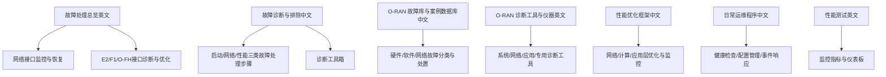
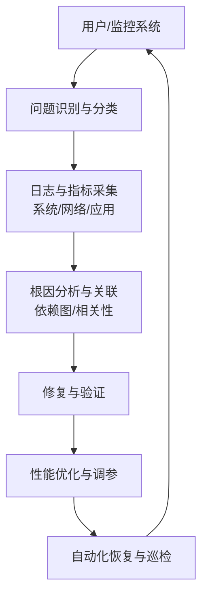
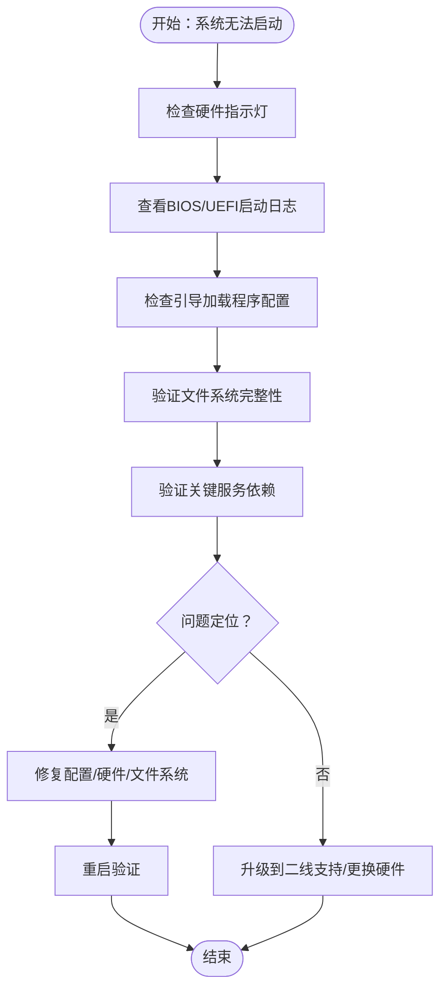
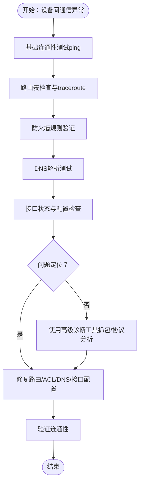
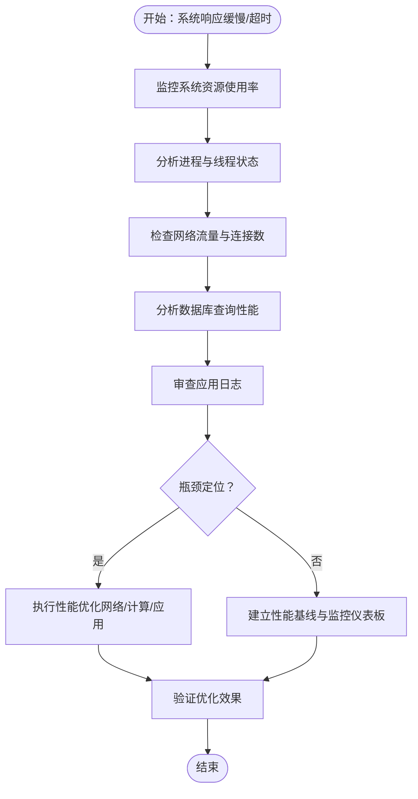
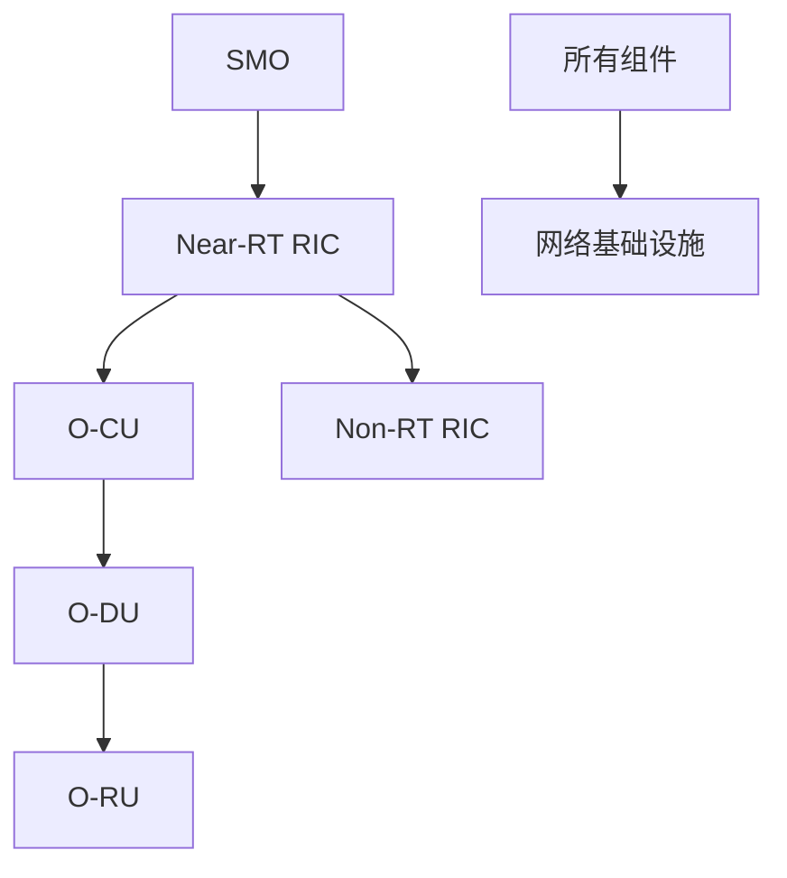

# 常见故障处理

<cite>
**本文引用的文件**
- [故障处理总览（英文）](file://14-operations-management/fault-handling/fault-troubleshooting-guide.md)
- [故障诊断与排除（中文）](file://27-troubleshooting-diagnosis/readme-zh.md)
- [O-RAN 故障库与案例数据库（中文）](file://27-troubleshooting-diagnosis/fault-library/o-ran-fault-case-database-zh.md)
- [O-RAN 诊断工具与仪器（英文）](file://27-troubleshooting-diagnosis/diagnostic-tools/o-ran-diagnostic-instrumentation.md)
- [O-RAN 性能优化框架（中文）](file://14-operations-management/performance-optimization/performance-optimization-framework-zh.md)
- [O-RAN 日常运维程序（中文）](file://14-operations-management/daily-operations/daily-operation-procedures-zh.md)
- [性能测试（英文）](file://13-testing-validation/performance-testing/performance-testing.md)
</cite>

## 目录
1. [简介](#简介)
2. [项目结构](#项目结构)
3. [核心组件](#核心组件)
4. [架构总览](#架构总览)
5. [详细组件分析](#详细组件分析)
6. [依赖分析](#依赖分析)
7. [性能考虑](#性能考虑)
8. [故障排查指南](#故障排查指南)
9. [结论](#结论)
10. [附录](#附录)

## 简介
本文件面向O-RAN环境的常见故障处理，围绕“启动故障”“网络连接故障”“性能异常故障”三类典型问题，提供系统化的故障现象、处理步骤、预防措施与最佳实践。内容基于仓库中的故障处理、诊断工具、性能优化与日常运维程序等材料整理而成，既可作为一线工程师的快速参考，也可用于制定标准化的故障处理SOP与知识库。

## 项目结构
本主题涉及的资料主要分布在以下目录与文件：
- 14-operations-management/fault-handling：故障处理总览与自动化恢复
- 27-troubleshooting-diagnosis：故障诊断与排除、诊断工具、故障库
- 14-operations-management/performance-optimization：性能优化框架
- 14-operations-management/daily-operations：日常运维与健康检查
- 13-testing-validation/performance-testing：性能监控与分析

**章节来源**
- file://14-operations-management/fault-handling/fault-troubleshooting-guide.md#L1-L633
- file://27-troubleshooting-diagnosis/readme-zh.md#L1-L105
- file://27-troubleshooting-diagnosis/fault-library/o-ran-fault-case-database-zh.md#L1-L114
- file://27-troubleshooting-diagnosis/diagnostic-tools/o-ran-diagnostic-instrumentation.md#L1-L343
- file://14-operations-management/performance-optimization/performance-optimization-framework-zh.md#L1-L342
- file://14-operations-management/daily-operations/daily-operation-procedures-zh.md#L1-L419
- file://13-testing-validation/performance-testing/performance-testing.md#L244-L288

## 核心组件
- 故障分类与影响评估：覆盖网络功能、接口协议、基础设施与平台三大类故障，明确各子类的典型表现与影响范围。
- 诊断方法论：提供系统化的问题识别、根因分析、工具使用与报告生成流程。
- 诊断工具箱：涵盖系统、网络、应用与专用诊断工具，支撑从硬件到协议的全栈排查。
- 自动化恢复：针对E2/F1/O-FH等关键接口，提供自动恢复脚本与流程。
- 性能优化框架：从网络接口、内核参数、NUMA绑定、CPU亲和性到容器资源与监控仪表板，形成闭环优化。
- 日常运维：健康检查、配置备份与变更管理、事件响应与升级矩阵，保障稳定运行。

**章节来源**
- file://14-operations-management/fault-handling/fault-troubleshooting-guide.md#L6-L31
- file://27-troubleshooting-diagnosis/readme-zh.md#L26-L41
- file://27-troubleshooting-diagnosis/diagnostic-tools/o-ran-diagnostic-instrumentation.md#L6-L132
- file://14-operations-management/fault-handling/fault-troubleshooting-guide.md#L572-L631
- file://14-operations-management/performance-optimization/performance-optimization-framework-zh.md#L6-L101
- file://14-operations-management/daily-operations/daily-operation-procedures-zh.md#L8-L66

## 架构总览
下图展示O-RAN故障处理的整体架构：从问题识别与分类，到日志与工具采集，再到根因分析与修复，最后进入性能优化与自动化恢复闭环。

**图示来源**
- [故障处理总览（英文）](file://14-operations-management/fault-handling/fault-troubleshooting-guide.md#L33-L180)
- [O-RAN 诊断工具与仪器（英文）](file://27-troubleshooting-diagnosis/diagnostic-tools/o-ran-diagnostic-instrumentation.md#L66-L132)
- [O-RAN 性能优化框架（中文）](file://14-operations-management/performance-optimization/performance-optimization-framework-zh.md#L302-L342)
- [故障处理总览（英文）](file://14-operations-management/fault-handling/fault-troubleshooting-guide.md#L572-L631)

## 详细组件分析

### 启动故障（系统无法正常启动）
- 故障现象
  - 系统无法进入操作系统，硬件指示灯异常，BIOS/UEFI显示错误信息。
- 处理步骤
  1) 检查硬件状态指示灯：观察主板、电源、内存、硬盘指示灯是否异常。
  2) 查看 BIOS/UEFI 启动日志：确认启动顺序、硬件初始化顺序与错误提示。
  3) 检查引导加载程序配置：确认GRUB/LILO等配置正确、内核与initrd加载成功。
  4) 验证文件系统完整性：使用fsck等工具检查根文件系统与关键分区。
  5) 检查关键服务依赖：确认系统服务依赖链（如网络、存储、日志）在启动阶段正常。
- 预防措施
  - 定期备份引导配置与关键配置文件；启用UPS与日志归档；保持固件与驱动更新。
  - 在变更引导配置前进行离线验证与回滚准备。

**章节来源**
- file://27-troubleshooting-diagnosis/readme-zh.md#L44-L53
- file://27-troubleshooting-diagnosis/fault-library/o-ran-fault-case-database-zh.md#L63-L81
- file://14-operations-management/daily-operations/daily-operation-procedures-zh.md#L165-L217

### 网络连接故障（设备间通信异常）
- 故障现象
  - 设备间无法互通、路由异常、DNS解析失败、防火墙阻断、接口状态异常。
- 处理步骤
  1) 基本连通性测试（ping）：验证主机可达性与丢包率。
  2) 路由表检查与traceroute：定位路由路径与异常节点。
  3) 防火墙规则验证：检查iptables/nftables策略与安全组。
  4) DNS解析测试：验证正反向解析与DNSSEC。
  5) 接口状态与配置检查：确认接口UP、速率、双工、VLAN与MTU。
- 解决方案
  - 修复路由与ACL；校验DNS配置与缓存；调整接口参数与QoS；必要时更换线缆或模块。

**章节来源**
- file://27-troubleshooting-diagnosis/readme-zh.md#L55-L64
- file://27-troubleshooting-diagnosis/diagnostic-tools/o-ran-diagnostic-instrumentation.md#L134-L202
- file://14-operations-management/fault-handling/fault-troubleshooting-guide.md#L182-L262

### 性能异常故障（系统响应缓慢或超时）
- 故障现象
  - 系统CPU/内存/磁盘/网络资源紧张，延迟升高，吞吐下降，应用超时。
- 处理步骤
  1) 系统资源使用率监控：CPU、内存、I/O、网络。
  2) 进程与线程状态分析：定位高占用进程与阻塞点。
  3) 网络流量与连接数检查：识别异常连接与拥塞点。
  4) 数据库查询性能分析：慢查询日志、索引与锁等待。
  5) 应用日志审查：错误堆栈、异常峰值与资源告警。
- 优化建议
  - 调整内核网络参数、启用BBR、优化NUMA绑定与CPU亲和性；容器侧设置requests/limits与探针；建立性能基线与告警。

**章节来源**
- file://27-troubleshooting-diagnosis/readme-zh.md#L66-L75
- file://14-operations-management/performance-optimization/performance-optimization-framework-zh.md#L6-L101
- file://14-operations-management/performance-optimization/performance-optimization-framework-zh.md#L103-L234
- file://13-testing-validation/performance-testing/performance-testing.md#L244-L288

## 依赖分析
- 组件耦合关系
  - SMO依赖RIC与CU/DU；RIC依赖DU/RU；接口层面E2/F1/O-FH相互影响；网络基础设施为所有组件提供承载。
- 依赖图（概念示意）

- 故障传播路径
  - 网络故障可能引发接口超时与订阅失败；CPU/内存压力导致服务不可用；文件系统损坏影响引导与日志。
- 建议
  - 建立跨组件的健康检查与告警联动；对关键路径进行冗余与隔离；定期演练故障切换。

**章节来源**
- file://14-operations-management/fault-handling/fault-troubleshooting-guide.md#L100-L180
- file://27-troubleshooting-diagnosis/fault-library/o-ran-fault-case-database-zh.md#L8-L59

## 性能考虑
- 网络层优化
  - 关闭可能导致抖动的网络卸载（GRO/LRO/TSO/GSO），设置巨帧（MTU 9000），启用队列与入站QoS，标记E2/F1/O-FH端口优先级。
  - 调整内核TCP参数（BBR、缓冲区、keepalive），减少延迟。
- 计算层优化
  - NUMA感知绑定与CPU亲和性，降低跨NUMA访问；内核调度器参数调优，降低迁移成本。
- 应用层优化
  - 容器资源requests/limits与探针配置；GC与并发参数优化；服务网格与策略验证。
- 监控与告警
  - 通过Prometheus/Grafana构建KPI仪表板；设置延迟、错误率、可用性阈值告警；建立性能基线与回归对比。

**章节来源**
- file://14-operations-management/performance-optimization/performance-optimization-framework-zh.md#L8-L101
- file://14-operations-management/performance-optimization/performance-optimization-framework-zh.md#L103-L234
- file://14-operations-management/daily-operations/daily-operation-procedures-zh.md#L361-L419
- file://13-testing-validation/performance-testing/performance-testing.md#L244-L288

## 故障排查指南

### 标准操作程序（SOP）
- 启动故障
  - 步骤：检查指示灯 → 查看BIOS日志 → 校验引导配置 → 文件系统检查 → 依赖验证 → 重启验证。
  - 预防：定期备份引导配置与关键配置；UPS与日志归档；固件/驱动更新。
- 网络故障
  - 步骤：ping → traceroute → 防火墙 → DNS → 接口状态 → 抓包分析 → 修复 → 验证。
  - 预防：ACL最小化原则；DNS主从与缓存；接口MTU与VLAN一致性。
- 性能异常
  - 步骤：资源监控 → 进程分析 → 网络/数据库/日志 → 优化 → 验证 → 建立基线。
  - 预防：容量规划与压测；QoS与限速；容器资源治理。

**章节来源**
- file://27-troubleshooting-diagnosis/readme-zh.md#L44-L75
- file://14-operations-management/daily-operations/daily-operation-procedures-zh.md#L8-L66
- file://14-operations-management/performance-optimization/performance-optimization-framework-zh.md#L302-L342

### 自动化与最佳实践
- 自动化恢复
  - 针对E2/F1/O-FH接口提供自动重启与健康检查脚本，设定重试次数与间隔。
- 健康检查与变更管理
  - 每日健康检查脚本与邮件告警；标准化变更请求、审批与回滚流程。
- 事件响应
  - 依据严重性分级与升级矩阵，明确响应时间与沟通渠道；提供故障排除手册与知识库。

**章节来源**
- file://14-operations-management/fault-handling/fault-troubleshooting-guide.md#L572-L631
- file://14-operations-management/daily-operations/daily-operation-procedures-zh.md#L283-L359

## 结论
通过系统化的故障分类、工具化诊断与自动化恢复，结合性能优化与日常运维规范，可以显著缩短故障定位与修复时间，提升O-RAN系统的可靠性与可维护性。建议将本文档转化为内部知识库条目，并配合实际环境进行演练与持续改进。

## 附录

### 术语与缩写
- RIC：近端/远端无线智能控制器
- CU/DU/RU：集中式/分布式/射频单元
- E2/F1/O-FH：接口名称，分别对应RIC与网络功能、CU与DU、前传/中传接口
- PTP：精确时间协议（IEEE 1588）
- MTU：最大传输单元
- ACL：访问控制列表
- QoS：服务质量