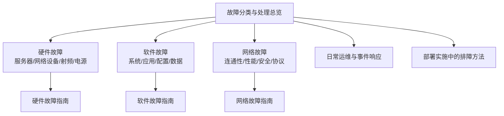
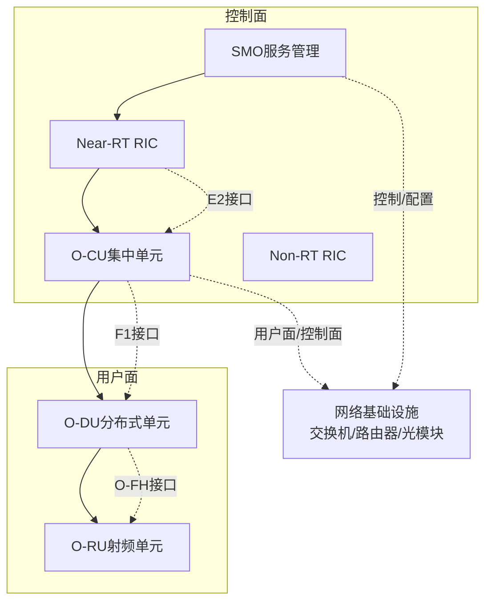
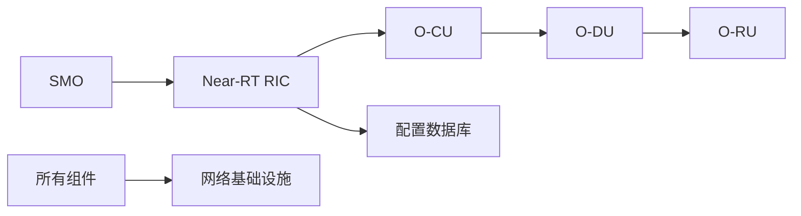
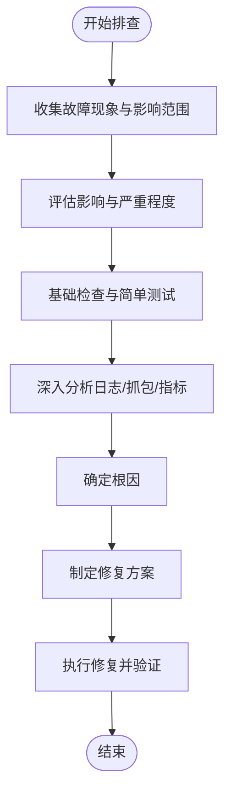

# 故障分类体系

<cite>
**本文引用的文件**
- [O-RAN 故障诊断与排除（中文）](file://27-troubleshooting-diagnosis/readme-zh.md)
- [O-RAN 故障诊断与排除（英文）](file://27-troubleshooting-diagnosis/readme.md)
- [O-RAN 故障处理与诊断指南](file://14-operations-management/fault-handling/fault-troubleshooting-guide.md)
- [O-RAN 日常运维程序（中文）](file://14-operations-management/daily-operations/daily-operation-procedures-zh.md)
- [O-RAN 网络故障排查（中文）](file://27-troubleshooting-diagnosis/network-issues/o-ran-network-troubleshooting.md)
- [O-RAN 部署实施（英文）](file://08-deployment-implementation/readme.md)
</cite>

## 目录
1. [简介](#简介)
2. [项目结构](#项目结构)
3. [核心组件](#核心组件)
4. [架构总览](#架构总览)
5. [详细组件分析](#详细组件分析)
6. [依赖分析](#依赖分析)
7. [性能考虑](#性能考虑)
8. [故障排查指南](#故障排查指南)
9. [结论](#结论)
10. [附录](#附录)

## 简介
本文件面向O-RAN网络运维与工程实践，围绕“故障分类体系”构建系统化、可操作的故障识别、诊断与处置指南。内容覆盖硬件、软件、网络三大类故障，并细化到各子领域（如服务器/CPU/内存/硬盘/电源模块、交换机/路由器/光纤模块、O-RU/天线/馈线系统、UPS/配电柜/电源线路；操作系统级/应用级/配置/数据；连通性/性能/安全/协议）。同时给出判断标准、严重度评估与处理优先级建议，配合自动化监控与预防性维护策略，帮助降低故障发生概率与影响范围。

## 项目结构
本仓库包含大量O-RAN主题文档，其中与“故障分类与处理”直接相关的核心资料集中在以下位置：
- 27-troubleshooting-diagnosis：系统性故障排查与诊断方法、硬件/网络故障指南
- 14-operations-management：故障处理、日常运维、事件响应与升级矩阵
- 08-deployment-implementation：部署实施中的故障分类与排障流程
- 27-troubleshooting-diagnosis/network-issues：网络层面的物理层、链路层、设备层故障排查

**章节来源**
- file://27-troubleshooting-diagnosis/readme-zh.md#L6-L25
- file://27-troubleshooting-diagnosis/readme.md#L6-L25
- file://14-operations-management/fault-handling/fault-troubleshooting-guide.md#L6-L30
- file://08-deployment-implementation/readme.md#L126-L156

## 核心组件
- 硬件故障：服务器（CPU/内存/硬盘/电源模块）、网络设备（交换机/路由器/光纤模块）、射频设备（O-RU/天线/馈线系统）、电源系统（UPS/配电柜/电源线路）
- 软件故障：系统级（操作系统崩溃/内核恐慌/服务异常）、应用级（RIC应用异常/接口服务不可用）、配置故障（参数配置错误/版本不兼容）、数据故障（数据库异常/文件系统损坏）
- 网络故障：连通性故障（网络中断/路由问题/DNS解析失败）、性能故障（网络拥塞/高延迟/严重丢包）、安全故障（安全策略阻断/攻击防护误判）、协议故障（接口协议异常/消息格式错误）

上述分类来自仓库中的“故障分类体系”与“网络故障排查”文档，形成统一的故障域划分，便于后续逐项制定诊断与处置策略。

**章节来源**
- file://27-troubleshooting-diagnosis/readme-zh.md#L8-L24
- file://27-troubleshooting-diagnosis/readme.md#L8-L24
- file://27-troubleshooting-diagnosis/network-issues/o-ran-network-troubleshooting.md#L6-L95

## 架构总览
下图展示O-RAN典型网元与接口在故障场景下的交互关系，有助于从系统视角定位故障根因并制定跨域协同处置方案。

**图表来源**
- file://14-operations-management/fault-handling/fault-troubleshooting-guide.md#L10-L30

**章节来源**
- file://14-operations-management/fault-handling/fault-troubleshooting-guide.md#L10-L30

## 详细组件分析

### 硬件故障
- 服务器故障（CPU/内存/硬盘/电源模块）
  - 特征：系统启动失败、频繁蓝屏/死机、磁盘I/O异常、电源供电不稳定
  - 识别方法：查看BIOS/UEFI日志、dmesg/journalctl内核日志、硬件传感器状态、磁盘健康状态
  - 处理流程：替换故障部件、恢复系统镜像、验证服务依赖、回退至稳定配置
- 网络设备故障（交换机/路由器/光纤模块）
  - 特征：端口down、错误计数上升、丢包/CRC异常、光功率异常
  - 识别方法：接口状态检查、光功率测试、OTDR/光谱分析、链路连通性验证
  - 处理流程：更换光模块/尾纤、校正光功率、修复路由/ACL策略、冗余切换验证
- 射频设备故障（O-RU/天线/馈线系统）
  - 特征：上行/下行链路异常、驻波比异常、信号覆盖空洞、同步偏差
  - 识别方法：驻波比测试、频谱扫描、链路预算核算、GPS/PTP时钟质量监测
  - 处理流程：校准天线/馈线、调整功率/方位角、校正时钟同步、复测链路质量
- 电源系统故障（UPS/配电柜/电源线路）
  - 特征：掉电/切换、输出电压波动、负载过载告警、电池老化
  - 识别方法：UPS状态监控、负载电流/功率测量、绝缘阻抗测试、电源拓扑核查
  - 处理流程：切旁路/维修UPS、均衡负载、更换老化器件、完善告警联动

**章节来源**
- file://27-troubleshooting-diagnosis/readme-zh.md#L8-L12
- file://27-troubleshooting-diagnosis/network-issues/o-ran-network-troubleshooting.md#L8-L95

### 软件故障
- 系统级故障（操作系统崩溃/内核恐慌/服务异常）
  - 特征：系统无法启动/黑屏、内核panic、关键服务反复重启
  - 识别方法：journalctl/dmesg日志分析、core dump采集与分析、进程/线程状态检查
  - 处理流程：隔离问题版本、回滚内核/驱动、修复配置、恢复服务并验证
- 应用级故障（RIC应用异常/接口服务不可用）
  - 特征：接口超时/拒绝、订阅失败、指标缺失、业务中断
  - 识别方法：健康检查端点、接口指标（延迟/吞吐/错误率）、日志聚合与关联分析
  - 处理流程：重启服务/容器、校验证书与网络连通、调整超时/重试参数、回滚变更
- 配置故障（参数配置错误/版本不兼容）
  - 特征：接口协商失败、协议不匹配、性能退化、功能异常
  - 识别方法：配置比对、版本一致性检查、接口能力验证、最小化配置复现
  - 处理流程：恢复备份配置、统一版本策略、执行灰度发布、回滚与补偿
- 数据故障（数据库异常/文件系统损坏）
  - 特征：数据库连接失败、查询超时、事务异常、文件系统只读/挂载失败
  - 识别方法：数据库健康检查、文件系统完整性校验、磁盘空间与inode使用率
  - 处理流程：重建索引/修复表、扩容/迁移、恢复备份、修复权限与配额

**章节来源**
- file://27-troubleshooting-diagnosis/readme-zh.md#L14-L18
- file://14-operations-management/daily-operations/daily-operation-procedures-zh.md#L309-L359

### 网络故障
- 连通性故障（网络中断/路由问题/DNS解析失败）
  - 特征：端到端不通、路由黑洞、域名解析失败、NAT/ACL阻断
  - 识别方法：ping/traceroute、路由表/策略验证、DNS递归查询、防火墙规则审计
  - 处理流程：修复路由/ACL、修正DNS配置、恢复链路、验证连通性
- 性能故障（网络拥塞/高延迟/严重丢包）
  - 特征：端到端时延高、抖动大、队列积压、TCP重传增多
  - 识别方法：流速/带宽利用率、队列深度、错误计数、RTT分布
  - 处理流程：限速/整形、QoS优先级调整、链路扩容、优化缓冲区
- 安全故障（安全策略阻断/攻击防护误判）
  - 特征：访问被拒、策略冲突、误报导致业务中断
  - 识别方法：策略比对、告警关联分析、基线对比、威胁情报交叉验证
  - 处理流程：调整白名单/放行规则、降级策略、补充旁路、复盘与加固
- 协议故障（接口协议异常/消息格式错误）
  - 特征：握手失败、序列号错乱、TLV字段缺失、版本协商失败
  - 识别方法：抓包分析（Wireshark/tshark）、协议一致性检查、消息编解码校验
  - 处理流程：对齐协议版本、修复消息格式、重配密钥/证书、回滚并发布补丁

**章节来源**
- file://27-troubleshooting-diagnosis/readme-zh.md#L20-L24
- file://27-troubleshooting-diagnosis/readme.md#L20-L24
- file://27-troubleshooting-diagnosis/network-issues/o-ran-network-troubleshooting.md#L6-L95

### 接口与协议专项：E2/F1/O-FH
- E2接口（RIC-NF）
  - 特征：建立超时、订阅失败、指示消息丢失
  - 识别：连通性测试、TLS握手验证、证书链校验、配置参数核对
  - 处理：重启服务、更新证书、调优超时/重试、修正路由
- F1接口（CU-DU）
  - 特征：高延迟、丢包、吞吐不足、UE附着/切换失败
  - 识别：接口统计、软硬中断、应用指标、流量分析
  - 处理：网卡关闭TSO/GRO、增大socket缓冲、TC/QoS优化、调整分割选项
- O-FH接口（DU-RU）
  - 特征：PTP不同步、IQ数据异常、相位漂移
  - 识别：PTP状态、硬件时间戳、光缆链路质量、时钟偏移
  - 处理：主时钟配置、启用硬件时间戳、VLAN/优先级隔离、补偿与持续监控

**章节来源**
- file://14-operations-management/fault-handling/fault-troubleshooting-guide.md#L266-L537

## 依赖分析
- 系统依赖图（概念示意）
  - SMO依赖Near-RT RIC与配置数据库；Near-RT RIC依赖O-CU；O-CU依赖O-DU；O-DU依赖O-RU；所有组件均依赖网络基础设施。
  - 该依赖关系有助于在出现端到端故障时，按“自上而下/自下而上”的方式缩小排查范围。

**图表来源**
- file://14-operations-management/fault-handling/fault-troubleshooting-guide.md#L113-L126

**章节来源**
- file://14-operations-management/fault-handling/fault-troubleshooting-guide.md#L107-L126

## 性能考虑
- 监控与告警
  - 关键指标：接口延迟（95分位）、错误率、带宽利用率、组件可用性、PTP偏移
  - 告警策略：分级阈值、持续时间、收敛窗口、通知渠道
- 自动化与恢复
  - 自动化健康检查、配置备份与回滚、接口级自动恢复脚本
- 预防性维护
  - 定期巡检、基线建立、补丁与版本管理、容量规划

**章节来源**
- file://14-operations-management/daily-operations/daily-operation-procedures-zh.md#L361-L419
- file://14-operations-management/daily-operations/daily-operation-procedures-zh.md#L76-L161

## 故障排查指南
- 通用流程
  - 现象收集 → 影响评估 → 初步排查 → 深入分析 → 根因确定 → 解决方案
- 诊断工具箱
  - 系统：dmesg、journalctl、sar、vmstat
  - 网络：ping、traceroute、netstat、ss
  - 应用：jstack、jmap、gdb、core dump分析
  - 专用：O-RAN专用诊断软件、协议分析器
- 启动故障/连通性故障/性能异常的典型排查步骤详见对应文档条目。

**章节来源**
- file://27-troubleshooting-diagnosis/readme-zh.md#L26-L40
- file://27-troubleshooting-diagnosis/readme.md#L26-L40

## 结论
本文件基于仓库现有资料，建立了覆盖硬件、软件、网络的O-RAN故障分类体系，并配套了通用排查流程、工具与接口专项处置要点。结合日常运维的健康检查、配置管理、事件响应与自动化恢复机制，可显著提升故障定位效率与修复成功率，降低业务影响。

## 附录
- 严重性与升级矩阵（参考）
  - 严重性1（严重）：完全服务中断、安全漏洞、数据丢失；初始响应15分钟，升级30分钟，解决目标2小时
  - 严重性2（高）：主要性能下降、部分服务中断；初始响应30分钟，升级1小时，解决目标8小时
  - 严重性3（中）：轻微服务影响、配置问题；初始响应2小时，升级4小时，解决目标24小时
  - 严重性4（低）：信息性告警、增强请求；初始响应1个工作日，升级2天，解决目标5个工作日

**章节来源**
- file://14-operations-management/daily-operations/daily-operation-procedures-zh.md#L283-L307