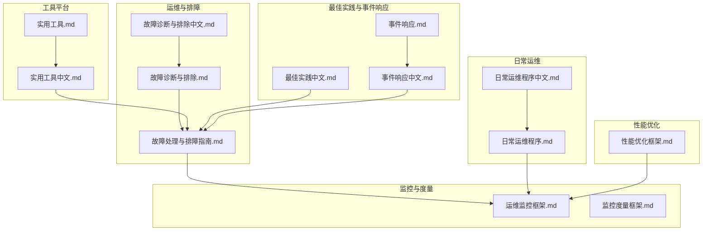
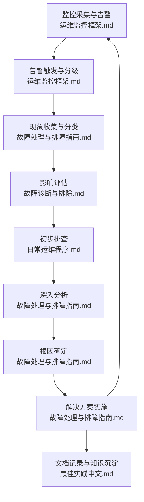
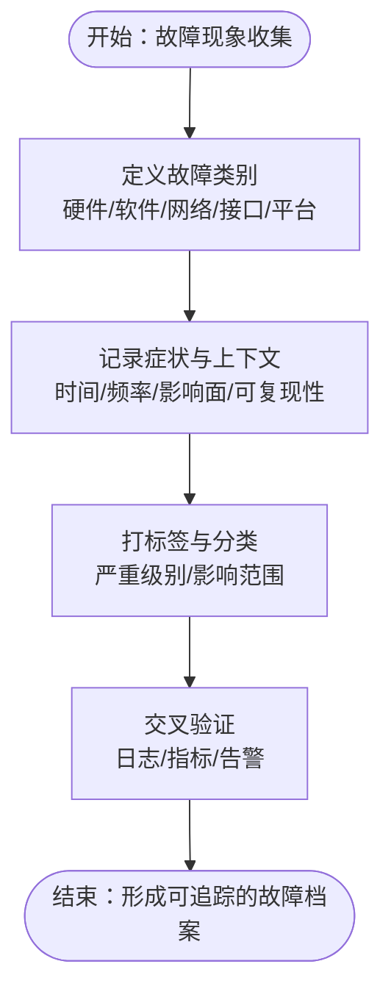
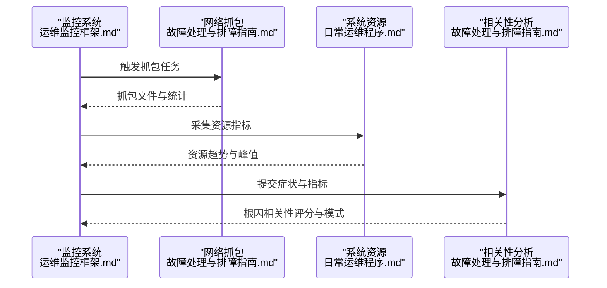
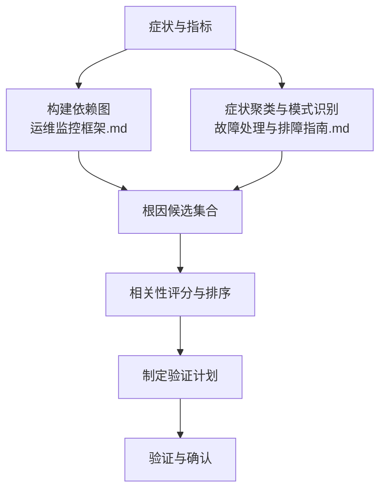
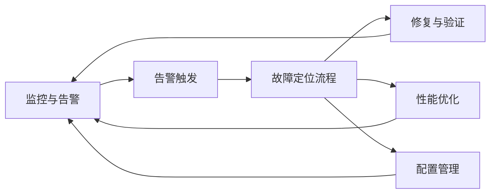

# 故障定位流程

<cite>
**本文引用的文件**
- [故障处理与排障指南.md](file://14-operations-management/fault-handling/fault-troubleshooting-guide.md)
- [故障诊断与排除.md](file://27-troubleshooting-diagnosis/readme.md)
- [故障诊断与排除（中文）.md](file://27-troubleshooting-diagnosis/readme-zh.md)
- [日常运维程序.md](file://14-operations-management/daily-operations/daily-operation-procedures.md)
- [日常运维程序（中文）.md](file://14-operations-management/daily-operations/daily-operation-procedures-zh.md)
- [运维监控框架.md](file://14-operations-management/monitoring-alerting/operations-monitoring-framework.md)
- [监控度量框架.md](file://28-monitoring-alerting/metric-system/monitoring-metrics-framework.md)
- [性能优化框架.md](file://14-operations-management/performance-optimization/performance-optimization-framework.md)
- [实用工具（中文）.md](file://22-tool-platforms/utility-programs/o-ran-utility-programs-zh.md)
- [实用工具.md](file://22-tool-platforms/utility-programs/o-ran-utility-programs.md)
- [最佳实践（中文）.md](file://30-best-practices/operations-practices/o-ran-operations-best-practices.md)
- [事件响应（中文）.md](file://29-security-threats/incident-response/o-ran-incident-response-zh.md)
- [事件响应.md](file://29-security-threats/incident-response/o-ran-incident-response.md)
</cite>

## 目录
1. [简介](#简介)
2. [项目结构](#项目结构)
3. [核心组件](#核心组件)
4. [架构总览](#架构总览)
5. [详细组件分析](#详细组件分析)
6. [依赖关系分析](#依赖关系分析)
7. [性能考量](#性能考量)
8. [故障排查指南](#故障排查指南)
9. [结论](#结论)
10. [附录](#附录)

## 简介
本文件面向O-RAN系统的故障定位与排障工作，基于仓库中的运维、监控、排障与工具文档，构建一套标准化的故障定位流程，覆盖“现象收集—影响评估—初步排查—深入分析—根因确定—解决方案—文档记录—经验沉淀”的闭环。同时给出团队协作与进度跟踪建议、工具使用与数据验证方法、以及效率提升的最佳实践与案例参考。

## 项目结构
围绕故障定位，本仓库中与之直接相关的内容主要分布在以下目录：
- 运维与排障：14-operations-management/fault-handling、27-troubleshooting-diagnosis
- 运维与监控：14-operations-management/monitoring-alerting、28-monitoring-alerting
- 性能优化：14-operations-management/performance-optimization
- 工具平台：22-tool-platforms/utility-programs
- 最佳实践与事件响应：30-best-practices、29-security-threats/incident-response

图表来源
- [故障处理与排障指南.md](file://14-operations-management/fault-handling/fault-troubleshooting-guide.md#L1-L633)
- [故障诊断与排除.md](file://27-troubleshooting-diagnosis/readme.md#L1-L105)
- [故障诊断与排除（中文）.md](file://27-troubleshooting-diagnosis/readme-zh.md#L1-L105)
- [日常运维程序.md](file://14-operations-management/daily-operations/daily-operation-procedures.md#L1-L443)
- [日常运维程序（中文）.md](file://14-operations-management/daily-operations/daily-operation-procedures-zh.md#L1-L443)
- [运维监控框架.md](file://14-operations-management/monitoring-alerting/operations-monitoring-framework.md#L1-L909)
- [监控度量框架.md](file://28-monitoring-alerting/metric-system/monitoring-metrics-framework.md#L1-L200)
- [性能优化框架.md](file://14-operations-management/performance-optimization/performance-optimization-framework.md#L1-L650)
- [实用工具（中文）.md](file://22-tool-platforms/utility-programs/o-ran-utility-programs-zh.md#L563-L626)
- [实用工具.md](file://22-tool-platforms/utility-programs/o-ran-utility-programs.md#L563-L626)
- [最佳实践（中文）.md](file://30-best-practices/operations-practices/o-ran-operations-best-practices.md#L70-L98)
- [事件响应（中文）.md](file://29-security-threats/incident-response/o-ran-incident-response-zh.md#L62-L105)
- [事件响应.md](file://29-security-threats/incident-response/o-ran-incident-response.md#L45-L105)

章节来源
- [故障处理与排障指南.md](file://14-operations-management/fault-handling/fault-troubleshooting-guide.md#L1-L633)
- [故障诊断与排除.md](file://27-troubleshooting-diagnosis/readme.md#L1-L105)
- [日常运维程序.md](file://14-operations-management/daily-operations/daily-operation-procedures.md#L1-L443)
- [运维监控框架.md](file://14-operations-management/monitoring-alerting/operations-monitoring-framework.md#L1-L909)

## 核心组件
- 故障现象收集与分类：明确故障类别（硬件、软件、网络、接口协议等），建立可量化的症状清单与分类标签。
- 影响评估：量化影响范围（服务可用性、用户规模、业务收入）、严重程度（SLA、MTTR/MTBF、客户满意度）。
- 初步排查：基础连通性、资源占用、配置一致性、日志快速扫描。
- 深入分析：网络抓包、协议分析、依赖图谱关联、趋势与异常检测。
- 根因确定：基于症状模式、依赖关系与相关性分析，形成根因假设并验证。
- 解决方案实施：目标性修复（重启、参数调整、配置回退、容量扩容、安全加固）。
- 文档记录与知识沉淀：标准化报告模板、经验总结、案例库建设与知识分享。

章节来源
- [故障处理与排障指南.md](file://14-operations-management/fault-handling/fault-troubleshooting-guide.md#L6-L30)
- [故障诊断与排除.md](file://27-troubleshooting-diagnosis/readme.md#L26-L41)
- [日常运维程序.md](file://14-operations-management/daily-operations/daily-operation-procedures.md#L283-L359)

## 架构总览
下图展示故障定位在O-RAN运维体系中的位置与交互关系：监控采集与告警驱动排障流程，排障过程产出的数据与经验反哺监控阈值与自动化修复。

图表来源
- [运维监控框架.md](file://14-operations-management/monitoring-alerting/operations-monitoring-framework.md#L262-L486)
- [故障处理与排障指南.md](file://14-operations-management/fault-handling/fault-troubleshooting-guide.md#L31-L180)
- [故障诊断与排除.md](file://27-troubleshooting-diagnosis/readme.md#L26-L41)
- [日常运维程序.md](file://14-operations-management/daily-operations/daily-operation-procedures.md#L283-L359)
- [最佳实践（中文）.md](file://30-best-practices/operations-practices/o-ran-operations-best-practices.md#L85-L98)

## 详细组件分析

### 现象收集与分类
- 分类维度：硬件、软件、网络、接口协议、基础设施与平台、服务管理等。
- 收集要点：时间窗口、频率、影响面、是否可复现、前置变更、告警关联。
- 工具与方法：日志聚合与关键字过滤、健康检查脚本、指标阈值告警。

图表来源
- [故障处理与排障指南.md](file://14-operations-management/fault-handling/fault-troubleshooting-guide.md#L35-L98)
- [故障诊断与排除.md](file://27-troubleshooting-diagnosis/readme.md#L6-L25)

章节来源
- [故障处理与排障指南.md](file://14-operations-management/fault-handling/fault-troubleshooting-guide.md#L6-L30)
- [故障诊断与排除.md](file://27-troubleshooting-diagnosis/readme.md#L26-L41)

### 影响评估
- 影响范围：服务可用性、用户规模、业务收入、SLA达成度。
- 严重程度：MTTR/MTBF、客户满意度、投诉数量、潜在经济损失。
- 方法：基于监控仪表盘与KPI指标进行量化评估；结合历史基线与趋势判断。

章节来源
- [运维监控框架.md](file://14-operations-management/monitoring-alerting/operations-monitoring-framework.md#L380-L448)
- [监控度量框架.md](file://28-monitoring-alerting/metric-system/monitoring-metrics-framework.md#L1-L200)

### 初步排查
- 基础检查：连通性（ping/traceroute）、端口可达性、路由、防火墙策略、DNS解析。
- 资源检查：CPU/内存/磁盘/网络IO、进程与线程状态、服务健康端点。
- 配置检查：关键配置项一致性、版本兼容性、最近变更清单。
- 日志快速扫描：错误/致命级别日志、关键组件日志、时间窗口对齐。

章节来源
- [日常运维程序.md](file://14-operations-management/daily-operations/daily-operation-procedures.md#L68-L161)
- [故障诊断与排除.md](file://27-troubleshooting-diagnosis/readme.md#L55-L75)

### 深入分析
- 网络层面：接口监控与抓包（E2/F1/O-FH）、协议分析（E2AP/F1AP/eCPRI）、延迟/抖动/丢包统计。
- 应用与系统：资源利用趋势、GC/内存分配、NUMA绑定、CPU亲和与调度。
- 依赖与相关性：构建系统依赖图，基于症状模式与时间聚类进行相关性分析。

图表来源
- [运维监控框架.md](file://14-operations-management/monitoring-alerting/operations-monitoring-framework.md#L48-L260)
- [故障处理与排障指南.md](file://14-operations-management/fault-handling/fault-troubleshooting-guide.md#L182-L262)
- [日常运维程序.md](file://14-operations-management/daily-operations/daily-operation-procedures.md#L68-L161)

章节来源
- [故障处理与排障指南.md](file://14-operations-management/fault-handling/fault-troubleshooting-guide.md#L182-L262)
- [性能优化框架.md](file://14-operations-management/performance-optimization/performance-optimization-framework.md#L1-L650)

### 根因确定
- 依赖图与症状模式：通过依赖关系图与症状聚类，识别高概率根因。
- 相关性评分：综合出现频率、时间聚类、症状严重度计算根因可信度。
- 验证手段：变更回滚、参数调整验证、隔离环境复现。

图表来源
- [运维监控框架.md](file://14-operations-management/monitoring-alerting/operations-monitoring-framework.md#L10-L44)
- [故障处理与排障指南.md](file://14-operations-management/fault-handling/fault-troubleshooting-guide.md#L100-L180)

章节来源
- [故障处理与排障指南.md](file://14-operations-management/fault-handling/fault-troubleshooting-guide.md#L100-L180)

### 解决方案实施
- 目标性修复：重启服务、调整超时/重试、优化网络与QoS、校准同步参数、回滚配置。
- 自动化恢复：针对常见故障的自动恢复脚本与阈值触发。
- 验证与回归：健康检查、指标回归、端到端测试。

章节来源
- [故障处理与排障指南.md](file://14-operations-management/fault-handling/fault-troubleshooting-guide.md#L572-L631)
- [日常运维程序.md](file://14-operations-management/daily-operations/daily-operation-procedures.md#L283-L359)

### 文档记录与知识沉淀
- 标准化模板：事件报告、根因分析、解决摘要、经验教训。
- 知识库建设：案例库、最佳实践、工具使用手册、变更与备份流程。
- 分享机制：定期复盘、跨团队分享、培训与演练。

章节来源
- [最佳实践（中文）.md](file://30-best-practices/operations-practices/o-ran-operations-best-practices.md#L85-L98)
- [实用工具（中文）.md](file://22-tool-platforms/utility-programs/o-ran-utility-programs-zh.md#L563-L626)

## 依赖关系分析
- 监控与告警是故障定位的起点，驱动后续排查流程。
- 排障产出的数据用于优化阈值、完善自动化修复与知识库。
- 性能优化与配置管理为稳定运行提供基础保障。

图表来源
- [运维监控框架.md](file://14-operations-management/monitoring-alerting/operations-monitoring-framework.md#L262-L486)
- [性能优化框架.md](file://14-operations-management/performance-optimization/performance-optimization-framework.md#L1-L650)
- [日常运维程序.md](file://14-operations-management/daily-operations/daily-operation-procedures.md#L163-L280)

章节来源
- [运维监控框架.md](file://14-operations-management/monitoring-alerting/operations-monitoring-framework.md#L1-L909)
- [性能优化框架.md](file://14-operations-management/performance-optimization/performance-optimization-framework.md#L1-L650)
- [日常运维程序.md](file://14-operations-management/daily-operations/daily-operation-procedures.md#L163-L280)

## 性能考量
- 网络层：Jumbo帧、NUMA感知绑定、中断亲和、流量控制与优先级标记。
- 计算层：CPU亲和、调度参数、内存大页与过量内存策略、垃圾回收调优。
- 应用层：容器资源限制与探针、健康检查与就绪探测、可观测性指标。
- 自动化：趋势分析与自动调优、阈值自适应、修复脚本与回滚策略。

章节来源
- [性能优化框架.md](file://14-operations-management/performance-optimization/performance-optimization-framework.md#L1-L650)
- [运维监控框架.md](file://14-operations-management/monitoring-alerting/operations-monitoring-framework.md#L378-L448)

## 故障排查指南
- E2接口：连通性、证书与安全、配置参数、服务重启与参数调整。
- F1接口：性能指标、资源利用、流量分析、网络与QoS优化、拆分选项优化。
- O-FH同步：PTP质量、硬件时间戳、信号质量、时钟源与网络优化、校准补偿。

章节来源
- [故障处理与排障指南.md](file://14-operations-management/fault-handling/fault-troubleshooting-guide.md#L266-L537)

## 结论
通过将监控告警、标准化排障流程、深度分析与自动化修复相结合，O-RAN系统可以实现快速、准确、可追溯的故障定位与恢复。配合完善的文档记录与知识沉淀，持续优化流程与工具，能够显著降低MTTR、提升系统稳定性与客户满意度。

## 附录

### 团队协作与进度跟踪
- 分级响应：根据严重级别设定初始响应、升级与解决时限。
- 通讯协议：内部工单/聊天/邮件、外部客户门户/状态页、管理层汇报。
- 进度可视化：仪表盘、看板、里程碑节点与责任人。

章节来源
- [日常运维程序.md](file://14-operations-management/daily-operations/daily-operation-procedures.md#L283-L307)
- [事件响应.md](file://29-security-threats/incident-response/o-ran-incident-response.md#L45-L105)

### 工具使用与数据验证
- 系统诊断：journalctl、dmesg、sar、vmstat、netstat/ss。
- 网络诊断：ping、traceroute、tcpdump/tshark、ethtool、tc。
- 应用诊断：进程状态、线程分析、核心转储与分析。
- 专用工具：O-RAN专用诊断软件、协议分析器、PTP工具链。

章节来源
- [故障诊断与排除.md](file://27-troubleshooting-diagnosis/readme.md#L36-L40)
- [实用工具（中文）.md](file://22-tool-platforms/utility-programs/o-ran-utility-programs-zh.md#L563-L626)

### 效率提升与最佳实践
- 预防性维护：定期健康检查、配置备份与版本管理、安全补丁、性能基线维护。
- 自动化：自动恢复脚本、阈值告警、预测性分析、知识库更新。
- 复盘与改进：事件报告、根因分析、改进措施、培训与演练。

章节来源
- [日常运维程序.md](file://14-operations-management/daily-operations/daily-operation-procedures.md#L77-L91)
- [最佳实践（中文）.md](file://30-best-practices/operations-practices/o-ran-operations-best-practices.md#L70-L98)

### 实际案例分析
- E2接口连接失败：通过连通性、证书与安全、配置参数三步法定位并修复。
- F1接口性能劣化：通过指标采集、资源分析、流量分析与网络/QoS优化解决。
- O-FH同步异常：通过PTP质量、硬件时间戳、信号质量与网络优化逐步收敛。

章节来源
- [故障处理与排障指南.md](file://14-operations-management/fault-handling/fault-troubleshooting-guide.md#L266-L537)