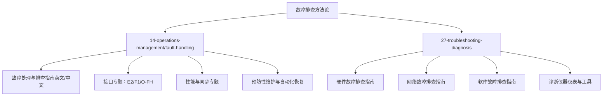
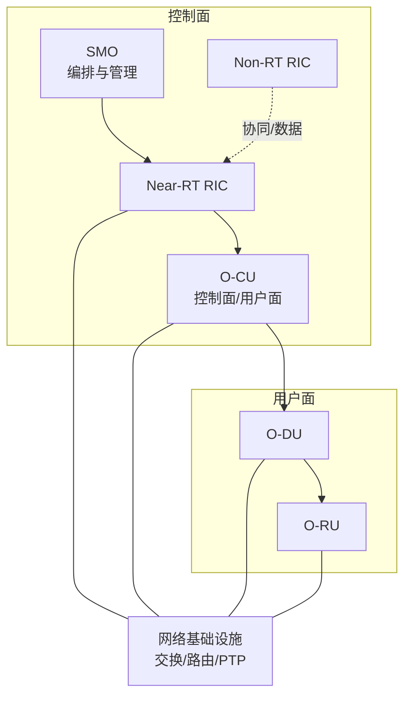
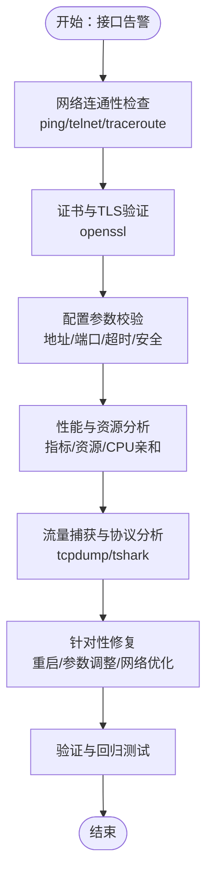
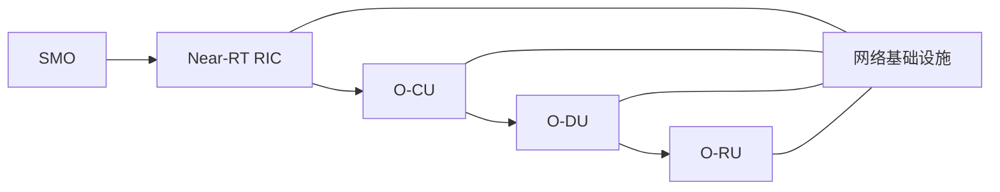
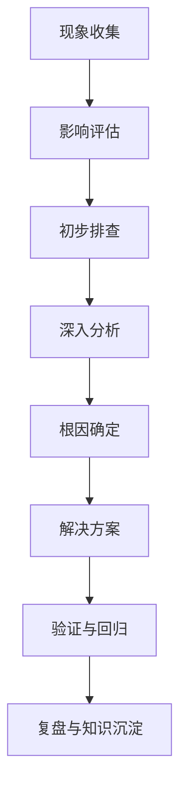

# 故障排查方法论

<cite>
**本文引用的文件**
- [O-RAN 故障处理与排查指南（英文）](file://14-operations-management/fault-handling/fault-troubleshooting-guide.md)
- [O-RAN 故障处理与排查指南（中文）](file://14-operations-management/fault-handling/fault-troubleshooting-guide-zh.md)
- [O-RAN 故障诊断与排除（中文）](file://27-troubleshooting-diagnosis/readme-zh.md)
- [O-RAN 硬件故障排查指南（中文）](file://27-troubleshooting-diagnosis/hardware-faults/hardware-troubleshooting-guide.md)
- [O-RAN 网络故障排查指南（中文）](file://27-troubleshooting-diagnosis/network-issues/o-ran-network-troubleshooting.md)
- [O-RAN 软件故障排查指南（中文）](file://27-troubleshooting-diagnosis/software-faults/o-ran-software-troubleshooting.md)
- [O-RAN 诊断仪器仪表与工具（中文）](file://27-troubleshooting-diagnosis/diagnostic-tools/o-ran-diagnostic-instrumentation.md)
</cite>

## 目录
1. [引言](#引言)
2. [项目结构](#项目结构)
3. [核心组件](#核心组件)
4. [架构总览](#架构总览)
5. [详细组件分析](#详细组件分析)
6. [依赖分析](#依赖分析)
7. [性能考量](#性能考量)
8. [故障排查流程与方法论](#故障排查流程与方法论)
9. [诊断工具与实操清单](#诊断工具与实操清单)
10. [标准作业程序（SOP）](#标准作业程序sop)
11. [最佳实践与经验总结](#最佳实践与经验总结)
12. [结论](#结论)
13. [附录](#附录)

## 引言
本方法论面向O-RAN部署运维团队，系统化构建“从现象到根因”的故障排查流程，覆盖接口类（E2/F1/O-FH等）、性能类（延迟/吞吐量/丢包）、可用性类（服务中断/降级）、配置类（参数错误/冲突）与兼容性类（多厂商集成）等常见问题域；配套以日志/指标/配置收集、假设形成与验证、根因分析（5个为什么、鱼骨图、FTD、时间线与相关性分析）等方法；并提供网络分析器、协议分析器、日志分析平台、性能分析工具、网络监控工具等实操清单与SOP，帮助快速定位、收敛与复盘。

## 项目结构
本仓库中与“故障排查方法论”直接相关的内容主要分布在以下目录：
- 14-operations-management/fault-handling：系统化的故障处理与排查指南（含接口、性能、同步等专题）
- 27-troubleshooting-diagnosis：分层的故障诊断与排除（硬件/网络/软件/工具）

**章节来源**
- file://14-operations-management/fault-handling/fault-troubleshooting-guide.md#L1-L633
- file://27-troubleshooting-diagnosis/readme-zh.md#L1-L105

## 核心组件
- 故障分类体系：按“网络功能/接口协议/基础设施平台”三大类划分，并细化到E2/F1/O-FH等关键接口与性能/可用性/配置/兼容性问题。
- 诊断方法论：包含“现象收集—影响评估—初步排查—深入分析—根因确定—解决方案”的闭环流程。
- 工具与脚本：涵盖日志采集与分析、网络抓包与协议解析、系统资源监控、自动化恢复脚本等。
- 预防与自动化：建立健康检查、预测性分析、自动恢复与告警通道。

**章节来源**
- file://14-operations-management/fault-handling/fault-troubleshooting-guide.md#L6-L30
- file://14-operations-management/fault-handling/fault-troubleshooting-guide.md#L31-L180
- file://27-troubleshooting-diagnosis/readme-zh.md#L6-L41

## 架构总览
下图展示O-RAN端到端链路中的关键组件与故障传播路径，便于在排查时进行“依赖建模+相关性分析”。

**图表来源**
- file://14-operations-management/fault-handling/fault-troubleshooting-guide.md#L114-L126

**章节来源**
- file://14-operations-management/fault-handling/fault-troubleshooting-guide.md#L107-L126

## 详细组件分析

### 接口故障专题：E2/F1/O-FH
- E2接口：连接建立失败、订阅管理失败、指示消息投递失败等。排查要点包括网络连通性、证书与TLS握手、配置参数（地址/端口/重试/超时/安全）。
- F1接口：高延迟、丢包、吞吐不足、QoS下降。排查要点包括性能指标采集、资源利用分析、流量特征与重传分析、网络与QoS配置调优、拆分选项优化。
- O-FH接口：PTP同步失败、IQ数据异常、RU-DU通信超时、相位漂移。排查要点包括PTP守护进程、硬件时间戳、信号质量分析、时钟源稳定化、网络基础设施优化与校准补偿。

**图表来源**
- file://14-operations-management/fault-handling/fault-troubleshooting-guide.md#L266-L344
- file://14-operations-management/fault-handling/fault-troubleshooting-guide.md#L346-L434
- file://14-operations-management/fault-handling/fault-troubleshooting-guide.md#L436-L537

**章节来源**
- file://14-operations-management/fault-handling/fault-troubleshooting-guide.md#L266-L344
- file://14-operations-management/fault-handling/fault-troubleshooting-guide.md#L346-L434
- file://14-operations-management/fault-handling/fault-troubleshooting-guide.md#L436-L537

### 性能问题专题：延迟/吞吐量/丢包
- 延迟：结合F1接口阈值与端到端时延测量，定位瓶颈于链路、队列、CPU亲和或QoS设置。
- 吞吐量：通过接口统计、socket缓冲区、流量控制（tc）与压缩/头压缩参数调优提升。
- 丢包：关注软中断统计、重传、队列溢出与链路质量，必要时启用硬件卸载与优先级调度。

**章节来源**
- file://14-operations-management/fault-handling/fault-troubleshooting-guide.md#L346-L434

### 可用性问题专题：服务中断/降级
- 服务中断：检查进程状态、健康检查端点、自动恢复脚本执行结果。
- 降级：基于指标阈值触发降级策略，配合限流/降级开关与弹性扩容。

**章节来源**
- file://14-operations-management/fault-handling/fault-troubleshooting-guide.md#L572-L631

### 配置问题专题：参数错误/配置冲突
- 常见场景：接口地址/端口错误、超时/重试参数不当、证书链不一致、PTP配置冲突。
- 处理建议：统一配置模板、版本化管理、变更评审与回滚预案。

**章节来源**
- file://14-operations-management/fault-handling/fault-troubleshooting-guide.md#L304-L317
- file://14-operations-management/fault-handling/fault-troubleshooting-guide.md#L492-L502

### 兼容性问题专题：多厂商集成
- 表现：协议行为差异、消息格式不一致、时钟/同步策略不一致。
- 处理建议：协议一致性测试、互通性验证清单、厂商适配与灰度发布。

**章节来源**
- file://27-troubleshooting-diagnosis/readme-zh.md#L24-L24

### 硬件/网络/软件故障专题
- 硬件：服务器/网络设备/射频/电源模块故障的快速定位与替换。
- 网络：连通性、路由、防火墙、DNS、接口状态与配置。
- 软件：系统级崩溃、应用异常、配置错误、数据库/文件系统异常。

**章节来源**
- file://27-troubleshooting-diagnosis/hardware-faults/hardware-troubleshooting-guide.md#L1-L200
- file://27-troubleshooting-diagnosis/network-issues/o-ran-network-troubleshooting.md#L1-L200
- file://27-troubleshooting-diagnosis/software-faults/o-ran-software-troubleshooting.md#L1-L200

## 依赖分析
- 组件耦合：SMO驱动Near-RT RIC，RIC再驱动O-CU，CU驱动O-DU，DU驱动O-RU；任一环节异常均可能引发端到端故障。
- 外部依赖：网络基础设施（交换/路由/PTP）是跨组件共享的强依赖，需独立监控与维护。
- 影响传播：接口层（E2/F1/O-FH）问题常表现为上层业务中断或性能劣化；同步问题会放大用户面抖动与丢包。

**图表来源**
- file://14-operations-management/fault-handling/fault-troubleshooting-guide.md#L114-L126

**章节来源**
- file://14-operations-management/fault-handling/fault-troubleshooting-guide.md#L114-L126

## 性能考量
- 端到端时延与抖动：结合F1接口阈值与端到端测量，识别链路/队列/CPU亲和/QoS配置瓶颈。
- 吞吐与丢包：通过接口统计、socket缓冲区、tc队列与压缩参数调优，降低尾延迟与提高稳定性。
- 同步精度：PTP时钟偏移/频率误差、硬件时间戳质量、网络VLAN与优先级配置直接影响IQ质量。

**章节来源**
- file://14-operations-management/fault-handling/fault-troubleshooting-guide.md#L346-L434
- file://14-operations-management/fault-handling/fault-troubleshooting-guide.md#L436-L537

## 故障排查流程与方法论
- 流程框架：现象收集—影响评估—初步排查—深入分析—根因确定—解决方案。
- 方法工具：
  - 5个为什么：层层追问，直至触及系统性/流程性原因。
  - 鱼骨图（石川图）：人机料法环归因，系统梳理潜在因素。
  - 故障树分析（FTA）：自顶向下建树，量化故障概率与关键事件。
  - 时间线分析：按时间轴梳理事件序列，识别并发与因果。
  - 相关性分析：多维度指标关联，发现隐藏耦合。

**图表来源**
- file://27-troubleshooting-diagnosis/readme-zh.md#L26-L35

**章节来源**
- file://27-troubleshooting-diagnosis/readme-zh.md#L26-L35

## 诊断工具与实操清单
- 日志与指标
  - 日志采集：journalctl、容器日志、组件特定日志目录。
  - 指标采集：系统资源（CPU/内存/IO/网络）、应用指标（HTTP/GRPC/自定义metrics）。
- 网络分析
  - 抓包与协议分析：tcpdump、tshark（E2/F1/O-FH协议字段过滤与统计）。
  - 连通性与路由：ping、traceroute、mtr。
- 性能分析
  - 系统性能：perf、火焰图（热点函数）、上下文切换、软中断。
  - 网络栈：ethtool、tc、队列统计、socket缓冲区。
- 日志分析平台
  - ELK/Splunk：集中式检索、聚合、可视化与告警。
- 自动化与恢复
  - 健康检查脚本、自动恢复脚本、告警通道（邮件/Slack/PagerDuty）。

**章节来源**
- file://14-operations-management/fault-handling/fault-troubleshooting-guide.md#L62-L97
- file://14-operations-management/fault-handling/fault-troubleshooting-guide.md#L184-L261
- file://14-operations-management/fault-handling/fault-troubleshooting-guide.md#L572-L631
- file://27-troubleshooting-diagnosis/diagnostic-tools/o-ran-diagnostic-instrumentation.md#L1-L200

## 标准作业程序（SOP）
- 故障响应程序
  - 快速隔离（范围界定）、分级响应（紧急/重大/一般）、跨团队协同（一线/二线/厂商）。
- 升级程序
  - 达到阈值自动升级、升级路径与责任人、升级后的验证与回退。
- 沟通程序
  - 内外部沟通模板、变更通知、影响说明与处置进度。
- 事后分析程序
  - 故障报告模板、根因分析、改进项跟踪、复盘会议纪要。
- 知识库更新程序
  - 案例归档、最佳实践沉淀、FAQ更新、培训材料补充。

**章节来源**
- file://27-troubleshooting-diagnosis/readme-zh.md#L77-L91
- file://14-operations-management/fault-handling/fault-troubleshooting-guide.md#L542-L570

## 最佳实践与经验总结
- 预防为主：建立健康检查与预测性分析，提前发现趋势异常。
- 分层定位：先网络后应用，先上游后下游，先全局后单点。
- 证据驱动：以日志/指标/抓包为依据，避免主观臆测。
- 变更受控：所有参数调整必须有记录、审批与回滚预案。
- 工具标准化：统一抓包/分析/可视化模板，缩短首次响应时间。
- 复盘闭环：每次故障都要沉淀到知识库，形成“经验—流程—工具”的闭环。

**章节来源**
- file://27-troubleshooting-diagnosis/readme-zh.md#L77-L91
- file://14-operations-management/fault-handling/fault-troubleshooting-guide.md#L539-L570

## 结论
通过系统化的故障分类、严谨的排查流程、完备的工具链与SOP，O-RAN运维团队可显著缩短MTTR、降低重复故障率，并持续提升系统的可靠性与可维护性。建议在实际部署中结合本方法论，逐步完善本地化工具与流程，形成可复制、可推广的故障排查体系。

## 附录
- 术语与缩写：E2/F1/O-FH/PTP/RIC/CU/DU/RU/SMO等。
- 参考文档索引：见“本文引用的文件”。