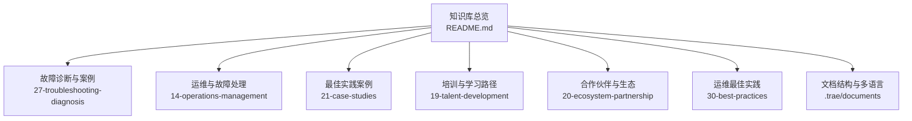
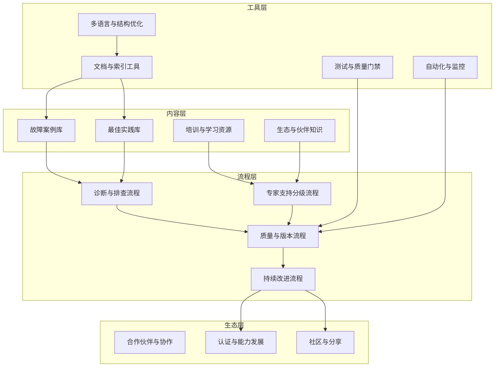
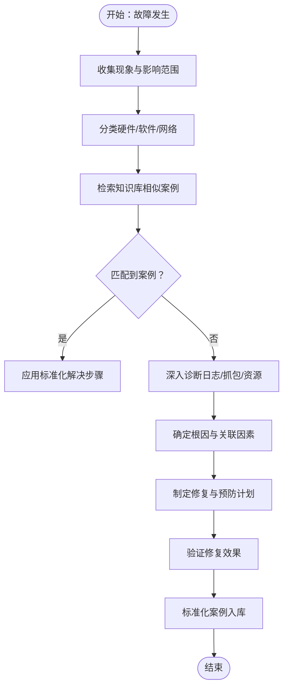
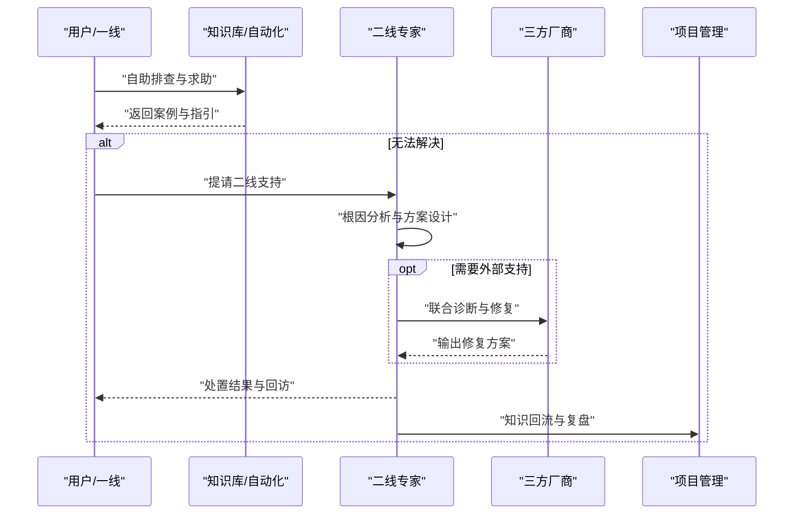
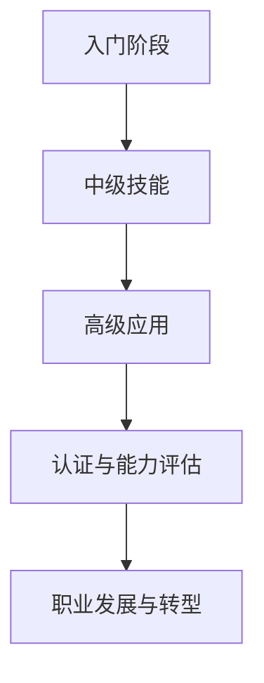
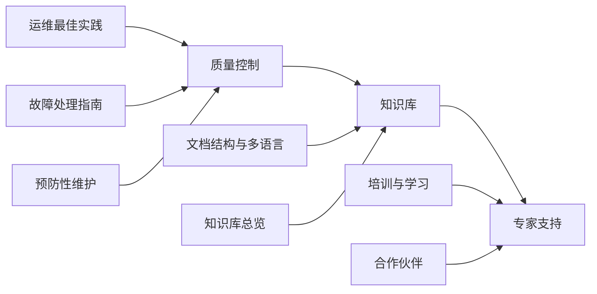

# 知识库建设

<cite>
**本文引用的文件**
- [O-RAN 故障库和案例数据库（中文）](file://27-troubleshooting-diagnosis/fault-library/o-ran-fault-case-database-zh.md)
- [O-RAN 故障库和案例数据库（英文）](file://27-troubleshooting-diagnosis/fault-library/o-ran-fault-case-database.md)
- [O-RAN 故障处理与排查指南（英文）](file://14-operations-management/fault-handling/fault-troubleshooting-guide.md)
- [O-RAN 故障诊断与排除（中文）](file://27-troubleshooting-diagnosis/readme-zh.md)
- [O-RAN 最佳实践案例（中文）](file://21-case-studies/best-practices/o-ran-best-practice-cases-zh.md)
- [O-RAN 学习路径（中文）](file://19-talent-development/learning-paths/o-ran-learning-roadmaps-zh.md)
- [O-RAN 培训项目（中文）](file://19-talent-development/training-programs/o-ran-training-framework-zh.md)
- [O-RAN 职业发展框架（中文）](file://19-talent-development/career-development/o-ran-career-pathways-zh.md)
- [O-RAN 合作伙伴类型与协作模式（中文）](file://20-ecosystem-partnership/partner-types/o-ran-partner-classification-zh.md)
- [O-RAN 运维最佳实践（英文）](file://30-best-practices/operations-practices/o-ran-operations-best-practices.md)
- [O-RAN 知识库文件结构优化与多语言支持计划](file://.trae/documents/O-RAN知识库文件结构优化与多语言支持.md)
- [O-RAN 知识库（总览）](file://README.md)
</cite>

## 目录
1. [引言](#引言)
2. [项目结构](#项目结构)
3. [核心组件](#核心组件)
4. [架构总览](#架构总览)
5. [详细组件分析](#详细组件分析)
6. [依赖分析](#依赖分析)
7. [性能考虑](#性能考虑)
8. [故障排查指南](#故障排查指南)
9. [结论](#结论)
10. [附录](#附录)

## 引言
本文件面向O-RAN知识库建设，围绕“故障案例库”“专家支持体系”“知识传承与培训”“内容组织与检索优化”“质量控制与版本管理”“标准流程与持续改进”等方面，结合仓库现有文档，形成可落地的建设指导。目标是帮助组织建立系统化、可演进、可复用的知识库，支撑一线运维、二线专家与第三方协作的高效协同，并沉淀最佳实践与培训资源。

## 项目结构
仓库采用按主题域划分的层级化结构，便于知识库内容的归类与检索。以下为与知识库建设密切相关的结构要点：
- 故障案例与诊断：27-troubleshooting-diagnosis 下的 fault-library、readme-zh 等文件，提供故障库、诊断流程与预防性维护框架。
- 运维与故障处理：14-operations-management 下的 fault-handling 提供系统化故障处理与排查指南。
- 最佳实践：21-case-studies 下的 best-practices 提供可复制的成功案例与经验矩阵。
- 培训与学习：19-talent-development 下的 learning-paths、training-programs、career-development 提供学习路径、培训框架与职业发展路径。
- 合作伙伴与生态：20-ecosystem-partnership 下的 partner-types 提供生态协作模式与伙伴分类。
- 运维最佳实践：30-best-practices 下的 operations-practices 提供质量保证、测试与持续改进框架。
- 多语言与结构优化：.trae/documents 下的“知识库文件结构优化与多语言支持计划”提供统一命名与双语文档策略。
- 总览与过渡：README 提供知识库总览、学习路径与使用建议。

图表来源
- [O-RAN 知识库（总览）](file://README.md#L1-L472)
- [O-RAN 故障诊断与排除（中文）](file://27-troubleshooting-diagnosis/readme-zh.md#L1-L105)
- [O-RAN 故障处理与排查指南（英文）](file://14-operations-management/fault-handling/fault-troubleshooting-guide.md#L1-L633)
- [O-RAN 最佳实践案例（中文）](file://21-case-studies/best-practices/o-ran-best-practice-cases-zh.md#L1-L210)
- [O-RAN 学习路径（中文）](file://19-talent-development/learning-paths/o-ran-learning-roadmaps-zh.md#L1-L297)
- [O-RAN 培训项目（中文）](file://19-talent-development/training-programs/o-ran-training-framework-zh.md#L1-L329)
- [O-RAN 合作伙伴类型与协作模式（中文）](file://20-ecosystem-partnership/partner-types/o-ran-partner-classification-zh.md#L1-L218)
- [O-RAN 运维最佳实践（英文）](file://30-best-practices/operations-practices/o-ran-operations-best-practices.md#L1-L275)
- [O-RAN 知识库文件结构优化与多语言支持计划](file://.trae/documents/O-RAN知识库文件结构优化与多语言支持.md#L1-L37)

章节来源
- [O-RAN 知识库（总览）](file://README.md#L1-L472)

## 核心组件
- 故障案例库：以标准化案例格式记录故障现象、根因分析、解决步骤与预防措施，支持检索与复用。
- 专家支持体系：分级技术支持流程（一线、二线、三方），配套知识库与培训，形成闭环。
- 知识传承与培训：学习路径、培训框架、职业发展路径与认证体系，支撑能力跃迁。
- 内容组织与检索：主题域分层、双语文档、统一命名与索引，提升可发现性。
- 质量控制与版本管理：测试与质量门禁、变更控制、文档版本与访问控制、定期刷新。
- 持续改进：性能评估、基准对比、反馈集成与创新孵化。

章节来源
- [O-RAN 故障库和案例数据库（中文）](file://27-troubleshooting-diagnosis/fault-library/o-ran-fault-case-database-zh.md#L1-L225)
- [O-RAN 故障库和案例数据库（英文）](file://27-troubleshooting-diagnosis/fault-library/o-ran-fault-case-database.md#L1-L225)
- [O-RAN 故障处理与排查指南（英文）](file://14-operations-management/fault-handling/fault-troubleshooting-guide.md#L1-L633)
- [O-RAN 故障诊断与排除（中文）](file://27-troubleshooting-diagnosis/readme-zh.md#L1-L105)
- [O-RAN 最佳实践案例（中文）](file://21-case-studies/best-practices/o-ran-best-practice-cases-zh.md#L1-L210)
- [O-RAN 学习路径（中文）](file://19-talent-development/learning-paths/o-ran-learning-roadmaps-zh.md#L1-L297)
- [O-RAN 培训项目（中文）](file://19-talent-development/training-programs/o-ran-training-framework-zh.md#L1-L329)
- [O-RAN 职业发展框架（中文）](file://19-talent-development/career-development/o-ran-career-pathways-zh.md#L1-L268)
- [O-RAN 合作伙伴类型与协作模式（中文）](file://20-ecosystem-partnership/partner-types/o-ran-partner-classification-zh.md#L1-L218)
- [O-RAN 运维最佳实践（英文）](file://30-best-practices/operations-practices/o-ran-operations-best-practices.md#L1-L275)
- [O-RAN 知识库文件结构优化与多语言支持计划](file://.trae/documents/O-RAN知识库文件结构优化与多语言支持.md#L1-L37)

## 架构总览
知识库建设的总体架构围绕“内容-流程-工具-生态”四要素展开，如下图所示：

图表来源
- [O-RAN 故障库和案例数据库（中文）](file://27-troubleshooting-diagnosis/fault-library/o-ran-fault-case-database-zh.md#L1-L225)
- [O-RAN 故障处理与排查指南（英文）](file://14-operations-management/fault-handling/fault-troubleshooting-guide.md#L1-L633)
- [O-RAN 最佳实践案例（中文）](file://21-case-studies/best-practices/o-ran-best-practice-cases-zh.md#L1-L210)
- [O-RAN 学习路径（中文）](file://19-talent-development/learning-paths/o-ran-learning-roadmaps-zh.md#L1-L297)
- [O-RAN 培训项目（中文）](file://19-talent-development/training-programs/o-ran-training-framework-zh.md#L1-L329)
- [O-RAN 合作伙伴类型与协作模式（中文）](file://20-ecosystem-partnership/partner-types/o-ran-partner-classification-zh.md#L1-L218)
- [O-RAN 运维最佳实践（英文）](file://30-best-practices/operations-practices/o-ran-operations-best-practices.md#L1-L275)
- [O-RAN 知识库文件结构优化与多语言支持计划](file://.trae/documents/O-RAN知识库文件结构优化与多语言支持.md#L1-L37)

## 详细组件分析

### 故障案例库：收集、标准化与复用
- 典型故障场景：硬件、软件、网络三大类，覆盖服务器、存储、网络接口、操作系统、数据库、容器编排、认证与防火墙、DNS与名称解析、带宽拥塞、延迟抖动、数据包丢失等。
- 标准化文档：统一格式（现象、根因、诊断步骤、解决方案、预防措施），便于检索与复用。
- 预防性维护：建立主动维护框架，包含硬件健康监控、环境条件监控、组件生命周期管理、软件配置审计、安全补丁与更新、性能基线维护、知识库与文档、培训与技能发展。
- 检索优化：通过主题域分层、关键词标签、版本控制与访问权限，提升命中率与准确性。

图表来源
- [O-RAN 故障库和案例数据库（中文）](file://27-troubleshooting-diagnosis/fault-library/o-ran-fault-case-database-zh.md#L1-L225)
- [O-RAN 故障处理与排查指南（英文）](file://14-operations-management/fault-handling/fault-troubleshooting-guide.md#L1-L633)

章节来源
- [O-RAN 故障库和案例数据库（中文）](file://27-troubleshooting-diagnosis/fault-library/o-ran-fault-case-database-zh.md#L1-L225)
- [O-RAN 故障库和案例数据库（英文）](file://27-troubleshooting-diagnosis/fault-library/o-ran-fault-case-database.md#L1-L225)
- [O-RAN 故障处理与排查指南（英文）](file://14-operations-management/fault-handling/fault-troubleshooting-guide.md#L1-L633)
- [O-RAN 故障诊断与排除（中文）](file://27-troubleshooting-diagnosis/readme-zh.md#L1-L105)

### 专家支持体系：分级技术支持与协作
- 一线（Tier 1）：标准化问题受理、基础诊断与快速处置，使用知识库与自动化工具。
- 二线（Tier 2）：深度根因分析、跨域问题协调、复杂案例攻关与方案设计。
- 三方（Tier 3）：外部供应商/厂商协作，提供专用工具、专家驻场与技术背书。
- 协同机制：建立升级流程、知识回流、复盘与改进闭环；与生态伙伴协作，共享最佳实践。

图表来源
- [O-RAN 故障处理与排查指南（英文）](file://14-operations-management/fault-handling/fault-troubleshooting-guide.md#L1-L633)
- [O-RAN 合作伙伴类型与协作模式（中文）](file://20-ecosystem-partnership/partner-types/o-ran-partner-classification-zh.md#L1-L218)

章节来源
- [O-RAN 故障处理与排查指南（英文）](file://14-operations-management/fault-handling/fault-troubleshooting-guide.md#L1-L633)
- [O-RAN 合作伙伴类型与协作模式（中文）](file://20-ecosystem-partnership/partner-types/o-ran-partner-classification-zh.md#L1-L218)

### 知识传承与培训：学习路径与能力跃迁
- 学习路径：网络工程师与RIC开发者两条主线，分阶段递进，配套课程、实验与项目实践。
- 培训框架：企业内训、混合式教学、认证与能力评估、定制化方案与交付选项。
- 职业发展：技术与管理双轨晋升路径、技能清单、软技能与行业网络建设。
- 知识沉淀：将培训内容转化为可复用的课程与案例，纳入知识库与最佳实践。

图表来源
- [O-RAN 学习路径（中文）](file://19-talent-development/learning-paths/o-ran-learning-roadmaps-zh.md#L1-L297)
- [O-RAN 培训项目（中文）](file://19-talent-development/training-programs/o-ran-training-framework-zh.md#L1-L329)
- [O-RAN 职业发展框架（中文）](file://19-talent-development/career-development/o-ran-career-pathways-zh.md#L1-L268)

章节来源
- [O-RAN 学习路径（中文）](file://19-talent-development/learning-paths/o-ran-learning-roadmaps-zh.md#L1-L297)
- [O-RAN 培训项目（中文）](file://19-talent-development/training-programs/o-ran-training-framework-zh.md#L1-L329)
- [O-RAN 职业发展框架（中文）](file://19-talent-development/career-development/o-ran-career-pathways-zh.md#L1-L268)

### 内容组织与检索优化
- 主题域分层：按架构、接口、部署、测试、运维、安全、性能、案例、工具、国际化等维度组织。
- 双语支持：为关键文件提供中英文版本，统一命名规范（如 readme-zh.md、readme.md）。
- 索引与导航：在总览与各主题域 README 中提供交叉引用与学习路径，提升可发现性。
- 结构优化：遵循 traefik 文档计划，确保一致性与可维护性。

章节来源
- [O-RAN 知识库文件结构优化与多语言支持计划](file://.trae/documents/O-RAN知识库文件结构优化与多语言支持.md#L1-L37)
- [O-RAN 知识库（总览）](file://README.md#L1-L472)

### 质量控制、更新维护与版本管理
- 测试与质量门禁：单元/集成/性能/安全测试，测试环境管理与结果分析，入口/出口标准。
- 变更控制：变更请求、影响评估、审批流程、实施跟踪与回滚预案。
- 文档版本与访问控制：版本追踪、审批流程、定期审查与刷新、访问权限分级。
- 合规与审计：安全监控、访问控制、合规验证与审计准备。
- 预防性维护与知识库：定期维护、案例审查、知识分享、培训与技能发展。

章节来源
- [O-RAN 运维最佳实践（英文）](file://30-best-practices/operations-practices/o-ran-operations-best-practices.md#L1-L275)
- [O-RAN 故障库和案例数据库（中文）](file://27-troubleshooting-diagnosis/fault-library/o-ran-fault-case-database-zh.md#L1-L225)

### 标准流程、质量评估与持续改进
- 标准流程：日常运维、故障管理、安全运营、性能管理、质量保证与测试、知识管理与培训。
- 质量评估：关键指标（KPI）定义、定期评估、基准对比、行业对标与趋势分析。
- 持续改进：定期复盘、反馈集成、改进立项、试点与推广、创新与现代化。

章节来源
- [O-RAN 运维最佳实践（英文）](file://30-best-practices/operations-practices/o-ran-operations-best-practices.md#L1-L275)

## 依赖分析
知识库建设涉及多主题域的耦合与协作，主要依赖关系如下：
- 故障案例库依赖：运维最佳实践（测试与质量门禁）、故障处理指南（诊断方法）、预防性维护（主动维护框架）。
- 专家支持体系依赖：故障案例库（知识复用）、培训与学习路径（能力基础）、合作伙伴（三方协作）。
- 知识传承与培训依赖：最佳实践案例（经验复制）、学习路径（结构化成长）、职业发展（能力映射）。
- 内容组织与检索依赖：文档结构与多语言支持计划（命名与一致性）、总览（导航与交叉引用）。

图表来源
- [O-RAN 运维最佳实践（英文）](file://30-best-practices/operations-practices/o-ran-operations-best-practices.md#L1-L275)
- [O-RAN 故障处理与排查指南（英文）](file://14-operations-management/fault-handling/fault-troubleshooting-guide.md#L1-L633)
- [O-RAN 故障库和案例数据库（中文）](file://27-troubleshooting-diagnosis/fault-library/o-ran-fault-case-database-zh.md#L1-L225)
- [O-RAN 培训项目（中文）](file://19-talent-development/training-programs/o-ran-training-framework-zh.md#L1-L329)
- [O-RAN 合作伙伴类型与协作模式（中文）](file://20-ecosystem-partnership/partner-types/o-ran-partner-classification-zh.md#L1-L218)
- [O-RAN 知识库文件结构优化与多语言支持计划](file://.trae/documents/O-RAN知识库文件结构优化与多语言支持.md#L1-L37)
- [O-RAN 知识库（总览）](file://README.md#L1-L472)

## 性能考虑
- 知识库检索性能：通过主题域分层、关键词索引、版本控制与访问权限，减少无关信息干扰，提升命中率。
- 运维效率：自动化工具与知识库联动，减少重复劳动；标准化流程与案例复用，缩短平均修复时间。
- 质量与稳定性：测试与质量门禁、变更控制与回滚预案，降低引入缺陷的风险。
- 学习与能力：结构化学习路径与认证体系，缩短从入门到独当一面的时间。

## 故障排查指南
- 故障分类与影响评估：网络功能、接口协议、基础设施与平台三类故障的识别与分级。
- 系统化诊断：问题识别、日志分析、根因分析框架、网络抓包与资源监控。
- 常见场景：E2/F1/O-FH接口问题、性能与同步问题的诊断与优化策略。
- 预防与自动化：预防性监控、预测性分析、自动化恢复脚本与知识库更新。

章节来源
- [O-RAN 故障处理与排查指南（英文）](file://14-operations-management/fault-handling/fault-troubleshooting-guide.md#L1-L633)
- [O-RAN 故障诊断与排除（中文）](file://27-troubleshooting-diagnosis/readme-zh.md#L1-L105)

## 结论
通过将故障案例库、专家支持体系、知识传承与培训、内容组织与检索优化、质量控制与版本管理、标准流程与持续改进有机融合，可构建一个可演进、可复用、可共享的O-RAN知识库。建议以主题域为单位推进，以案例为纽带串联流程与工具，以认证与培训推动能力跃迁，以持续改进保障知识库的生命力。

## 附录
- 工具与模板建议（通用性建议，非仓库内置）：
  - 文档与索引：统一命名规范、交叉引用、关键词标签、版本控制与访问权限。
  - 测试与质量：测试金字塔、质量门禁、测试环境管理、结果分析与报告。
  - 自动化与监控：自动化脚本、监控告警、日志聚合、异常检测。
  - 多语言与结构：中英文双语文档、命名一致性、导航与索引。
- 实施模板（通用性建议，非仓库内置）：
  - 故障案例模板：标题、现象、影响、分类、根因、诊断步骤、解决方案、预防措施、相关文档链接。
  - 专家支持模板：问题描述、受理记录、诊断过程、处置结果、回访与复盘、知识回流。
  - 培训课程模板：课程目标、内容大纲、交付形式、评估方式、资源清单、认证标准。
  - 质量评估模板：KPI定义、评估周期、基准对比、改进行动、责任人与时限。