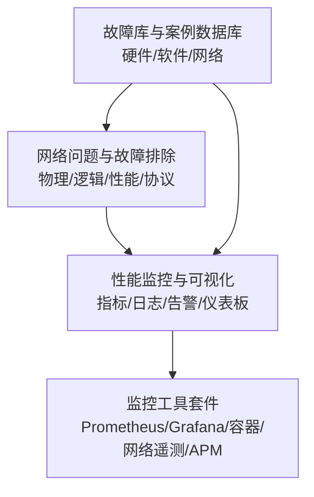
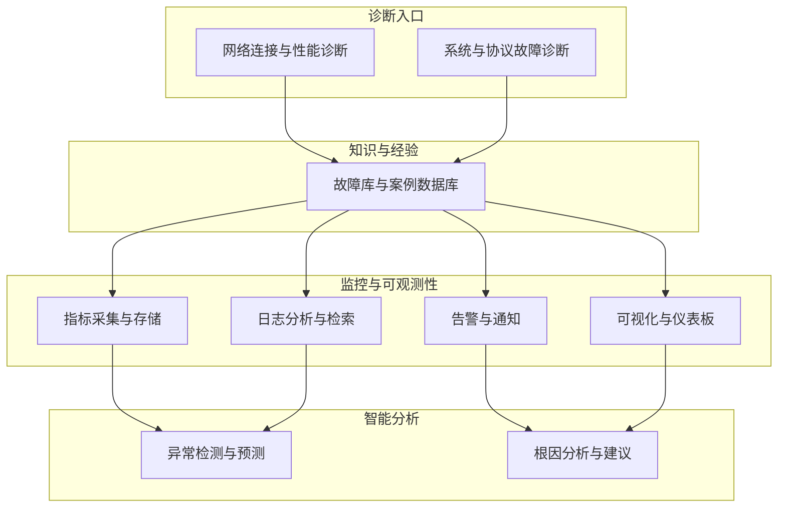
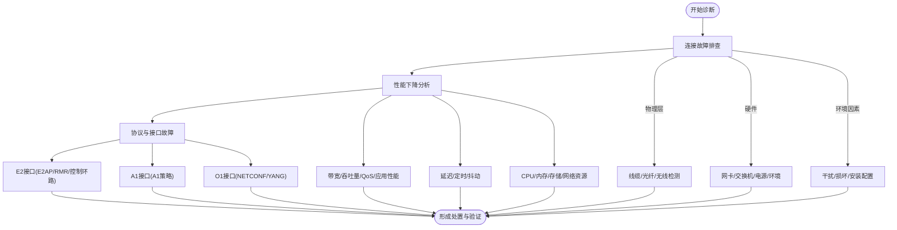
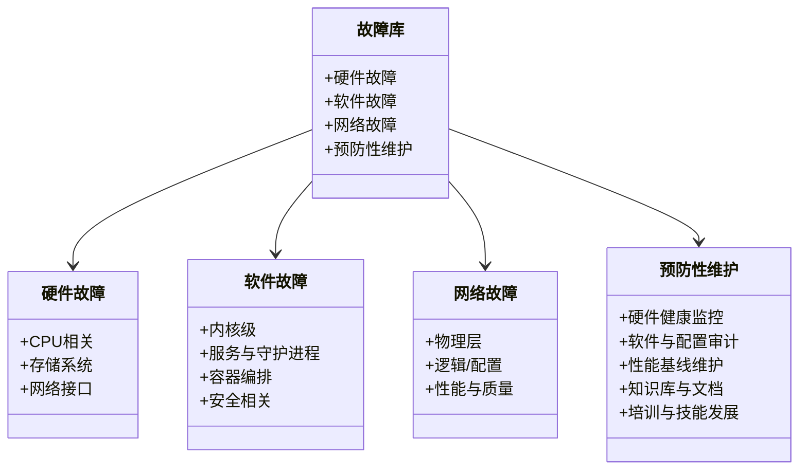
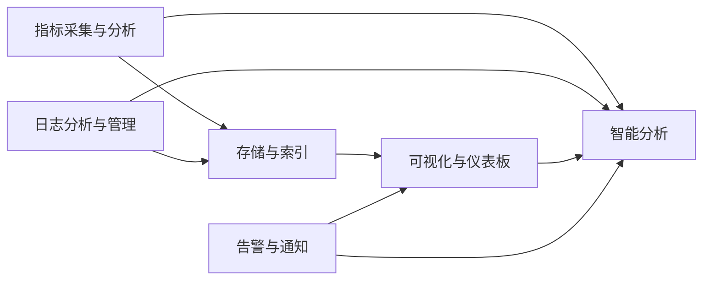
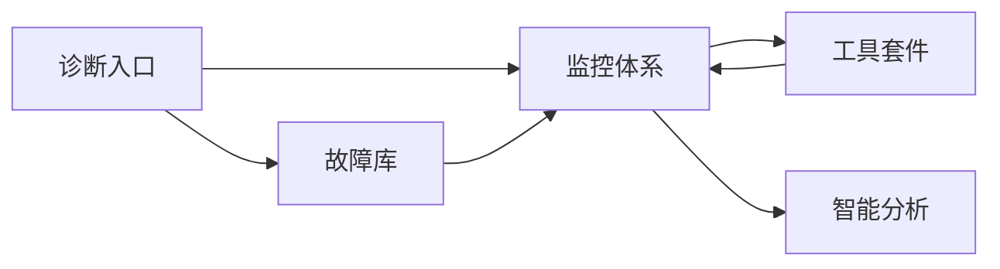

# 诊断工具箱

<cite>
**本文引用的文件**
- [O-RAN 网络问题和故障排除（中文）](file://27-troubleshooting-diagnosis/network-issues/o-ran-network-troubleshooting-zh.md)
- [O-RAN 故障库和案例数据库（中文）](file://27-troubleshooting-diagnosis/fault-library/o-ran-fault-case-database-zh.md)
- [O-RAN 性能监控工具和系统（中文）](file://26-performance-optimization/monitoring-tools/o-ran-monitoring-tools-zh.md)
- [O-RAN 监控工具套件（中文）](file://28-monitoring-alerting/monitoring-tools/o-ran-monitoring-tools-zh.md)
</cite>

## 目录
1. [简介](#简介)
2. [项目结构](#项目结构)
3. [核心组件](#核心组件)
4. [架构总览](#架构总览)
5. [详细组件分析](#详细组件分析)
6. [依赖分析](#依赖分析)
7. [性能考量](#性能考量)
8. [故障排除指南](#故障排除指南)
9. [结论](#结论)
10. [附录](#附录)

## 简介
本文件面向O-RAN运维与工程人员，提供一套系统化的“诊断工具箱”使用指导。围绕系统与网络、应用与协议、监控与可视化等维度，给出工具选择标准、组合使用策略、实操技巧与故障排除范式，并结合仓库中现有的网络故障排除、故障库、监控工具与可视化文档，形成可落地的诊断方法论与最佳实践。

## 项目结构
本仓库与“诊断工具箱”直接相关的内容主要分布在以下主题域：
- 网络问题与故障排除：覆盖物理层、逻辑层、性能与协议层面的系统化诊断方法
- 故障库与案例数据库：沉淀典型故障场景、根因分析与标准化处置
- 性能监控与可视化：指标采集、日志分析、告警与仪表板体系
- 监控工具套件：Prometheus/Grafana、容器平台、网络遥测、应用可观测性与智能分析

**章节来源**
- file://27-troubleshooting-diagnosis/network-issues/o-ran-network-troubleshooting-zh.md#L1-L278
- file://27-troubleshooting-diagnosis/fault-library/o-ran-fault-case-database-zh.md#L1-L225
- file://26-performance-optimization/monitoring-tools/o-ran-monitoring-tools-zh.md#L1-L355
- file://28-monitoring-alerting/monitoring-tools/o-ran-monitoring-tools-zh.md#L1-L284

## 核心组件
- 系统与网络诊断：以“连接故障排除—性能下降分析—协议与接口故障排除”为主线，提供工具与步骤指引
- 故障库与案例：按硬件、软件、网络三大类整理故障模式、根因与处置步骤，支撑快速定位
- 监控与可视化：以Prometheus生态为核心，结合Grafana、日志平台与智能分析，实现可观测性闭环
- 工具套件：覆盖基础设施、容器平台、网络遥测、应用性能与智能分析的全栈监控能力

**章节来源**
- file://27-troubleshooting-diagnosis/network-issues/o-ran-network-troubleshooting-zh.md#L6-L278
- file://27-troubleshooting-diagnosis/fault-library/o-ran-fault-case-database-zh.md#L6-L225
- file://26-performance-optimization/monitoring-tools/o-ran-monitoring-tools-zh.md#L6-L355
- file://28-monitoring-alerting/monitoring-tools/o-ran-monitoring-tools-zh.md#L6-L284

## 架构总览
下图展示“诊断工具箱”的整体架构：以网络与系统诊断为入口，结合故障库与监控体系，形成“发现问题—定位根因—处置修复—验证闭环”的流程；在可视化与智能分析的加持下，实现从被动响应到主动治理的演进。

**图表来源**
- [O-RAN 网络问题和故障排除（中文）](file://27-troubleshooting-diagnosis/network-issues/o-ran-network-troubleshooting-zh.md#L1-L278)
- [O-RAN 故障库和案例数据库（中文）](file://27-troubleshooting-diagnosis/fault-library/o-ran-fault-case-database-zh.md#L1-L225)
- [O-RAN 性能监控工具和系统（中文）](file://26-performance-optimization/monitoring-tools/o-ran-monitoring-tools-zh.md#L1-L355)
- [O-RAN 监控工具套件（中文）](file://28-monitoring-alerting/monitoring-tools/o-ran-monitoring-tools-zh.md#L1-L284)

## 详细组件分析

### 系统与网络诊断：连接、性能与协议
- 连接故障排除
  - 物理层：线缆/光纤/无线链路的检测与修复流程
  - 硬件组件：网卡、交换机/路由器、电源与环境的诊断步骤
  - 环境与外部因素：电磁干扰、物理损坏、安装配置错误的识别与处理
- 性能下降分析
  - 带宽/吞吐量、QoS、应用性能、延迟与定时、抖动与时序、资源利用率
- 协议与接口故障排除
  - E2接口：消息交换、路由与控制环路性能
  - A1接口：策略分发、冲突与动态更新
  - O1接口：NETCONF/YANG配置、配置管理与编排自动化

**图表来源**
- [O-RAN 网络问题和故障排除（中文）](file://27-troubleshooting-diagnosis/network-issues/o-ran-network-troubleshooting-zh.md#L6-L278)

**章节来源**
- file://27-troubleshooting-diagnosis/network-issues/o-ran-network-troubleshooting-zh.md#L6-L278

### 故障库与案例：根因与处置模板
- 硬件故障库：服务器CPU/内存/电源、存储系统、网络接口、线缆与连接器、交换机/路由器
- 软件故障目录：内核级问题、服务与守护进程、容器编排、安全相关软件
- 网络故障数据库：物理层问题、逻辑/配置问题（IP冲突、路由、DNS）、性能与质量（拥塞、延迟/抖动、丢包）
- 预防性维护：硬件健康监控、软件与配置审计、性能基线维护、知识库与文档、培训与技能发展

**图表来源**
- [O-RAN 故障库和案例数据库（中文）](file://27-troubleshooting-diagnosis/fault-library/o-ran-fault-case-database-zh.md#L6-L225)

**章节来源**
- file://27-troubleshooting-diagnosis/fault-library/o-ran-fault-case-database-zh.md#L6-L225

### 监控与可视化：指标、日志、告警与仪表板
- 指标采集与分析：基础设施、容器平台、云与虚拟化、应用性能监控（APM）、网络性能监控、安全监控集成
- 日志分析与管理：集中式日志系统（Filebeat/Fluentd/Logstash/Rsyslog、Elastic/OpenSearch/Loki/ClickHouse）与可视化（Kibana/Grafana/Graylog/Splunk）
- 自动化告警与通知：Alertmanager/Grafana/Zabbix/Sensu、多通道通知（邮件/IM/短信/推送）
- 智能分析：异常检测、预测性维护、根因分析与建议

**图表来源**
- [O-RAN 性能监控工具和系统（中文）](file://26-performance-optimization/monitoring-tools/o-ran-monitoring-tools-zh.md#L6-L355)
- [O-RAN 监控工具套件（中文）](file://28-monitoring-alerting/monitoring-tools/o-ran-monitoring-tools-zh.md#L6-L284)

**章节来源**
- file://26-performance-optimization/monitoring-tools/o-ran-monitoring-tools-zh.md#L6-L355
- file://28-monitoring-alerting/monitoring-tools/o-ran-monitoring-tools-zh.md#L6-L284

### 工具套件：Prometheus/Grafana、容器平台、网络遥测、APM与智能分析
- Prometheus生态：Server、Node Exporter、Alertmanager、Pushgateway、Grafana集成与多租户
- 容器平台监控：kube-state-metrics、cAdvisor、Kubelet Metrics、ETCD监控、服务网格可观测性（Istio/Jaeger/Kiali）
- 存储与数据库监控：PostgreSQL/MySQL/Redis/MongoDB Exporter，Ceph/NFS/块设备/文件系统指标
- 网络遥测：E2接口监控、前传/射频监控、网络仿真与测试（iperf3/tc/Netperf/Wireshark）、SDN控制器监控
- 应用性能管理：xApp/rApp监控、自定义指标、健康检查、分布式追踪与日志聚合、指标联邦
- 智能分析：异常检测、预测性维护、商业智能集成与自定义报告

```mermaid
graph TB
subgraph "Prometheus生态"
P["Prometheus Server"]
NE["Node Exporter"]
AM["Alertmanager"]
PG["Pushgateway"]
G["Grafana"]
end
subgraph "容器平台"
KSM["kube-state-metrics"]
CAD["cAdvisor"]
KL["Kubelet Metrics"]
ETCD["ETCD 监控"]
ISTIO["Istio 遥测"]
JAE["Jaeger 追踪"]
KIALI["Kiali 仪表板"]
end
subgraph "存储与数据库"
PGEX["PostgreSQL Exporter"]
MYEX["MySQL Exporter"]
REDIS["Redis Exporter"]
MONGO["MongoDB Exporter"]
CEPH["Ceph Exporter"]
NFS["NFS 指标"]
end
subgraph "网络遥测"
E2MON["E2 接口监控"]
RF["前传/射频监控"]
NETTOOLS["网络仿真与测试"]
SDN["SDN 控制器监控"]
end
subgraph "应用性能管理"
XAPP["xApp/rApp 监控"]
HEALTH["健康检查框架"]
TRACING["分布式追踪"]
LOGAGG["日志聚合"]
FED["指标联邦"]
end
subgraph "智能分析"
ANOM["异常检测"]
PRED["预测性维护"]
BI["商业智能"]
end
NE --> P
AM --> P
PG --> P
P --> G
KSM --> P
CAD --> P
KL --> P
ETCD --> P
ISTIO --> P
JAE --> P
KIALI --> P
PGEX --> P
MYEX --> P
REDIS --> P
MONGO --> P
CEPH --> P
NFS --> P
E2MON --> P
RF --> P
NETTOOLS --> P
SDN --> P
XAPP --> P
HEALTH --> P
TRACING --> P
LOGAGG --> P
FED --> P
P --> ANOM
P --> PRED
P --> BI
```

**图表来源**
- [O-RAN 监控工具套件（中文）](file://28-monitoring-alerting/monitoring-tools/o-ran-monitoring-tools-zh.md#L6-L284)

**章节来源**
- file://28-monitoring-alerting/monitoring-tools/o-ran-monitoring-tools-zh.md#L6-L284

## 依赖分析
- 诊断入口依赖故障库与监控体系：先用网络/系统诊断定位问题，再结合故障库与监控数据进行根因分析与处置
- 监控体系依赖工具套件：Prometheus/Grafana、容器平台、网络遥测、APM与智能分析共同构成可观测性底座
- 智能分析依赖指标与日志：异常检测与预测性维护以高质量数据为前提

**图表来源**
- [O-RAN 网络问题和故障排除（中文）](file://27-troubleshooting-diagnosis/network-issues/o-ran-network-troubleshooting-zh.md#L1-L278)
- [O-RAN 故障库和案例数据库（中文）](file://27-troubleshooting-diagnosis/fault-library/o-ran-fault-case-database-zh.md#L1-L225)
- [O-RAN 监控工具套件（中文）](file://28-monitoring-alerting/monitoring-tools/o-ran-monitoring-tools-zh.md#L6-L284)

**章节来源**
- file://27-troubleshooting-diagnosis/network-issues/o-ran-network-troubleshooting-zh.md#L1-L278
- file://27-troubleshooting-diagnosis/fault-library/o-ran-fault-case-database-zh.md#L1-L225
- file://28-monitoring-alerting/monitoring-tools/o-ran-monitoring-tools-zh.md#L6-L284

## 性能考量
- 指标采集与存储：合理设置抓取间隔、避免指标基数爆炸、选择合适的存储与索引方案
- 日志处理：多层日志处理与过滤、标签化索引、压缩与归档策略
- 告警设计：阈值设定、去噪与分组、分级与升级策略，避免告警疲劳
- 可视化与查询：仪表板性能优化、查询计划与索引策略、缓存层与资源管理
- 容量规划：基于指标基数与数据保留策略估算存储与网络带宽需求

**章节来源**
- file://26-performance-optimization/monitoring-tools/o-ran-monitoring-tools-zh.md#L286-L355
- file://28-monitoring-alerting/monitoring-tools/o-ran-monitoring-tools-zh.md#L269-L282

## 故障排除指南
- 快速定位三步法
  - 现象确认：明确症状、影响范围与发生时间
  - 证据收集：结合网络诊断工具与监控数据，采集日志、指标与告警
  - 处置验证：执行修复动作并观察指标与日志变化，形成闭环
- 常见场景参考
  - 物理层链路问题：线缆/光纤/无线链路检测与修复
  - 硬件组件故障：网卡/交换机/电源/环境问题的诊断与替换
  - 性能瓶颈：带宽/延迟/抖动/资源利用率的量化分析与优化
  - 协议异常：E2/A1/O1接口的消息流、路由与策略一致性检查
- 工具组合建议
  - 网络连通性：ping/traceroute + 带宽测试 + Wireshark抓包
  - 系统性能：top/htop + vmstat/sar + dmesg/journalctl
  - 应用问题：APM追踪 + 健康检查 + 日志检索 + 指标仪表板
- 故障库复用
  - 在故障库中检索相似案例，复用根因与处置步骤，缩短平均修复时间

**章节来源**
- file://27-troubleshooting-diagnosis/network-issues/o-ran-network-troubleshooting-zh.md#L6-L278
- file://27-troubleshooting-diagnosis/fault-library/o-ran-fault-case-database-zh.md#L6-L225

## 结论
通过将“系统与网络诊断—故障库—监控与可视化—智能分析”有机融合，O-RAN运维团队可以建立从“被动响应”到“主动治理”的诊断闭环。建议以故障库为知识基座，以监控体系为感知底座，以工具套件为执行载体，以智能分析为决策辅助，持续迭代优化诊断流程与工具组合。

## 附录
- 维护与更新
  - 定期更新监控指标与告警规则，结合容量规划与性能基线进行调整
  - 持续完善故障库，沉淀案例与最佳实践，开展培训与演练
  - 关注新工具与新技术，评估对现有监控体系的兼容性与价值

**章节来源**
- file://27-troubleshooting-diagnosis/fault-library/o-ran-fault-case-database-zh.md#L171-L225
- file://26-performance-optimization/monitoring-tools/o-ran-monitoring-tools-zh.md#L333-L355
- file://28-monitoring-alerting/monitoring-tools/o-ran-monitoring-tools-zh.md#L237-L284