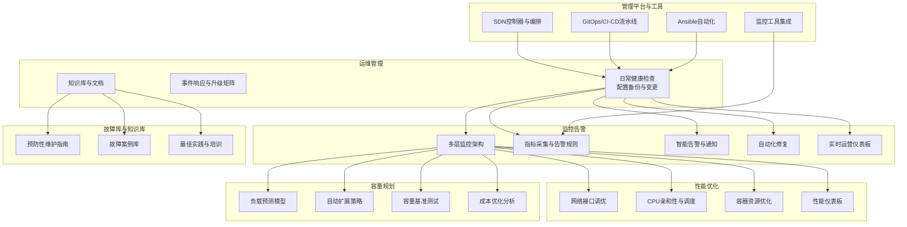
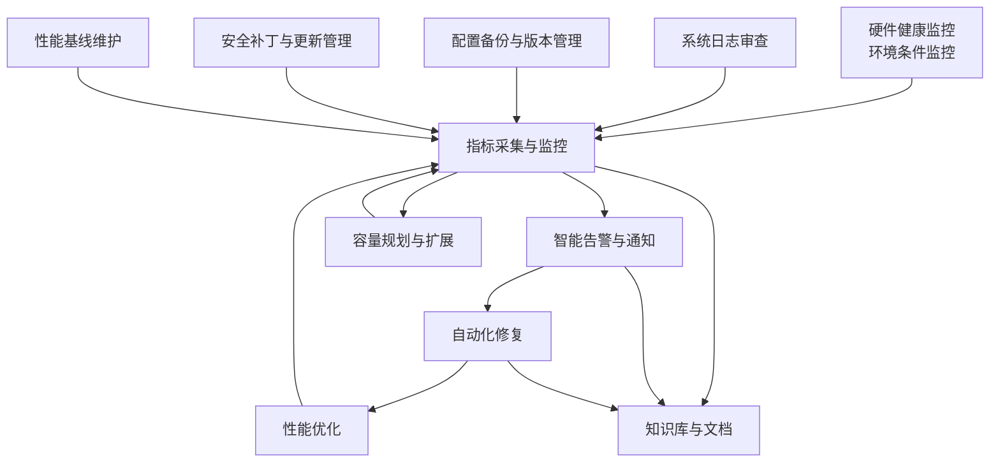
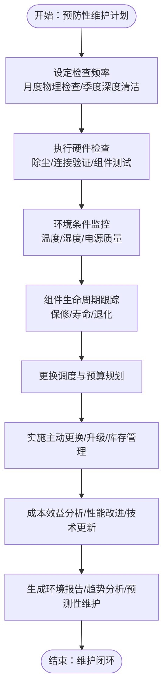
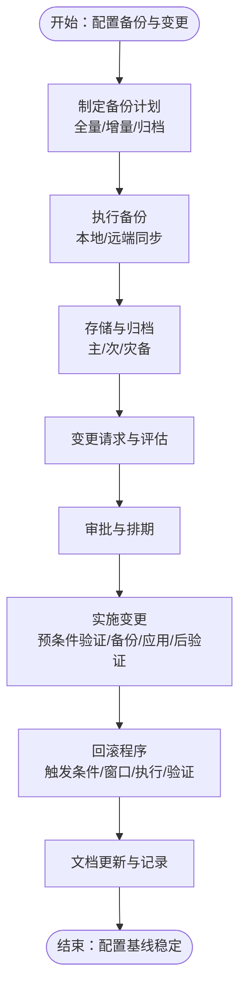
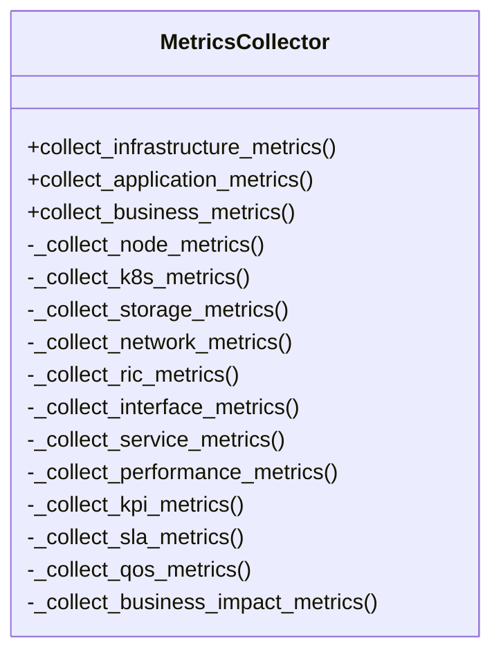
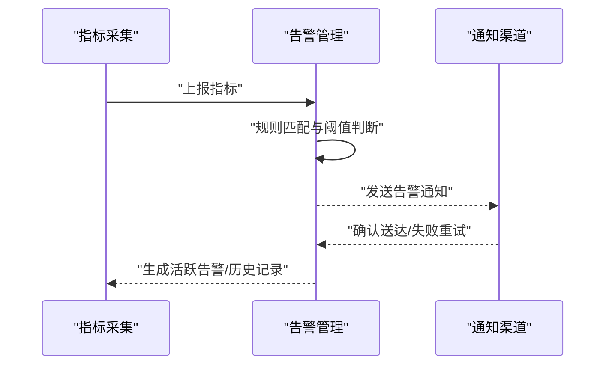
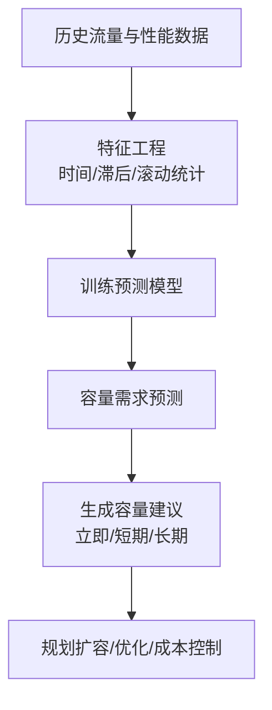
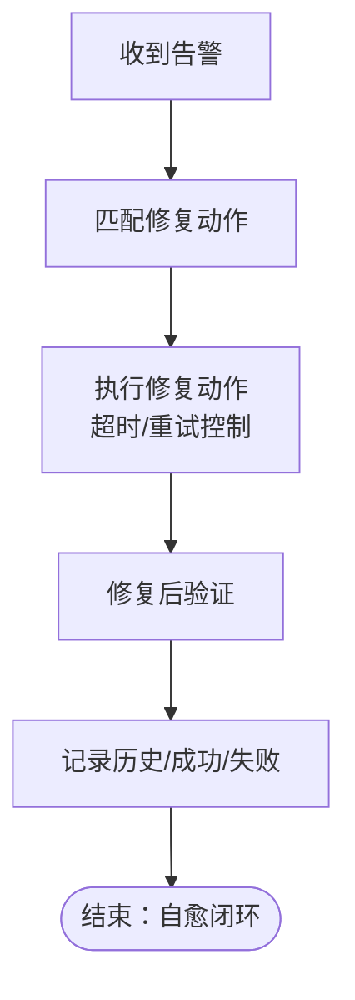
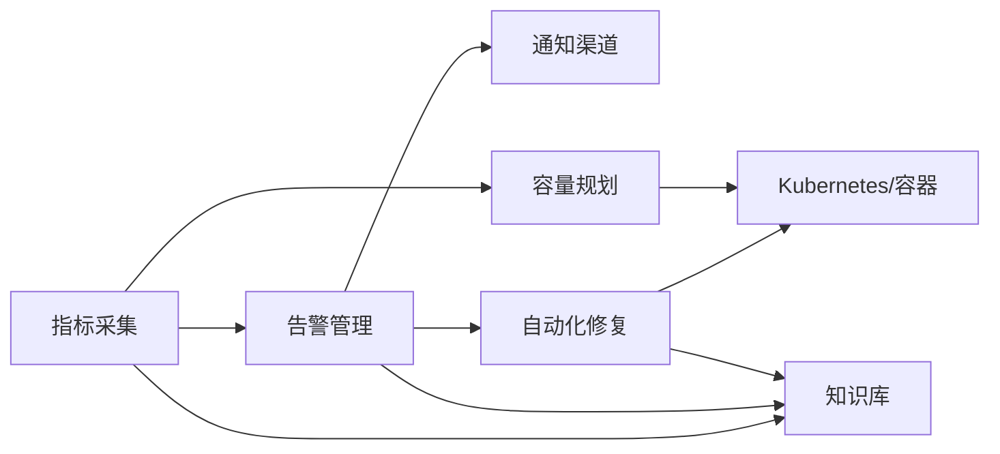

# 预防性维护

<cite>
**本文引用的文件**
- [运维管理-README](file://14-operations-management/readme-zh.md)
- [日常运维程序](file://14-operations-management/daily-operations/daily-operation-procedures-zh.md)
- [运营监控告警框架](file://14-operations-management/monitoring-alerting/operations-monitoring-framework-zh.md)
- [性能优化框架](file://14-operations-management/performance-optimization/performance-optimization-framework-zh.md)
- [容量规划框架](file://14-operations-management/capacity-planning/capacity-planning-framework-zh.md)
- [故障库与案例数据库](file://27-troubleshooting-diagnosis/fault-library/o-ran-fault-case-database-zh.md)
- [O-RAN管理平台](file://22-tool-platforms/management-platforms/o-ran-management-platforms-zh.md)
- [O-RAN监控工具](file://26-performance-optimization/monitoring-tools/o-ran-monitoring-tools-zh.md)
- [O-RAN知识库优化与多语言支持计划](file://.trae/documents/O-RAN知识库文件结构优化与多语言支持.md)
- [O-RAN知识库优化与新手入门指南开发计划](file://.trae/documents/O-RAN知识库优化与新手入门指南开发.md)
</cite>

## 目录
1. [引言](#引言)
2. [项目结构](#项目结构)
3. [核心组件](#核心组件)
4. [架构总览](#架构总览)
5. [详细组件分析](#详细组件分析)
6. [依赖分析](#依赖分析)
7. [性能考量](#性能考量)
8. [故障排查与维护](#故障排查与维护)
9. [结论](#结论)
10. [附录](#附录)

## 引言
本文件面向O-RAN网络的预防性维护，围绕“硬件健康状态监控、系统日志审查、配置备份与版本管理、安全补丁与更新、性能基线维护”五大基础维度，结合“自动化监控与实时关键指标、自动异常告警、预测性故障分析、自动修复脚本、运维知识库更新”的自动化与智能化手段，给出可落地的实施方法、检查标准、工具使用与数据采集分析方法，并提供维护计划制定、任务分配、效果评估与成本控制的策略，以及检查清单与维护记录模板，帮助运营商与运维团队建立系统化、可量化、可持续的预防性维护体系。

## 项目结构
本仓库围绕O-RAN运维管理、监控告警、性能优化、容量规划、故障库与知识库、管理平台与自动化工具等主题形成体系化文档。预防性维护相关内容主要分布在以下模块：
- 运维管理：日常健康检查、配置管理、事件响应、知识库与文档
- 监控告警：多层监控架构、指标采集、智能告警、仪表板、自动化修复
- 性能优化：网络与计算层优化、容器资源优化、性能仪表板
- 容量规划：负载预测、自动扩展、成本优化、容量基准测试
- 故障库与知识库：预防性维护指南、故障案例、最佳实践与培训
- 管理平台与工具：SDN/NFV编排、GitOps/CI-CD、Ansible自动化、监控工具集成

**图表来源**
- [运维管理-README](file://14-operations-management/readme-zh.md#L1-L126)
- [运营监控告警框架](file://14-operations-management/monitoring-alerting/operations-monitoring-framework-zh.md#L1-L909)
- [性能优化框架](file://14-operations-management/performance-optimization/performance-optimization-framework-zh.md#L1-L342)
- [容量规划框架](file://14-operations-management/capacity-planning/capacity-planning-framework-zh.md#L1-L505)
- [故障库与案例数据库](file://27-troubleshooting-diagnosis/fault-library/o-ran-fault-case-database-zh.md#L1-L225)
- [O-RAN管理平台](file://22-tool-platforms/management-platforms/o-ran-management-platforms-zh.md#L1-L711)

**章节来源**
- [运维管理-README](file://14-operations-management/readme-zh.md#L1-L126)

## 核心组件
- 硬件健康监控与环境条件监控：定期物理检查、深度清洁、温度/湿度/电源质量监测、组件生命周期管理
- 系统日志审查：持续日志采集、异常检测、根因分析、合规性报告
- 配置备份与版本管理：全量/增量备份策略、多位置存储、配置项清单、变更前后验证
- 安全补丁与更新管理：补丁评估、测试与部署、回滚程序、合规追踪
- 性能基线维护：正常性能指标、容量规划数据、使用模式、阈值调整与趋势分析
- 自动化监控与实时关键指标：基础设施/应用/业务三层指标、阈值规则、仪表板
- 自动异常告警：智能告警引擎、通知渠道、告警关联与去重、升级流程
- 预测性故障分析：负载预测模型、趋势分析、容量预警
- 自动修复脚本：自愈动作框架、Kubernetes/容器/系统级修复
- 运维知识库更新：故障案例、最佳实践、培训与技能发展

**章节来源**
- [日常运维程序](file://14-operations-management/daily-operations/daily-operation-procedures-zh.md#L1-L419)
- [运营监控告警框架](file://14-operations-management/monitoring-alerting/operations-monitoring-framework-zh.md#L1-L909)
- [性能优化框架](file://14-operations-management/performance-optimization/performance-optimization-framework-zh.md#L1-L342)
- [容量规划框架](file://14-operations-management/capacity-planning/capacity-planning-framework-zh.md#L1-L505)
- [故障库与案例数据库](file://27-troubleshooting-diagnosis/fault-library/o-ran-fault-case-database-zh.md#L171-L225)

## 架构总览
预防性维护的总体架构以“监控—告警—修复—优化—知识库”闭环为核心，结合SDN/NFV编排、GitOps/CI-CD、Ansible自动化与监控工具集成，实现从硬件到软件、从配置到性能的全栈预防性维护。

**图表来源**
- [运营监控告警框架](file://14-operations-management/monitoring-alerting/operations-monitoring-framework-zh.md#L1-L909)
- [O-RAN监控工具](file://26-performance-optimization/monitoring-tools/o-ran-monitoring-tools-zh.md#L146-L214)
- [O-RAN管理平台](file://22-tool-platforms/management-platforms/o-ran-management-platforms-zh.md#L534-L711)

## 详细组件分析

### 硬件健康状态监控与环境条件监控
- 定期硬件检查：频率、检查表、工具与文档
- 环境条件监控：温度/湿度/空气质量/电源质量参数、连续传感器、阈值与行动、趋势与预测
- 组件生命周期管理：保修到期、预期寿命、性能退化跟踪、更换调度、预算与供应商协调、主动更换与升级、成本效益分析

**图表来源**
- [故障库与案例数据库](file://27-troubleshooting-diagnosis/fault-library/o-ran-fault-case-database-zh.md#L171-L225)

**章节来源**
- [故障库与案例数据库](file://27-troubleshooting-diagnosis/fault-library/o-ran-fault-case-database-zh.md#L171-L225)

### 系统日志审查与合规性报告
- 持续日志采集与归档
- 异常检测与根因分析
- 合规性报告与审计追踪
- 事件响应与升级流程

**章节来源**
- [日常运维程序](file://14-operations-management/daily-operations/daily-operation-procedures-zh.md#L283-L307)

### 配置备份与版本管理
- 备份策略：全量/增量/归档、多位置存储（本地/对象存储/灾备）
- 配置项清单与备份频率
- 变更管理流程：请求、评估、审批、实施、验证、回滚
- 变更后验证与文档更新

**图表来源**
- [日常运维程序](file://14-operations-management/daily-operations/daily-operation-procedures-zh.md#L163-L281)

**章节来源**
- [日常运维程序](file://14-operations-management/daily-operations/daily-operation-procedures-zh.md#L163-L281)

### 安全补丁与更新管理
- 补丁评估与测试
- 部署计划与回滚程序
- 漏洞扫描与合规报告
- 供应商协调与内部测试

**章节来源**
- [故障库与案例数据库](file://27-troubleshooting-diagnosis/fault-library/o-ran-fault-case-database-zh.md#L198-L202)

### 性能基线维护
- 建立正常性能指标、容量规划数据、使用模式
- 持续性能跟踪、异常检测、趋势分析
- 基线更新、阈值调整、优化举措
- 性能报告、容量预测、优化建议

**章节来源**
- [故障库与案例数据库](file://27-troubleshooting-diagnosis/fault-library/o-ran-fault-case-database-zh.md#L203-L207)

### 自动化监控与实时关键指标
- 多层监控架构：基础设施/应用/业务
- 指标采集：节点/容器/K8s/存储/网络/RIC/接口/服务/性能/KPI/SLA/QoS/业务影响
- 实时仪表板：系统状态、健康指标、告警列表、趋势图

**图表来源**
- [运营监控告警框架](file://14-operations-management/monitoring-alerting/operations-monitoring-framework-zh.md#L48-L260)

**章节来源**
- [运营监控告警框架](file://14-operations-management/monitoring-alerting/operations-monitoring-framework-zh.md#L46-L260)

### 自动异常告警与通知
- 智能告警引擎：阈值规则、严重性与分类、告警去重与关联
- 通知渠道：邮件/即时通讯/短信/移动推送
- 升级流程：时间线与沟通协议

**图表来源**
- [运营监控告警框架](file://14-operations-management/monitoring-alerting/operations-monitoring-framework-zh.md#L264-L486)

**章节来源**
- [运营监控告警框架](file://14-operations-management/monitoring-alerting/operations-monitoring-framework-zh.md#L262-L486)

### 预测性故障分析
- 负载预测模型：时间序列特征、随机森林模型、预测与建议
- 趋势分析与容量预警
- 自动扩展策略与容量基准测试

**图表来源**
- [容量规划框架](file://14-operations-management/capacity-planning/capacity-planning-framework-zh.md#L8-L186)

**章节来源**
- [容量规划框架](file://14-operations-management/capacity-planning/capacity-planning-framework-zh.md#L1-L505)

### 自动修复脚本
- 自愈动作框架：条件匹配、动作执行、超时与重试、历史记录
- 示例动作：扩缩容、重启容器/Pod、清理缓存、检查连接与数据库连通性

**图表来源**
- [运营监控告警框架](file://14-operations-management/monitoring-alerting/operations-monitoring-framework-zh.md#L694-L907)

**章节来源**
- [运营监控告警框架](file://14-operations-management/monitoring-alerting/operations-monitoring-framework-zh.md#L694-L907)

### 运维知识库更新
- 故障案例文档：标准化格式、根因分析、解决程序
- 最佳实践与指南：开发/实施/审查/分发
- 培训与技能发展：技术培训、认证、跨职能教育、评估与改进

**章节来源**
- [故障库与案例数据库](file://27-troubleshooting-diagnosis/fault-library/o-ran-fault-case-database-zh.md#L208-L224)

### 管理平台与自动化工具
- SDN/NFV编排：ONOS/OpenDaylight、TOSCA蓝图、策略框架
- GitOps/CI-CD：ArgoCD、Helm、Kustomize、基础设施即代码
- Ansible自动化：角色化部署、验证与回滚
- 监控工具集成：Prometheus/Grafana/Sensu/Zabbix、通知与自动化

**章节来源**
- [O-RAN管理平台](file://22-tool-platforms/management-platforms/o-ran-management-platforms-zh.md#L1-L711)
- [O-RAN监控工具](file://26-performance-optimization/monitoring-tools/o-ran-monitoring-tools-zh.md#L146-L214)

## 依赖分析
- 组件耦合与内聚：监控采集与告警引擎高度内聚；修复脚本与编排平台耦合紧密；知识库与事件响应相互促进
- 外部依赖：SDN控制器、Kubernetes、对象存储、监控系统、CI-CD平台
- 告警关联与去重：避免风暴与噪声，提升响应效率
- 自动化修复与回滚：确保修复可控、可追溯、可恢复

**图表来源**
- [运营监控告警框架](file://14-operations-management/monitoring-alerting/operations-monitoring-framework-zh.md#L1-L909)
- [容量规划框架](file://14-operations-management/capacity-planning/capacity-planning-framework-zh.md#L1-L505)

**章节来源**
- [运营监控告警框架](file://14-operations-management/monitoring-alerting/operations-monitoring-framework-zh.md#L488-L528)

## 性能考量
- 网络性能优化：接口调优、内核参数、NUMA感知绑定、优先级队列
- 计算性能优化：CPU亲和性、调度器调优、进程优先级
- 容器资源优化：requests/limits、探针、并发参数
- 监控与性能分析：仪表板阈值、趋势分析、容量基准测试

**章节来源**
- [性能优化框架](file://14-operations-management/performance-optimization/performance-optimization-framework-zh.md#L1-L342)

## 故障排查与维护
- 事件分类与升级矩阵：严重性等级、初始响应/升级/解决目标、沟通协议
- 故障排除手册：接口连接、性能下降、同步问题等常见问题的诊断与解决步骤
- 维护效果评估：KPI/SLA/MTTR/MTBF、客户满意度、收入影响事件
- 维护成本控制：资源利用分析、自动扩展、成本优化策略、ROI评估

**章节来源**
- [日常运维程序](file://14-operations-management/daily-operations/daily-operation-procedures-zh.md#L283-L359)
- [容量规划框架](file://14-operations-management/capacity-planning/capacity-planning-framework-zh.md#L268-L359)

## 结论
通过将硬件健康监控、系统日志审查、配置备份与版本管理、安全补丁与更新、性能基线维护与自动化监控、智能告警、预测性分析、自动修复、知识库更新有机结合，O-RAN预防性维护能够实现从“被动救火”到“主动治理”的转变，显著降低停机时间、提升系统可靠性与运维效率，并支撑持续的成本优化与业务增长。

## 附录

### 维护计划制定与任务分配
- 维护周期：硬件检查（月度/季度）、配置审计（季度）、补丁评估（按需/计划）
- 任务分配：明确责任人、工具与文档、SLA与验收标准
- 任务跟踪：工单系统、变更日志、维护记录

**章节来源**
- [日常运维程序](file://14-operations-management/daily-operations/daily-operation-procedures-zh.md#L219-L281)

### 维护效果评估与成本控制
- 指标：可用性、MTTR、MTBF、SLA达成率、客户满意度、收入影响事件
- 方法：KPI仪表板、趋势分析、容量预测、成本效益分析
- 策略：自动扩展、资源优化、按需扩缩容、预留实例规划

**章节来源**
- [运营监控告警框架](file://14-operations-management/monitoring-alerting/operations-monitoring-framework-zh.md#L200-L242)
- [容量规划框架](file://14-operations-management/capacity-planning/capacity-planning-framework-zh.md#L268-L359)

### 工具使用与数据采集分析
- 工具：Prometheus/Grafana、Sensu、Zabbix、ArgoCD、Terraform、Ansible
- 数据采集：指标采集器、日志采集、网络/存储/应用/业务KPI
- 分析方法：阈值规则、趋势分析、机器学习异常检测、容量预测

**章节来源**
- [O-RAN监控工具](file://26-performance-optimization/monitoring-tools/o-ran-monitoring-tools-zh.md#L146-L214)
- [O-RAN管理平台](file://22-tool-platforms/management-platforms/o-ran-management-platforms-zh.md#L534-L711)

### 预防性维护最佳实践与效率提升策略
- 最佳实践：标准化流程、自动化优先、知识共享、持续改进
- 效率提升：告警关联与去重、自愈自动化、容量预测、资源优化

**章节来源**
- [故障库与案例数据库](file://27-troubleshooting-diagnosis/fault-library/o-ran-fault-case-database-zh.md#L208-L224)

### 检查清单与维护记录模板
- 硬件检查清单：除尘、连接、组件测试、温度/湿度/电源质量
- 配置备份清单：备份时间、位置、配置项、验证结果
- 变更记录模板：变更ID、环境、预条件、备份、应用、验证、回滚、日志
- 维护记录模板：日期、检查人、发现问题、处理措施、验证结果、后续建议

**章节来源**
- [日常运维程序](file://14-operations-management/daily-operations/daily-operation-procedures-zh.md#L6-L66)
- [日常运维程序](file://14-operations-management/daily-operations/daily-operation-procedures-zh.md#L163-L281)