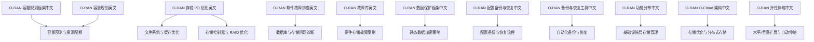
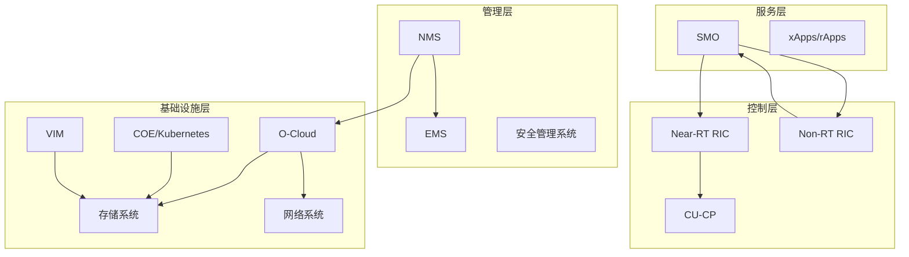
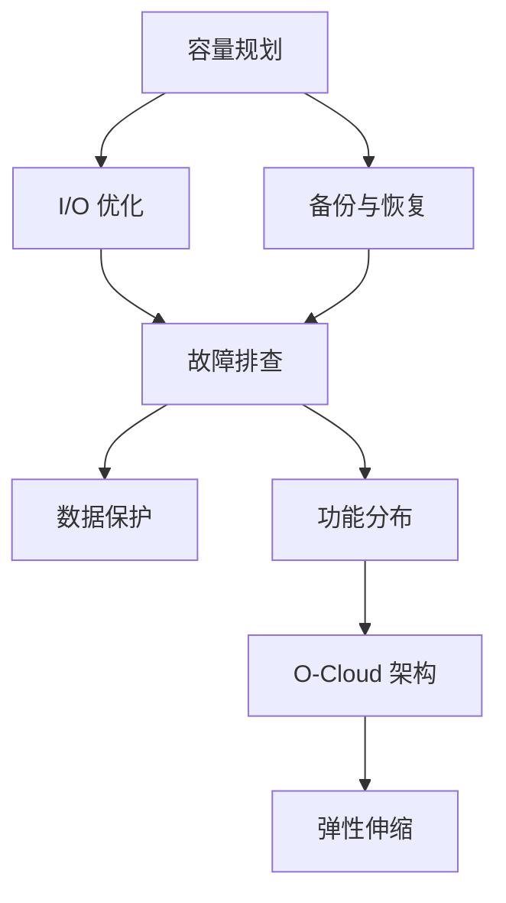
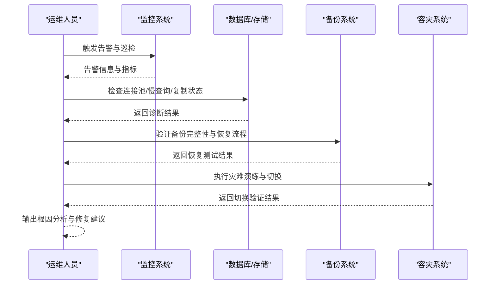

# 存储架构设计

<cite>
**本文引用的文件**
- [O-RAN 容量规划框架（中文）](file://14-operations-management/capacity-planning/capacity-planning-framework-zh.md)
- [O-RAN 容量规划（英文）](file://26-performance-optimization/capacity-planning/o-ran-capacity-planning.md)
- [O-RAN 存储 I/O 优化（英文）](file://26-performance-optimization/compute-optimization/o-ran-compute-optimization.md)
- [O-RAN 软件故障排查（英文）](file://27-troubleshooting-diagnosis/software-faults/o-ran-software-troubleshooting.md)
- [O-RAN 故障库（英文）](file://27-troubleshooting-diagnosis/fault-library/o-ran-fault-case-database.md)
- [O-RAN 数据保护框架（中文）](file://12-security-privacy/data-protection/data-protection-framework-zh.md)
- [O-RAN 配置备份与恢复（中文）](file://14-operations-management/daily-operations/daily-operation-procedures-zh.md)
- [O-RAN 备份与恢复工具（中文）](file://22-tool-platforms/utility-programs/o-ran-utility-programs-zh.md)
- [O-RAN 功能分布（中文）](file://01-architecture-system/functional-distribution.md)
- [O-RAN O-Cloud 架构（中文）](file://01-architecture-system/o-cloud-architecture.md)
- [O-RAN 弹性伸缩（中文）](file://01-architecture-system/elastic-scaling.md)
</cite>

## 目录
1. [引言](#引言)
2. [项目结构](#项目结构)
3. [核心组件](#核心组件)
4. [架构总览](#架构总览)
5. [详细组件分析](#详细组件分析)
6. [依赖分析](#依赖分析)
7. [性能考虑](#性能考虑)
8. [故障排查与恢复指南](#故障排查与恢复指南)
9. [结论](#结论)
10. [附录](#附录)

## 引言
本文件围绕 O-RAN 存储架构设计，系统梳理分布式存储设计原则（一致性哈希、副本策略、分片算法）、数据持久化策略（RAID 级别选择、纠删码应用、快照策略）、备份与恢复机制（增量备份、异地容灾、RTO/RPO 目标），并结合仓库中现有的容量规划、性能基准测试、存储 I/O 优化、故障排查与数据保护等文档，给出可落地的设计与实施建议。同时，补充可靠性设计（故障域划分、自动故障转移、数据完整性校验）、数据一致性保证（分布式事务、版本控制、冲突解决）与容灾备份策略（热备、温备、冷备配置），以及存储介质与存储虚拟化技术的选型建议。

## 项目结构
本仓库包含与 O-RAN 存储架构相关的关键文档，主要分布在“容量规划”、“性能优化”、“故障排查”、“数据保护”、“功能分布”、“O-Cloud 架构”、“弹性伸缩”等主题目录中。这些文档为存储架构设计提供了容量预测、性能基准、I/O 优化、故障处理、数据保护与备份恢复等方面的支撑。

图表来源
- [O-RAN 容量规划框架（中文）](file://14-operations-management/capacity-planning/capacity-planning-framework-zh.md#L1-L505)
- [O-RAN 容量规划（英文）](file://26-performance-optimization/capacity-planning/o-ran-capacity-planning.md#L1-L285)
- [O-RAN 存储 I/O 优化（英文）](file://26-performance-optimization/compute-optimization/o-ran-compute-optimization.md#L287-L408)
- [O-RAN 软件故障排查（英文）](file://27-troubleshooting-diagnosis/software-faults/o-ran-software-troubleshooting.md#L188-L278)
- [O-RAN 故障库（英文）](file://27-troubleshooting-diagnosis/fault-library/o-ran-fault-case-database.md#L1-L59)
- [O-RAN 数据保护框架（中文）](file://12-security-privacy/data-protection/data-protection-framework-zh.md#L1-L28)
- [O-RAN 配置备份与恢复（中文）](file://14-operations-management/daily-operations/daily-operation-procedures-zh.md#L163-L217)
- [O-RAN 备份与恢复工具（中文）](file://22-tool-platforms/utility-programs/o-ran-utility-programs-zh.md#L563-L626)
- [O-RAN 功能分布（中文）](file://01-architecture-system/functional-distribution.md#L145-L195)
- [O-RAN O-Cloud 架构（中文）](file://01-architecture-system/o-cloud-architecture.md#L31-L62)
- [O-RAN 弹性伸缩（中文）](file://01-architecture-system/elastic-scaling.md)

章节来源
- [O-RAN 容量规划框架（中文）](file://14-operations-management/capacity-planning/capacity-planning-framework-zh.md#L1-L505)
- [O-RAN 容量规划（英文）](file://26-performance-optimization/capacity-planning/o-ran-capacity-planning.md#L1-L285)
- [O-RAN 存储 I/O 优化（英文）](file://26-performance-optimization/compute-optimization/o-ran-compute-optimization.md#L287-L408)
- [O-RAN 软件故障排查（英文）](file://27-troubleshooting-diagnosis/software-faults/o-ran-software-troubleshooting.md#L188-L278)
- [O-RAN 故障库（英文）](file://27-troubleshooting-diagnosis/fault-library/o-ran-fault-case-database.md#L1-L59)
- [O-RAN 数据保护框架（中文）](file://12-security-privacy/data-protection/data-protection-framework-zh.md#L1-L28)
- [O-RAN 配置备份与恢复（中文）](file://14-operations-management/daily-operations/daily-operation-procedures-zh.md#L163-L217)
- [O-RAN 备份与恢复工具（中文）](file://22-tool-platforms/utility-programs/o-ran-utility-programs-zh.md#L563-L626)
- [O-RAN 功能分布（中文）](file://01-architecture-system/functional-distribution.md#L145-L195)
- [O-RAN O-Cloud 架构（中文）](file://01-architecture-system/o-cloud-architecture.md#L31-L62)
- [O-RAN 弹性伸缩（中文）](file://01-architecture-system/elastic-scaling.md)

## 核心组件
- 容量规划与负载预测：提供历史数据建模、趋势预测、业务场景建模与容量建议生成，支撑存储容量规划与成本优化。
- 存储 I/O 优化：覆盖文件系统调优、缓存策略、I/O 调度器、存储控制器与 RAID 优化，提升存储子系统性能。
- 故障排查与诊断：涵盖数据库与存储问题、硬件存储故障、根因分析框架，支撑可靠性与可用性保障。
- 数据保护与备份恢复：明确静态数据加密策略、配置备份与恢复流程、自动化备份工具与脚本，支撑 RTO/RPO 目标。
- 功能分布与 O-Cloud 架构：定义基础设施层的存储资源管理职责与跨层交互，指导分布式存储与资源池化。
- 弹性伸缩：提供水平/垂直扩展策略与自动伸缩配置，支撑存储资源弹性与自愈。

章节来源
- [O-RAN 容量规划框架（中文）](file://14-operations-management/capacity-planning/capacity-planning-framework-zh.md#L1-L505)
- [O-RAN 容量规划（英文）](file://26-performance-optimization/capacity-planning/o-ran-capacity-planning.md#L1-L285)
- [O-RAN 存储 I/O 优化（英文）](file://26-performance-optimization/compute-optimization/o-ran-compute-optimization.md#L287-L408)
- [O-RAN 软件故障排查（英文）](file://27-troubleshooting-diagnosis/software-faults/o-ran-software-troubleshooting.md#L188-L278)
- [O-RAN 故障库（英文）](file://27-troubleshooting-diagnosis/fault-library/o-ran-fault-case-database.md#L1-L59)
- [O-RAN 数据保护框架（中文）](file://12-security-privacy/data-protection/data-protection-framework-zh.md#L1-L28)
- [O-RAN 配置备份与恢复（中文）](file://14-operations-management/daily-operations/daily-operation-procedures-zh.md#L163-L217)
- [O-RAN 备份与恢复工具（中文）](file://22-tool-platforms/utility-programs/o-ran-utility-programs-zh.md#L563-L626)
- [O-RAN 功能分布（中文）](file://01-architecture-system/functional-distribution.md#L145-L195)
- [O-RAN O-Cloud 架构（中文）](file://01-architecture-system/o-cloud-architecture.md#L31-L62)
- [O-RAN 弹性伸缩（中文）](file://01-architecture-system/elastic-scaling.md)

## 架构总览
O-RAN 存储架构应遵循“分层解耦、资源池化、弹性伸缩、可观测性与自动化”的设计原则。基础设施层提供存储资源池与卷管理、快照与克隆、备份与恢复能力；管理层负责配置与运维；控制层与服务层通过标准接口驱动存储资源的动态分配与优化。O-Cloud 架构强调分布式部署与存储优化，结合弹性伸缩策略实现按需扩容与降载。

图表来源
- [O-RAN 功能分布（中文）](file://01-architecture-system/functional-distribution.md#L197-L222)
- [O-RAN O-Cloud 架构（中文）](file://01-architecture-system/o-cloud-architecture.md#L31-L62)

## 详细组件分析

### 分布式存储设计原则
- 一致性哈希与分片算法
  - 建议采用一致性哈希进行数据分片，结合虚拟节点与副本策略，降低热点与迁移成本。
  - 分片键选择应与业务访问模式匹配（如用户标识、时间窗口），并配合预分区策略。
- 副本策略
  - 副本数量与放置策略需满足可用性与一致性目标，结合故障域（机架/AZ/数据中心）进行跨域复制。
  - 采用多数派写入与读取策略，结合版本向量或时间戳实现冲突检测与合并。
- 分片算法
  - 基于哈希环的静态分片适合写多读少场景；基于 LSM-Tree 或分层索引的动态分片适合写放大敏感场景。
  - 结合负载均衡与自愈机制，定期进行分片再平衡与副本修复。

章节来源
- [O-RAN 容量规划（英文）](file://26-performance-optimization/capacity-planning/o-ran-capacity-planning.md#L146-L214)
- [O-RAN 功能分布（中文）](file://01-architecture-system/functional-distribution.md#L145-L195)

### 数据持久化策略
- RAID 级别选择
  - 热数据：RAID 1/10，兼顾读性能与容错；SSD 场景优先使用镜像或条带化。
  - 温数据：RAID 5/6，平衡空间利用率与写惩罚；HDD 场景可考虑 RAID 6。
  - 冷数据：RAID 60 或纠删码，最大化容量与成本效益。
- 纠删码应用
  - 适用于大规模冷/归档数据，结合多副本与跨域分布，实现高可靠与低成本。
- 快照策略
  - 增量快照与全量快照结合，设置快照保留窗口与清理策略，支持时间点恢复。

章节来源
- [O-RAN 存储 I/O 优化（英文）](file://26-performance-optimization/compute-optimization/o-ran-compute-optimization.md#L287-L408)
- [O-RAN 软件故障排查（英文）](file://27-troubleshooting-diagnosis/software-faults/o-ran-software-troubleshooting.md#L268-L277)

### 备份与恢复机制
- 增量备份与全量备份
  - 全量备份定期执行，增量备份按小时/日滚动，结合差异备份与累积增量备份策略。
- 异地容灾
  - 跨地域复制与多活/双活架构，结合 RPO/RTO 目标设定与恢复演练。
- RTO/RPO 目标
  - 通过备份频率、复制延迟、自动化恢复脚本与监控告警，量化并达成目标。

章节来源
- [O-RAN 配置备份与恢复（中文）](file://14-operations-management/daily-operations/daily-operation-procedures-zh.md#L163-L217)
- [O-RAN 备份与恢复工具（中文）](file://22-tool-platforms/utility-programs/o-ran-utility-programs-zh.md#L563-L626)

### 可靠性设计
- 故障域划分
  - 将存储节点按机架/可用区/数据中心划分，避免单点故障扩大。
- 自动故障转移
  - 基于心跳与仲裁机制，实现副本切换与主从切换，缩短恢复时间。
- 数据完整性校验
  - 使用校验和与块级校验，结合定期一致性检查与修复。

章节来源
- [O-RAN 故障库（英文）](file://27-troubleshooting-diagnosis/fault-library/o-ran-fault-case-database.md#L27-L59)
- [O-RAN 软件故障排查（英文）](file://27-troubleshooting-diagnosis/software-faults/o-ran-software-troubleshooting.md#L188-L278)

### 数据一致性保证
- 分布式事务
  - 两阶段提交（2PC）或基于 Paxos/Raft 的共识协议，结合超时与补偿机制。
- 版本控制与冲突解决
  - 采用向量时钟或 MVCC，结合冲突检测与自动合并策略，保障最终一致性。

章节来源
- [O-RAN 容量规划（英文）](file://26-performance-optimization/capacity-planning/o-ran-capacity-planning.md#L146-L214)

### 容灾备份策略（热备/温备/冷备）
- 热备：实时或近实时复制，RTO/RPO 最小化，适用于关键业务。
- 温备：定时批量复制，平衡成本与恢复时间。
- 冷备：离线归档，成本最低，恢复时间较长。

章节来源
- [O-RAN 配置备份与恢复（中文）](file://14-operations-management/daily-operations/daily-operation-procedures-zh.md#L163-L217)

### 存储介质与介质选择
- SSD/NVMe：高 IOPS、低延迟，适合热数据与缓存层。
- HDD：大容量、低成本，适合冷数据与归档层。
- 对象存储：高扩展、低成本，适合非结构化数据与备份归档。

章节来源
- [O-RAN O-Cloud 架构（中文）](file://01-architecture-system/o-cloud-architecture.md#L49-L56)

### 存储虚拟化与资源池化
- 存储抽象：通过统一存储接口屏蔽底层介质差异。
- 资源池化：将异构存储整合为逻辑池，支持动态分配与弹性扩展。
- 动态分配：基于策略的自动卷创建、快照与迁移，结合监控与告警实现自愈。

章节来源
- [O-RAN 功能分布（中文）](file://01-architecture-system/functional-distribution.md#L145-L195)
- [O-RAN O-Cloud 架构（中文）](file://01-architecture-system/o-cloud-architecture.md#L49-L56)

## 依赖分析
存储架构与容量规划、性能基准测试、I/O 优化、故障排查、数据保护、备份恢复、功能分布、O-Cloud 架构、弹性伸缩之间存在强耦合关系。容量规划为存储容量与成本提供依据；性能基准测试验证 I/O 优化效果；故障排查与数据保护保障可靠性与可用性；功能分布与 O-Cloud 架构定义存储职责边界与跨层交互；弹性伸缩支撑存储资源弹性与自愈。

图表来源
- [O-RAN 容量规划框架（中文）](file://14-operations-management/capacity-planning/capacity-planning-framework-zh.md#L1-L505)
- [O-RAN 容量规划（英文）](file://26-performance-optimization/capacity-planning/o-ran-capacity-planning.md#L1-L285)
- [O-RAN 存储 I/O 优化（英文）](file://26-performance-optimization/compute-optimization/o-ran-compute-optimization.md#L287-L408)
- [O-RAN 软件故障排查（英文）](file://27-troubleshooting-diagnosis/software-faults/o-ran-software-troubleshooting.md#L188-L278)
- [O-RAN 故障库（英文）](file://27-troubleshooting-diagnosis/fault-library/o-ran-fault-case-database.md#L1-L59)
- [O-RAN 数据保护框架（中文）](file://12-security-privacy/data-protection/data-protection-framework-zh.md#L1-L28)
- [O-RAN 功能分布（中文）](file://01-architecture-system/functional-distribution.md#L145-L195)
- [O-RAN O-Cloud 架构（中文）](file://01-architecture-system/o-cloud-architecture.md#L31-L62)
- [O-RAN 弹性伸缩（中文）](file://01-architecture-system/elastic-scaling.md)

## 性能考虑
- IOPS 与吞吐量
  - 通过文件系统调优（ext4/XFS/Btrfs/ZFS）、I/O 调度器（Deadline/CFQ/BFQ/None）与存储控制器优化（AHCI/NVMe/RAID/HBA）提升 IOPS 与吞吐量。
- 延迟测量
  - 建立延迟基线与监控体系，结合容量扫描测试与性能回归分析，识别瓶颈并验证优化效果。
- 压缩比估算
  - 针对不同介质与数据类型（热/温/冷）设定压缩策略，结合压缩比与去重率进行容量估算。
- 生命周期管理
  - 建立数据生命周期策略，自动将热数据迁移到高性能介质，冷数据归档至低成本介质。

章节来源
- [O-RAN 存储 I/O 优化（英文）](file://26-performance-optimization/compute-optimization/o-ran-compute-optimization.md#L287-L408)
- [O-RAN 容量规划（英文）](file://26-performance-optimization/capacity-planning/o-ran-capacity-planning.md#L361-L503)
- [O-RAN 容量规划框架（中文）](file://14-operations-management/capacity-planning/capacity-planning-framework-zh.md#L361-L503)

## 故障排查与恢复指南
- 数据库与存储问题
  - 连接池、慢查询、复制延迟、备份失败等问题的诊断步骤与解决方案。
- 硬件存储故障
  - 硬盘退化、SSD 磨损、RAID 阵列问题的诊断与修复流程。
- 根因分析
  - 基于症状关联与概率评分的根因分析框架，辅助快速定位与决策。

图表来源
- [O-RAN 软件故障排查（英文）](file://27-troubleshooting-diagnosis/software-faults/o-ran-software-troubleshooting.md#L188-L278)
- [O-RAN 故障库（英文）](file://27-troubleshooting-diagnosis/fault-library/o-ran-fault-case-database.md#L1-L59)

章节来源
- [O-RAN 软件故障排查（英文）](file://27-troubleshooting-diagnosis/software-faults/o-ran-software-troubleshooting.md#L188-L278)
- [O-RAN 故障库（英文）](file://27-troubleshooting-diagnosis/fault-library/o-ran-fault-case-database.md#L1-L59)

## 结论
O-RAN 存储架构设计应以容量规划为依据，以 I/O 优化与可靠性设计为核心，以备份恢复与数据保护为底线，以弹性伸缩与自动化为手段，实现高性能、高可用、低成本与可演进的存储体系。通过功能分布与 O-Cloud 架构明确职责边界与跨层交互，结合根因分析与故障排查流程，确保系统在复杂场景下的稳定运行。

## 附录
- 存储介质选型建议
  - 热数据：SSD/NVMe
  - 温数据：混合存储
  - 冷数据：HDD/对象存储
- 存储虚拟化与资源池化
  - 统一存储接口、逻辑池化、动态分配与自愈
- 容量规划与性能基准测试
  - 历史数据建模、容量扫描测试、延迟与吞吐量评估

章节来源
- [O-RAN O-Cloud 架构（中文）](file://01-architecture-system/o-cloud-architecture.md#L49-L56)
- [O-RAN 容量规划（英文）](file://26-performance-optimization/capacity-planning/o-ran-capacity-planning.md#L361-L503)
- [O-RAN 容量规划框架（中文）](file://14-operations-management/capacity-planning/capacity-planning-framework-zh.md#L361-L503)