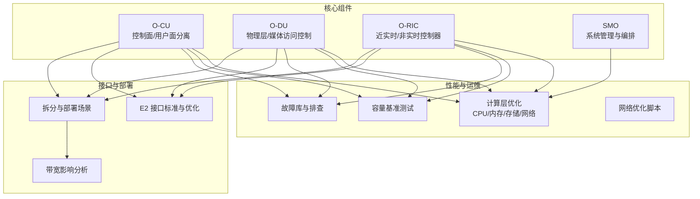
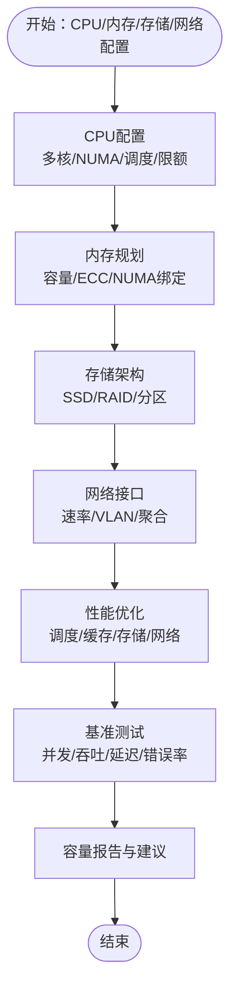
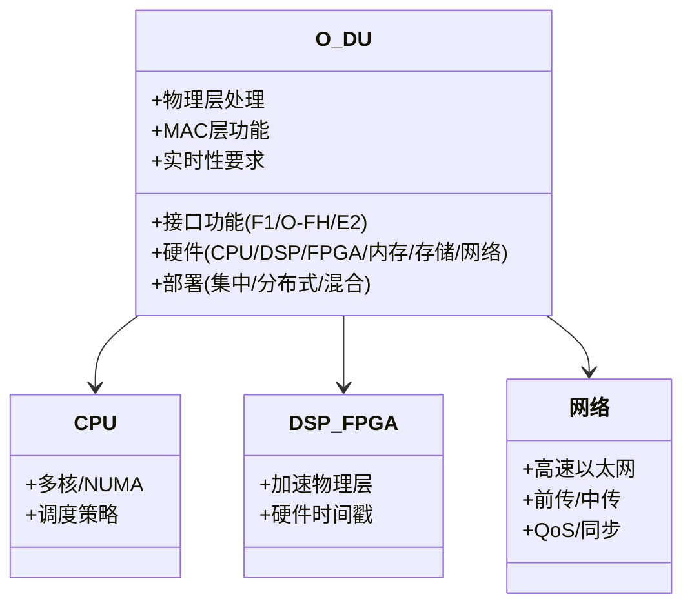
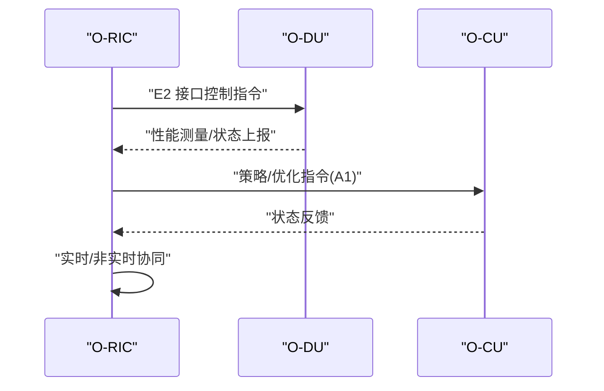
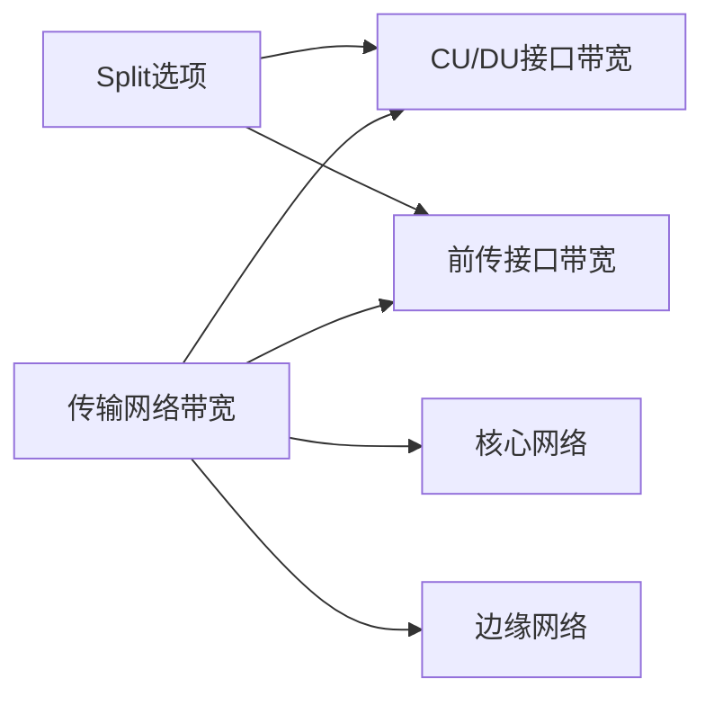
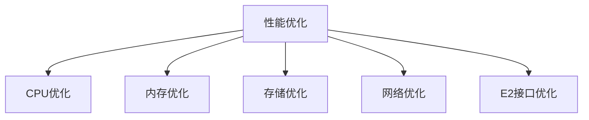
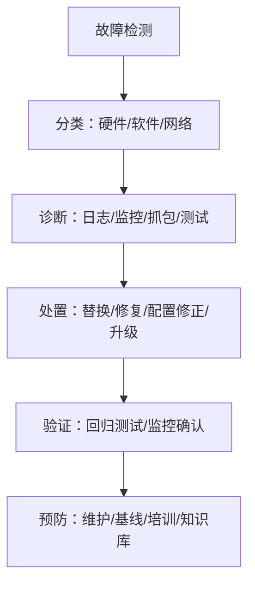

# 服务器规格要求

<cite>
**本文引用的文件**
- [O-CU.md](file://02-core-components/o-cu.md)
- [O-DU.md](file://02-core-components/o-du.md)
- [O-RIC.md](file://02-core-components/o-ric.md)
- [O-RAN 计算层优化.md](file://26-performance-optimization/compute-optimization/o-ran-compute-optimization.md)
- [O-RAN 故障案例库.md](file://27-troubleshooting-diagnosis/fault-library/o-ran-fault-case-database.md)
- [O-RAN 容量规划框架.md](file://14-operations-management/capacity-planning/capacity-planning-framework.md)
- [O-RAN 容量规划框架（中文）.md](file://14-operations-management/capacity-planning/capacity-planning-framework-zh.md)
- [性能优化框架.md](file://14-operations-management/performance-optimization/performance-optimization-framework.md)
- [E2 接口.md](file://03-interface-standards/e2-interface.md)
- [拆分与部署场景.md](file://04-disaggregation-options/deployment-scenarios.md)
- [拆分与性能影响.md](file://04-disaggregation-options/performance-impact.md)
- [O-RAN 软件故障排查.md](file://27-troubleshooting-diagnosis/software-faults/o-ran-software-troubleshooting.md)
</cite>

## 目录
1. [简介](#简介)
2. [项目结构](#项目结构)
3. [核心组件](#核心组件)
4. [架构总览](#架构总览)
5. [详细组件分析](#详细组件分析)
6. [依赖关系分析](#依赖关系分析)
7. [性能考量](#性能考量)
8. [故障排查指南](#故障排查指南)
9. [结论](#结论)
10. [附录](#附录)

## 简介
本文件面向O-RAN服务器规格要求，围绕CU服务器（O-CU）、DU服务器（O-DU）、RIC服务器（O-RIC）与SMO服务器的硬件与系统配置、性能与可靠性指标、加速与网络接口、以及容量与基准测试方法，提供系统化、可落地的技术规范指导。内容来源于仓库中的核心组件文档、性能优化与故障排查资料，并结合接口标准与部署场景分析，形成面向工程实践的综合指南。

## 项目结构
本仓库以主题域组织O-RAN相关知识，涵盖架构演进、核心组件、接口标准、解耦与部署、云原生与运维、性能优化、故障诊断与容量规划等模块。与本规范直接相关的知识来源主要集中在：
- 核心组件：O-CU、O-DU、O-RIC 的功能与硬件/软件架构
- 性能优化：CPU/内存/存储/网络优化与内核参数调优
- 故障库：硬件、软件与网络层面的典型故障模式与处置
- 容量规划：基准测试框架与容量评估方法
- 接口标准：E2接口的性能优化与运维监控
- 部署场景：不同Split下的带宽与延迟要求



**图表来源**
- [O-CU.md](file://02-core-components/o-cu.md#L62-L117)
- [O-DU.md](file://02-core-components/o-du.md#L87-L147)
- [O-RIC.md](file://02-core-components/o-ric.md#L73-L133)
- [O-RAN 计算层优化.md](file://26-performance-optimization/compute-optimization/o-ran-compute-optimization.md#L6-L59)
- [O-RAN 容量规划框架.md](file://14-operations-management/capacity-planning/capacity-planning-framework.md#L361-L503)
- [O-RAN 故障案例库.md](file://27-troubleshooting-diagnosis/fault-library/o-ran-fault-case-database.md#L1-L225)
- [性能优化框架.md](file://14-operations-management/performance-optimization/performance-optimization-framework.md#L6-L101)
- [E2 接口.md](file://03-interface-standards/e2-interface.md#L131-L168)
- [拆分与部署场景.md](file://04-disaggregation-options/deployment-scenarios.md#L296-L344)
- [拆分与性能影响.md](file://04-disaggregation-options/performance-impact.md#L76-L117)

**章节来源**
- [O-CU.md](file://02-core-components/o-cu.md#L62-L117)
- [O-DU.md](file://02-core-components/o-du.md#L87-L147)
- [O-RIC.md](file://02-core-components/o-ric.md#L73-L133)

## 核心组件
- O-CU（集中式单元）
  - 控制面（CU-CP）：RRC、NG接口、F1接口控制面、E1接口控制面
  - 用户面（CU-UP）：PDCP/SDAP、用户面处理、负载均衡、统计计费
  - 硬件：通用服务器、多核CPU、足够内存、高速网络接口；可容器化部署
- O-DU（分布式单元）
  - 物理层/媒体访问控制：传输信道编码、调制映射、层映射/预编码、参考信号生成、上行接收/解调、CSI/RSRP/RSRQ/SINR/TA测量
  - 实时性：物理层/MAC层延迟预算、端到端延迟、时间同步精度、可用性与故障恢复
  - 硬件：多核CPU、DSP/FPGA加速、高速缓存/内存/非易失性存储、高速以太网/同步/管理接口
- O-RIC（RAN智能控制器）
  - Near-RT RIC：毫秒级控制闭环、xApps运行环境、E2接口服务、实时数据处理
  - Non-RT RIC：秒级到分钟级策略管理、rApps运行环境、A1接口服务、数据分析与建模
  - 部署：集中/分布式/混合部署

**章节来源**
- [O-CU.md](file://02-core-components/o-cu.md#L3-L121)
- [O-DU.md](file://02-core-components/o-du.md#L3-L86)
- [O-RIC.md](file://02-core-components/o-ric.md#L3-L72)

## 架构总览
O-CU/O-DU/O-RIC构成O-RAN云化架构的核心，通过接口（NG/F1/E1/E2）实现控制面与用户面分离、近实时与非实时协同。部署形态可按业务需求选择集中式/分布式/混合部署，兼顾性能与可运维性。

```mermaid
graph TB
RAN["无线接入网"]
DU["O-DU<br/>物理层/媒体访问控制"]
CU["O-CU<br/>CU-CP/CU-UP"]
RIC["O-RIC<br/>Near-RT/Non-RT"]
RAN <- --> DU
DU --> CU
CU --> RIC
RIC --> DU
```

**图表来源**
- [O-DU.md](file://02-core-components/o-du.md#L68-L86)
- [O-CU.md](file://02-core-components/o-cu.md#L101-L117)
- [O-RIC.md](file://02-core-components/o-ric.md#L59-L72)

## 详细组件分析

### CU服务器（O-CU）规格与配置
- CPU配置
  - 多核CPU，支持虚拟化与并行处理；建议NUMA感知调度与CPU亲和性绑定，保障控制面/用户面进程隔离与低抖动
  - 结合容器编排（Kubernetes）设置CPU requests/limits与cgroups，确保Guaranteed QoS
- 内存规划
  - 容量按并发UE数、信令负载与上下文存储需求估算；建议启用ECC内存，提升可靠性
  - NUMA本地内存分配优先，减少跨节点访问带来的延迟与带宽损耗
- 存储架构
  - SSD启动盘与系统盘，提升启动与日志写入性能；可选RAID 1（镜像）保障系统盘可靠性
  - 用户面缓存与日志目录挂载独立分区，避免I/O争用
- 网络接口
  - 10G/25G以太网接口，满足NG/F1/E1接口带宽与延迟要求；支持链路聚合与VLAN划分
- 实时性与可靠性
  - 控制面与用户面分离部署，降低耦合；通过容器化与微服务架构提升弹性与可维护性
- 性能优化与基准测试
  - CPU调度策略（SCHED_FIFO/RR/OTHER）、NUMA亲和、容器级CPU限额与优先级
  - 内存缓存优化（L1/L2/TLB/大页）、NUMA内存绑定、垃圾回收与内存池
  - 存储I/O优化（文件系统参数、I/O调度器、WAL/Checkpoint调优）
  - 网络中断合并/队列/RSS/Offload与内核参数调优
  - 基准测试：并发用户/吞吐量/延迟/错误率评估，生成容量报告与扩展建议



**图表来源**
- [O-CU.md](file://02-core-components/o-cu.md#L124-L196)
- [O-RAN 计算层优化.md](file://26-performance-optimization/compute-optimization/o-ran-compute-optimization.md#L6-L112)
- [O-RAN 容量规划框架.md](file://14-operations-management/capacity-planning/capacity-planning-framework.md#L361-L503)

**章节来源**
- [O-CU.md](file://02-core-components/o-cu.md#L124-L196)
- [O-RAN 计算层优化.md](file://26-performance-optimization/compute-optimization/o-ran-compute-optimization.md#L6-L112)
- [O-RAN 容量规划框架.md](file://14-operations-management/capacity-planning/capacity-planning-framework.md#L361-L503)

### DU服务器（O-DU）规格与配置
- 实时处理能力
  - 物理层/MAC层延迟预算与端到端延迟目标；时间同步精度（PTP v2），可用性与故障恢复时间
- 加速卡与NUMA
  - DSP/FPGA加速物理层处理；CPU多核并行与NUMA亲和绑定；内存带宽与缓存优化
- 网络接口
  - 高速以太网（25G/100G）；前传接口（F1/O-FH/E2）带宽与延迟要求；网络拓扑与QoS
- 部署形态
  - 集中式/分布式/混合部署，边缘计算场景下的低延迟与本地化协同



**图表来源**
- [O-DU.md](file://02-core-components/o-du.md#L87-L147)
- [O-DU.md](file://02-core-components/o-du.md#L150-L223)

**章节来源**
- [O-DU.md](file://02-core-components/o-du.md#L51-L86)
- [O-DU.md](file://02-core-components/o-du.md#L150-L223)

### RIC服务器（O-RIC）规格与配置
- Near-RT RIC
  - 低延迟控制闭环（<10ms），E2接口服务与消息处理，xApps运行环境与生命周期管理
- Non-RT RIC
  - 策略管理（<1s），A1接口服务，数据分析与机器学习，rApps运行环境
- 硬件与加速
  - Near-RT：多核CPU、足够内存、高速网络；Non-RT：大内存/大容量存储、可选GPU/FPGA加速
- 部署与网络
  - 集中/分布式/混合部署；传输网络带宽、延迟、QoS与安全规划



**图表来源**
- [O-RIC.md](file://02-core-components/o-ric.md#L7-L72)
- [O-RIC.md](file://02-core-components/o-ric.md#L134-L192)

**章节来源**
- [O-RIC.md](file://02-core-components/o-ric.md#L7-L72)
- [O-RIC.md](file://02-core-components/o-ric.md#L134-L192)

### SMO服务器（系统管理与编排）规格与配置
- 管理功能与API能力
  - API服务能力、并发连接数、服务编排与治理（容器/微服务）
- 数据库性能
  - OLTP/OLAP负载特征、索引策略、连接池与查询优化、高可用（主从/集群/备份）
- 高可用与扩展
  - 集群架构、故障切换、自动扩缩容与灾备

注：本节为概念性指导，具体实现需结合实际业务与数据库/中间件选型进行细化。

## 依赖关系分析
- 接口与带宽
  - CU/DU接口带宽随Split选项变化（从Option 2的低到Option 7的极高），前传接口带宽与压缩率因技术而异
  - 传输网络带宽规划应考虑峰值与平均带宽、业务类型（eMBB/URLLC/mMTC）与传输技术（光纤/微波/毫米波）
- 部署场景
  - 核心/边缘/核心+边缘协同，强调低延迟、本地化、集中管理与可扩展性



**图表来源**
- [拆分与性能影响.md](file://04-disaggregation-options/performance-impact.md#L76-L117)
- [拆分与部署场景.md](file://04-disaggregation-options/deployment-scenarios.md#L296-L344)

**章节来源**
- [拆分与性能影响.md](file://04-disaggregation-options/performance-impact.md#L76-L117)
- [拆分与部署场景.md](file://04-disaggregation-options/deployment-scenarios.md#L296-L344)

## 性能考量
- CPU/内存/存储/网络四维优化
  - CPU：实时调度策略、NUMA感知、容器级CPU限额与优先级
  - 内存：缓存优化（L1/L2/TLB/大页）、NUMA内存绑定、垃圾回收与内存池
  - 存储：文件系统参数、I/O调度器、WAL/Checkpoint调优、RAID与HBA优化
  - 网络：中断合并/队列/RSS/Offload、内核参数、NUMA亲和绑定、流量控制与优先级
- E2接口性能优化
  - SCTP参数优化、多流配置、多路径、消息压缩/批量处理、缓存与网络加速（DPDK等）



**图表来源**
- [O-RAN 计算层优化.md](file://26-performance-optimization/compute-optimization/o-ran-compute-optimization.md#L6-L112)
- [性能优化框架.md](file://14-operations-management/performance-optimization/performance-optimization-framework.md#L6-L101)
- [E2 接口.md](file://03-interface-standards/e2-interface.md#L131-L168)

**章节来源**
- [O-RAN 计算层优化.md](file://26-performance-optimization/compute-optimization/o-ran-compute-optimization.md#L6-L112)
- [性能优化框架.md](file://14-operations-management/performance-optimization/performance-optimization-framework.md#L6-L101)
- [E2 接口.md](file://03-interface-standards/e2-interface.md#L131-L168)

## 故障排查指南
- 硬件故障
  - CPU热节流、内存模块故障、电源问题；存储硬盘退化/SSD磨损/RAID异常；网卡/线缆/交换机问题
- 软件故障
  - 内核崩溃、文件系统损坏、进程管理问题；数据库服务/Web服务/容器编排故障；认证/防火墙/安全策略问题
- 网络故障
  - 物理层问题（线缆/硬件/环境）、逻辑配置问题（IP冲突/路由/DNS）、性能问题（拥塞/延迟/抖动/丢包）
- 预防性维护
  - 硬件健康巡检、环境监控、组件生命周期管理；软件配置审计、补丁与更新管理、性能基线维护



**图表来源**
- [O-RAN 故障案例库.md](file://27-troubleshooting-diagnosis/fault-library/o-ran-fault-case-database.md#L1-L225)
- [O-RAN 软件故障排查.md](file://27-troubleshooting-diagnosis/software-faults/o-ran-software-troubleshooting.md#L188-L278)

**章节来源**
- [O-RAN 故障案例库.md](file://27-troubleshooting-diagnosis/fault-library/o-ran-fault-case-database.md#L1-L225)
- [O-RAN 软件故障排查.md](file://27-troubleshooting-diagnosis/software-faults/o-ran-software-troubleshooting.md#L188-L278)

## 结论
面向O-RAN的服务器规格要求应以“实时性、可靠性、可扩展性”为核心目标，结合各组件的职责边界与接口约束，制定CPU/内存/存储/网络的系统化配置与优化策略。通过容量基准测试与持续性能优化，配合完善的故障排查与预防性维护体系，可有效支撑CU/DU/RIC/SMO在多样化部署场景下的稳定运行与业务发展。

## 附录
- 基准测试方法（容量规划）
  - 并发用户扫描、吞吐量/延迟/错误率采集、生成容量报告与扩展建议
- 网络优化脚本
  - 网卡关闭不必要的卸载、设置Jumbo帧、中断合并、流量控制与优先级队列、NUMA亲和绑定
- 接口性能优化
  - E2接口SCTP参数、多流/多路径、消息压缩/批量处理、网络加速与负载均衡

**章节来源**
- [O-RAN 容量规划框架.md](file://14-operations-management/capacity-planning/capacity-planning-framework.md#L361-L503)
- [性能优化框架.md](file://14-operations-management/performance-optimization/performance-optimization-framework.md#L6-L101)
- [E2 接口.md](file://03-interface-standards/e2-interface.md#L131-L168)