# 电源与冷却系统

<cite>
**本文引用的文件**   
- [O-RAN 环境可持续性框架](file://24-sustainable-development/environmental-protection/o-ran-environmental-sustainability.md)
- [O-DU 技术架构与部署](file://02-core-components/o-du.md)
- [O-RAN 警报策略框架](file://28-monitoring-alerting/alert-strategy/o-ran-alert-strategy.md)
- [O-RAN 诊断工具与仪表板](file://27-troubleshooting-diagnosis/diagnostic-tools/o-ran-diagnostic-instrumentation.md)
- [O-RAN 国际化与本地化策略](file://23-international-deployment/localization-adaptation/o-ran-localization-strategies.md)
- [O-RAN 能源与公用事业案例研究](file://21-case-studies/industry-applications/vertical-industry-o-ran-cases.md)
- [O-RAN 环保与碳足迹专利](file://comprehensive-oran-patent-table.md)
- [O-RAN 运维与容量规划](file://14-operations-management/capacity-planning/capacity-planning-framework-zh.md)
- [O-RAN 网络性能优化](file://26-performance-optimization/network-optimization/network-performance-tuning.md)
</cite>

## 目录
1. [引言](#引言)
2. [项目结构](#项目结构)
3. [核心组件](#核心组件)
4. [架构总览](#架构总览)
5. [详细组件分析](#详细组件分析)
6. [依赖关系分析](#依赖关系分析)
7. [性能考虑](#性能考虑)
8. [故障排查与运维指南](#故障排查与运维指南)
9. [结论](#结论)
10. [附录](#附录)

## 引言
本技术指导面向O-RAN数据中心的电源与冷却系统，围绕以下目标展开：数据中心电源设计原则（PDU配置、电源分配单元、功率密度计算）、UPS配置方案（电池容量计算、切换时间、负载百分比）、发电机备用电源（启动时间、燃料储备、自动切换机制）；冷却系统规划（制冷量计算、气流组织、热点管理）、空调配置（精密空调、行级空调、风量调节）与液冷技术应用（直接液体冷却、间接液冷、热管技术）；能耗优化（PUE目标设定、节能策略、动态功率管理）、绿色数据中心设计（可再生能源利用、能效认证、碳足迹计算）与可持续发展（环保材料、回收利用、生命周期评估）；电源冗余设计（N+1、2N配置、自动切换）、冷却效率优化（风阻降低、热岛效应缓解、自然冷却）与环境监控（温湿度监测、能耗统计、故障预警）。

## 项目结构
本仓库提供了与电源、冷却、运维、可持续性相关的权威文档，涵盖从系统架构到运维策略、从国际适配到绿色创新的全栈视角。与电源与冷却系统直接相关的关键文档包括：
- 环境可持续性框架：包含智能电源管理、可再生能源集成、碳足迹监测、循环经济发展等
- O-DU 技术架构：涉及硬件选型、同步与散热、部署与运维
- 警报策略框架：定义了告警分类、优先级、路由与生命周期管理
- 诊断工具与仪表板：提供硬件诊断、功耗与温度监控、安全检查
- 国际化与本地化策略：覆盖电压/频率差异、备用电源集成、气候与结构要求
- 能源与公用事业案例研究：展示可再生能源与智能电网集成
- 能源与碳足迹专利：体现可再生能源与碳监测的技术创新方向
- 运维与容量规划：资源利用分析、成本优化与容量预测
- 网络性能优化：KPI与优化评估方法

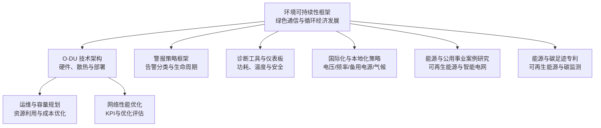

**图表来源**
- [O-RAN 环境可持续性框架](file://24-sustainable-development/environmental-protection/o-ran-environmental-sustainability.md#L1-L285)
- [O-DU 技术架构与部署](file://02-core-components/o-du.md#L1-L348)
- [O-RAN 警报策略框架](file://28-monitoring-alerting/alert-strategy/o-ran-alert-strategy.md#L1-L247)
- [O-RAN 诊断工具与仪表板](file://27-troubleshooting-diagnosis/diagnostic-tools/o-ran-diagnostic-instrumentation.md#L1-L64)
- [O-RAN 国际化与本地化策略](file://23-international-deployment/localization-adaptation/o-ran-localization-strategies.md#L52-L94)
- [O-RAN 能源与公用事业案例研究](file://21-case-studies/industry-applications/vertical-industry-o-ran-cases.md#L237-L278)
- [O-RAN 环保与碳足迹专利](file://comprehensive-oran-patent-table.md#L125-L136)
- [O-RAN 运维与容量规划](file://14-operations-management/capacity-planning/capacity-planning-framework-zh.md#L268-L359)
- [O-RAN 网络性能优化](file://26-performance-optimization/network-optimization/network-performance-tuning.md#L84-L98)

**章节来源**
- [O-RAN 环境可持续性框架](file://24-sustainable-development/environmental-protection/o-ran-environmental-sustainability.md#L1-L285)
- [O-DU 技术架构与部署](file://02-core-components/o-du.md#L1-L348)

## 核心组件
- 智能电源管理系统：动态睡眠机制、设备级节能、网络级协调
- 可再生能源集成：太阳能、小型风能、储能管理
- 碳足迹监测与目标：实时排放跟踪、科学碳目标、碳中和路径
- 硬件低功耗设计：高效处理单元、热管理创新、模块化设计
- 循环经济与回收：全生命周期资产管理、零废运营、材料回收率
- O-DU 硬件与散热：冗余电源、高效散热系统、部署与运维
- 诊断与监控：硬件诊断套件、功耗与温度监测、安全检查
- 告警与响应：分类、优先级、路由与生命周期管理
- 国际化适配：电压/频率、备用电源、气候与结构要求

**章节来源**
- [O-RAN 环境可持续性框架](file://24-sustainable-development/environmental-protection/o-ran-environmental-sustainability.md#L8-L75)
- [O-DU 技术架构与部署](file://02-core-components/o-du.md#L107-L111)
- [O-RAN 诊断工具与仪表板](file://27-troubleshooting-diagnosis/diagnostic-tools/o-ran-diagnostic-instrumentation.md#L10-L64)
- [O-RAN 警报策略框架](file://28-monitoring-alerting/alert-strategy/o-ran-alert-strategy.md#L8-L54)
- [O-RAN 国际化与本地化策略](file://23-international-deployment/localization-adaptation/o-ran-localization-strategies.md#L56-L76)

## 架构总览
电源与冷却系统在O-RAN数据中心中的作用可抽象为三层：
- 电源层：PDU与电源分配、UPS与备用电源、可再生能源与储能、动态功率管理
- 冷却层：制冷量计算与气流组织、精密空调与行级空调、液冷技术、自然冷却
- 监控层：环境监控（温湿度、能耗）、告警与响应、运维与容量规划

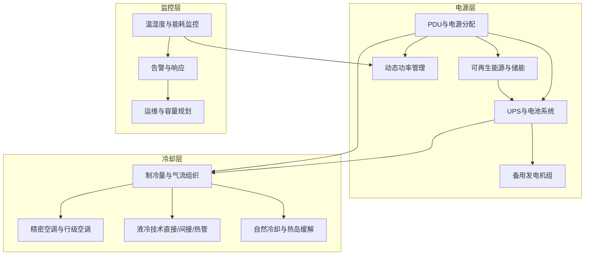

[此图为概念性架构示意，不对应具体源文件，故无“图表来源”标注]

## 详细组件分析

### 电源设计原则与PDU配置
- PDU配置与电源分配单元
  - 负载均衡与冗余：采用N+1或2N配置，确保单点故障不影响整体供电
  - 功率密度计算：结合设备功耗、PDU额定容量与机柜空间，确定每机位功率密度
  - 电源质量：关注电压/频率波动、谐波与功率因数，保障设备稳定运行
- 动态功率管理
  - 基于业务负载的动态休眠与唤醒，降低非活跃时段能耗
  - 网络级协调：跨站点负载均衡与资源调度，提升整体能效

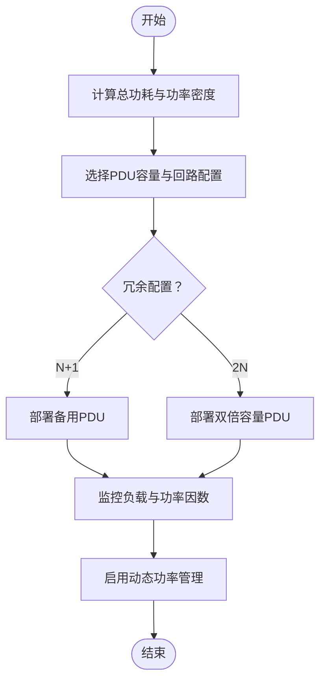

[此图为概念性流程示意，不对应具体源文件，故无“图表来源”标注]

**章节来源**
- [O-RAN 环境可持续性框架](file://24-sustainable-development/environmental-protection/o-ran-environmental-sustainability.md#L10-L24)
- [O-DU 技术架构与部署](file://02-core-components/o-du.md#L107-L111)

### UPS配置方案与电池容量
- 电池容量计算
  - 明确后备供电时长（如15/30/60分钟）与负载百分比
  - 考虑电池衰减、环境温度与放电效率修正系数
- 切换时间与自动切换
  - ATS/STS切换时间应小于毫秒级，确保设备无感切换
  - UPS旁路与维修旁路设计，保障维护与故障隔离
- 负载百分比与运行效率
  - 电池在最佳负载区间（40%-80%）运行，延长寿命并提升效率

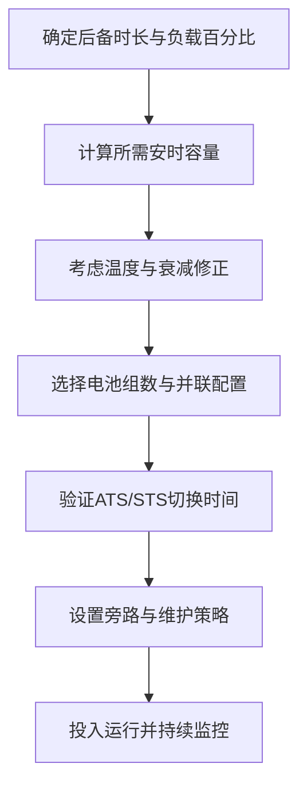

[此图为概念性流程示意，不对应具体源文件，故无“图表来源”标注]

**章节来源**
- [O-RAN 环境可持续性框架](file://24-sustainable-development/environmental-protection/o-ran-environmental-sustainability.md#L24-L37)
- [O-RAN 国际化与本地化策略](file://23-international-deployment/localization-adaptation/o-ran-localization-strategies.md#L62-L66)

### 发电机备用电源（启动时间、燃料储备、自动切换）
- 启动时间
  - 冷启动至满载供电时间应满足关键业务窗口
  - 预热与自检程序纳入自动切换逻辑
- 燃料储备
  - 燃油/燃气储备天数应覆盖极端天气与供应链中断
  - 自动补给与远程监控机制
- 自动切换机制
  - 与ATS/STS联动，实现市电→UPS→发电机组无缝切换
  - 切换条件与优先级策略（如优先使用可再生能源）

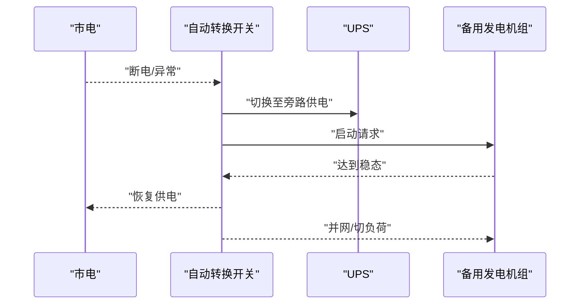

[此图为概念性序列示意，不对应具体源文件，故无“图表来源”标注]

**章节来源**
- [O-RAN 国际化与本地化策略](file://23-international-deployment/localization-adaptation/o-ran-localization-strategies.md#L62-L66)

### 冷却系统规划（制冷量、气流组织、热点管理）
- 制冷量计算
  - 依据设备发热量、机房得热与新风需求，计算总制冷需求
  - 考虑冗余与峰值波动，预留安全系数
- 气流组织
  - 采用冷通道/热通道隔离，减少冷量短路
  - 风量与静压匹配，避免漏风与过压
- 热点管理
  - 温度与风量监测，识别并干预局部热点
  - 动态风量调节与风扇转速控制

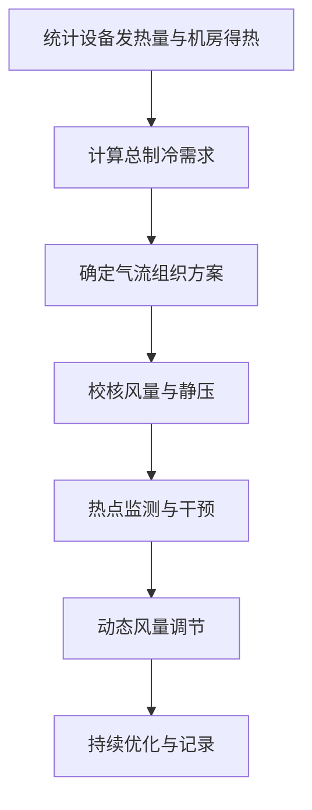

[此图为概念性流程示意，不对应具体源文件，故无“图表来源”标注]

**章节来源**
- [O-RAN 环境可持续性框架](file://24-sustainable-development/environmental-protection/o-ran-environmental-sustainability.md#L60-L64)

### 空调配置（精密空调、行级空调、风量调节）
- 精密空调
  - 恒温恒湿控制，适用于高密度机房与严格环境要求
- 行级空调
  - 靠近设备布置，减少冷量损失，提升能效
- 风量调节
  - 基于负载与温度反馈，变频/变风量控制
  - 结合自然冷却策略，在适宜条件下引入室外新风

[此图为概念性架构示意，不对应具体源文件，故无“图表来源”标注]

**章节来源**
- [O-RAN 环境可持续性框架](file://24-sustainable-development/environmental-protection/o-ran-environmental-sustainability.md#L60-L64)

### 液冷技术应用（直接液体冷却、间接液冷、热管技术）
- 直接液体冷却
  - 将冷却介质直接接触发热器件，传热效率高
- 间接液冷
  - 通过冷板/热管将热量传递至循环冷却水，降低电气风险
- 热管技术
  - 高效导热与均温，适合高热流密度场景

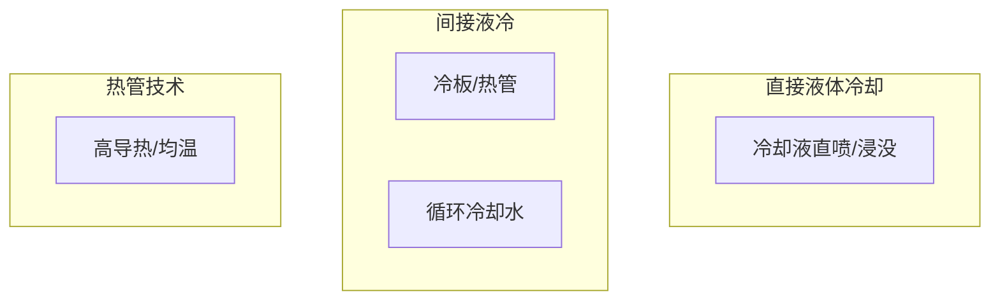

[此图为概念性架构示意，不对应具体源文件，故无“图表来源”标注]

**章节来源**
- [O-RAN 环境可持续性框架](file://24-sustainable-development/environmental-protection/o-ran-environmental-sustainability.md#L60-L64)

### 能耗优化（PUE目标、节能策略、动态功率管理）
- PUE目标设定
  - 依据机房规模与设备类型，设定阶段性PUE目标
- 节能策略
  - 采用高效IT设备、优化气流组织、自然冷却与可再生能源
- 动态功率管理
  - 基于业务负载与电价/碳价信号，动态启停与调度

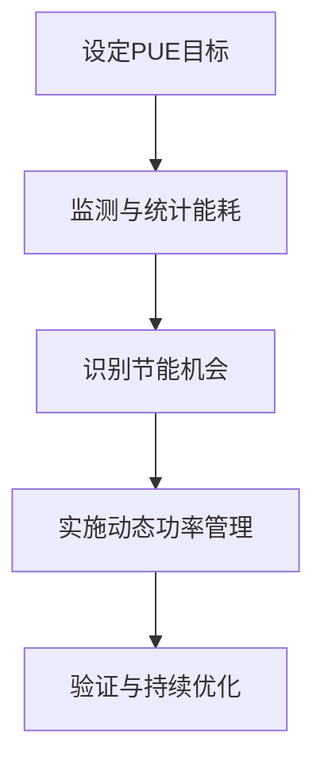

[此图为概念性流程示意，不对应具体源文件，故无“图表来源”标注]

**章节来源**
- [O-RAN 环境可持续性框架](file://24-sustainable-development/environmental-protection/o-ran-environmental-sustainability.md#L158-L163)
- [O-RAN 环境可持续性框架](file://24-sustainable-development/environmental-protection/o-ran-environmental-sustainability.md#L10-L24)

### 绿色数据中心设计（可再生能源、能效认证、碳足迹）
- 可再生能源利用
  - 太阳能、小型风能与储能系统集成，提升可再生能源占比
- 能效认证
  - 依据国际标准（如ISO 14001、ITU-T L.1420）开展认证
- 碳足迹计算与管理
  - 建立全生命周期碳核算与减排目标，实施碳中和路径

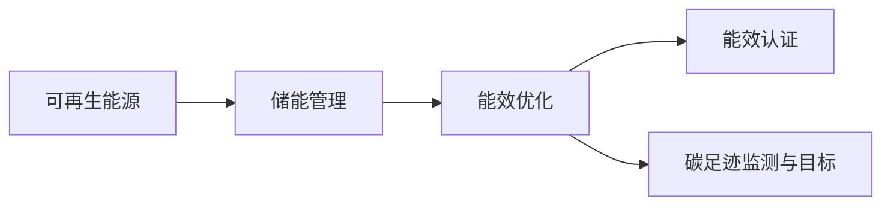

[此图为概念性架构示意，不对应具体源文件，故无“图表来源”标注]

**章节来源**
- [O-RAN 环境可持续性框架](file://24-sustainable-development/environmental-protection/o-ran-environmental-sustainability.md#L24-L49)
- [O-RAN 环境可持续性框架](file://24-sustainable-development/environmental-protection/o-ran-environmental-sustainability.md#L183-L231)

### 可持续发展（环保材料、回收利用、生命周期评估）
- 环保材料
  - 使用可回收与低危害材料，减少生产与处置环境影响
- 回收利用
  - 建立设备全生命周期资产管理与回收体系，提升材料回收率
- 生命周期评估（LCA）
  - 从原材料提取到废弃处置的全链路环境影响评估

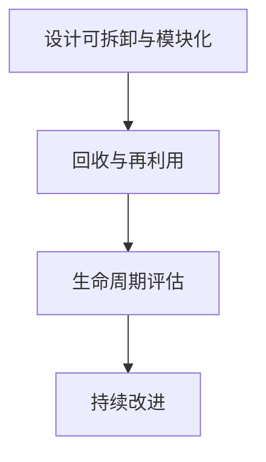

[此图为概念性架构示意，不对应具体源文件，故无“图表来源”标注]

**章节来源**
- [O-RAN 环境可持续性框架](file://24-sustainable-development/environmental-protection/o-ran-environmental-sustainability.md#L81-L102)
- [O-RAN 环境可持续性框架](file://24-sustainable-development/environmental-protection/o-ran-environmental-sustainability.md#L131-L154)

### 电源冗余设计（N+1、2N、自动切换）
- N+1冗余：单台设备故障不影响业务
- 2N冗余：整套系统冗余，支持维护与扩容
- 自动切换：ATS/STS与UPS协同，确保无感切换

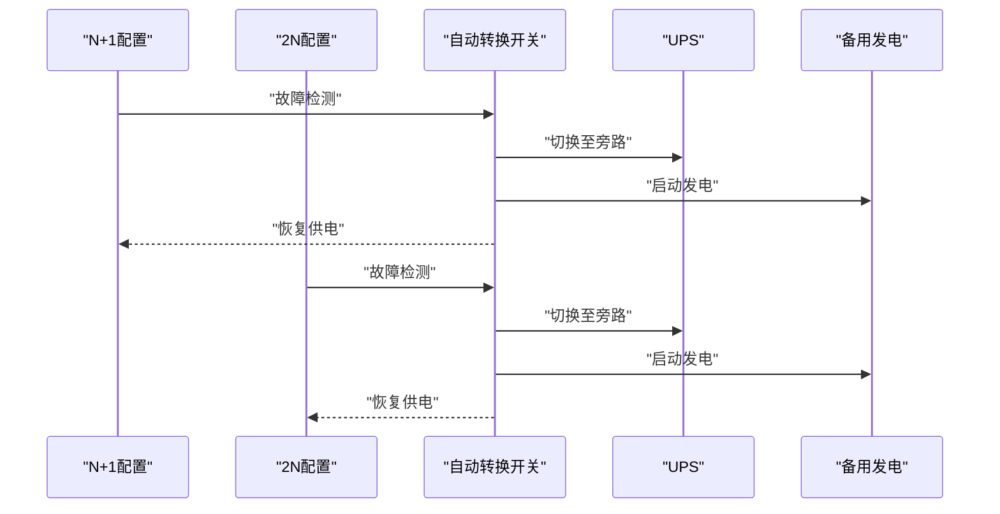

[此图为概念性序列示意，不对应具体源文件，故无“图表来源”标注]

**章节来源**
- [O-RAN 环境可持续性框架](file://24-sustainable-development/environmental-protection/o-ran-environmental-sustainability.md#L10-L24)
- [O-RAN 国际化与本地化策略](file://23-international-deployment/localization-adaptation/o-ran-localization-strategies.md#L62-L66)

### 冷却效率优化（风阻降低、热岛缓解、自然冷却）
- 风阻降低
  - 优化风道与隔板，减少局部阻力与漏风
- 热岛缓解
  - 合理布局与遮阳，降低外部热辐射与热岛效应
- 自然冷却
  - 在适宜气候条件下引入新风，减少机械制冷需求

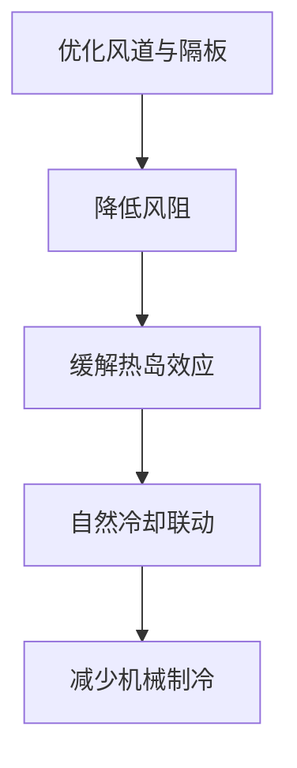

[此图为概念性流程示意，不对应具体源文件，故无“图表来源”标注]

**章节来源**
- [O-RAN 环境可持续性框架](file://24-sustainable-development/environmental-protection/o-ran-environmental-sustainability.md#L60-L64)

### 环境监控（温湿度、能耗、故障预警）
- 温湿度监测
  - 关键节点部署传感器，实现可视化与阈值告警
- 能耗统计
  - 分区域/分设备能耗计量，支撑PUE与成本分析
- 故障预警
  - 基于历史与实时数据，构建异常检测与预测性告警

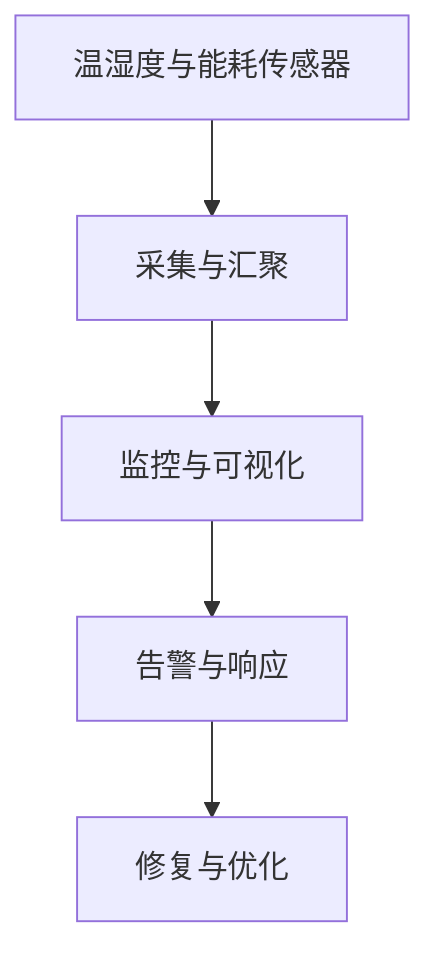

[此图为概念性架构示意，不对应具体源文件，故无“图表来源”标注]

**章节来源**
- [O-RAN 诊断工具与仪表板](file://27-troubleshooting-diagnosis/diagnostic-tools/o-ran-diagnostic-instrumentation.md#L48-L64)
- [O-RAN 警报策略框架](file://28-monitoring-alerting/alert-strategy/o-ran-alert-strategy.md#L8-L54)

## 依赖关系分析
- 电源层与冷却层相互依赖：冷却系统效率直接影响IT设备功耗与发热量，进而影响PUE与UPS/发电机组负载
- 监控层贯穿三层：为电源与冷却系统的优化提供数据基础，并驱动动态功率管理与自然冷却策略
- 国际化适配影响电源与冷却的物理实现：电压/频率差异决定PDU与UPS输入规格，气候条件决定冷却策略与自然冷却潜力

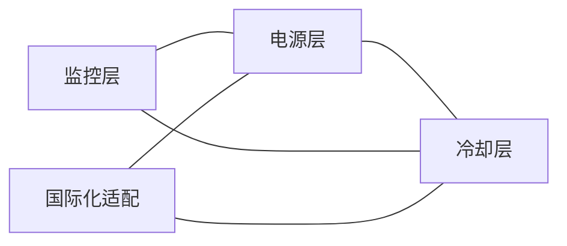

[此图为概念性依赖示意，不对应具体源文件，故无“图表来源”标注]

**章节来源**
- [O-RAN 国际化与本地化策略](file://23-international-deployment/localization-adaptation/o-ran-localization-strategies.md#L56-L76)

## 性能考虑
- PUE目标与能效指标：结合能耗统计与设备效率，设定阶段性目标并持续优化
- KPI与优化评估：建立关键KPI（如温度、湿度、功耗、切换时间）并进行前后对比与趋势分析
- 资源利用与成本优化：通过容量规划与资源优化，降低闲置与浪费，提升ROI

**章节来源**
- [O-RAN 环境可持续性框架](file://24-sustainable-development/environmental-protection/o-ran-environmental-sustainability.md#L158-L179)
- [O-RAN 网络性能优化](file://26-performance-optimization/network-optimization/network-performance-tuning.md#L84-L98)
- [O-RAN 运维与容量规划](file://14-operations-management/capacity-planning/capacity-planning-framework-zh.md#L268-L359)

## 故障排查与运维指南
- 硬件诊断与功耗监测
  - CPU/内存/存储/电源与外设的专项测试工具与流程
  - 温度、风扇、功耗与物理安全的持续监测
- 告警策略与响应
  - 分类、优先级、路由与生命周期管理，确保快速响应与闭环
- 运维与容量规划
  - 资源利用分析、成本优化与容量预测，支撑扩容与节能

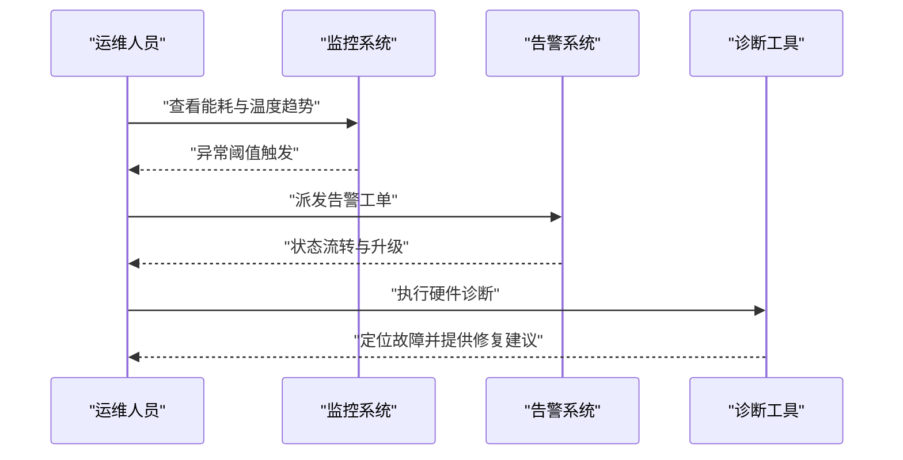

[此图为概念性流程示意，不对应具体源文件，故无“图表来源”标注]

**章节来源**
- [O-RAN 诊断工具与仪表板](file://27-troubleshooting-diagnosis/diagnostic-tools/o-ran-diagnostic-instrumentation.md#L10-L64)
- [O-RAN 警报策略框架](file://28-monitoring-alerting/alert-strategy/o-ran-alert-strategy.md#L113-L171)
- [O-RAN 运维与容量规划](file://14-operations-management/capacity-planning/capacity-planning-framework-zh.md#L268-L359)

## 结论
O-RAN数据中心的电源与冷却系统应以“绿色、高效、可靠、可扩展”为核心目标，结合智能电源管理、可再生能源与储能、自然冷却与液冷技术、完善的监控与告警体系，实现从设计到运维的全生命周期优化。通过国际适配与循环经济实践，进一步降低碳足迹与全生命周期成本，支撑O-RAN技术的可持续发展。

## 附录
- 可再生能源与碳足迹专利方向：涵盖O-RAN基础设施与可再生能源集成、碳足迹监测与管理等
- 能源与公用事业案例：展示可再生能源与智能电网的集成实践，为数据中心绿色化提供参考

**章节来源**
- [O-RAN 环保与碳足迹专利](file://comprehensive-oran-patent-table.md#L125-L136)
- [O-RAN 能源与公用事业案例研究](file://21-case-studies/industry-applications/vertical-industry-o-ran-cases.md#L237-L278)