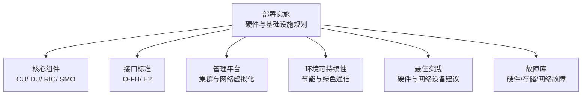
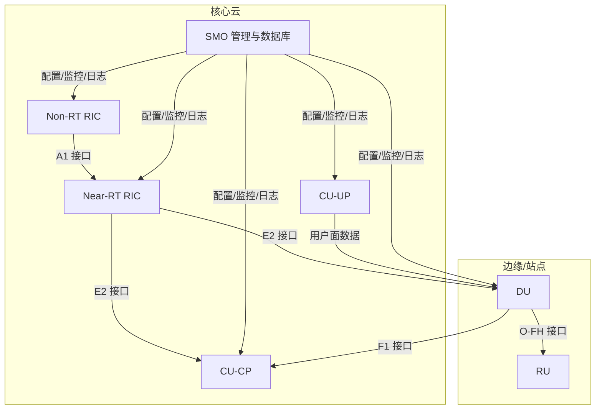
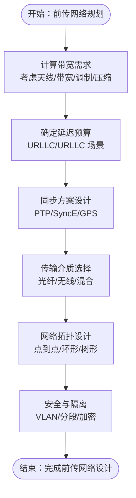
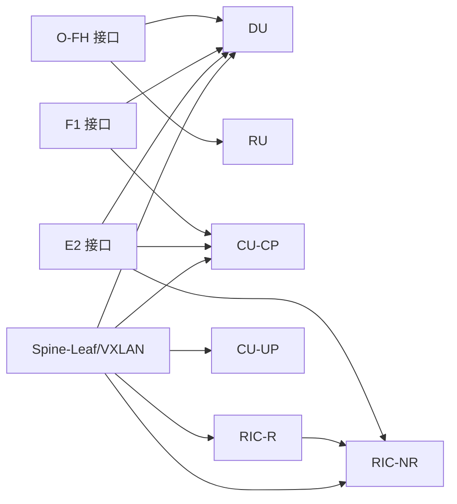

# 硬件与基础设施规划

<cite>
**本文引用的文件**
- [O-RAN 实施](file://08-deployment-implementation/readme.md)
- [前传分离选项分析](file://04-disaggregation-options/fronthaul-splits.md)
- [开放前传接口 O-FH](file://03-interface-standards/o-fh-interface.md)
- [E2 接口](file://03-interface-standards/e2-interface.md)
- [O-DU 技术规范](file://02-core-components/o-du.md)
- [O-CU 技术规范](file://02-core-components/o-cu.md)
- [O-RIC 技术规范](file://02-core-components/o-ric.md)
- [O-RAN 管理平台](file://22-tool-platforms/management-platforms/o-ran-management-platforms.md)
- [O-RAN 环境可持续性](file://24-sustainable-development/environmental-protection/o-ran-environmental-sustainability.md)
- [O-RAN 最佳实践](file://30-best-practices/readme.md)
- [O-RAN 故障库](file://27-troubleshooting-diagnosis/fault-library/o-ran-fault-case-database.md)
</cite>

## 目录
1. [引言](#引言)
2. [项目结构](#项目结构)
3. [核心组件](#核心组件)
4. [架构总览](#架构总览)
5. [详细组件分析](#详细组件分析)
6. [依赖关系分析](#依赖关系分析)
7. [性能考量](#性能考量)
8. [故障排查指南](#故障排查指南)
9. [结论](#结论)
10. [附录](#附录)

## 引言
本文件面向 O-RAN 硬件与基础设施规划，围绕 CU/ DU/ RIC/ SMO 等关键节点的服务器规格、网络基础设施（前传/中传/后传/数据中心 Spine-Leaf/VXLAN）、存储与数据持久化、电源与冷却系统，提供系统化技术指导。内容来源于仓库中已有的部署实施、接口标准、核心组件、管理平台、环境可持续性与最佳实践等资料，并结合故障库进行运维层面的补充建议。

## 项目结构
本仓库围绕 O-RAN 的架构、接口、核心组件、部署实施、性能优化、运维管理、安全与可持续发展等多个维度形成知识体系。与本规划主题直接相关的知识板块如下：
- 部署实施：涵盖硬件规划、网络基础设施、存储架构、电源与冷却等主题
- 接口标准：O-FH（前传）、E2（RIC 与 CU/DU）等关键接口的技术细节
- 核心组件：CU/ DU/ RIC 的软硬件架构与部署形态
- 管理平台：集群与网络虚拟化配置示例
- 环境可持续性：绿色通信与节能优化
- 最佳实践：硬件选型与网络设备建议
- 故障库：硬件/存储/网络层面的常见故障与处置

章节来源
- file://08-deployment-implementation/readme.md#L40-L61

## 核心组件
本节聚焦 CU/ DU/ RIC/ SMO 的硬件与基础设施要求，结合接口与组件文档给出落地建议。

- CU 服务器
  - CU-CP：通用服务器，处理控制面，对实时性要求相对较低；需具备多核 CPU、足够内存与高速网络接口
  - CU-UP：高性能服务器，处理用户面数据，强调吞吐量与低延迟；需高带宽网络接口与高速存储
  - 部署形态：集成部署或分离部署（CU-CP/CU-UP 分离），支持容器化与微服务架构

- DU 服务器
  - 计算模块：多核处理器、DSP、FPGA（加速实时物理层处理）、可选加速卡
  - 存储模块：高速缓存、内存、非易失性存储
  - 网络模块：高速以太网接口、同步接口、管理接口
  - 电源与散热：冗余电源与高效散热系统
  - 软件优化：并行处理、流水线设计、内存与缓存优化

- RIC 服务器
  - Near-RT RIC：毫秒级控制闭环，需低延迟网络与高可用部署；容器化与服务网格支撑
  - Non-RT RIC：大数据分析与机器学习，需高算力与大存储；容器化与大数据/ML 框架支撑
  - xApps/rApps 生命周期管理与安全隔离

- SMO 服务器
  - 管理功能：配置管理、监控、日志、告警
  - 数据库：关系型/时序型/键值型数据库，结合业务需求选择

章节来源
- file://02-core-components/o-cu.md#L62-L99
- file://02-core-components/o-du.md#L89-L130
- file://02-core-components/o-ric.md#L75-L116
- file://02-core-components/o-ric.md#L174-L192

## 架构总览
O-RAN 硬件与基础设施应遵循“集中/分布式/混合/边缘”等多种部署架构，结合 CU/ DU/ RIC/ SMO 的角色与接口约束，形成端到端的网络与计算协同。

图表来源
- file://02-core-components/o-cu.md#L62-L99
- file://02-core-components/o-du.md#L68-L86
- file://02-core-components/o-ric.md#L75-L116
- file://03-interface-standards/e2-interface.md#L74-L78
- file://03-interface-standards/o-fh-interface.md#L82-L97

## 详细组件分析

### 前传网络（Fronthaul）
- 带宽与延迟
  - eCPRI/RoE 等协议下，带宽需求随天线配置、带宽与调制方式变化；需预留 30% 以上冗余
  - URLLC 场景对前传延迟预算严格（通常占端到端 10%-20%）
- 同步精度
  - 时间同步精度 <100ns，频率同步 <10ppb；支持 PTP/ SyncE/GPS 等
- 传输介质与拓扑
  - 光纤为主（单模/多模），无线（毫米波/微波）为辅；拓扑可点到点/环形/树形，兼顾可靠性与成本
- 协议与安全
  - eCPRI/RoE 标准化协议；实施网络隔离、访问控制与加密

图表来源
- file://04-disaggregation-options/fronthaul-splits.md#L74-L135
- file://04-disaggregation-options/fronthaul-splits.md#L157-L217
- file://03-interface-standards/o-fh-interface.md#L121-L178

章节来源
- file://04-disaggregation-options/fronthaul-splits.md#L1-L461
- file://03-interface-standards/o-fh-interface.md#L1-L397

### 中传网络（Midhaul）
- IP 传输与 QoS
  - 基于 IP 的中传承载，需为不同业务等级配置 QoS，保障控制/同步/用户面的差异化服务质量
- 网络隔离
  - VLAN/分段/网络切片等手段实现安全域隔离
- 可靠性与扩展
  - 链路聚合、多路径与冗余路径，支持弹性扩展

章节来源
- file://08-deployment-implementation/readme.md#L46-L49
- file://12-security-privacy/network-security/network-security-framework.md#L42-L112

### 后传网络（Backhaul）
- 核心网连接与路由策略
  - 与核心网对接，路由策略需满足 SLA 与安全要求
- 与前传/中传的协同
  - 三层协同：前传低延迟、中传高带宽、后传高可靠性

章节来源
- file://08-deployment-implementation/readme.md#L46-L50

### 数据中心网络（Spine-Leaf 与 VXLAN）
- Spine-Leaf 架构
  - 高扩展性与低时延，适合 O-RAN 控制面与用户面的高密度互联
- VXLAN 实现
  - 通过二层扩展与三层路由结合，支持多租户与网络切片

章节来源
- file://08-deployment-implementation/readme.md#L46-L50
- file://22-tool-platforms/management-platforms/o-ran-management-platforms.md#L438-L452

### 存储架构与数据持久化
- 分布式存储设计
  - 面向 O-RAN 的分布式存储，结合对象/块/文件存储形态
- 数据持久化策略
  - 关键日志与配置采用高可用存储；数据库采用主从/集群/分片
- 备份与恢复
  - 定期备份与离线归档；制定恢复流程与演练
- 性能优化与容量规划
  - I/O 调度、缓存与页缓存优化；监控与容量预测

章节来源
- file://08-deployment-implementation/readme.md#L51-L55
- file://26-performance-optimization/compute-optimization/o-ran-compute-optimization.md#L222-L408

### 电源与冷却系统
- 数据中心电源设计
  - UPS 与柴油发电机配置，满足关键负载的持续供电
- 冷却系统规划
  - 高效风冷/液冷设计，结合热通道/冷通道隔离
- 能耗优化
  - 智能休眠、按需供电、可再生能源集成与碳足迹监测

章节来源
- file://08-deployment-implementation/readme.md#L56-L60
- file://24-sustainable-development/environmental-protection/o-ran-environmental-sustainability.md#L1-L75

### 管理平台与数据库配置（SMO）
- 管理功能
  - 配置管理、监控、日志、告警、自动化与编排
- 数据库
  - 结合业务选择关系型/时序/键值数据库；支持高可用与备份

章节来源
- file://02-core-components/o-ric.md#L242-L259
- file://22-tool-platforms/management-platforms/o-ran-management-platforms.md#L414-L452

## 依赖关系分析
- 接口依赖
  - DU 与 RU 通过 O-FH 接口通信；DU 与 CU 通过 F1 接口；RIC 与 CU/DU 通过 E2 接口
- 网络依赖
  - 前传/中传/后传三层协同；数据中心 Spine-Leaf/VXLAN 提供二三层转发能力
- 计算与存储依赖
  - CU/ DU/ RIC/ SMO 对 CPU/内存/存储/网络的资源依赖与 SLA 要求

图表来源
- file://03-interface-standards/o-fh-interface.md#L82-L97
- file://03-interface-standards/e2-interface.md#L74-L78
- file://02-core-components/o-cu.md#L62-L99
- file://02-core-components/o-du.md#L68-L86
- file://02-core-components/o-ric.md#L75-L116
- file://22-tool-platforms/management-platforms/o-ran-management-platforms.md#L438-L452

## 性能考量
- 计算层优化
  - CPU/内存/存储/网络 I/O 的系统性优化，结合容器与裸金属资源管理
- 网络 I/O 优化
  - 中断合并/批处理、RSS/多队列、收发卸载、DMA 与控制器优化
- 存储 I/O 优化
  - 文件系统与缓存、I/O 调度器、数据库参数与存储布局优化
- 资源配额与弹性
  - Kubernetes 资源请求/限制、HPA/VPA/Cluster Autoscaler 与容量规划

章节来源
- file://26-performance-optimization/compute-optimization/o-ran-compute-optimization.md#L222-L408
- file://26-performance-optimization/capacity-planning/o-ran-capacity-planning.md#L76-L214
- file://30-best-practices/readme.md#L31-L43

## 故障排查指南
- 服务器硬件故障
  - CPU/内存/电源/存储退化与 RAID 问题；按故障模式进行诊断与替换
- 网络接口故障
  - NIC/线缆/交换机/路由器问题；通过 LED/测试仪/日志进行定位与修复
- 前传/中传/后传链路
  - 基于 O-FH/E2 接口的监控与告警，结合协议日志与同步测试进行定位

章节来源
- file://27-troubleshooting-diagnosis/fault-library/o-ran-fault-case-database.md#L1-L59
- file://03-interface-standards/o-fh-interface.md#L201-L246
- file://03-interface-standards/e2-interface.md#L150-L189

## 结论
O-RAN 硬件与基础设施规划应以接口与组件特性为依据，结合前传/中传/后传与数据中心网络的协同设计，配合存储与数据库的持久化策略、电源与冷却的绿色节能方案，形成高可靠、低时延、可扩展且可持续的端到端基础设施体系。通过容量规划、性能优化与自动化运维，确保在多厂商与多场景下的稳定运行。

## 附录
- 硬件选型建议
  - CPU：至少 16 核，支持 AVX-512；内存：起始 64GB，ECC；存储：NVMe SSD，RAID 10；网卡：双 25GbE，支持 SR-IOV
  - 网络设备：交换机支持 VXLAN/ECMP；路由器支持 BGP/OSPF；防火墙千兆+，支持 DPI
- 管理平台示例
  - 集群与网络虚拟化配置（VLAN/传输域划分）可参考管理平台文档中的集群与 NSX-T 配置

章节来源
- file://30-best-practices/readme.md#L31-L43
- file://22-tool-platforms/management-platforms/o-ran-management-platforms.md#L414-L452