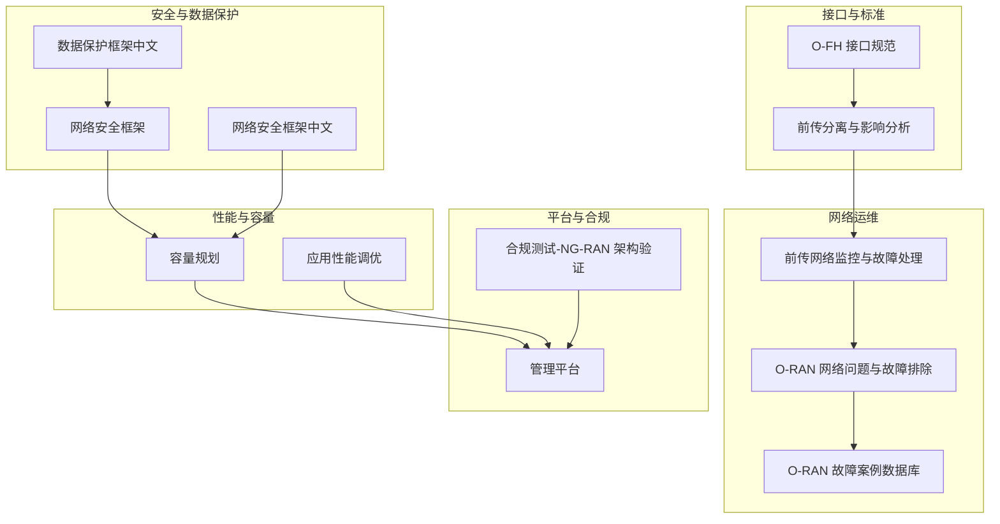
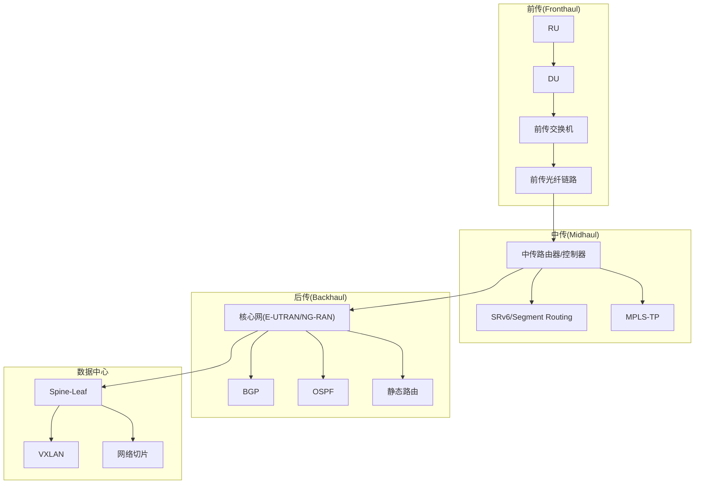
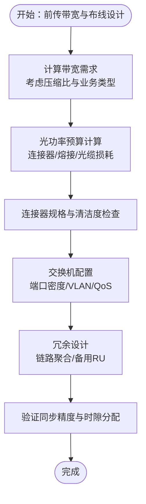
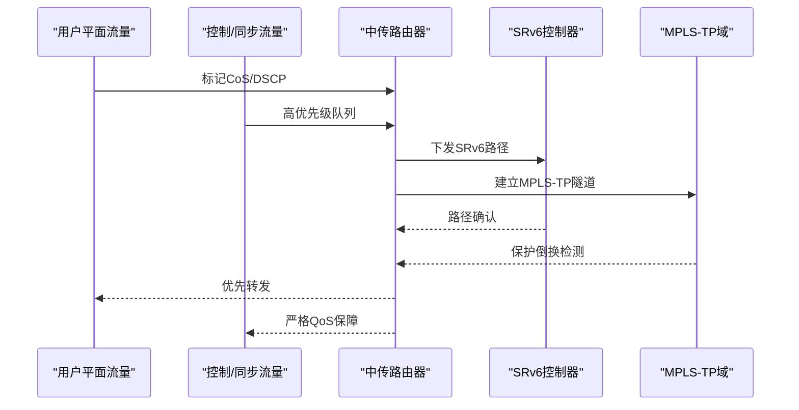
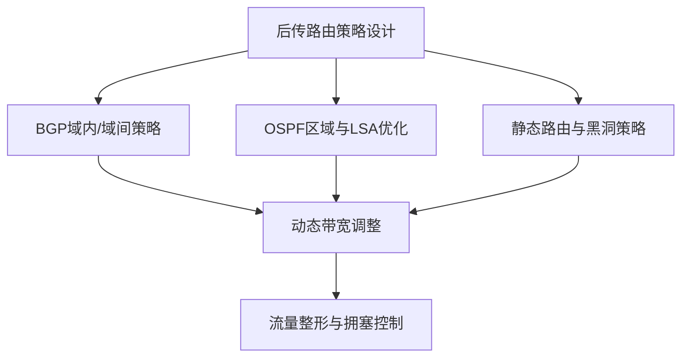
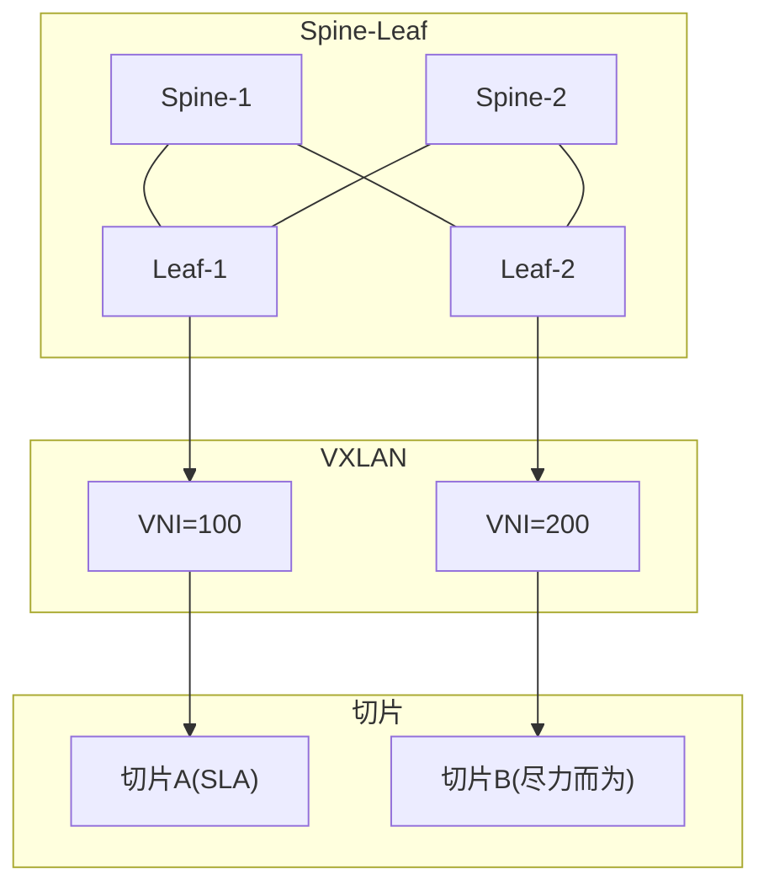
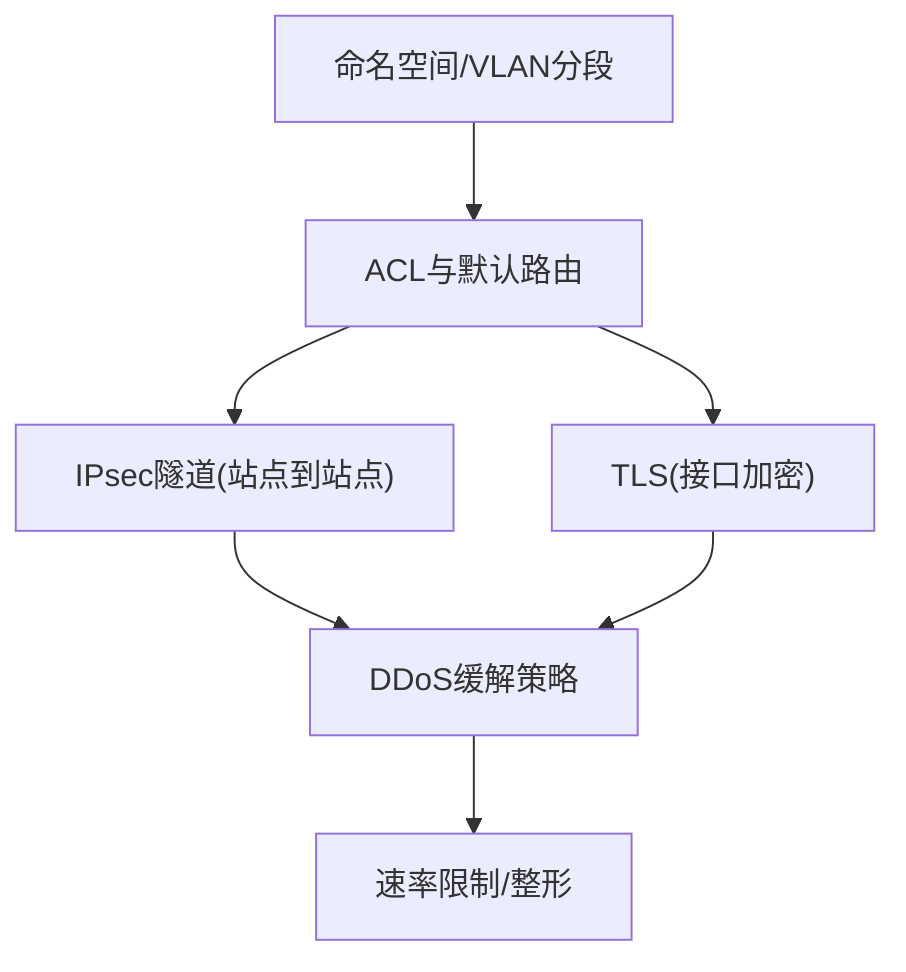
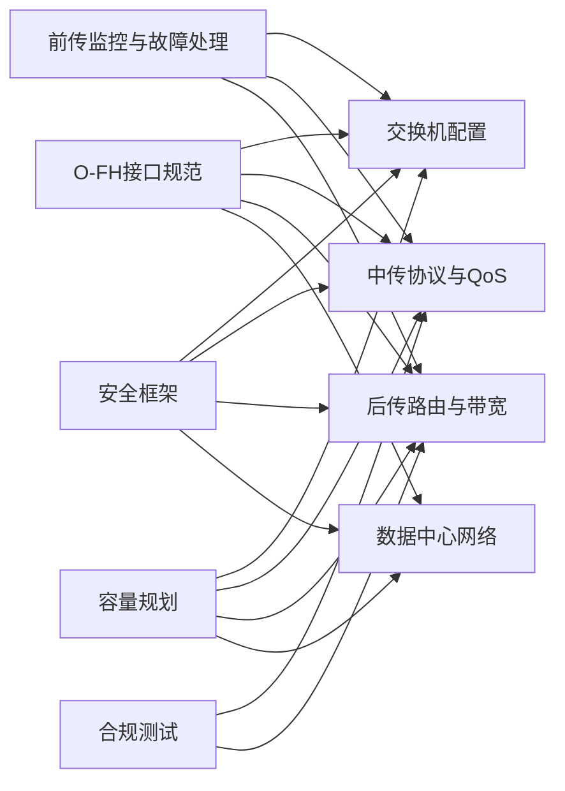
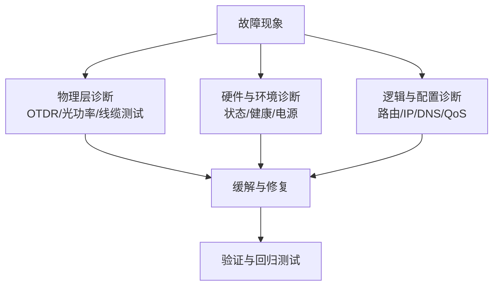

# 网络基础设施设计

<cite>
**本文引用的文件**
- [O-FH 接口规范](file://03-interface-standards/o-fh-interface.md)
- [前传分离与影响分析](file://04-disaggregation-options/performance-impact.md)
- [前传网络监控与故障处理](file://04-disaggregation-options/fronthaul-splits.md)
- [O-RAN 网络问题与故障排除](file://27-troubleshooting-diagnosis/network-issues/o-ran-network-troubleshooting.md)
- [O-RAN 故障案例数据库](file://27-troubleshooting-diagnosis/fault-library/o-ran-fault-case-database.md)
- [O-RAN 网络安全框架](file://12-security-privacy/network-security/network-security-framework.md)
- [O-RAN 网络安全框架（中文）](file://12-security-privacy/network-security/network-security-framework-zh.md)
- [O-RAN 数据保护框架（中文）](file://12-security-privacy/data-protection/data-protection-framework-zh.md)
- [O-RAN 网络性能优化-容量规划](file://26-performance-optimization/capacity-planning/o-ran-capacity-planning.md)
- [O-RAN 应用性能调优](file://26-performance-optimization/application-tuning/o-ran-application-performance-tuning.md)
- [O-RAN 管理平台](file://22-tool-platforms/management-platforms/o-ran-management-platforms.md)
- [O-RAN 最佳实践-架构设计](file://30-best-practices/architecture-practices/architecture-design-best-practices.md)
- [O-RAN 最佳实践-架构设计（中文）](file://30-best-practices/architecture-practices/architecture-design-best-practices-zh.md)
- [O-RAN 合规测试-NG-RAN 架构验证](file://13-testing-validation/conformance-testing/o-ran-conformance-testing-en.md)
</cite>

## 目录
1. [引言](#引言)
2. [项目结构](#项目结构)
3. [核心组件](#核心组件)
4. [架构总览](#架构总览)
5. [详细组件分析](#详细组件分析)
6. [依赖关系分析](#依赖关系分析)
7. [性能考量](#性能考量)
8. [故障排查指南](#故障排查指南)
9. [结论](#结论)
10. [附录](#附录)

## 引言
本文件面向O-RAN网络基础设施设计，围绕前传、中传、后传及数据中心网络的关键设计要素，提供可操作的技术指导。内容覆盖：
- 前传网络：光纤布线设计（波长、光功率预算、连接器）、交换机配置（端口密度、VLAN、QoS）、带宽规划（峰值、时隙、冗余）
- 中传网络：IP传输协议（SRv6、Segment Routing、MPLS-TP）配置、QoS（CoS、分类、调度）、冗余（链路聚合、快速收敛、保护倒换）
- 后传网络：核心接口（E-UTRAN/NG-RAN）、路由策略（BGP/OSPF/静态）、带宽管理（整形、拥塞控制、动态调整）
- 数据中心：Spine-Leaf、VXLAN、网络切片（隔离、资源、SLA）

## 项目结构
仓库以主题域组织，与网络基础设施设计直接相关的内容主要分布在“接口标准”、“解耦与影响”、“故障诊断”、“安全与数据保护”、“性能优化”、“管理平台”、“最佳实践”、“合规测试”等目录。

**图表来源**
- [O-FH 接口规范](file://03-interface-standards/o-fh-interface.md#L98-L197)
- [前传分离与影响分析](file://04-disaggregation-options/performance-impact.md#L76-L117)
- [前传网络监控与故障处理](file://04-disaggregation-options/fronthaul-splits.md#L353-L417)
- [O-RAN 网络问题与故障排除](file://27-troubleshooting-diagnosis/network-issues/o-ran-network-troubleshooting.md#L1-L95)
- [O-RAN 故障案例数据库](file://27-troubleshooting-diagnosis/fault-library/o-ran-fault-case-database.md#L116-L169)
- [O-RAN 网络安全框架](file://12-security-privacy/network-security/network-security-framework.md#L42-L112)
- [O-RAN 网络安全框架（中文）](file://12-security-privacy/network-security/network-security-framework-zh.md#L42-L112)
- [O-RAN 数据保护框架（中文）](file://12-security-privacy/data-protection/data-protection-framework-zh.md#L30-L96)
- [O-RAN 网络性能优化-容量规划](file://26-performance-optimization/capacity-planning/o-ran-capacity-planning.md#L76-L144)
- [O-RAN 应用性能调优](file://26-performance-optimization/application-tuning/o-ran-application-performance-tuning.md#L71-L129)
- [O-RAN 管理平台](file://22-tool-platforms/management-platforms/o-ran-management-platforms.md#L414-L454)
- [O-RAN 合规测试-NG-RAN 架构验证](file://13-testing-validation/conformance-testing/o-ran-conformance-testing-en.md#L152-L291)

**章节来源**
- [O-FH 接口规范](file://03-interface-standards/o-fh-interface.md#L98-L197)
- [前传分离与影响分析](file://04-disaggregation-options/performance-impact.md#L76-L117)
- [前传网络监控与故障处理](file://04-disaggregation-options/fronthaul-splits.md#L353-L417)
- [O-RAN 网络问题与故障排除](file://27-troubleshooting-diagnosis/network-issues/o-ran-network-troubleshooting.md#L1-L95)
- [O-RAN 故障案例数据库](file://27-troubleshooting-diagnosis/fault-library/o-ran-fault-case-database.md#L116-L169)
- [O-RAN 网络安全框架](file://12-security-privacy/network-security/network-security-framework.md#L42-L112)
- [O-RAN 网络安全框架（中文）](file://12-security-privacy/network-security/network-security-framework-zh.md#L42-L112)
- [O-RAN 数据保护框架（中文）](file://12-security-privacy/data-protection/data-protection-framework-zh.md#L30-L96)
- [O-RAN 网络性能优化-容量规划](file://26-performance-optimization/capacity-planning/o-ran-capacity-planning.md#L76-L144)
- [O-RAN 应用性能调优](file://26-performance-optimization/application-tuning/o-ran-application-performance-tuning.md#L71-L129)
- [O-RAN 管理平台](file://22-tool-platforms/management-platforms/o-ran-management-platforms.md#L414-L454)
- [O-RAN 合规测试-NG-RAN 架构验证](file://13-testing-validation/conformance-testing/o-ran-conformance-testing-en.md#L152-L291)

## 核心组件
- 前传接口与带宽规划：明确带宽需求、延迟要求、同步精度、QoS等级与硬件选型。
- 传输技术选择：光纤、无线、混合传输的权衡与部署要点。
- 前传网络监控与故障处理：OTDR定位、告警阈值、标准化流程与备件准备。
- 中传网络协议与QoS：SRv6/Segment Routing/MPLS-TP配置要点；CoS、分类与调度；链路聚合与保护倒换。
- 后传网络路由与带宽：E-UTRAN/NG-RAN接口、BGP/OSPF/静态路由策略；流量整形与拥塞控制。
- 数据中心网络：Spine-Leaf、VXLAN、网络切片的隔离与SLA保障。
- 安全与数据保护：网络分段、VLAN、IPsec/TLS、DDoS防护与速率限制。
- 性能与容量：Kubernetes资源管理、HPA/VPA、裸金属资源隔离与预留。
- 合规与平台：NG-RAN架构测试脚本、管理平台的虚拟化与网络切片配置。

**章节来源**
- [O-FH 接口规范](file://03-interface-standards/o-fh-interface.md#L98-L197)
- [前传分离与影响分析](file://04-disaggregation-options/performance-impact.md#L76-L117)
- [前传网络监控与故障处理](file://04-disaggregation-options/fronthaul-splits.md#L353-L417)
- [O-RAN 网络安全框架](file://12-security-privacy/network-security/network-security-framework.md#L42-L112)
- [O-RAN 数据保护框架（中文）](file://12-security-privacy/data-protection/data-protection-framework-zh.md#L30-L96)
- [O-RAN 网络性能优化-容量规划](file://26-performance-optimization/capacity-planning/o-ran-capacity-planning.md#L76-L144)
- [O-RAN 合规测试-NG-RAN 架构验证](file://13-testing-validation/conformance-testing/o-ran-conformance-testing-en.md#L152-L291)

## 架构总览
下图展示O-RAN基础设施在前传、中传、后传与数据中心层面的协同关系与关键设计点。

**图表来源**
- [O-FH 接口规范](file://03-interface-standards/o-fh-interface.md#L98-L197)
- [前传分离与影响分析](file://04-disaggregation-options/performance-impact.md#L76-L117)
- [O-RAN 管理平台](file://22-tool-platforms/management-platforms/o-ran-management-platforms.md#L414-L454)

## 详细组件分析

### 前传网络：光纤布线与交换机配置
- 光纤布线设计
  - 波长与模式：依据传输介质（单模/多模）与速率（10G/25G/100G）确定波长与模式兼容性。
  - 光功率预算：结合连接器损耗、熔接损耗、光缆衰减与设备收发光功率范围，计算预算并预留余量。
  - 连接器规格：确认连接器类型、插针规格、清洁度与插拔次数寿命。
- 交换机配置
  - 端口密度：按RU数量与分集策略选择端口密度，确保上联与下联带宽冗余。
  - VLAN支持：为控制面/用户面/管理面划分VLAN，结合QoS策略实现隔离与优先级。
  - QoS优先级：基于CoS/DSCP区分控制、同步与用户平面流量，确保低延迟与低抖动。
- 带宽规划
  - 峰值带宽：按业务类型（eMBB/URLLC/mMTC）与压缩比估算，按1.5–2倍峰值规划。
  - 时隙分配：结合同步精度与协议时隙要求，预留保护时隙。
  - 冗余设计：链路聚合与设备级冗余（备用RU），实现单点故障规避。

**图表来源**
- [O-FH 接口规范](file://03-interface-standards/o-fh-interface.md#L119-L197)
- [前传分离与影响分析](file://04-disaggregation-options/performance-impact.md#L76-L117)

**章节来源**
- [O-FH 接口规范](file://03-interface-standards/o-fh-interface.md#L98-L197)
- [前传分离与影响分析](file://04-disaggregation-options/performance-impact.md#L76-L117)

### 中传网络：IP传输协议与QoS
- 协议配置
  - SRv6/Segment Routing：基于源路由与段列表实现灵活路径编排，结合控制器下发策略。
  - MPLS-TP：面向传输网的面向连接特性，适合大颗粒管道承载与OAM。
- QoS保障
  - CoS标记与DSCP映射：区分控制/同步/用户平面流量。
  - 流量分类与调度：队列类型（如fq_codel/pfifo_fast/red）与调度算法（加权公平、令牌桶）。
- 冗余与保护
  - 链路聚合：提升带宽与可靠性。
  - 快速收敛与保护倒换：IGP快速收敛与LSP/L3VPN保护倒换策略。

**图表来源**
- [O-RAN 网络性能优化-容量规划](file://26-performance-optimization/capacity-planning/o-ran-capacity-planning.md#L76-L144)
- [O-RAN 应用性能调优](file://26-performance-optimization/application-tuning/o-ran-application-performance-tuning.md#L71-L129)

**章节来源**
- [O-RAN 网络性能优化-容量规划](file://26-performance-optimization/capacity-planning/o-ran-capacity-planning.md#L76-L144)
- [O-RAN 应用性能调优](file://26-performance-optimization/application-tuning/o-ran-application-performance-tuning.md#L71-L129)

### 后传网络：核心接口与路由策略
- 核心接口
  - E-UTRAN/NG-RAN：明确S1/X2与Xn/F1接口的承载与同步要求。
- 路由策略
  - BGP：跨域路由、策略控制与联盟/反射器部署。
  - OSPF：区域划分与LSA控制，优化收敛时间。
  - 静态路由：关键链路的备份与黑洞路由。
- 带宽管理
  - 流量整形：基于令牌桶/公平队列控制突发。
  - 拥塞控制：ECN/RED配合主动队列管理。
  - 动态调整：基于负载与SLA的策略回切与带宽重配。

**图表来源**
- [O-FH 接口规范](file://03-interface-standards/o-fh-interface.md#L119-L197)
- [O-RAN 管理平台](file://22-tool-platforms/management-platforms/o-ran-management-platforms.md#L414-L454)

**章节来源**
- [O-FH 接口规范](file://03-interface-standards/o-fh-interface.md#L119-L197)
- [O-RAN 管理平台](file://22-tool-platforms/management-platforms/o-ran-management-platforms.md#L414-L454)

### 数据中心网络：Spine-Leaf、VXLAN与网络切片
- Spine-Leaf
  - 扩展性：ECMP负载分担与无环拓扑，支持多租户与多业务。
- VXLAN
  - VNI分配：按租户/业务域划分VNI，避免冲突。
  - ARP处理：代理/泛洪抑制策略，降低广播域。
  - 隧道管理：集中式控制器下发，支持多活与迁移。
- 网络切片
  - 隔离策略：VLAN/VXLAN/路由域隔离。
  - 资源分配：CPU/内存/带宽配额与硬/软隔离。
  - SLA保证：队列、限速与优先级策略。

**图表来源**
- [O-RAN 管理平台](file://22-tool-platforms/management-platforms/o-ran-management-platforms.md#L414-L454)
- [O-RAN 网络性能优化-容量规划](file://26-performance-optimization/capacity-planning/o-ran-capacity-planning.md#L76-L144)

**章节来源**
- [O-RAN 管理平台](file://22-tool-platforms/management-platforms/o-ran-management-platforms.md#L414-L454)
- [O-RAN 网络性能优化-容量规划](file://26-performance-optimization/capacity-planning/o-ran-capacity-planning.md#L76-L144)

### 安全与数据保护：网络分段与加密
- 网络分段
  - 命名空间与VLAN：为管理/控制/用户平面分别创建命名空间与VLAN接口。
  - 路由与访问控制：默认路由与ACL策略，最小权限原则。
- 加密
  - IPsec：站点到站点隧道，IKEv2/AES-GCM，密钥轮换。
  - TLS：E2接口等使用TLS1.3，证书与会话缓存优化。
- DDoS防护
  - 速率限制与流量整形：全局/源地址限速、突发窗口与队列类型。
  - 缓解策略：黑洞路由、地理过滤、协议校验与签名阻断。

**图表来源**
- [O-RAN 网络安全框架](file://12-security-privacy/network-security/network-security-framework.md#L42-L112)
- [O-RAN 网络安全框架（中文）](file://12-security-privacy/network-security/network-security-framework-zh.md#L42-L112)
- [O-RAN 数据保护框架（中文）](file://12-security-privacy/data-protection/data-protection-framework-zh.md#L30-L96)

**章节来源**
- [O-RAN 网络安全框架](file://12-security-privacy/network-security/network-security-framework.md#L42-L112)
- [O-RAN 网络安全框架（中文）](file://12-security-privacy/network-security/network-security-framework-zh.md#L42-L112)
- [O-RAN 数据保护框架（中文）](file://12-security-privacy/data-protection/data-protection-framework-zh.md#L30-L96)

## 依赖关系分析
- 前传接口规范驱动带宽与同步要求，直接影响交换机端口密度与QoS策略。
- 前传监控与故障处理依赖OTDR与诊断工具，支撑运维闭环。
- 中传协议与QoS策略依赖控制器与策略引擎，保障SLA。
- 后传路由策略与带宽管理依赖核心网与控制器联动。
- 数据中心网络的VXLAN与切片依赖集中式控制器与资源池化。
- 安全框架贯穿各层，提供分段、加密与防护。
- 性能与容量规划为上述所有组件提供资源约束与优化依据。
- 合规测试脚本验证NG-RAN架构一致性，保障部署质量。

**图表来源**
- [O-FH 接口规范](file://03-interface-standards/o-fh-interface.md#L98-L197)
- [前传网络监控与故障处理](file://04-disaggregation-options/fronthaul-splits.md#L353-L417)
- [O-RAN 网络安全框架](file://12-security-privacy/network-security/network-security-framework.md#L42-L112)
- [O-RAN 网络性能优化-容量规划](file://26-performance-optimization/capacity-planning/o-ran-capacity-planning.md#L76-L144)
- [O-RAN 合规测试-NG-RAN 架构验证](file://13-testing-validation/conformance-testing/o-ran-conformance-testing-en.md#L152-L291)

**章节来源**
- [O-FH 接口规范](file://03-interface-standards/o-fh-interface.md#L98-L197)
- [前传网络监控与故障处理](file://04-disaggregation-options/fronthaul-splits.md#L353-L417)
- [O-RAN 网络安全框架](file://12-security-privacy/network-security/network-security-framework.md#L42-L112)
- [O-RAN 网络性能优化-容量规划](file://26-performance-optimization/capacity-planning/o-ran-capacity-planning.md#L76-L144)
- [O-RAN 合规测试-NG-RAN 架构验证](file://13-testing-validation/conformance-testing/o-ran-conformance-testing-en.md#L152-L291)

## 性能考量
- 资源配额与弹性
  - Kubernetes：Pod资源请求/限制、HPA/VPA、集群自动伸缩与多区域策略。
  - 容器与裸金属：cgroups带宽控制、I/O调度、网络绑定与优先级。
- 性能隔离与预留
  - CPU集、内存节点绑定、存储I/O隔离与网络带宽分区。
  - 关键服务资源预分配与优先级队列。
- 应用层优化
  - E2/A1/O1接口协议优化：ASN.1编译器、PER编码效率、连接池与心跳优化、订阅批处理与降级模式。

**章节来源**
- [O-RAN 网络性能优化-容量规划](file://26-performance-optimization/capacity-planning/o-ran-capacity-planning.md#L76-L144)
- [O-RAN 应用性能调优](file://26-performance-optimization/application-tuning/o-ran-application-performance-tuning.md#L71-L129)

## 故障排查指南
- 物理层
  - 光纤：OTDR断点/衰减分析、两端光功率测量、连接器清洁度与波长兼容性。
  - 有线：线缆测试、长度与衰减、连接器完整性。
  - 无线：信号强度、干扰源识别、天线定位与环境评估。
- 硬件与环境
  - 网卡/交换机/路由器：接口状态、驱动/固件版本、错误计数器、健康监控。
  - 电源与环境：电压/电流、冗余验证、温湿度与接地。
- 逻辑与配置
  - IP冲突、路由表、DNS与名称解析、带宽拥塞、时延与抖动、丢包与误码。
- 标准化流程
  - 告警阈值、OTDR定位、诊断工具链、备件与应急预案。

**图表来源**
- [O-RAN 网络问题与故障排除](file://27-troubleshooting-diagnosis/network-issues/o-ran-network-troubleshooting.md#L1-L95)
- [O-RAN 故障案例数据库](file://27-troubleshooting-diagnosis/fault-library/o-ran-fault-case-database.md#L116-L169)

**章节来源**
- [O-RAN 网络问题与故障排除](file://27-troubleshooting-diagnosis/network-issues/o-ran-network-troubleshooting.md#L1-L95)
- [O-RAN 故障案例数据库](file://27-troubleshooting-diagnosis/fault-library/o-ran-fault-case-database.md#L116-L169)

## 结论
O-RAN网络基础设施设计需以接口规范为依据，从前传的光功率预算与QoS，到中传的SRv6/MPLS-TP与链路聚合，再到后传的路由策略与带宽管理，以及数据中心的Spine-Leaf与VXLAN切片，形成端到端的协同架构。安全与性能优化贯穿始终，并通过标准化的监控、故障处理与合规测试保障交付质量与运营稳定。

## 附录
- 最佳实践建议
  - 分层架构与微服务治理、水平/垂直扩展策略、冗余与故障隔离。
- 管理平台参考
  - NSX-T逻辑交换、Tier0/Tier1网关、VLAN与传输域划分。

**章节来源**
- [O-RAN 最佳实践-架构设计](file://30-best-practices/architecture-practices/architecture-design-best-practices.md#L78-L162)
- [O-RAN 最佳实践-架构设计（中文）](file://30-best-practices/architecture-practices/architecture-design-best-practices-zh.md#L78-L162)
- [O-RAN 管理平台](file://22-tool-platforms/management-platforms/o-ran-management-platforms.md#L414-L454)