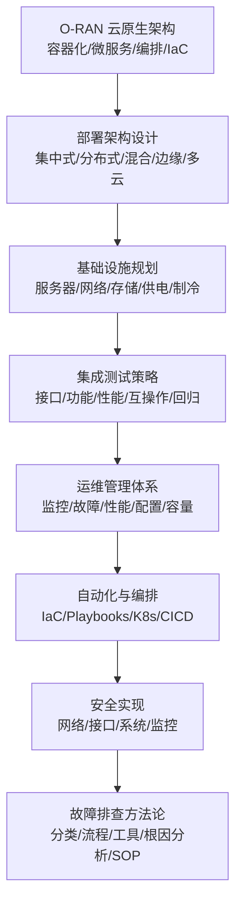
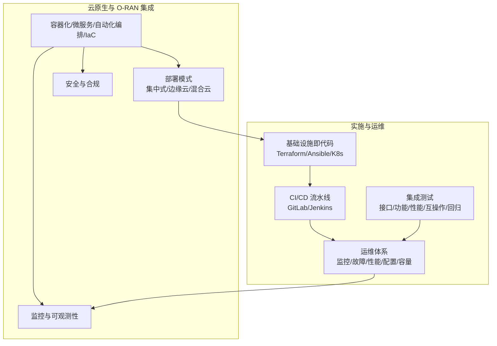
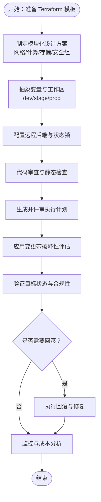
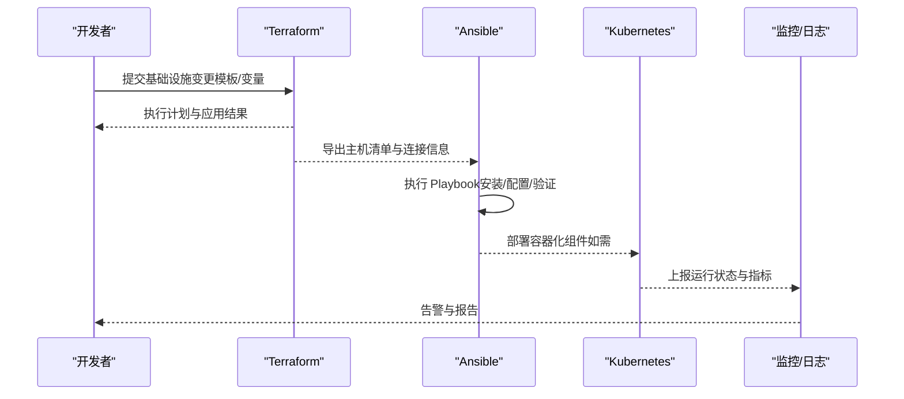
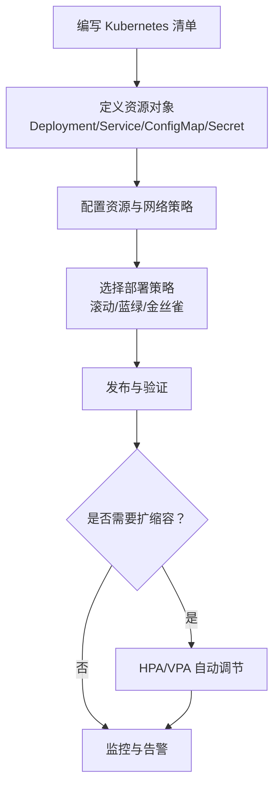
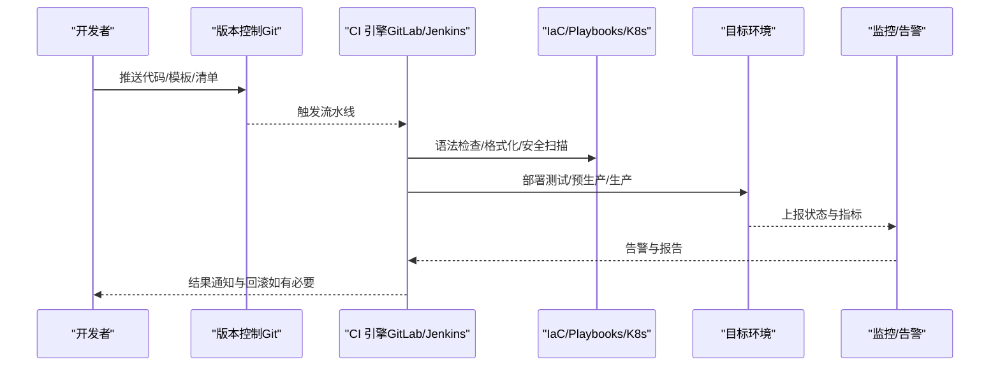
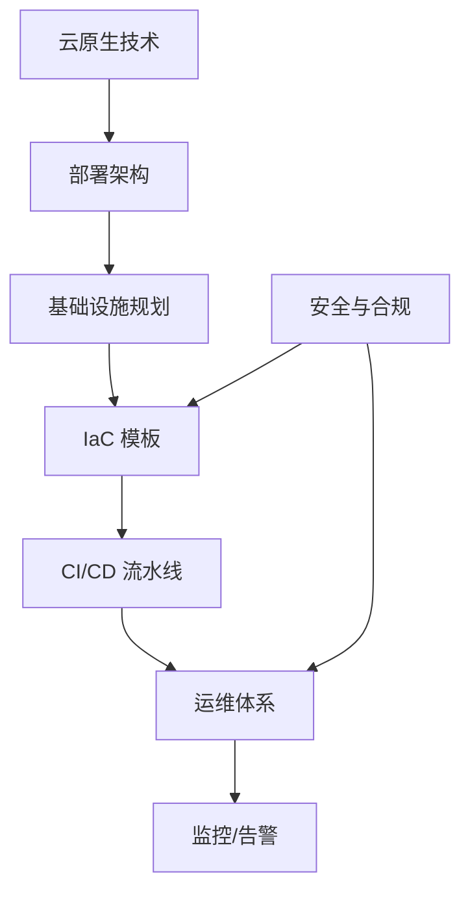
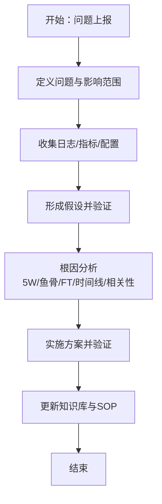

# 基础设施即代码

<cite>
**本文引用的文件**
- [云原生架构与 O-RAN 集成.md](file://05-cloud-integration/cloud-native-architecture.md)
- [O-RAN 实施.md](file://08-deployment-implementation/readme.md)
</cite>

## 目录
1. [引言](#引言)
2. [项目结构](#项目结构)
3. [核心组件](#核心组件)
4. [架构总览](#架构总览)
5. [详细组件分析](#详细组件分析)
6. [依赖分析](#依赖分析)
7. [性能考虑](#性能考虑)
8. [故障排查指南](#故障排查指南)
9. [结论](#结论)
10. [附录](#附录)

## 引言
本文件面向 O-RAN 基础设施即代码（Infrastructure as Code, IaC）的工程实践，围绕 Terraform 模板设计原则、Ansible Playbooks 配置自动化、Kubernetes 清单编排与部署策略、CI/CD 流水线（GitLab CI、Jenkins）以及版本控制、变更管理、安全配置与成本优化等方面，提供系统化、可落地的实施指南与运维最佳实践。内容以云原生与 O-RAN 的融合为背景，结合部署架构、集成测试、运维管理与故障排查等主题，帮助读者建立从设计到交付再到运维的完整闭环。

## 项目结构
本仓库聚焦于 O-RAN 的架构、组件、接口标准、解耦选项、云原生集成、部署实施、标准合规、应用场景、测试验证、运维管理、未来方向等多个维度的知识条目。与 IaC 直接相关的内容主要分布在以下两个文件：
- 云原生架构与 O-RAN 集成：阐述容器化、微服务、自动化编排与 IaC 的集成点、技术挑战与最佳实践，并给出集中式、边缘云与混合云三种部署模式。
- O-RAN 实施：涵盖部署架构设计、硬件与基础设施规划、集成测试策略、运维管理体系、故障排查方法、安全实现、自动化与编排工具（含 IaC、CI/CD）等。

章节来源
- file://05-cloud-integration/cloud-native-architecture.md#L1-L481
- file://08-deployment-implementation/readme.md#L1-L353

## 核心组件
- 基础设施即代码（IaC）：以代码定义和管理基础设施，强调可重复性、版本控制、自动化与快速部署，支撑 O-RAN 网络的快速复制与一致性。
- 配置自动化（Ansible Playbooks）：用于自动化配置管理、批量部署与变更治理，配合版本控制系统实现配置的可追溯与可审计。
- 容器编排（Kubernetes 清单）：通过声明式清单实现容器化 O-RAN 组件（如 CU、DU、RIC、SMO）的部署、扩缩容与滚动更新。
- CI/CD 流水线（GitLab CI、Jenkins）：将构建、测试、打包、部署与验证自动化，确保变更的可控、可回滚与可追溯。
- 运维体系：包括监控、故障管理、性能管理、配置管理与容量管理，形成闭环的运维保障。

章节来源
- file://05-cloud-integration/cloud-native-architecture.md#L51-L64
- file://08-deployment-implementation/readme.md#L180-L196

## 架构总览
下图展示了 IaC 在 O-RAN 云原生架构中的位置与作用，以及与部署架构、基础设施规划、测试与运维的关系。

图表来源
- [云原生架构与 O-RAN 集成.md](file://05-cloud-integration/cloud-native-architecture.md#L65-L122)
- [O-RAN 实施.md](file://08-deployment-implementation/readme.md#L8-L38)
- [O-RAN 实施.md](file://08-deployment-implementation/readme.md#L94-L125)
- [O-RAN 实施.md](file://08-deployment-implementation/readme.md#L180-L196)

## 详细组件分析

### Terraform 模板设计原则与最佳实践
- 设计原则
  - 声明式与幂等性：通过声明式配置确保目标状态与实际状态一致，避免重复执行带来的副作用。
  - 模块化与复用：将基础设施按功能拆分为可复用模块，降低重复代码与提升一致性。
  - 环境分离与变量抽象：通过变量与工作区（如 dev/stage/prod）隔离资源，避免误操作。
  - 状态管理与后端：采用远程后端（如 S3+DynamoDB、Artifactory）集中管理状态文件，保障团队协作与审计。
  - 安全与最小权限：遵循最小权限原则，使用 IAM 角色/凭据与网络隔离，限制访问范围。
  - 变更预览与破坏性评估：在应用前进行计划（plan）评审，识别破坏性变更并制定回退策略。
- 最佳实践
  - 版本控制：将模板纳入 Git，配合分支策略与 Pull Request 审查。
  - 自动化测试：在 CI 中加入语法检查、格式化校验与安全扫描。
  - 环境一致性：通过统一的基础设施模板与参数，确保各环境配置一致。
  - 变更管理：建立变更请求流程（RFC）、影响评估与回滚预案。
  - 成本优化：通过预留实例、自动伸缩、资源标签与成本中心划分实现成本控制。

章节来源
- file://05-cloud-integration/cloud-native-architecture.md#L229-L234
- file://08-deployment-implementation/readme.md#L180-L185

### Ansible Playbooks 配置自动化与任务编排
- 配置自动化
  - 集中化配置管理：通过 Ansible 管理 O-RAN 组件（CU/DU/RI/SMO）的配置，实现批量部署与一致性。
  - 变更治理：将配置变更纳入版本控制与审批流程，确保可追溯与可审计。
  - 幂等性与回滚：通过幂等任务与备份机制，保障变更安全与可回滚。
- 任务编排策略
  - 分层编排：按“基础环境—系统—应用—服务”的层次组织任务，确保依赖顺序与错误隔离。
  - 条件与循环：基于主机分类与条件判断执行差异化任务，减少重复代码。
  - 错误处理与通知：在关键步骤添加失败处理与告警通知，缩短修复时间。
- 与 IaC 的协同
  - Terraform 创建基础设施与网络，Ansible 安装与配置软件；两者通过输出变量与 inventory 协同。
  - 将 Ansible Playbook 作为 CI/CD 的一部分，实现“基础设施+应用”的一体化交付。

章节来源
- file://08-deployment-implementation/readme.md#L113-L118
- file://08-deployment-implementation/readme.md#L180-L185

### Kubernetes 清单的容器编排、资源配置与部署策略
- 容器编排
  - 使用 Deployment/StatefulSet/Job 等资源对象管理有状态与无状态服务，结合 HPA/VPA 实现弹性伸缩。
  - 通过 ConfigMap/Secret 管理配置与密钥，避免硬编码与暴露敏感信息。
- 资源配置
  - 设置资源请求与限制，启用 PodDisruptionBudget（PDB）保障高可用。
  - 使用命名空间与资源配额隔离租户与业务，结合网络策略实现最小权限访问。
- 部署策略
  - 滚动更新：最小化停机与风险。
  - 蓝绿/金丝雀：渐进式发布，降低变更风险。
  - Helm：以包管理方式封装多组件应用，统一版本与配置。

章节来源
- file://05-cloud-integration/cloud-native-architecture.md#L215-L220
- file://05-cloud-integration/cloud-native-architecture.md#L47-L49

### CI/CD 流水线（GitLab CI、Jenkins）与自动化测试
- GitLab CI
  - 将 IaC、Ansible、Kubernetes 部署与测试脚本纳入流水线，实现“提交即构建、构建即测试、测试即部署”。
  - 使用多阶段流水线（build/test/deploy/verify），在部署前进行安全扫描与合规检查。
- Jenkins
  - 通过 Pipeline-as-Code（Jenkinsfile）实现与 Git 的深度集成，支持并行与串行阶段组合。
  - 结合插件生态（如 Kubernetes、Ansible、Terraform）实现多阶段自动化。
- 自动化测试
  - 单元/集成测试：在 CI 中执行语法检查、格式化与安全扫描。
  - 回归测试：针对接口（E2/A1/O1/O-FH/F1）与功能、性能、互操作性进行自动化回归。
  - 部署验证：在预生产环境执行端到端验证，确保部署质量。

章节来源
- file://05-cloud-integration/cloud-native-architecture.md#L223-L228
- file://08-deployment-implementation/readme.md#L92-L92
- file://08-deployment-implementation/readme.md#L180-L185

### 版本控制、变更管理、安全配置与成本优化
- 版本控制与变更管理
  - 将 IaC 模板、Playbook、Kubernetes 清单纳入 Git，采用分支策略与 PR 审查。
  - 建立 RFC 与变更影响评估流程，对破坏性变更进行分级与回滚预案。
- 安全配置
  - 网络安全：VLAN/VXLAN/网络切片、ACL、防火墙、mTLS、OAuth 等。
  - 系统安全：OS 硬化、容器镜像扫描、只读文件系统、RBAC、Secrets 管理。
  - 接口安全：认证授权、API 限流、输入校验、消息完整性与加密传输。
- 成本优化
  - 资源规划：基于容量预测与 SLA 要求，合理配置资源与自动伸缩策略。
  - 成本中心：通过标签与预算控制，明确成本归属。
  - 能耗与冷却：优化数据中心能耗与冷却系统，降低 OPEX。

章节来源
- file://08-deployment-implementation/readme.md#L113-L118
- file://08-deployment-implementation/readme.md#L158-L179
- file://08-deployment-implementation/readme.md#L119-L124

## 依赖分析
IaC 在 O-RAN 云原生架构中的依赖关系如下：
- 云原生技术（容器化/微服务/编排/IaC）为 O-RAN 提供灵活性与可扩展性。
- 部署架构（集中式/边缘云/混合云）决定 IaC 的资源布局与网络策略。
- 基础设施规划（服务器/网络/存储/供电/制冷）为 IaC 提供硬件与网络约束。
- 集成测试与运维体系为 IaC 的质量与稳定性提供保障。
- 安全与合规贯穿于 IaC 的设计、应用与监控全过程。

图表来源
- [云原生架构与 O-RAN 集成.md](file://05-cloud-integration/cloud-native-architecture.md#L65-L122)
- [O-RAN 实施.md](file://08-deployment-implementation/readme.md#L8-L38)
- [O-RAN 实施.md](file://08-deployment-implementation/readme.md#L94-L125)
- [O-RAN 实施.md](file://08-deployment-implementation/readme.md#L158-L179)

## 性能考虑
- 容器与网络优化：优先使用特权容器、CPU 亲和性、SR-IOV、DPDK 等技术降低延迟；合理选择 CNI/CSI，确保网络与存储性能。
- 资源预留与弹性：为关键服务预留资源，结合 HPA/VPA 实现自动伸缩；通过 PDB 保障高可用。
- 监控与可观测性：统一采集指标、日志与追踪，结合可视化与智能告警，快速定位性能瓶颈。
- 部署策略：滚动更新、蓝绿/金丝雀发布，降低变更对性能的影响。

章节来源
- file://05-cloud-integration/cloud-native-architecture.md#L125-L137
- file://05-cloud-integration/cloud-native-architecture.md#L215-L220
- file://05-cloud-integration/cloud-native-architecture.md#L297-L341

## 故障排查指南
- 问题分类：接口故障（E2/A1/O1/O-FH/F1）、性能问题（延迟/吞吐/丢包）、可用性问题（服务中断/退化）、配置问题（配置错误/冲突）、兼容性问题（多厂商集成）。
- 排查流程：定义问题与范围、收集日志/指标/配置、假设与验证、根因分析（5 Why、鱼骨图、故障树、时间线、相关性分析）、实施与验证解决方案。
- 诊断工具：Wireshark/tcpdump、协议分析器（E2/A1/O1）、ELK/Splunk、Perf/火焰图、Ping/Traceroute/MTR。
- SOP：故障响应、升级、沟通、事后复盘与知识库更新。

章节来源
- file://08-deployment-implementation/readme.md#L126-L156

## 结论
通过将 IaC、Ansible、Kubernetes 与 CI/CD 流水线有机整合，O-RAN 网络可以实现从设计到交付再到运维的全生命周期自动化与标准化。结合云原生架构的最佳实践与部署模式，能够在满足实时性、可靠性与安全性的前提下，显著提升资源利用率、运维效率与业务创新速度。建议在实践中持续完善版本控制、变更管理、安全配置与成本优化机制，确保系统稳定、可追溯、可审计与可持续演进。

## 附录
- 关键参考
  - O-RAN 联盟部署指南、集成测试规范、运维指南与安全规范
  - ETSI 与 3GPP 标准文档
  - 白皮书与自动化框架文档
- 实践建议
  - 以模块化与环境分离为核心，构建可复用的 IaC 模板
  - 将安全与合规嵌入 CI/CD 的每个环节
  - 建立完善的监控与告警体系，实现可观测性与自愈能力
  - 通过蓝绿/金丝雀发布与自动化回滚，降低变更风险