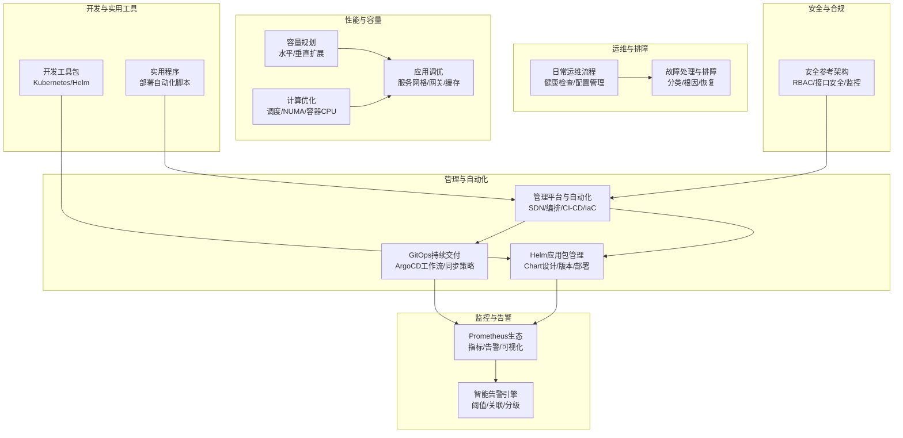
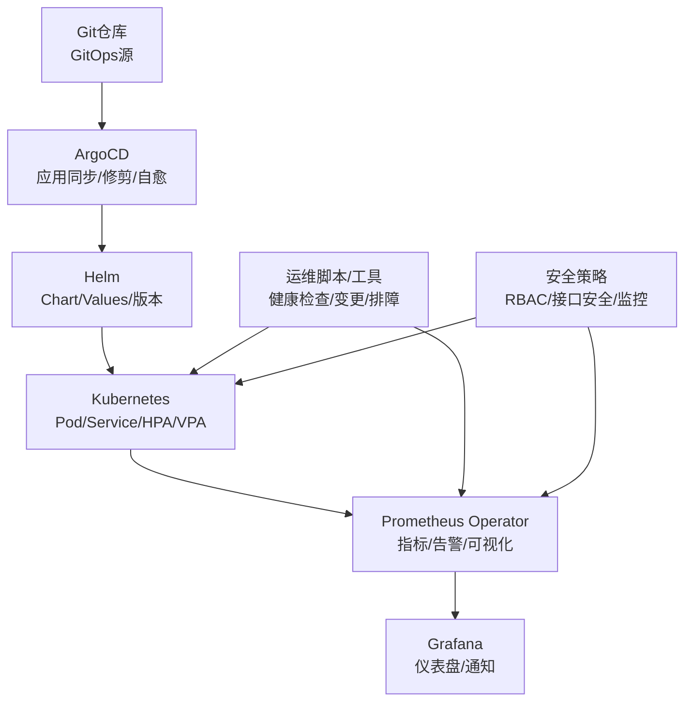
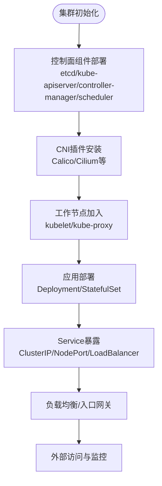
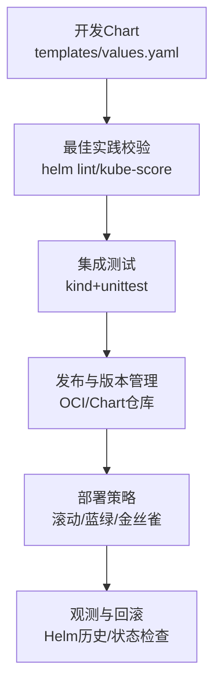
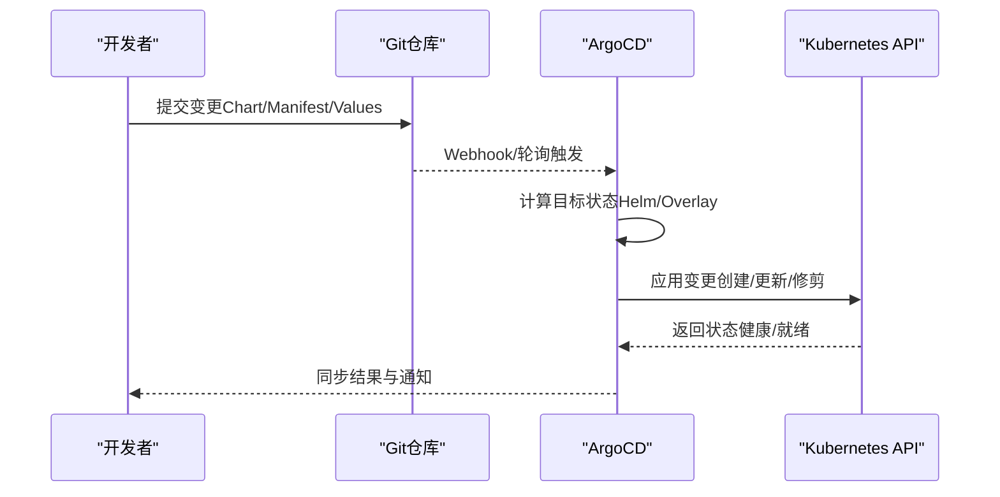
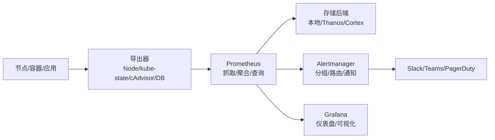
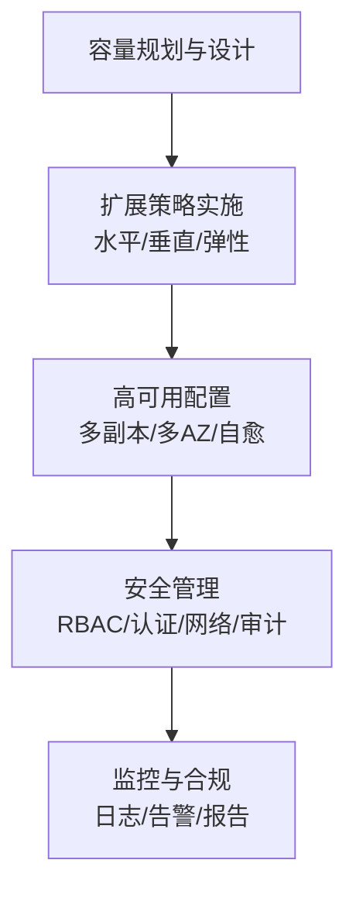
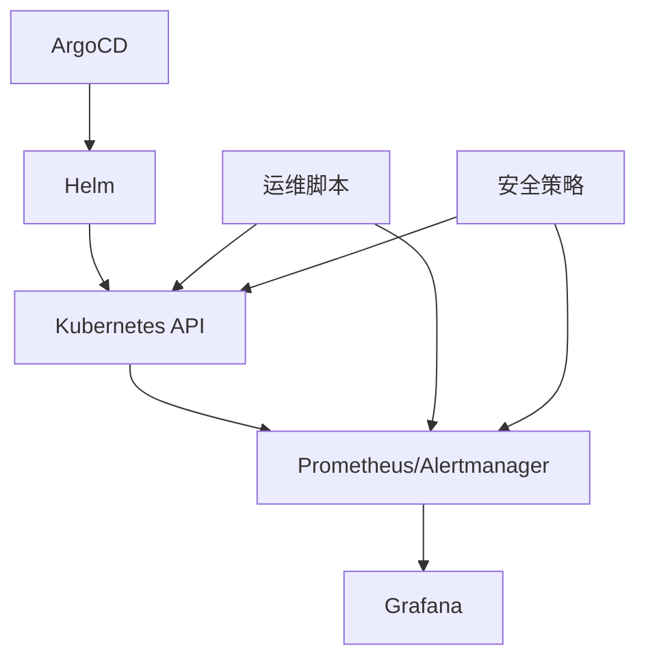
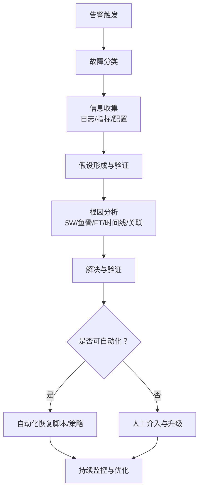

# 编排工具

<cite>
**本文引用的文件**
- [O-RAN管理平台](file://22-tool-platforms/management-platforms/o-ran-management-platforms.md)
- [O-RAN管理平台（中文）](file://22-tool-platforms/management-platforms/o-ran-management-platforms-zh.md)
- [O-RAN监控工具套件](file://28-monitoring-alerting/monitoring-tools/o-ran-monitoring-tools.md)
- [O-RAN日常运维流程](file://14-operations-management/daily-operations/daily-operation-procedures.md)
- [O-RAN故障处理与排障指南](file://14-operations-management/fault-handling/fault-troubleshooting-guide.md)
- [O-RAN开发工具包](file://22-tool-platforms/development-tools/o-ran-development-toolkit.md)
- [O-RAN实用程序（英文）](file://22-tool-platforms/utility-programs/o-ran-utility-programs.md)
- [O-RAN实用程序（中文）](file://22-tool-platforms/utility-programs/o-ran-utility-programs-zh.md)
- [O-RAN容量规划](file://26-performance-optimization/capacity-planning/o-ran-capacity-planning.md)
- [O-RAN计算优化](file://26-performance-optimization/compute-optimization/o-ran-compute-optimization.md)
- [O-RAN应用性能调优](file://26-performance-optimization/application-tuning/o-ran-application-performance-tuning.md)
- [O-RAN安全参考架构](file://12-security-privacy/security-architecture/security-reference-architecture.md)
- [O-RAN安全参考架构（中文）](file://12-security-privacy/security-architecture/security-reference-architecture-zh.md)
- [O-RAN实施](file://08-deployment-implementation/readme.md)
</cite>

## 目录
1. [简介](#简介)
2. [项目结构](#项目结构)
3. [核心组件](#核心组件)
4. [架构总览](#架构总览)
5. [详细组件分析](#详细组件分析)
6. [依赖分析](#依赖分析)
7. [性能考虑](#性能考虑)
8. [故障排查指南](#故障排查指南)
9. [结论](#结论)
10. [附录](#附录)

## 简介
本文件面向O-RAN编排工具的使用者与运维人员，系统化梳理Kubernetes容器编排、Helm应用包管理、ArgoCD GitOps持续交付、Prometheus Operator监控自动化、集群扩展与高可用、安全管理与部署运维最佳实践。内容以仓库中的O-RAN管理平台、监控工具、运维流程、开发工具与实用程序为基础，结合云原生与O-RAN接口特性，形成可落地的编排工具指导。

## 项目结构
围绕O-RAN编排工具，仓库中与之直接相关的主要内容分布在如下主题目录：
- 管理平台与自动化：涵盖SDN控制器、编排与自动化平台、GitOps与基础设施即代码、Helm图表与Kubernetes开发工具
- 监控与告警：覆盖Prometheus生态、Grafana、Alertmanager、服务网格可观测性与智能分析
- 运维与排障：提供日常运维流程、故障分类与根因分析、自动化恢复与预防性维护
- 开发与实用工具：Helm Chart模板示例、Kubernetes开发工具、部署自动化脚本
- 性能与容量：横向/纵向扩展策略、CPU调度优化、应用服务编排优化
- 安全与合规：RBAC策略、接口安全、系统安全与监控

章节来源
- [O-RAN实施](file://08-deployment-implementation/readme.md#L1-L353)

## 核心组件
- Kubernetes容器编排：用于承载O-RAN控制面与用户面组件，提供Pod调度、Service发现、持久化与网络策略等能力
- Helm应用包管理：以Chart封装O-RAN组件（如Near-RT RIC、O-CU/O-DU等），统一版本与部署参数
- ArgoCD GitOps：以Git仓库为单一事实源，自动化同步集群状态，支持自动化修剪与自愈
- Prometheus Operator监控：统一采集、存储与告警，结合Grafana进行可视化与仪表盘管理
- 运维与排障：日常健康检查、配置备份与变更流程、故障分类与根因分析、自动化恢复
- 开发与实用工具：Helm Chart模板、Kubernetes开发工具、部署自动化脚本
- 性能与容量：水平/垂直扩展策略、CPU调度优化、服务网格与API网关性能调优
- 安全与合规：RBAC、接口认证授权、系统与数据安全、安全监控与合规审计

章节来源
- [O-RAN管理平台](file://22-tool-platforms/management-platforms/o-ran-management-platforms.md#L1-L711)
- [O-RAN监控工具套件](file://28-monitoring-alerting/monitoring-tools/o-ran-monitoring-tools.md#L1-L284)
- [O-RAN日常运维流程](file://14-operations-management/daily-operations/daily-operation-procedures.md#L1-L443)
- [O-RAN故障处理与排障指南](file://14-operations-management/fault-handling/fault-troubleshooting-guide.md#L1-L633)
- [O-RAN开发工具包](file://22-tool-platforms/development-tools/o-ran-development-toolkit.md#L222-L257)
- [O-RAN实用程序（英文）](file://22-tool-platforms/utility-programs/o-ran-utility-programs.md#L328-L432)
- [O-RAN容量规划](file://26-performance-optimization/capacity-planning/o-ran-capacity-planning.md#L146-L214)
- [O-RAN计算优化](file://26-performance-optimization/compute-optimization/o-ran-compute-optimization.md#L6-L59)
- [O-RAN应用性能调优](file://26-performance-optimization/application-tuning/o-ran-application-performance-tuning.md#L131-L199)
- [O-RAN安全参考架构](file://12-security-privacy/security-architecture/security-reference-architecture.md#L284-L337)

## 架构总览
下图展示了O-RAN编排工具在云原生环境中的总体交互关系：Git仓库驱动ArgoCD进行应用同步；Helm负责Chart部署；Kubernetes提供编排与服务发现；Prometheus Operator负责监控与告警；运维脚本与工具支撑自动化与性能优化；安全策略贯穿全链路。

图表来源
- [O-RAN管理平台](file://22-tool-platforms/management-platforms/o-ran-management-platforms.md#L534-L616)
- [O-RAN监控工具套件](file://28-monitoring-alerting/monitoring-tools/o-ran-monitoring-tools.md#L1-L284)
- [O-RAN日常运维流程](file://14-operations-management/daily-operations/daily-operation-procedures.md#L1-L443)
- [O-RAN安全参考架构](file://12-security-privacy/security-architecture/security-reference-architecture.md#L284-L337)

## 详细组件分析

### Kubernetes容器编排与集群管理
- 集群设计与角色划分：控制面与工作节点分离、CNI与CSI选择、网络策略与安全上下文
- Pod调度与Service发现：基于标签选择器的Deployment/StatefulSet、ClusterIP/NodePort/LoadBalancer、Headless服务与DNS
- 资源管理与弹性：HPA/VPA自动扩缩容、资源请求与限制、亲和性与反亲和性、污点与容忍
- 高可用与容灾：多副本部署、故障转移、备份与恢复、灾难恢复演练

章节来源
- [O-RAN实施](file://08-deployment-implementation/readme.md#L1-L353)
- [O-RAN容量规划](file://26-performance-optimization/capacity-planning/o-ran-capacity-planning.md#L146-L214)
- [O-RAN计算优化](file://26-performance-optimization/compute-optimization/o-ran-compute-optimization.md#L6-L59)

### Helm应用包管理：Chart设计、版本与部署策略
- Chart结构与模板函数：templates/values.yaml/Chart.yaml/README.md、条件渲染、循环生成、字符串与数据结构操作
- 测试框架：helm unittest插件、集成测试（kind）、kube-score安全扫描、helm lint最佳实践
- 部署策略：滚动更新、蓝绿/金丝雀发布、版本回滚、参数化与多环境Values文件

图表来源
- [O-RAN开发工具包](file://22-tool-platforms/development-tools/o-ran-development-toolkit.md#L222-L257)
- [O-RAN实用程序（英文）](file://22-tool-platforms/utility-programs/o-ran-utility-programs.md#L328-L432)
- [O-RAN实用程序（中文）](file://22-tool-platforms/utility-programs/o-ran-utility-programs-zh.md#L328-L432)

章节来源
- [O-RAN开发工具包](file://22-tool-platforms/development-tools/o-ran-development-toolkit.md#L222-L257)
- [O-RAN实用程序（英文）](file://22-tool-platforms/utility-programs/o-ran-utility-programs.md#L328-L432)
- [O-RAN实用程序（中文）](file://22-tool-platforms/utility-programs/o-ran-utility-programs-zh.md#L328-L432)

### ArgoCD GitOps持续交付：工作流、同步策略与变更管理
- GitOps仓库结构：clusters/applications/operators与applications/xapps/monitoring
- 应用配置：source（repoURL/targetRevision/path）、destination（server/namespace）、syncPolicy（自动化修剪/自愈）、syncOptions（命名空间创建/修剪传播）、ignoreDifferences（忽略差异）
- 变更管理：参数化（global.image.tag/global.namespace）、联系人与Slack通道信息

图表来源
- [O-RAN管理平台](file://22-tool-platforms/management-platforms/o-ran-management-platforms.md#L534-L616)
- [O-RAN管理平台（中文）](file://22-tool-platforms/management-platforms/o-ran-management-platforms-zh.md#L534-L616)

章节来源
- [O-RAN管理平台](file://22-tool-platforms/management-platforms/o-ran-management-platforms.md#L534-L616)
- [O-RAN管理平台（中文）](file://22-tool-platforms/management-platforms/o-ran-management-platforms-zh.md#L534-L616)

### Prometheus Operator监控自动化：配置、告警与通知
- 指标采集：Node Exporter/kube-state-metrics/cAdvisor/ETCD/数据库导出器
- 存储与查询：Prometheus Server、Thanos/Cortex/VictoriaMetrics等联邦/长存
- 告警路由：Alertmanager分组/静默/抑制/路由到Slack/PagerDuty
- 可视化：Grafana仪表盘、多租户视图、插件生态
- 智能分析：异常检测、预测性维护、根因分析

图表来源
- [O-RAN监控工具套件](file://28-monitoring-alerting/monitoring-tools/o-ran-monitoring-tools.md#L1-L284)

章节来源
- [O-RAN监控工具套件](file://28-monitoring-alerting/monitoring-tools/o-ran-monitoring-tools.md#L1-L284)

### 集群扩展、高可用与安全管理
- 扩展策略：水平扩展（多副本/分片/分区）、垂直扩展（实例规格/资源上限）、弹性伸缩（HPA/VPA/Cluster Autoscaler）、地理分布
- 高可用：多副本/多AZ部署、故障转移、数据备份与恢复、灾难恢复
- 安全管理：RBAC角色映射、接口认证（mTLS/OAuth 2.0）、网络分段（VLAN/VXLAN/NSH）、容器与镜像安全、日志与审计、合规检查

图表来源
- [O-RAN容量规划](file://26-performance-optimization/capacity-planning/o-ran-capacity-planning.md#L146-L214)
- [O-RAN安全参考架构](file://12-security-privacy/security-architecture/security-reference-architecture.md#L284-L337)

章节来源
- [O-RAN容量规划](file://26-performance-optimization/capacity-planning/o-ran-capacity-planning.md#L146-L214)
- [O-RAN安全参考架构](file://12-security-privacy/security-architecture/security-reference-architecture.md#L284-L337)
- [O-RAN安全参考架构（中文）](file://12-security-privacy/security-architecture/security-reference-architecture-zh.md#L284-L337)

## 依赖分析
- 组件耦合：ArgoCD依赖Git仓库与Helm；Helm依赖Kubernetes API；监控依赖导出器与存储；运维脚本依赖Kubernetes与监控系统
- 外部依赖：云提供商（AWS/Azure/GCP）、容器运行时（containerd/docker）、CNI（Calico/Cilium）、服务网格（Istio/Linkerd）
- 潜在环依赖：Chart模板不应相互依赖；ArgoCD应用应避免循环同步；监控不应产生告警风暴

图表来源
- [O-RAN管理平台](file://22-tool-platforms/management-platforms/o-ran-management-platforms.md#L534-L616)
- [O-RAN监控工具套件](file://28-monitoring-alerting/monitoring-tools/o-ran-monitoring-tools.md#L1-L284)
- [O-RAN日常运维流程](file://14-operations-management/daily-operations/daily-operation-procedures.md#L1-L443)

章节来源
- [O-RAN管理平台](file://22-tool-platforms/management-platforms/o-ran-management-platforms.md#L534-L616)
- [O-RAN监控工具套件](file://28-monitoring-alerting/monitoring-tools/o-ran-monitoring-tools.md#L1-L284)
- [O-RAN日常运维流程](file://14-operations-management/daily-operations/daily-operation-procedures.md#L1-L443)

## 性能考虑
- 扩展策略：根据负载类型选择水平/垂直/混合扩展；结合地理分布与CDN优化
- CPU调度：NUMA感知、CPU亲和性、实时调度策略、容器级CPU配额与节流控制
- 应用调优：服务网格性能（Envoy连接池/重试/超时）、容器启动时间优化、镜像与运行时优化、API网关限流与缓存
- 观测与优化：指标基数估算、存储容量规划、网络带宽与查询优化、缓存与压缩策略

章节来源
- [O-RAN容量规划](file://26-performance-optimization/capacity-planning/o-ran-capacity-planning.md#L146-L214)
- [O-RAN计算优化](file://26-performance-optimization/compute-optimization/o-ran-compute-optimization.md#L6-L59)
- [O-RAN应用性能调优](file://26-performance-optimization/application-tuning/o-ran-application-performance-tuning.md#L131-L199)

## 故障排查指南
- 故障分类：接口故障（E2/F1/O-FH/A1/O1）、性能问题（延迟/吞吐/丢包）、可用性问题、配置问题、兼容性问题
- 排障流程：问题定义与范围、信息收集（日志/指标/配置）、假设验证、根因分析（5 Why/鱼骨图/故障树/时间线/关联分析）、解决与验证
- 自动化恢复：针对常见故障的自动重启/参数调整/网络优化，配合监控与告警联动
- 预防性维护：健康检查频率、预测性分析、异常检测算法、通知渠道配置

图表来源
- [O-RAN日常运维流程](file://14-operations-management/daily-operations/daily-operation-procedures.md#L1-L443)
- [O-RAN故障处理与排障指南](file://14-operations-management/fault-handling/fault-troubleshooting-guide.md#L1-L633)

章节来源
- [O-RAN日常运维流程](file://14-operations-management/daily-operations/daily-operation-procedures.md#L1-L443)
- [O-RAN故障处理与排障指南](file://14-operations-management/fault-handling/fault-troubleshooting-guide.md#L1-L633)

## 结论
通过将GitOps（ArgoCD）、Helm包管理、Prometheus监控与云原生编排（Kubernetes）有机结合，并辅以完善的运维流程、故障排查与安全策略，O-RAN网络可在多厂商、多云环境下实现高可靠、可扩展、可观察与可治理的自动化运营。建议在生产环境中优先采用参数化Values与多环境分支策略，结合自动化测试与回滚机制，确保变更可控与风险最小化。

## 附录
- 部署指南要点
  - 基础设施即代码：使用Terraform/Ansible/Kubernetes清单自动化部署
  - GitOps同步：启用自动化修剪与自愈，谨慎配置ignoreDifferences
  - Helm参数化：通过global.namespace与global.image.tag实现多环境差异化
  - 监控与告警：配置Alertmanager路由与通知，建立仪表盘与KPI看板
  - 运维脚本：封装健康检查、配置备份与变更流程，确保可重复与可追溯
- 运维最佳实践
  - 蓝绿/金丝雀发布，保留回滚路径
  - 定期容量评估与性能调优
  - RBAC最小权限与接口安全加固
  - 告警去噪与智能关联，避免告警风暴

章节来源
- [O-RAN实施](file://08-deployment-implementation/readme.md#L1-L353)
- [O-RAN管理平台](file://22-tool-platforms/management-platforms/o-ran-management-platforms.md#L534-L616)
- [O-RAN监控工具套件](file://28-monitoring-alerting/monitoring-tools/o-ran-monitoring-tools.md#L1-L284)
- [O-RAN日常运维流程](file://14-operations-management/daily-operations/daily-operation-procedures.md#L1-L443)
- [O-RAN实用程序（英文）](file://22-tool-platforms/utility-programs/o-ran-utility-programs.md#L328-L432)
- [O-RAN实用程序（中文）](file://22-tool-platforms/utility-programs/o-ran-utility-programs-zh.md#L328-L432)