# 自动化与编排

<cite>
**本文引用的文件**
- [O-RAN管理平台](file://22-tool-platforms/management-platforms/o-ran-management-platforms.md)
- [O-RAN部署最佳实践](file://30-best-practices/deployment-practices/o-ran-deployment-best-practices.md)
- [O-RAN运维监控与告警系统](file://14-operations-management/monitoring-alerting/operations-monitoring-framework.md)
- [O-RAN实用工具程序](file://22-tool-platforms/utility-programs/o-ran-utility-programs.md)
- [O-RAN开发工具包](file://22-tool-platforms/development-tools/o-ran-development-toolkit.md)
- [O-RAN开发工具（英文）](file://17-open-source-ecosystem/developer-tools/oran-development-tools.md)
- [O-RAN监控工具](file://28-monitoring-alerting/monitoring-tools/o-ran-monitoring-tools.md)
- [O-RAN核心组件：O-CU](file://02-core-components/o-cu.md)
- [O-RAN部署场景](file://04-disaggregation-options/deployment-scenarios.md)
</cite>

## 目录
1. [引言](#引言)
2. [项目结构](#项目结构)
3. [核心组件](#核心组件)
4. [架构总览](#架构总览)
5. [详细组件分析](#详细组件分析)
6. [依赖关系分析](#依赖关系分析)
7. [性能考量](#性能考量)
8. [故障排查指南](#故障排查指南)
9. [结论](#结论)
10. [附录](#附录)

## 引言
本文件面向O-RAN自动化与编排的落地实践，围绕基础设施即代码（IaC）、Ansible自动化、Kubernetes容器编排、Helm应用包管理、ArgoCD GitOps持续交付、CI/CD流水线（GitHub Actions、Jenkins、GitLab CI）、监控与告警、自动化运维（蓝绿/金丝雀发布、HPA/VPA、自愈、备份与恢复）等方面，结合仓库内已有文档进行系统化梳理与可视化呈现，帮助读者建立可执行的自动化与编排策略，并在实践中提升运维效率与系统可靠性。

## 项目结构
本仓库围绕O-RAN网络的“平台、工具、实践”三大维度组织内容：
- 平台与管理：涵盖SDN控制器、RIC平台、自动化编排与GitOps等
- 工具与脚本：提供配置管理、监控采集、日志处理、部署与备份等实用工具
- 最佳实践：覆盖部署策略、变更治理、质量保证、风险管控与持续改进

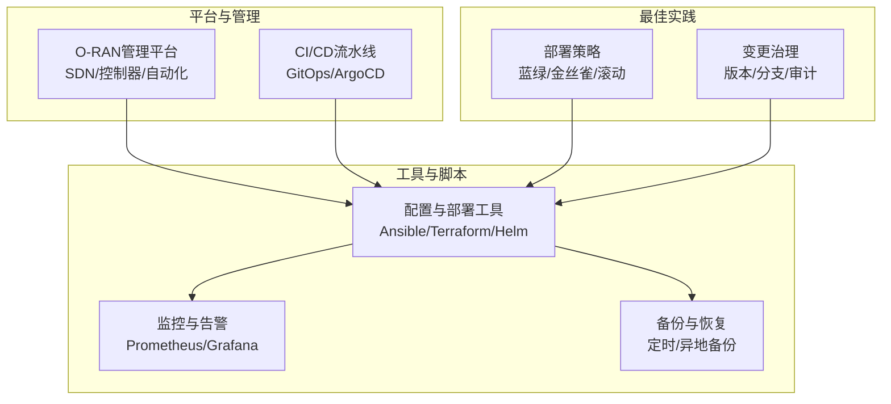

**章节来源**
- file://22-tool-platforms/management-platforms/o-ran-management-platforms.md#L1-L711
- file://30-best-practices/deployment-practices/o-ran-deployment-best-practices.md#L1-L273

## 核心组件
- 基础设施即代码（IaC）
  - Terraform模块化定义多云O-RAN基础设施，包括网络、计算与附加组件（如Cilium CNI、指标服务器、集群自动伸缩、Prometheus Operator等）
- 配置与部署自动化
  - Ansible Playbook按角色分层，覆盖Kubernetes初始化、O-DU/O-CU/RIC部署与健康校验
  - Helm图表管理O-RAN组件，含HPA/VPA、服务网格与可观测性
- 容器编排与GitOps
  - ArgoCD以GitOps方式声明式同步Kubernetes资源，支持自动同步、自愈与差异忽略
- CI/CD流水线
  - GitHub Actions工作流实现构建、测试、安全扫描、镜像推送与Kubernetes部署
- 监控与告警
  - Prometheus生态与Grafana仪表盘，支持指标采集、告警规则与自愈动作
- 自动化运维
  - 蓝绿/金丝雀/滚动更新策略；HPA/VPA自动扩缩容；自愈与备份恢复

**章节来源**
- file://22-tool-platforms/management-platforms/o-ran-management-platforms.md#L208-L291
- file://22-tool-platforms/management-platforms/o-ran-management-platforms.md#L618-L709
- file://22-tool-platforms/management-platforms/o-ran-management-platforms.md#L538-L616
- file://22-tool-platforms/development-tools/o-ran-development-toolkit.md#L417-L486
- file://17-open-source-ecosystem/developer-tools/oran-development-tools.md#L800-L907
- file://14-operations-management/monitoring-alerting/operations-monitoring-framework.md#L1-L800
- file://22-tool-platforms/utility-programs/o-ran-utility-programs.md#L563-L626

## 架构总览
下图展示O-RAN自动化与编排的整体架构：IaC负责基础设施与网络，Ansible负责系统与组件部署，Kubernetes承载容器化应用，Helm管理应用包，ArgoCD实现GitOps同步，CI/CD流水线贯穿开发到部署，Prometheus/Grafana提供监控与告警，自动化脚本支撑备份与恢复。

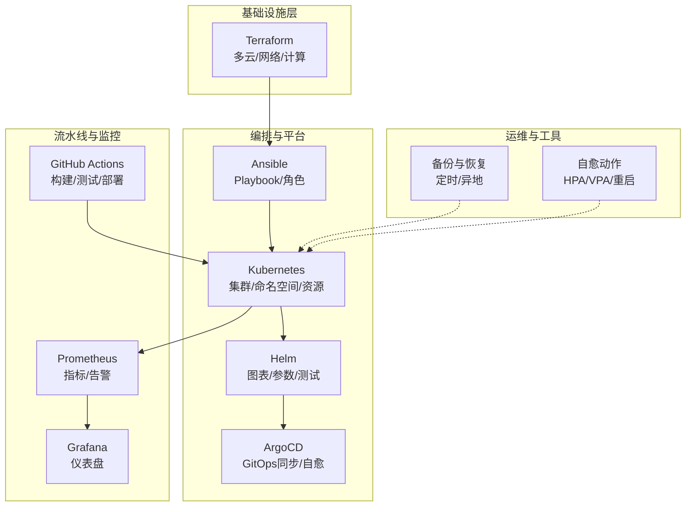

**图表来源**
- file://22-tool-platforms/management-platforms/o-ran-management-platforms.md#L618-L709
- file://22-tool-platforms/management-platforms/o-ran-management-platforms.md#L208-L291
- file://22-tool-platforms/management-platforms/o-ran-management-platforms.md#L538-L616
- file://22-tool-platforms/development-tools/o-ran-development-toolkit.md#L417-L486
- file://17-open-source-ecosystem/developer-tools/oran-development-tools.md#L800-L907
- file://14-operations-management/monitoring-alerting/operations-monitoring-framework.md#L1-L800
- file://22-tool-platforms/utility-programs/o-ran-utility-programs.md#L563-L626

## 详细组件分析

### 基础设施即代码（Terraform）
- 多云与网络：支持AWS/Azure/GCP/VMware，定义VPC/VNet、子网划分、安全组与DNS/证书
- 计算资源：Kubernetes集群、虚拟机、自动伸缩组与竞价实例
- 插件与附加：Cilium CNI、指标服务器、集群自动伸缩、Prometheus Operator等

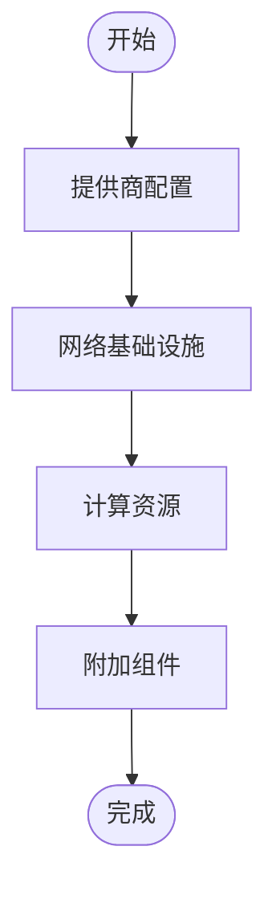

**图表来源**
- file://22-tool-platforms/management-platforms/o-ran-management-platforms.md#L618-L709

**章节来源**
- file://22-tool-platforms/management-platforms/o-ran-management-platforms.md#L618-L709

### Ansible自动化（Playbook与角色）
- 角色分层：Kubernetes初始化、O-DU/O-CU/RIC部署、监控栈部署
- 部署流程：预任务校验、按角色部署、后任务健康检查与工件收集
- 环境分离：dev/staging/prod动态库存与变量

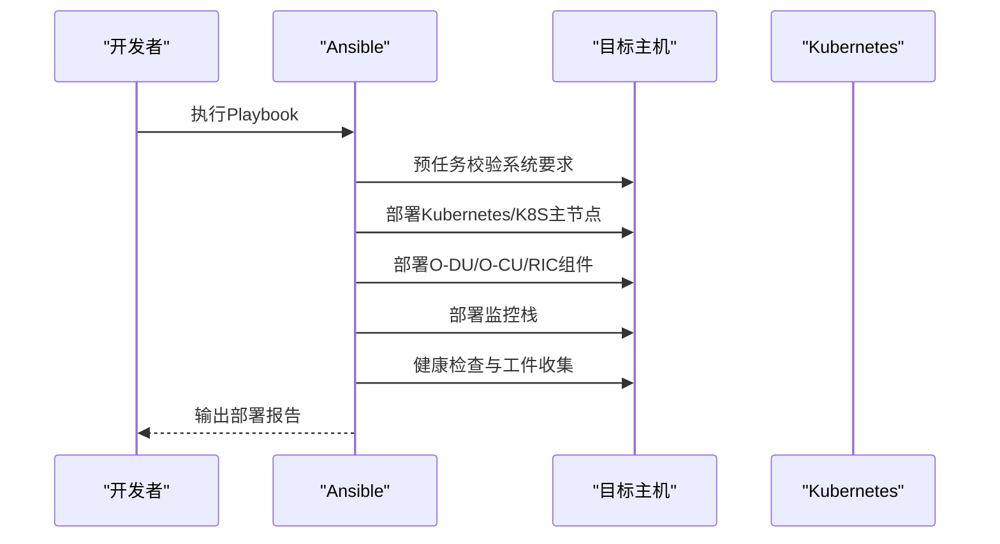

**图表来源**
- file://22-tool-platforms/management-platforms/o-ran-management-platforms.md#L208-L291

**章节来源**
- file://22-tool-platforms/management-platforms/o-ran-management-platforms.md#L208-L291

### Kubernetes与Helm编排
- Helm图表结构：templates/values/Chart/README
- 模板函数：条件资源创建、循环生成、字符串与数据结构操作
- 测试框架：helm unittest、kind集成、kube-score安全扫描、helm lint最佳实践
- RIC平台示例：Near-RT RIC Helm图表依赖PostgreSQL/Redis/Kafka，启用HPA/VPA与监控

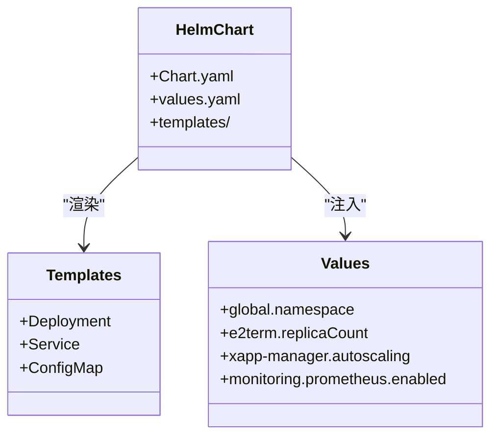

**图表来源**
- file://22-tool-platforms/development-tools/o-ran-development-toolkit.md#L222-L257
- file://22-tool-platforms/management-platforms/o-ran-management-platforms.md#L297-L390

**章节来源**
- file://22-tool-platforms/development-tools/o-ran-development-toolkit.md#L222-L257
- file://22-tool-platforms/management-platforms/o-ran-management-platforms.md#L297-L390

### GitOps与ArgoCD
- 仓库结构：clusters/applications/operators
- 应用配置：源仓库、目标命名空间、Helm参数、自动同步与自愈、差异忽略
- 信息字段：联系人、Slack频道等

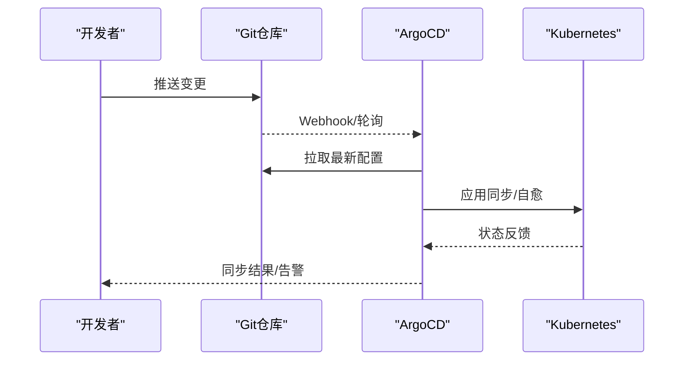

**图表来源**
- file://22-tool-platforms/management-platforms/o-ran-management-platforms.md#L538-L616

**章节来源**
- file://22-tool-platforms/management-platforms/o-ran-management-platforms.md#L538-L616

### CI/CD流水线（GitHub Actions）
- 作业编排：构建与测试、Docker镜像构建与推送、Kubernetes部署
- 质量门禁：Black/Flake8/Mypy、pytest、Codecov覆盖率上报
- 安全扫描：Trivy镜像漏洞扫描、CodeQL SARIF输出

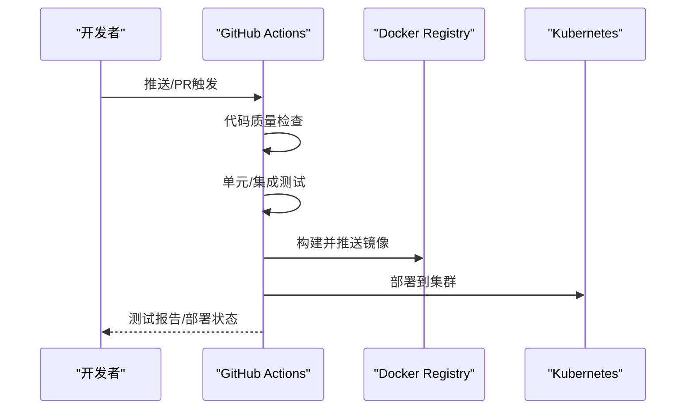

**图表来源**
- file://17-open-source-ecosystem/developer-tools/oran-development-tools.md#L800-L907
- file://22-tool-platforms/development-tools/o-ran-development-toolkit.md#L417-L486

**章节来源**
- file://17-open-source-ecosystem/developer-tools/oran-development-tools.md#L800-L907
- file://22-tool-platforms/development-tools/o-ran-development-toolkit.md#L417-L486

### 监控与告警（Prometheus/Grafana）
- 多层监控：基础设施/应用/业务KPI
- 指标采集：系统、K8s、存储、网络、RIC、接口、微服务、性能、业务KPI
- 告警引擎：阈值规则、分类分级、通知通道、去重与关联
- 仪表盘：实时看板、趋势图、告警分布

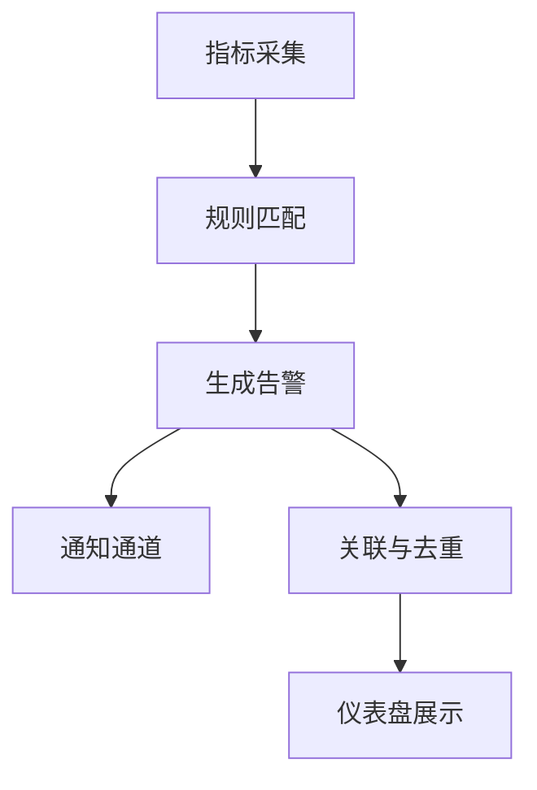

**图表来源**
- file://14-operations-management/monitoring-alerting/operations-monitoring-framework.md#L1-L800
- file://28-monitoring-alerting/monitoring-tools/o-ran-monitoring-tools.md#L136-L186

**章节来源**
- file://14-operations-management/monitoring-alerting/operations-monitoring-framework.md#L1-L800
- file://28-monitoring-alerting/monitoring-tools/o-ran-monitoring-tools.md#L136-L186

### 自动化运维（自愈、扩缩容、备份）
- 自愈动作：CPU/内存/RIC无响应等场景的自动处置（扩缩容、重启、清理缓存等）
- 自动扩缩容：HPA/VPA基于CPU/内存/请求量等指标自动调整副本数或资源限制
- 备份与恢复：Kubernetes配置、O-RAN配置、持久卷快照、数据库与日志归档，支持异地备份与时间点恢复

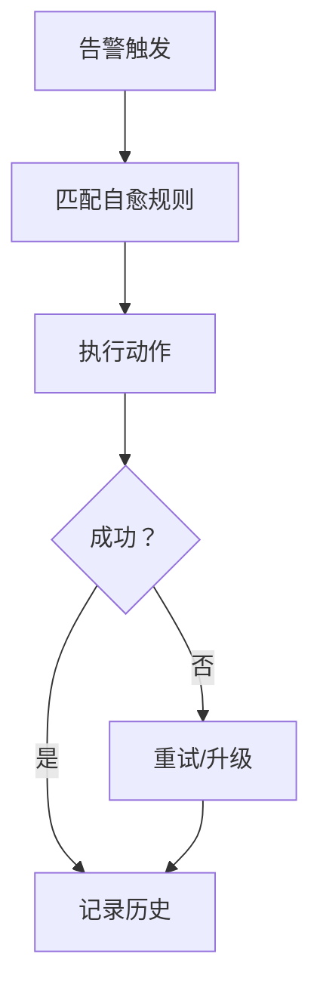

**图表来源**
- file://14-operations-management/monitoring-alerting/operations-monitoring-framework.md#L694-L907
- file://22-tool-platforms/utility-programs/o-ran-utility-programs.md#L563-L626

**章节来源**
- file://14-operations-management/monitoring-alerting/operations-monitoring-framework.md#L694-L907
- file://22-tool-platforms/utility-programs/o-ran-utility-programs.md#L563-L626

### 部署策略与最佳实践
- 蓝绿/金丝雀/滚动更新：零停机发布、渐进式流量切换、增量升级与特性开关
- 分阶段部署：试点→逐步扩展→自动化运维→业务创新
- 变更治理：版本控制、分支策略、变更审批与回滚、审计追踪
- 质量与合规：测试标准、质量门禁、内部/外部审计、风险识别与缓解

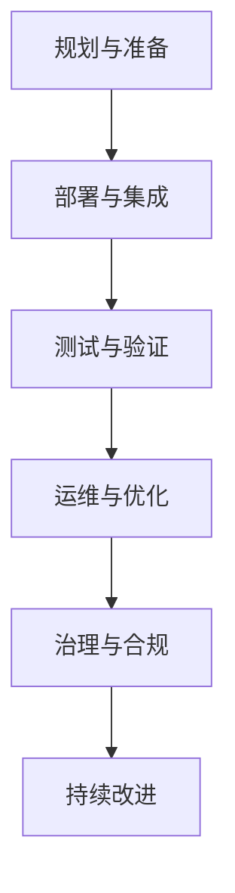

**图表来源**
- file://30-best-practices/deployment-practices/o-ran-deployment-best-practices.md#L53-L130

**章节来源**
- file://30-best-practices/deployment-practices/o-ran-deployment-best-practices.md#L53-L130

## 依赖关系分析
- Terraform依赖Ansible/Kubernetes：先通过Terraform搭建网络与集群，再由Ansible/Kubernetes部署应用
- ArgoCD依赖Helm：通过Helm图表管理应用，ArgoCD以GitOps方式同步
- CI/CD依赖容器镜像与Kubernetes：Actions构建镜像并部署到集群
- 监控依赖Kubernetes与应用：Prometheus抓取指标，Grafana展示
- 自愈依赖监控与Kubernetes：告警驱动自愈动作，K8s执行扩缩容/重启等

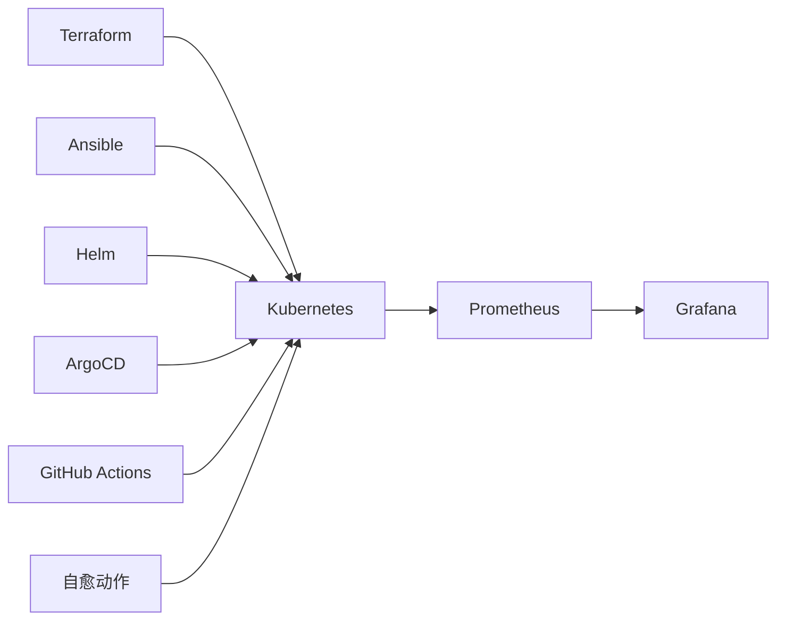

**图表来源**
- file://22-tool-platforms/management-platforms/o-ran-management-platforms.md#L618-L709
- file://22-tool-platforms/management-platforms/o-ran-management-platforms.md#L208-L291
- file://22-tool-platforms/management-platforms/o-ran-management-platforms.md#L538-L616
- file://17-open-source-ecosystem/developer-tools/oran-development-tools.md#L800-L907
- file://14-operations-management/monitoring-alerting/operations-monitoring-framework.md#L1-L800
- file://22-tool-platforms/utility-programs/o-ran-utility-programs.md#L563-L626

**章节来源**
- file://22-tool-platforms/management-platforms/o-ran-management-platforms.md#L618-L709
- file://22-tool-platforms/management-platforms/o-ran-management-platforms.md#L208-L291
- file://22-tool-platforms/management-platforms/o-ran-management-platforms.md#L538-L616
- file://17-open-source-ecosystem/developer-tools/oran-development-tools.md#L800-L907
- file://14-operations-management/monitoring-alerting/operations-monitoring-framework.md#L1-L800
- file://22-tool-platforms/utility-programs/o-ran-utility-programs.md#L563-L626

## 性能考量
- 自动化与编排的性能影响
  - IaC与Ansible：合理拆分任务、并发与幂等性，避免重复配置
  - Kubernetes：HPA/VPA合理阈值与资源请求/限制，避免过度扩缩容抖动
  - GitOps：ArgoCD同步策略与差异忽略，降低不必要的资源变更
  - CI/CD：并行作业、缓存与镜像层优化，缩短流水线时长
  - 监控：指标粒度与采样频率平衡，避免监控开销过大
- 可靠性增强
  - 多云/异地部署与备份策略，提升容灾能力
  - 自愈动作与SLA指标联动，降低MTTR
  - 分阶段部署与灰度发布，降低变更风险

[本节为通用指导，无需特定文件引用]

## 故障排查指南
- 监控与告警
  - 使用仪表盘定位异常，结合告警规则与去重策略确认真实问题
  - 关注基础设施、应用与业务KPI的关联性
- 自愈与扩缩容
  - 检查HPA/VPA阈值是否合理，确认扩缩容事件与告警的一致性
  - 若自愈动作失败，查看历史记录与重试策略
- 备份与恢复
  - 核对备份策略与保留周期，验证恢复流程与数据一致性
  - 异地备份链路与权限配置检查
- 部署与回滚
  - 通过版本控制与分支策略追溯变更，必要时执行回滚
  - 结合健康检查与日志分析定位问题根因

**章节来源**
- file://14-operations-management/monitoring-alerting/operations-monitoring-framework.md#L694-L907
- file://22-tool-platforms/utility-programs/o-ran-utility-programs.md#L563-L626
- file://30-best-practices/deployment-practices/o-ran-deployment-best-practices.md#L100-L130

## 结论
通过将Terraform、Ansible、Kubernetes/Helm、ArgoCD、CI/CD流水线与监控告警体系有机整合，O-RAN可以实现从基础设施到应用的全链路自动化与编排。结合蓝绿/金丝雀发布、HPA/VPA、自愈与备份恢复等运维能力，能够显著提升部署效率与系统可靠性。建议在实际落地中遵循分阶段部署与变更治理流程，持续优化自动化策略与监控指标，确保业务连续性与服务质量。

[本节为总结性内容，无需特定文件引用]

## 附录
- 工具与脚本清单
  - 配置管理：O-RAN配置管理器、NETCONF客户端工具
  - 部署自动化：O-RAN集群预置器、健康检查器
  - 监控采集：O-RAN指标采集器、日志处理器
  - 备份与恢复：O-RAN配置备份脚本
- 最佳实践参考
  - 部署策略与变更治理
  - 风险管理与合规审计
  - 运维效率与持续改进

**章节来源**
- file://22-tool-platforms/utility-programs/o-ran-utility-programs.md#L1-L628
- file://30-best-practices/deployment-practices/o-ran-deployment-best-practices.md#L1-L273
- file://02-core-components/o-cu.md#L283-L320
- file://04-disaggregation-options/deployment-scenarios.md#L216-L456