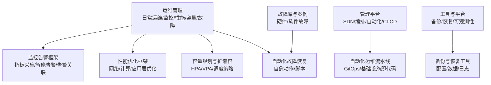
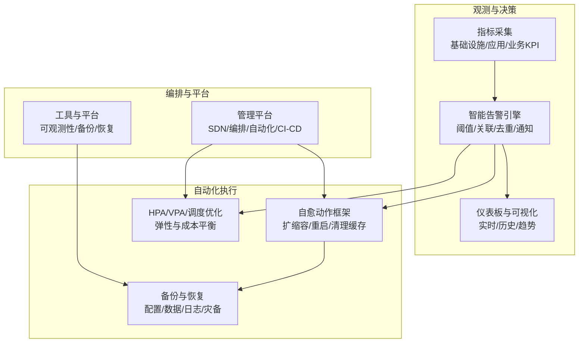
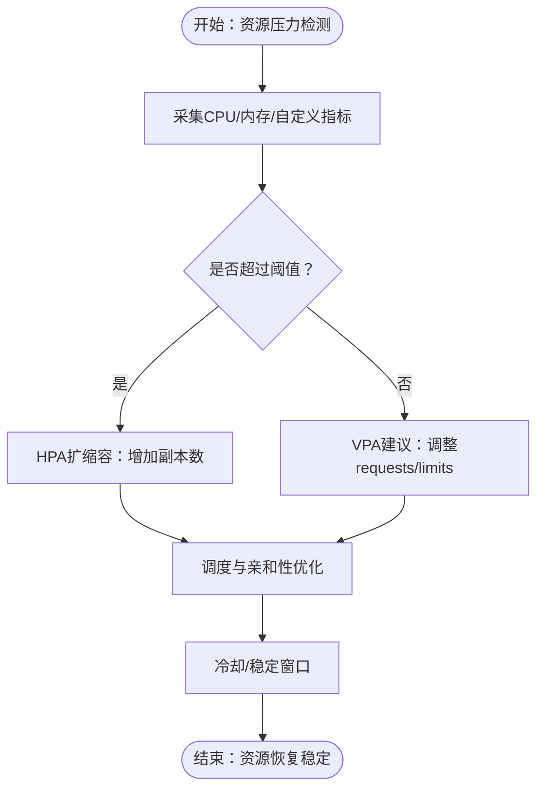
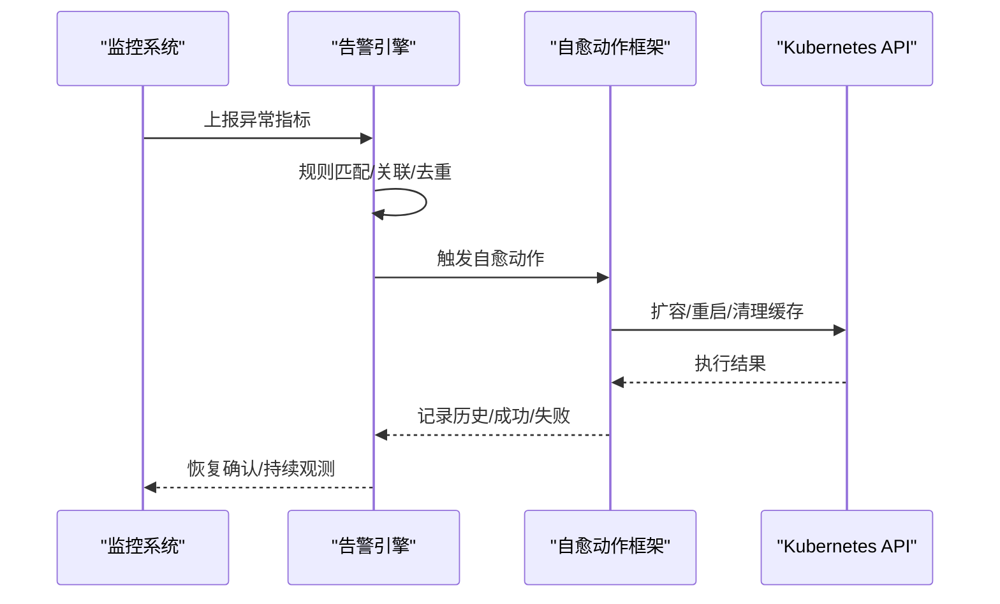
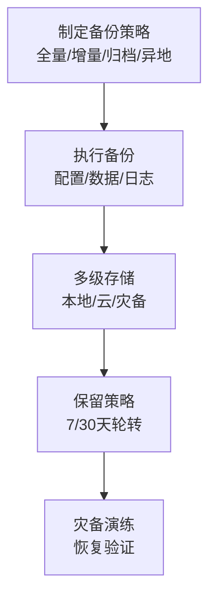
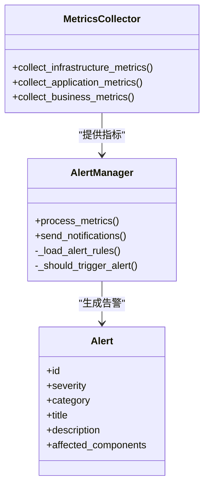
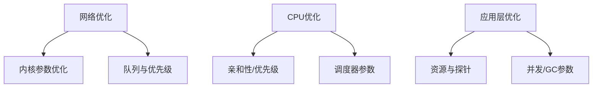
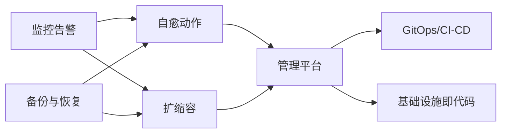

# 自动化运维

<cite>
**本文引用的文件**
- [README（运维管理）](file://14-operations-management/readme-zh.md)
- [日常运维程序](file://14-operations-management/daily-operations/daily-operation-procedures-zh.md)
- [监控告警框架](file://14-operations-management/monitoring-alerting/operations-monitoring-framework-zh.md)
- [性能优化框架](file://14-operations-management/performance-optimization/performance-optimization-framework-zh.md)
- [管理平台](file://22-tool-platforms/management-platforms/o-ran-management-platforms-zh.md)
- [备份与恢复工具](file://22-tool-platforms/utility-programs/o-ran-utility-programs-zh.md)
- [自动化故障恢复脚本](file://14-operations-management/fault-handling/fault-troubleshooting-guide.md)
- [容量规划与扩缩容配置](file://14-operations-management/capacity-planning/capacity-planning-framework.md)
- [资源配额与扩缩容](file://26-performance-optimization/capacity-planning/o-ran-capacity-planning.md)
</cite>

## 目录
1. [简介](#简介)
2. [项目结构](#项目结构)
3. [核心组件](#核心组件)
4. [架构总览](#架构总览)
5. [详细组件分析](#详细组件分析)
6. [依赖关系分析](#依赖关系分析)
7. [性能考量](#性能考量)
8. [故障排查与恢复指南](#故障排查与恢复指南)
9. [结论](#结论)
10. [附录](#附录)

## 简介
本文件面向O-RAN自动化运维，围绕“自动化扩缩容（HPA/VPA/调度优化）、自动化故障恢复（自愈机制/检测与恢复流程）、自动化备份（定期/异地/恢复流程）、监控告警与日志分析、性能优化、配置与变更管理、安全加固、实施策略与效率提升”等方面，结合仓库现有文档，形成可落地的运维指导与可视化说明，帮助在云原生环境下实现稳定、高效、自治的O-RAN网络运营。

## 项目结构
本仓库中与自动化运维密切相关的知识域主要分布在以下目录：
- 运维管理：日常运维、监控告警、性能优化、容量规划、故障处理、自动化平台等
- 工具与平台：管理平台（SDN/编排/自动化）、实用工具（备份/恢复）
- 故障库与案例：硬件/软件故障库与案例，支撑自动化恢复与根因分析

**章节来源**
- file://14-operations-management/readme-zh.md#L1-L126

## 核心组件
- 自动化扩缩容：HPA（基于CPU/内存/自定义指标）与VPA（自动建议资源请求/限制）配合集群自动扩缩容，实现弹性与成本平衡
- 自动化故障恢复：基于告警的自愈动作框架，结合脚本与平台能力实现快速恢复
- 自动化备份：多层级备份策略（全量/增量/归档）与异地灾备，配套恢复流程
- 监控告警与日志：多层指标采集、阈值规则、智能告警与通知、仪表板与可视化
- 性能优化：网络接口优化、CPU亲和性与调度、容器资源优化、性能仪表板
- 配置与变更管理：变更流程、回滚机制、配置漂移检测
- 安全加固：平台安全、密钥与证书管理、访问控制与合规

**章节来源**
- file://14-operations-management/performance-optimization/performance-optimization-framework-zh.md#L1-L342
- file://14-operations-management/monitoring-alerting/operations-monitoring-framework-zh.md#L1-L909
- file://14-operations-management/daily-operations/daily-operation-procedures-zh.md#L1-L419
- file://22-tool-platforms/management-platforms/o-ran-management-platforms-zh.md#L1-L711
- file://22-tool-platforms/utility-programs/o-ran-utility-programs-zh.md#L563-L626

## 架构总览
下图展示自动化运维在O-RAN中的整体架构：由“监控与告警”驱动“自愈与扩缩容”，“备份与恢复”贯穿全生命周期，“管理平台与工具”提供编排与自动化能力。

**图示来源**
- [监控告警框架](file://14-operations-management/monitoring-alerting/operations-monitoring-framework-zh.md#L48-L260)
- [自动化修复](file://14-operations-management/monitoring-alerting/operations-monitoring-framework-zh.md#L698-L907)
- [管理平台](file://22-tool-platforms/management-platforms/o-ran-management-platforms-zh.md#L538-L709)
- [备份与恢复工具](file://22-tool-platforms/utility-programs/o-ran-utility-programs-zh.md#L563-L626)

## 详细组件分析

### 自动化扩缩容：HPA、VPA与调度优化
- HPA（水平Pod自动伸缩）
  - 基于CPU/内存/网络/吞吐等指标与自定义指标进行弹性扩缩
  - 配置冷却期、最小/最大副本数、缩放因子，避免震荡
- VPA（垂直Pod自动伸缩）
  - 建议容器requests/limits，支持就地更新或滚动更新
  - 结合HPA形成“纵向+横向”的资源优化闭环
- 调度与资源优化
  - CPU亲和性与调度器参数优化，降低延迟
  - 容器资源requests/limits与探针配置，提升稳定性
  - 集群自动扩缩容（Cluster Autoscaler）与多区域策略

**图示来源**
- [容量规划与扩缩容配置](file://14-operations-management/capacity-planning/capacity-planning-framework.md#L230-L266)
- [资源配额与扩缩容](file://26-performance-optimization/capacity-planning/o-ran-capacity-planning.md#L76-L144)
- [性能优化框架](file://14-operations-management/performance-optimization/performance-optimization-framework-zh.md#L103-L234)

**章节来源**
- file://14-operations-management/capacity-planning/capacity-planning-framework.md#L230-L266
- file://26-performance-optimization/capacity-planning/o-ran-capacity-planning.md#L76-L144
- file://14-operations-management/performance-optimization/performance-optimization-framework-zh.md#L103-L234

### 自动化故障恢复：自愈机制设计与流程
- 告警驱动的自愈动作
  - 高CPU使用率：扩容部署、重启容器、清理缓存
  - 内存耗尽：重启内存密集型Pod、提高内存限制、驱逐低优先级Pod
  - RIC无响应：重启容器、检查E2连接、校验数据库连通性
- 自动化恢复脚本
  - 针对E2/F1/O-FH等接口的恢复流程，包含服务重启、健康检查、可达性验证
- 告警关联与去重
  - 多源告警聚合，避免风暴与误报，提升恢复优先级

**图示来源**
- [监控告警框架](file://14-operations-management/monitoring-alerting/operations-monitoring-framework-zh.md#L266-L486)
- [自动化修复](file://14-operations-management/monitoring-alerting/operations-monitoring-framework-zh.md#L698-L907)
- [自动化故障恢复脚本](file://14-operations-management/fault-handling/fault-troubleshooting-guide.md#L572-L633)

**章节来源**
- file://14-operations-management/monitoring-alerting/operations-monitoring-framework-zh.md#L266-L486
- file://14-operations-management/monitoring-alerting/operations-monitoring-framework-zh.md#L698-L907
- file://14-operations-management/fault-handling/fault-troubleshooting-guide.md#L572-L633

### 自动化备份：定期备份、异地灾备与恢复流程
- 备份策略
  - 全量/增量/归档：按日/按时/按周安排
  - 多级存储：本地/对象存储/异地灾备
- 备份内容
  - Kubernetes资源配置、Secrets、ConfigMaps、Deployment等
  - 持久卷快照、数据库导出、日志归档
- 恢复流程
  - 时间点恢复、自动化恢复脚本、配置回滚、灾备演练

**图示来源**
- [日常运维程序（配置备份与恢复）](file://14-operations-management/daily-operations/daily-operation-procedures-zh.md#L165-L217)
- [备份与恢复工具](file://22-tool-platforms/utility-programs/o-ran-utility-programs-zh.md#L563-L626)

**章节来源**
- file://14-operations-management/daily-operations/daily-operation-procedures-zh.md#L165-L217
- file://22-tool-platforms/utility-programs/o-ran-utility-programs-zh.md#L563-L626

### 监控告警与日志分析：指标体系、规则与可视化
- 指标采集
  - 基础设施：CPU/内存/磁盘/网络IO
  - 应用：RIC状态、接口可用性、服务响应时间、吞吐量
  - 业务：KPI/SLA/QoS/业务影响
- 告警规则
  - 阈值类、趋势类、关联类规则；分级与通知渠道
- 可视化与仪表板
  - 实时/历史/趋势面板，支持WebSocket推送与告警列表

**图示来源**
- [监控告警框架（指标采集）](file://14-operations-management/monitoring-alerting/operations-monitoring-framework-zh.md#L48-L260)
- [监控告警框架（告警管理）](file://14-operations-management/monitoring-alerting/operations-monitoring-framework-zh.md#L266-L486)

**章节来源**
- file://14-operations-management/monitoring-alerting/operations-monitoring-framework-zh.md#L48-L260
- file://14-operations-management/monitoring-alerting/operations-monitoring-framework-zh.md#L266-L486

### 性能优化：网络、计算与应用层
- 网络优化
  - 关闭可能导致问题的网络卸载、巨帧、TC队列与优先级标记
  - 内核参数优化（TCP拥塞控制、缓冲区、延迟）
  - NUMA感知的中断绑定
- 计算优化
  - CPU亲和性与进程优先级、内核调度器参数
- 应用层优化
  - 容器资源requests/limits、探针、并发与GC参数

**图示来源**
- [性能优化框架（网络）](file://14-operations-management/performance-optimization/performance-optimization-framework-zh.md#L9-L101)
- [性能优化框架（计算）](file://14-operations-management/performance-optimization/performance-optimization-framework-zh.md#L103-L234)
- [性能优化框架（应用层）](file://14-operations-management/performance-optimization/performance-optimization-framework-zh.md#L236-L342)

**章节来源**
- file://14-operations-management/performance-optimization/performance-optimization-framework-zh.md#L9-L101
- file://14-operations-management/performance-optimization/performance-optimization-framework-zh.md#L103-L234
- file://14-operations-management/performance-optimization/performance-optimization-framework-zh.md#L236-L342

### 配置管理、变更管理与安全加固
- 配置管理
  - 配置项清单、备份位置与频率、备份脚本
- 变更管理
  - 变更请求模板、影响评估、审批与排期、实施前后验证、回滚程序
- 安全加固
  - 密钥与证书管理、访问控制、合规与审计

**章节来源**
- file://14-operations-management/daily-operations/daily-operation-procedures-zh.md#L165-L281
- file://22-tool-platforms/utility-programs/o-ran-utility-programs-zh.md#L563-L626

### 自动化运维平台与实施策略
- 管理平台
  - SDN控制器（ONOS/OpenDaylight）、编排与自动化（ONAP/Ansible）、GitOps（ArgoCD）、基础设施即代码（Terraform）
- 实施策略
  - GitOps流水线、IaC、无人值守运维、CI/CD与发布策略

**章节来源**
- file://22-tool-platforms/management-platforms/o-ran-management-platforms-zh.md#L10-L711

## 依赖关系分析
- 监控与告警是自动化运维的中枢，驱动自愈与扩缩容
- 自动化平台（GitOps/编排/SDN）提供执行载体
- 备份与恢复贯穿全生命周期，保障业务连续性
- 性能优化为自动化提供基础能力，降低触发阈值与恢复成本

**图示来源**
- [监控告警框架](file://14-operations-management/monitoring-alerting/operations-monitoring-framework-zh.md#L266-L486)
- [管理平台](file://22-tool-platforms/management-platforms/o-ran-management-platforms-zh.md#L538-L709)

**章节来源**
- file://14-operations-management/monitoring-alerting/operations-monitoring-framework-zh.md#L266-L486
- file://22-tool-platforms/management-platforms/o-ran-management-platforms-zh.md#L538-L709

## 性能考量
- 通过HPA/VPA与调度优化，减少抖动与资源浪费
- 网络与内核参数优化降低延迟与提升吞吐
- 指标与告警规则的合理阈值与去重，避免误报与风暴
- 备份与恢复策略的自动化与演练，缩短RTO/RPO

[本节为通用指导，无需列出具体文件来源]

## 故障排查与恢复指南
- 常见接口问题与排查步骤：E2/F1/O-FH等接口连接、性能、同步问题
- 自动化恢复脚本：针对不同组件的恢复流程与验证
- 告警升级与沟通协议：严重性分级、响应与升级时间线、内外部沟通

**章节来源**
- file://14-operations-management/fault-handling/fault-troubleshooting-guide.md#L572-L633
- file://14-operations-management/monitoring-alerting/operations-monitoring-framework-zh.md#L266-L486

## 结论
通过“监控告警—自愈—扩缩容—备份—平台编排—性能优化—配置与安全”的闭环，O-RAN可在云原生环境中实现高度自动化与自治化运维。建议优先落地HPA/VPA与自愈动作框架，配合GitOps与IaC，构建可重复、可审计、可恢复的自动化运维体系。

[本节为总结性内容，无需列出具体文件来源]

## 附录
- 运维效率提升方法
  - 标准化变更流程与自动化脚本
  - 告警规则与仪表板的持续优化
  - 定期灾备演练与性能基线对比
  - 团队协作与知识传承机制

[本节为通用指导，无需列出具体文件来源]