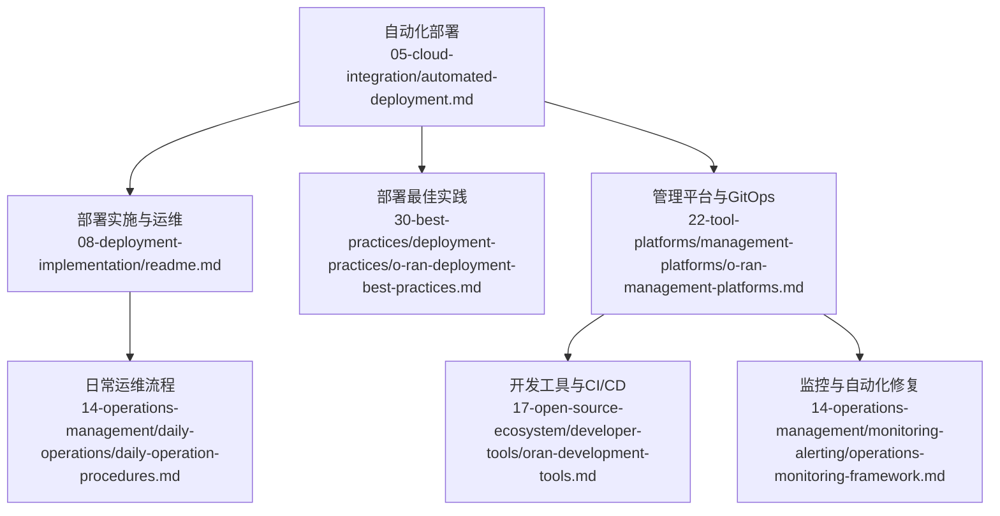
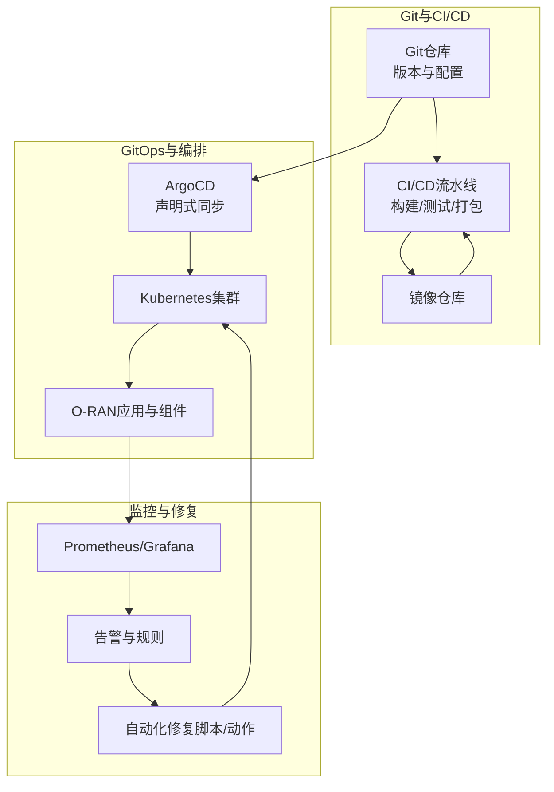
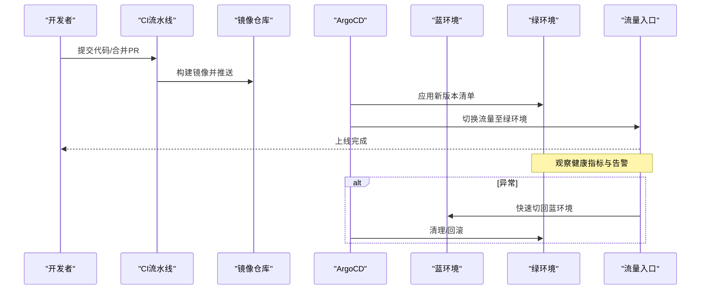
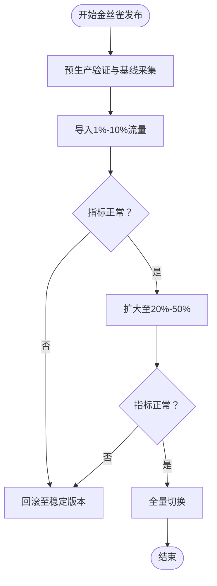
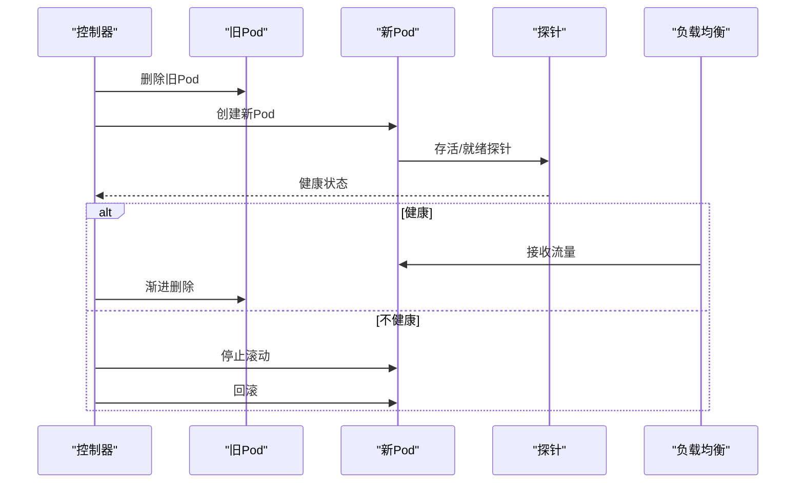
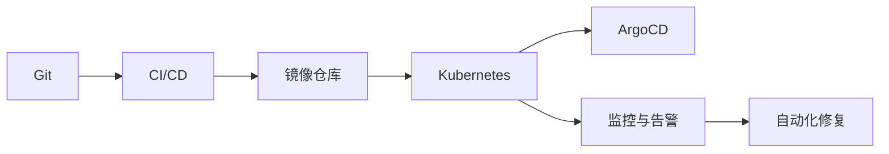

# 自动化部署

<cite>
**本文引用的文件**
- [自动化部署.md](file://05-cloud-integration/automated-deployment.md)
- [部署实施.md](file://08-deployment-implementation/readme.md)
- [部署最佳实践.md](file://30-best-practices/deployment-practices/o-ran-deployment-best-practices.md)
- [管理平台.md](file://22-tool-platforms/management-platforms/o-ran-management-platforms.md)
- [开发工具.md](file://17-open-source-ecosystem/developer-tools/oran-development-tools.md)
- [日常运维流程.md](file://14-operations-management/daily-operations/daily-operation-procedures.md)
- [监控与告警框架.md](file://14-operations-management/monitoring-alerting/operations-monitoring-framework.md)
</cite>

## 目录
1. [简介](#简介)
2. [项目结构](#项目结构)
3. [核心组件](#核心组件)
4. [架构总览](#架构总览)
5. [详细组件分析](#详细组件分析)
6. [依赖分析](#依赖分析)
7. [性能考虑](#性能考虑)
8. [故障排查指南](#故障排查指南)
9. [结论](#结论)
10. [附录](#附录)

## 简介
本文件面向O-RAN自动化部署，围绕蓝绿部署、金丝雀发布、滚动更新等零停机发布策略进行系统化梳理，并结合版本管理、配置管理与环境一致性保障，给出预生产验证、生产部署与回滚策略的实施指南与最佳实践。内容基于仓库内现有文档提炼与整合，帮助读者在真实环境中落地自动化部署与运维。

## 项目结构
本主题相关内容主要分布在以下模块：
- 云原生与自动化部署：05-cloud-integration/automated-deployment.md
- 部署实施与运维：08-deployment-implementation/readme.md、14-operations-management/daily-operations/daily-operation-procedures.md
- 部署最佳实践：30-best-practices/deployment-practices/o-ran-deployment-best-practices.md
- 管理平台与GitOps：22-tool-platforms/management-platforms/o-ran-management-platforms.md
- 开发工具与CI/CD：17-open-source-ecosystem/developer-tools/oran-development-tools.md
- 监控与自动化修复：14-operations-management/monitoring-alerting/operations-monitoring-framework.md

图表来源
- [自动化部署.md](file://05-cloud-integration/automated-deployment.md#L1-L353)
- [部署实施.md](file://08-deployment-implementation/readme.md#L1-L353)
- [部署最佳实践.md](file://30-best-practices/deployment-practices/o-ran-deployment-best-practices.md#L1-L273)
- [管理平台.md](file://22-tool-platforms/management-platforms/o-ran-management-platforms.md#L1-L711)
- [开发工具.md](file://17-open-source-ecosystem/developer-tools/oran-development-tools.md#L1-L994)
- [日常运维流程.md](file://14-operations-management/daily-operations/daily-operation-procedures.md#L1-L443)
- [监控与告警框架.md](file://14-operations-management/monitoring-alerting/operations-monitoring-framework.md#L694-L907)

章节来源
- [自动化部署.md](file://05-cloud-integration/automated-deployment.md#L1-L353)
- [部署实施.md](file://08-deployment-implementation/readme.md#L1-L353)

## 核心组件
- 蓝绿部署：通过双环境并行，实现零停机切换与快速回滚。
- 金丝雀发布：按流量比例渐进式放量，结合健康检查与指标阈值进行回滚。
- 滚动更新：分批替换实例，维持服务连续性与弹性伸缩。
- 版本管理：以Git为主，配合分支策略与变更审批，确保可追溯与可回滚。
- 配置管理：集中化配置与版本控制，结合IaC与GitOps实现一致性。
- 环境一致性：通过容器镜像、Kubernetes清单与GitOps声明式管理，确保各环境一致。
- 预生产验证：单元/集成测试、负载与压力测试、回归测试与自动化验收。
- 生产部署：CI/CD流水线驱动，结合健康检查与自动化修复。
- 回滚策略：基于版本标签与GitOps同步策略，快速回退至稳定版本。

章节来源
- [部署最佳实践.md](file://30-best-practices/deployment-practices/o-ran-deployment-best-practices.md#L100-L130)
- [部署实施.md](file://08-deployment-implementation/readme.md#L296-L320)
- [管理平台.md](file://22-tool-platforms/management-platforms/o-ran-management-platforms.md#L534-L616)
- [日常运维流程.md](file://14-operations-management/daily-operations/daily-operation-procedures.md#L269-L280)

## 架构总览
下图展示自动化部署在O-RAN中的整体架构：以Git为单一事实源，通过CI/CD流水线与GitOps（ArgoCD）实现声明式部署；结合监控与自动化修复，形成闭环的发布与运维体系。

图表来源
- [管理平台.md](file://22-tool-platforms/management-platforms/o-ran-management-platforms.md#L534-L616)
- [开发工具.md](file://17-open-source-ecosystem/developer-tools/oran-development-tools.md#L799-L906)
- [监控与告警框架.md](file://14-operations-management/monitoring-alerting/operations-monitoring-framework.md#L694-L907)

## 详细组件分析

### 蓝绿部署策略
- 设计原理
  - 两套完全相同的运行环境（蓝/绿），通过流量切换实现发布与回滚。
  - 发布前在蓝环境完成预生产验证，切换至绿环境后进行短时健康检查，确认无异常再切流量。
- 实施步骤
  - 准备两套Kubernetes命名空间或集群，分别对应蓝/绿环境。
  - 通过ArgoCD或Helm管理两套应用清单，确保配置一致。
  - 在预生产环境执行端到端测试与性能压测。
  - 切换服务入口（如Ingress/Service）指向新版本，观察指标与日志。
  - 若异常，立即切回旧版本，清理新版本资源。
- 切换机制
  - 通过服务网格或入口控制器的权重/路由切换，实现零停机。
  - 结合健康检查（存活/就绪探针）与指标阈值（延迟、错误率）作为切换门禁。

图表来源
- [管理平台.md](file://22-tool-platforms/management-platforms/o-ran-management-platforms.md#L534-L616)
- [部署最佳实践.md](file://30-best-practices/deployment-practices/o-ran-deployment-best-practices.md#L100-L130)

章节来源
- [部署最佳实践.md](file://30-best-practices/deployment-practices/o-ran-deployment-best-practices.md#L100-L130)
- [部署实施.md](file://08-deployment-implementation/readme.md#L296-L320)
- [管理平台.md](file://22-tool-platforms/management-platforms/o-ran-management-platforms.md#L534-L616)

### 金丝雀发布流程
- 渐进式发布策略
  - 以小部分流量（如1%-10%）导入新版本，持续观察关键指标。
  - 逐步放大流量比例，直至全部切换。
- 流量分配
  - 通过Ingress/网关或服务网格（Istio/Linkerd）进行细粒度流量切分。
  - 可按用户、区域或会话维度进行目标化放量。
- 回滚机制
  - 当指标异常（延迟升高、错误率上升、资源耗尽）时，立即停止放量并回滚。
  - 回滚可通过GitOps同步策略或入口权重重置实现。

图表来源
- [部署最佳实践.md](file://30-best-practices/deployment-practices/o-ran-deployment-best-practices.md#L100-L130)
- [日常运维流程.md](file://14-operations-management/daily-operations/daily-operation-procedures.md#L269-L280)

章节来源
- [部署最佳实践.md](file://30-best-practices/deployment-practices/o-ran-deployment-best-practices.md#L100-L130)
- [日常运维流程.md](file://14-operations-management/daily-operations/daily-operation-procedures.md#L269-L280)

### 滚动更新机制
- 零停机部署
  - 通过副本级滚动升级，逐批替换Pod，保持服务连续性。
  - 配合就绪探针与优雅退出，确保请求不被中断。
- 健康检查
  - 存活/就绪探针用于判断Pod健康状态。
  - 指标阈值（CPU/内存/延迟/错误率）作为人工干预门禁。
- 故障恢复
  - 当滚动过程中出现异常，自动暂停并进入回滚流程。
  - 通过GitOps同步策略回退到上一个稳定版本。

图表来源
- [管理平台.md](file://22-tool-platforms/management-platforms/o-ran-management-platforms.md#L534-L616)
- [监控与告警框架.md](file://14-operations-management/monitoring-alerting/operations-monitoring-framework.md#L694-L907)

章节来源
- [管理平台.md](file://22-tool-platforms/management-platforms/o-ran-management-platforms.md#L534-L616)
- [监控与告警框架.md](file://14-operations-management/monitoring-alerting/operations-monitoring-framework.md#L694-L907)

### 版本管理、配置管理与环境一致性
- 版本管理
  - Git作为单一事实源，采用分支策略（develop/main/release/hotfix）与约定式提交。
  - 通过CI/CD流水线生成带语义化版本的镜像标签，便于追踪与回滚。
- 配置管理
  - 集中式配置（Helm Values、Kustomize补丁、ArgoCD参数）统一管理。
  - 配置项纳入版本控制，变更走审批与审计。
- 环境一致性
  - 通过容器镜像与Kubernetes清单实现“声明式”一致性。
  - GitOps（ArgoCD）确保目标状态与实际状态一致，自动修复漂移。

章节来源
- [部署最佳实践.md](file://30-best-practices/deployment-practices/o-ran-deployment-best-practices.md#L100-L130)
- [管理平台.md](file://22-tool-platforms/management-platforms/o-ran-management-platforms.md#L534-L616)
- [开发工具.md](file://17-open-source-ecosystem/developer-tools/oran-development-tools.md#L799-L906)

### 预生产验证、生产部署与回滚策略
- 预生产验证
  - 单元/集成测试、端到端场景测试、性能与压力测试、安全扫描与合规检查。
  - 通过CI流水线自动化执行，失败即阻断发布。
- 生产部署
  - 由CI/CD流水线触发，结合GitOps声明式同步，确保一致性与可重复性。
  - 发布后进行健康检查与指标观测，必要时触发自动化修复。
- 回滚策略
  - 基于版本标签与Git历史快速回退。
  - GitOps同步策略支持自动修剪与自愈，确保回滚后系统恢复稳定。

章节来源
- [部署最佳实践.md](file://30-best-practices/deployment-practices/o-ran-deployment-best-practices.md#L85-L98)
- [部署实施.md](file://08-deployment-implementation/readme.md#L296-L320)
- [日常运维流程.md](file://14-operations-management/daily-operations/daily-operation-procedures.md#L269-L280)

## 依赖分析
- 组件耦合
  - Git与CI/CD：代码变更驱动构建与测试。
  - CI/CD与镜像仓库：制品管理与版本标签。
  - GitOps与Kubernetes：声明式同步与自愈。
  - 监控与告警：指标驱动的自动化修复与回滚。
- 外部依赖
  - ArgoCD、Helm、Kubernetes、Prometheus/Grafana、容器镜像仓库。
- 潜在风险
  - 配置漂移导致的不一致。
  - 告警风暴与误报引发的人工干预。
  - 回滚窗口与数据一致性（如数据库迁移）需额外策略。

图表来源
- [管理平台.md](file://22-tool-platforms/management-platforms/o-ran-management-platforms.md#L534-L616)
- [开发工具.md](file://17-open-source-ecosystem/developer-tools/oran-development-tools.md#L799-L906)
- [监控与告警框架.md](file://14-operations-management/monitoring-alerting/operations-monitoring-framework.md#L694-L907)

章节来源
- [管理平台.md](file://22-tool-platforms/management-platforms/o-ran-management-platforms.md#L534-L616)
- [开发工具.md](file://17-open-source-ecosystem/developer-tools/oran-development-tools.md#L799-L906)
- [监控与告警框架.md](file://14-operations-management/monitoring-alerting/operations-monitoring-framework.md#L694-L907)

## 性能考虑
- 发布窗口与容量规划：滚动更新与蓝绿切换需预留资源，避免并发峰值。
- 指标阈值与告警：合理设置阈值，避免告警风暴；区分严重与一般级别。
- 自动化修复：针对常见故障（扩缩容、重启、缓存清理）建立可重试的自动化动作。
- 监控覆盖：端到端延迟、错误率、资源利用率、队列长度等关键指标。

[本节为通用建议，无需具体文件引用]

## 故障排查指南
- 健康检查与基线对比：发布前后对比KPI，定位异常范围。
- 日志与指标：结合Prometheus/Grafana仪表盘与日志聚合系统，快速定位根因。
- 自动化修复：当告警触发时，优先执行预设的自愈动作（扩缩容、重启、清理缓存）。
- 回滚流程：若自动化修复无效，按预设回滚窗口执行回滚，随后复盘与修复。

章节来源
- [日常运维流程.md](file://14-operations-management/daily-operations/daily-operation-procedures.md#L269-L280)
- [监控与告警框架.md](file://14-operations-management/monitoring-alerting/operations-monitoring-framework.md#L694-L907)

## 结论
通过蓝绿部署、金丝雀发布与滚动更新等零停机策略，结合GitOps与CI/CD流水线，O-RAN可实现高效、可控且可回滚的自动化部署。配合完善的版本与配置管理、预生产验证与监控告警体系，能够显著降低发布风险，提升系统稳定性与运维效率。

[本节为总结，无需具体文件引用]

## 附录
- 实施清单
  - 明确发布策略（蓝绿/金丝雀/滚动）与切换门禁。
  - 建立CI/CD流水线与镜像标签规范。
  - 配置GitOps（ArgoCD）与参数化配置。
  - 设定健康检查与自动化修复规则。
  - 制定回滚窗口与演练计划。
  - 完善监控与告警策略，避免告警风暴。

[本节为通用建议，无需具体文件引用]