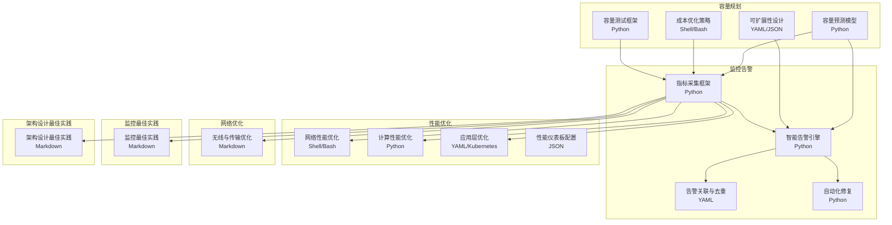
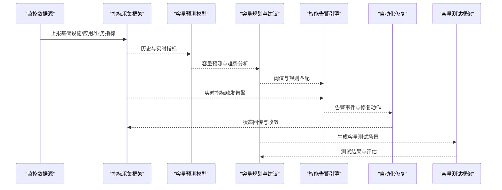
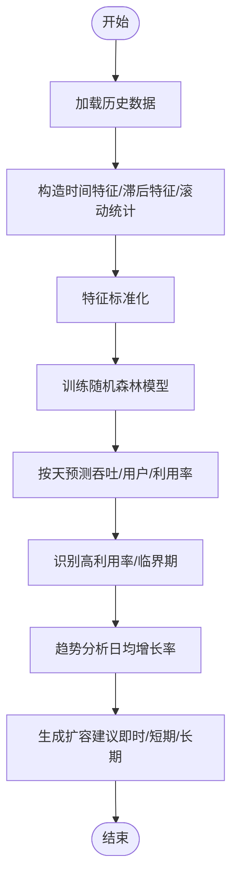
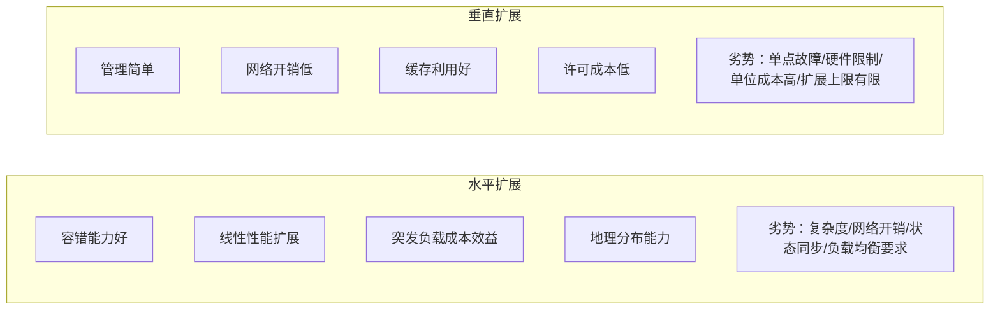
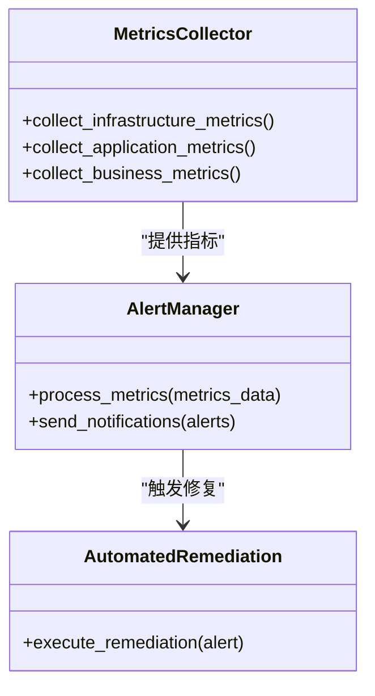
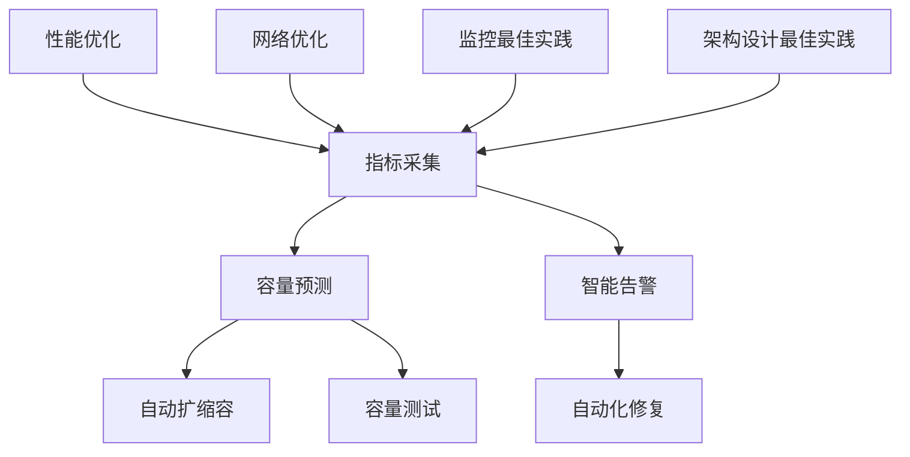

# 容量管理

<cite>
**本文引用的文件**
- [容量规划框架（中文）](file://14-operations-management/capacity-planning/capacity-planning-framework-zh.md)
- [容量规划框架（英文）](file://14-operations-management/capacity-planning/capacity-planning-framework.md)
- [运营监控告警系统（中文）](file://14-operations-management/monitoring-alerting/operations-monitoring-framework-zh.md)
- [性能优化框架（中文）](file://14-operations-management/performance-optimization/performance-optimization-framework-zh.md)
- [网络性能优化实践](file://26-performance-optimization/network-optimization/network-performance-tuning.md)
- [监控最佳实践](file://26-performance-optimization/monitoring-tools/o-ran-monitoring-tools.md)
- [架构设计最佳实践](file://30-best-practices/architecture-practices/architecture-design-best-practices.md)
</cite>

## 目录
1. [简介](#简介)
2. [项目结构](#项目结构)
3. [核心组件](#核心组件)
4. [架构总览](#架构总览)
5. [详细组件分析](#详细组件分析)
6. [依赖关系分析](#依赖关系分析)
7. [性能考量](#性能考量)
8. [故障排查指南](#故障排查指南)
9. [结论](#结论)
10. [附录](#附录)

## 简介
本文件面向O-RAN系统的容量管理，围绕资源使用监控（CPU、内存、存储、网络）、容量预测（历史数据分析、预测模型、趋势分析）、扩容策略（自动/手动、效果评估）、资源优化（利用率、分配、成本优化）、自动化工具与决策支持、以及告警机制与最佳实践进行系统化梳理与落地指导。内容来源于仓库中的容量规划、监控告警、性能优化、网络优化、监控最佳实践与架构设计等文档，并结合实际代码片段路径进行说明。

## 项目结构
本仓库中与容量管理直接相关的主要目录与文件如下：
- 容量规划：提供容量预测模型、可扩展性设计、成本优化与容量测试框架
- 运营监控告警：提供多层监控采集、智能告警与自动化修复
- 性能优化：提供网络、计算、应用层优化与性能仪表板配置
- 网络优化：提供无线与传输层面的性能优化实践
- 监控最佳实践：提供监控体系设计与告警设计原则
- 架构设计最佳实践：提供可扩展性、冗余、高可用与性能优化的设计原则

**图表来源**
- [容量规划框架（中文）](file://14-operations-management/capacity-planning/capacity-planning-framework-zh.md#L6-L266)
- [运营监控告警系统（中文）](file://14-operations-management/monitoring-alerting/operations-monitoring-framework-zh.md#L6-L486)
- [性能优化框架（中文）](file://14-operations-management/performance-optimization/performance-optimization-framework-zh.md#L6-L342)
- [网络性能优化实践](file://26-performance-optimization/network-optimization/network-performance-tuning.md#L1-L98)
- [监控最佳实践](file://26-performance-optimization/monitoring-tools/o-ran-monitoring-tools.md#L286-L355)
- [架构设计最佳实践](file://30-best-practices/architecture-practices/architecture-design-best-practices.md#L1-L300)

**章节来源**
- [容量规划框架（中文）](file://14-operations-management/capacity-planning/capacity-planning-framework-zh.md#L1-L505)
- [运营监控告警系统（中文）](file://14-operations-management/monitoring-alerting/operations-monitoring-framework-zh.md#L1-L909)
- [性能优化框架（中文）](file://14-operations-management/performance-optimization/performance-optimization-framework-zh.md#L1-L342)
- [网络性能优化实践](file://26-performance-optimization/network-optimization/network-performance-tuning.md#L1-L98)
- [监控最佳实践](file://26-performance-optimization/monitoring-tools/o-ran-monitoring-tools.md#L286-L355)
- [架构设计最佳实践](file://30-best-practices/architecture-practices/architecture-design-best-practices.md#L1-L300)

## 核心组件
- 容量预测与规划：基于历史数据的时间序列特征工程与机器学习预测，输出容量需求与建议
- 监控与告警：多层指标采集、阈值驱动的智能告警、告警关联与去重、自动化修复
- 性能优化：网络接口与内核参数优化、CPU亲和性与调度优化、容器资源优化、性能仪表板
- 网络优化：无线与传输层面的QoS、时延、抖动、负载均衡与资源利用率提升
- 成本优化：资源利用分析与优化建议生成
- 容量测试：负载扫描与容量报告生成，支撑容量规划与扩容评估

**章节来源**
- [容量规划框架（英文）](file://14-operations-management/capacity-planning/capacity-planning-framework.md#L6-L186)
- [运营监控告警系统（中文）](file://14-operations-management/monitoring-alerting/operations-monitoring-framework-zh.md#L46-L486)
- [性能优化框架（中文）](file://14-operations-management/performance-optimization/performance-optimization-framework-zh.md#L6-L342)
- [网络性能优化实践](file://26-performance-optimization/network-optimization/network-performance-tuning.md#L1-L98)
- [监控最佳实践](file://26-performance-optimization/monitoring-tools/o-ran-monitoring-tools.md#L286-L355)

## 架构总览
容量管理的总体架构由“预测—监控—优化—告警—修复—测试”闭环构成，贯穿基础设施、应用与业务三层监控，结合容量预测模型与自动扩缩容策略，形成从数据到决策再到执行的完整链路。

**图表来源**
- [容量规划框架（中文）](file://14-operations-management/capacity-planning/capacity-planning-framework-zh.md#L6-L186)
- [运营监控告警系统（中文）](file://14-operations-management/monitoring-alerting/operations-monitoring-framework-zh.md#L262-L486)
- [性能优化框架（中文）](file://14-operations-management/performance-optimization/performance-optimization-framework-zh.md#L302-L342)

## 详细组件分析

### 容量预测与趋势分析
- 历史数据准备：时间特征（小时、星期、月份、周末）、滞后特征（1小时、24小时、1周）、滚动统计（24小时、1周）
- 模型训练：特征标准化与随机森林回归训练，输出特征重要性
- 预测与建议：按天预测吞吐与连接用户，计算容量利用率并生成短期/长期建议

**图表来源**
- [容量规划框架（中文）](file://14-operations-management/capacity-planning/capacity-planning-framework-zh.md#L34-L150)

**章节来源**
- [容量规划框架（中文）](file://14-operations-management/capacity-planning/capacity-planning-framework-zh.md#L6-L186)
- [容量规划框架（英文）](file://14-operations-management/capacity-planning/capacity-planning-framework.md#L6-L186)

### 可扩展性设计与自动扩缩容
- 水平扩展 vs 垂直扩展：分别适用于分布式与集中式场景，权衡容错、成本与复杂度
- 自动扩缩容策略：针对近端RT RIC、O-DU集群、CU池等组件，定义指标、阈值、因子、冷却期与实例上下限

**图表来源**
- [容量规划框架（中文）](file://14-operations-management/capacity-planning/capacity-planning-framework-zh.md#L188-L228)
- [容量规划框架（英文）](file://14-operations-management/capacity-planning/capacity-planning-framework.md#L188-L228)

**章节来源**
- [容量规划框架（中文）](file://14-operations-management/capacity-planning/capacity-planning-framework-zh.md#L188-L266)
- [容量规划框架（英文）](file://14-operations-management/capacity-planning/capacity-planning-framework.md#L188-L266)

### 成本优化与资源利用分析
- 资源利用分析：CPU、内存、存储的使用率与压力指标收集，生成优化报告与阶段性建议
- 优化建议：立即行动（实例右配、资源配额、启用自动扩缩容、容器资源请求优化）、短期改进（监控告警、容量演练、应用配置优化）、长期策略（可观测性、预测性容量规划、架构优化、KPI建立）

**章节来源**
- [容量规划框架（中文）](file://14-operations-management/capacity-planning/capacity-planning-framework-zh.md#L268-L359)
- [容量规划框架（英文）](file://14-operations-management/capacity-planning/capacity-planning-framework.md#L268-L359)

### 容量测试与评估
- 负载扫描：在不同并发用户数下运行负载测试，统计吞吐、延迟、错误率
- 报告生成：汇总最大可持续吞吐、最佳并发用户数、峰值时延迟与错误率，并给出容量缓冲与增长规划建议

**章节来源**
- [容量规划框架（中文）](file://14-operations-management/capacity-planning/capacity-planning-framework-zh.md#L361-L505)
- [容量规划框架（英文）](file://14-operations-management/capacity-planning/capacity-planning-framework.md#L361-L505)

### 监控与告警
- 指标采集：基础设施（CPU/内存/磁盘/网络）、应用（RIC/接口/服务/性能）、业务（KPI/SLA/QoS/业务影响）
- 智能告警：阈值规则、指标路径提取、告警去重与关联、通知通道（邮件/微信/短信）
- 自动化修复：按告警类型匹配修复动作，执行并记录历史

**图表来源**
- [运营监控告警系统（中文）](file://14-operations-management/monitoring-alerting/operations-monitoring-framework-zh.md#L46-L486)

**章节来源**
- [运营监控告警系统（中文）](file://14-operations-management/monitoring-alerting/operations-monitoring-framework-zh.md#L46-L486)

### 性能优化与资源优化
- 网络优化：接口调优（关闭特定卸载、环形缓冲、中断聚合、MTU、流量控制）、内核参数（缓冲区、TCP拥塞控制、低延迟）、NUMA绑定
- 计算优化：CPU拓扑识别、进程亲和性与优先级、内核调度器调优
- 应用层优化：容器资源请求/限制、探针配置、服务暴露
- 性能仪表板：按组件CPU利用率、内存使用等可视化

**章节来源**
- [性能优化框架（中文）](file://14-operations-management/performance-optimization/performance-optimization-framework-zh.md#L6-L342)
- [网络性能优化实践](file://26-performance-optimization/network-optimization/network-performance-tuning.md#L1-L98)

### 网络性能优化实践
- 无线与传输：频谱效率、干扰管理、数据压缩、协议优化、QoS参数与时延/抖动控制、负载均衡与资源利用率提升
- 监控指标：无线性能（RSRP/SINR）、传输性能（吞吐量）、QoS（时延/抖动）、负载均衡（用户分布）

**章节来源**
- [网络性能优化实践](file://26-performance-optimization/network-optimization/network-performance-tuning.md#L1-L98)

### 监控最佳实践与告警设计
- 四个黄金信号、RED方法、USE方法、监控覆盖规划
- 告警噪声减少、可操作告警、优先级管理、告警疲劳预防
- 监控系统高可用、性能优化、安全与合规、持续改进

**章节来源**
- [监控最佳实践](file://26-performance-optimization/monitoring-tools/o-ran-monitoring-tools.md#L286-L355)

### 架构设计最佳实践
- 分层架构与功能边界、标准接口协议（E2/A1/O1）
- 可扩展性（水平扩展、垂直扩展、微服务拆分、数据库分片）
- 冗余与高可用（硬件/软件/地理冗余）、故障隔离（微服务/网络/数据）
- 性能优化（硬件加速、软件优化、架构优化）、资源效率（计算/存储/网络）
- 安全架构（零信任模型、安全接口设计）、架构演进（技术前瞻、可维护性）

**章节来源**
- [架构设计最佳实践](file://30-best-practices/architecture-practices/architecture-design-best-practices.md#L1-L300)

## 依赖关系分析
- 容量预测依赖历史监控数据；预测结果驱动自动扩缩容与容量测试
- 指标采集为预测与告警提供基础；告警触发自动化修复，修复后反馈至采集
- 性能优化与网络优化为容量管理提供底层支撑，降低瓶颈，提高资源利用率
- 监控最佳实践与架构设计最佳实践贯穿整个容量管理体系，确保可维护性与可扩展性

**图表来源**
- [容量规划框架（中文）](file://14-operations-management/capacity-planning/capacity-planning-framework-zh.md#L6-L266)
- [运营监控告警系统（中文）](file://14-operations-management/monitoring-alerting/operations-monitoring-framework-zh.md#L46-L486)
- [性能优化框架（中文）](file://14-operations-management/performance-optimization/performance-optimization-framework-zh.md#L6-L342)
- [网络性能优化实践](file://26-performance-optimization/network-optimization/network-performance-tuning.md#L1-L98)
- [监控最佳实践](file://26-performance-optimization/monitoring-tools/o-ran-monitoring-tools.md#L286-L355)
- [架构设计最佳实践](file://30-best-practices/architecture-practices/architecture-design-best-practices.md#L1-L300)

**章节来源**
- [容量规划框架（中文）](file://14-operations-management/capacity-planning/capacity-planning-framework-zh.md#L6-L266)
- [运营监控告警系统（中文）](file://14-operations-management/monitoring-alerting/operations-monitoring-framework-zh.md#L46-L486)
- [性能优化框架（中文）](file://14-operations-management/performance-optimization/performance-optimization-framework-zh.md#L6-L342)
- [网络性能优化实践](file://26-performance-optimization/network-optimization/network-performance-tuning.md#L1-L98)
- [监控最佳实践](file://26-performance-optimization/monitoring-tools/o-ran-monitoring-tools.md#L286-L355)
- [架构设计最佳实践](file://30-best-practices/architecture-practices/architecture-design-best-practices.md#L1-L300)

## 性能考量
- 预测模型：特征工程与模型训练的稳定性与泛化能力决定预测准确性
- 监控采集：采集频率与指标覆盖面影响告警及时性与修复有效性
- 自动扩缩容：阈值与冷却期设置需平衡响应速度与抖动
- 性能优化：网络与计算层面的优化需结合业务场景与硬件条件
- 成本优化：资源利用率与成本之间的权衡，避免过度预留与过度压缩

[本节为通用指导，无需具体文件引用]

## 故障排查指南
- 指标采集异常：检查采集器配置、网络连通性与目标系统状态
- 告警风暴：通过告警关联与去重规则降低噪声，明确优先级
- 自动化修复失败：确认修复动作配置、权限与依赖服务状态
- 容量不足：结合容量预测与容量测试报告，评估是否需要扩容或优化

**章节来源**
- [运营监控告警系统（中文）](file://14-operations-management/monitoring-alerting/operations-monitoring-framework-zh.md#L488-L692)

## 结论
通过将容量预测、监控告警、性能优化与网络优化有机结合，O-RAN系统可在保证SLA的前提下实现资源高效利用与成本可控。建议以历史数据驱动的预测模型为基础，配合多层监控与智能告警，结合自动扩缩容与容量测试，持续优化资源利用率与分配策略，并以架构设计最佳实践为指导，确保系统具备良好的可扩展性与高可用性。

[本节为总结性内容，无需具体文件引用]

## 附录
- 容量管理工具清单
  - 容量预测模型：基于时间序列特征与随机森林的预测模块
  - 自动扩缩容策略：针对近端RT RIC、O-DU集群、CU池的阈值与因子配置
  - 指标采集框架：基础设施/应用/业务三层指标采集
  - 智能告警引擎：阈值规则、指标路径提取、告警去重与通知
  - 自动化修复：按告警类型匹配修复动作
  - 容量测试框架：负载扫描与容量报告
  - 性能优化工具：网络接口与内核参数、CPU亲和性与调度、容器资源优化
  - 监控最佳实践：四黄金信号、RED/USE方法、告警设计与系统可靠性
  - 架构设计最佳实践：分层架构、接口标准化、可扩展性、冗余与高可用、性能与安全

[本节为概览性内容，无需具体文件引用]