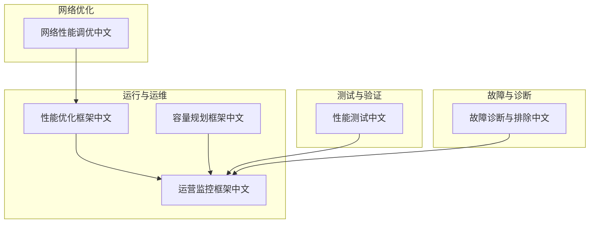
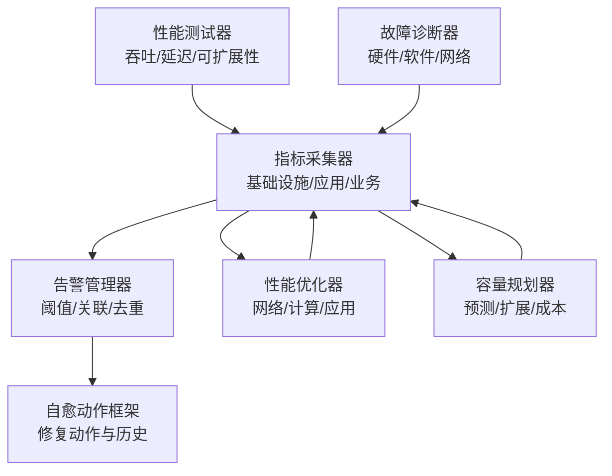
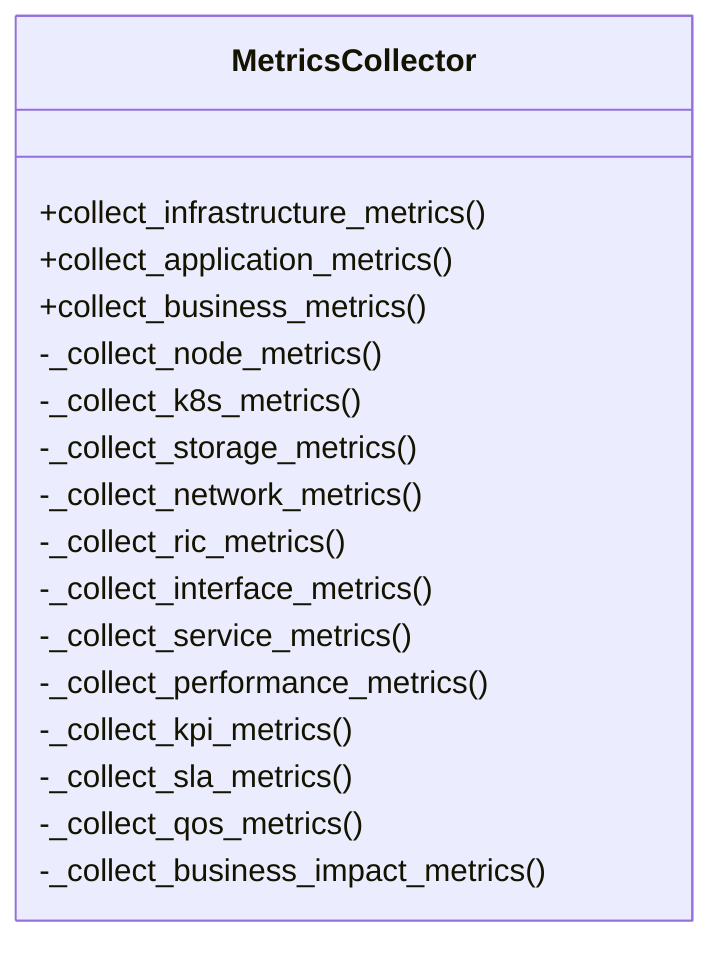
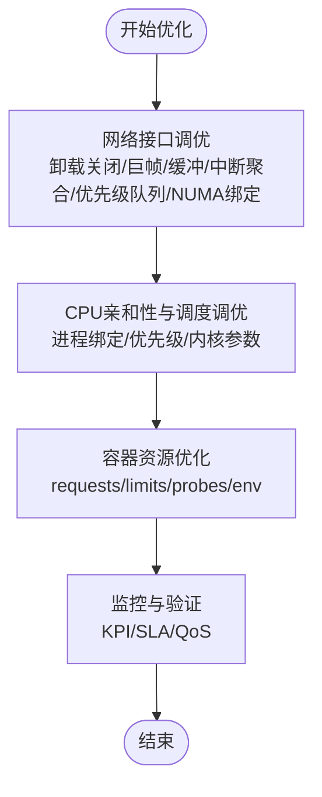
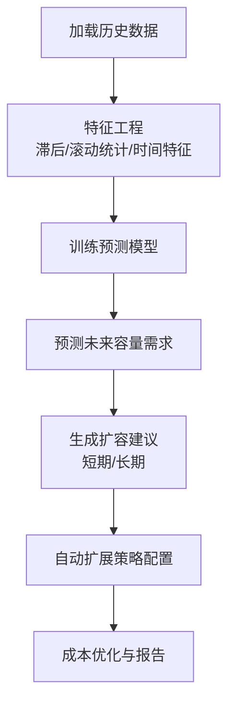
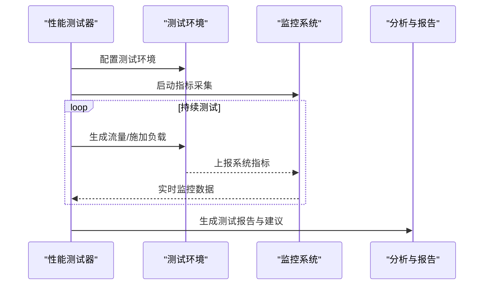
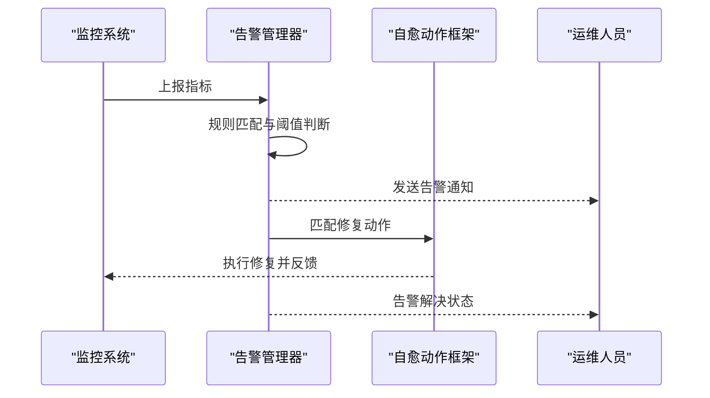
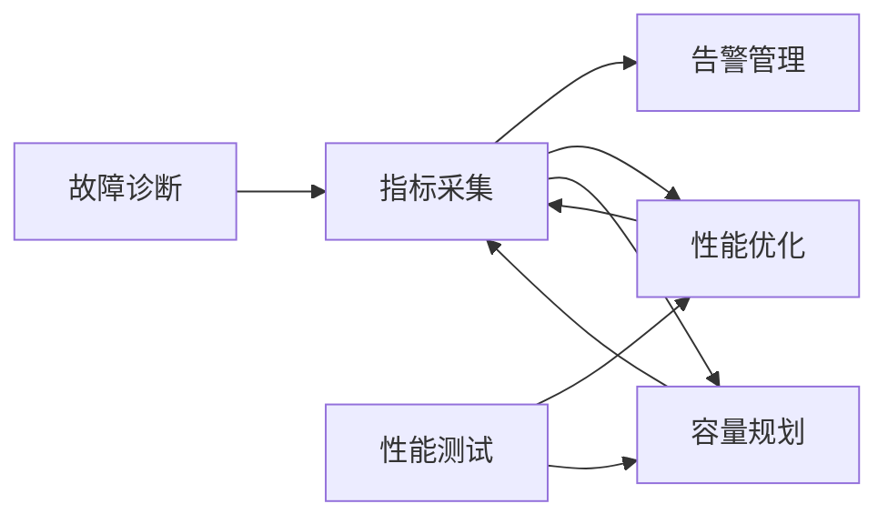

# 性能管理

<cite>
**本文引用的文件**
- [性能优化框架（中文）](file://14-operations-management/performance-optimization/performance-optimization-framework-zh.md)
- [性能优化目录（中文）](file://26-performance-optimization/readme-zh.md)
- [容量规划框架（中文）](file://14-operations-management/capacity-planning/capacity-planning-framework-zh.md)
- [运营监控框架（中文）](file://14-operations-management/monitoring-alerting/operations-monitoring-framework-zh.md)
- [性能测试（中文）](file://13-testing-validation/performance-testing/performance-testing-zh.md)
- [故障诊断与排除（中文）](file://27-troubleshooting-diagnosis/readme-zh.md)
- [网络性能调优（中文）](file://26-performance-optimization/network-optimization/network-performance-tuning.md)
</cite>

## 目录
1. [简介](#简介)
2. [项目结构](#项目结构)
3. [核心组件](#核心组件)
4. [架构总览](#架构总览)
5. [详细组件分析](#详细组件分析)
6. [依赖关系分析](#依赖关系分析)
7. [性能考量](#性能考量)
8. [故障排查指南](#故障排查指南)
9. [结论](#结论)
10. [附录](#附录)

## 简介
本文件面向O-RAN系统的性能管理，围绕性能数据采集的KPI/KQI指标定义、趋势分析与瓶颈识别、参数调优与资源优化、容量规划与扩容建议、SLA监控与报告、自动化工具与基线建立、以及性能优化最佳实践进行系统化梳理与落地指导。内容来源于仓库中性能优化、容量规划、监控告警、性能测试与故障诊断等文档，形成可操作的性能管理方法论与实施路径。

## 项目结构
本主题涉及的文档主要分布在以下目录：
- 运行与运维：性能优化、容量规划、监控告警
- 测试与验证：性能测试
- 故障与诊断：故障诊断与排除
- 网络优化：网络性能调优

**图表来源**
- [性能优化框架（中文）](file://14-operations-management/performance-optimization/performance-optimization-framework-zh.md#L1-L342)
- [容量规划框架（中文）](file://14-operations-management/capacity-planning/capacity-planning-framework-zh.md#L1-L505)
- [运营监控框架（中文）](file://14-operations-management/monitoring-alerting/operations-monitoring-framework-zh.md#L1-L909)
- [性能测试（中文）](file://13-testing-validation/performance-testing/performance-testing-zh.md#L1-L327)
- [故障诊断与排除（中文）](file://27-troubleshooting-diagnosis/readme-zh.md#L1-L105)
- [网络性能调优（中文）](file://26-performance-optimization/network-优化/network-performance-tuning.md#L1-L120)

**章节来源**
- [性能优化框架（中文）](file://14-operations-management/performance-optimization/performance-optimization-framework-zh.md#L1-L342)
- [容量规划框架（中文）](file://14-operations-management/capacity-planning/capacity-planning-framework-zh.md#L1-L505)
- [运营监控框架（中文）](file://14-operations-management/monitoring-alerting/operations-monitoring-framework-zh.md#L1-L909)
- [性能测试（中文）](file://13-testing-validation/performance-testing/performance-testing-zh.md#L1-L327)
- [故障诊断与排除（中文）](file://27-troubleshooting-diagnosis/readme-zh.md#L1-L105)
- [网络性能调优（中文）](file://26-performance-optimization/network-optimization/network-performance-tuning.md#L1-L120)

## 核心组件
- 指标采集与监控：覆盖基础设施、应用、业务三层指标，包含KPI、SLA、QoS与业务影响指标。
- 性能优化：网络接口调优、内核参数、NUMA感知绑定、CPU亲和性与调度器调优、容器资源优化。
- 容量规划：历史数据驱动的预测模型、自动扩展策略、成本优化与容量基准测试。
- 性能测试：吞吐量、延迟、抖动、丢包、连接密度、可扩展性等测试场景与方法。
- 故障诊断：硬件、软件、网络三类故障分类与诊断流程，工具箱与预防性维护。
- 自动化与报告：告警规则、关联与去重、自愈动作、仪表板与报告生成。

**章节来源**
- [运营监控框架（中文）](file://14-operations-management/monitoring-alerting/operations-monitoring-framework-zh.md#L8-L260)
- [性能优化框架（中文）](file://14-operations-management/performance-optimization/performance-optimization-framework-zh.md#L6-L234)
- [容量规划框架（中文）](file://14-operations-management/capacity-planning/capacity-planning-framework-zh.md#L6-L186)
- [性能测试（中文）](file://13-testing-validation/performance-testing/performance-testing-zh.md#L29-L138)
- [故障诊断与排除（中文）](file://27-troubleshooting-diagnosis/readme-zh.md#L6-L105)
- [网络性能调优（中文）](file://26-performance-optimization/network-optimization/network-performance-tuning.md#L84-L98)

## 架构总览
性能管理的总体架构由“采集—分析—优化—报告—自动化”闭环构成，贯穿基础设施、应用与业务三个层次，并通过测试与诊断保障质量与稳定性。

**图表来源**
- [运营监控框架（中文）](file://14-operations-management/monitoring-alerting/operations-monitoring-framework-zh.md#L48-L260)
- [性能优化框架（中文）](file://14-operations-management/performance-optimization/performance-optimization-framework-zh.md#L106-L234)
- [容量规划框架（中文）](file://14-operations-management/capacity-planning/capacity-planning-framework-zh.md#L18-L186)
- [性能测试（中文）](file://13-testing-validation/performance-testing/performance-testing-zh.md#L61-L138)
- [故障诊断与排除（中文）](file://27-troubleshooting-diagnosis/readme-zh.md#L26-L105)

## 详细组件分析

### 指标采集与监控（KPI/KQI/SLA）
- 指标分层：基础设施（CPU/内存/磁盘/网络）、应用（RIC、接口、服务、性能）、业务（KPI、SLA、QoS、业务影响）。
- 关键KPI：吞吐量、延迟、抖动、丢包率、连接建立时间、切换成功率、会话建立速率、API响应时间、数据库查询响应等。
- SLA与QoS：可用性、响应时间、吞吐量达标率、MTTR/MTBF、语音/视频/数据QoS评分、客户满意度/NPS等。
- 采集方式：系统级（psutil、net_io_counters）、服务级（REST/gRPC）、业务级（KPI/SLA/QoS）。

**图表来源**
- [运营监控框架（中文）](file://14-operations-management/monitoring-alerting/operations-monitoring-framework-zh.md#L48-L260)

**章节来源**
- [运营监控框架（中文）](file://14-operations-management/monitoring-alerting/operations-monitoring-framework-zh.md#L8-L260)
- [性能测试（中文）](file://13-testing-validation/performance-testing/performance-testing-zh.md#L29-L56)

### 性能优化（网络/计算/应用）
- 网络优化：禁用可能引入抖动的卸载、设置巨帧、环形缓冲区、中断聚合、流量控制与优先级队列、NUMA感知绑定。
- 计算优化：CPU亲和性绑定、进程优先级、内核调度器参数调优、NUMA拓扑感知。
- 应用优化：容器资源请求/限制、探针、环境变量（GC、并发数）等。

**图表来源**
- [性能优化框架（中文）](file://14-operations-management/performance-optimization/performance-optimization-framework-zh.md#L6-L100)
- [性能优化框架（中文）](file://14-operations-management/performance-optimization/performance-optimization-framework-zh.md#L103-L234)

**章节来源**
- [性能优化框架（中文）](file://14-operations-management/performance-optimization/performance-optimization-framework-zh.md#L6-L234)
- [网络性能调优（中文）](file://26-performance-optimization/network-optimization/network-performance-tuning.md#L84-L98)

### 容量规划与扩容建议
- 负载预测：基于历史数据的时间序列特征工程（滞后、滚动统计），随机森林回归模型训练与预测。
- 规划建议：识别高利用率/临界时段，给出短期/长期扩容建议；结合增长趋势设定扩展策略。
- 自动扩展：针对不同组件（近端RT RIC、O-DU集群、CU池）定义指标阈值、扩展/收缩因子、冷却期与实例上下限。
- 成本优化：资源利用分析、配额与限制、优化报告生成与分阶段实施。

**图表来源**
- [容量规划框架（中文）](file://14-operations-management/capacity-planning/capacity-planning-framework-zh.md#L18-L186)
- [容量规划框架（中文）](file://14-operations-management/capacity-planning/capacity-planning-framework-zh.md#L230-L266)

**章节来源**
- [容量规划框架（中文）](file://14-operations-management/capacity-planning/capacity-planning-framework-zh.md#L6-L186)
- [容量规划框架（中文）](file://14-operations-management/capacity-planning/capacity-planning-framework-zh.md#L230-L266)

### 性能测试与基准
- 测试类别：网络性能（吞吐、延迟、丢包、抖动、连接密度）、资源性能（CPU/内存/存储/网络/功耗）、可扩展性（水平/垂直扩展、负载分布、容量规划、增长建模）。
- 方法论：持续吞吐测试、延迟特征化、压力测试（负载因子递增）、环境扩展与稳定性评估。
- 场景：峰值性能验证、延迟特征化、可扩展性验证。
- 指标：KPI目标值与测量方法，PromQL查询表达式用于监控。

**图表来源**
- [性能测试（中文）](file://13-testing-validation/performance-testing/performance-testing-zh.md#L61-L138)
- [性能测试（中文）](file://13-testing-validation/performance-testing/performance-testing-zh.md#L169-L242)

**章节来源**
- [性能测试（中文）](file://13-testing-validation/performance-testing/performance-testing-zh.md#L6-L138)
- [性能测试（中文）](file://13-testing-validation/performance-testing/performance-testing-zh.md#L169-L242)
- [性能测试（中文）](file://13-testing-validation/performance-testing/performance-testing-zh.md#L244-L272)

### SLA管理与报告
- SLA监控：可用性、响应时间、吞吐量达标率、违规次数、MTTR/MTBF等。
- 报告生成：自动化测试、告警系统、趋势分析、容量规划建议、合规性验证。
- 告警与自愈：阈值规则、告警关联与去重、通知渠道、自愈动作与历史记录。

**图表来源**
- [运营监控框架（中文）](file://14-operations-management/monitoring-alerting/operations-monitoring-framework-zh.md#L266-L486)
- [运营监控框架（中文）](file://14-operations-management/monitoring-alerting/operations-monitoring-framework-zh.md#L488-L528)
- [运营监控框架（中文）](file://14-operations-management/monitoring-alerting/operations-monitoring-framework-zh.md#L696-L746)

**章节来源**
- [运营监控框架（中文）](file://14-operations-management/monitoring-alerting/operations-monitoring-framework-zh.md#L262-L486)
- [运营监控框架（中文）](file://14-operations-management/monitoring-alerting/operations-monitoring-framework-zh.md#L488-L528)
- [运营监控框架（中文）](file://14-operations-management/monitoring-alerting/operations-monitoring-framework-zh.md#L694-L746)

### 自动化工具与性能基线
- 自动化：指标采集、告警规则、关联与去重、通知渠道、自愈动作、仪表板与报告生成。
- 性能基线：建立正常运行状态下的KPI/KQI基线，作为优化前后对比与趋势分析的基础。
- 趋势预测：基于历史数据与特征工程的预测模型，辅助容量规划与扩容决策。

**章节来源**
- [运营监控框架（中文）](file://14-operations-management/monitoring-alerting/operations-monitoring-framework-zh.md#L530-L692)
- [容量规划框架（中文）](file://14-operations-management/capacity-planning/capacity-planning-framework-zh.md#L18-L186)

## 依赖关系分析
- 指标采集依赖于系统与服务监控能力，支撑告警与自愈动作。
- 性能优化依赖于采集到的指标与趋势分析，形成闭环优化。
- 容量规划依赖历史数据与预测模型，指导自动扩展与成本优化。
- 性能测试为优化与规划提供基准与验证手段。
- 故障诊断为异常与瓶颈识别提供支撑。

**图表来源**
- [运营监控框架（中文）](file://14-operations-management/monitoring-alerting/operations-monitoring-framework-zh.md#L48-L260)
- [性能优化框架（中文）](file://14-operations-management/performance-optimization/performance-optimization-framework-zh.md#L6-L234)
- [容量规划框架（中文）](file://14-operations-management/capacity-planning/capacity-planning-framework-zh.md#L18-L186)
- [性能测试（中文）](file://13-testing-validation/performance-testing/performance-testing-zh.md#L61-L138)
- [故障诊断与排除（中文）](file://27-troubleshooting-diagnosis/readme-zh.md#L26-L105)

**章节来源**
- [运营监控框架（中文）](file://14-operations-management/monitoring-alerting/operations-monitoring-framework-zh.md#L1-L909)
- [性能优化框架（中文）](file://14-operations-management/performance-optimization/performance-optimization-framework-zh.md#L1-L342)
- [容量规划框架（中文）](file://14-operations-management/capacity-planning/capacity-planning-framework-zh.md#L1-L505)
- [性能测试（中文）](file://13-testing-validation/performance-testing/performance-testing-zh.md#L1-L327)
- [故障诊断与排除（中文）](file://27-troubleshooting-diagnosis/readme-zh.md#L1-L105)

## 性能考量
- 网络层面：巨帧、环形缓冲区、中断聚合、流量控制与优先级队列、NUMA感知绑定，减少抖动与延迟。
- 计算层面：CPU亲和性、进程优先级、内核调度器参数，降低上下文切换与迁移开销。
- 应用层面：容器资源请求/限制、探针、环境变量调优，避免资源饥饿与GC压力。
- 监控与告警：阈值合理设置、告警关联与去重、通知渠道多样化、自愈动作快速执行。
- 容量与成本：预测模型驱动的容量规划、自动扩展策略、资源配额与成本优化报告。

[本节为通用指导，无需具体文件引用]

## 故障排查指南
- 故障分类：硬件（服务器/网络设备/射频/电源）、软件（系统/应用/配置/数据）、网络（连通性/性能/安全/协议）。
- 诊断流程：现象收集、影响评估、初步排查、深入分析、根因确定、解决方案。
- 工具箱：系统诊断（dmesg、journalctl、sar、vmstat）、网络诊断（ping、traceroute、netstat、ss）、应用诊断（jstack、jmap、gdb、core dump）、专用诊断工具。
- 预防性维护：定期检查、日志审查、配置备份、安全补丁、性能基线维护、自动化监控与自愈。

**章节来源**
- [故障诊断与排除（中文）](file://27-troubleshooting-diagnosis/readme-zh.md#L6-L105)

## 结论
O-RAN性能管理需要以“指标采集—趋势分析—优化—测试—规划—报告—自动化”的闭环为核心，结合网络、计算、应用三层优化策略，配合容量预测与自动扩展，实现SLA达标与成本优化。通过性能测试与故障诊断保障质量与稳定性，最终达成可量化、可预测、可自动化的性能管理体系。

[本节为总结性内容，无需具体文件引用]

## 附录
- KPI/KQI参考：吞吐量、延迟、抖动、丢包率、连接建立时间、切换成功率、会话建立速率、API响应时间、数据库查询响应、QoS评分、可用性、MTTR/MTBF等。
- 调优工具链：top/htop/iotop/iftop、tcpdump/Wireshark/iperf3、perf/strace/gdb/火焰图、Prometheus/Grafana/ELK。
- 最佳实践：建立性能基线、定期评估与回归测试、新业务上线前性能验证、持续跟踪优化效果、自动化监控与告警、故障预测与自愈。

**章节来源**
- [性能优化目录（中文）](file://26-performance-optimization/readme-zh.md#L26-L67)
- [性能测试（中文）](file://13-testing-validation/performance-testing/performance-testing-zh.md#L29-L56)