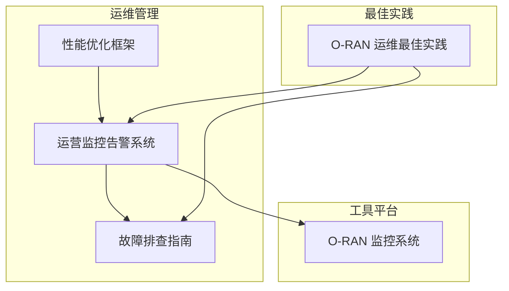
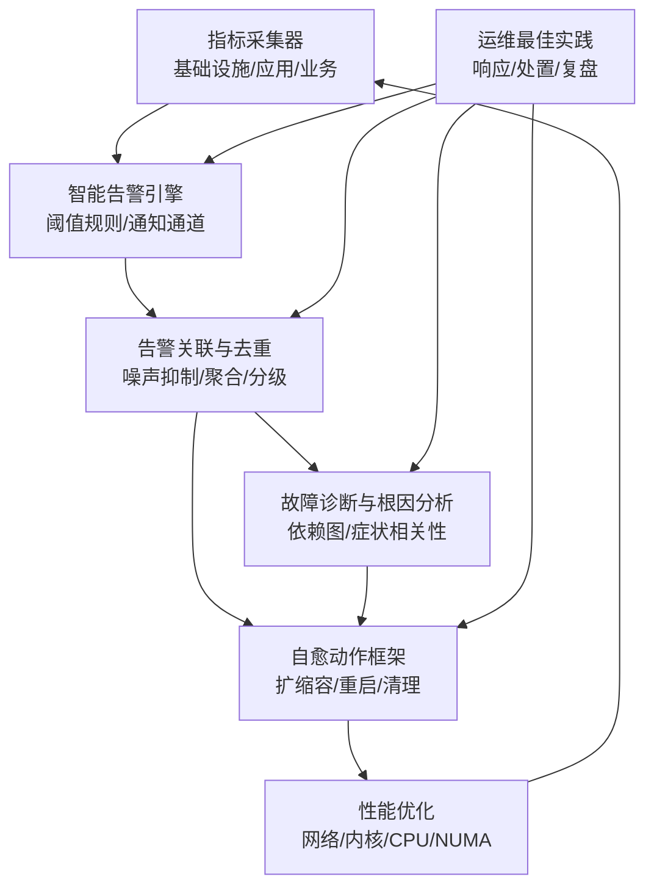
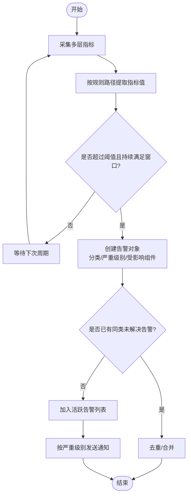
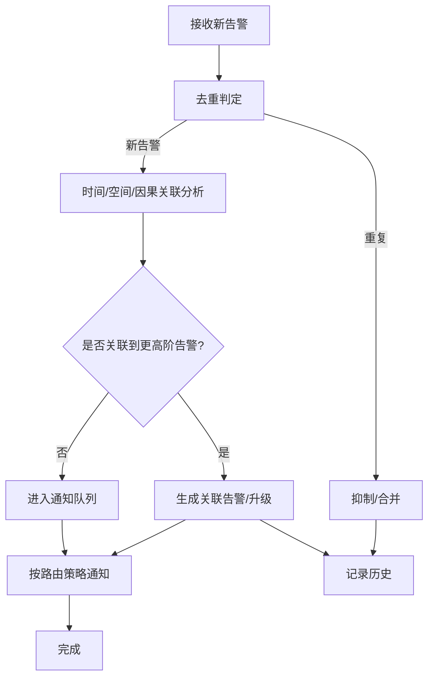
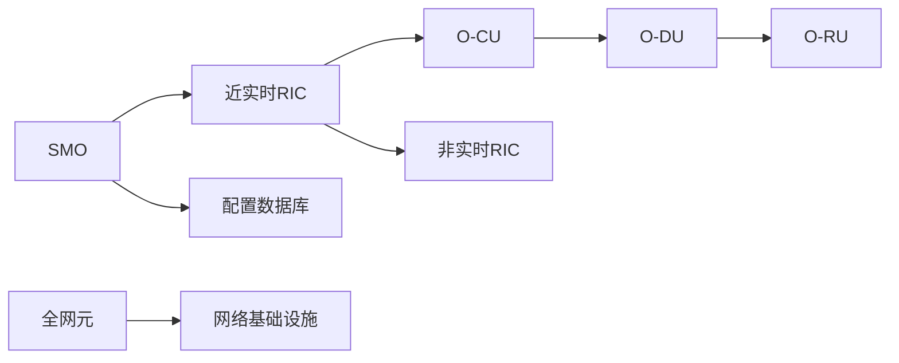
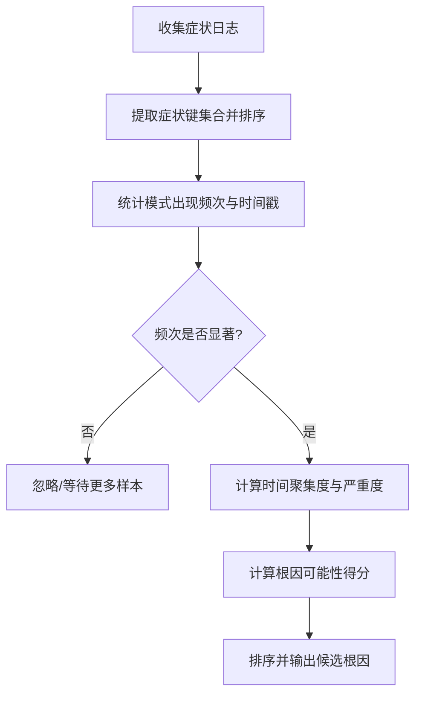
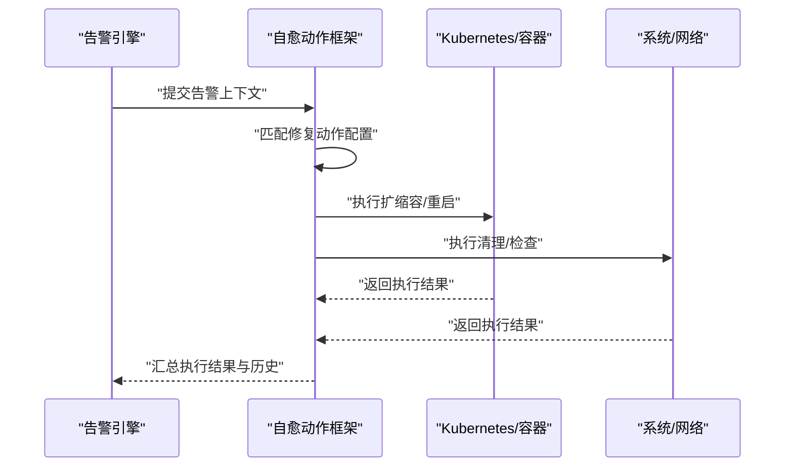
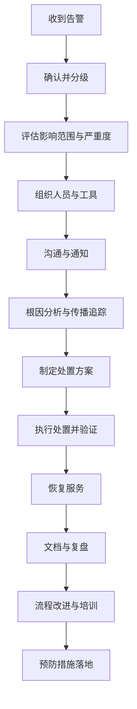
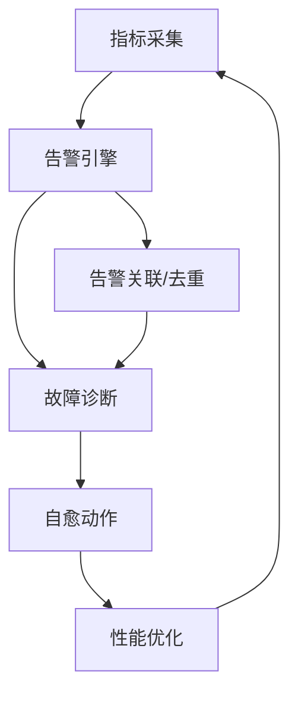

# 故障管理

<cite>
**本文引用的文件**
- [故障排查指南（英文）](file://14-operations-management/fault-handling/fault-troubleshooting-guide.md)
- [运营监控告警系统（中文）](file://14-operations-management/monitoring-alerting/operations-monitoring-framework-zh.md)
- [运营监控告警系统（英文）](file://14-operations-management/monitoring-alerting/operations-monitoring-framework.md)
- [性能优化框架（中文）](file://14-operations-management/performance-optimization/performance-optimization-framework-zh.md)
- [O-RAN 监控系统（英文）](file://22-tool-platforms/monitoring-systems/o-ran-monitoring-systems.md)
- [O-RAN 最佳实践（英文）](file://30-best-practices/operations-practices/o-ran-operations-best-practices.md)
</cite>

## 目录
1. [引言](#引言)
2. [项目结构](#项目结构)
3. [核心组件](#核心组件)
4. [架构总览](#架构总览)
5. [详细组件分析](#详细组件分析)
6. [依赖关系分析](#依赖关系分析)
7. [性能考量](#性能考量)
8. [故障排查指南](#故障排查指南)
9. [结论](#结论)
10. [附录](#附录)

## 引言
本文件面向O-RAN网络的故障管理，围绕自动化故障检测、阈值告警、智能告警过滤、故障隔离与影响范围控制、根因分析与传播追踪、自动恢复与人工干预流程、故障恢复验证与确认、根因分析与经验总结、预测性维护与健康检查、以及最佳实践与处理流程进行系统化梳理。内容基于仓库中的故障排查指南、监控告警框架、性能优化框架与相关工具平台文档提炼而成，旨在帮助读者快速建立可落地的O-RAN故障管理体系。

## 项目结构
本仓库中与故障管理直接相关的内容主要分布在“运维管理”、“监控告警”、“性能优化”、“工具平台”等目录下，形成“监测—告警—诊断—处置—恢复—优化”的闭环。

**图表来源**
- [故障排查指南（英文）](file://14-operations-management/fault-handling/fault-troubleshooting-guide.md#L1-L633)
- [运营监控告警系统（中文）](file://14-operations-management/monitoring-alerting/operations-monitoring-framework-zh.md#L1-L909)
- [运营监控告警系统（英文）](file://14-operations-management/monitoring-alerting/operations-monitoring-framework.md#L1-L907)
- [性能优化框架（中文）](file://14-operations-management/performance-optimization/performance-optimization-framework-zh.md#L1-L342)
- [O-RAN 监控系统（英文）](file://22-tool-platforms/monitoring-systems/o-ran-monitoring-systems.md#L265-L413)
- [O-RAN 最佳实践（英文）](file://30-best-practices/operations-practices/o-ran-operations-best-practices.md#L70-L98)

**章节来源**
- [故障排查指南（英文）](file://14-operations-management/fault-handling/fault-troubleshooting-guide.md#L1-L633)
- [运营监控告警系统（中文）](file://14-operations-management/monitoring-alerting/operations-monitoring-framework-zh.md#L1-L909)
- [运营监控告警系统（英文）](file://14-operations-management/monitoring-alerting/operations-monitoring-framework.md#L1-L907)
- [性能优化框架（中文）](file://14-operations-management/performance-optimization/performance-optimization-framework-zh.md#L1-L342)
- [O-RAN 监控系统（英文）](file://22-tool-platforms/monitoring-systems/o-ran-monitoring-systems.md#L265-L413)
- [O-RAN 最佳实践（英文）](file://30-best-practices/operations-practices/o-ran-operations-best-practices.md#L70-L98)

## 核心组件
- 指标采集与分层监控：覆盖基础设施、应用、业务三层指标，支撑告警与诊断。
- 智能告警引擎：基于阈值规则与指标路径提取，生成分类、严重级别明确的告警，并支持通知通道。
- 告警关联与去重：通过规则对噪声抑制、重复告警抑制、波动检测与分级聚合，降低告警风暴。
- 自愈动作框架：依据告警类型匹配预定义修复动作，执行扩缩容、重启、清理等操作。
- 故障诊断与根因分析：构建系统依赖图，结合症状模式与相关性分析，量化根因可能性。
- 预防性维护与预测性分析：健康检查、指标基线、异常检测与预警通道。
- 性能优化：网络接口、内核参数、NUMA感知绑定、CPU亲和性与调度优化。
- 运维最佳实践：标准化响应流程、后处置与持续改进。

**章节来源**
- [运营监控告警系统（中文）](file://14-operations-management/monitoring-alerting/operations-monitoring-framework-zh.md#L46-L260)
- [运营监控告警系统（英文）](file://14-operations-management/monitoring-alerting/operations-monitoring-framework.md#L262-L486)
- [O-RAN 监控系统（英文）](file://22-tool-platforms/monitoring-systems/o-ran-monitoring-systems.md#L355-L413)
- [故障排查指南（英文）](file://14-operations-management/fault-handling/fault-troubleshooting-guide.md#L100-L180)
- [性能优化框架（中文）](file://14-operations-management/performance-optimization/performance-optimization-framework-zh.md#L1-L342)
- [O-RAN 最佳实践（英文）](file://30-best-practices/operations-practices/o-ran-operations-best-practices.md#L70-L98)

## 架构总览
下图展示从指标采集到告警、诊断、处置与恢复的整体架构，以及与工具平台的集成关系。

**图表来源**
- [运营监控告警系统（中文）](file://14-operations-management/monitoring-alerting/operations-monitoring-framework-zh.md#L46-L260)
- [运营监控告警系统（英文）](file://14-operations-management/monitoring-alerting/operations-monitoring-framework.md#L262-L486)
- [O-RAN 监控系统（英文）](file://22-tool-platforms/monitoring-systems/o-ran-monitoring-systems.md#L355-L413)
- [故障排查指南（英文）](file://14-operations-management/fault-handling/fault-troubleshooting-guide.md#L100-L180)
- [性能优化框架（中文）](file://14-operations-management/performance-optimization/performance-optimization-framework-zh.md#L1-L342)
- [O-RAN 最佳实践（英文）](file://30-best-practices/operations-practices/o-ran-operations-best-practices.md#L70-L98)

## 详细组件分析

### 自动化故障检测与阈值告警机制
- 指标分层采集：基础设施（CPU/内存/磁盘/网络）、应用（RIC/接口/服务）、业务（KPI/SLA/QoS/业务影响）。
- 阈值规则：针对CPU、内存、RIC响应时间、接口可用性、业务KPI等设定阈值与持续时间窗口。
- 指标路径提取：支持“点表示法”从嵌套指标结构中抽取目标值，提升规则通用性。
- 告警分类与严重级别：按基础设施/应用/网络/安全/业务划分，严重级别为信息/警告/错误/严重。
- 通知通道：邮件、微信/钉钉、短信等多通道联动，关键告警触发紧急通道。

**图表来源**
- [运营监控告警系统（中文）](file://14-operations-management/monitoring-alerting/operations-monitoring-framework-zh.md#L262-L486)
- [运营监控告警系统（英文）](file://14-operations-management/monitoring-alerting/operations-monitoring-framework.md#L262-L486)

**章节来源**
- [运营监控告警系统（中文）](file://14-operations-management/monitoring-alerting/operations-monitoring-framework-zh.md#L46-L260)
- [运营监控告警系统（英文）](file://14-operations-management/monitoring-alerting/operations-monitoring-framework.md#L262-L486)

### 智能告警过滤与关联
- 噪声抑制：重复告警抑制、抖动检测与合并、阈值滞后、季节性模式识别。
- 告警关联：时间相关性、空间相关性（跨网元）、因果关系识别、业务影响关联。
- 升级与路由：分级升级策略、自动化事件创建、干系人通知路由、与处置工作流集成。

**图表来源**
- [O-RAN 监控系统（英文）](file://22-tool-platforms/monitoring-systems/o-ran-monitoring-systems.md#L355-L413)

**章节来源**
- [O-RAN 监控系统（英文）](file://22-tool-platforms/monitoring-systems/o-ran-monitoring-systems.md#L355-L413)

### 故障隔离与影响范围控制
- 依赖建模：以有向图表达SMO、近实时RIC、O-CU、O-DU、O-RU及基础设施之间的依赖关系。
- 影响评估：基于依赖图与症状模式，量化故障传播范围与影响程度，辅助隔离决策。
- 控制策略：在接口层面实施隔离（如E2/F1/O-FH），在应用/网络层面实施限流与降级，避免级联故障。

**图表来源**
- [故障排查指南（英文）](file://14-operations-management/fault-handling/fault-troubleshooting-guide.md#L113-L126)

**章节来源**
- [故障排查指南（英文）](file://14-operations-management/fault-handling/fault-troubleshooting-guide.md#L100-L180)

### 根因分析与传播追踪
- 症状聚类：对时间戳与症状集合进行模式匹配，统计出现频率与时间聚集度。
- 根因打分：综合频率权重、时间聚集权重、症状严重权重，排序候选根因。
- 传播追踪：结合依赖图与症状相关性，识别上游触发点与下游影响链路。

**图表来源**
- [故障排查指南（英文）](file://14-operations-management/fault-handling/fault-troubleshooting-guide.md#L128-L163)

**章节来源**
- [故障排查指南（英文）](file://14-operations-management/fault-handling/fault-troubleshooting-guide.md#L100-L180)

### 自动恢复机制设计
- 动作匹配：根据告警标题或类别匹配预定义修复动作集合。
- 动作执行：包括扩缩容、容器重启、缓存清理、连接检查、数据库连通性验证等。
- 成功判定与历史记录：记录每个动作的执行结果与最终成功与否，便于审计与优化。

**图表来源**
- [运营监控告警系统（中文）](file://14-operations-management/monitoring-alerting/operations-monitoring-framework-zh.md#L694-L907)
- [运营监控告警系统（英文）](file://14-operations-management/monitoring-alerting/operations-monitoring-framework.md#L694-L907)

**章节来源**
- [运营监控告警系统（中文）](file://14-operations-management/monitoring-alerting/operations-monitoring-framework-zh.md#L694-L907)
- [运营监控告警系统（英文）](file://14-operations-management/monitoring-alerting/operations-monitoring-framework.md#L694-L907)

### 人工干预程序与标准化流程
- 初步响应：告警确认、态势评估、资源动员、沟通启动。
- 诊断与处置：根因定位、方案实施、测试验证、服务恢复。
- 后处置与改进：事件报告、根因分析、总结与流程更新、培训与预防措施。

**图表来源**
- [O-RAN 最佳实践（英文）](file://30-best-practices/operations-practices/o-ran-operations-best-practices.md#L70-L98)

**章节来源**
- [O-RAN 最佳实践（英文）](file://30-best-practices/operations-practices/o-ran-operations-best-practices.md#L70-L98)

### 故障恢复验证与确认
- 指标回归：CPU/内存/接口可用性/延迟/吞吐等关键指标回归正常。
- 业务KPI：SLA达成率、QoS评分、客户满意度等业务指标恢复。
- 回归测试：端到端功能与性能回归测试，确保无副作用。
- 观察期：在告警消除后设置观察窗口，防止假阴性与二次故障。

**章节来源**
- [运营监控告警系统（中文）](file://14-operations-management/monitoring-alerting/operations-monitoring-framework-zh.md#L46-L260)
- [运营监控告警系统（英文）](file://14-operations-management/monitoring-alerting/operations-monitoring-framework.md#L262-L486)

### 故障分析与经验总结
- 结构化根因分析：症状—依赖—传播—影响的闭环分析，输出推荐动作。
- 经验沉淀：将典型场景与处置步骤固化为知识库条目，形成可复用的处置模板。
- 流程化管理：将处置流程纳入变更与发布管理，确保可追溯与可审计。

**章节来源**
- [O-RAN 监控系统（英文）](file://22-tool-platforms/monitoring-systems/o-ran-monitoring-systems.md#L265-L317)
- [O-RAN 最佳实践（英文）](file://30-best-practices/operations-practices/o-ran-operations-best-practices.md#L85-L98)

### 预测性维护与健康检查
- 健康检查：定期执行组件健康脚本，覆盖接口连通性、性能指标、同步状态等。
- 预测性分析：基于历史基线与异常检测算法（统计/机器学习）提前预警。
- 预警通道：邮件、即时通讯、短信等多通道联动，确保及时触达。

**章节来源**
- [故障排查指南（英文）](file://14-operations-management/fault-handling/fault-troubleshooting-guide.md#L539-L570)
- [运营监控告警系统（中文）](file://14-operations-management/monitoring-alerting/operations-monitoring-framework-zh.md#L540-L570)

### 设备状态监控与故障预警
- 状态监控：CPU/内存/磁盘/网络接口/PTP同步等关键状态指标。
- 预警系统：阈值告警与趋势告警相结合，对性能退化与资源耗尽进行早期预警。
- 可视化：仪表板实时展示系统健康状态与活跃告警，支持多维度钻取。

**章节来源**
- [运营监控告警系统（中文）](file://14-operations-management/monitoring-alerting/operations-monitoring-framework-zh.md#L530-L692)
- [运营监控告警系统（英文）](file://14-operations-management/monitoring-alerting/operations-monitoring-framework.md#L530-L692)

## 依赖关系分析
- 指标采集依赖于系统与应用组件暴露的指标面，告警引擎依赖指标采集与规则配置。
- 告警关联与去重依赖于活跃告警集合与规则配置，减少噪声并提升告警质量。
- 故障诊断依赖于依赖图与症状日志，根因分析模块与诊断引擎耦合度较高。
- 自愈动作框架依赖于告警上下文与预定义动作配置，与容器编排/系统命令交互。
- 性能优化与网络/内核/CPU/NUMA参数调整相互影响，需在优化后回测指标与告警。

**图表来源**
- [运营监控告警系统（中文）](file://14-operations-management/monitoring-alerting/operations-monitoring-framework-zh.md#L46-L260)
- [运营监控告警系统（英文）](file://14-operations-management/monitoring-alerting/operations-monitoring-framework.md#L262-L486)
- [O-RAN 监控系统（英文）](file://22-tool-platforms/monitoring-systems/o-ran-monitoring-systems.md#L355-L413)
- [性能优化框架（中文）](file://14-operations-management/performance-optimization/performance-optimization-framework-zh.md#L1-L342)

**章节来源**
- [运营监控告警系统（中文）](file://14-operations-management/monitoring-alerting/operations-monitoring-framework-zh.md#L46-L260)
- [运营监控告警系统（英文）](file://14-operations-management/monitoring-alerting/operations-monitoring-framework.md#L262-L486)
- [O-RAN 监控系统（英文）](file://22-tool-platforms/monitoring-systems/o-ran-monitoring-systems.md#L355-L413)
- [性能优化框架（中文）](file://14-operations-management/performance-optimization/performance-optimization-framework-zh.md#L1-L342)

## 性能考量
- 网络层：禁用可能导致问题的卸载、设置巨帧、启用HTB队列与优先级标记、NUMA感知中断绑定。
- 内核参数：增大TCP/套接字缓冲、启用BBR拥塞控制、缩短FIN超时与保活时间。
- 计算层：CPU亲和性绑定、进程优先级调整、内核调度器参数优化。
- 应用层：容器资源请求/限制、探针配置、并发与GC参数调优。

**章节来源**
- [性能优化框架（中文）](file://14-operations-management/performance-optimization/performance-optimization-framework-zh.md#L8-L234)

## 故障排查指南
- 典型场景：E2接口连接建立失败、F1接口吞吐与延迟问题、O-FH同步与时钟偏差。
- 诊断步骤：网络连通性验证、证书与安全校验、配置参数核对；资源利用分析、流量抓包与分析。
- 优化策略：网络参数调优、QoS与缓冲管理、拆分选项优化。
- 同步问题：PTP守护进程状态、硬件时间戳、IQ质量分析与补偿。

**章节来源**
- [故障排查指南（英文）](file://14-operations-management/fault-handling/fault-troubleshooting-guide.md#L264-L537)

## 结论
通过“监测—告警—诊断—处置—恢复—优化—预防”的闭环体系，O-RAN网络可实现从被动响应到主动治理的转变。建议在实际部署中结合本指南的阈值规则、关联去重策略、根因分析方法与自愈动作框架，逐步完善健康检查与预测性维护，持续迭代运维流程与工具平台，以提升系统的可靠性与可维护性。

## 附录
- 关键实现参考路径（不展示代码内容，仅提供定位）
  - 指标采集与分层监控：[指标采集器类](file://14-operations-management/monitoring-alerting/operations-monitoring-framework-zh.md#L56-L243)
  - 智能告警引擎：[告警规则与处理](file://14-operations-management/monitoring-alerting/operations-monitoring-framework-zh.md#L301-L428)
  - 告警关联与去重：[规则与配置](file://22-tool-platforms/monitoring-systems/o-ran-monitoring-systems.md#L355-L413)
  - 故障诊断与根因分析：[依赖图与相关性分析](file://14-operations-management/fault-handling/fault-troubleshooting-guide.md#L107-L179)
  - 自愈动作框架：[动作匹配与执行](file://14-operations-management/monitoring-alerting/operations-monitoring-framework-zh.md#L705-L907)
  - 性能优化：[网络/内核/CPU/NUMA优化](file://14-operations-management/performance-optimization/performance-optimization-framework-zh.md#L9-L234)
  - 运维最佳实践：[响应与复盘流程](file://30-best-practices/operations-practices/o-ran-operations-best-practices.md#L70-L98)