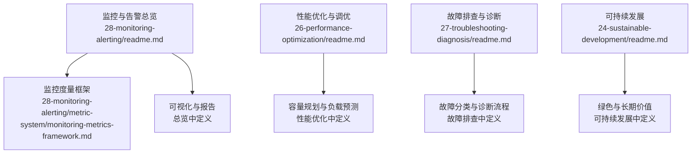
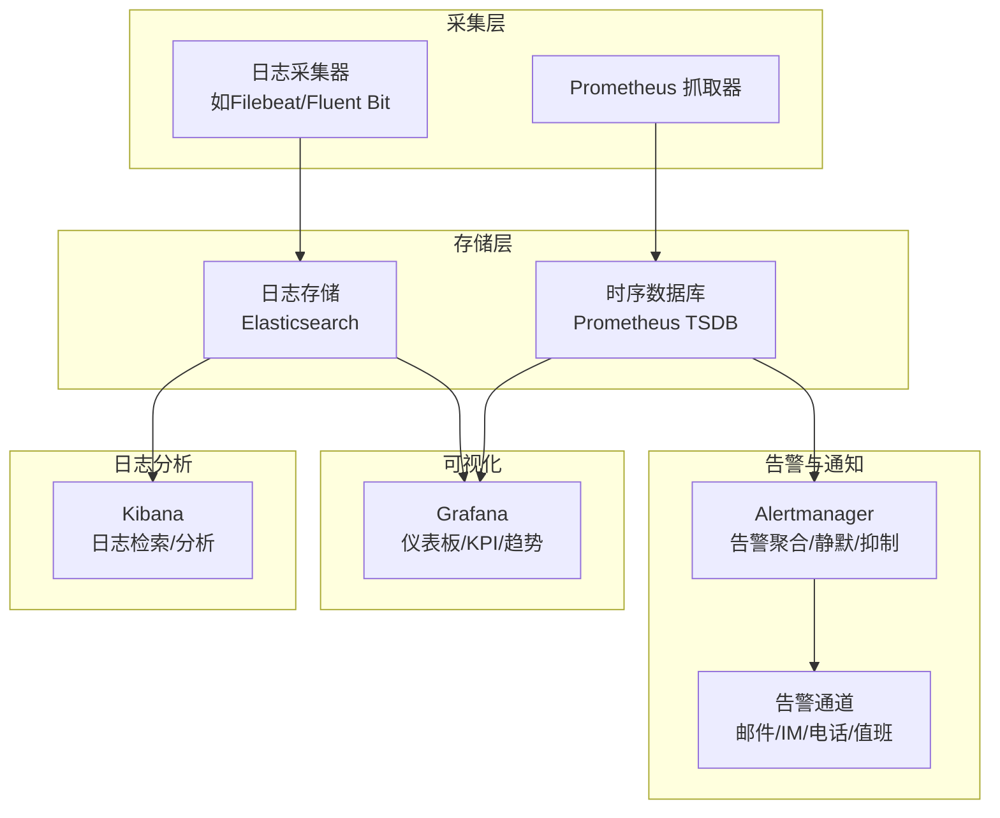
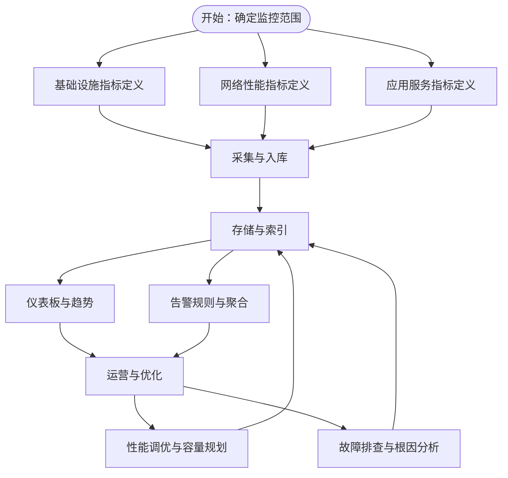
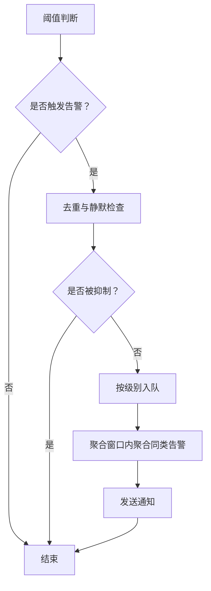
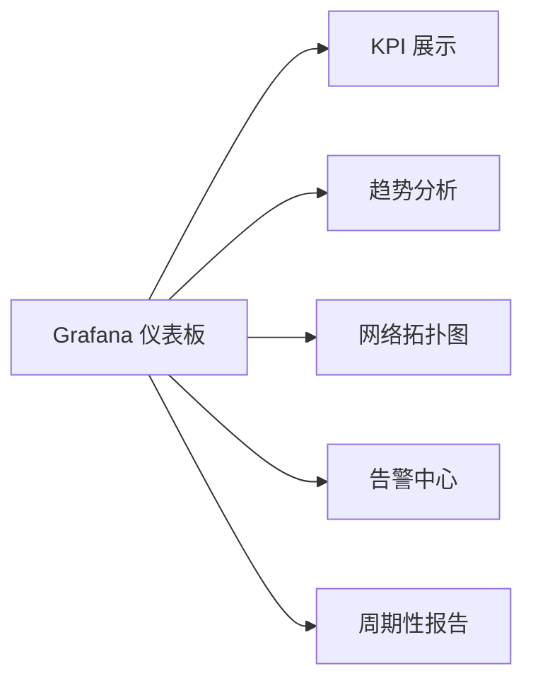
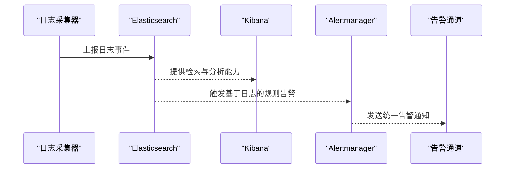
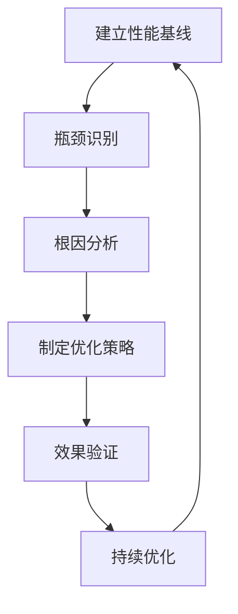
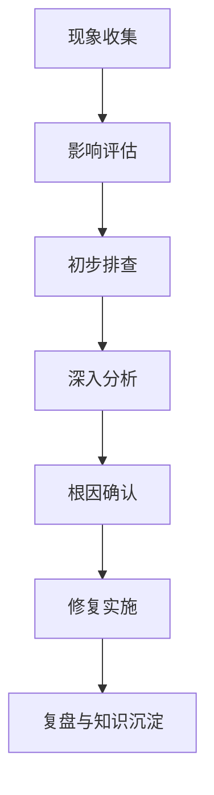
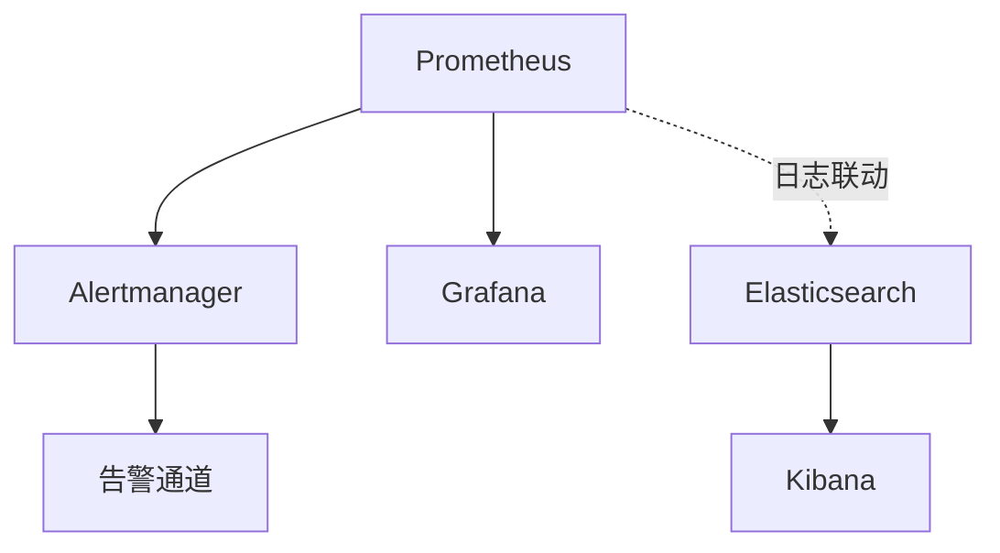

# 监控系统

<cite>
**本文引用的文件**
- [监控与告警系统总览](file://28-monitoring-alerting/readme.md)
- [监控度量框架](file://28-monitoring-alerting/metric-system/monitoring-metrics-framework.md)
- [性能优化与调优](file://26-performance-optimization/readme.md)
- [故障排查与诊断](file://27-troubleshooting-diagnosis/readme.md)
- [可持续发展](file://24-sustainable-development/readme.md)
</cite>

## 目录
1. [引言](#引言)
2. [项目结构](#项目结构)
3. [核心组件](#核心组件)
4. [架构总览](#架构总览)
5. [详细组件分析](#详细组件分析)
6. [依赖关系分析](#依赖关系分析)
7. [性能考虑](#性能考虑)
8. [故障排查指南](#故障排查指南)
9. [结论](#结论)
10. [附录](#附录)

## 引言
本文件面向O-RAN监控系统，围绕基于Prometheus与Grafana的实时监控架构，结合仓库中的监控度量体系、告警策略与可视化方案，给出可操作的监控指导：涵盖基础设施、网络、应用与业务多维度监控策略；分级告警与智能聚合机制；可视化仪表板的KPI与趋势分析；以及与ELK Stack的日志管理联动。同时，结合性能优化、容量规划与故障排查的最佳实践，帮助构建高可用、可扩展、可演进的监控体系。

## 项目结构
与监控相关的核心内容主要集中在“监控与告警”“性能优化”“故障排查”等目录中，形成“度量—采集—存储—告警—可视化—优化—排障”的闭环。

图表来源
- [监控与告警系统总览](file://28-monitoring-alerting/readme.md#L1-L95)
- [监控度量框架](file://28-monitoring-alerting/metric-system/monitoring-metrics-framework.md)
- [性能优化与调优](file://26-performance-optimization/readme.md#L1-L67)
- [故障排查与诊断](file://27-troubleshooting-diagnosis/readme.md#L1-L105)
- [可持续发展](file://24-sustainable-development/readme.md#L1-L65)

章节来源
- [监控与告警系统总览](file://28-monitoring-alerting/readme.md#L1-L95)

## 核心组件
- 监控度量体系：覆盖基础设施、网络性能、应用服务三大类指标，支撑端到端可观测性。
- 告警策略：定义分级阈值、抑制与聚合机制，确保告警有效、不扰民。
- 可视化与报告：提供概览仪表板、拓扑图、趋势分析与周期性报告模板。
- 工具链：Prometheus/Grafana/Alertmanager/ELK等开源方案，以及商业平台选择建议。
- 性能优化：从网络层、计算层到应用层的优化维度与调优流程。
- 故障排查：系统化的故障分类、定位流程与工具箱。
- 可持续发展：绿色通信、企业治理与长期价值导向。

章节来源
- [监控与告警系统总览](file://28-monitoring-alerting/readme.md#L6-L95)
- [性能优化与调优](file://26-performance-optimization/readme.md#L6-L67)
- [故障排查与诊断](file://27-troubleshooting-diagnosis/readme.md#L6-L105)
- [可持续发展](file://24-sustainable-development/readme.md#L6-L65)

## 架构总览
下图展示了O-RAN监控系统的整体架构：以Prometheus为核心采集与存储，Grafana负责可视化与仪表板，Alertmanager进行告警聚合与通知，ELK Stack用于日志采集与分析，形成“采集—存储—告警—可视化—日志—优化—排障”的闭环。

图表来源
- [监控与告警系统总览](file://28-monitoring-alerting/readme.md#L63-L76)

## 详细组件分析

### 监控度量框架与多维指标
- 基础设施监控：服务器CPU/内存/磁盘I/O/网络流量；网络设备端口利用率/带宽/丢包率；存储容量/吞吐/IOPS/延迟；电源环境UPS/温湿度/能耗/空调。
- 网络性能监控：无线侧RSRP/SINR/吞吐/连接数/切换成功率；传输侧时延/抖动/丢包率/带宽利用率；QoS/SLA达成率/用户体验评分；资源使用率/负载分布/瓶颈识别。
- 应用服务监控：RIC应用xApps/rApps运行状态/处理延迟/错误率；E2/A1/O1接口可用性/消息量/响应时间；数据库查询性能/连接数/缓存命中/锁等待；微服务调用链/API响应/服务依赖关系。

图表来源
- [监控与告警系统总览](file://28-monitoring-alerting/readme.md#L8-L24)
- [性能优化与调优](file://26-performance-optimization/readme.md#L6-L25)

章节来源
- [监控与告警系统总览](file://28-monitoring-alerting/readme.md#L8-L24)

### 分级告警机制与抑制/聚合策略
- 告警级别：Critical（系统不可用/核心中断）、Major（严重性能退化/重要功能受限）、Minor（一般性能问题/非核心异常）、Warning（潜在风险/接近阈值）。
- 规则配置示例：CPU使用率在不同持续时间内达到不同阈值触发不同级别告警。
- 抑制与聚合：重复告警抑制、依赖关系抑制（上游告警导致下游抑制）、维护窗口静默、智能聚合（相关告警合并为一次通知）。

图表来源
- [监控与告警系统总览](file://28-monitoring-alerting/readme.md#L26-L47)

章节来源
- [监控与告警系统总览](file://28-monitoring-alerting/readme.md#L26-L47)

### 可视化仪表板与KPI展示
- 概览仪表板：整体健康状态、关键指标总览。
- 网络拓扑图：设备连接关系、流量走向、状态指示。
- 趋势分析：历史数据趋势、预测分析、异常检测。
- 告警中心：实时告警列表、处理状态、历史记录。
- 报告生成：日报/周报/月报、容量规划报告、安全审计报告、业务影响报告。

图表来源
- [监控与告警系统总览](file://28-monitoring-alerting/readme.md#L49-L61)

章节来源
- [监控与告警系统总览](file://28-monitoring-alerting/readme.md#L49-L61)

### ELK Stack 日志管理与告警联动
- 部署配置：日志采集器（Filebeat/Fluent Bit）收集系统/应用/网络日志，Elasticsearch存储，Kibana进行检索与分析。
- 日志分析：通过字段过滤、聚合统计、异常模式识别，定位故障根因。
- 告警联动：将日志异常与指标告警关联，触发统一处置流程或升级策略。

图表来源
- [监控与告警系统总览](file://28-monitoring-alerting/readme.md#L63-L69)

章节来源
- [监控与告警系统总览](file://28-monitoring-alerting/readme.md#L63-L69)

### 性能优化与容量规划
- 优化维度：无线资源优化、传输效率优化、QoS参数调优、负载均衡；CPU/内存/存储I/O/网络I/O；应用层xApps/rApps、接口协议、服务编排、容器性能。
- 调优流程：建立基线→瓶颈定位→根因分析→制定策略→效果验证。
- 容量规划：历史数据分析、业务场景建模、峰值估算、弹性伸缩策略；CPU/内存/存储/带宽配额管理。

图表来源
- [性能优化与调优](file://26-performance-optimization/readme.md#L26-L67)

章节来源
- [性能优化与调优](file://26-performance-optimization/readme.md#L6-L67)

### 故障排查与诊断
- 故障分类：硬件故障（服务器/网络/RFT/电源）、软件故障（系统/应用/配置/数据）、网络故障（连通性/性能/安全/协议）。
- 诊断流程：现象收集→影响评估→初步排查→深入分析→根因确认→修复实施。
- 工具箱：系统诊断（dmesg/journalctl/sar/vmstat）、网络诊断（ping/traceroute/netstat/ss）、应用诊断（jstack/jmap/gdb/核心转储）、专用诊断工具。
- 预防性维护：定期巡检、关键指标实时监控、自动异常告警、预测性分析、自动化修复脚本、知识库更新。

图表来源
- [故障排查与诊断](file://27-troubleshooting-diagnosis/readme.md#L26-L40)

章节来源
- [故障排查与诊断](file://27-troubleshooting-diagnosis/readme.md#L6-L105)

## 依赖关系分析
- 组件耦合：Prometheus作为核心采集与存储，Grafana依赖其数据源，Alertmanager依赖Prometheus告警规则输出；ELK独立提供日志能力，但可与指标系统联动。
- 外部依赖：开源方案（Prometheus/Grafana/Alertmanager/ELK）与商业平台（Splunk/Datadog/New Relic/Dynatrace）并行可选。
- 扩展性：通过规则与面板模块化、日志与指标解耦、告警通道多样化，实现横向扩展与灵活组合。

图表来源
- [监控与告警系统总览](file://28-monitoring-alerting/readme.md#L63-L76)

章节来源
- [监控与告警系统总览](file://28-monitoring-alerting/readme.md#L63-L76)

## 性能考虑
- 指标规模控制：合理设置抓取频率、标签基数管理、采样与降噪策略。
- 存储与查询：分层存储（热/温/冷）、压缩与归档、查询优化（索引/分区）。
- 告警风暴防护：阈值与抑制策略、聚合窗口、静默与依赖抑制。
- 可观测性成本：在精度与开销之间平衡，优先保障关键路径指标。
- 可持续发展：绿色节能、资源高效利用、长期价值与ESG目标对齐。

章节来源
- [监控与告警系统总览](file://28-monitoring-alerting/readme.md#L77-L95)
- [可持续发展](file://24-sustainable-development/readme.md#L6-L65)

## 故障排查指南
- 快速定位：先看告警与仪表板，再结合日志检索；区分瞬时异常与趋势性退化。
- 逐层排查：硬件→系统→网络→应用→配置→数据，必要时回滚变更。
- 自动化辅助：预置规则与脚本，减少手工操作；知识库沉淀典型案例。
- 沟通协作：明确响应流程与升级路径，确保跨团队协同。

章节来源
- [故障排查与诊断](file://27-troubleshooting-diagnosis/readme.md#L26-L105)

## 结论
本监控指导以仓库中的度量框架与策略为基础，结合性能优化与故障排查实践，给出了面向O-RAN的端到端监控方案。通过Prometheus/Grafana/Alertmanager/ELK的组合，配合分级告警与智能聚合，可实现高可用、可扩展、可演进的监控体系，并与容量规划、故障排查形成闭环，支撑业务稳定与持续增长。

## 附录
- 最佳实践清单
  - 监控策略：覆盖关键业务指标，分层监控（基础设施→网络→应用），实时与历史并重，主动与被动互补。
  - 告警管理：定期评审与优化规则，标准化响应流程，建设告警知识库，持续改进有效性。
  - 运维效率：自动化配置管理、智能根因分析、个性化仪表板、移动端告警接收。
  - 可持续发展：绿色通信技术、企业治理与长期价值，推动ESG与长期回报。

章节来源
- [监控与告警系统总览](file://28-monitoring-alerting/readme.md#L77-L95)
- [可持续发展](file://24-sustainable-development/readme.md#L48-L65)