# 运维管理体系

<cite>
**本文引用的文件**
- [运维管理总览（中文）](file://14-operations-management/readme-zh.md)
- [运营监控告警系统（中文）](file://14-operations-management/monitoring-alerting/operations-monitoring-framework-zh.md)
- [性能优化框架（中文）](file://14-operations-management/performance-optimization/performance-optimization-framework-zh.md)
- [容量规划框架（中文）](file://14-operations-management/capacity-planning/capacity-planning-framework-zh.md)
- [日常运维程序（中文）](file://14-operations-management/daily-operations/daily-operation-procedures-zh.md)
- [管理平台（中文）](file://22-tool-platforms/management-platforms/o-ran-management-platforms-zh.md)
</cite>

## 目录
1. [引言](#引言)
2. [项目结构](#项目结构)
3. [核心组件](#核心组件)
4. [架构总览](#架构总览)
5. [详细组件分析](#详细组件分析)
6. [依赖关系分析](#依赖关系分析)
7. [性能考量](#性能考量)
8. [故障排查指南](#故障排查指南)
9. [结论](#结论)
10. [附录](#附录)

## 引言
本文件面向O-RAN运维管理体系，围绕监控告警、故障处理、性能优化、容量规划、配置管理、自动化与平台化支撑等方面，系统化梳理仓库中现有文档与示例，形成可落地的管理指导。内容覆盖多维度监控（基础设施/网络/应用/业务）、分级告警与聚合策略、可视化仪表板、自动化修复、容量预测与扩展策略、SLA与KPI管理、配置版本控制与变更流程、以及CI/CD与GitOps实践等主题。

## 项目结构
- 运维管理总览：概述运维实践、性能优化、容量规划、生命周期管理与运营管理。
- 运营监控告警系统：多层监控架构、指标采集框架、智能告警引擎、告警关联与去重、可视化仪表板、自动化修复。
- 性能优化框架：网络接口调优、CPU亲和性与调度、容器资源优化、性能仪表板配置。
- 容量规划框架：负载预测模型、可扩展性设计、自动扩展配置、成本优化与容量基准测试。
- 日常运维程序：健康检查、网络监控、配置备份与恢复、变更管理流程、事件响应矩阵、故障排除手册。
- 管理平台：SDN控制器（ONOS/OpenDaylight）、编排与自动化（ONAP/Ansible）、RIC管理平台、CI/CD与GitOps（ArgoCD/Terraform）。

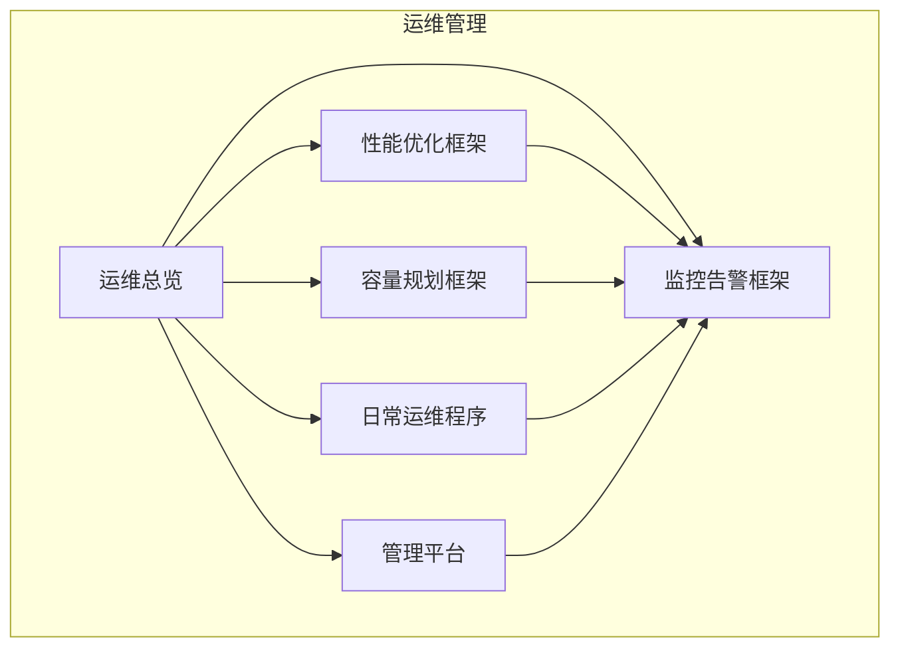

**章节来源**
- file://14-operations-management/readme-zh.md#L1-L126

## 核心组件
- 多层监控系统：基础设施层（物理/虚拟资源）、应用层（O-RAN服务/网络功能）、业务层（KPI/SLA/客户体验）。
- 指标采集框架：系统指标、Kubernetes指标、存储/网络指标、RIC/接口/服务/性能指标、业务KPI/SLA/QoS/业务影响指标。
- 智能告警引擎：告警分级（信息/警告/错误/严重）、类别（基础设施/应用/网络/安全/业务）、阈值规则、通知通道（邮件/微信/短信）。
- 告警关联与去重：资源耗尽/级联故障/网络性能下降的关联规则与升级策略。
- 可视化仪表板：实时运营仪表板（系统状态、健康指标、性能指标、业务指标、活跃告警、趋势图表）。
- 自动化修复：基于告警的自愈动作框架（CPU高/内存耗尽/RIC无响应等场景的动作集合）。
- 性能优化：网络接口优化（巨帧/队列/优先级）、内核参数、NUMA感知绑定；计算层优化（CPU亲和性/调度）；容器资源优化（requests/limits/探针）。
- 容量规划：机器学习预测模型、自动扩展策略、成本优化分析、容量基准测试。
- 配置管理：备份/恢复/版本控制、变更流程、回滚机制、审计与合规。
- 自动化与平台化：ONOS/OpenDaylight/ONAP/Ansible/ArgoCD/Terraform等工具链集成。

**章节来源**
- file://14-operations-management/monitoring-alerting/operations-monitoring-framework-zh.md#L8-L44
- file://14-operations-management/monitoring-alerting/operations-monitoring-framework-zh.md#L48-L260
- file://14-operations-management/monitoring-alerting/operations-monitoring-framework-zh.md#L266-L486
- file://14-operations-management/monitoring-alerting/operations-monitoring-framework-zh.md#L490-L528
- file://14-operations-management/monitoring-alerting/operations-monitoring-framework-zh.md#L534-L692
- file://14-operations-management/monitoring-alerting/operations-monitoring-framework-zh.md#L698-L809
- file://14-operations-management/performance-optimization/performance-optimization-framework-zh.md#L8-L101
- file://14-operations-management/performance-optimization/performance-optimization-framework-zh.md#L106-L234
- file://14-operations-management/performance-optimization/performance-optimization-framework-zh.md#L238-L342
- file://14-operations-management/capacity-planning/capacity-planning-framework-zh.md#L8-L186
- file://14-operations-management/capacity-planning/capacity-planning-framework-zh.md#L190-L266
- file://14-operations-management/capacity-planning/capacity-planning-framework-zh.md#L270-L359
- file://14-operations-management/capacity-planning/capacity-planning-framework-zh.md#L364-L503
- file://14-operations-management/daily-operations/daily-operation-procedures-zh.md#L8-L66
- file://14-operations-management/daily-operations/daily-operation-procedures-zh.md#L68-L161
- file://14-operations-management/daily-operations/daily-operation-procedures-zh.md#L163-L281
- file://14-operations-management/daily-operations/daily-operation-procedures-zh.md#L283-L359
- file://22-tool-platforms/management-platforms/o-ran-management-platforms-zh.md#L8-L72
- file://22-tool-platforms/management-platforms/o-ran-management-platforms-zh.md#L134-L291
- file://22-tool-platforms/management-platforms/o-ran-management-platforms-zh.md#L293-L452
- file://22-tool-platforms/management-platforms/o-ran-management-platforms-zh.md#L534-L709

## 架构总览
下图展示了O-RAN运维体系的总体架构：由多层监控采集指标，经智能告警引擎进行阈值与趋势分析，触发通知与自动化修复；同时通过可视化仪表板呈现KPI与趋势；容量规划与性能优化贯穿于日常运维与平台化支撑之中。

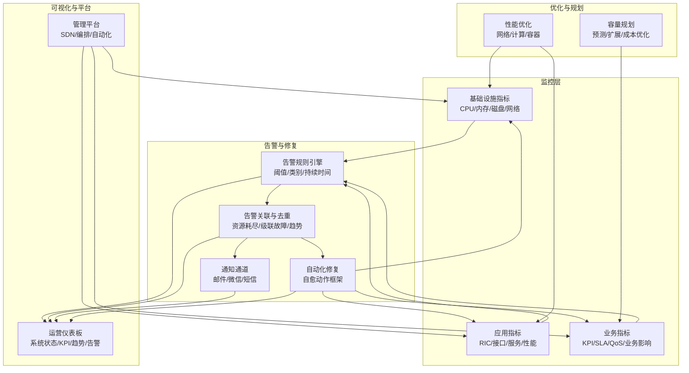

**图表来源**
- [运营监控告警系统（中文）](file://14-operations-management/monitoring-alerting/operations-monitoring-framework-zh.md#L8-L44)
- [运营监控告警系统（中文）](file://14-operations-management/monitoring-alerting/operations-monitoring-framework-zh.md#L266-L486)
- [运营监控告警系统（中文）](file://14-operations-management/monitoring-alerting/operations-monitoring-framework-zh.md#L534-L692)
- [性能优化框架（中文）](file://14-operations-management/performance-optimization/performance-optimization-framework-zh.md#L8-L101)
- [容量规划框架（中文）](file://14-operations-management/capacity-planning/capacity-planning-framework-zh.md#L8-L186)
- [管理平台（中文）](file://22-tool-platforms/management-platforms/o-ran-management-platforms-zh.md#L8-L72)

**章节来源**
- file://14-operations-management/monitoring-alerting/operations-monitoring-framework-zh.md#L8-L44
- file://14-operations-management/monitoring-alerting/operations-monitoring-framework-zh.md#L266-L486
- file://14-operations-management/monitoring-alerting/operations-monitoring-framework-zh.md#L534-L692
- file://14-operations-management/performance-optimization/performance-optimization-framework-zh.md#L8-L101
- file://14-operations-management/capacity-planning/capacity-planning-framework-zh.md#L8-L186
- file://22-tool-platforms/management-platforms/o-ran-management-platforms-zh.md#L8-L72

## 详细组件分析

### 监控与告警系统
- 多层监控架构：基础设施（节点/CPU/内存/磁盘/网络/K8s）、应用（RIC/接口/服务/性能）、业务（KPI/SLA/QoS/业务影响）。
- 指标采集框架：封装MetricsCollector类，分别采集基础设施、应用、业务指标，并提供统一的时间戳与结构化输出。
- 智能告警引擎：封装AlertManager类，支持阈值规则、告警分级与类别、通知通道、告警去重与关联规则。
- 可视化仪表板：前端组件通过WebSocket接收指标与告警，渲染系统状态、KPI、趋势与活跃告警列表。
- 自动化修复：AutomatedRemediation类根据告警标题匹配修复动作，执行一系列自愈操作并记录历史。

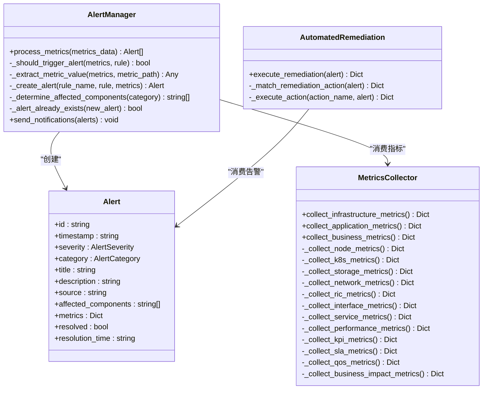

**图表来源**
- [运营监控告警系统（中文）](file://14-operations-management/monitoring-alerting/operations-monitoring-framework-zh.md#L48-L260)
- [运营监控告警系统（中文）](file://14-operations-management/monitoring-alerting/operations-monitoring-framework-zh.md#L266-L486)
- [运营监控告警系统（中文）](file://14-operations-management/monitoring-alerting/operations-monitoring-framework-zh.md#L698-L809)

**章节来源**
- file://14-operations-management/monitoring-alerting/operations-monitoring-framework-zh.md#L48-L260
- file://14-operations-management/monitoring-alerting/operations-monitoring-framework-zh.md#L266-L486
- file://14-operations-management/monitoring-alerting/operations-monitoring-framework-zh.md#L698-L809

### 告警处理流程（序列图）
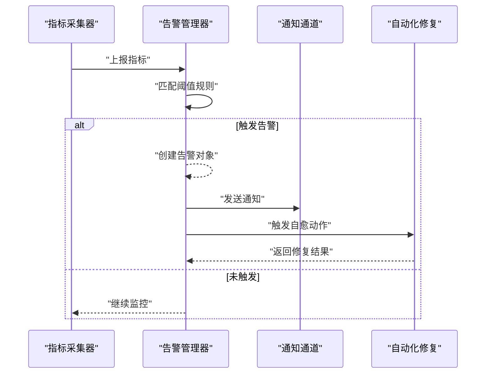

**图表来源**
- [运营监控告警系统（中文）](file://14-operations-management/monitoring-alerting/operations-monitoring-framework-zh.md#L348-L486)
- [运营监控告警系统（中文）](file://14-operations-management/monitoring-alerting/operations-monitoring-framework-zh.md#L698-L809)

**章节来源**
- file://14-operations-management/monitoring-alerting/operations-monitoring-framework-zh.md#L348-L486
- file://14-operations-management/monitoring-alerting/operations-monitoring-framework-zh.md#L698-L809

### 告警关联与去重（流程图）
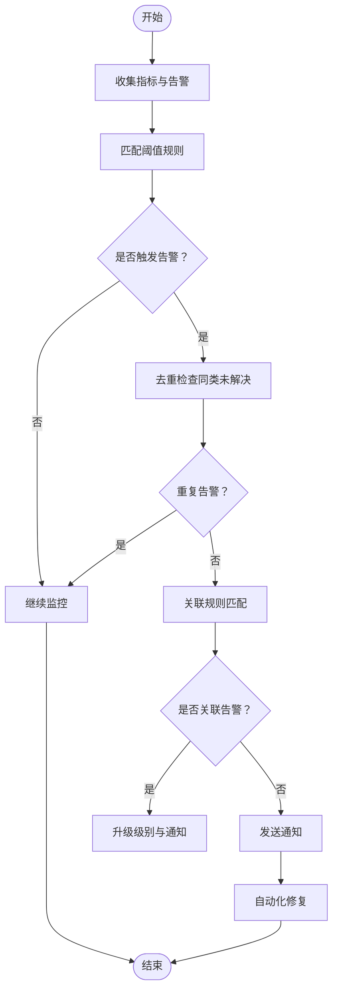

**图表来源**
- [运营监控告警系统（中文）](file://14-operations-management/monitoring-alerting/operations-monitoring-framework-zh.md#L361-L428)
- [运营监控告警系统（中文）](file://14-operations-management/monitoring-alerting/operations-monitoring-framework-zh.md#L490-L528)

**章节来源**
- file://14-operations-management/monitoring-alerting/operations-monitoring-framework-zh.md#L361-L428
- file://14-operations-management/monitoring-alerting/operations-monitoring-framework-zh.md#L490-L528

### 可视化仪表板（概念图）
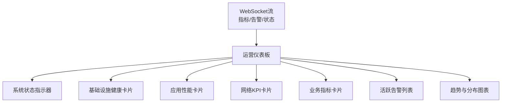

**图表来源**
- [运营监控告警系统（中文）](file://14-operations-management/monitoring-alerting/operations-monitoring-framework-zh.md#L534-L692)

**章节来源**
- file://14-operations-management/monitoring-alerting/operations-monitoring-framework-zh.md#L534-L692

### 性能优化组件
- 网络性能优化：禁用特定卸载、设置环形缓冲区、中断聚合、巨帧、队列与优先级、流量控制与优先级标记。
- 内核网络参数：增大缓冲区、TCP优化（BBR/低延迟）、减少FIN超时与保活时间。
- NUMA感知绑定：将网络中断绑定到特定CPU核心。
- 计算性能优化：CPU拓扑解析、进程亲和性设置、优先级调整、内核调度器调优。
- 容器资源优化：Deployment资源请求/限制、探针配置、环境变量（GC/并发）。
- 性能仪表板：Prometheus查询表达式、阈值与刷新策略。

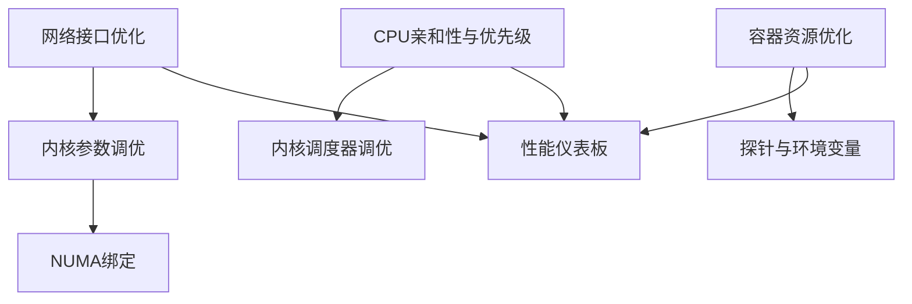

**图表来源**
- [性能优化框架（中文）](file://14-operations-management/performance-optimization/performance-optimization-framework-zh.md#L8-L101)
- [性能优化框架（中文）](file://14-operations-management/performance-optimization/performance-optimization-framework-zh.md#L106-L234)
- [性能优化框架（中文）](file://14-operations-management/performance-optimization/performance-optimization-framework-zh.md#L238-L342)

**章节来源**
- file://14-operations-management/performance-optimization/performance-optimization-framework-zh.md#L8-L101
- file://14-operations-management/performance-optimization/performance-optimization-framework-zh.md#L106-L234
- file://14-operations-management/performance-optimization/performance-optimization-framework-zh.md#L238-L342

### 容量规划组件
- 负载预测模型：时间特征（小时/星期/月份/周末）、滞后特征、滚动统计，随机森林回归训练与预测。
- 可扩展性设计：水平扩展与垂直扩展对比、适用场景与权衡。
- 自动扩展配置：基于CPU/用户数/吞吐量的阈值与冷却期、实例上下限。
- 成本优化：资源利用分析、优化建议、报告生成。
- 容量基准测试：并发用户扫描、吞吐量/延迟/错误率统计、容量建议。

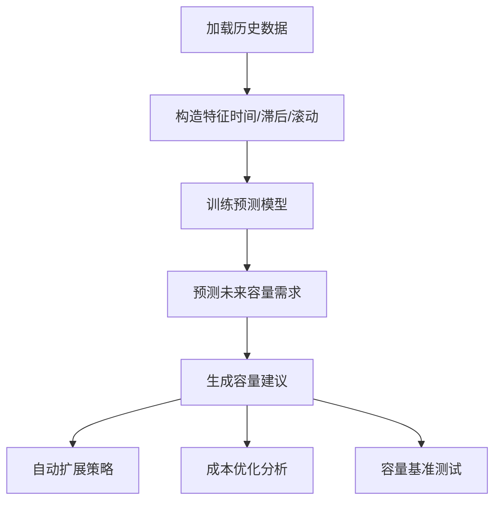

**图表来源**
- [容量规划框架（中文）](file://14-operations-management/capacity-planning/capacity-planning-framework-zh.md#L18-L186)
- [容量规划框架（中文）](file://14-operations-management/capacity-planning/capacity-planning-framework-zh.md#L190-L266)
- [容量规划框架（中文）](file://14-operations-management/capacity-planning/capacity-planning-framework-zh.md#L270-L359)
- [容量规划框架（中文）](file://14-operations-management/capacity-planning/capacity-planning-framework-zh.md#L364-L503)

**章节来源**
- file://14-operations-management/capacity-planning/capacity-planning-framework-zh.md#L18-L186
- file://14-operations-management/capacity-planning/capacity-planning-framework-zh.md#L190-L266
- file://14-operations-management/capacity-planning/capacity-planning-framework-zh.md#L270-L359
- file://14-operations-management/capacity-planning/capacity-planning-framework-zh.md#L364-L503

### 配置管理与变更流程
- 配置备份与恢复：备份计划、位置与频率、配置项清单、备份脚本示例。
- 变更管理流程：请求、评估与审批、实施、验证与回滚。
- 日常健康检查：组件健康状态检查脚本、网络接口监控与告警。
- 事件响应矩阵：严重性等级、升级时间线、沟通协议。
- 故障排除手册：常见接口问题的诊断与解决步骤。

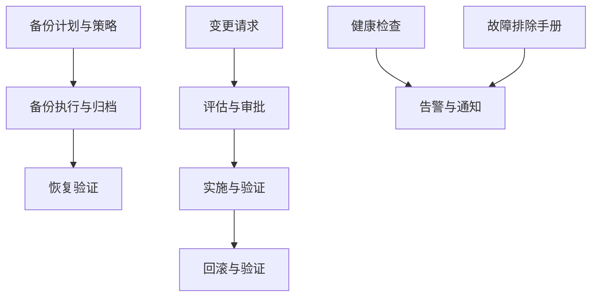

**图表来源**
- [日常运维程序（中文）](file://14-operations-management/daily-operations/daily-operation-procedures-zh.md#L163-L281)
- [日常运维程序（中文）](file://14-operations-management/daily-operations/daily-operation-procedures-zh.md#L8-L66)
- [日常运维程序（中文）](file://14-operations-management/daily-operations/daily-operation-procedures-zh.md#L283-L359)

**章节来源**
- file://14-operations-management/daily-operations/daily-operation-procedures-zh.md#L163-L281
- file://14-operations-management/daily-operations/daily-operation-procedures-zh.md#L8-L66
- file://14-operations-management/daily-operations/daily-operation-procedures-zh.md#L283-L359

### 平台化与自动化支撑
- SDN控制器：ONOS与OpenDaylight的集成架构、YANG模型、NETCONF/TLS/Call-home配置。
- 编排与自动化：ONAP服务编排、Ansible角色与部署剧本、验证与回档。
- RIC管理平台：近实时/非实时RIC平台架构、Helm部署、监控与可视化。
- CI/CD与GitOps：ArgoCD应用配置、GitOps仓库结构、Terraform模块化基础设施。

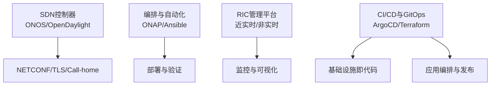

**图表来源**
- [管理平台（中文）](file://22-tool-platforms/management-platforms/o-ran-management-platforms-zh.md#L8-L72)
- [管理平台（中文）](file://22-tool-platforms/management-platforms/o-ran-management-platforms-zh.md#L134-L291)
- [管理平台（中文）](file://22-tool-platforms/management-platforms/o-ran-management-platforms-zh.md#L293-L452)
- [管理平台（中文）](file://22-tool-platforms/management-platforms/o-ran-management-platforms-zh.md#L534-L709)

**章节来源**
- file://22-tool-platforms/management-platforms/o-ran-management-platforms-zh.md#L8-L72
- file://22-tool-platforms/management-platforms/o-ran-management-platforms-zh.md#L134-L291
- file://22-tool-platforms/management-platforms/o-ran-management-platforms-zh.md#L293-L452
- file://22-tool-platforms/management-platforms/o-ran-management-platforms-zh.md#L534-L709

## 依赖关系分析
- 组件耦合：监控采集器与告警管理器强耦合（指标输入），告警管理器与通知通道/自动化修复弱耦合（可插拔）。
- 外部依赖：Prometheus/Grafana（监控与可视化）、Kubernetes（容器编排）、SDN控制器（网络控制）、GitOps平台（ArgoCD/Terraform）。
- 平台集成：管理平台提供SDN/编排/自动化能力，支撑监控与告警的统一入口与闭环处置。

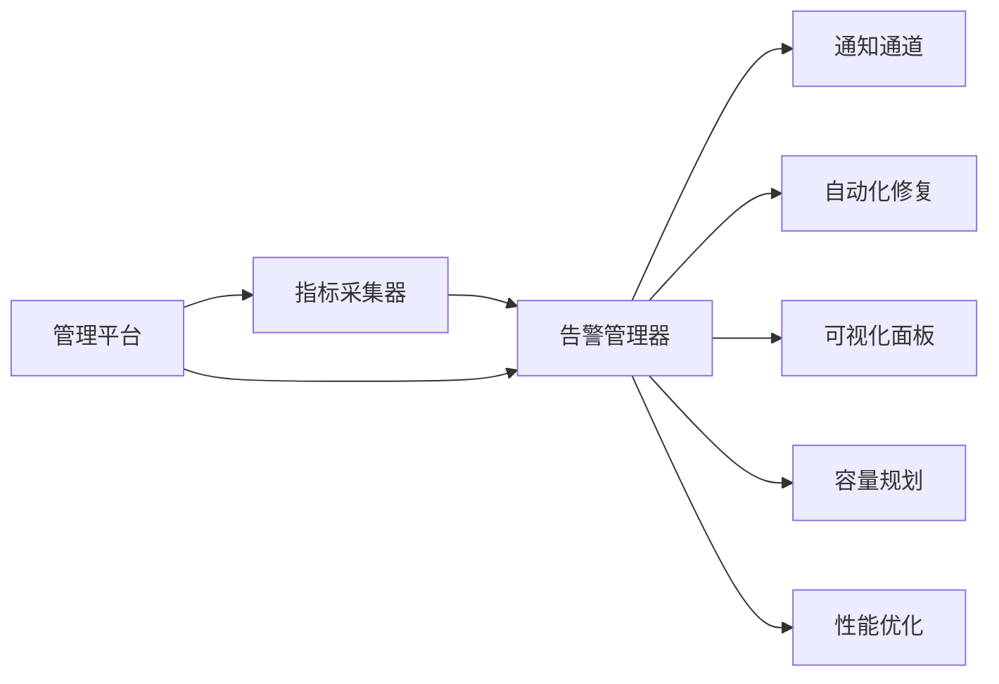

**图表来源**
- [运营监控告警系统（中文）](file://14-operations-management/monitoring-alerting/operations-monitoring-framework-zh.md#L48-L260)
- [运营监控告警系统（中文）](file://14-operations-management/monitoring-alerting/operations-monitoring-framework-zh.md#L266-L486)
- [管理平台（中文）](file://22-tool-platforms/management-platforms/o-ran-management-platforms-zh.md#L8-L72)

**章节来源**
- file://14-operations-management/monitoring-alerting/operations-monitoring-framework-zh.md#L48-L260
- file://14-operations-management/monitoring-alerting/operations-monitoring-framework-zh.md#L266-L486
- file://22-tool-platforms/management-platforms/o-ran-management-platforms-zh.md#L8-L72

## 性能考量
- 指标采集频率与存储：合理设置采集间隔与保留策略，避免指标风暴。
- 告警阈值与持续时间：区分瞬时波动与真实异常，减少噪声告警。
- 自动化修复的幂等性与回滚：确保修复动作可重复、可回退，避免二次伤害。
- 性能优化的渐进式实施：网络/计算/容器优化应分阶段验证，结合容量测试与基准报告。
- 可观测性与成本平衡：在保证SLA的前提下，控制监控与日志存储成本。

## 故障排查指南
- 快速定位：依据告警类别与影响范围，结合仪表板趋势与历史基线进行定位。
- 影响范围控制：隔离故障域，限制扩散，优先保障关键业务KPI。
- 故障恢复：优先自动化修复，必要时人工介入，遵循回滚与验证流程。
- 根因分析：结合日志、指标与变更记录，形成复盘报告与改进措施。
- 预防性维护：基于容量预测与健康检查，提前识别风险并实施优化。

**章节来源**
- file://14-operations-management/daily-operations/daily-operation-procedures-zh.md#L283-L359
- file://14-operations-management/monitoring-alerting/operations-monitoring-framework-zh.md#L266-L486

## 结论
本运维管理体系以“监控—告警—修复—优化—规划—平台化”为主线，结合仓库中的指标采集、告警规则、可视化、自动化修复、性能优化、容量规划与平台化工具链，形成一套可落地的O-RAN运维实践框架。建议在实际部署中，按层次逐步完善监控与告警阈值、强化自动化修复与回滚机制、持续开展容量预测与性能优化，并通过管理平台实现编排与GitOps治理，最终达成高可用、可扩展、可审计的O-RAN运营目标。

## 附录
- SLA与KPI管理：在业务层KPI与SLA指标基础上，建立监控与报告机制，定期评估服务达标情况。
- 配置审计与合规：通过版本控制与变更流程，确保配置一致性与可追溯性，满足合规要求。
- 备份与恢复：制定多级备份策略与演练计划，确保在故障场景下的快速恢复。