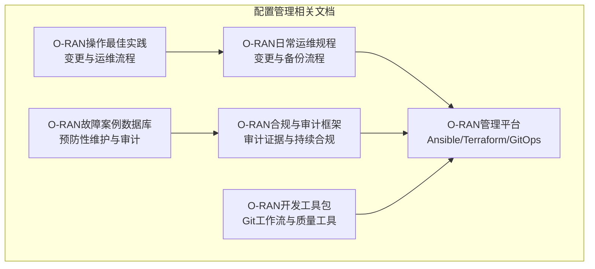
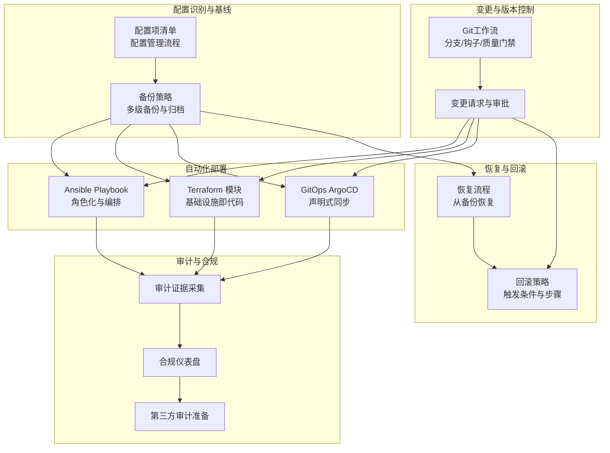
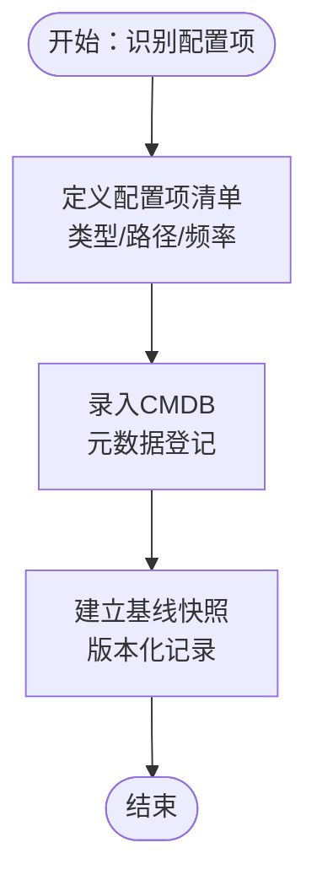
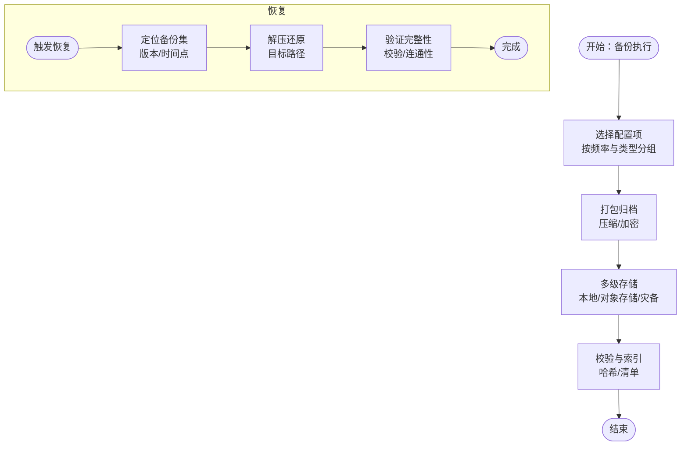
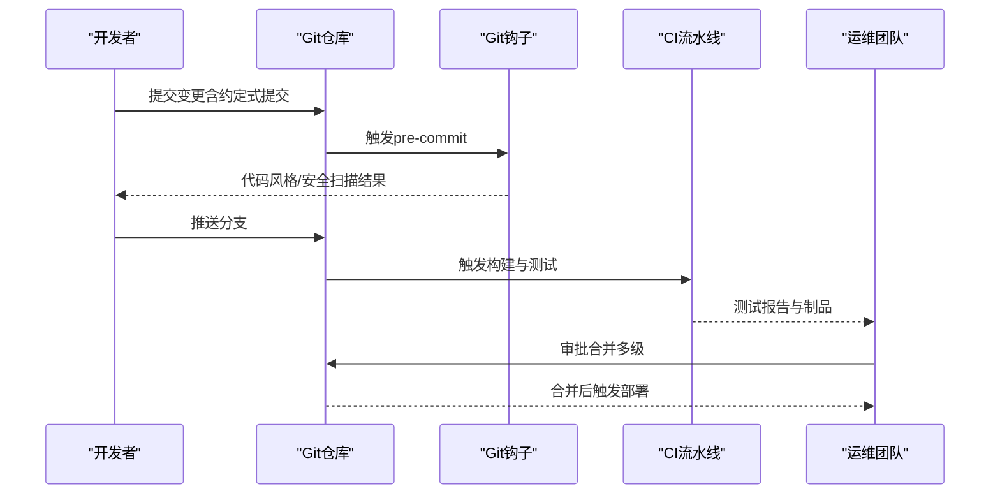
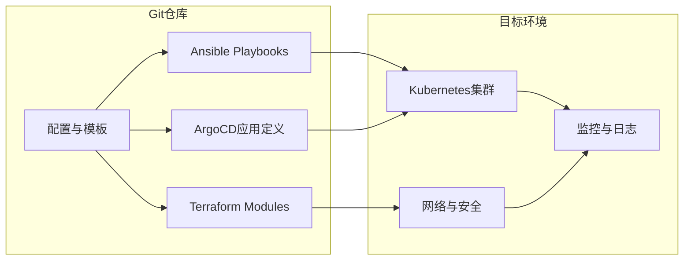
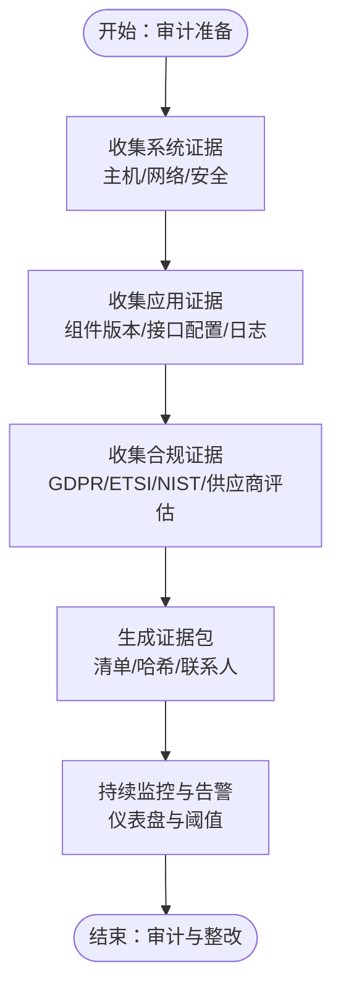
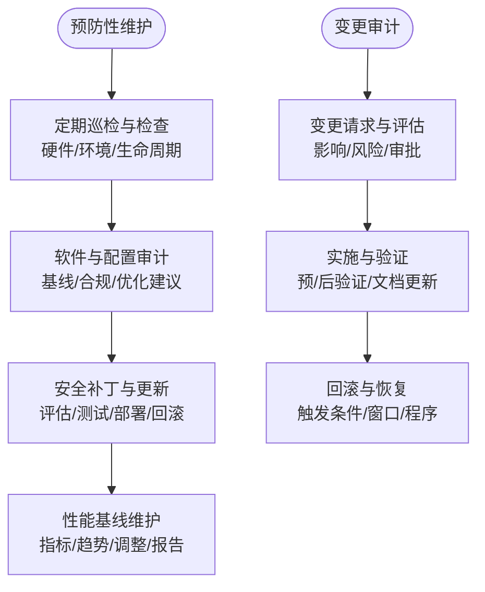
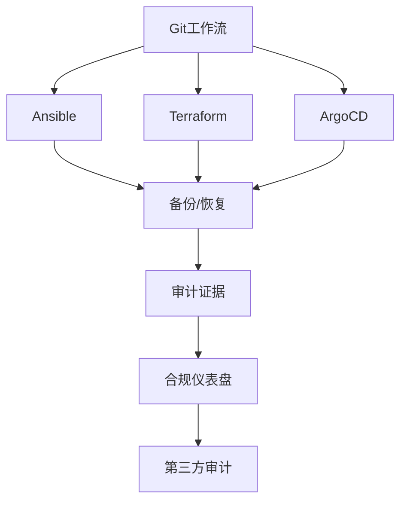

# 配置管理

<cite>
**本文引用的文件**
- [O-RAN日常运维规程.md](file://14-operations-management/daily-operations/daily-operation-procedures.md)
- [O-RAN合规与审计框架.md](file://12-security-privacy/compliance-auditing/compliance-auditing-framework.md)
- [O-RAN管理平台.md](file://22-tool-platforms/management-platforms/o-ran-management-platforms.md)
- [O-RAN开发工具包.md](file://22-tool-platforms/development-tools/o-ran-development-toolkit.md)
- [O-RAN操作最佳实践.md](file://30-best-practices/operations-practices/o-ran-operations-best-practices.md)
- [O-RAN故障案例数据库.md](file://27-troubleshooting-diagnosis/fault-library/o-ran-fault-case-database.md)
</cite>

## 目录
1. [简介](#简介)
2. [项目结构](#项目结构)
3. [核心组件](#核心组件)
4. [架构总览](#架构总览)
5. [详细组件分析](#详细组件分析)
6. [依赖关系分析](#依赖关系分析)
7. [性能考量](#性能考量)
8. [故障排查指南](#故障排查指南)
9. [结论](#结论)
10. [附录](#附录)

## 简介
本文件面向O-RAN集中配置管理，围绕CMDB设计、配置数据库维护与配置同步、版本控制与变更历史、自动化部署（Ansible/Terraform）、审计与合规、备份与恢复、标准化流程与治理等方面，提供系统化指导。内容基于仓库中现有文档提炼与整合，强调可落地的操作流程与最佳实践。

## 项目结构
本仓库包含大量与O-RAN相关的文档，其中与配置管理直接相关的关键文档如下：
- 日常运维与变更流程：O-RAN日常运维规程
- 合规与审计：O-RAN合规与审计框架
- 平台与自动化：O-RAN管理平台（含Ansible、Terraform、GitOps）
- 开发工具与版本控制：O-RAN开发工具包
- 运维最佳实践：O-RAN操作最佳实践
- 故障与预防性维护：O-RAN故障案例数据库

**图表来源**
- [O-RAN日常运维规程.md](file://14-operations-management/daily-operations/daily-operation-procedures.md#L163-L280)
- [O-RAN合规与审计框架.md](file://12-security-privacy/compliance-auditing/compliance-auditing-framework.md#L199-L486)
- [O-RAN管理平台.md](file://22-tool-platforms/management-platforms/o-ran-management-platforms.md#L208-L709)
- [O-RAN开发工具包.md](file://22-tool-platforms/development-tools/o-ran-development-toolkit.md#L64-L109)
- [O-RAN操作最佳实践.md](file://30-best-practices/operations-practices/o-ran-operations-best-practices.md#L23-L36)
- [O-RAN故障案例数据库.md](file://27-troubleshooting-diagnosis/fault-library/o-ran-fault-case-database.md#L171-L225)

**章节来源**
- [O-RAN日常运维规程.md](file://14-operations-management/daily-operations/daily-operation-procedures.md#L1-L443)
- [O-RAN合规与审计框架.md](file://12-security-privacy/compliance-auditing/compliance-auditing-framework.md#L1-L486)
- [O-RAN管理平台.md](file://22-tool-platforms/management-platforms/o-ran-management-platforms.md#L1-L711)
- [O-RAN开发工具包.md](file://22-tool-platforms/development-tools/o-ran-development-toolkit.md#L1-L488)
- [O-RAN操作最佳实践.md](file://30-best-practices/operations-practices/o-ran-operations-best-practices.md#L1-L275)
- [O-RAN故障案例数据库.md](file://27-troubleshooting-diagnosis/fault-library/o-ran-fault-case-database.md#L171-L225)

## 核心组件
- 集中配置管理与CMDB
  - 以“配置项清单”“备份策略”“变更流程”为核心，形成可追溯、可回滚的配置管理体系。
- 配置数据库与同步
  - 通过集中存储与多级备份（本地/对象存储/灾备）确保一致性与可用性；结合自动化脚本实现增量与全量同步。
- 版本控制与变更历史
  - 基于Git工作流（分支策略、钩子、质量门禁）保障变更可追踪、可审计、可回滚。
- 自动化部署与模板管理
  - Ansible角色化与任务编排、Terraform模块化基础设施、GitOps声明式同步。
- 审计与合规
  - 审计证据采集、合规仪表盘、第三方审计准备清单与流程化管理。
- 备份与恢复
  - 明确备份频率、位置与恢复步骤，覆盖关键组件配置与运行时状态。

**章节来源**
- [O-RAN日常运维规程.md](file://14-operations-management/daily-operations/daily-operation-procedures.md#L163-L280)
- [O-RAN管理平台.md](file://22-tool-platforms/management-platforms/o-ran-management-platforms.md#L208-L709)
- [O-RAN开发工具包.md](file://22-tool-platforms/development-tools/o-ran-development-toolkit.md#L64-L109)
- [O-RAN合规与审计框架.md](file://12-security-privacy/compliance-auditing/compliance-auditing-framework.md#L199-L486)

## 架构总览
下图展示从“配置项识别与备份”到“变更实施与回滚”的闭环流程，并映射到仓库中的具体文档片段。

**图表来源**
- [O-RAN日常运维规程.md](file://14-operations-management/daily-operations/daily-operation-procedures.md#L163-L280)
- [O-RAN管理平台.md](file://22-tool-platforms/management-platforms/o-ran-management-platforms.md#L208-L709)
- [O-RAN开发工具包.md](file://22-tool-platforms/development-tools/o-ran-development-toolkit.md#L64-L109)
- [O-RAN合规与审计框架.md](file://12-security-privacy/compliance-auditing/compliance-auditing-framework.md#L199-L486)

## 详细组件分析

### 配置识别与基线（CMDB与配置项）
- 配置项清单应覆盖关键组件（如近端RT RIC、O-DU/O-CU、SMO策略等），明确类型、路径与备份频率。
- 建议在CMDB中登记配置项元数据（版本、最后修改时间、责任人、依赖关系）并纳入变更流程。

**图表来源**
- [O-RAN日常运维规程.md](file://14-operations-management/daily-operations/daily-operation-procedures.md#L163-L217)

**章节来源**
- [O-RAN日常运维规程.md](file://14-operations-management/daily-operations/daily-operation-procedures.md#L163-L217)

### 配置备份与恢复
- 备份策略：按小时/日/周设定不同粒度，多级存储（本地、对象存储、灾备）。
- 恢复流程：明确触发条件、恢复步骤与验证方法，确保可重复性与可验证性。

**图表来源**
- [O-RAN日常运维规程.md](file://14-operations-management/daily-operations/daily-operation-procedures.md#L163-L217)

**章节来源**
- [O-RAN日常运维规程.md](file://14-operations-management/daily-operations/daily-operation-procedures.md#L163-L217)

### 变更管理与版本控制（Git工作流）
- 分支策略：主干/开发/特性/发布/热修复，配合预提交/提交消息/提交后钩子。
- 质量门禁：代码风格、安全扫描、许可证头、变更日志生成。
- 变更流程：请求、评估、审批、实施、验证、回滚、文档更新。

**图表来源**
- [O-RAN开发工具包.md](file://22-tool-platforms/development-tools/o-ran-development-toolkit.md#L64-L109)

**章节来源**
- [O-RAN开发工具包.md](file://22-tool-platforms/development-tools/o-ran-development-toolkit.md#L64-L109)
- [O-RAN日常运维规程.md](file://14-operations-management/daily-operations/daily-operation-procedures.md#L219-L280)
- [O-RAN操作最佳实践.md](file://30-best-practices/operations-practices/o-ran-operations-best-practices.md#L23-L36)

### 自动化部署（Ansible Playbooks与Terraform）
- Ansible：按角色组织（O-DU/O-CU/Near-RT RIC/监控），支持滚动升级、验证与回滚。
- Terraform：模块化基础设施（Kubernetes集群、网络、安全组），支持多云与弹性伸缩。
- GitOps：ArgoCD声明式同步，自动修剪与自愈，忽略差异与联系人信息管理。

**图表来源**
- [O-RAN管理平台.md](file://22-tool-platforms/management-platforms/o-ran-management-platforms.md#L208-L709)

**章节来源**
- [O-RAN管理平台.md](file://22-tool-platforms/management-platforms/o-ran-management-platforms.md#L208-L709)

### 审计与合规（证据采集与持续监控）
- 审计证据采集：系统信息、安全配置、网络配置、应用证据、合规证据，生成证据包与清单。
- 持续合规：仪表盘指标（合规分数、控制有效性、审计整改率），阈值告警与整改跟踪。
- 第三方审计：准备清单、技术文档、人员准备、测试结果与报告生成。

**图表来源**
- [O-RAN合规与审计框架.md](file://12-security-privacy/compliance-auditing/compliance-auditing-framework.md#L238-L486)

**章节来源**
- [O-RAN合规与审计框架.md](file://12-security-privacy/compliance-auditing/compliance-auditing-framework.md#L199-L486)

### 预防性维护与变更审计（流程化管理）
- 预防性维护：硬件健康、环境条件、组件生命周期、软件与配置审计、安全补丁与更新、性能基线维护。
- 变更审计：变更请求模板、影响评估、审批链、实施前后验证、回滚程序、文档更新。

**图表来源**
- [O-RAN故障案例数据库.md](file://27-troubleshooting-diagnosis/fault-library/o-ran-fault-case-database.md#L171-L225)
- [O-RAN日常运维规程.md](file://14-operations-management/daily-operations/daily-operation-procedures.md#L219-L280)

**章节来源**
- [O-RAN故障案例数据库.md](file://27-troubleshooting-diagnosis/fault-library/o-ran-fault-case-database.md#L171-L225)
- [O-RAN日常运维规程.md](file://14-operations-management/daily-operations/daily-operation-procedures.md#L219-L280)

## 依赖关系分析
- 配置管理依赖于：
  - 版本控制系统（Git）：提供变更追踪、分支与合并、钩子与质量门禁。
  - 自动化平台（Ansible/Terraform/ArgoCD）：提供可重复的部署与同步能力。
  - 审计与合规体系：提供证据采集、持续监控与第三方审计支撑。
- 关键耦合点：
  - 变更流程与自动化部署的衔接（变更→测试→部署→验证→回滚）。
  - 备份与恢复与配置项清单的绑定（按项备份、按项恢复）。
  - 审计证据与配置变更日志的关联（变更→审计证据→合规报告）。

**图表来源**
- [O-RAN开发工具包.md](file://22-tool-platforms/development-tools/o-ran-development-toolkit.md#L64-L109)
- [O-RAN管理平台.md](file://22-tool-platforms/management-platforms/o-ran-management-platforms.md#L208-L709)
- [O-RAN日常运维规程.md](file://14-operations-management/daily-operations/daily-operation-procedures.md#L163-L280)
- [O-RAN合规与审计框架.md](file://12-security-privacy/compliance-auditing/compliance-auditing-framework.md#L199-L486)

**章节来源**
- [O-RAN开发工具包.md](file://22-tool-platforms/development-tools/o-ran-development-toolkit.md#L64-L109)
- [O-RAN管理平台.md](file://22-tool-platforms/management-platforms/o-ran-management-platforms.md#L208-L709)
- [O-RAN日常运维规程.md](file://14-operations-management/daily-operations/daily-operation-procedures.md#L163-L280)
- [O-RAN合规与审计框架.md](file://12-security-privacy/compliance-auditing/compliance-auditing-framework.md#L199-L486)

## 性能考量
- 备份性能：采用增量备份与并行归档，避免高峰时段对业务的影响。
- 部署性能：Ansible并行度与Terraform并发控制，合理设置重试与超时。
- 监控与告警：基于Prometheus/Grafana的KPI仪表盘，设置合理的阈值与收敛时间。
- 安全与合规：在CI中集成安全扫描与合规检查，避免低质量变更进入生产。

[本节为通用指导，不直接分析具体文件]

## 故障排查指南
- 变更失败：检查变更日志、回滚脚本与验证步骤，必要时执行回滚并复盘。
- 配置不一致：核对CMDB与实际配置，比对最近一次备份与当前状态差异。
- 审计证据缺失：检查证据采集脚本与存储路径，确认清单与哈希完整性。
- 自动化失败：查看Ansible/Terraform/ArgoCD日志，定位资源冲突或权限问题。

**章节来源**
- [O-RAN日常运维规程.md](file://14-operations-management/daily-operations/daily-operation-procedures.md#L219-L280)
- [O-RAN合规与审计框架.md](file://12-security-privacy/compliance-auditing/compliance-auditing-framework.md#L238-L486)
- [O-RAN管理平台.md](file://22-tool-platforms/management-platforms/o-ran-management-platforms.md#L208-L709)

## 结论
通过将配置识别与基线、备份与恢复、变更与版本控制、自动化部署与GitOps、审计与合规有机整合，可构建高可靠、可追溯、可回滚的O-RAN集中配置管理体系。建议在实践中持续完善流程、工具与度量，确保配置治理与业务连续性。

[本节为总结性内容，不直接分析具体文件]

## 附录
- 变更管理流程（简化版）
  - 请求→评估→审批→实施→验证→回滚→文档更新
- 备份策略要点
  - 小时级增量、日/周全量、多级存储、校验与索引、可验证恢复
- 审计证据清单
  - 系统信息、安全配置、网络配置、应用证据、合规证据、证据包与清单

**章节来源**
- [O-RAN日常运维规程.md](file://14-operations-management/daily-operations/daily-operation-procedures.md#L219-L280)
- [O-RAN合规与审计框架.md](file://12-security-privacy/compliance-auditing/compliance-auditing-framework.md#L238-L486)