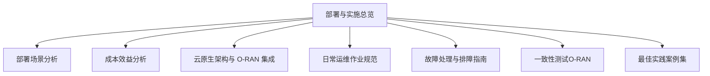
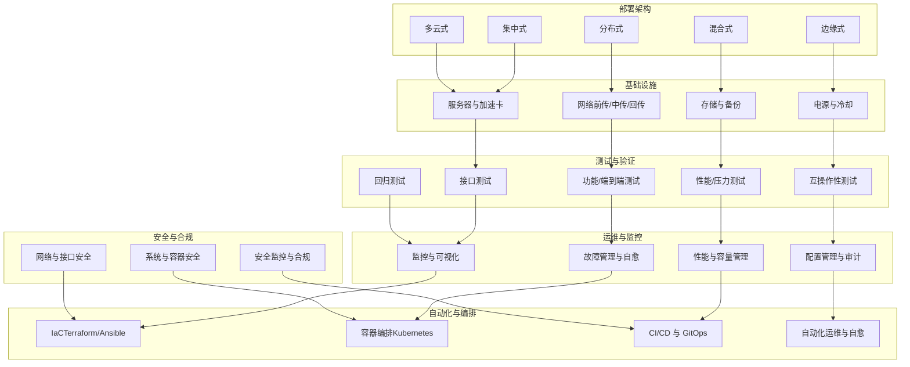
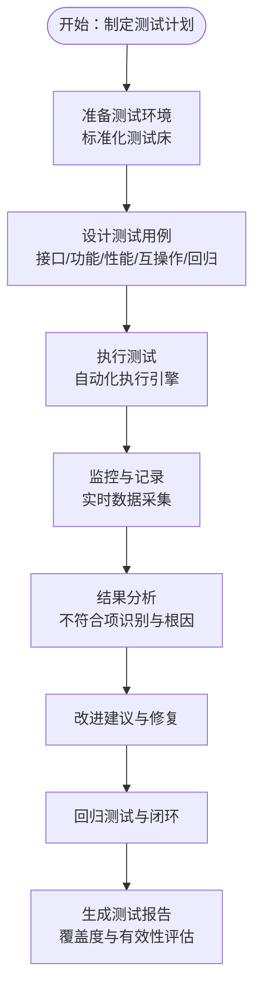
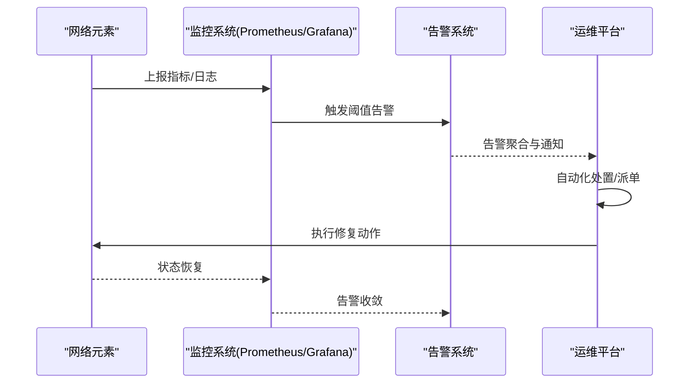
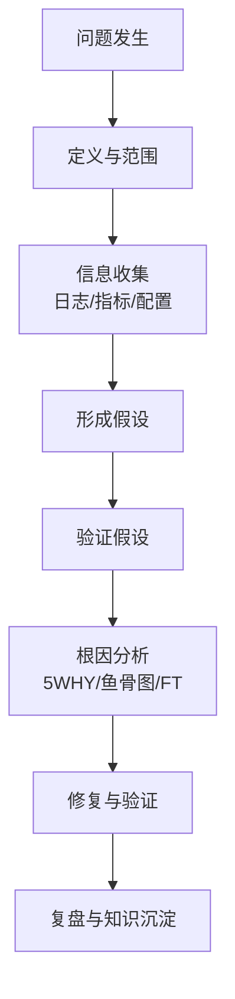
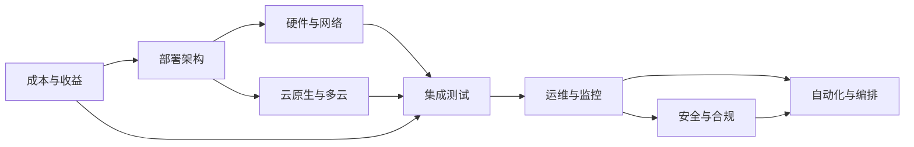
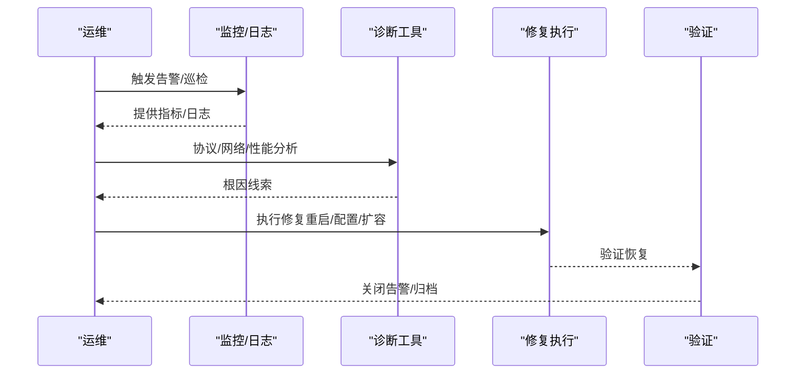

# 部署与实施

<cite>
**本文引用的文件**
- [部署与实施（总览）](file://08-deployment-implementation/readme.md)
- [部署场景分析](file://04-disaggregation-options/deployment-scenarios.md)
- [成本效益分析](file://04-disaggregation-options/cost-benefit-analysis.md)
- [云原生架构与 O-RAN 集成](file://05-cloud-integration/cloud-native-architecture.md)
- [日常运维作业规范](file://14-operations-management/daily-operations/daily-operation-procedures.md)
- [故障处理与排障指南](file://14-operations-management/fault-handling/fault-troubleshooting-guide.md)
- [一致性测试（O-RAN）](file://13-testing-validation/conformance-testing/o-ran-conformance-testing.md)
- [最佳实践案例集](file://21-case-studies/best-practices/o-ran-best-practice-cases.md)
</cite>

## 目录
1. [引言](#引言)
2. [项目结构](#项目结构)
3. [核心组件](#核心组件)
4. [架构总览](#架构总览)
5. [详细组件分析](#详细组件分析)
6. [依赖分析](#依赖分析)
7. [性能考虑](#性能考虑)
8. [故障排查指南](#故障排查指南)
9. [结论](#结论)
10. [附录](#附录)

## 引言
本文件面向 O-RAN 部署与实施，围绕部署架构设计、硬件与基础设施规划、集成测试策略、运维管理体系、故障排查方法论、安全实施与自动化编排等方面，提供系统化、可落地的实践指导。内容来源于 O-RAN 产业共识与最佳实践，结合多厂商、多场景的工程经验，帮助读者在真实网络中实现高质量、高可靠、高效率的 O-RAN 部署与运营。

## 项目结构
本仓库与“部署与实施”主题直接相关的内容主要分布在以下目录：
- 08-deployment-implementation：部署与实施总览，包含架构设计、硬件规划、测试策略、运维体系、排障与安全、自动化编排等
- 04-disaggregation-options：解耦与部署场景分析、成本效益评估
- 05-cloud-integration：云原生与 O-RAN 集成、容器编排与多云部署
- 14-operations-management：日常运维、故障处理、监控与告警
- 13-testing-validation：一致性测试与验证
- 21-case-studies：最佳实践案例集

**图表来源**
- [部署与实施（总览）](file://08-deployment-implementation/readme.md#L1-L353)
- [部署场景分析](file://04-disaggregation-options/deployment-scenarios.md#L1-L563)
- [成本效益分析](file://04-disaggregation-options/cost-benefit-analysis.md#L1-L418)
- [云原生架构与 O-RAN 集成](file://05-cloud-integration/cloud-native-architecture.md#L1-L481)
- [日常运维作业规范](file://14-operations-management/daily-operations/daily-operation-procedures.md#L1-L443)
- [故障处理与排障指南](file://14-operations-management/fault-handling/fault-troubleshooting-guide.md#L1-L633)
- [一致性测试（O-RAN）](file://13-testing-validation/conformance-testing/o-ran-conformance-testing.md#L1-L67)
- [最佳实践案例集](file://21-case-studies/best-practices/o-ran-best-practice-cases.md#L1-L210)

**章节来源**
- [部署与实施（总览）](file://08-deployment-implementation/readme.md#L1-L353)

## 核心组件
- 部署架构设计：集中式、分布式、混合式、边缘式、多云部署的适用场景、权衡与实施要点
- 硬件与基础设施：服务器规格、网络基础设施、存储架构、电源与冷却
- 集成测试：接口测试、功能测试、性能测试、互操作性测试、回归测试
- 运维管理体系：监控、故障管理、性能管理、配置管理、容量管理
- 故障排查：问题分类、排障流程、诊断工具、根因分析方法、标准作业程序
- 安全实施：网络与接口安全、系统与容器安全、监控与合规
- 自动化与编排：基础设施即代码、CI/CD、容器编排、自动化运维与自愈

**章节来源**
- [部署与实施（总览）](file://08-deployment-implementation/readme.md#L6-L196)

## 架构总览
下图展示了 O-RAN 部署的关键要素与相互关系，涵盖架构设计、基础设施、测试与运维、安全与自动化等维度。

**图表来源**
- [部署与实施（总览）](file://08-deployment-implementation/readme.md#L8-L196)
- [云原生架构与 O-RAN 集成](file://05-cloud-integration/cloud-native-architecture.md#L1-L481)
- [日常运维作业规范](file://14-operations-management/daily-operations/daily-operation-procedures.md#L1-L443)
- [故障处理与排障指南](file://14-operations-management/fault-handling/fault-troubleshooting-guide.md#L1-L633)
- [一致性测试（O-RAN）](file://13-testing-validation/conformance-testing/o-ran-conformance-testing.md#L1-L67)

## 详细组件分析

### 部署架构设计
- 集中式：核心 CU 集中于数据中心，DU 分布在边缘，RU 在站点侧；适合广覆盖、管理效率优先场景
- 分布式：CU/DU 分散部署，强调低时延与就近处理，适合 URLLC、工业控制等场景
- 混合式：核心集中管理、边缘本地处理，兼顾集中管控与边缘性能，适合多业务与跨区域部署
- 边缘式：与 MEC 深度集成，面向低时延应用，强调本地化与协同
- 多云式：公私混合与跨云编排，关注数据主权、灾备与高可用

实施要点
- 明确业务目标与 SLA，结合带宽、时延、可靠性与成本进行取舍
- 以 CU/DU 解耦与前传分割为基础，选择合适的 Split Option 与回传技术
- 设计跨域协同机制、数据一致性与故障隔离策略
- 分阶段滚动部署，先试点再推广，持续优化

**章节来源**
- [部署与实施（总览）](file://08-deployment-implementation/readme.md#L8-L38)
- [部署场景分析](file://04-disaggregation-options/deployment-scenarios.md#L9-L214)
- [成本效益分析](file://04-disaggregation-options/cost-benefit-analysis.md#L1-L418)

### 硬件与基础设施规划
- 服务器规格：CU（高算力、高吞吐）、DU（实时处理与加速）、RIC（AI/ML 加速）、SMO（管理与数据库）
- 网络基础设施：前传（光纤/交换机/带宽）、中传（IP 承载/QoS）、回传（核心互联/路由）、数据中心网络（Spine-Leaf/VXLAN）
- 存储架构：分布式存储、持久化策略、备份与恢复、容量与性能规划
- 电源与冷却：电力设计、UPS/柴油机、冷却系统、能耗优化

**章节来源**
- [部署与实施（总览）](file://08-deployment-implementation/readme.md#L40-L60)
- [部署场景分析](file://04-disaggregation-options/deployment-scenarios.md#L296-L364)

### 集成测试策略
- 接口测试：E2（消息流与错误处理）、A1（策略下发与监控）、O1（配置/告警/性能）、O-FH（同步/带宽/误码）、F1（CU-DU 信令/承载）
- 功能测试：端到端业务、切换/重选、承载与 QoS
- 性能测试：并发负载、极限压力、端到端时延、吞吐与稳定性
- 互操作性测试：多厂商兼容、协议一致性、Plugfest 与认证准备
- 回归测试：升级/变更/补丁验证、自动化测试与 CI/CD

**图表来源**
- [一致性测试（O-RAN）](file://13-testing-validation/conformance-testing/o-ran-conformance-testing.md#L1-L67)
- [部署与实施（总览）](file://08-deployment-implementation/readme.md#L62-L92)

**章节来源**
- [部署与实施（总览）](file://08-deployment-implementation/readme.md#L62-L92)
- [一致性测试（O-RAN）](file://13-testing-validation/conformance-testing/o-ran-conformance-testing.md#L1-L67)

### 运维管理体系
- 监控系统：Prometheus/Grafana 集成、多维监控（网络/系统/应用/业务）、告警聚合、可视化与日志管理
- 故障管理：自动检测、影响域控制、隔离与恢复、根因分析、预防性维护
- 性能管理：KPI/KQI 收集、趋势与瓶颈分析、参数调优与资源优化、容量预测与 SLA 管理
- 配置管理：CMDB/配置库、版本控制、自动化（Ansible/Terraform）、审计与备份恢复
- 容量管理：资源使用监控、预测模型、弹性与手动扩容、成本优化

**图表来源**
- [日常运维作业规范](file://14-operations-management/daily-operations/daily-operation-procedures.md#L361-L442)

**章节来源**
- [部署与实施（总览）](file://08-deployment-implementation/readme.md#L94-L125)
- [日常运维作业规范](file://14-operations-management/daily-operations/daily-operation-procedures.md#L1-L443)

### 故障排查方法论
- 问题分类：接口故障（E2/A1/O1/O-FH/F1）、性能/可用性/配置/兼容性
- 排障流程：问题定义与范围、信息收集（日志/指标/配置）、假设验证、根因分析、修复与验证
- 诊断工具：Wireshark/tcpdump、协议分析器、ELK/Splunk、性能分析（Perf/火焰图）、网络工具（Ping/Traceroute/MTR）
- 根因分析：5 问法、鱼骨图、故障树、时间线、相关性分析
- SOP：故障响应、升级、沟通、复盘与知识库更新

**图表来源**
- [故障处理与排障指南](file://14-operations-management/fault-handling/fault-troubleshooting-guide.md#L31-L180)

**章节来源**
- [部署与实施（总览）](file://08-deployment-implementation/readme.md#L126-L156)
- [故障处理与排障指南](file://14-operations-management/fault-handling/fault-troubleshooting-guide.md#L1-L633)

### 安全实施
- 网络安全：VLAN/VXLAN/切片、ACL/防火墙、TLS/IPsec、DDoS 清洗
- 接口安全：OAuth/mTLS、RBAC/ABAC、API 限流与输入校验、消息完整性
- 系统安全：OS 硬化、镜像扫描、运行时保护、代码审计、依赖检查、加密存储与脱敏
- 安全监控：SIEM/IDS/IPS、UEBA/ML 检测、漏洞扫描与渗透测试、合规审计

**章节来源**
- [部署与实施（总览）](file://08-deployment-implementation/readme.md#L158-L179)

### 自动化与编排
- 基础设施即代码：Terraform 模板、Ansible Playbook、Kubernetes Manifest、CI/CD（GitLab/Jenkins）
- 自动化运维：蓝绿/金丝雀发布、HPA/VPA、自愈机制、自动备份
- 编排工具：Kubernetes、Helm、ArgoCD、Prometheus Operator

**章节来源**
- [部署与实施（总览）](file://08-deployment-implementation/readme.md#L180-L196)
- [云原生架构与 O-RAN 集成](file://05-cloud-integration/cloud-native-architecture.md#L1-L481)

## 依赖分析
- 架构与基础设施：部署架构决定服务器与网络配置、存储与电源设计
- 测试与运维：测试驱动运维指标与告警策略，运维反馈优化测试用例
- 安全与自动化：安全策略嵌入自动化流程，自动化提升安全执行效率
- 成本与收益：解耦与部署方式直接影响 TCO、ROI 与业务价值

**图表来源**
- [部署与实施（总览）](file://08-deployment-implementation/readme.md#L6-L196)
- [成本效益分析](file://04-disaggregation-options/cost-benefit-analysis.md#L1-L418)

**章节来源**
- [部署与实施（总览）](file://08-deployment-implementation/readme.md#L6-L196)
- [成本效益分析](file://04-disaggregation-options/cost-benefit-analysis.md#L1-L418)

## 性能考虑
- 时延与带宽：结合业务类型（eMBB/URLLC/mMTC）与地理分布，选择合适的解耦与部署方式
- 资源与容量：基于历史数据与预测模型进行容量规划，结合弹性与自动化实现资源优化
- 网络与存储：Spine-Leaf/VXLAN、QoS、分布式存储与缓存策略
- 能耗与冷却：集中式与分布式在能耗上的权衡，UPS/制冷与节能优化

**章节来源**
- [部署场景分析](file://04-disaggregation-options/deployment-scenarios.md#L296-L364)
- [成本效益分析](file://04-disaggregation-options/cost-benefit-analysis.md#L67-L85)

## 故障排查指南
- 常见问题分类与排障流程
- 诊断工具与根因分析方法
- 标准作业程序（SOP）与升级机制
- 自动化恢复与预防性维护

**图表来源**
- [故障处理与排障指南](file://14-operations-management/fault-handling/fault-troubleshooting-guide.md#L31-L180)
- [日常运维作业规范](file://14-operations-management/daily-operations/daily-operation-procedures.md#L283-L442)

**章节来源**
- [故障处理与排障指南](file://14-operations-management/fault-handling/fault-troubleshooting-guide.md#L1-L633)
- [日常运维作业规范](file://14-operations-management/daily-operations/daily-operation-procedures.md#L1-L443)

## 结论
O-RAN 部署与实施是一个系统工程，涉及架构设计、基础设施、测试验证、运维管理、安全与自动化等多个维度。通过科学的部署架构选择、严谨的测试策略、完善的运维体系、系统化的排障方法与持续的安全加固，以及以云原生与自动化为核心的工程能力，可以有效提升网络性能、可靠性与运营效率，并在多厂商、多场景下实现规模化与可持续发展。

## 附录
- 参考案例：德國電信、樂天移動、Verizon、Vodafone 等成功实践，总结出战略规划、实施卓越与运营卓越的关键成功因素
- 标准与规范：O-RAN 联盟、ETSI、3GPP 等标准文件与白皮书

**章节来源**
- [最佳实践案例集](file://21-case-studies/best-practices/o-ran-best-practice-cases.md#L1-L210)