# 分布式部署架构

<cite>
**本文引用的文件**
- [O-RAN 功能分布](file://01-architecture-system/functional-distribution.md)
- [O-Cloud 架构](file://01-architecture-system/o-cloud-architecture.md)
- [部署场景分析](file://04-disaggregation-options/deployment-scenarios.md)
- [解耦选项的性能影响](file://04-disaggregation-options/performance-impact.md)
- [O-RAN Implementation](file://08-deployment-implementation/readme.md)
- [O-RAN 功能分布](file://01-architecture-system/functional-distribution.md)
- [O-RAN Implementation](file://08-deployment-implementation/readme.md)
- [O-Cloud 架构](file://01-architecture-system/o-cloud-architecture.md)
- [部署场景分析](file://04-disaggregation-options/deployment-scenarios.md)
- [O-RAN 功能分布](file://01-architecture-system/functional-distribution.md)
- [O-RAN Implementation](file://08-deployment-implementation/readme.md)
- [O-Cloud 架构](file://01-architecture-system/o-cloud-architecture.md)
- [部署场景分析](file://04-disaggregation-options/deployment-scenarios.md)
- [O-RAN 功能分布](file://01-architecture-system/functional-distribution.md)
- [O-RAN Implementation](file://08-deployment-implementation/readme.md)
- [O-Cloud 架构](file://01-architecture-system/o-cloud-architecture.md)
- [部署场景分析](file://04-disaggregation-options/deployment-scenarios.md)
- [O-RAN 功能分布](file://01-architecture-system/functional-distribution.md)
- [O-RAN Implementation](file://08-deployment-implementation/readme.md)
- [O-Cloud 架构](file://01-architecture-system/o-cloud-architecture.md)
- [部署场景分析](file://04-disaggregation-options/deployment-scenarios.md)
- [O-RAN 功能分布](file://01-architecture-system/functional-distribution.md)
- [O-RAN Implementation](file://08-deployment-implementation/readme.md)
- [O-Cloud 架构](file://01-architecture-system/o-cloud-architecture.md)
- [部署场景分析](file://04-disaggregation-options/deployment-scenarios.md)
- [O-RAN 功能分布](file://01-architecture-system/functional-distribution.md)
- [O-RAN Implementation](file://08-deployment-implementation/readme.md)
- [O-Cloud 架构](file://01-architecture-system/o-cloud-architecture.md)
- [部署场景分析](file://04-disaggregation-options/deployment-scenarios.md)
- [O-RAN 功能分布](file://01-architecture-system/functional-distribution.md)
- [O-RAN Implementation](file://08-deployment-implementation/readme.md)
- [O-Cloud 架构](file://01-architecture-system/o-cloud-architecture.md)
- [部署场景分析](file://04-disaggregation-options/deployment-scenarios.md)
- [O-RAN 功能分布](file://01-architecture-system/functional-distribution.md)
- [O-RAN Implementation](file://08-deployment-implementation/readme.md)
- [O-Cloud 架构](file://01-architecture-system/o-cloud-architecture.md)
- [部署......](file://04-disaggregation-options/deployment-scenarios.md)
</cite>

## 目录
1. [引言](#引言)
2. [项目结构](#项目结构)
3. [核心组件](#核心组件)
4. [架构总览](#架构总览)
5. [详细组件分析](#详细组件分析)
6. [依赖分析](#依赖分析)
7. [性能考量](#性能考量)
8. [故障排查指南](#故障排查指南)
9. [结论](#结论)
10. [附录](#附录)

## 引言
本设计指导围绕分布式O-RAN部署架构展开，聚焦CU/DU分布式部署策略、分布式站点选择原则、跨站点网络设计与数据一致性管理机制，并系统阐述分布式协调机制、故障隔离策略、负载均衡方案与性能优化方法。同时给出实施步骤、技术挑战与解决方案，提供分布式架构的优缺点分析、适用场景评估与最佳实践，覆盖分布式环境下的数据同步、一致性保证与故障恢复策略，帮助读者在生产环境中实现高可靠、低时延、可扩展的O-RAN网络。

## 项目结构
本知识库按主题域组织，与分布式部署密切相关的内容主要分布在以下目录：
- 架构系统：O-RAN功能分布、O-Cloud架构、弹性伸缩、分层架构
- 解耦选项：部署场景、功能分割、性能影响、成本效益
- 部署实施：部署架构设计、硬件与基础设施规划、集成测试、运维管理、故障处理、安全与自动化
- 安全与隐私：安全架构、认证授权、数据保护、网络与合规
- 性能优化：网络优化、计算优化、应用调优、容量规划、监控工具
- 故障排查：硬件故障、软件故障、网络问题、诊断工具、故障案例库

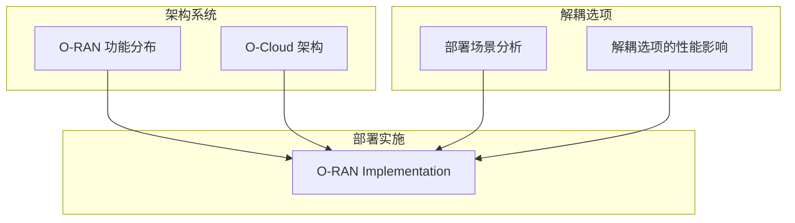

**图示来源**
- [O-RAN 功能分布](file://01-architecture-system/functional-distribution.md#L1-L325)
- [O-Cloud 架构](file://01-architecture-system/o-cloud-architecture.md#L1-L238)
- [部署场景分析](file://04-disaggregation-options/deployment-scenarios.md#L1-L563)
- [解耦选项的性能影响](file://04-disaggregation-options/performance-impact.md#L1-L285)
- [O-RAN Implementation](file://08-deployment-implementation/readme.md#L1-L353)

**章节来源**
- [O-RAN 功能分布](file://01-architecture-system/functional-distribution.md#L1-L325)
- [O-Cloud 架构](file://01-architecture-system/o-cloud-architecture.md#L1-L238)
- [部署场景分析](file://04-disaggregation-options/deployment-scenarios.md#L1-L563)
- [解耦选项的性能影响](file://04-disaggregation-options/performance-impact.md#L1-L285)
- [O-RAN Implementation](file://08-deployment-implementation/readme.md#L1-L353)

## 核心组件
- 服务层与编排：SMO、xApps/rApps、服务编排器，负责服务生命周期、编排与暴露，支撑跨域协同与SLA保障。
- 控制层：Near-RT RIC、Non-RT RIC、CU-CP，负责策略下发、资源调度、故障处理与控制面功能。
- 管理层：SMO管理模块、EMS/NMS、安全管理系统，负责配置、监控、性能、安全与资产管理。
- 基础设施层：O-Cloud、VIM、COE、存储与网络系统，提供计算、存储、网络与容器编排能力。

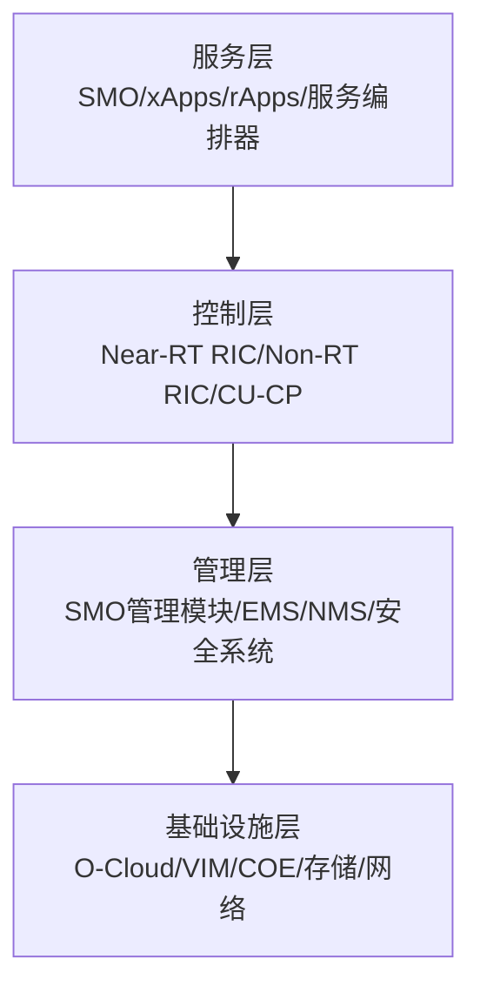

**图示来源**
- [O-RAN 功能分布](file://01-architecture-system/functional-distribution.md#L34-L144)

**章节来源**
- [O-RAN 功能分布](file://01-architecture-system/functional-distribution.md#L34-L144)

## 架构总览
分布式部署以“核心集中、边缘分布”为核心思想，结合业务类型与网络条件，形成集中式、分布式与混合部署的组合策略。O-Cloud提供云原生基础设施，支持虚拟化、容器化与自动化编排；跨站点网络通过前传/中传/后传的带宽与延迟预算设计，保障端到端性能；数据一致性通过分布式协调与同步机制实现。

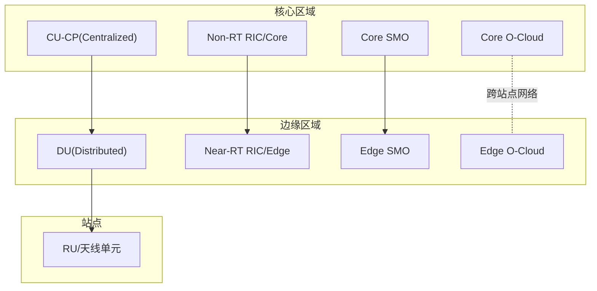

**图示来源**
- [O-RAN 功能分布](file://01-architecture-system/functional-distribution.md#L256-L272)
- [O-Cloud 架构](file://01-architecture-system/o-cloud-architecture.md#L31-L38)
- [部署场景分析](file://04-disaggregation-options/deployment-scenarios.md#L164-L189)

**章节来源**
- [O-RAN 功能分布](file://01-architecture-system/functional-distribution.md#L256-L272)
- [O-Cloud 架构](file://01-architecture-system/o-cloud-architecture.md#L31-L38)
- [部署场景分析](file://04-disaggregation-options/deployment-scenarios.md#L164-L189)

## 详细组件分析

### CU/DU分布式部署策略
- Split Option与延迟/带宽/同步的关系：不同CU/DU解耦选项对端到端延迟、前传带宽与同步精度有显著影响，需结合业务类型（eMBB/URLLC/mMTC）与SLA要求选择。
- 部署形态：集中式（核心数据中心）、分布式（边缘节点）、混合部署（核心集中+边缘分布），以平衡管理效率与低时延。
- 资源与性能：边缘DU就近处理用户面，核心CU集中控制面与策略，结合O-Cloud的容器编排与弹性扩缩容能力，实现动态资源调度。

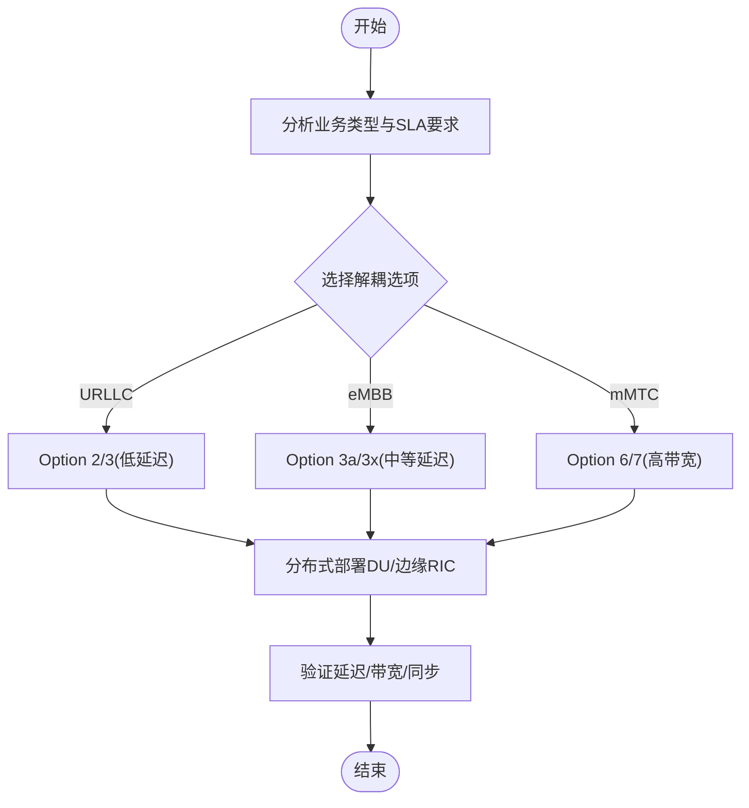

**图示来源**
- [解耦选项的性能影响](file://04-disaggregation-options/performance-impact.md#L7-L35)
- [部署场景分析](file://04-disaggregation-options/deployment-scenarios.md#L110-L136)

**章节来源**
- [解耦选项的性能影响](file://04-disaggregation-options/performance-impact.md#L7-L35)
- [部署场景分析](file://04-disaggregation-options/deployment-scenarios.md#L110-L136)

### 分布式站点选择原则
- 业务密度与覆盖：高密度区域优先分布式部署，降低前传延迟；偏远/低密度区域采用一体化设备与无线回传。
- 传输条件：带宽充足可集中部署，带宽受限或延迟敏感则倾向边缘部署。
- 成本与运维：分布式初期投资低、运维成本高；集中式初期高、后期扩展成本低。
- 技术成熟度与风险：评估设备/标准成熟度与供应商支持能力，结合分阶段部署策略。

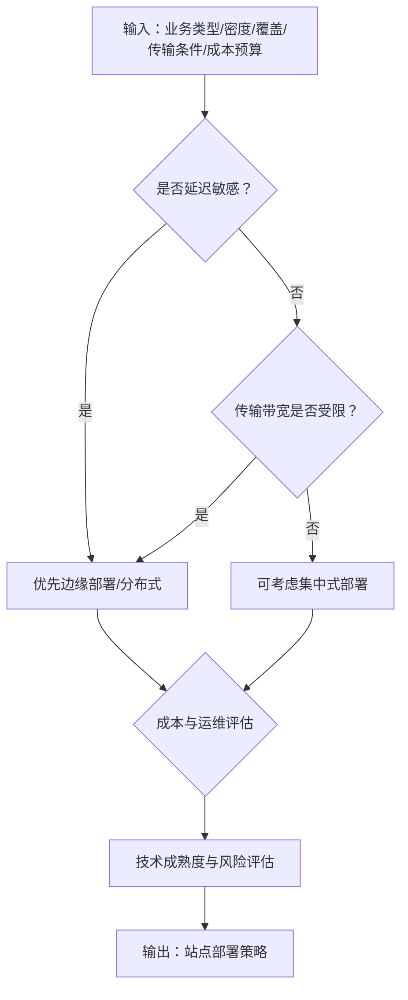

**图示来源**
- [部署场景分析](file://04-disaggregation-options/deployment-scenarios.md#L366-L435)

**章节来源**
- [部署场景分析](file://04-disaggregation-options/deployment-scenarios.md#L366-L435)

### 跨站点网络设计
- 前传/中传/后传带宽与延迟预算：根据解耦选项与RU类型（CPRI/eCPRI/O-RAN高级RU）确定带宽与延迟目标。
- 网络拓扑：星型拓扑适合集中式，网状/混合拓扑适合分布式；边缘与核心之间采用高带宽、低抖动链路。
- QoS与隔离：VLAN/VXLAN/网络切片实现业务隔离与优先级保障；SR-IOV/DPDK等技术提升转发性能。
- 自动化与可观测性：端到端路径监控、告警与可视化，支撑跨域协同与故障定位。

**图示来源**
- [O-RAN Implementation](file://08-deployment-implementation/readme.md#L46-L50)
- [O-Cloud 架构](file://01-architecture-system/o-cloud-architecture.md#L58-L63)

**章节来源**
- [O-RAN Implementation](file://08-deployment-implementation/readme.md#L46-L50)
- [O-Cloud 架构](file://01-architecture-system/o-cloud-architecture.md#L58-L63)

### 数据一致性管理机制
- 分布式协调：Near-RT RIC与Non-RT RIC协作，策略在A1接口下发与反馈，E2接口实现近实时控制与优化。
- 数据同步：核心与边缘之间采用增量同步、批处理与缓存机制，结合分布式锁与版本控制，保证最终一致性。
- 事务与幂等：跨站点操作采用幂等设计与补偿机制，失败重试与超时控制，避免重复执行。
- 容灾与回滚：多活部署与异地备份，故障切换与数据回滚流程，确保业务连续性。

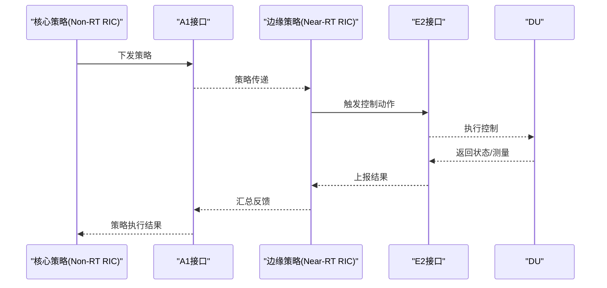

**图示来源**
- [O-RAN 功能分布](file://01-architecture-system/functional-distribution.md#L203-L222)

**章节来源**
- [O-RAN 功能分布](file://01-architecture-system/functional-distribution.md#L203-L222)

### 分布式协调机制
- 分层编排：服务层通过A1接口下发策略，控制层执行并反馈，管理层统一监控与治理。
- 接口协同：E2接口用于近实时控制，A1接口用于策略管理，O1/O2接口用于管理与资源编排。
- 自动化编排：Kubernetes/Helm/ArgoCD实现GitOps与持续交付，结合Prometheus/Grafana实现观测性闭环。

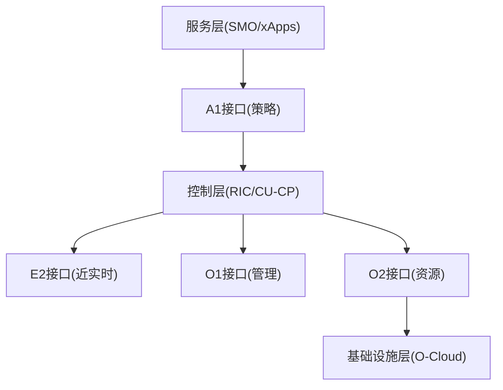

**图示来源**
- [O-RAN 功能分布](file://01-architecture-system/functional-distribution.md#L199-L222)
- [O-RAN Implementation](file://08-deployment-implementation/readme.md#L180-L196)

**章节来源**
- [O-RAN 功能分布](file://01-architecture-system/functional-distribution.md#L199-L222)
- [O-RAN Implementation](file://08-deployment-implementation/readme.md#L180-L196)

### 故障隔离策略
- 故障域划分：按站点/区域/功能模块划分故障域，降低级联影响。
- 冗余与自愈：核心与边缘均采用N+1冗余，自动故障检测与恢复，定期演练验证。
- 管理与安全：严格的网络隔离、访问控制与加密传输，配合入侵检测与安全审计。

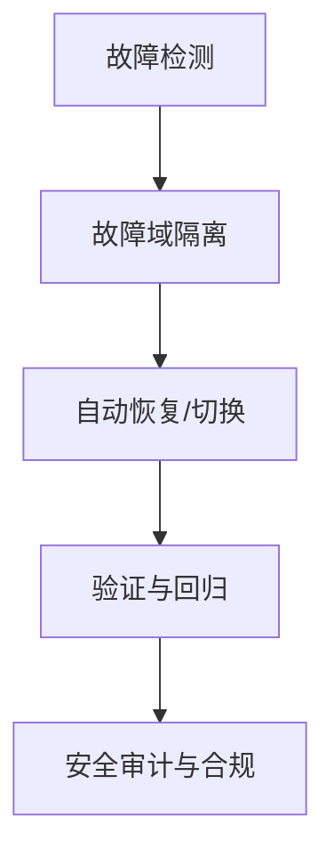

**图示来源**
- [O-Cloud 架构](file://01-architecture-system/o-cloud-architecture.md#L64-L79)
- [O-RAN Implementation](file://08-deployment-implementation/readme.md#L101-L106)

**章节来源**
- [O-Cloud 架构](file://01-architecture-system/o-cloud-architecture.md#L64-L79)
- [O-RAN Implementation](file://08-deployment-implementation/readme.md#L101-L106)

### 负载均衡方案
- 传输层面：链路聚合、流量整形与优先级队列，避免拥塞。
- 计算层面：容器编排自动扩缩容（HPA/VPA），资源预留与NUMA感知优化。
- 应用层面：DU实例横向扩展，边缘与核心之间按业务类型分流。

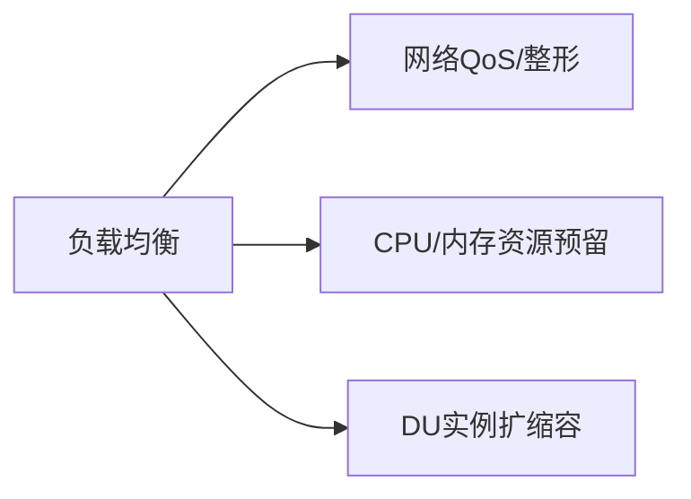

**图示来源**
- [O-RAN Implementation](file://08-deployment-implementation/readme.md#L107-L112)
- [O-Cloud 架构](file://01-architecture-system/o-cloud-architecture.md#L41-L48)

**章节来源**
- [O-RAN Implementation](file://08-deployment-implementation/readme.md#L107-L112)
- [O-Cloud 架构](file://01-architecture-system/o-cloud-architecture.md#L41-L48)

### 性能优化方法
- 延迟优化：减少跳数、SR-IOV/DPDK加速、实时任务调度、硬件直通与NUMA亲和。
- 带宽优化：数据压缩、批量处理、链路聚合、头部压缩与缓存。
- 监控与调优：KPI/KQI采集、趋势分析、瓶颈定位与参数调优。

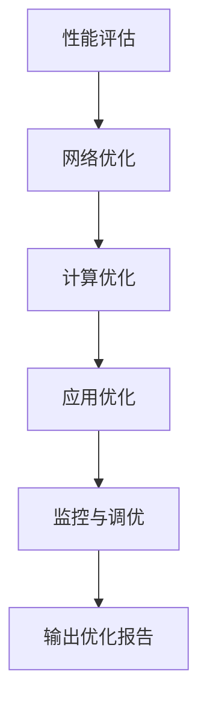

**图示来源**
- [O-RAN Implementation](file://08-deployment-implementation/readme.md#L107-L112)
- [O-Cloud 架构](file://01-architecture-system/o-cloud-architecture.md#L41-L63)

**章节来源**
- [O-RAN Implementation](file://08-deployment-implementation/readme.md#L107-L112)
- [O-Cloud 架构](file://01-architecture-system/o-cloud-architecture.md#L41-L63)

### 实施步骤
- 阶段化部署：核心区域试点→扩展到更多区域→全网混合部署→自动化与业务创新。
- 自动化与编排：IaC（Terraform/Ansible）、CI/CD、GitOps（ArgoCD）、容器编排（Kubernetes）。
- 测试与验证：接口测试（E2/A1/O1/O-FH/F1）、功能/性能/互通/回归测试。
- 运维与安全：监控告警、故障管理、性能管理、配置管理、容量规划、安全加固与合规。

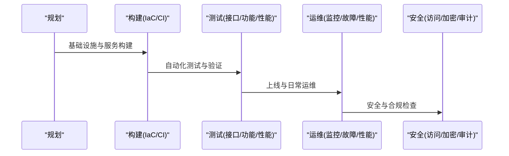

**图示来源**
- [O-RAN Implementation](file://08-deployment-implementation/readme.md#L180-L196)
- [O-RAN Implementation](file://08-deployment-implementation/readme.md#L62-L92)
- [O-RAN Implementation](file://08-deployment-implementation/readme.md#L94-L125)
- [O-RAN Implementation](file://08-deployment-implementation/readme.md#L158-L179)

**章节来源**
- [O-RAN Implementation](file://08-deployment-implementation/readme.md#L180-L196)
- [O-RAN Implementation](file://08-deployment-implementation/readme.md#L62-L92)
- [O-RAN Implementation](file://08-deployment-implementation/readme.md#L94-L125)
- [O-RAN Implementation](file://08-deployment-implementation/readme.md#L158-L179)

### 技术挑战与解决方案
- 挑战：延迟与带宽预算、同步精度、跨域一致性、故障域隔离、多厂商互通、安全与合规。
- 解决：分层部署与解耦选项选择、SR-IOV/DPDK加速、分布式协调与同步、N+1冗余与自愈、标准遵循与Plugfest、零信任与加密。

**章节来源**
- [解耦选项的性能影响](file://04-disaggregation-options/performance-impact.md#L223-L260)
- [O-RAN Implementation](file://08-deployment-implementation/readme.md#L158-L179)

### 优缺点分析与适用场景
- 优点：低时延、就近处理、弹性扩展、资源池化、自动化程度高。
- 缺点：管理复杂度高、跨域一致性与同步成本高、初期投资与运维成本差异较大。
- 适用场景：URLLC（工业互联网/自动驾驶）、eMBB（热点区域）、mMTC（IoT）与边缘计算融合。

**章节来源**
- [部署场景分析](file://04-disaggregation-options/deployment-scenarios.md#L1-L563)

### 最佳实践
- 设计原则：模块化、松耦合、标准化接口、服务化架构。
- 部署策略：集中式/分布式/混合部署的动态调整，基于负载/业务/位置/时间的弹性调度。
- 运维体系：全面监控、智能告警、自动化故障恢复、容量预测与优化、安全审计与合规。

**章节来源**
- [O-RAN 功能分布](file://01-architecture-system/functional-distribution.md#L247-L279)
- [O-RAN Implementation](file://08-deployment-implementation/readme.md#L296-L321)

## 依赖分析
分布式部署涉及跨层交互与跨域依赖，关键依赖关系如下：

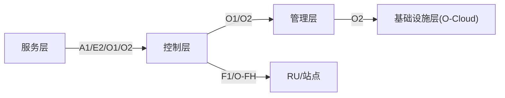

**图示来源**
- [O-RAN 功能分布](file://01-architecture-system/functional-distribution.md#L199-L222)
- [O-RAN Implementation](file://08-deployment-implementation/readme.md#L46-L50)

**章节来源**
- [O-RAN 功能分布](file://01-architecture-system/functional-distribution.md#L199-L222)
- [O-RAN Implementation](file://08-deployment-implementation/readme.md#L46-L50)

## 性能考量
- 端到端延迟：前传/中传/后传链路延迟预算与优化，边缘计算与缓存策略。
- 带宽与吞吐：链路聚合、压缩与批处理，QoS与流量整形。
- 实时性与确定性：NUMA感知、硬实时调度、硬件直通与专用加速卡。
- 监控与调优：KPI/KQI采集、趋势分析、瓶颈定位与参数优化。

**章节来源**
- [O-Cloud 架构](file://01-architecture-system/o-cloud-architecture.md#L41-L63)
- [O-RAN Implementation](file://08-deployment-implementation/readme.md#L107-L112)

## 故障排查指南
- 问题分类：接口故障（E2/A1/O1/O-FH/F1）、性能问题（延迟/吞吐/丢包）、可用性问题、配置问题、兼容性问题。
- 排查流程：问题定义→信息收集（日志/指标/配置）→假设验证→根因分析（5 Why/鱼骨图/故障树）→解决与验证。
- 诊断工具：Wireshark/tcpdump、协议分析器、ELK/Splunk、性能分析工具、网络监控工具。
- SOP：故障响应、升级流程、沟通流程、复盘与知识库更新。

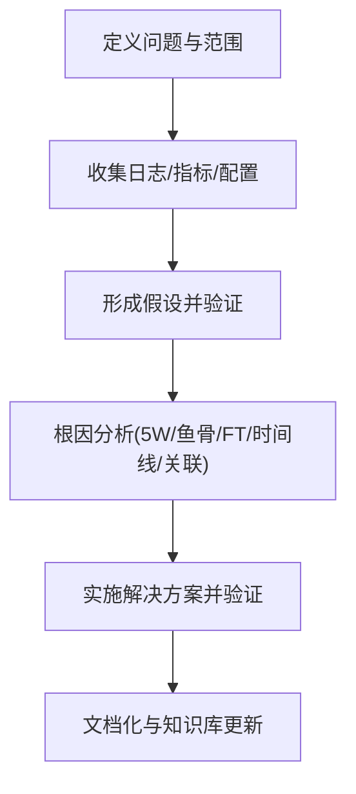

**图示来源**
- [O-RAN Implementation](file://08-deployment-implementation/readme.md#L126-L156)

**章节来源**
- [O-RAN Implementation](file://08-deployment-implementation/readme.md#L126-L156)

## 结论
分布式O-RAN部署以“核心集中、边缘分布”为核心，结合业务类型与网络条件，通过合理的解耦选项、跨站点网络设计与数据一致性机制，实现低时延、高可靠与弹性扩展。依托O-Cloud云原生基础设施与自动化编排，配合完善的监控、故障管理与安全体系，可在生产环境中获得卓越的网络性能与运维效率。

## 附录
- 参考文档与标准：O-RAN Alliance部署指南、ETSI标准、3GPP规范、白皮书与自动化框架。
- 实验室项目：部署架构设计、测试套件开发、监控系统部署、故障演练与自动化部署实践。

**章节来源**
- [O-RAN Implementation](file://08-deployment-implementation/readme.md#L251-L275)
- [O-RAN Implementation](file://08-deployment-implementation/readme.md#L288-L295)