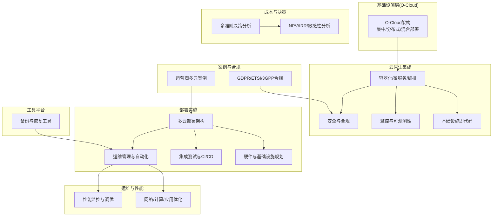
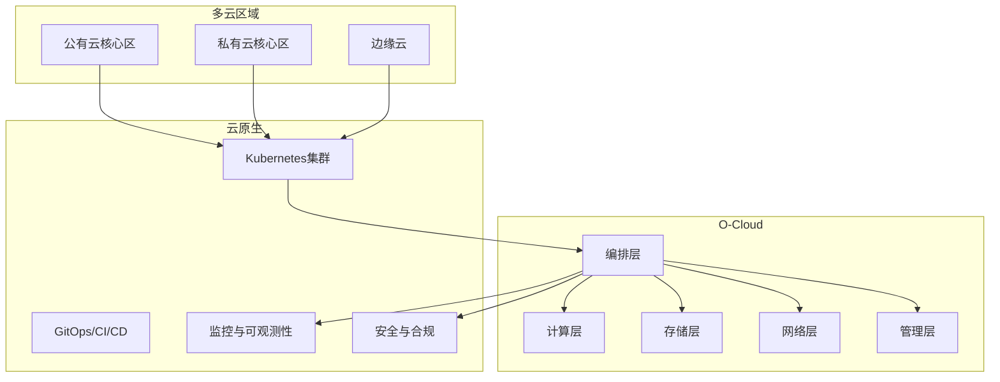
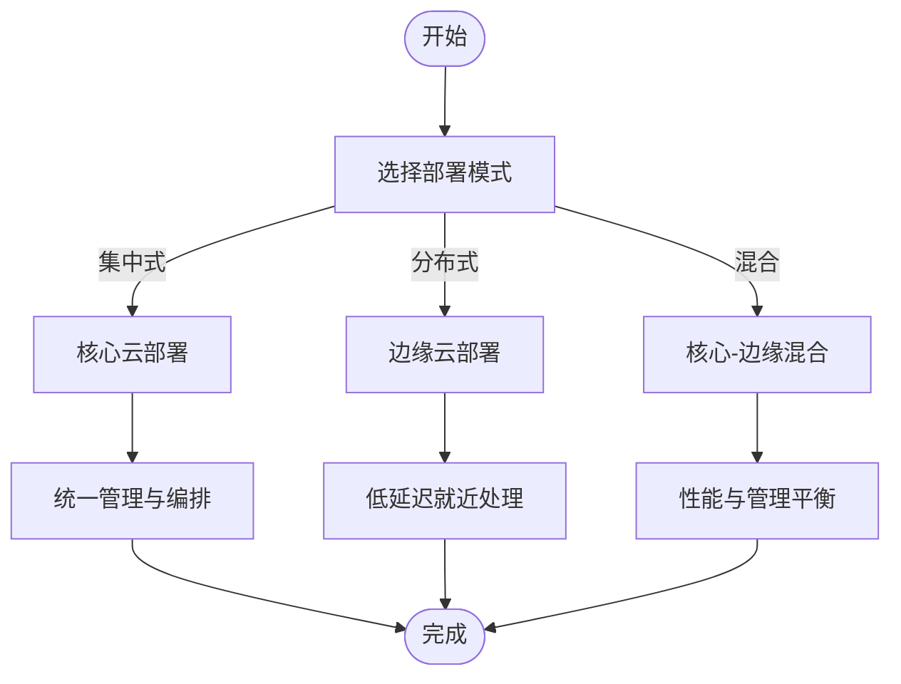
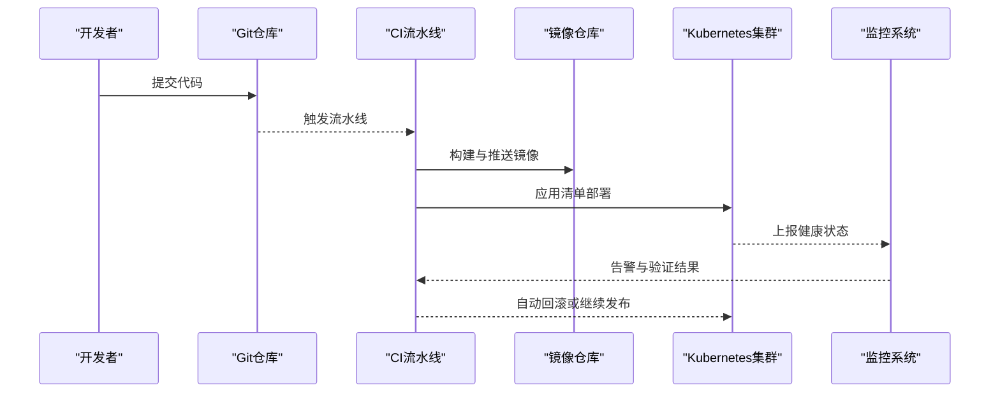
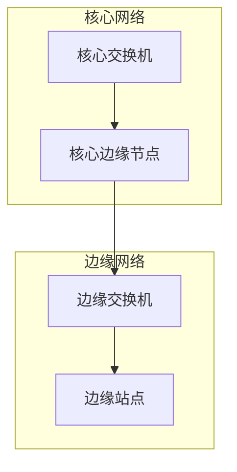
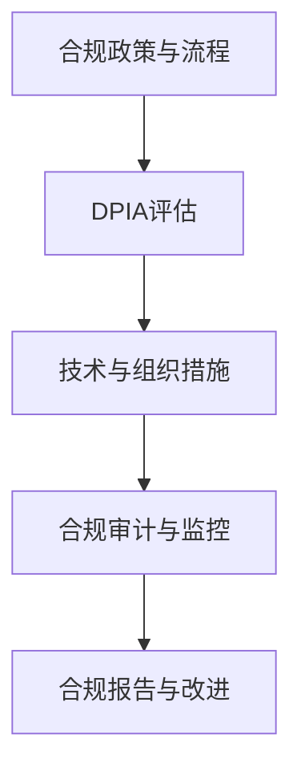
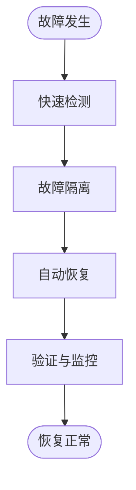
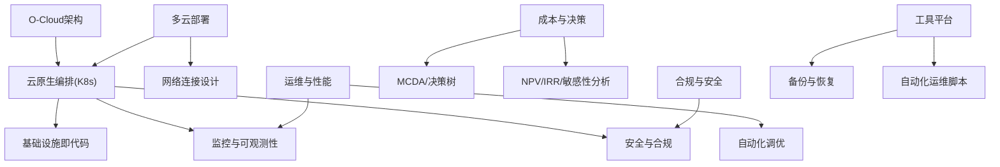

# 多云部署架构

<cite>
**本文引用的文件**
- [01-architecture-system/o-cloud-architecture.md](file://01-architecture-system/o-cloud-architecture.md)
- [05-cloud-integration/cloud-native-architecture.md](file://05-cloud-integration/cloud-native-architecture.md)
- [08-deployment-implementation/readme.md](file://08-deployment-implementation/readme.md)
- [14-operations-management/readme.md](file://14-operations-management/readme.md)
- [14-operations-management/performance-optimization/performance-optimization-framework.md](file://14-operations-management/performance-optimization/performance-optimization-framework.md)
- [18-cost-benefit-analysis/decision-tools/oran-decision-frameworks.md](file://18-cost-benefit-analysis/decision-tools/oran-decision-frameworks.md)
- [21-case-studies/operator-cases/carrier-o-ran-deployment-cases.md](file://21-case-studies/operator-cases/carrier-o-ran-deployment-cases.md)
- [12-security-privacy/compliance-auditing/compliance-auditing-framework.md](file://12-security-privacy/compliance-auditing/compliance-auditing-framework.md)
- [22-tool-platforms/utility-programs/o-ran-utility-programs.md](file://22-tool-platforms/utility-programs/o-ran-utility-programs.md)
- [04-disaggregation-options/deployment-scenarios.md](file://04-disaggregation-options/deployment-scenarios.md)
</cite>

## 目录
1. [引言](#引言)
2. [项目结构](#项目结构)
3. [核心组件](#核心组件)
4. [架构总览](#架构总览)
5. [详细组件分析](#详细组件分析)
6. [依赖关系分析](#依赖关系分析)
7. [性能考量](#性能考量)
8. [故障排查指南](#故障排查指南)
9. [结论](#结论)
10. [附录](#附录)

## 引言
本设计指导面向多云O-RAN部署，聚焦公有云与私有云混合部署策略、跨云资源编排、跨云网络连接与数据主权合规、高可用与灾备、云间数据同步、成本优化与安全防护，并提供实施步骤、技术架构与运维管理策略。内容来源于仓库中关于O-Cloud架构、云原生集成、部署实施、运维与性能优化、成本决策工具、运营商案例、合规与安全、工具平台以及部署场景分析等文档，形成系统化、可落地的多云O-RAN部署蓝图。

## 项目结构
围绕多云O-RAN部署，仓库中与之直接相关的核心文档如下：
- O-Cloud架构与部署模式：提供基础设施层的分层设计、集中/分布式/混合部署模式及生产环境设计要点
- 云原生与O-RAN集成：容器化、微服务、编排、基础设施即代码、监控与安全
- 部署实施：多云部署架构、硬件与基础设施规划、集成测试、运维管理、故障排查、安全与自动化编排
- 运维与性能优化：网络/计算/应用层优化、监控与自动化调优
- 成本决策工具：多准则决策分析、投资决策树、NPV/IRR/敏感性分析
- 运营商案例：北美、欧洲、亚太、拉美运营商的多云与混合部署实践
- 合规与安全：GDPR、ETSI、3GPP安全要求与合规审计框架
- 工具平台：备份与恢复工具、自动化运维脚本
- 部署场景：集中式、分布式、混合部署与特定场景（工业、交通枢纽、偏远地区）

**图表来源**
- [01-architecture-system/o-cloud-architecture.md](file://01-architecture-system/o-cloud-architecture.md#L31-L62)
- [05-cloud-integration/cloud-native-architecture.md](file://05-cloud-integration/cloud-native-architecture.md#L235-L296)
- [08-deployment-implementation/readme.md](file://08-deployment-implementation/readme.md#L33-L38)
- [14-operations-management/performance-optimization/performance-optimization-framework.md](file://14-operations-management/performance-optimization/performance-optimization-framework.md#L6-L101)
- [18-cost-benefit-analysis/decision-tools/oran-decision-frameworks.md](file://18-cost-benefit-analysis/decision-tools/oran-decision-frameworks.md#L8-L53)
- [21-case-studies/operator-cases/carrier-o-ran-deployment-cases.md](file://21-case-studies/operator-cases/carrier-o-ran-deployment-cases.md#L8-L47)
- [12-security-privacy/compliance-auditing/compliance-auditing-framework.md](file://12-security-privacy/compliance-auditing/compliance-auditing-framework.md#L6-L41)
- [22-tool-platforms/utility-programs/o-ran-utility-programs.md](file://22-tool-platforms/utility-programs/o-ran-utility-programs.md#L563-L626)

**章节来源**
- [01-architecture-system/o-cloud-architecture.md](file://01-architecture-system/o-cloud-architecture.md#L31-L62)
- [05-cloud-integration/cloud-native-architecture.md](file://05-cloud-integration/cloud-native-architecture.md#L235-L296)
- [08-deployment-implementation/readme.md](file://08-deployment-implementation/readme.md#L33-L38)

## 核心组件
- 基础设施层(O-Cloud)：计算/存储/网络/管理层/编排层，支持集中/分布式/混合部署
- 云原生编排：Kubernetes集群设计、滚动/蓝绿/金丝雀发布、HPA/VPA、CI/CD流水线
- 多云部署：公有云与私有云混合、跨云资源编排、跨云网络连通性设计
- 运维与性能：网络/计算/应用层优化、监控与自动化调优、故障自愈
- 成本与决策：MCDA、投资决策树、NPV/IRR/敏感性分析
- 合规与安全：GDPR、ETSI、3GPP安全要求、合规审计与持续监控
- 工具平台：备份与恢复、自动化运维脚本

**章节来源**
- [01-architecture-system/o-cloud-architecture.md](file://01-architecture-system/o-cloud-architecture.md#L9-L29)
- [05-cloud-integration/cloud-native-architecture.md](file://05-cloud-integration/cloud-native-architecture.md#L207-L234)
- [08-deployment-implementation/readme.md](file://08-deployment-implementation/readme.md#L33-L38)
- [14-operations-management/performance-optimization/performance-optimization-framework.md](file://14-operations-management/performance-optimization/performance-optimization-framework.md#L378-L448)
- [18-cost-benefit-analysis/decision-tools/oran-decision-frameworks.md](file://18-cost-benefit-analysis/decision-tools/oran-decision-frameworks.md#L55-L304)
- [12-security-privacy/compliance-auditing/compliance-auditing-framework.md](file://12-security-privacy/compliance-auditing/compliance-auditing-framework.md#L432-L484)
- [22-tool-platforms/utility-programs/o-ran-utility-programs.md](file://22-tool-platforms/utility-programs/o-ran-utility-programs.md#L563-L626)

## 架构总览
多云O-RAN部署以O-Cloud为基础，结合云原生容器化与编排能力，实现跨云资源的统一调度与治理。核心思想包括：
- 混合部署策略：核心功能集中于公有云/私有云核心区，边缘功能下沉至边缘云，兼顾集中管理与低延迟
- 跨云资源编排：统一的Kubernetes集群管理与GitOps/CI/CD流水线，实现跨云一致性
- 跨云网络连接：通过专线/VPN/云互联实现跨云低延迟、高可靠连通；边缘与核心协同
- 数据主权与合规：按地域与法规要求进行数据驻留与处理，GDPR/ETSI/3GPP合规
- 高可用与灾备：多区域部署、自动故障转移、备份与恢复、灾难演练
- 成本优化：容量规划、弹性伸缩、资源复用与成本分析
- 安全防护：零信任、网络隔离、访问控制、加密与安全监控

**图表来源**
- [01-architecture-system/o-cloud-architecture.md](file://01-architecture-system/o-cloud-architecture.md#L9-L29)
- [05-cloud-integration/cloud-native-architecture.md](file://05-cloud-integration/cloud-native-architecture.md#L235-L296)
- [08-deployment-implementation/readme.md](file://08-deployment-implementation/readme.md#L33-L38)

## 详细组件分析

### 公有云与私有云混合部署策略
- 集中式部署：核心数据中心集中部署CU/SMO/Non-RT RIC，统一管理与编排，适合高可靠性与集中管理场景
- 分布式部署：边缘节点部署DU/Near-RT RIC，靠近用户，满足低延迟与边缘计算需求
- 混合部署：核心-边缘协同，核心区负责管理与非实时功能，边缘区负责实时与用户面功能，实现性能与管理的平衡

**图表来源**
- [04-disaggregation-options/deployment-scenarios.md](file://04-disaggregation-options/deployment-scenarios.md#L162-L214)
- [05-cloud-integration/cloud-native-architecture.md](file://05-cloud-integration/cloud-native-architecture.md#L235-L296)

**章节来源**
- [04-disaggregation-options/deployment-scenarios.md](file://04-disaggregation-options/deployment-scenarios.md#L162-L214)
- [05-cloud-integration/cloud-native-architecture.md](file://05-cloud-integration/cloud-native-architecture.md#L235-L296)

### 跨云资源编排机制
- Kubernetes集群设计：根据业务需求设计集群拓扑、节点角色、CNI/CSI配置
- 应用部署策略：滚动更新、蓝绿部署、金丝雀发布、HPA/VPA自动扩缩容
- CI/CD流水线：代码提交触发镜像构建与部署，自动化验证与回滚
- GitOps：以Git为单一事实源，实现声明式配置与跨云一致性

**图表来源**
- [05-cloud-integration/cloud-native-architecture.md](file://05-cloud-integration/cloud-native-architecture.md#L221-L234)
- [08-deployment-implementation/readme.md](file://08-deployment-implementation/readme.md#L180-L196)

**章节来源**
- [05-cloud-integration/cloud-native-architecture.md](file://05-cloud-integration/cloud-native-architecture.md#L207-L234)
- [08-deployment-implementation/readme.md](file://08-deployment-implementation/readme.md#L180-L196)

### 跨云网络连接设计
- 传输网络：核心/汇聚/接入分层，Spine-Leaf架构、VXLAN、SR-IOV/DPDK优化
- 延迟与带宽预算：端到端延迟与带宽规划，满足eMBB/URLLC/mMTC场景
- 边缘-核心协同：边缘节点与核心云协同工作，数据与控制面分离

**图表来源**
- [08-deployment-implementation/readme.md](file://08-deployment-implementation/readme.md#L46-L55)
- [04-disaggregation-options/deployment-scenarios.md](file://04-disaggregation-options/deployment-scenarios.md#L296-L317)

**章节来源**
- [08-deployment-implementation/readme.md](file://08-deployment-implementation/readme.md#L46-L55)
- [04-disaggregation-options/deployment-scenarios.md](file://04-disaggregation-options/deployment-scenarios.md#L296-L317)

### 数据主权与合规考虑
- GDPR：数据保护影响评估(DPIA)、数据最小化、目的限制、加密与访问控制、违规通知
- ETSI/3GPP：安全架构与测试、零信任、密钥管理、接口安全
- 合规审计：持续合规监控、审计证据收集、合规仪表板与报告

**图表来源**
- [12-security-privacy/compliance-auditing/compliance-auditing-framework.md](file://12-security-privacy/compliance-auditing/compliance-auditing-framework.md#L6-L41)
- [12-security-privacy/compliance-auditing/compliance-auditing-framework.md](file://12-security-privacy/compliance-auditing/compliance-auditing-framework.md#L114-L197)
- [12-security-privacy/compliance-auditing/compliance-auditing-framework.md](file://12-security-privacy/compliance-auditing/compliance-auditing-framework.md#L432-L484)

**章节来源**
- [12-security-privacy/compliance-auditing/compliance-auditing-framework.md](file://12-security-privacy/compliance-auditing/compliance-auditing-framework.md#L6-L41)
- [12-security-privacy/compliance-auditing/compliance-auditing-framework.md](file://12-security-privacy/compliance-auditing/compliance-auditing-framework.md#L114-L197)
- [12-security-privacy/compliance-auditing/compliance-auditing-framework.md](file://12-security-privacy/compliance-auditing/compliance-auditing-framework.md#L432-L484)

### 高可用性与灾难恢复设计
- 数据备份：定期备份关键数据与配置，异地存储，测试恢复流程
- 灾难恢复：制定恢复计划、演练机制、多区域部署
- 自动化运维：自动扩缩容、自动故障恢复、自动备份与更新

**图表来源**
- [01-architecture-system/o-cloud-architecture.md](file://01-architecture-system/o-cloud-architecture.md#L183-L194)
- [14-operations-management/performance-optimization/performance-optimization-framework.md](file://14-operations-management/performance-optimization/performance-optimization-framework.md#L694-L723)

**章节来源**
- [01-architecture-system/o-cloud-architecture.md](file://01-architecture-system/o-cloud-architecture.md#L183-L194)
- [14-operations-management/performance-optimization/performance-optimization-framework.md](file://14-operations-management/performance-optimization/performance-optimization-framework.md#L694-L723)

### 云间数据同步
- 数据分层存储：热/温/冷数据分层，本地与远程存储协同
- 数据同步机制：跨云一致性、数据生命周期管理、备份与恢复
- 安全与隐私：数据加密、访问控制、隐私保护

**章节来源**
- [01-architecture-system/o-cloud-architecture.md](file://01-architecture-system/o-cloud-architecture.md#L31-L62)
- [04-disaggregation-options/deployment-scenarios.md](file://04-disaggregation-options/deployment-scenarios.md#L332-L365)

### 成本优化策略
- 多准则决策分析(MCDA)：财务/技术/战略权重，综合评分
- 投资决策树：传统RAN/O-RAN/混合架构的期望值与敏感性分析
- NPV/IRR/敏感性分析：贴现现金流、内部收益率、蒙特卡洛风险模拟
- 成本效益：容量规划、弹性伸缩、预留实例与成本-收益评估

**章节来源**
- [18-cost-benefit-analysis/decision-tools/oran-decision-frameworks.md](file://18-cost-benefit-analysis/decision-tools/oran-decision-frameworks.md#L8-L53)
- [18-cost-benefit-analysis/decision-tools/oran-decision-frameworks.md](file://18-cost-benefit-analysis/decision-tools/oran-decision-frameworks.md#L55-L304)
- [18-cost-benefit-analysis/decision-tools/oran-decision-frameworks.md](file://18-cost-benefit-analysis/decision-tools/oran-decision-frameworks.md#L336-L476)
- [14-operations-management/readme.md](file://14-operations-management/readme.md#L75-L81)

### 安全防护方案
- 网络安全：VLAN/VXLAN/网络切片、访问控制、加密传输、DDoS防护
- 接口安全：OAuth/mTLS、RBAC/ABAC、API限流与完整性校验
- 系统安全：OS加固、容器镜像扫描、应用安全、数据加密与脱敏
- 安全监控：SIEM/IDS/IPS、异常检测、漏洞扫描与渗透测试

**章节来源**
- [08-deployment-implementation/readme.md](file://08-deployment-implementation/readme.md#L158-L179)
- [12-security-privacy/compliance-auditing/compliance-auditing-framework.md](file://12-security-privacy/compliance-auditing/compliance-auditing-framework.md#L342-L377)

### 多云部署实施步骤
- 部署架构设计：集中/分布式/混合/边缘/多云架构选择与权衡
- 硬件与基础设施规划：服务器规格、网络与存储、电源与冷却
- 集成测试：接口/功能/性能/互操作/回归测试
- 运维管理：监控、故障管理、性能管理、配置管理、容量管理
- 故障排查：问题分类、流程、工具与根因分析
- 安全与自动化：网络/接口/系统安全、自动化与编排
- 持续优化：性能优化、成本优化、安全加固、自动化运维

**章节来源**
- [08-deployment-implementation/readme.md](file://08-deployment-implementation/readme.md#L8-L157)
- [14-operations-management/readme.md](file://14-operations-management/readme.md#L6-L126)

### 运维管理策略
- 监控与告警：分层监控、指标/日志/追踪、告警聚合与分级
- 故障管理：自动检测、隔离、恢复、根因分析与改进
- 性能管理：KPI/KQI采集、趋势分析、参数调优、容量规划
- 配置管理：CMDB/版本控制、自动化配置、审计与回滚
- 容量管理：资源监控、预测模型、自动/手动扩容、成本优化

**章节来源**
- [08-deployment-implementation/readme.md](file://08-deployment-implementation/readme.md#L94-L125)
- [14-operations-management/readme.md](file://14-operations-management/readme.md#L15-L126)

### 多云环境下的O-RAN部署案例与最佳实践
- 北美运营商：Dish Network全云原生O-RAN 5G网络，多云基础设施、边缘计算一体化
- 欧洲运营商：Vodafone、Orange pan-European O-RAN rollout，标准化与区域适应
- 亚洲运营商：Rakuten Mobile日本革命性全虚拟化网络、Reliance Jio印度大规模部署
- 拉丁美洲运营商：América Móvil区域协调与本地化实施

**章节来源**
- [21-case-studies/operator-cases/carrier-o-ran-deployment-cases.md](file://21-case-studies/operator-cases/carrier-o-ran-deployment-cases.md#L8-L47)
- [21-case-studies/operator-cases/carrier-o-ran-deployment-cases.md](file://21-case-studies/operator-cases/carrier-o-ran-deployment-cases.md#L96-L144)
- [21-case-studies/operator-cases/carrier-o-ran-deployment-cases.md](file://21-case-studies/operator-cases/carrier-o-ran-deployment-cases.md#L186-L229)
- [21-case-studies/operator-cases/carrier-o-ran-deployment-cases.md](file://21-case-studies/operator-cases/carrier-o-ran-deployment-cases.md#L270-L318)

### 服务编排、数据一致性与跨云故障转移
- 服务编排：Kubernetes编排、滚动/蓝绿/金丝雀发布、HPA/VPA
- 数据一致性：分布式存储、数据分层、一致性协议与同步策略
- 故障转移：自动检测与隔离、跨云自动恢复、备份与灾难演练

**章节来源**
- [05-cloud-integration/cloud-native-architecture.md](file://05-cloud-integration/cloud-native-architecture.md#L207-L234)
- [01-architecture-system/o-cloud-architecture.md](file://01-architecture-system/o-cloud-architecture.md#L183-L194)
- [14-operations-management/performance-optimization/performance-optimization-framework.md](file://14-operations-management/performance-optimization/performance-optimization-framework.md#L694-L723)

## 依赖关系分析

**图表来源**
- [01-architecture-system/o-cloud-architecture.md](file://01-architecture-system/o-cloud-architecture.md#L9-L29)
- [05-cloud-integration/cloud-native-architecture.md](file://05-cloud-integration/cloud-native-architecture.md#L235-L296)
- [08-deployment-implementation/readme.md](file://08-deployment-implementation/readme.md#L33-L38)
- [14-operations-management/performance-optimization/performance-optimization-framework.md](file://14-operations-management/performance-optimization/performance-optimization-framework.md#L378-L448)
- [18-cost-benefit-analysis/decision-tools/oran-decision-frameworks.md](file://18-cost-benefit-analysis/decision-tools/oran-decision-frameworks.md#L55-L304)
- [12-security-privacy/compliance-auditing/compliance-auditing-framework.md](file://12-security-privacy/compliance-auditing/compliance-auditing-framework.md#L432-L484)
- [22-tool-platforms/utility-programs/o-ran-utility-programs.md](file://22-tool-platforms/utility-programs/o-ran-utility-programs.md#L563-L626)

**章节来源**
- [01-architecture-system/o-cloud-architecture.md](file://01-architecture-system/o-cloud-architecture.md#L9-L29)
- [05-cloud-integration/cloud-native-architecture.md](file://05-cloud-integration/cloud-native-architecture.md#L235-L296)
- [08-deployment-implementation/readme.md](file://08-deployment-implementation/readme.md#L33-L38)
- [14-operations-management/performance-optimization/performance-optimization-framework.md](file://14-operations-management/performance-optimization/performance-optimization-framework.md#L378-L448)
- [18-cost-benefit-analysis/decision-tools/oran-decision-frameworks.md](file://18-cost-benefit-analysis/decision-tools/oran-decision-frameworks.md#L55-L304)
- [12-security-privacy/compliance-auditing/compliance-auditing-framework.md](file://12-security-privacy/compliance-auditing/compliance-auditing-framework.md#L432-L484)
- [22-tool-platforms/utility-programs/o-ran-utility-programs.md](file://22-tool-platforms/utility-programs/o-ran-utility-programs.md#L563-L626)

## 性能考量
- 网络性能：接口优化、内核参数、NUMA感知绑定、中断亲和、优先队列与流量标记
- 计算性能：CPU亲和与调度、内核调度器优化、进程优先级、NUMA内存绑定
- 应用性能：容器资源请求/限制、垃圾回收与并发参数、内存页优化、NUMA内存绑定
- 监控与调优：性能仪表板、趋势分析、自动化调优与报告生成

**章节来源**
- [14-operations-management/performance-optimization/performance-optimization-framework.md](file://14-operations-management/performance-optimization/performance-optimization-framework.md#L6-L101)
- [14-operations-management/performance-optimization/performance-optimization-framework.md](file://14-operations-management/performance-optimization/performance-optimization-framework.md#L103-L234)
- [14-operations-management/performance-optimization/performance-optimization-framework.md](file://14-operations-management/performance-optimization/performance-optimization-framework.md#L236-L376)
- [14-operations-management/performance-optimization/performance-optimization-framework.md](file://14-operations-management/performance-optimization/performance-optimization-framework.md#L378-L648)

## 故障排查指南
- 常见问题分类：接口故障、性能问题、可用性问题、配置问题、兼容性问题
- 排查流程：问题定义、信息收集、假设验证、根因分析、解决与验证
- 诊断工具：Wireshark/tcpdump、协议分析、日志分析、性能分析、网络监控
- 标准作业程序(SOP)：故障响应、升级、沟通、复盘与知识库更新

**章节来源**
- [08-deployment-implementation/readme.md](file://08-deployment-implementation/readme.md#L126-L157)
- [14-operations-management/readme.md](file://14-operations-management/readme.md#L22-L28)

## 结论
多云O-RAN部署以O-Cloud为基础，结合云原生容器化与编排、统一的跨云资源编排与治理、严格的跨云网络连接与数据主权合规、高可用与灾备、成本优化与安全防护，形成可扩展、可运维、可演进的现代化无线接入网络基础设施。通过运营商案例与决策工具支撑，可实现从规划、设计、实施到运维的全生命周期闭环管理。

## 附录
- 多云部署最佳实践清单
  - 明确部署模式与权衡：集中/分布式/混合/边缘/多云
  - 统一编排与GitOps：Kubernetes集群设计、CI/CD流水线、HPA/VPA
  - 跨云网络：专线/VPN/云互联、SR-IOV/DPDK、延迟与带宽预算
  - 数据主权：按法规与地域要求进行数据驻留与处理
  - 高可用与灾备：多区域部署、自动故障转移、备份与演练
  - 成本优化：容量规划、弹性伸缩、预留实例与成本分析
  - 安全防护：零信任、网络隔离、访问控制、加密与安全监控
  - 运维管理：监控与告警、故障管理、性能管理、配置与容量管理
  - 工具平台：备份与恢复、自动化运维脚本