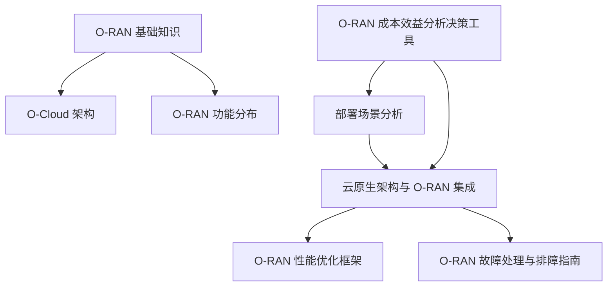
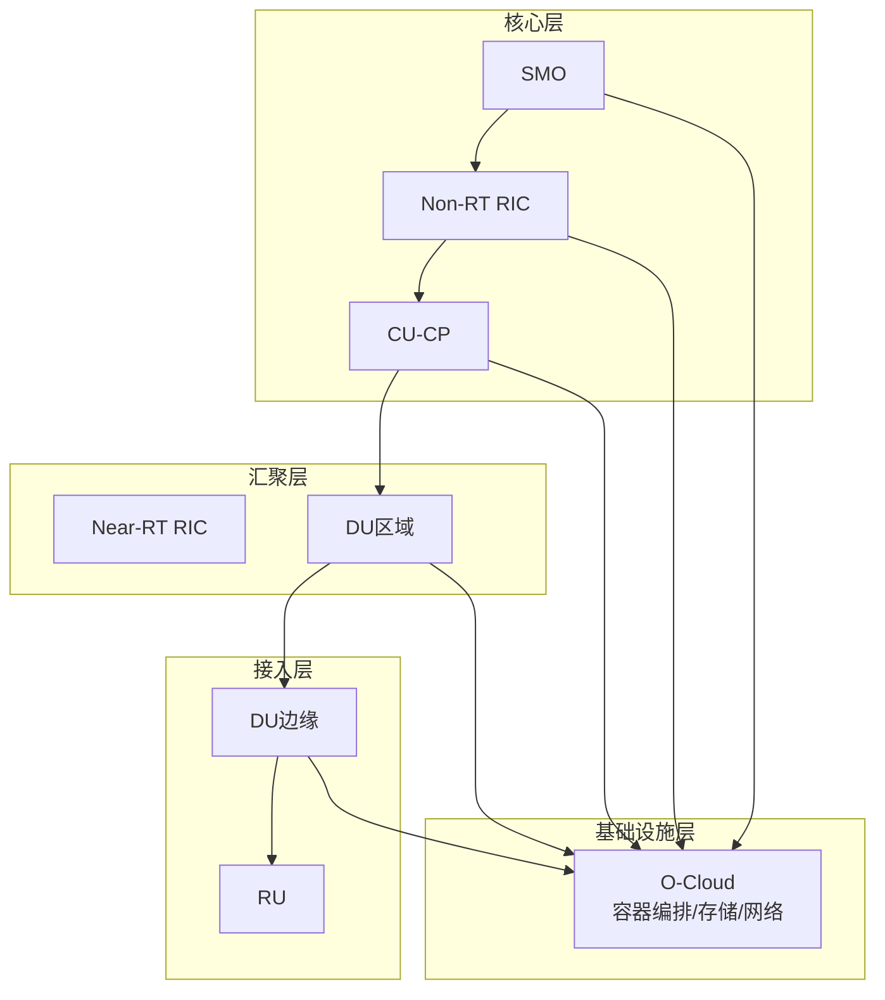
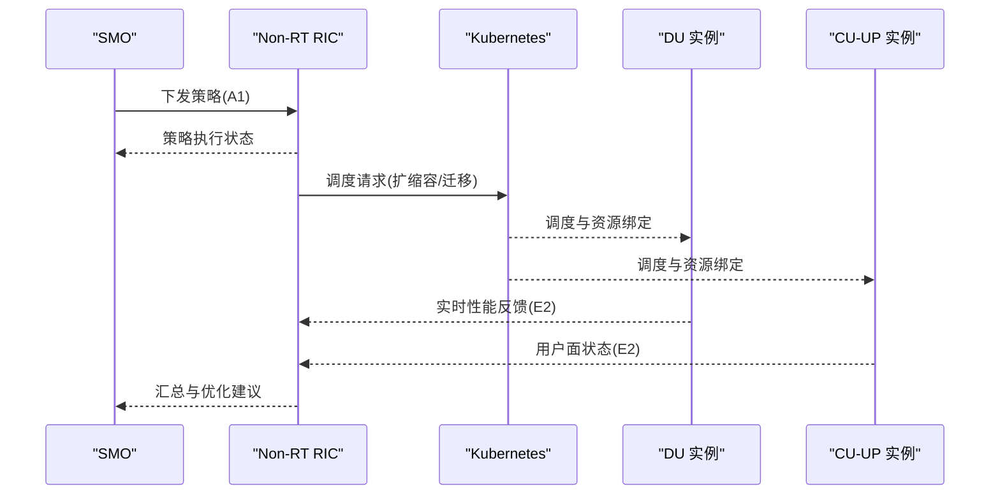
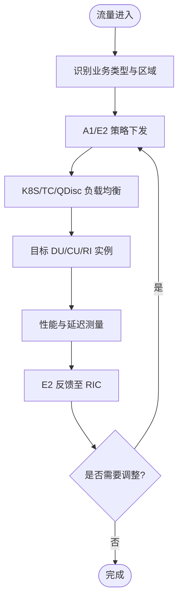
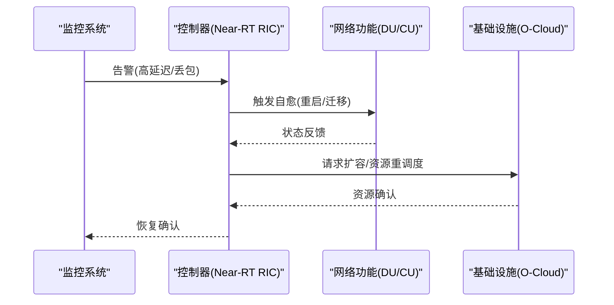
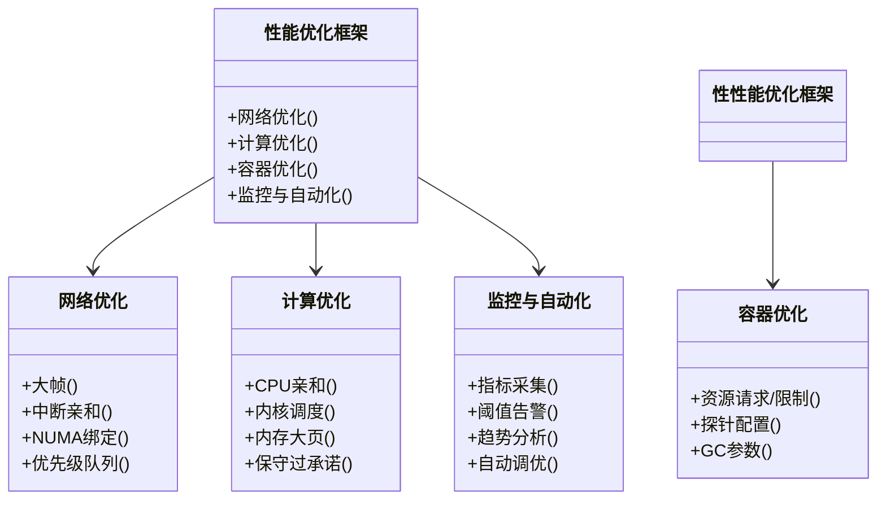
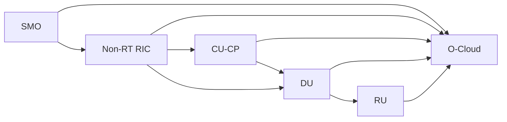
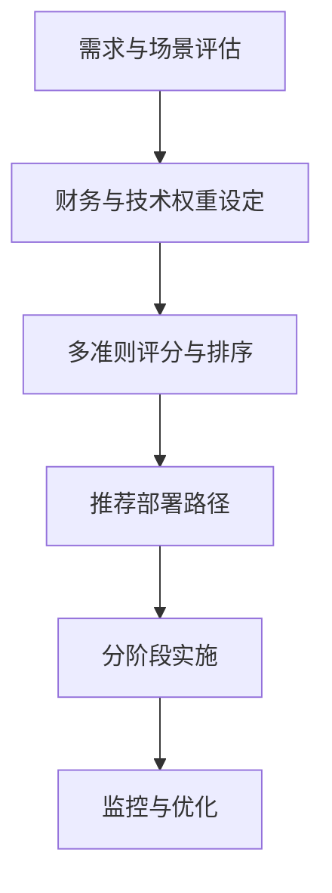

# 混合部署架构

<cite>
**本文引用的文件**
- [O-RAN 基础知识](file://01-architecture-system/readme.md)
- [O-Cloud 架构](file://01-architecture-system/o-cloud-architecture.md)
- [O-RAN 功能分布](file://01-architecture-system/functional-distribution.md)
- [部署场景分析](file://04-disaggregation-options/deployment-scenarios.md)
- [云原生架构与 O-RAN 集成](file://05-cloud-integration/cloud-native-architecture.md)
- [O-RAN 性能优化框架](file://14-operations-management/performance-optimization/performance-optimization-framework.md)
- [O-RAN 故障处理与排障指南](file://14-operations-management/fault-handling/fault-troubleshooting-guide.md)
- [O-RAN 成本效益分析决策工具](file://18-cost-benefit-analysis/decision-tools/oran-decision-frameworks.md)
</cite>

## 目录
1. [引言](#引言)
2. [项目结构](#项目结构)
3. [核心组件](#核心组件)
4. [架构总览](#架构总览)
5. [详细组件分析](#详细组件分析)
6. [依赖分析](#依赖分析)
7. [性能考虑](#性能考虑)
8. [故障隔离与恢复](#故障隔离与恢复)
9. [成本效益优化](#成本效益优化)
10. [运维管理策略](#运维管理策略)
11. [决策矩阵与实施步骤](#决策矩阵与实施步骤)
12. [案例研究与效果评估](#案例研究与效果评估)
13. [结论](#结论)

## 引言
本设计指导围绕混合 O-RAN 部署架构，系统阐述集中式与分布式策略的组合应用、动态资源调度、负载均衡与流量工程、故障隔离与恢复、成本效益优化、性能调优、资源编排与动态切换、以及监控机制。目标是帮助读者在多场景、多业务、多厂商环境下，构建高可用、低时延、可扩展且经济高效的 O-RAN 网络。

## 项目结构
本仓库以主题域组织，与混合部署密切相关的内容主要分布在架构系统、功能分布、云原生集成、性能优化、故障处理与成本分析等模块。下图给出与混合部署相关的主要文件与主题映射：

**图表来源**
- [O-RAN 基础知识](file://01-architecture-system/readme.md#L1-L161)
- [O-Cloud 架构](file://01-architecture-system/o-cloud-architecture.md#L1-L238)
- [O-RAN 功能分布](file://01-architecture-system/functional-distribution.md#L1-L325)
- [部署场景分析](file://04-disaggregation-options/deployment-scenarios.md#L1-L563)
- [云原生架构与 O-RAN 集成](file://05-cloud-integration/cloud-native-architecture.md#L1-L481)
- [O-RAN 性能优化框架](file://14-operations-management/performance-optimization/performance-optimization-framework.md#L1-L650)
- [O-RAN 故障处理与排障指南](file://14-operations-management/fault-handling/fault-troubleshooting-guide.md#L1-L633)
- [O-RAN 成本效益分析决策工具](file://18-cost-benefit-analysis/decision-tools/oran-decision-frameworks.md#L1-L726)

**章节来源**
- [O-RAN 基础知识](file://01-architecture-system/readme.md#L1-L161)
- [O-Cloud 架构](file://01-architecture-system/o-cloud-architecture.md#L1-L238)
- [O-RAN 功能分布](file://01-architecture-system/functional-distribution.md#L1-L325)
- [部署场景分析](file://04-disaggregation-options/deployment-scenarios.md#L1-L563)
- [云原生架构与 O-RAN 集成](file://05-cloud-integration/cloud-native-architecture.md#L1-L481)
- [O-RAN 性能优化框架](file://14-operations-management/performance-optimization/performance-optimization-framework.md#L1-L650)
- [O-RAN 故障处理与排障指南](file://14-operations-management/fault-handling/fault-troubleshooting-guide.md#L1-L633)
- [O-RAN 成本效益分析决策工具](file://18-cost-benefit-analysis/decision-tools/oran-decision-frameworks.md#L1-L726)

## 核心组件
- 服务层（SMO、xApps/rApps）：负责服务生命周期、编排与暴露，支撑端到端业务能力。
- 控制层（Near-RT/Non-RT RIC、CU-CP）：负责实时控制与策略管理，实现动态调度与优化。
- 管理层（NMS/EMS、安全管理）：负责配置、故障、性能与安全的全生命周期管理。
- 基础设施层（O-Cloud、容器编排、存储与网络）：提供计算、存储、网络与虚拟化资源。

这些组件通过标准化接口（A1/E2/F1/O-FH/O1/O2/OAM）协同工作，形成“服务—控制—管理—基础设施”的分层解耦与职责边界清晰的混合部署架构。

**章节来源**
- [O-RAN 基础知识](file://01-architecture-system/readme.md#L18-L34)
- [O-RAN 功能分布](file://01-architecture-system/functional-distribution.md#L34-L196)
- [O-Cloud 架构](file://01-architecture-system/o-cloud-architecture.md#L9-L30)

## 架构总览
混合部署以“核心集中、边缘分布”为核心思想，结合集中式与分布式的优势，实现性能与管理效率的平衡。典型分层如下：
- 核心层：集中部署 Non-RT RIC、SMO、CU-CP，承担全局策略与集中管理。
- 汇聚层：区域数据中心部署部分 RIC 与 DU，兼顾区域资源与低延迟。
- 接入层：边缘节点部署 DU、Near-RT RIC 与 RU，满足低时延与就近服务。
- 基础设施层：O-Cloud 通过容器编排与云原生技术支撑弹性与自动化。

**图表来源**
- [O-RAN 功能分布](file://01-architecture-system/functional-distribution.md#L78-L196)
- [O-Cloud 架构](file://01-architecture-system/o-cloud-architecture.md#L31-L37)
- [部署场景分析](file://04-disaggregation-options/deployment-scenarios.md#L162-L214)

**章节来源**
- [O-RAN 功能分布](file://01-architecture-system/functional-distribution.md#L197-L246)
- [O-Cloud 架构](file://01-architecture-system/o-cloud-architecture.md#L31-L37)
- [部署场景分析](file://04-disaggregation-options/deployment-scenarios.md#L162-L214)

## 详细组件分析

### 资源编排与动态调度
- 编排策略：基于 Kubernetes 的容器编排，结合 HPA/VPA 实现弹性伸缩；通过服务网格与负载均衡实现跨节点流量分发。
- 动态调度：依据 A1/E2 接口策略与性能监控，动态调整 DU/CU/RI 的实例数量与资源配额；NUMA 亲和与 CPU 优先级确保低时延。
- 资源预留：为 Near-RT RIC、CU-UP 等关键组件预留 CPU/内存与存储，避免尾部延迟。

**图表来源**
- [O-RAN 功能分布](file://01-architecture-system/functional-distribution.md#L78-L92)
- [O-RAN 性能优化框架](file://14-operations-management/performance-optimization/performance-optimization-framework.md#L105-L234)
- [云原生架构与 O-RAN 集成](file://05-cloud-integration/cloud-native-architecture.md#L207-L234)

**章节来源**
- [O-RAN 功能分布](file://01-architecture-system/functional-distribution.md#L273-L278)
- [O-RAN 性能优化框架](file://14-operations-management/performance-optimization/performance-optimization-framework.md#L105-L234)
- [云原生架构与 O-RAN 集成](file://05-cloud-integration/cloud-native-architecture.md#L207-L234)

### 负载均衡与流量工程
- 网络层面：启用 SR-IOV/DPDK、Jumbo Frame、NUMA 绑定与中断亲和，降低转发时延与抖动。
- 应用层面：Kubernetes Service 与 Ingress 控制器实现服务发现与流量分发；tc/qdisc 与优先级队列保障关键接口（E2/F1/O-FH）带宽与优先级。
- 策略层面：基于 A1/E2 接口的策略驱动，按业务类型与区域进行流量引导与负载分担。

**图表来源**
- [O-RAN 性能优化框架](file://14-operations-management/performance-optimization/performance-optimization-framework.md#L8-L101)
- [O-RAN 功能分布](file://01-architecture-system/functional-distribution.md#L67-L76)

**章节来源**
- [O-RAN 性能优化框架](file://14-operations-management/performance-optimization/performance-optimization-framework.md#L8-L101)
- [O-RAN 功能分布](file://01-architecture-system/functional-distribution.md#L67-L76)

### 故障隔离与恢复
- 分层隔离：服务层故障不波及控制层，控制层故障不波及管理层，管理层故障不波及基础设施层。
- 组件隔离：通过命名空间、Pod 亲和/反亲和、多副本与滚动升级，实现组件级故障隔离与快速恢复。
- 自愈机制：基于健康检查与告警联动，自动触发重启、替换与回滚；针对 E2/F1/O-FH 接口提供自动恢复脚本与参数调整。

**图表来源**
- [O-RAN 故障处理与排障指南](file://14-operations-management/fault-handling/fault-troubleshooting-guide.md#L32-L180)
- [O-RAN 故障处理与排障指南](file://14-operations-management/fault-handling/fault-troubleshooting-guide.md#L264-L434)
- [O-RAN 故障处理与排障指南](file://14-operations-management/fault-handling/fault-troubleshooting-guide.md#L539-L631)

**章节来源**
- [O-RAN 故障处理与排障指南](file://14-operations-management/fault-handling/fault-troubleshooting-guide.md#L32-L180)
- [O-RAN 故障处理与排障指南](file://14-operations-management/fault-handling/fault-troubleshooting-guide.md#L264-L434)
- [O-RAN 故障处理与排障指南](file://14-operations-management/fault-handling/fault-troubleshooting-guide.md#L539-L631)

### 性能调优方法
- 网络优化：开启大帧、关闭不必要的 offload、配置中断亲和与 NUMA 绑定；针对 E2/F1/O-FH 建立优先级队列。
- 计算优化：CPU 亲和与优先级设置、内核调度器参数调优、内存大页与保守过承诺；容器侧设置资源请求/限制与探针。
- 监控与自动化：基于 Prometheus/Grafana 的仪表盘与阈值告警；自动化性能分析与调优建议生成。

**图表来源**
- [O-RAN 性能优化框架](file://14-operations-management/performance-optimization/performance-optimization-framework.md#L103-L376)
- [O-RAN 性能优化框架](file://14-operations-management/performance-optimization/performance-optimization-framework.md#L378-L648)

**章节来源**
- [O-RAN 性能优化框架](file://14-operations-management/performance-optimization/performance-optimization-framework.md#L103-L376)
- [O-RAN 性能优化框架](file://14-operations-management/performance-optimization/performance-optimization-framework.md#L378-L648)

## 依赖分析
- 层间依赖：服务层依赖控制层策略，控制层依赖管理层配置与监控，管理层依赖基础设施层资源。
- 组件依赖：DU/RI 依赖 O-FH 同步与 F1 用户面；CU-CP 控制面依赖 F1-C；E2 接口承载 RIC 与 CU/DU 的控制面交互。
- 云原生依赖：Kubernetes 提供编排与弹性，Prometheus/Grafana 提供可观测性，容器镜像与网络插件提供互通。

**图表来源**
- [O-RAN 功能分布](file://01-architecture-system/functional-distribution.md#L197-L221)
- [O-Cloud 架构](file://01-architecture-system/o-cloud-architecture.md#L109-L122)

**章节来源**
- [O-RAN 功能分布](file://01-architecture-system/functional-distribution.md#L197-L221)
- [O-Cloud 架构](file://01-architecture-system/o-cloud-architecture.md#L109-L122)

## 性能考虑
- 时延与吞吐：通过 NUMA 绑定、SR-IOV/DPDK、优先级队列与容器资源限制，确保 Near-RT 业务的低时延与高吞吐。
- 可靠性与可用性：多副本、自动故障转移、健康检查与优雅启停，目标达到 99.999% 可用性。
- 可扩展性：水平扩展与自动扩缩容，结合策略与监控实现弹性资源分配。

**章节来源**
- [O-Cloud 架构](file://01-architecture-system/o-cloud-architecture.md#L41-L115)
- [O-RAN 性能优化框架](file://14-operations-management/performance-optimization/performance-optimization-framework.md#L103-L234)

## 故障隔离与恢复
- 端到端隔离：跨层故障隔离与快速定位，避免级联故障。
- 自动化恢复：基于告警与脚本的自动重启、参数调整与资源重调度。
- 接口专项：E2/F1/O-FH 的证书校验、时延与丢包分析、PTP 同步校准与补偿。

**章节来源**
- [O-RAN 故障处理与排障指南](file://14-operations-management/fault-handling/fault-troubleshooting-guide.md#L264-L537)

## 成本效益优化
- TCO 分析：资本支出、运营支出、机会成本与风险成本的综合评估。
- 决策工具：多准则决策分析（MCDA）、投资决策树、NPV/IRR/回收期与蒙特卡洛模拟。
- 场景对比：传统 RAN、O-RAN 绿地部署、混合路径的权衡与推荐。

**章节来源**
- [O-RAN 成本效益分析决策工具](file://18-cost-benefit-analysis/decision-tools/oran-decision-frameworks.md#L6-L53)
- [O-RAN 成本效益分析决策工具](file://18-cost-benefit-analysis/decision-tools/oran-decision-frameworks.md#L306-L476)
- [O-RAN 成本效益分析决策工具](file://18-cost-benefit-analysis/decision-tools/oran-decision-frameworks.md#L478-L724)

## 运维管理策略
- 自动化：基础设施即代码（IaC）、CI/CD、自动扩缩容与故障自愈。
- 监控：分层监控（基础设施—容器—服务—业务），统一告警与可视化。
- 安全：多层安全边界（网络、集群、服务、数据），RBAC、网络策略与密钥管理。

**章节来源**
- [O-Cloud 架构](file://01-architecture-system/o-cloud-architecture.md#L142-L194)
- [云原生架构与 O-RAN 集成](file://05-cloud-integration/cloud-native-architecture.md#L297-L377)

## 决策矩阵与实施步骤
- 决策矩阵：财务权重（CTO/CFO/CIO视角）、技术权重（性能、可扩展性、互操作）、战略权重（市场、风险、创新）。
- 实施步骤：分阶段部署（试点—扩展—全网）、混合架构优化（功能分层、资源调度、数据管理）、自动化部署（IaC、网络/业务自动化）。

**图表来源**
- [O-RAN 成本效益分析决策工具](file://18-cost-benefit-analysis/decision-tools/oran-decision-frameworks.md#L8-L53)
- [部署场景分析](file://04-disaggregation-options/deployment-scenarios.md#L436-L496)

**章节来源**
- [O-RAN 成本效益分析决策工具](file://18-cost-benefit-analysis/decision-tools/oran-decision-frameworks.md#L8-L53)
- [部署场景分析](file://04-disaggregation-options/deployment-scenarios.md#L436-L496)

## 案例研究与效果评估
- 核心城市集中式：管理效率提升、资源利用率提高、业务开通时间缩短、运维成本降低。
- 工业园区边缘部署：端到端时延降至 0.5ms、可靠性达 99.999%、满足工业控制要求。
- 农村地区混合部署：覆盖范围扩大 80%、支持大规模物联网、部署成本降低 50%、运维效率提高 60%。

**章节来源**
- [部署场景分析](file://04-disaggregation-options/deployment-scenarios.md#L497-L558)

## 结论
混合部署通过“核心集中、边缘分布”的分层架构，结合云原生编排与自动化运维，实现性能、成本与可靠性的平衡。依托标准化接口与跨层协同，配合动态资源调度、负载均衡与流量工程，以及完善的故障隔离与恢复机制，可在多场景、多业务、多厂商环境下构建高可用、低时延、可扩展且经济高效的 O-RAN 网络。