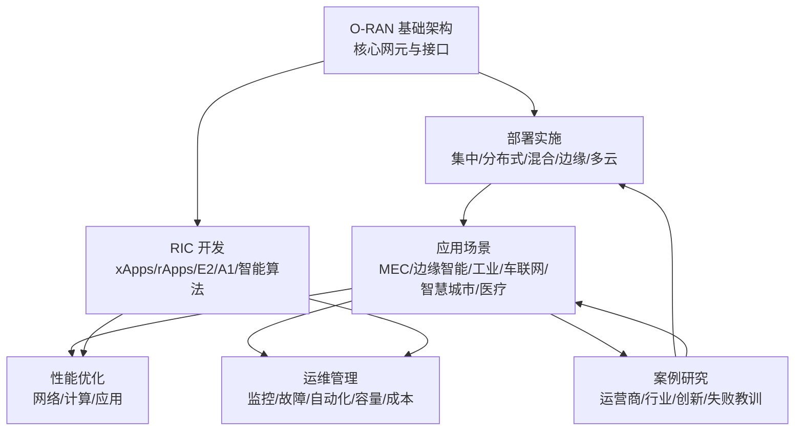
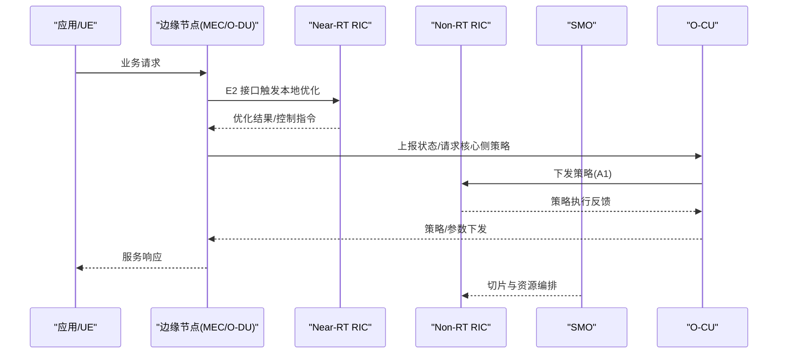
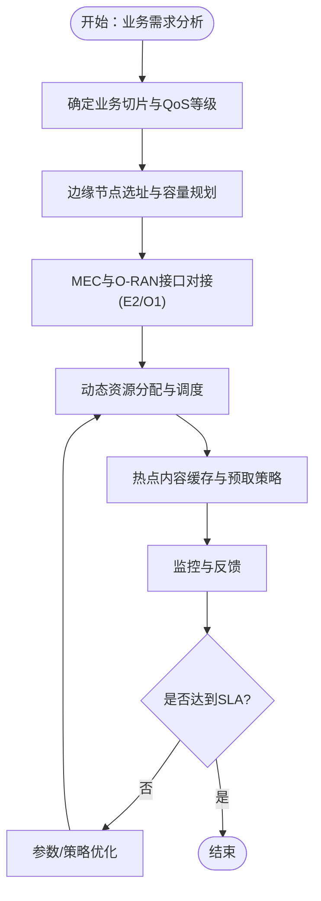
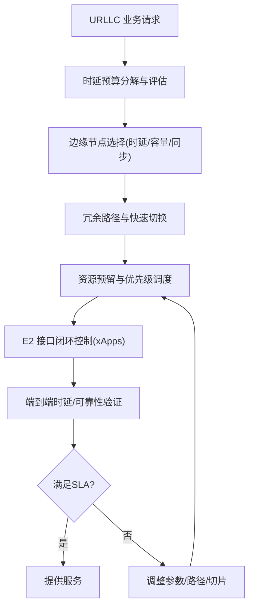
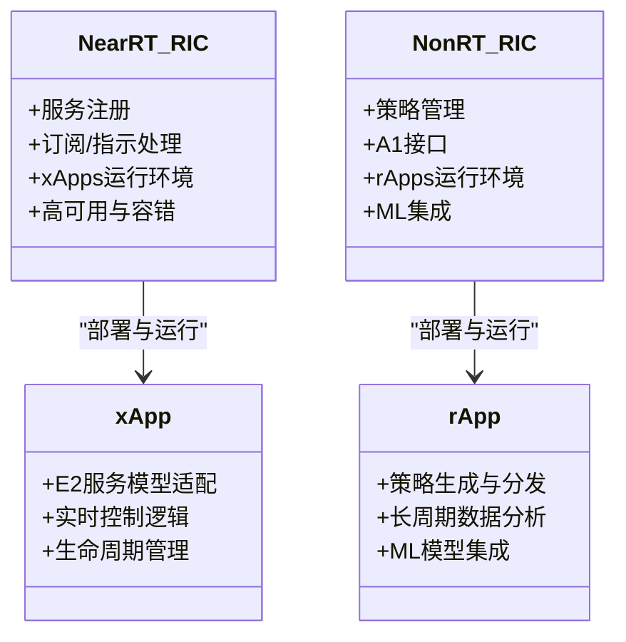
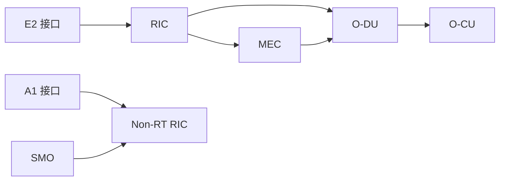

# 边缘部署架构

<cite>
**本文引用的文件**
- [O-RAN 专家知识库总览](file://README.md)
- [O-RAN 基础知识](file://01-architecture-system/readme.md)
- [O-RAN 实施与部署](file://08-deployment-implementation/readme.md)
- [O-RAN 应用场景](file://10-application-scenarios/readme.md)
- [RIC 开发与高级技术](file://07-ric-development/readme.md)
- [性能优化与调优](file://26-performance-optimization/readme.md)
- [运维管理](file://14-operations-management/readme.md)
- [案例研究](file://21-case-studies/readme.md)
</cite>

## 目录
1. [引言](#引言)
2. [项目结构](#项目结构)
3. [核心组件](#核心组件)
4. [架构总览](#架构总览)
5. [详细组件分析](#详细组件分析)
6. [依赖关系分析](#依赖关系分析)
7. [性能考量](#性能考量)
8. [故障排查指南](#故障排查指南)
9. [结论](#结论)
10. [附录](#附录)

## 引言
本设计指导面向在边缘场景部署 O-RAN 的工程与运营团队，围绕 O-RAN 与 MEC（边缘计算）的协同、边缘资源规划、低延迟应用部署策略、边缘-核心协调机制等主题，系统梳理数据卸载与缓存策略、边缘节点选择原则、网络切片与 QoS 保障方案，并给出实施框架、性能优化与成本控制策略。同时结合典型行业场景（工业互联网、车联网、智慧城市、医疗健康）与最佳实践，形成可落地的边缘 O-RAN 部署蓝图。

## 项目结构
该知识库以主题域划分，便于按需检索与组合使用。与边缘部署直接相关的关键模块包括：
- O-RAN 基础架构与接口：明确 CU/DU/RU 分层职责、RIC 架构与接口（E2/A1/O1/O-FH），为边缘部署提供参考模型与边界约束
- 部署实施：集中/分布式/混合/边缘/多云部署架构设计、硬件与基础设施规划、集成测试、运维与安全、自动化与编排
- 应用场景：5G 三大场景（eMBB/URLLC/mMTC）、MEC 集成、边缘智能、内容分发、工业互联网、车联网、智慧城市、医疗健康
- RIC 开发：xApps/rApps 开发框架、E2/A1 接口深度应用、智能算法与 RRM 优化、能效优化、安全架构
- 性能优化：网络层、计算层、应用层的优化维度与调优方法论
- 运维管理：监控告警、故障处理、自动化、容量规划、生命周期与成本优化
- 案例研究：运营商与垂直行业部署经验、失败教训与最佳实践提炼



章节来源
- file://README.md#L1-L472
- file://01-architecture-system/readme.md#L1-L161
- file://08-deployment-implementation/readme.md#L1-L353
- file://10-application-scenarios/readme.md#L1-L470
- file://07-ric-development/readme.md#L1-L368
- file://26-performance-optimization/readme.md#L1-L67
- file://14-operations-management/readme.md#L1-L126
- file://21-case-studies/readme.md#L1-L74

## 核心组件
- O-RAN 核心网元与职责
  - O-RU：射频处理、数字前端、天线连接、同步
  - O-DU：物理层处理、部分 MAC 层功能、实时性要求
  - O-CU：CU-CP（RRC 层、NG 控制面）、CU-UP（PDCP/SDAP 用户面）
  - O-RIC：Near-RT RIC（毫秒级闭环控制、xApps）、Non-RT RIC（秒至分钟级策略、rApps）
  - SMO：网络服务生命周期、配置、故障管理
- 接口标准
  - F1（CU-DU 控制/用户面分离）、O-FH（eCPRI/RoE）、E2（RIC 与 CU/DU 服务化接口）、A1（策略管理）、O1（NETCONF/YANG 管理）、O2（云资源管理）、OAM（整体网管）
- RIC 平台技术栈：容器编排、服务网格、消息队列、数据库、监控与追踪

章节来源
- file://01-architecture-system/readme.md#L8-L59
- file://07-ric-development/readme.md#L8-L33

## 架构总览
边缘 O-RAN 部署以“集中/分布式/混合/边缘/多云”五种架构为主，结合 MEC 实现低时延与本地化服务能力。其关键特征：
- 边缘-核心协同：通过 E2 接口与 SMO/OAM 实现策略下发与状态反馈，结合网络切片与 QoS 保障差异化服务
- 数据卸载与缓存：MEC 边缘节点就近处理与缓存热点内容，减少回传压力
- 节点选择：基于覆盖、容量、时延、能耗与安全的综合评估
- 网络切片与 QoS：端到端切片编排与跨域协同，保障 URLLC 的确定性与 eMBB 的高吞吐

```mermaid
graph TB
subgraph "边缘域"
MEC["MEC 平台"]
DU["O-DU 边缘节点"]
RIC["Near-RT RIC"]
end
subgraph "核心域"
CU["O-CU 核心节点"]
NRT["Non-RT RIC"]
SMO["SMO"]
end
subgraph "接入与承载"
RU["O-RU 基站"]
FH["前传/中传/回传"]
end
RU --> DU
DU < --> RIC
RIC < --> NRT
NRT < --> SMO
DU < --> CU
MEC < --> DU
MEC < --> RIC
FH --> DU
FH --> CU
```

图表来源
- file://08-deployment-implementation/readme.md#L8-L39
- file://10-application-scenarios/readme.md#L45-L80
- file://01-architecture-system/readme.md#L15-L35

章节来源
- file://08-deployment-implementation/readme.md#L8-L39
- file://10-application-scenarios/readme.md#L45-L80
- file://01-architecture-system/readme.md#L15-L35

## 详细组件分析

### 边缘-核心协调机制与网络切片
- 协调机制
  - Near-RT RIC 通过 E2 接口实现毫秒级闭环控制，结合 xApps 实现本地化优化
  - Non-RT RIC 通过 A1 接口进行策略下发与长期优化，配合 SMO 实现端到端编排
- 网络切片
  - eMBB、URLLC、mMTC 切片类型与编排，跨域隔离与生命周期管理
  - 切片内资源调度、性能保障与故障隔离策略
- QoS 保障
  - 业务等级划分、差异化服务模型、端到端 QoS 监控与调整



图表来源
- file://07-ric-development/readme.md#L60-L98
- file://08-deployment-implementation/readme.md#L158-L196
- file://10-application-scenarios/readme.md#L30-L36

章节来源
- file://07-ric-development/readme.md#L60-L98
- file://08-deployment-implementation/readme.md#L158-L196
- file://10-application-scenarios/readme.md#L30-L36

### 边缘计算资源规划与 MEC 集成
- MEC 集成模式
  - O-RAN 与 MEC 协同部署，边缘节点与 O-DU/O-CU 共址或邻近部署
  - E2 接口与 MEC 服务发现、边缘编排与资源调度
- 资源规划
  - CPU/内存/存储/网络 I/O 的容量与性能规划
  - 边缘节点密度、覆盖与容量估算、能耗与散热
- 边缘智能与应用
  - 分布式 AI/ML 推理、联邦学习、模型压缩与加速、缓存策略
  - 边缘视频分析、预测性维护、网络优化



图表来源
- file://10-application-scenarios/readme.md#L45-L80
- file://26-performance-optimization/readme.md#L14-L25

章节来源
- file://10-application-scenarios/readme.md#L45-L80
- file://26-performance-optimization/readme.md#L14-L25

### 低延迟应用部署策略（URLLC）
- 架构要点
  - 分布式部署、边缘就近处理、确定性网络（TSN）与优先级调度
  - 多路径冗余、快速故障切换、资源预留
- 关键技术
  - E2 接口毫秒级闭环控制、xApps 实时策略执行
  - 网络切片与 QoS 保障、跨域协同与同步精度
- 场景示例
  - 工业控制、远程手术、自动驾驶、智能交通信号控制



图表来源
- file://10-application-scenarios/readme.md#L16-L29
- file://07-ric-development/readme.md#L60-L78

章节来源
- file://10-application-scenarios/readme.md#L16-L29
- file://07-ric-development/readme.md#L60-L78

### 数据卸载与缓存策略
- 策略设计
  - 基于内容热度与用户分布的缓存策略、边缘预取与失效机制
  - 回传带宽与核心侧负载的联合优化
- 实施要点
  - MEC 边缘缓存与 CDN 集成、缓存一致性与版权管理
  - 边缘节点间缓存协同与跨域一致性

章节来源
- file://10-application-scenarios/readme.md#L59-L72

### 边缘节点选择原则
- 覆盖与容量：站点密度、扇区规划、容量预测
- 时延与同步：前传/中传/回传链路时延、PTP 同步精度
- 能耗与散热：设备功耗、冷却与供电设计
- 安全与合规：物理安全、访问控制、数据本地化

章节来源
- file://08-deployment-implementation/readme.md#L40-L61
- file://10-application-scenarios/readme.md#L81-L117

### RIC 应用开发与智能优化
- xApps/rApps 开发
  - E2/A1 接口适配、订阅/指示机制、生命周期管理
  - 开发语言与框架、CI/CD 与容器化部署
- 智能算法
  - 异常检测、预测性维护、自动优化、能效优化
  - RRM 优化（资源分配、干扰管理、移动性优化、容量管理）



图表来源
- file://07-ric-development/readme.md#L8-L98

章节来源
- file://07-ric-development/readme.md#L8-L98

### 部署实施框架
- 架构设计
  - 集中/分布式/混合/边缘/多云部署策略与权衡
  - 硬件规格、网络基础设施、存储与电源/制冷规划
- 集成测试
  - 接口测试（E2/A1/O1/O-FH/F1）、功能/性能/互操作/回归测试
- 运维与安全
  - 监控告警、故障管理、性能管理、配置管理、容量管理
  - 网络/接口/系统/监控安全与合规审计
- 自动化与编排
  - IaC、Ansible/Terraform、Kubernetes/Helm/ArgoCD、CI/CD

章节来源
- file://08-deployment-implementation/readme.md#L6-L196

### 行业场景与最佳实践
- 工业互联网：私有网络、确定性网络（TSN）、IT/OT 融合、安全隔离
- 车联网：V2X 通信、超低时延、高可靠、覆盖与移动性
- 智慧城市：多部门协同、应急通信、能效管理、网络切片
- 医疗健康：远程医疗、医疗物联网、隐私与合规、高可用

章节来源
- file://10-application-scenarios/readme.md#L81-L207
- file://21-case-studies/readme.md#L26-L74

## 依赖关系分析
- 组件耦合
  - RIC 与 CU/DU 的 E2 接口耦合决定闭环控制的实时性与可靠性
  - SMO 与 Non-RT RIC 的 A1 接口耦合决定策略下发与跨域编排能力
  - MEC 与 O-DU/O-CU 的协同决定边缘服务的就近性与时延
- 外部依赖
  - 3GPP/ETSI 标准与 O-RAN 联盟规范驱动接口与协议演进
  - 云原生技术栈（容器/服务网格/监控）支撑弹性与可观测性



图表来源
- file://01-architecture-system/readme.md#L27-L35
- file://08-deployment-implementation/readme.md#L27-L32

章节来源
- file://01-architecture-system/readme.md#L27-L35
- file://08-deployment-implementation/readme.md#L27-L32

## 性能考量
- 网络层
  - 无线资源优化、传输效率、QoS 参数调优、负载均衡
- 计算层
  - CPU/内存/存储/网络 I/O 优化、容器资源限制与调度
- 应用层
  - RIC 应用与接口协议优化、服务编排与微服务调优
- 方法论
  - 建立性能基线、瓶颈定位、根因分析、优化与效果验证
- 容量规划
  - 负载预测模型、资源配额管理、扩展性设计与成本优化

章节来源
- file://26-performance-optimization/readme.md#L6-L67
- file://14-operations-management/readme.md#L36-L81

## 故障排查指南
- 问题分类
  - 接口故障（E2/A1/O1/O-FH/F1）、性能问题（时延/吞吐/丢包）、可用性问题、配置问题、兼容性问题
- 流程
  - 问题定义与范围界定、信息收集（日志/指标/配置）、假设验证、根因分析（5 Why/鱼骨图/故障树）、修复与验证
- 工具
  - 网络分析（Wireshark/tcpdump）、协议分析（E2/A1/O1）、日志分析（ELK/Splunk）、性能分析（perf/火焰图）
- SOP
  - 故障响应、升级、沟通、复盘与知识库更新

章节来源
- file://08-deployment-implementation/readme.md#L126-L157
- file://14-operations-management/readme.md#L22-L35

## 结论
边缘 O-RAN 部署需要以清晰的架构设计为基础，结合 MEC 实现低时延与本地化能力，通过 RIC 与 SMO 实现端到端的智能化与自动化编排。在具体实施中，应以网络切片与 QoS 保障差异化服务，采用数据卸载与缓存策略优化回传压力，遵循节点选择原则实现覆盖与性能平衡。通过完善的性能优化与运维体系、标准化的测试与故障排查流程，以及从案例研究中提炼的最佳实践，可有效提升部署成功率与运营质量，实现成本可控与持续优化。

## 附录
- 参考文档与标准
  - O-RAN 联盟架构与接口规范、ETSI/3GPP 标准
- 工具与平台
  - 监控与观测（Prometheus/Grafana/Jaeger）、CI/CD（GitLab/Jenkins）、容器编排（Kubernetes/Helm/ArgoCD）
- 常见问题
  - 部署架构选择、监控体系设计、多厂商兼容、性能优化与安全加固

章节来源
- file://README.md#L251-L404
- file://08-deployment-implementation/readme.md#L251-L353
- file://26-performance-optimization/readme.md#L35-L40
- file://14-operations-management/readme.md#L105-L126