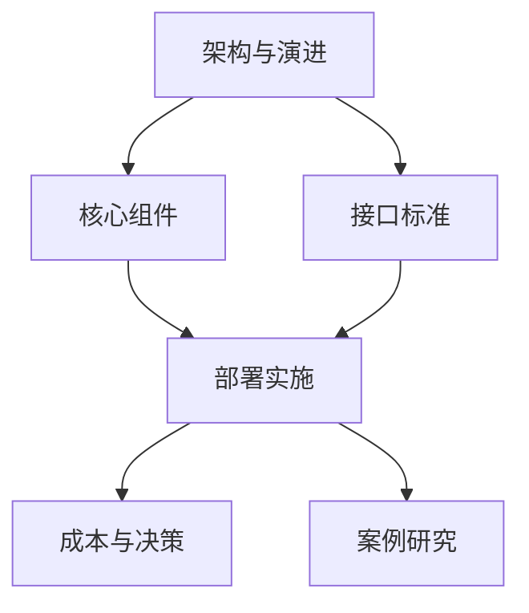
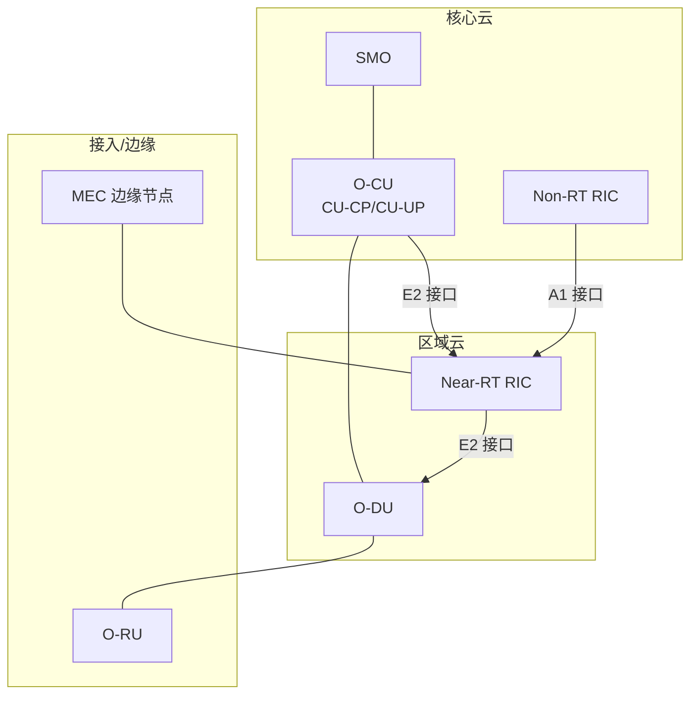
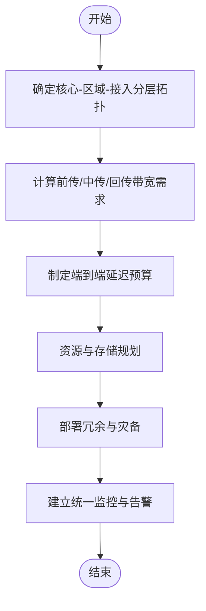
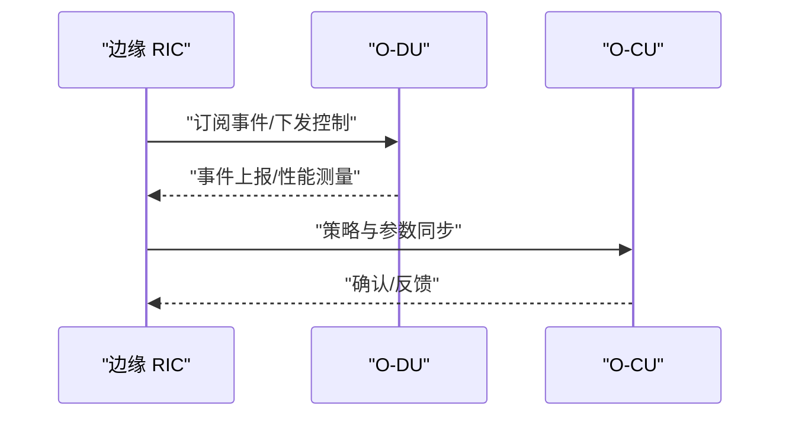
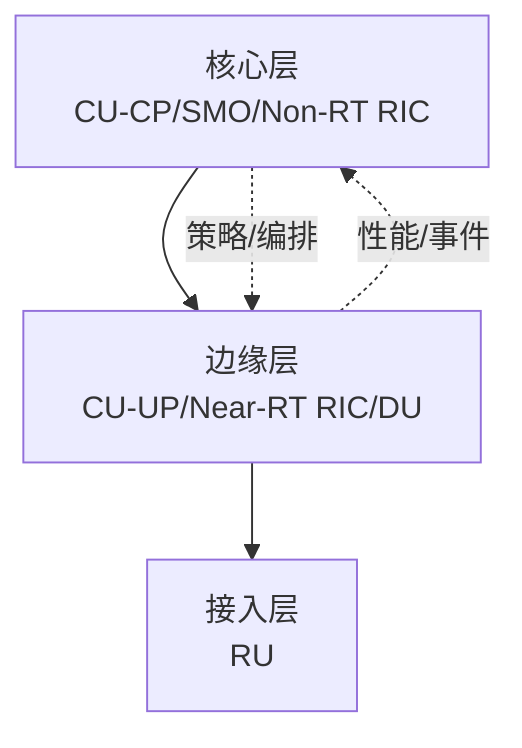
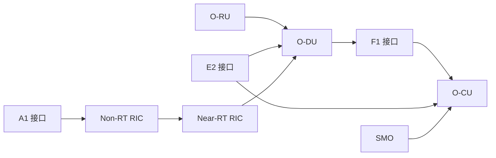
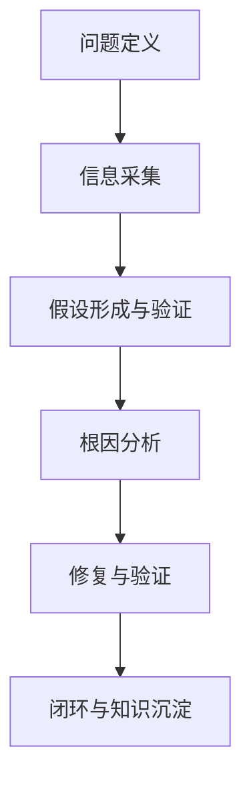

# 部署架构设计

<cite>
**本文引用的文件**
- [O-RAN 基础知识](file://01-architecture-system/readme.md)
- [架构演进](file://01-architecture-system/architecture-evolution.md)
- [部署场景分析](file://04-disaggregation-options/deployment-scenarios.md)
- [O-RAN 实施](file://08-deployment-implementation/readme.md)
- [云原生架构与 O-RAN 集成](file://05-cloud-integration/cloud-native-architecture.md)
- [O-CU 功能与架构](file://02-core-components/o-cu.md)
- [O-DU 功能与架构](file://02-core-components/o-du.md)
- [E2 接口](file://03-interface-standards/e2-interface.md)
- [O-RAN 决策框架](file://18-cost-benefit-analysis/decision-tools/oran-decision-frameworks.md)
- [运营商 O-RAN 案例](file://21-case-studies/operator-cases/carrier-o-ran-deployment-cases.md)
</cite>

## 目录
1. [引言](#引言)
2. [项目结构](#项目结构)
3. [核心组件](#核心组件)
4. [架构总览](#架构总览)
5. [详细组件分析](#详细组件分析)
6. [依赖分析](#依赖分析)
7. [性能考虑](#性能考虑)
8. [故障排查指南](#故障排查指南)
9. [结论](#结论)
10. [附录](#附录)

## 引言
本技术指导面向 O-RAN 部署架构设计，围绕集中式、分布式、混合式、边缘式与多云五类部署模式，系统阐述其设计原理、适用场景、实施策略，并给出网络拓扑、带宽规划、延迟预算与资源分配方案。同时，提供业务需求评估、成本效益分析、技术可行性评估与风险控制的决策矩阵，覆盖 CU、DU、RU 的部署位置选择原则、跨站点网络设计与数据一致性管理机制，并结合真实运营商案例总结最佳实践。

## 项目结构
本仓库围绕 O-RAN 架构的知识体系与工程实践，形成“架构—组件—接口—部署—成本—案例”的知识闭环。与部署架构设计直接相关的知识模块如下：
- 架构与演进：奠定 O-RAN 参考架构、功能分布与云原生融合基础
- 核心组件：明确 CU、DU、RU 的职责边界与部署形态
- 接口标准：E2、F1、O-FH 等关键接口的协议与性能要求
- 部署实施：集中/分布式/混合/边缘/多云的架构设计与运维要点
- 成本与决策：多准则决策分析、投资回报与风险评估工具
- 案例研究：全球运营商的规模化部署经验与教训

章节来源
- file://01-architecture-system/readme.md#L1-L161
- file://01-architecture-system/architecture-evolution.md#L1-L183
- file://08-deployment-implementation/readme.md#L1-L353

## 核心组件
- O-CU（集中式单元）：负责 RRC、NG 接口控制面与 PDCP/SDAP 用户面处理，支持 CU-CP/CU-UP 分离部署，满足控制面集中与用户面就近的差异化需求。
- O-DU（分布式单元）：负责物理层与 MAC 层处理，强调低延迟与高可靠性，面向前传与中传网络的实时性要求。
- O-RU（射频单元）：完成射频与基带数字化对接，承担与 DU 的 O-FH 接口通信与同步。
- RIC（RAN 智能控制器）：Near-RT RIC（毫秒级闭环）与 Non-RT RIC（秒至分钟级策略），通过 E2 接口与 CU/DU 交互。
- SMO：网络服务生命周期管理、配置与故障管理，支撑云原生编排与自动化。

章节来源
- file://02-core-components/o-cu.md#L1-L419
- file://02-core-components/o-du.md#L1-L415
- file://03-interface-standards/e2-interface.md#L1-L337
- file://01-architecture-system/readme.md#L15-L26

## 架构总览
五类部署架构在 O-RAN 中的定位与协同：
- 集中式：核心 CU/SMO/Non-RT RIC 集中，DU/边缘 RIC 分散，适合广覆盖与集中管理场景
- 分布式：DU/部分 CU/边缘 RIC 下沉，贴近用户与 RU，满足低延迟与边缘计算
- 混合式：核心-边缘分层，兼顾集中管理与边缘性能
- 边缘式：与 MEC 深度集成，面向 URLLC/mMTC 等低延迟与本地化业务
- 多云：跨公私云资源编排，实现灾备与高可用

图表来源
- file://02-core-components/o-cu.md#L101-L121
- file://02-core-components/o-du.md#L68-L86
- file://03-interface-standards/e2-interface.md#L7-L32
- file://05-cloud-integration/cloud-native-architecture.md#L237-L296

## 详细组件分析

### 集中式部署架构
- 设计要点
  - 核心 CU-CP/SMO/Non-RT RIC 集中于核心数据中心；DU 部署在区域边缘；RU 部署于站点
  - 传输网络采用骨干/中继/回传三层架构，满足高带宽与高可靠
- 网络拓扑
  - 星型/树形拓扑，核心汇聚接入分层
- 带宽与延迟
  - 前传 O-FH：依据 MIMO 配置与带宽需求计算；延迟预算满足 RU-DU 同步与帧边界
  - 中传/回传：满足 CU-DU 与核心网接口（F1/E2/A1）带宽与时延
- 资源分配
  - 核心：高吞吐、高可用、集中编排；边缘：就近处理、低时延、本地化存储
- 风险与对策
  - 单点风险：通过冗余与跨域部署缓解；运维复杂度：通过自动化与统一编排降低

章节来源
- file://04-disaggregation-options/deployment-scenarios.md#L59-L85
- file://08-deployment-implementation/readme.md#L8-L19

### 分布式部署架构
- 设计要点
  - DU/部分 CU/边缘 RIC 下沉，靠近 RU 与用户，满足 URLLC 与低时延
- 网络拓扑
  - 网状/环形拓扑，就近接入，减少中间跳数
- 带宽与延迟
  - 前传 O-FH 低延迟与高可靠；中传/回传按业务 SLA 配置
- 资源分配
  - 边缘节点具备一定自治能力，核心进行全局编排与策略下发
- 数据一致性
  - 通过 E2 接口的订阅/通知机制与 Near-RT RIC 的闭环控制，保障状态同步与收敛

图表来源
- file://03-interface-standards/e2-interface.md#L111-L129
- file://02-core-components/o-du.md#L68-L86

章节来源
- file://04-disaggregation-options/deployment-scenarios.md#L110-L136
- file://08-deployment-implementation/readme.md#L15-L25

### 混合部署架构
- 设计要点
  - 核心部署 Non-RT RIC、SMO、CU-CP；边缘部署 CU-UP、Near-RT RIC、DU；接入部署 RU
- 资源调度
  - 动态资源分配、负载均衡、智能调度与预留保障
- 数据管理
  - 分层存储、同步机制、生命周期管理与安全合规
- 成本优化
  - 结合集中管理效率与边缘性能，平衡 CAPEX/OPEX

图表来源
- file://04-disaggregation-options/deployment-scenarios.md#L162-L189
- file://08-deployment-implementation/readme.md#L21-L26

章节来源
- file://04-disaggregation-options/deployment-scenarios.md#L162-L215
- file://08-deployment-implementation/readme.md#L21-L26

### 边缘式部署架构
- 设计要点
  - O-RAN 与 MEC 深度集成，面向 uRLLC/mMTC 与本地化应用
- 资源规划
  - 边缘计算资源、低时延应用部署、数据卸载与缓存策略
- 协同机制
  - 边缘-核心协同与数据一致性管理

章节来源
- file://08-deployment-implementation/readme.md#L27-L33
- file://05-cloud-integration/cloud-native-architecture.md#L257-L276

### 多云部署架构
- 设计要点
  - 公私云混合与跨云资源编排、跨云网络互联、数据主权与合规、灾备与高可用
- 关键能力
  - 统一编排、跨域一致性、安全与治理

章节来源
- file://08-deployment-implementation/readme.md#L33-L39
- file://05-cloud-integration/cloud-native-architecture.md#L277-L296

## 依赖分析
- 组件耦合与协作
  - CU-CP/CU-UP 通过 E1 接口分离部署；DU 通过 F1 与 CU 交互；O-FH 连接 DU 与 RU；E2 接口连接 RIC 与 CU/DU
- 依赖链
  - 前传 O-FH → DU → F1 → CU；策略 A1 → Near-RT RIC → E2 → CU/DU；SMO → CU/RIC/DU
- 外部依赖
  - 3GPP/ETSI 标准、云原生平台（Kubernetes）、容器编排与监控体系

图表来源
- file://02-core-components/o-cu.md#L101-L121
- file://02-core-components/o-du.md#L68-L86
- file://03-interface-standards/e2-interface.md#L7-L32
- file://01-architecture-system/readme.md#L27-L34

章节来源
- file://02-core-components/o-cu.md#L49-L61
- file://02-core-components/o-du.md#L68-L86
- file://03-interface-standards/e2-interface.md#L90-L110

## 性能考虑
- 延迟预算
  - 前传 O-FH：RU-DU 同步与帧边界控制；DU-核心（F1/E2）：Near-RT RIC 闭环 <10ms
- 带宽规划
  - 基于 MIMO 配置、带宽与用户数估算前传带宽；中传/回传按接口与业务 SLA 配置
- 同步要求
  - IEEE 1588 PTP v2，RU-DU 同步 <100ns，DU-CU 同步 <1μs
- 可靠性
  - 端到端可用性目标（如 99.999%），故障恢复时间 <50ms
- 优化手段
  - 网络加速（SR-IOV/DPDK）、QoS 保障、负载均衡、自动扩缩容与弹性调度

章节来源
- file://02-core-components/o-du.md#L51-L67
- file://03-interface-standards/e2-interface.md#L90-L147
- file://05-cloud-integration/cloud-native-architecture.md#L123-L177

## 故障排查指南
- 故障分类
  - 接口故障（E2/A1/O1/O-FH/F1）、性能劣化（延迟/吞吐/丢包）、可用性问题、配置冲突、兼容性问题
- 排查流程
  - 问题定义与范围界定 → 信息采集（日志/指标/配置）→ 假设与验证 → 根因分析（5 Why/鱼骨图/故障树）→ 修复与验证
- 常用工具
  - 协议分析（Wireshark/tcpdump/接口协议分析）、日志分析（ELK/Splunk）、性能分析（Perf/火焰图）、监控（Ping/Traceroute/MTR）

章节来源
- file://08-deployment-implementation/readme.md#L126-L157

## 结论
五类部署架构各有侧重：集中式强调管理效率与成本，分布式强调低时延与边缘能力，混合式平衡两者，边缘式面向本地化与低时延业务，多云面向跨域与高可用。结合 O-RAN 核心组件与接口特性，通过科学的带宽与延迟预算、资源与存储规划、数据一致性与安全治理，以及成熟的运维与自动化体系，可在不同业务场景下实现性能与成本的最佳平衡。

## 附录

### 部署决策矩阵（业务需求-成本-技术-风险）
- 业务需求评估
  - eMBB：优先集中式；URLLC：优先分布式/边缘式；mMTC：混合式/边缘式
  - 业务密度：高密度优先分布式/边缘；低密度优先集中式
  - 增长预期：快增长倾向可扩展/云原生架构
- 成本效益分析
  - 初始投资：集中式高、分布式低；运维成本：集中式低、分布式高
  - 能耗成本：集中式便于管理、分布式可能更高
  - 总拥有成本（TCO）：结合 5-10 年生命周期评估
- 技术可行性评估
  - 设备成熟度：核心接口成熟、边缘接口演进中
  - 标准成熟度：核心接口标准完善、边缘接口持续演进
  - 运维经验：集中式经验丰富、分布式经验相对不足
- 风险控制措施
  - 技术风险：分阶段部署、多厂商互操作测试
  - 供应商风险：建立多供应商生态与供应链安全
  - 运维风险：自动化与统一编排、知识库与演练

章节来源
- file://04-disaggregation-options/deployment-scenarios.md#L366-L435
- file://18-cost-benefit-analysis/decision-tools/oran-decision-frameworks.md#L8-L53

### CU/DU/RU 部署位置选择原则
- CU-CP：集中部署于核心数据中心，便于统一管理与策略下发
- CU-UP：靠近用户或边缘，降低用户面时延
- DU：靠近 RU，满足前传低时延与同步要求
- RU：部署于站点，完成射频与基带数字化对接

章节来源
- file://02-core-components/o-cu.md#L142-L157
- file://02-core-components/o-du.md#L131-L147

### 跨站点网络设计与数据一致性
- 网络设计
  - 分层/分域/分片：核心-区域-接入三层，按业务域隔离，支持网络切片
  - 传输网络：前传 O-FH、中传/回传按 SLA 配置，QoS 与冗余保障
- 数据一致性
  - E2 接口订阅/通知与 Near-RT RIC 闭环控制，保障状态同步与收敛
  - 跨域一致性：通过统一编排与策略同步，确保全局一致性

章节来源
- file://03-interface-standards/e2-interface.md#L111-L147
- file://08-deployment-implementation/readme.md#L15-L26

### 实际部署案例与最佳实践
- 北美：Dish 绿地 5G 从零开始的云原生 O-RAN 建设，实现更快覆盖与更低 CAPEX
- 欧洲：Vodafone 欧洲多国协调部署，标准化与区域适应并举
- 亚太：Rakuten Mobile 日本革命性全云原生网络，实现低成本与快速创新
- 拉美：América Móvil 区域化 O-RAN 策略，实现规模化与本地化平衡
- 最佳实践：清晰愿景、分阶段实施、标准化与互操作测试、统一监控与自动化、组织与技能转型

章节来源
- file://21-case-studies/operator-cases/carrier-o-ran-deployment-cases.md#L8-L95
- file://21-case-studies/operator-cases/carrier-o-ran-deployment-cases.md#L96-L185
- file://21-case-studies/operator-cases/carrier-o-ran-deployment-cases.md#L186-L269
- file://21-case-studies/operator-cases/carrier-o-ran-deployment-cases.md#L270-L373