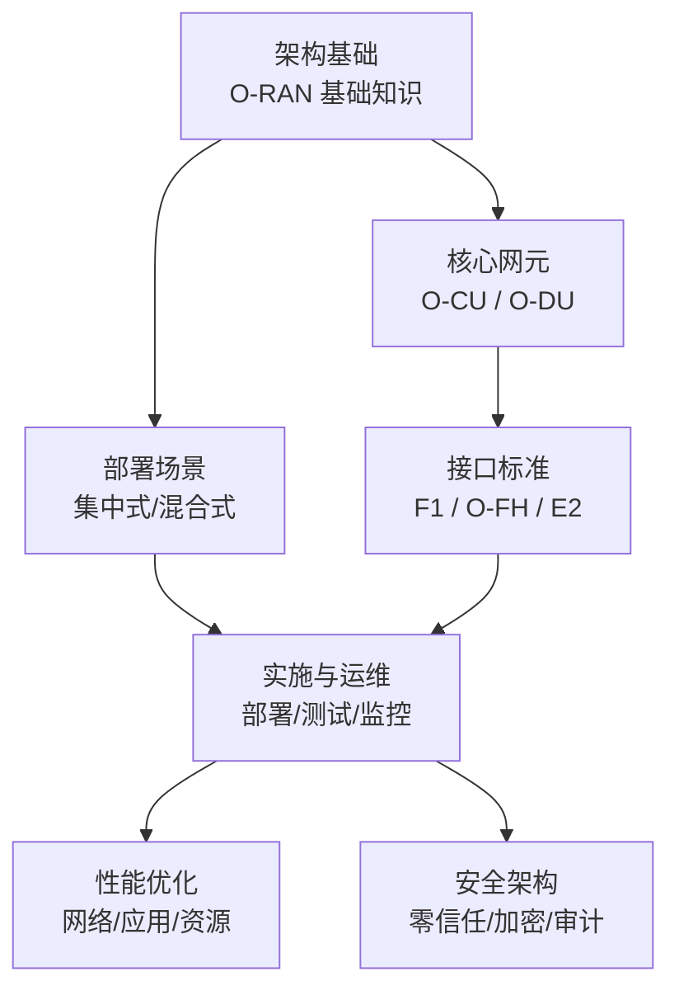
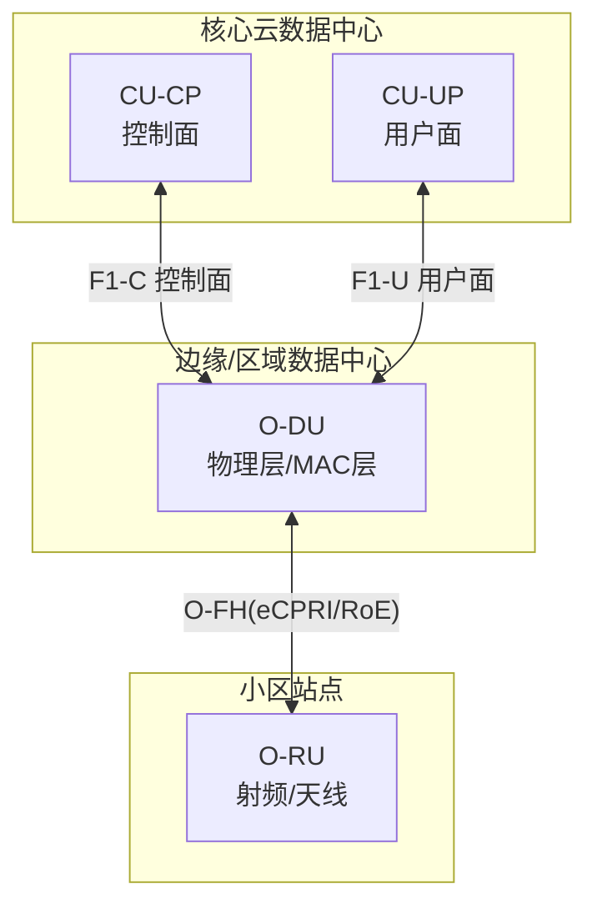
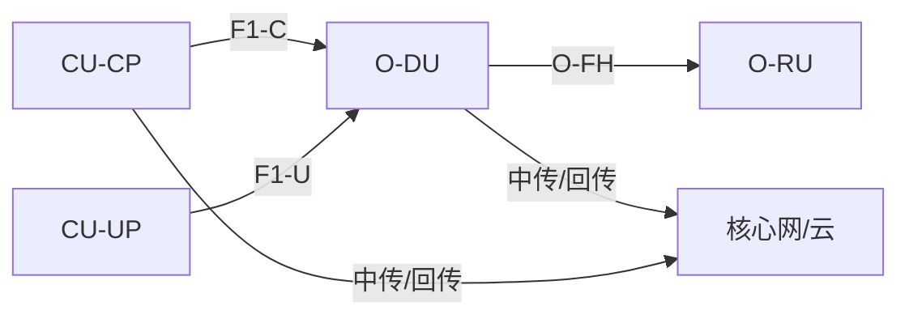

# 集中式部署架构

<cite>
**本文引用的文件**
- [O-RAN 基础知识](file://01-architecture-system/readme.md)
- [集中式单元 O-CU](file://02-core-components/o-cu.md)
- [分布式单元 O-DU](file://02-core-components/o-du.md)
- [部署场景分析](file://04-disaggregation-options/deployment-scenarios.md)
- [O-RAN 实施](file://08-deployment-implementation/readme.md)
- [开放前传接口 O-FH](file://03-interface-standards/o-fh-interface.md)
- [云原生架构与 O-RAN 集成](file://05-cloud-integration/cloud-native-architecture.md)
- [O-RAN 网络性能优化实践](file://26-performance-optimization/network-optimization/network-performance-tuning.md)
- [O-RAN 性能测试](file://13-testing-validation/performance-testing/performance-testing.md)
- [O-RAN 安全架构参考](file://12-security-privacy/security-architecture/security-reference-architecture.md)
</cite>

## 目录
1. [引言](#引言)
2. [项目结构](#项目结构)
3. [核心组件](#核心组件)
4. [架构总览](#架构总览)
5. [详细组件分析](#详细组件分析)
6. [依赖关系分析](#依赖关系分析)
7. [性能考虑](#性能考虑)
8. [故障排查指南](#故障排查指南)
9. [结论](#结论)
10. [附录](#附录)

## 引言
本设计指导聚焦于集中式 O-RAN 部署架构，即 CU 集中部署于核心云数据中心、DU 分布式部署于边缘站点、RU 部署于小区站点。该架构在广覆盖、集中管理与资源复用方面具有显著优势，适用于核心城区与跨区域场景；同时需重点解决“中传/回传”带宽与延迟预算、跨域协同与一致性、以及云原生弹性与安全等挑战。本文将从网络拓扑、带宽与延迟预算、性能优化、硬件与网络基础设施、容灾备份、实施案例与成本分析等方面，给出系统化设计建议与最佳实践。

## 项目结构
围绕集中式部署，本仓库提供了从架构基础、核心网元、接口标准、部署场景、实施与运维、性能优化、测试验证到安全合规的完整知识体系。下图概览了与集中式部署直接相关的关键文档与主题：

**图表来源**
- [O-RAN 基础知识](file://01-architecture-system/readme.md#L1-L161)
- [集中式单元 O-CU](file://02-core-components/o-cu.md#L1-L419)
- [分布式单元 O-DU](file://02-core-components/o-du.md#L1-L415)
- [部署场景分析](file://04-disaggregation-options/deployment-scenarios.md#L1-L563)
- [O-RAN 实施](file://08-deployment-implementation/readme.md#L1-L353)
- [开放前传接口 O-FH](file://03-interface-standards/o-fh-interface.md#L1-L397)
- [O-RAN 网络性能优化实践](file://26-performance-optimization/network-optimization/network-performance-tuning.md#L1-L98)
- [O-RAN 安全架构参考](file://12-security-privacy/security-architecture/security-reference-architecture.md#L1-L559)

**章节来源**
- [O-RAN 基础知识](file://01-architecture-system/readme.md#L1-L161)
- [部署场景分析](file://04-disaggregation-options/deployment-scenarios.md#L1-L563)

## 核心组件
- O-CU（集中式单元）：负责控制面（RRC、NG 接口、F1-C）与用户面（PDCP/SDAP、用户面处理），支持 CU-CP 与 CU-UP 分离部署，便于集中管理与弹性扩展。
- O-DU（分布式单元）：负责物理层与 MAC 层处理，强调低延迟与高实时性，面向 RU 的前传接口（O-FH）采用 eCPRI/RoE，支持高精度时间同步。
- O-FH（开放前传接口）：连接 O-DU 与 O-RU，承载 IQ 数据、控制与同步消息，是集中式架构中“中传/回传”的关键通道。
- 云原生与自动化：容器化、微服务、Kubernetes 编排、IaC、CI/CD、监控与告警、安全与合规，支撑集中式部署的弹性、可观测与安全。

**章节来源**
- [集中式单元 O-CU](file://02-core-components/o-cu.md#L1-L419)
- [分布式单元 O-DU](file://02-core-components/o-du.md#L1-L415)
- [开放前传接口 O-FH](file://03-interface-standards/o-fh-interface.md#L1-L397)
- [云原生架构与 O-RAN 集成](file://05-cloud-integration/cloud-native-architecture.md#L1-L481)

## 架构总览
集中式部署的典型拓扑为：核心云数据中心集中部署 O-CU（CU-CP/CU-UP 分离）、区域/边缘数据中心部署 O-DU、小区站点部署 O-RU。中传/回传通过骨干/城域网互联，O-FH 以 eCPRI/RoE 连接 DU 与 RU。下图展示了集中式架构的端到端交互与数据流：

**图表来源**
- [O-RAN 基础知识](file://01-architecture-system/readme.md#L18-L25)
- [集中式单元 O-CU](file://02-core-components/o-cu.md#L108-L121)
- [分布式单元 O-DU](file://02-core-components/o-du.md#L68-L86)
- [开放前传接口 O-FH](file://03-interface-standards/o-fh-interface.md#L82-L97)

## 详细组件分析

### 网络拓扑设计原则
- 分层与区域化：核心层集中管理，区域/边缘层就近处理，接入层覆盖站点。
- 冗余与隔离：骨干/城域网双平面/多平面，按业务域划分 VLAN/VXLAN，实现网络分段与隔离。
- 低时延路径：优先直连/短路径，减少跨域跳数；对 URLLC 业务采用专用切片或优先队列。
- 同步域划分：PTP 同步域内尽量扁平化，避免多级穿越；跨域同步采用主备与自动切换。

**章节来源**
- [部署场景分析](file://04-disaggregation-options/deployment-scenarios.md#L296-L345)
- [O-RAN 实施](file://08-deployment-implementation/readme.md#L8-L39)

### 带宽规划策略
- 前传（O-FH）带宽：依据天线数、带宽、调制方式与压缩比估算，预留 20%-30% 冗余；RoE/eCPRI 带宽差异与链路聚合策略需结合传输介质（光/无线）。
- 中传/回传（F1）带宽：按并发连接数、业务模型（eMBB/URLLC/mMTC）与 QoS 保障计算，结合用户面与控制面分离带来的带宽分布。
- 传输网络：骨干/城域网应具备 SRv6/VXLAN/SPN 等能力，支持切片与差异化 SLA。

**章节来源**
- [开放前传接口 O-FH](file://03-interface-standards/o-fh-interface.md#L121-L140)
- [O-RAN 实施](file://08-deployment-implementation/readme.md#L46-L50)

### 延迟预算控制
- 端到端预算分解：空口（含 RU/DU 物理层处理）、前传（O-FH）、中传/回传（F1）、核心网（CU-CP/CU-UP）。
- 关键约束：O-DU 物理层/ MAC 层处理延迟通常要求在毫秒级；端到端 URLLC <1ms，需在接口参数、调度策略、同步精度与路径上协同优化。
- 同步与抖动：PTP/SyncE 双重保障，队列调度（WFQ/SP）、缓冲策略与流量整形降低抖动。

**章节来源**
- [分布式单元 O-DU](file://02-core-components/o-du.md#L51-L67)
- [O-RAN 网络性能优化实践](file://26-performance-optimization/network-optimization/network-performance-tuning.md#L47-L61)

### 性能优化方案
- 无线侧：MCS 自适应、波束赋形、干扰协调、HARQ 优化。
- 传输侧：ROHC 头压缩、协议栈优化、QoS 精细化、PDU 会话优化。
- 资源侧：动态调度、统计复用、智能休眠、弹性扩缩容。
- 监控与分析：KPI 基线、趋势分析、根因定位、容量预测。

**章节来源**
- [O-RAN 网络性能优化实践](file://26-performance-optimization/network-optimization/network-performance-tuning.md#L1-L98)

### 硬件配置要求
- O-CU：通用服务器（多核 CPU、大内存、SSD），支持容器化与微服务；CU-CP/CU-UP 分离部署以平衡集中管理与性能。
- O-DU：多核 CPU + DSP/FPGA 加速 + 高速以太网（25G/100G），满足物理层与 MAC 层实时处理；支持 eCPRI/RoE 与 PTP。
- O-RU：支持 eCPRI/RoE、PTP/SyncE、高增益天线与数字前端；与 DU 间前传链路具备冗余与保护。
- 传输设备：支持 10G/25G/100G 以太网、PTP 透传、低延迟转发、链路聚合与保护倒换。

**章节来源**
- [集中式单元 O-CU](file://02-core-components/o-cu.md#L124-L141)
- [分布式单元 O-DU](file://02-core-components/o-du.md#L150-L170)
- [开放前传接口 O-FH](file://03-interface-standards/o-fh-interface.md#L179-L198)

### 网络基础设施设计
- 数据中心网络：Spine-Leaf、VXLAN、SRv6，支持多租户与网络切片。
- 传输网络：骨干/城域网具备带宽、时延与可靠性保障；QoS 与优先级策略确保关键业务。
- 同步网络：PTP 边界时钟/透明时钟、SyncE 备份、同步源冗余与自动切换。

**章节来源**
- [O-RAN 实施](file://08-deployment-implementation/readme.md#L46-L60)
- [开放前传接口 O-FH](file://03-interface-standards/o-fh-interface.md#L157-L178)

### 容灾备份策略
- 数据与业务：跨数据中心备份、异地容灾、自动故障切换与恢复；配置与数据定期备份与校验。
- 网络与链路：多平面/多路径、链路与设备级保护倒换；跨域同步与控制面协同。
- 安全与合规：零信任访问控制、加密与审计、威胁检测与响应、合规性检查。

**章节来源**
- [O-RAN 实施](file://08-deployment-implementation/readme.md#L9-L39)
- [O-RAN 安全架构参考](file://12-security-privacy/security-architecture/security-reference-architecture.md#L3-L71)

### 实际部署案例
- 核心城市集中式：核心 DC 集中部署 CU/SMO/Non-RT RIC，区域 DC 部署 DU，高带宽/低延迟骨干网，管理效率与资源利用率显著提升。
- 工业园区边缘部署：园区边缘部署 CU/DU/Near-RT RIC，满足 URLLC <1ms 与高可靠，支持工业控制与智能制造。
- 农村地区混合部署：县中心核心功能、乡镇边缘功能、村庄一体化设备，无线/有线回传结合，降低成本与运维复杂度。

**章节来源**
- [部署场景分析](file://04-disaggregation-options/deployment-scenarios.md#L499-L558)

### 成本分析与性能基准
- 成本：集中式初期投资高但运维成本低，适合高密度核心区域；分布式/混合式适合边缘与多样化场景，平衡延迟与成本。
- 基准：峰值吞吐、端到端时延、控制面时延、连接建立时间、切换成功率、会话建立速率、容器启动/扩缩容响应、存储 IOPS 等关键 KPI。

**章节来源**
- [O-RAN 性能测试](file://13-testing-validation/performance-testing/performance-testing.md#L29-L57)
- [O-RAN 实施](file://08-deployment-implementation/readme.md#L396-L415)

## 依赖关系分析
集中式部署的关键依赖链包括：O-CU 与 DU 的 F1 接口、DU 与 RU 的 O-FH 接口、以及跨域传输网络与同步系统。下图展示了组件间依赖与数据流：

**图表来源**
- [集中式单元 O-CU](file://02-core-components/o-cu.md#L108-L121)
- [分布式单元 O-DU](file://02-core-components/o-du.md#L68-L86)
- [开放前传接口 O-FH](file://03-interface-standards/o-fh-interface.md#L82-L97)

**章节来源**
- [集中式单元 O-CU](file://02-core-components/o-cu.md#L1-L120)
- [分布式单元 O-DU](file://02-core-components/o-du.md#L1-L130)
- [开放前传接口 O-FH](file://03-interface-standards/o-fh-interface.md#L1-L120)

## 性能考虑
- 时延与抖动：通过同步域优化、队列调度、缓冲策略与流量整形控制；URLLC 场景需端到端预算与路径保障。
- 吞吐与带宽：前传/中传/回传带宽按业务模型与 QoS 精细规划；压缩与协议优化降低开销。
- 可靠性与弹性：多副本、自动故障转移、弹性扩缩容与自愈；监控与告警闭环保障。

**章节来源**
- [O-RAN 网络性能优化实践](file://26-performance-optimization/network-optimization/network-performance-tuning.md#L1-L98)
- [O-RAN 性能测试](file://13-testing-validation/performance-testing/performance-testing.md#L58-L98)

## 故障排查指南
- 分类与流程：接口故障、性能劣化、可用性问题、配置错误、兼容性问题；遵循问题定义、信息收集、假设验证、根因分析、处置与验证的标准流程。
- 工具与方法：Wireshark/tcpdump、协议分析、日志分析、性能分析、Ping/Traceroute、根因分析（5 Why、鱼骨图、故障树、时间线与关联分析）。
- SOP：故障响应、升级、沟通、复盘与知识库更新。

**章节来源**
- [O-RAN 实施](file://08-deployment-implementation/readme.md#L126-L157)

## 结论
集中式 O-RAN 部署在核心云数据中心集中管理 CU、在边缘部署 DU、在站点部署 RU，能够实现广覆盖、高管理效率与资源复用，适合核心城区与跨区域场景。成功的关键在于：清晰的网络拓扑与带宽/延迟预算、严格的同步与一致性保障、完善的性能优化与测试验证、稳健的容灾备份与安全体系，以及云原生自动化与可观测性支撑。通过分阶段实施与持续优化，可在满足 SLA 的前提下实现成本与性能的最佳平衡。

## 附录
- 适用场景：核心城区、跨区域广覆盖、集中管理优先、对端到端时延要求不严或可通过优化满足。
- 技术优势：集中管理、资源共享、运维效率高、成本可控。
- 实施挑战：中传/回传带宽与延迟压力、跨域协同与一致性、同步域复杂度、安全与合规要求。
- 最佳实践：分层部署、冗余与隔离、QoS 与切片、零信任与加密、CI/CD 与自动化、监控与告警、容量预测与弹性扩缩容。