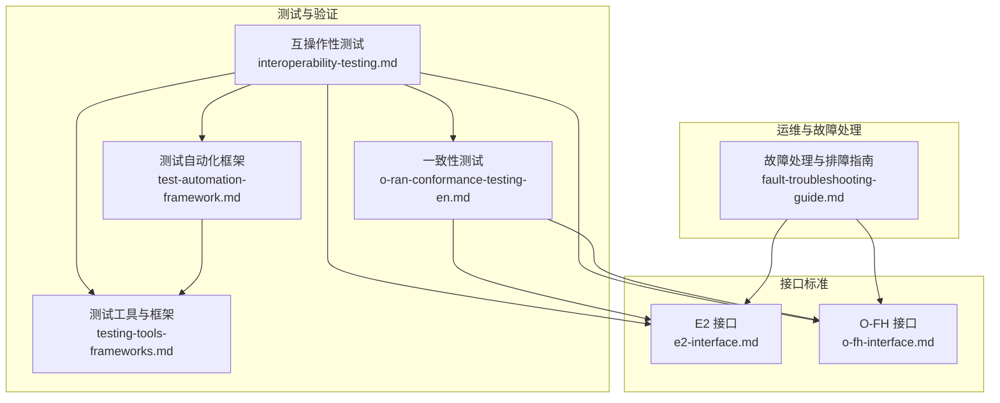
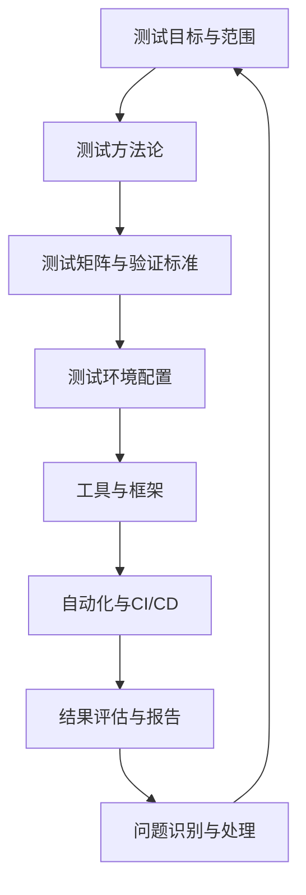
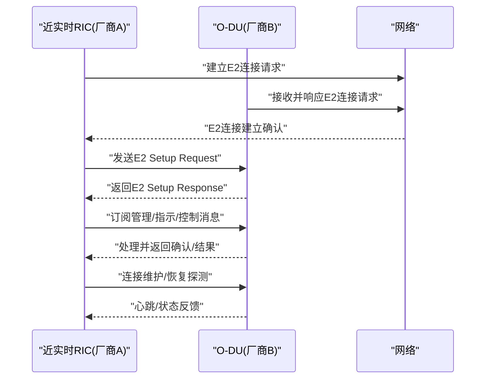
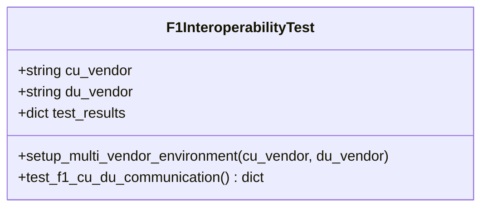
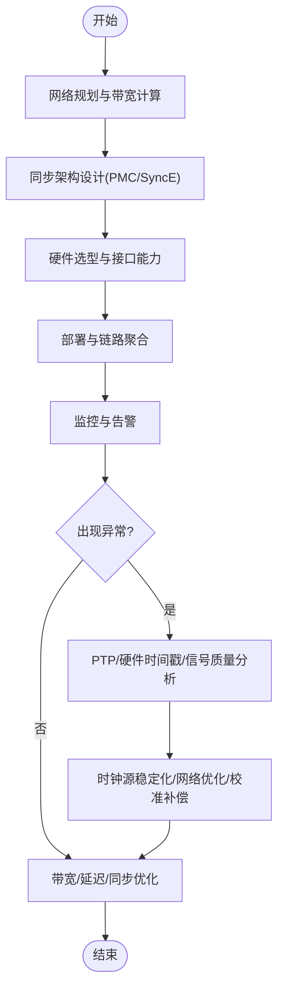
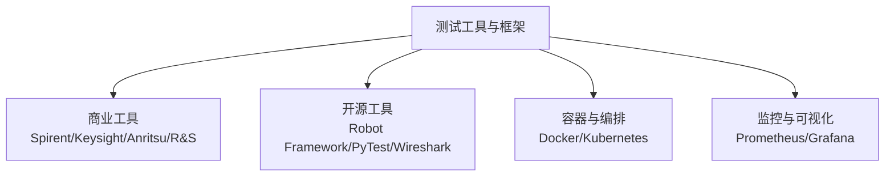
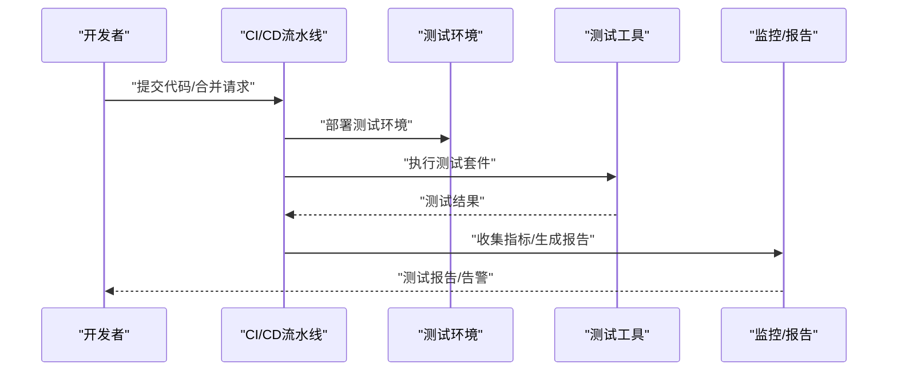
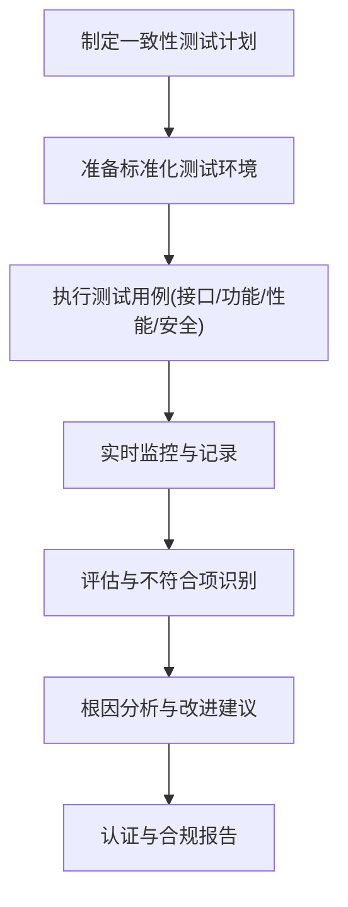
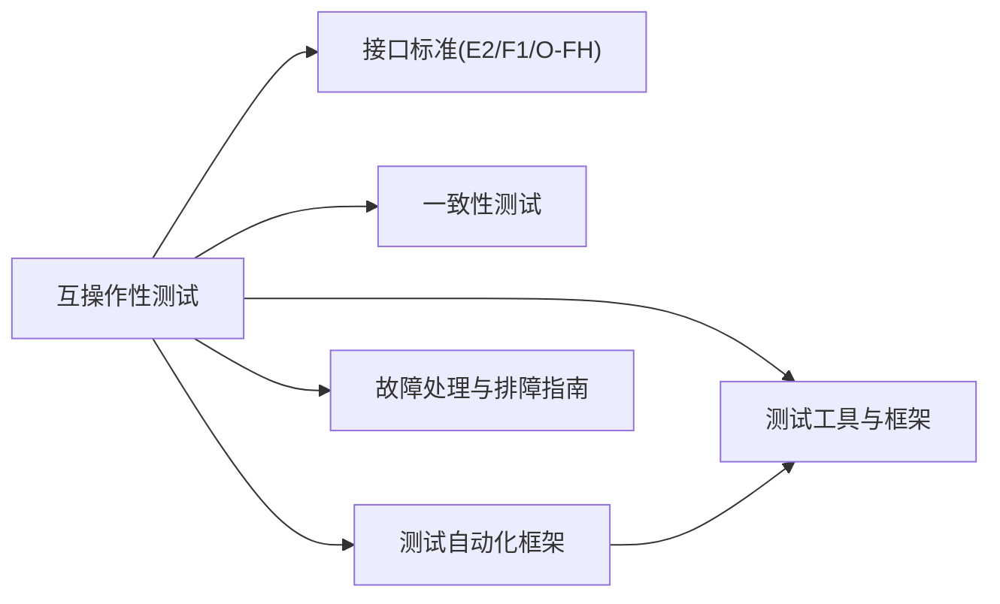
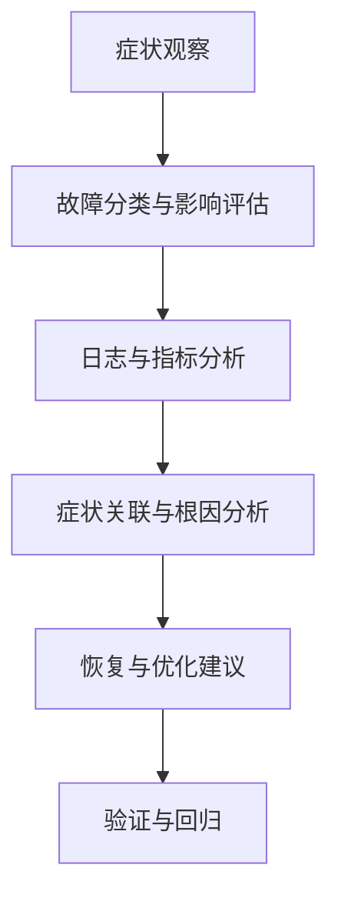

# 互操作性测试

<cite>
**本文引用的文件**   
- [互操作性测试](file://13-testing-validation/interoperability/interoperability-testing.md)
- [测试工具与框架](file://13-testing-validation/testing-tools/testing-tools-frameworks.md)
- [测试自动化框架](file://13-testing-validation/automation-framework/test-automation-framework.md)
- [一致性测试](file://13-testing-validation/conformance-testing/o-ran-conformance-testing-en.md)
- [E2 接口](file://03-interface-standards/e2-interface.md)
- [O-FH 接口](file://03-interface-standards/o-fh-interface.md)
- [故障处理与排障指南](file://14-operations-management/fault-handling/fault-troubleshooting-guide.md)
</cite>

## 目录
1. [引言](#引言)
2. [项目结构](#项目结构)
3. [核心组件](#核心组件)
4. [架构总览](#架构总览)
5. [详细组件分析](#详细组件分析)
6. [依赖关系分析](#依赖关系分析)
7. [性能考虑](#性能考虑)
8. [故障排查指南](#故障排查指南)
9. [结论](#结论)
10. [附录](#附录)

## 引言
本文件面向O-RAN互操作性测试，围绕多厂商兼容性测试策略、接口协议兼容性验证方法、跨厂商功能测试实施流程，以及认证测试准备、Plugfest参与策略、测试环境搭建标准、测试工具使用指南、测试结果评估方法、问题识别与解决、自动化实现与报告分析、最佳实践与协作方法等方面，形成系统化指导。内容来源于仓库中的互操作性测试、测试工具与框架、测试自动化框架、一致性测试、接口标准文档及故障处理指南，并辅以图示帮助理解。

## 项目结构
本仓库围绕O-RAN体系的知识与实践，形成“测试与验证”“接口标准”“运维与故障处理”等主题模块。与互操作性测试直接相关的知识主要分布在以下目录：
- 13-testing-validation：测试与验证，包含互操作性测试、一致性测试、测试工具与框架、自动化框架
- 03-interface-standards：接口标准，包含E2、F1、O-FH、A1、O1等接口规范
- 14-operations-management：运维与故障处理，包含故障处理与排障指南

**图表来源**
- [互操作性测试](file://13-testing-validation/interoperability/interoperability-testing.md#L1-L231)
- [测试工具与框架](file://13-testing-validation/testing-tools/testing-tools-frameworks.md#L1-L598)
- [测试自动化框架](file://13-testing-validation/automation-framework/test-automation-framework.md#L1-L134)
- [一致性测试](file://13-testing-validation/conformance-testing/o-ran-conformance-testing-en.md#L1-L617)
- [E2 接口](file://03-interface-standards/e2-interface.md#L1-L337)
- [O-FH 接口](file://03-interface-standards/o-fh-interface.md#L1-L397)
- [故障处理与排障指南](file://14-operations-management/fault-handling/fault-troubleshooting-guide.md#L1-L633)

**章节来源**
- [互操作性测试](file://13-testing-validation/interoperability/interoperability-testing.md#L1-L231)
- [测试工具与框架](file://13-testing-validation/testing-tools/testing-tools-frameworks.md#L1-L598)
- [测试自动化框架](file://13-testing-validation/automation-framework/test-automation-framework.md#L1-L134)
- [一致性测试](file://13-testing-validation/conformance-testing/o-ran-conformance-testing-en.md#L1-L617)
- [E2 接口](file://03-interface-standards/e2-interface.md#L1-L337)
- [O-FH 接口](file://03-interface-standards/o-fh-interface.md#L1-L397)
- [故障处理与排障指南](file://14-operations-management/fault-handling/fault-troubleshooting-guide.md#L1-L633)

## 核心组件
- 测试目标与范围：多厂商兼容性、接口标准合规、系统集成验证
- 测试方法论：黑盒、灰盒、白盒测试策略
- 测试矩阵与验证标准：功能、性能、可靠性指标
- 测试环境：多厂商组件组合、网络隔离与配置
- 工具与框架：商业与开源工具、容器与编排、监控与可视化
- 自动化与CI/CD：测试脚手架、并行执行、结果分析与报告

**章节来源**
- [互操作性测试](file://13-testing-validation/interoperability/interoperability-testing.md#L6-L231)
- [测试工具与框架](file://13-testing-validation/testing-tools/testing-tools-frameworks.md#L1-L598)
- [测试自动化框架](file://13-testing-validation/automation-framework/test-automation-framework.md#L1-L134)

## 架构总览
互操作性测试体系由“测试目标—测试方法—测试环境—工具与框架—自动化—结果评估—问题处理”构成闭环。下图展示测试流程与关键组件的关系：

**图表来源**
- [互操作性测试](file://13-testing-validation/interoperability/interoperability-testing.md#L6-L231)
- [测试工具与框架](file://13-testing-validation/testing-tools/testing-tools-frameworks.md#L1-L598)
- [测试自动化框架](file://13-testing-validation/automation-framework/test-automation-framework.md#L1-L134)
- [故障处理与排障指南](file://14-operations-management/fault-handling/fault-troubleshooting-guide.md#L1-L633)

## 详细组件分析

### 组件A：多厂商E2接口互操作性测试
- 测试场景：跨厂商RIC与DU之间的E2接口通信
- 关键步骤：连接建立、消息交换、订阅管理、指示与控制消息处理、连接维护与恢复
- 验证指标：消息成功率、协议合规、错误恢复、连接韧性
- 端到端验证：结合一致性测试与故障处理指南进行回归与稳定性评估

**图表来源**
- [互操作性测试](file://13-testing-validation/interoperability/interoperability-testing.md#L30-L56)
- [E2 接口](file://03-interface-standards/e2-interface.md#L1-L337)

**章节来源**
- [互操作性测试](file://13-testing-validation/interoperability/interoperability-testing.md#L30-L56)
- [E2 接口](file://03-interface-standards/e2-interface.md#L1-L337)

### 组件B：F1接口多厂商互操作性测试框架
- 环境搭建：CU与DU来自不同厂商，分别配置并建立连接
- 测试用例：连接建立、UE上下文管理、承载建立与修改、空口资源控制移交、错误处理与恢复
- 结果汇总：按用例维度输出通过/失败与指标

**图表来源**
- [互操作性测试](file://13-testing-validation/interoperability/interoperability-testing.md#L58-L95)

**章节来源**
- [互操作性测试](file://13-testing-validation/interoperability/interoperability-testing.md#L58-L95)

### 组件C：O-FH接口互操作性与同步测试
- 功能范围：用户面数据传输、控制面管理、时间/频率同步
- 同步要求：PTP纳秒级精度、SyncE备份、同步源冗余
- 测试重点：带宽与延迟、误码率、同步稳定性、RU状态与告警

**图表来源**
- [O-FH 接口](file://03-interface-standards/o-fh-interface.md#L1-L397)

**章节来源**
- [O-FH 接口](file://03-interface-standards/o-fh-interface.md#L1-L397)

### 组件D：测试工具与框架
- 商业工具：Spirent、Keysight、Anritsu、Rohde & Schwarz
- 开源工具：Wireshark插件、Robot Framework、PyTest、容器与编排
- 监控与可视化：Prometheus、Grafana、测试仪表板

**图表来源**
- [测试工具与框架](file://13-testing-validation/testing-tools/testing-tools-frameworks.md#L1-L598)

**章节来源**
- [测试工具与框架](file://13-testing-validation/testing-tools/testing-tools-frameworks.md#L1-L598)

### 组件E：测试自动化与CI/CD
- 自动化框架：测试编排、执行引擎、数据管理、结果分析、报告生成
- 最佳实践：模块化、可维护性、可扩展性、可靠性、可追溯性
- CI/CD：流水线集成、并行执行、安全扫描、报告发布

**图表来源**
- [测试自动化框架](file://13-testing-validation/automation-framework/test-automation-framework.md#L1-L134)
- [测试工具与框架](file://13-testing-validation/testing-tools/testing-tools-frameworks.md#L364-L418)

**章节来源**
- [测试自动化框架](file://13-testing-validation/automation-framework/test-automation-framework.md#L1-L134)
- [测试工具与框架](file://13-testing-validation/testing-tools/testing-tools-frameworks.md#L364-L418)

### 组件F：一致性测试与认证
- O-RAN联盟测试套件：架构一致性、接口一致性、功能/性能/安全一致性
- 3GPP规范验证：NG-RAN架构、5G NR协议、RAN功能规范、互操作性要求
- 自动化测试平台：用例管理、自动执行、结果分析、回归机制

**图表来源**
- [一致性测试](file://13-testing-validation/conformance-testing/o-ran-conformance-testing-en.md#L1-L617)

**章节来源**
- [一致性测试](file://13-testing-validation/conformance-testing/o-ran-conformance-testing-en.md#L1-L617)

## 依赖关系分析
- 互操作性测试依赖接口标准文档（E2、F1、O-FH）定义的消息格式、流程与时序
- 一致性测试为互操作性测试提供合规性基线与验证方法
- 测试工具与框架为互操作性测试提供执行载体与数据采集手段
- 自动化框架支撑大规模并行测试与持续交付
- 故障处理与排障指南为问题定位与恢复提供方法论与工具链

**图表来源**
- [互操作性测试](file://13-testing-validation/interoperability/interoperability-testing.md#L1-L231)
- [一致性测试](file://13-testing-validation/conformance-testing/o-ran-conformance-testing-en.md#L1-L617)
- [测试工具与框架](file://13-testing-validation/testing-tools/testing-tools-frameworks.md#L1-L598)
- [测试自动化框架](file://13-testing-validation/automation-framework/test-automation-framework.md#L1-L134)
- [E2 接口](file://03-interface-standards/e2-interface.md#L1-L337)
- [O-FH 接口](file://03-interface-standards/o-fh-interface.md#L1-L397)
- [故障处理与排障指南](file://14-operations-management/fault-handling/fault-troubleshooting-guide.md#L1-L633)

**章节来源**
- [互操作性测试](file://13-testing-validation/interoperability/interoperability-testing.md#L1-L231)
- [一致性测试](file://13-testing-validation/conformance-testing/o-ran-conformance-testing-en.md#L1-L617)
- [测试工具与框架](file://13-testing-validation/testing-tools/testing-tools-frameworks.md#L1-L598)
- [测试自动化框架](file://13-testing-validation/automation-framework/test-automation-framework.md#L1-L134)
- [E2 接口](file://03-interface-standards/e2-interface.md#L1-L337)
- [O-FH 接口](file://03-interface-standards/o-fh-interface.md#L1-L397)
- [故障处理与排障指南](file://14-operations-management/fault-handling/fault-troubleshooting-guide.md#L1-L633)

## 性能考虑
- 功能互操作性：消息交换成功率、协议合规、特性兼容、错误恢复
- 性能互操作性：延迟一致性、吞吐维持、资源利用、可扩展性
- 可靠性指标：连接稳定性、故障恢复时间、会话持久性、负载均衡
- 工具与监控：Prometheus/Grafana、容器编排、并行执行、基线对比

**章节来源**
- [互操作性测试](file://13-testing-validation/interoperability/interoperability-testing.md#L159-L178)
- [测试工具与框架](file://13-testing-validation/testing-tools/testing-tools-frameworks.md#L483-L559)
- [测试自动化框架](file://13-testing-validation/automation-framework/test-automation-framework.md#L107-L121)

## 故障排查指南
- 故障分类：网络功能、接口协议、基础设施与平台
- 诊断方法：系统化故障诊断、根因分析框架、网络追踪与包捕获
- 典型场景：
  - E2接口连接建立失败：网络连通性、证书与安全、配置参数
  - F1接口性能问题：资源利用、QoS与缓冲、拆分选项优化
  - O-FH同步问题：PTP同步质量、硬件时间戳、信号质量与校准

**图表来源**
- [故障处理与排障指南](file://14-operations-management/fault-handling/fault-troubleshooting-guide.md#L31-L180)

**章节来源**
- [故障处理与排障指南](file://14-operations-management/fault-handling/fault-troubleshooting-guide.md#L1-L633)

## 结论
本指导以互操作性测试为核心，结合接口标准、一致性测试、测试工具与自动化框架，构建从测试设计、执行、监控到问题处理的完整闭环。通过明确测试目标、方法论与验证标准，配合成熟的工具链与自动化流水线，可在多厂商环境下高效开展互操作性测试，并持续提升系统的功能、性能与可靠性表现。

## 附录

### A. 多厂商兼容性测试策略
- 建立测试矩阵：按厂商组合与特性维度设计测试用例
- 分层测试：黑盒验证协议与功能，灰盒/白盒关注实现细节与安全
- 基线与回归：建立基准与回归机制，确保变更不引入互操作退化

**章节来源**
- [互操作性测试](file://13-testing-validation/interoperability/interoperability-testing.md#L97-L116)
- [一致性测试](file://13-testing-validation/conformance-testing/o-ran-conformance-testing-en.md#L1-L617)

### B. 接口协议兼容性验证方法
- E2接口：连接建立、消息交换、订阅与指示/控制处理、安全与恢复
- F1接口：连接与承载、上下文与资源控制、错误恢复
- O-FH接口：用户面/控制面/同步，PTP与硬件时间戳，鲁棒性与容量规划

**章节来源**
- [互操作性测试](file://13-testing-validation/interoperability/interoperability-testing.md#L30-L95)
- [E2 接口](file://03-interface-standards/e2-interface.md#L1-L337)
- [O-FH 接口](file://03-interface-standards/o-fh-interface.md#L1-L397)

### C. 跨厂商功能测试实施流程
- 环境准备：隔离网络、多厂商组件配置、端到端连通性
- 测试执行：按场景与用例顺序执行，记录指标与异常
- 结果评估：通过率、性能指标、可靠性统计、问题归类
- 报告与复盘：输出测试报告、问题清单、改进建议与回归计划

**章节来源**
- [互操作性测试](file://13-testing-validation/interoperability/interoperability-testing.md#L117-L178)
- [测试工具与框架](file://13-testing-validation/testing-tools/testing-tools-frameworks.md#L1-L598)

### D. Plugfest参与策略与认证准备
- 参与官方Plugfest活动，遵循认证测试程序
- 建立认证路线图：标准版本跟踪、合规性检查、认证徽章获取与定期复审
- 多厂商协作：明确沟通渠道、共享测试计划与结果

**章节来源**
- [互操作性测试](file://13-testing-validation/interoperability/interoperability-testing.md#L179-L186)

### E. 测试环境搭建标准
- 多厂商组件清单与版本管理
- 网络隔离与分区：管理网、E2/F1/O-FH专用网段
- 容器与编排：Docker/Kubernetes隔离与弹性
- 监控与可观测性：Prometheus/Grafana仪表板与告警

**章节来源**
- [互操作性测试](file://13-testing-validation/interoperability/interoperability-testing.md#L117-L149)
- [测试工具与框架](file://13-testing-validation/testing-tools/testing-tools-frameworks.md#L298-L357)
- [测试自动化框架](file://13-testing-validation/automation-framework/test-automation-framework.md#L22-L38)

### F. 测试工具使用指南
- 商业工具：Spirent、Keysight、Anritsu、Rohde & Schwarz
- 开源工具：Wireshark插件、Robot Framework、PyTest、容器与编排
- 安全测试：静态分析、动态应用安全测试、容器与网络扫描

**章节来源**
- [测试工具与框架](file://13-testing-validation/testing-tools/testing-tools-frameworks.md#L6-L598)

### G. 测试结果评估方法
- 功能：消息成功率、协议合规、特性兼容、错误恢复
- 性能：延迟、吞吐、资源利用、可扩展性
- 可靠性：连接稳定性、恢复时间、会话持久性、负载均衡
- 报告：测试执行趋势、失败率分析、覆盖率与基线对比

**章节来源**
- [互操作性测试](file://13-testing-validation/interoperability/interoperability-testing.md#L159-L178)
- [测试工具与框架](file://13-testing-validation/testing-tools/testing-tools-frameworks.md#L483-L559)

### H. 互操作性问题识别与解决
- 识别：症状分类、日志与指标分析、根因关联
- 解决：E2/F1/O-FH针对性优化与恢复流程
- 预防：预防性监控、自动化恢复、基线与回归

**章节来源**
- [故障处理与排障指南](file://14-operations-management/fault-handling/fault-troubleshooting-guide.md#L31-L633)

### I. 自动化实现方案与报告分析
- 自动化框架：测试编排、执行引擎、数据管理、结果分析、报告生成
- CI/CD：流水线集成、并行执行、安全扫描、报告发布
- 报告分析：趋势、失败率、覆盖率、资源消耗优化建议

**章节来源**
- [测试自动化框架](file://13-testing-validation/automation-framework/test-automation-framework.md#L1-L134)
- [测试工具与框架](file://13-testing-validation/testing-tools/testing-tools-frameworks.md#L364-L418)

### J. 最佳实践与多厂商协作
- 预测试：厂商协调、文档审查、环境隔离、基线建立
- 执行：系统化方法、详细日志、实时监控、问题记录
- 后续：结果分析、问题协同解决、优化建议、知识分享
- 协作：清晰沟通渠道、共享测试计划与结果、联合复盘

**章节来源**
- [互操作性测试](file://13-testing-validation/interoperability/interoperability-testing.md#L193-L212)