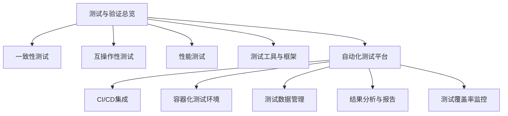
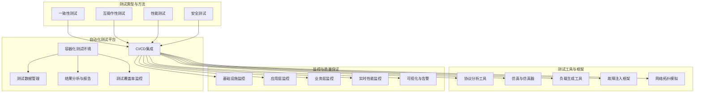
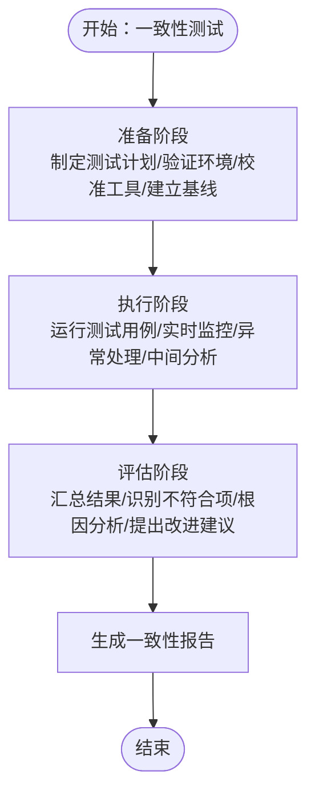
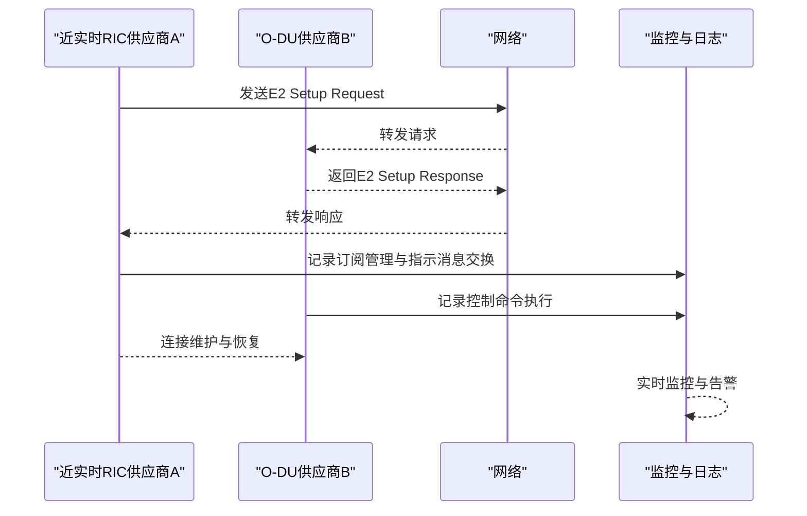
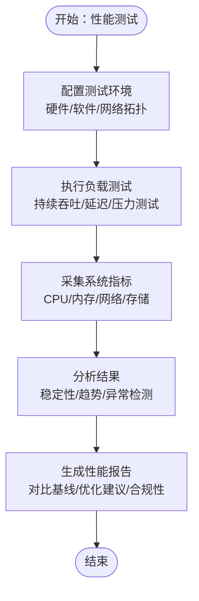
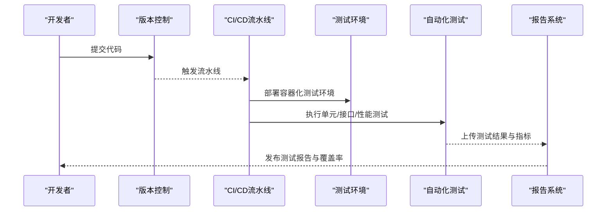
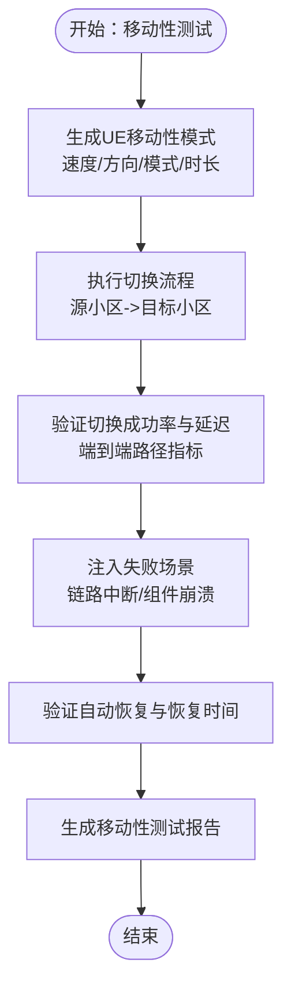
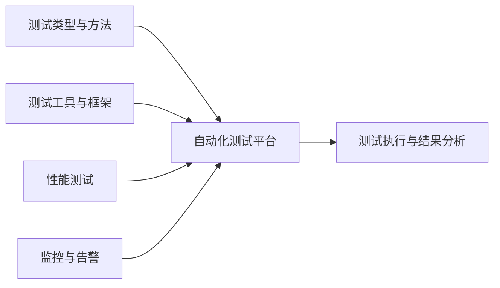

# 功能测试

<cite>
**本文引用的文件**   
- [O-RAN 测试与验证](file://13-testing-validation/readme.md)
- [O-RAN 测试自动化框架](file://13-testing-validation/automation-framework/test-automation-framework.md)
- [O-RAN 一致性测试](file://13-testing-validation/conformance-testing/o-ran-conformance-testing.md)
- [O-RAN 一致性测试（英文）](file://13-testing-validation/conformance-testing/o-ran-conformance-testing-en.md)
- [O-RAN 性能测试](file://13-testing-validation/performance-testing/performance-testing.md)
- [O-RAN 性能测试（中文）](file://13-testing-validation/performance-testing/performance-testing-zh.md)
- [O-RAN 互操作性测试](file://13-testing-validation/interoperability/interoperability-testing.md)
- [O-RAN 测试工具与框架](file://13-testing-validation/testing-tools/testing-tools-frameworks.md)
- [O-RAN 运营监控告警系统](file://14-operations-management/monitoring-alerting/operations-monitoring-framework.md)
- [O-RAN 运营监控告警系统（中文）](file://14-operations-management/monitoring-alerting/operations-monitoring-framework-zh.md)
- [O-RAN 最佳实践](file://30-best-practices/operations-practices/o-ran-operations-best-practices.md)
</cite>

## 目录
1. [简介](#简介)
2. [项目结构](#项目结构)
3. [核心组件](#核心组件)
4. [架构总览](#架构总览)
5. [详细组件分析](#详细组件分析)
6. [依赖关系分析](#依赖关系分析)
7. [性能考量](#性能考量)
8. [故障排查指南](#故障排查指南)
9. [结论](#结论)
10. [附录](#附录)

## 简介
本文件面向O-RAN功能测试，围绕网络元素功能验证、端到端业务场景、移动性（手握转换、重选、切换成功率）、承载管理（QoS参数、资源分配、质量监控）等方面，结合仓库中已有的测试框架、自动化平台、性能测试与监控体系，形成一套可落地的测试指导与最佳实践。文档同时给出测试用例设计原则、测试环境搭建要求、测试执行标准流程、自动化实现方案、测试数据准备策略以及测试结果分析方法，并提供常见缺陷识别与解决思路。

## 项目结构
本仓库在“13-testing-validation”目录下提供了O-RAN测试与验证的完整体系，包括：
- 测试类型与方法：一致性、互操作性、性能、安全
- 自动化测试平台：CI/CD集成、容器化测试环境、测试数据管理、结果分析与报告、覆盖率监控
- 工具链：开源与商业测试工具、协议分析、仿真与仿真器、故障注入、网络拓扑模拟
- 测试流程：准备、执行、评估阶段；质量保证与测试覆盖度

**章节来源**
- file://13-testing-validation/readme.md#L1-L103

## 核心组件
- 测试类型与方法：覆盖一致性、互操作性、性能、安全四大类，支撑端到端验证与回归。
- 自动化测试平台：提供统一的测试编排、执行、数据与结果管理，支持并行执行与持续集成。
- 测试工具与框架：整合开源与商业工具，覆盖协议分析、负载生成、仿真、监控与可视化。
- 性能测试：定义吞吐量、延迟、抖动、丢包、连接密度等关键指标，提供负载测试框架与场景。
- 监控与告警：多层监控架构，覆盖基础设施、应用与业务层面，支持实时指标采集与可视化。

**章节来源**
- file://13-testing-validation/readme.md#L6-L57
- file://13-testing-validation/automation-framework/test-automation-framework.md#L6-L21
- file://13-testing-validation/testing-tools/testing-tools-frameworks.md#L1-L598
- file://13-testing-validation/performance-testing/performance-testing.md#L6-L27
- file://14-operations-management/monitoring-alerting/operations-monitoring-framework.md#L6-L44

## 架构总览
下图展示O-RAN功能测试的整体架构：测试类型与方法作为顶层指导，自动化平台负责执行与编排，工具链提供协议分析、仿真、负载生成与监控，性能测试与监控体系贯穿始终，保障端到端业务验证与质量保证。

**图示来源**
- [O-RAN 测试与验证](file://13-testing-validation/readme.md#L1-L103)
- [O-RAN 测试自动化框架](file://13-testing-validation/automation-framework/test-automation-framework.md#L36-L57)
- [O-RAN 测试工具与框架](file://13-testing-validation/testing-tools/testing-tools-frameworks.md#L1-L598)
- [O-RAN 运营监控告警系统](file://14-operations-management/monitoring-alerting/operations-monitoring-framework.md#L6-L44)

## 详细组件分析

### 一致性测试（网络元素功能验证）
- 测试框架：O-RAN联盟测试套件、3GPP规范验证，覆盖架构一致性、接口一致性、功能一致性、性能一致性、安全一致性。
- 测试环境：标准化测试床配置、网络拓扑模拟、协议栈实现验证、测试数据准备。
- 测试流程：准备阶段（测试计划、环境验证、工具校准、基线建立）、执行阶段（用例运行、实时监控、异常处理、中间结果分析）、评估阶段（结果汇总、不符合项识别、根因分析、改进建议）。
- 质量保证：测试覆盖度（功能、场景、边界、异常处理）、测试有效性（用例质量、结果准确性、环境代表性、过程可重复性）。

**图示来源**
- [O-RAN 一致性测试](file://13-testing-validation/conformance-testing/o-ran-conformance-testing.md#L35-L67)

**章节来源**
- file://13-testing-validation/conformance-testing/o-ran-conformance-testing.md#L1-L67
- file://13-testing-validation/conformance-testing/o-ran-conformance-testing-en.md#L1-L617

### 互操作性测试（端到端业务测试场景设计）
- 测试目标：多厂商兼容、接口标准合规、系统集成验证。
- 场景设计：E2接口互通、F1接口多厂商测试、O-FH前传接口兼容、A1/O1接口策略与运维互通、网络切片与多域协同。
- 方法论：黑盒测试（关注标准协议与功能）、灰盒测试（结合内部结构知识）、白盒测试（关键组件算法与安全）。
- 验证标准：消息交换成功率、协议合规、功能兼容、错误处理与恢复、延迟一致性、吞吐保持、资源利用效率、可扩展性、连接稳定性、故障恢复时间、会话持久性、负载均衡。

**图示来源**
- [O-RAN 互操作性测试](file://13-testing-validation/interoperability/interoperability-testing.md#L30-L56)

**章节来源**
- file://13-testing-validation/interoperability/interoperability-testing.md#L1-L231

### 性能测试（承载管理与质量监控）
- 性能类别：网络性能（吞吐、延迟、丢包、抖动、连接密度）、资源性能（CPU、内存、存储I/O、带宽、功耗）、可扩展性（水平/垂直扩展、负载分布、容量规划、增长建模）。
- 关键指标（KPI）：峰值吞吐量、用户面/控制面延迟、连接建立时间、切换成功率、会话建立速率、数据包处理速率、Diameter事务速率、数据库查询响应、API响应时间、容器启动/VM配置/自动扩展响应、负载均衡延迟、存储IOPS。
- 负载测试框架：持续吞吐测试、延迟特征化、压力测试（按负载因子扩展环境）、系统指标采集与稳定性检查。
- 场景设计：峰值性能测试（端到端路径测量）、延迟特征化测试（不同接口与配置）、可扩展性验证测试（水平扩展性能）。
- 监控与分析：PromQL指标（吞吐、延迟、资源利用率、错误率）、性能分析仪表板（趋势、热力图、关联性、异常检测、容量规划）。

**图示来源**
- [O-RAN 性能测试](file://13-testing-validation/performance-testing/performance-testing.md#L58-L167)

**章节来源**
- file://13-testing-validation/performance-testing/performance-testing.md#L1-L327
- file://13-testing-validation/performance-testing/performance-testing-zh.md#L1-L327

### 自动化测试平台（测试执行标准流程）
- 平台组成：测试编排层、分布式执行引擎、测试数据管理、结果分析模块、报告系统。
- 技术栈：CI/CD（Jenkins/GitLab/GitHub Actions）、容器编排（Docker/Kubernetes）、测试框架（Robot/PyTest/JUnit）、监控（Prometheus/Grafana）、版本控制（Git）。
- 最佳实践：模块化、可维护性、可扩展性、可靠性（错误处理与重试）、可追溯性（测试与需求映射）。
- CI/CD集成：每次提交触发冒烟测试、定时运行综合测试套件、重大变更后触发性能回归测试、流水线中自动化安全扫描、自动生成并发布测试报告。
- 测试数据管理：合成数据生成、敏感信息脱敏、区分不同测试类型的测试数据集、定期清理测试环境与数据、版本控制测试数据模式与配置。

**图示来源**
- [O-RAN 测试自动化框架](file://13-testing-validation/automation-framework/test-automation-framework.md#L36-L84)

**章节来源**
- file://13-testing-validation/automation-framework/test-automation-framework.md#L1-L134

### 测试工具与框架（测试数据准备策略）
- 开源工具：Robot Framework、PyTest、Wireshark插件、iperf3/netperf、容器与Kubernetes编排。
- 商业工具：Spirent、Keysight、Anritsu、Rohde & Schwarz等网络与协议测试平台。
- 测试数据管理：合成数据生成（网络流量、无线电波形、控制消息、性能指标）、生产数据匿名化、测试数据生命周期管理、测试配置与模式版本控制。
- 监控与可视化：Prometheus抓取测试指标、Grafana仪表板展示测试执行概览、接口性能热力图、资源使用单值图。

**章节来源**
- file://13-testing-validation/testing-tools/testing-tools-frameworks.md#L1-L598

### 移动性测试（手握转换、重选、切换成功率）
- 手握转换与重选：基于一致性测试中的移动性管理合规检查，验证RRC连接建立、测量报告、切换流程、寻呼流程等。
- 切换成功率验证：通过一致性测试脚本对源小区到目标小区的切换进行压力与稳定性验证，结合性能测试中的端到端路径指标，确保在高负载下仍满足SLA。
- 测试数据生成：生成UE移动性模式（速度、方向、模式类型、持续时间），以及失败场景（链路中断、组件崩溃）以验证恢复能力。

**图示来源**
- [O-RAN 一致性测试（英文）](file://13-testing-validation/conformance-testing/o-ran-conformance-testing-en.md#L152-L270)
- [O-RAN 性能测试](file://13-testing-validation/performance-testing/performance-testing.md#L169-L242)

**章节来源**
- file://13-testing-validation/conformance-testing/o-ran-conformance-testing-en.md#L152-L270
- file://13-testing-validation/conformance-testing/o-ran-conformance-testing-en.md#L360-L515

### 承载管理测试（QoS参数、资源分配、质量监控）
- QoS参数验证：基于一致性测试中的QoS合规检查，验证QoS流建立、监控（如延迟阈值）、ARP、5QI等参数。
- 资源分配测试：结合性能测试的资源利用率分析（CPU、内存、存储I/O、网络带宽、功耗），验证在不同负载下的资源分配与调度。
- 质量监控流程：通过监控与告警系统（基础设施层、应用层、业务层）对关键KPI进行持续观测，结合性能测试的基线与回归测试，确保服务质量稳定。

**章节来源**
- file://13-testing-validation/conformance-testing/o-ran-conformance-testing-en.md#L226-L242
- file://13-testing-validation/performance-testing/performance-testing.md#L244-L272
- file://14-operations-management/monitoring-alerting/operations-monitoring-framework.md#L6-L44

## 依赖关系分析
- 测试类型与方法是顶层指导，决定测试策略与场景覆盖。
- 自动化测试平台为各测试类型提供统一执行与数据管理能力，提升可重复性与效率。
- 工具链为测试提供协议分析、仿真、负载生成与监控可视化支撑。
- 性能测试与监控体系贯穿测试全过程，提供基线、回归与持续观测能力。

**图示来源**
- [O-RAN 测试与验证](file://13-testing-validation/readme.md#L1-L103)
- [O-RAN 测试自动化框架](file://13-testing-validation/automation-framework/test-automation-framework.md#L36-L57)
- [O-RAN 测试工具与框架](file://13-testing-validation/testing-tools/testing-tools-frameworks.md#L1-L598)
- [O-RAN 性能测试](file://13-testing-validation/performance-testing/performance-testing.md#L58-L167)
- [O-RAN 运营监控告警系统](file://14-operations-management/monitoring-alerting/operations-monitoring-framework.md#L6-L44)

**章节来源**
- file://13-testing-validation/readme.md#L1-L103
- file://13-testing-validation/automation-framework/test-automation-framework.md#L36-L57
- file://13-testing-validation/testing-tools/testing-tools-frameworks.md#L1-L598
- file://13-testing-validation/performance-testing/performance-testing.md#L58-L167
- file://14-operations-management/monitoring-alerting/operations-monitoring-framework.md#L6-L44

## 性能考量
- 指标体系：明确KPI目标与测量方法，确保端到端路径与关键接口均被覆盖。
- 负载与压力：通过持续吞吐、延迟特征化、压力测试评估系统在极限条件下的稳定性与可恢复性。
- 资源优化：网络接口调优、缓冲区管理、QoS、负载均衡、协议优化、CPU亲和性、内存管理、存储I/O、内核参数、容器优化。
- 可扩展性：水平/垂直扩展测试，验证线性与次线性扩展特性，评估负载分布与节点间通信开销。

**章节来源**
- file://13-testing-validation/performance-testing/performance-testing.md#L274-L296

## 故障排查指南
- 监控与告警：多层监控（基础设施、应用、业务）与实时指标采集，结合可视化仪表板进行异常检测与趋势分析。
- 失败场景注入：链路中断、组件崩溃等场景验证恢复时间与自动恢复能力。
- 日志与追踪：测试执行日志、指标日志、告警日志，确保问题可复现与根因定位。
- 回归测试：性能回归测试与一致性回归测试，确保修复不引入新问题。

**章节来源**
- file://14-operations-management/monitoring-alerting/operations-monitoring-framework.md#L6-L44
- file://13-testing-validation/conformance-testing/o-ran-conformance-testing-en.md#L445-L492

## 结论
本测试指导以一致性、互操作性、性能与安全为核心，结合自动化测试平台与工具链，构建了覆盖端到端业务的O-RAN功能测试体系。通过明确的测试用例设计原则、测试环境搭建要求、测试执行标准流程、自动化实现方案、测试数据准备策略与结果分析方法，能够有效验证网络元素功能、移动性与承载管理能力，并持续监控服务质量，支撑O-RAN系统的高质量交付与运营。

## 附录
- 测试用例设计原则：模块化、可维护性、可扩展性、可靠性、可追溯性。
- 测试环境搭建：标准化测试床配置、网络拓扑模拟、协议栈验证、测试数据准备。
- 测试执行标准流程：准备、执行、评估三阶段，配合质量保证与测试覆盖度评估。
- 自动化实现方案：CI/CD集成、容器化测试环境、测试数据管理、结果分析与报告、覆盖率监控。
- 测试结果分析方法：对比基线、趋势分析、异常检测、容量规划建议、合规性验证。
- 测试覆盖率评估：功能覆盖、场景覆盖、边界条件、异常处理验证。
- 常见功能缺陷识别与解决：基于监控与告警的异常检测、失败场景注入与恢复验证、回归测试与根因分析。

**章节来源**
- file://30-best-practices/operations-practices/o-ran-operations-best-practices.md#L164-L194
- file://13-testing-validation/automation-framework/test-automation-framework.md#L70-L105
- file://13-testing-validation/testing-tools/testing-tools-frameworks.md#L359-L418