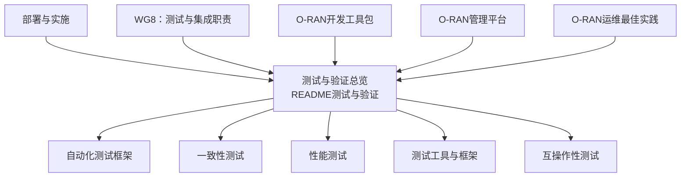
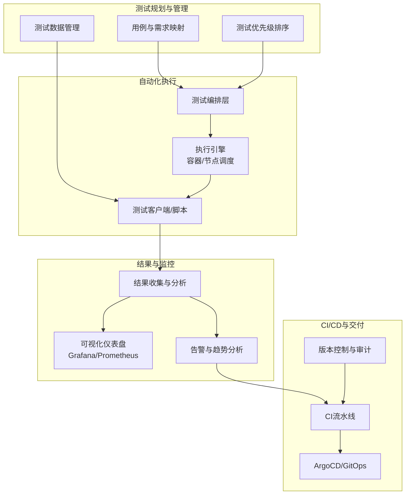
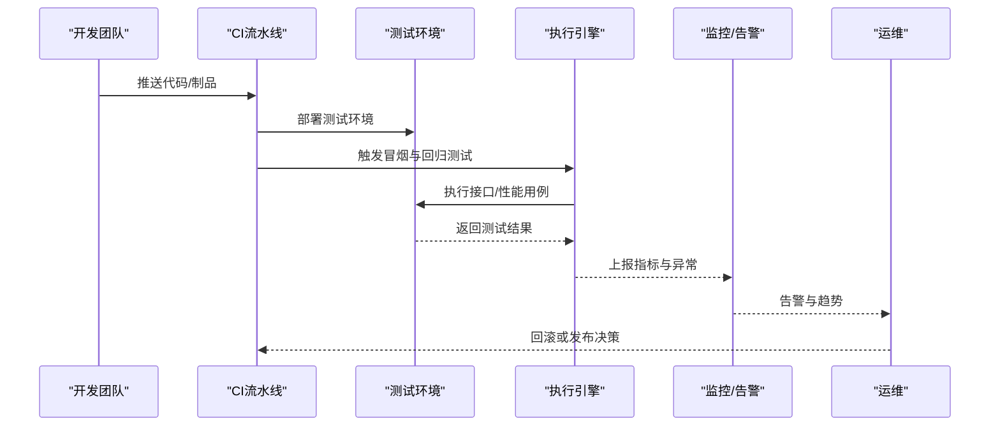
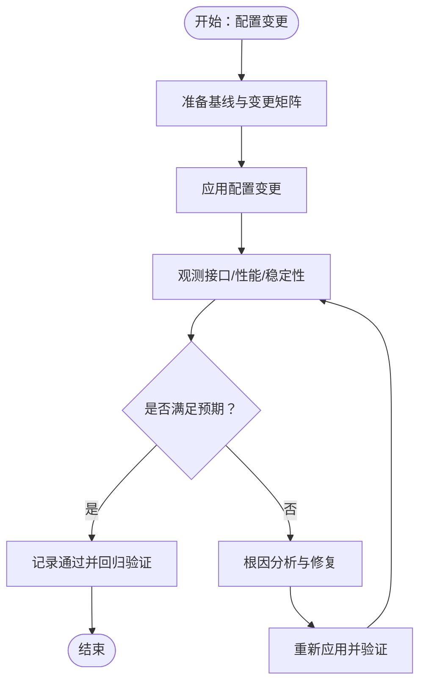
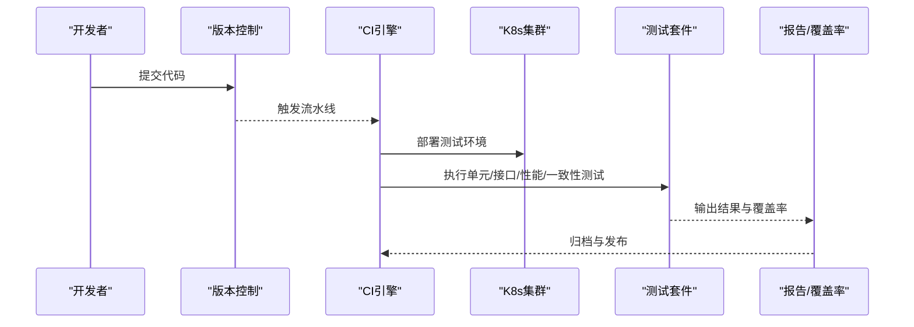
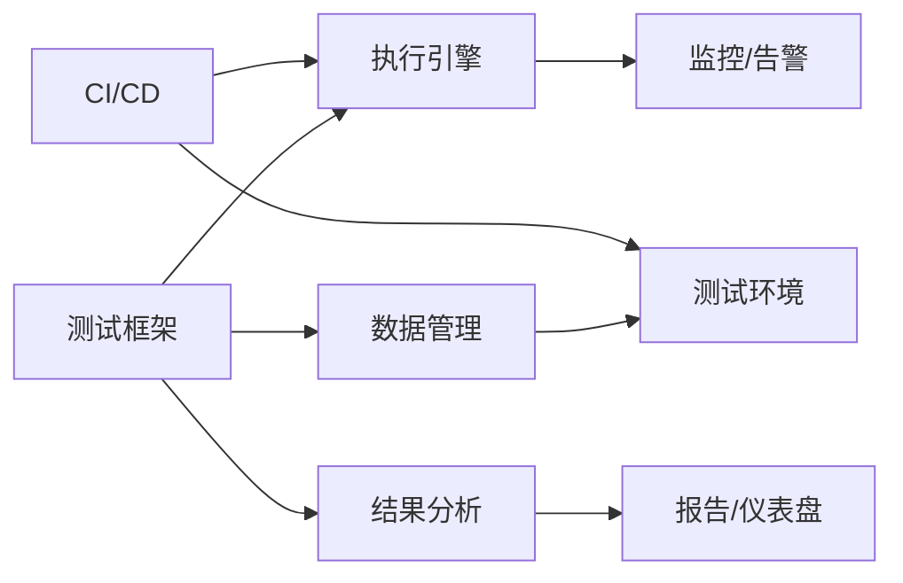

# 回归测试

<cite>
**本文引用的文件**
- [README（测试与验证）](file://13-testing-validation/readme.md)
- [自动化测试框架](file://13-testing-validation/automation-framework/test-automation-framework.md)
- [一致性测试](file://13-testing-validation/conformance-testing/o-ran-conformance-testing.md)
- [性能测试](file://13-testing-validation/performance-testing/performance-testing.md)
- [测试工具与框架](file://13-testing-validation/testing-tools/testing-tools-frameworks.md)
- [互操作性测试](file://13-testing-validation/interoperability/interoperability-testing.md)
- [部署与实施](file://08-deployment-implementation/readme.md)
- [WG8：测试与集成职责](file://06-working-groups/wg-detailed-responsibilities.md)
- [O-RAN开发工具包](file://22-tool-platforms/development-tools/o-ran-development-toolkit.md)
- [O-RAN管理平台](file://22-tool-platforms/management-platforms/o-ran-management-platforms-zh.md)
- [O-RAN运维最佳实践](file://30-best-practices/operations-practices/o-ran-operations-best-practices.md)
</cite>

## 目录
1. [引言](#引言)
2. [项目结构](#项目结构)
3. [核心组件](#核心组件)
4. [架构总览](#架构总览)
5. [详细组件分析](#详细组件分析)
6. [依赖关系分析](#依赖关系分析)
7. [性能考虑](#性能考虑)
8. [故障排查指南](#故障排查指南)
9. [结论](#结论)
10. [附录](#附录)

## 引言
本文件面向O-RAN系统的回归测试，围绕软件升级测试、配置变更测试与补丁安装测试三大场景，系统阐述测试策略、变更影响分析与验证流程；同时给出自动化测试套件设计原则、CI/CD流程实施要点与测试覆盖率监控方法，并提供测试用例管理、测试执行自动化与结果分析的实操建议。文档还涵盖回归测试优先级排序、测试资源优化与效率提升策略，以及版本控制集成、测试数据与测试环境管理方法，最后总结最佳实践、自动化框架设计与维护策略。

## 项目结构
本仓库中与回归测试直接相关的内容主要分布在“测试与验证”主题目录下，辅以“部署与实施”中的集成测试策略、“WG8测试与集成”工作组职责、“开发工具包”与“管理平台”中的CI/CD与Git工作流等。整体呈现“测试方法论—工具链—环境与流程—运维实践”的分层组织。

**图示来源**
- [README（测试与验证）](file://13-testing-validation/readme.md#L1-L103)
- [自动化测试框架](file://13-testing-validation/automation-framework/test-automation-framework.md#L1-L134)
- [一致性测试](file://13-testing-validation/conformance-testing/o-ran-conformance-testing.md#L1-L67)
- [性能测试](file://13-testing-validation/performance-testing/performance-testing.md#L1-L327)
- [测试工具与框架](file://13-testing-validation/testing-tools/testing-tools-frameworks.md#L1-L598)
- [互操作性测试](file://13-testing-validation/interoperability/interoperability-testing.md#L1-L231)
- [部署与实施](file://08-deployment-implementation/readme.md#L62-L92)
- [WG8：测试与集成职责](file://06-working-groups/wg-detailed-responsibilities.md#L367-L417)
- [O-RAN开发工具包](file://22-tool-platforms/development-tools/o-ran-development-toolkit.md#L64-L109)
- [O-RAN管理平台](file://22-tool-platforms/management-platforms/o-ran-management-platforms-zh.md#L534-L616)
- [O-RAN运维最佳实践](file://30-best-practices/operations-practices/o-ran-operations-best-practices.md#L164-L194)

**章节来源**
- [README（测试与验证）](file://13-testing-validation/readme.md#L1-L103)

## 核心组件
- 测试类型与策略
  - 软件升级测试：验证版本升级后的功能完整性、性能稳定性与兼容性，重点覆盖E2/F1/O-FH/A1/O1接口。
  - 配置变更测试：评估参数调整对端到端服务的影响，包括切片、QoS、负载均衡与容灾策略。
  - 补丁安装测试：验证热修复/补丁的安装流程、回滚能力与对业务面的影响。
- 自动化测试框架
  - 测试编排层、执行引擎、数据管理、结果分析与报告系统，支撑CI/CD集成与容器化测试环境。
- 测试工具与方法
  - 机器人框架、PyTest、JMeter、Wireshark、Prometheus/Grafana等，结合Kubernetes与Docker实现分布式执行与可视化监控。
- CI/CD与版本控制
  - Git工作流（feature/release/hotfix）、CI流水线（单元/接口/性能/一致性测试）、ArgoCD GitOps发布。

**章节来源**
- [自动化测试框架](file://13-testing-validation/automation-framework/test-automation-framework.md#L6-L21)
- [测试工具与框架](file://13-testing-validation/testing-tools/testing-tools-frameworks.md#L1-L598)
- [部署与实施](file://08-deployment-implementation/readme.md#L62-L92)
- [WG8：测试与集成职责](file://06-working-groups/wg-detailed-responsibilities.md#L367-L417)
- [O-RAN开发工具包](file://22-tool-platforms/development-tools/o-ran-development-toolkit.md#L64-L109)
- [O-RAN管理平台](file://22-tool-platforms/management-platforms/o-ran-management-platforms-zh.md#L534-L616)

## 架构总览
下图展示回归测试从需求到执行再到反馈的闭环：测试计划与用例管理驱动自动化执行引擎，通过容器化测试环境与监控告警获取结果，再进入CI/CD流水线完成持续验证与交付。

**图示来源**
- [自动化测试框架](file://13-testing-validation/automation-framework/test-automation-framework.md#L6-L21)
- [测试工具与框架](file://13-testing-validation/testing-tools/testing-tools-frameworks.md#L363-L418)
- [O-RAN管理平台](file://22-tool-platforms/management-platforms/o-ran-management-platforms-zh.md#L534-L616)
- [O-RAN开发工具包](file://22-tool-platforms/development-tools/o-ran-development-toolkit.md#L64-L109)

## 详细组件分析

### 软件升级测试
- 测试目标
  - 验证新版本在各接口（E2/F1/O-FH/A1/O1）上的连通性、消息处理与性能表现。
  - 评估升级路径的兼容性与回退能力，确保业务面SLA不降。
- 变更影响分析
  - 基于接口契约与协议栈，识别升级可能涉及的字段变更、行为差异与错误码变化。
  - 对关键路径（连接建立、订阅管理、指示消息、承载建立/修改、同步与压缩算法）进行重点覆盖。
- 验证流程
  - 升级前基线采集（吞吐、延迟、错误率、资源占用）。
  - 升级执行与灰度/蓝绿切换策略。
  - 升级后回归测试（冒烟+回归+性能回归）与对比分析。
  - 失败回滚与二次验证。
- 关键指标
  - 连接成功率、端到端时延、吞吐保持率、错误率、资源峰值与恢复时间。

**图示来源**
- [自动化测试框架](file://13-testing-validation/automation-framework/test-automation-framework.md#L79-L84)
- [测试工具与框架](file://13-testing-validation/testing-tools/testing-tools-frameworks.md#L363-L418)
- [性能测试](file://13-testing-validation/performance-testing/performance-testing.md#L244-L272)

**章节来源**
- [一致性测试](file://13-testing-validation/conformance-testing/o-ran-conformance-testing.md#L35-L53)
- [性能测试](file://13-testing-validation/performance-testing/performance-testing.md#L1-L327)
- [自动化测试框架](file://13-testing-validation/automation-framework/test-automation-framework.md#L79-L84)

### 配置变更测试
- 测试目标
  - 验证不同配置组合（切片、QoS、负载均衡、容灾策略）对端到端服务的影响。
- 变更影响分析
  - 采用“配置矩阵法”，按关键参数维度组合测试，识别边界条件与异常路径。
  - 关注跨域协调（多厂商/多域）与动态参数生效（在线/离线）。
- 验证流程
  - 建立配置基线与预期结果集。
  - 逐项注入变更并观测接口行为、性能与稳定性。
  - 回滚验证与回归确认。
- 关键指标
  - 业务面KPI（吞吐、时延、掉线率、切换成功率）、资源利用率与收敛时间。

**图示来源**
- [互操作性测试](file://13-testing-validation/interoperability/interoperability-testing.md#L151-L177)
- [性能测试](file://13-testing-validation/performance-testing/performance-testing.md#L219-L242)

**章节来源**
- [互操作性测试](file://13-testing-validation/interoperability/interoperability-testing.md#L151-L177)
- [部署与实施](file://08-deployment-implementation/readme.md#L62-L92)

### 补丁安装测试
- 测试目标
  - 验证补丁安装流程、回滚能力与业务面影响。
- 变更影响分析
  - 识别补丁涉及的模块与接口，评估热补丁与重启补丁的不同风险面。
- 验证流程
  - 安装前备份与基线采集。
  - 在隔离环境验证补丁有效性与兼容性。
  - 生产环境灰度安装与全量发布，伴随监控与回滚预案。
- 关键指标
  - 安装成功率、回滚时间、业务中断时长、补丁生效后稳定性。

**章节来源**
- [自动化测试框架](file://13-testing-validation/automation-framework/test-automation-framework.md#L79-L84)
- [O-RAN运维最佳实践](file://30-best-practices/operations-practices/o-ran-operations-best-practices.md#L164-L194)

### 自动化测试套件设计原则
- 模块化与可复用：将通用步骤封装为库，降低重复与维护成本。
- 可维护性：清晰命名、文档化与版本控制。
- 可扩展性：支持不同负载与并发场景。
- 可靠性：重试、超时与断言策略。
- 可追溯性：测试与需求/缺陷的映射关系。

**章节来源**
- [自动化测试框架](file://13-testing-validation/automation-framework/test-automation-framework.md#L70-L78)

### CI/CD流程实施
- 分层流水线
  - 单元测试：快速反馈。
  - 接口测试：依赖测试床/容器环境。
  - 性能测试：高负载与压力验证。
  - 一致性测试：标准符合性验证。
- 触发策略
  - 提交即触发冒烟，定时触发全面回归，重大变更触发性能回归。
- 报告与归档
  - 自动生成测试报告与覆盖率，保留历史结果用于趋势分析。

**图示来源**
- [测试工具与框架](file://13-testing-validation/testing-tools/testing-tools-frameworks.md#L363-L418)
- [一致性测试](file://13-testing-validation/conformance-testing/o-ran-conformance-testing-en.md#L517-L615)
- [O-RAN管理平台](file://22-tool-platforms/management-platforms/o-ran-management-platforms-zh.md#L534-L616)

**章节来源**
- [测试工具与框架](file://13-testing-validation/testing-tools/testing-tools-frameworks.md#L363-L418)
- [一致性测试](file://13-testing-validation/conformance-testing/o-ran-conformance-testing-en.md#L517-L615)

### 测试覆盖率监控
- 指标体系
  - 语句/分支/函数/行覆盖率，结合缺陷密度与回归失败率。
- 工具链
  - 静态分析（SonarQube、语言特定检查工具）、SAST/SCA、容器与基础设施扫描。
- 应用实践
  - 将覆盖率阈值纳入质量门禁，未达标禁止合并与发布。

**章节来源**
- [O-RAN开发工具包](file://22-tool-platforms/development-tools/o-ran-development-toolkit.md#L91-L109)
- [O-RAN运维最佳实践](file://30-best-practices/operations-practices/o-ran-operations-best-practices.md#L164-L194)

### 测试用例管理与执行自动化
- 用例管理
  - 基于标签（接口类型、测试类别、优先级）组织用例，支持筛选与分层执行。
- 执行自动化
  - 机器人框架与PyTest结合，Kubernetes/容器化执行，Prometheus/Grafana可视化。
- 结果分析
  - 失败率趋势、根因定位、覆盖率缺口与资源消耗分析。

**章节来源**
- [测试工具与框架](file://13-testing-validation/testing-tools/testing-tools-frameworks.md#L103-L256)
- [自动化测试框架](file://13-testing-validation/automation-framework/test-automation-framework.md#L107-L120)

### 回归测试优先级排序技术
- 依据
  - 影响面（关键接口/路径）、变更频率、历史缺陷密度、业务SLA。
- 方法
  - 分层策略：冒烟（高频）、回归（中频）、深度回归（低频但高风险）。
  - 动态调整：基于变更分析与实时监控反馈。

**章节来源**
- [自动化测试框架](file://13-testing-validation/automation-framework/test-automation-framework.md#L95-L105)

### 测试资源优化与效率提升
- 并行执行：多节点/多容器并行，智能调度与依赖协调。
- 环境复用：状态快照与清理策略，缩短准备时间。
- 数据治理：合成数据与脱敏，保障隐私与性能。
- 监控与告警：实时发现问题，减少手工巡检。

**章节来源**
- [自动化测试框架](file://13-testing-validation/automation-framework/test-automation-framework.md#L101-L105)
- [测试工具与框架](file://13-testing-validation/testing-tools/testing-tools-frameworks.md#L420-L479)

### 版本控制集成、测试数据与测试环境管理
- 版本控制
  - Git工作流（feature/release/hotfix），预提交/提交消息钩子，自动化测试触发与覆盖率报告。
- 测试数据
  - 合成数据生成、敏感数据脱敏、数据集版本化与清理。
- 测试环境
  - 容器化隔离、Kubernetes编排、网络拓扑与资源配额管理、并行执行与回收。

**章节来源**
- [O-RAN开发工具包](file://22-tool-platforms/development-tools/o-ran-development-toolkit.md#L64-L109)
- [自动化测试框架](file://13-testing-validation/automation-framework/test-automation-framework.md#L24-L38)
- [测试工具与框架](file://13-testing-validation/testing-tools/testing-tools-frameworks.md#L258-L357)

## 依赖关系分析
- 组件耦合
  - 测试编排与执行引擎解耦，便于扩展与替换。
  - 数据管理与监控独立，利于横向扩展。
- 外部依赖
  - CI/CD平台、容器编排、监控系统、协议分析工具与商用测试设备。
- 循环依赖
  - 通过清晰的接口契约与抽象层避免循环依赖。

**图示来源**
- [自动化测试框架](file://13-testing-validation/automation-framework/test-automation-framework.md#L6-L21)
- [测试工具与框架](file://13-testing-validation/testing-tools/testing-tools-frameworks.md#L363-L418)

**章节来源**
- [自动化测试框架](file://13-testing-validation/automation-framework/test-automation-framework.md#L6-L21)
- [测试工具与框架](file://13-testing-validation/testing-tools/testing-tools-frameworks.md#L363-L418)

## 性能考虑
- 性能回归检测：将性能基准纳入CI，异常自动告警。
- 资源优化：CPU/内存/存储/网络的容量规划与调优。
- 可扩展性：水平/垂直扩展策略与负载分布验证。

**章节来源**
- [性能测试](file://13-testing-validation/performance-testing/performance-testing.md#L244-L295)

## 故障排查指南
- 常见问题分类：接口故障、性能问题、可用性问题、配置问题、兼容性问题。
- 排查流程：问题定义、信息收集、假设验证、根因分析、解决与验证。
- 诊断工具：Wireshark/tcpdump、协议分析、日志分析、性能分析、网络监控。
- 标准作业程序：故障响应、升级、沟通与复盘流程。

**章节来源**
- [部署与实施](file://08-deployment-implementation/readme.md#L126-L156)

## 结论
通过系统化的回归测试策略、完善的自动化框架与CI/CD流程，O-RAN项目可在快速迭代中保持高质量与稳定性。结合变更影响分析、覆盖率监控与资源优化，可显著提升测试效率与交付质量。建议持续完善测试用例与环境管理，强化监控与告警，推动测试左移与DevSecOps落地。

## 附录
- 最佳实践清单
  - 测试左移与测试即代码。
  - 环境标准化与数据匿名化。
  - 可追溯性与质量度量。
- 自动化框架与维护
  - 框架模块化、可扩展与可维护。
  - 持续改进与知识沉淀。