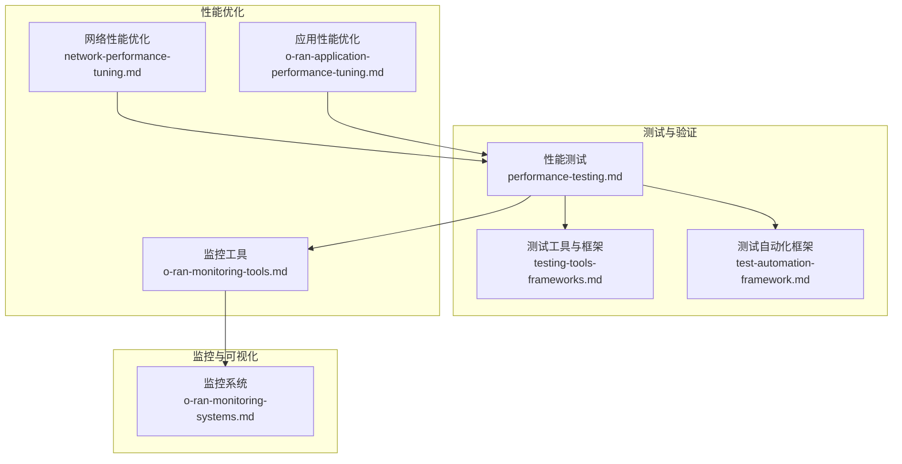
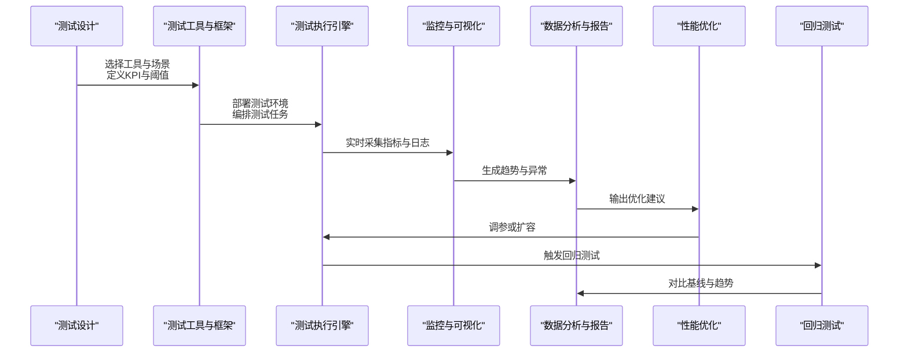
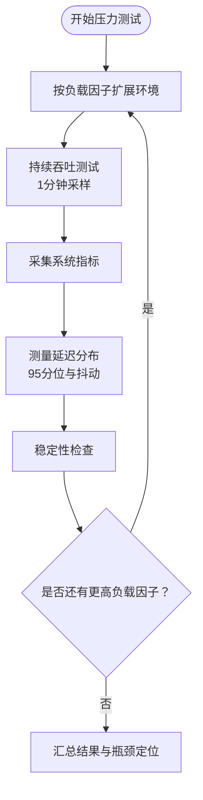
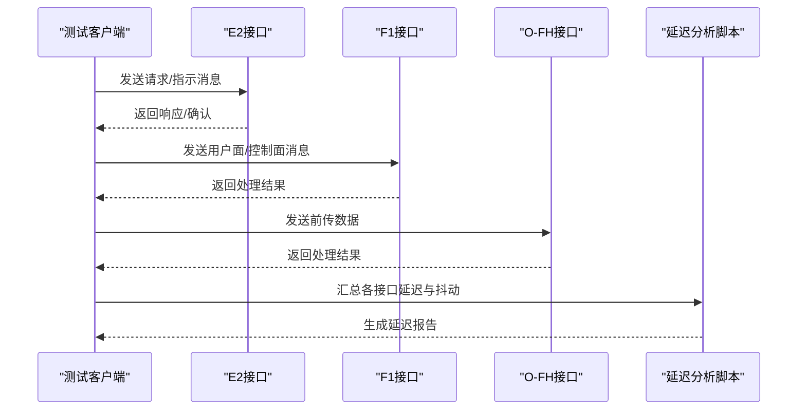
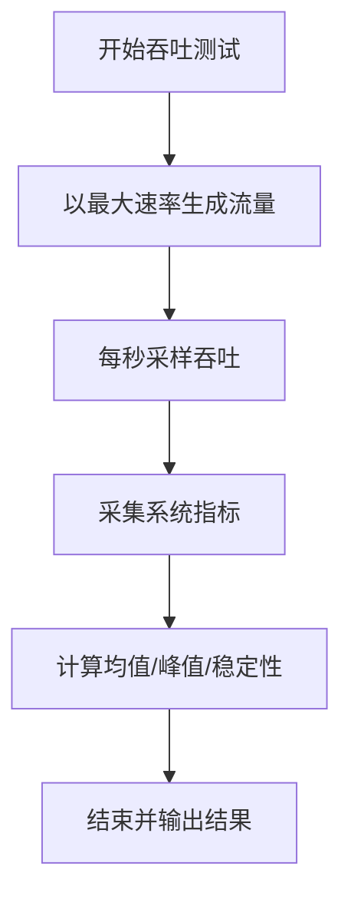
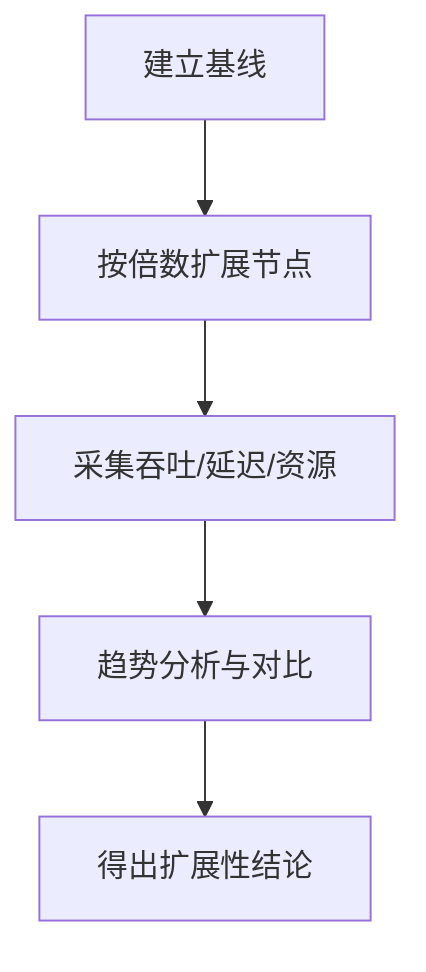
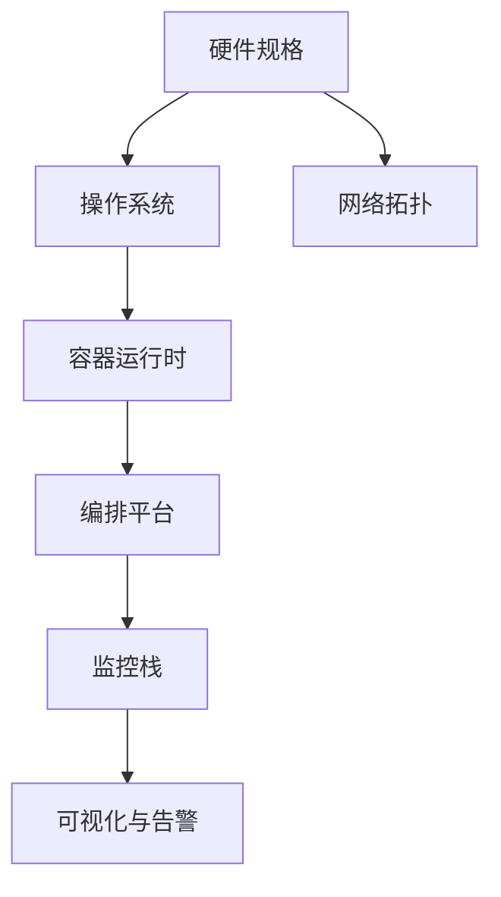
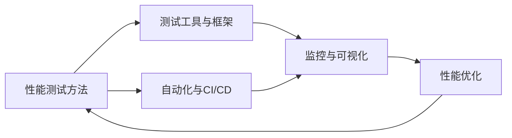

# 性能测试

<cite>
**本文引用的文件**
- [性能测试.md](file://13-testing-validation/performance-testing/performance-testing.md)
- [性能测试-中文.md](file://13-testing-validation/performance-testing/performance-testing-zh.md)
- [测试工具与框架.md](file://13-testing-validation/testing-tools/testing-tools-frameworks.md)
- [测试自动化框架.md](file://13-testing-validation/automation-framework/test-automation-framework.md)
- [网络性能优化.md](file://26-performance-optimization/network-optimization/network-performance-tuning.md)
- [应用性能优化.md](file://26-performance-optimization/application-tuning/o-ran-application-performance-tuning.md)
- [监控工具.md](file://26-performance-optimization/monitoring-tools/o-ran-monitoring-tools.md)
- [监控系统.md](file://22-tool-platforms/monitoring-systems/o-ran-monitoring-systems.md)
</cite>

## 目录
1. [简介](#简介)
2. [项目结构](#项目结构)
3. [核心组件](#核心组件)
4. [架构总览](#架构总览)
5. [详细组件分析](#详细组件分析)
6. [依赖关系分析](#依赖关系分析)
7. [性能考量](#性能考量)
8. [故障排查指南](#故障排查指南)
9. [结论](#结论)
10. [附录](#附录)

## 简介
本文件面向O-RAN系统的性能测试工作，围绕高并发用户场景设计、压力测试、延迟测试、吞吐量测试、稳定性测试、性能基准测试等主题，提供测试环境搭建规范、测试工具使用指南、测试数据分析方法，并深入分析性能瓶颈识别技术、优化建议与回归测试策略。同时给出自动化实现方案、测试报告生成标准与性能趋势分析方法，总结最佳实践与性能指标定义，帮助读者系统化开展O-RAN性能测试与优化。

## 项目结构
本仓库中与性能测试直接相关的内容主要分布在“测试与验证”“性能优化”“监控与可视化”三大板块，形成“测试方法—工具—监控—优化—报告”的完整闭环。

**图表来源**
- [性能测试.md](file://13-testing-validation/performance-testing/performance-testing.md#L1-L327)
- [测试工具与框架.md](file://13-testing-validation/testing-tools/testing-tools-frameworks.md#L1-L598)
- [测试自动化框架.md](file://13-testing-validation/automation-framework/test-automation-framework.md#L1-L134)
- [网络性能优化.md](file://26-performance-optimization/network-optimization/network-performance-tuning.md#L1-L98)
- [应用性能优化.md](file://26-performance-optimization/application-tuning/o-ran-application-performance-tuning.md#L1-L266)
- [监控工具.md](file://26-performance-optimization/monitoring-tools/o-ran-monitoring-tools.md#L1-L355)
- [监控系统.md](file://22-tool-platforms/monitoring-systems/o-ran-monitoring-systems.md#L1-L200)

**章节来源**
- [性能测试.md](file://13-testing-validation/performance-testing/performance-testing.md#L1-L327)
- [测试工具与框架.md](file://13-testing-validation/testing-tools/testing-tools-frameworks.md#L1-L598)
- [测试自动化框架.md](file://13-testing-validation/automation-framework/test-automation-framework.md#L1-L134)
- [网络性能优化.md](file://26-performance-optimization/network-optimization/network-performance-tuning.md#L1-L98)
- [应用性能优化.md](file://26-performance-optimization/application-tuning/o-ran-application-performance-tuning.md#L1-L266)
- [监控工具.md](file://26-performance-optimization/monitoring-tools/o-ran-monitoring-tools.md#L1-L355)
- [监控系统.md](file://22-tool-platforms/monitoring-systems/o-ran-monitoring-systems.md#L1-L200)

## 核心组件
- 性能测试框架与方法论：提供吞吐量、延迟、抖动、丢包、连接密度等测试类别，以及KPI目标与测试场景设计。
- 测试工具与框架：覆盖商业与开源工具，包括协议分析、容器化测试环境、CI/CD集成与自动化测试。
- 监控与可视化：提供Prometheus/Grafana观测体系、日志分析、告警与仪表板模板。
- 性能优化指南：从网络、系统、应用三层给出优化策略与参数调优建议。
- 自动化与持续测试：测试编排、并行执行、AI辅助测试选择与自愈能力。

**章节来源**
- [性能测试.md](file://13-testing-validation/performance-testing/performance-testing.md#L6-L57)
- [测试工具与框架.md](file://13-testing-validation/testing-tools/testing-tools-frameworks.md#L1-L598)
- [监控工具.md](file://26-performance-optimization/monitoring-tools/o-ran-monitoring-tools.md#L1-L355)
- [应用性能优化.md](file://26-performance-optimization/application-tuning/o-ran-application-performance-tuning.md#L1-L266)
- [测试自动化框架.md](file://13-testing-validation/automation-framework/test-automation-framework.md#L1-L134)

## 架构总览
下图展示O-RAN性能测试从“测试设计—工具链—执行—监控—分析—优化—回归”的闭环流程。

**图表来源**
- [性能测试.md](file://13-testing-validation/performance-testing/performance-testing.md#L140-L167)
- [测试工具与框架.md](file://13-testing-validation/testing-tools/testing-tools-frameworks.md#L361-L418)
- [监控工具.md](file://26-performance-optimization/monitoring-tools/o-ran-monitoring-tools.md#L216-L284)
- [应用性能优化.md](file://26-performance-optimization/application-tuning/o-ran-application-performance-tuning.md#L201-L264)
- [测试自动化框架.md](file://13-testing-validation/automation-framework/test-automation-framework.md#L79-L91)

## 详细组件分析

### 负载测试与压力测试
- 高并发用户场景设计：通过逐步提升负载因子，观察吞吐、延迟、抖动与资源占用的变化，识别系统拐点。
- 压力测试：在超过设计上限的负载下验证系统稳定性与恢复能力，记录崩溃点与恢复时间。
- 关键流程：
  - 环境扩展与缩放
  - 持续吞吐测试与系统指标采集
  - 延迟分布与抖动统计
  - 系统稳定性检查与恢复等待

**图表来源**
- [性能测试.md](file://13-testing-validation/performance-testing/performance-testing.md#L113-L137)
- [性能测试.md](file://13-testing-validation/performance-testing/performance-testing.md#L73-L95)
- [性能测试.md](file://13-testing-validation/performance-testing/performance-testing.md#L97-L111)

**章节来源**
- [性能测试.md](file://13-testing-validation/performance-testing/performance-testing.md#L113-L137)
- [性能测试.md](file://13-testing-validation/performance-testing/performance-testing.md#L73-L95)
- [性能测试.md](file://13-testing-validation/performance-testing/performance-testing.md#L97-L111)

### 延迟测试与端到端延迟测量
- 方法：针对E2/F1/O-FH等接口进行端到端往返时延测量，结合不同数据包尺寸与配置选项，输出最小/最大/平均/95分位延迟与抖动。
- 工具：iperf3、ping、专用脚本与分析工具。
- 结果：生成延迟热力图与趋势报告，识别路径瓶颈与抖动来源。

**图表来源**
- [性能测试.md](file://13-testing-validation/performance-testing/performance-testing.md#L197-L217)
- [性能测试.md](file://13-testing-validation/performance-testing/performance-testing.md#L246-L265)

**章节来源**
- [性能测试.md](file://13-testing-validation/performance-testing/performance-testing.md#L197-L217)
- [性能测试.md](file://13-testing-validation/performance-testing/performance-testing.md#L246-L265)

### 吞吐量测试与数据传输速率
- 方法：在最大速率下持续生成流量，记录平均/峰值吞吐与稳定性；多流并行测试评估链路聚合能力。
- 指标：吞吐量(Mbps/Gbps)、丢包率、资源占用。
- 环节：流量生成、系统指标采集、结果统计与稳定性评估。

**图表来源**
- [性能测试.md](file://13-testing-validation/performance-testing/performance-testing.md#L73-L95)

**章节来源**
- [性能测试.md](file://13-testing-validation/performance-testing/performance-testing.md#L73-L95)

### 稳定性测试与长时间运行
- 方法：在峰值或接近峰值负载下进行长时间运行测试，观察系统资源与性能指标的漂移与退化。
- 关注点：CPU/内存/磁盘/网络I/O的长期趋势，错误率与延迟的累积效应。
- 建议：分阶段加压、定期快照、异常自动告警与自动恢复。

**章节来源**
- [性能测试.md](file://13-testing-validation/performance-testing/performance-testing.md#L1-L327)

### 性能基准测试与可扩展性验证
- 基准测试：建立基线，覆盖不同接口与场景，形成可重复的对比标准。
- 可扩展性：验证水平/垂直扩展对吞吐与延迟的影响，识别线性/次线性扩展阶段与瓶颈。

**图表来源**
- [性能测试.md](file://13-testing-validation/performance-testing/performance-testing.md#L219-L242)

**章节来源**
- [性能测试.md](file://13-testing-validation/performance-testing/performance-testing.md#L219-L242)

### 测试环境搭建规范
- 硬件：流量生成器与O-RAN组件服务器的CPU/内存/网络/存储配置。
- 软件：操作系统、容器运行时、编排平台、监控栈。
- 网络拓扑：流量生成网络、控制面/用户面/管理网络划分。

**图表来源**
- [性能测试.md](file://13-testing-validation/performance-testing/performance-testing.md#L140-L167)

**章节来源**
- [性能测试.md](file://13-testing-validation/performance-testing/performance-testing.md#L140-L167)

### 测试工具使用指南
- 商业工具：Spirent、Keysight、Anritsu等提供O-RAN接口一致性与性能测试能力。
- 开源工具：Wireshark插件、Robot Framework、PyTest、Docker/K8s测试环境、Prometheus/Grafana。
- CI/CD集成：GitHub Actions、GitLab CI等流水线中集成单元/接口/性能测试与报告发布。

**章节来源**
- [测试工具与框架.md](file://13-testing-validation/testing-tools/testing-tools-frameworks.md#L1-L598)
- [测试自动化框架.md](file://13-testing-validation/automation-framework/test-automation-framework.md#L1-L134)

### 测试数据分析方法
- 指标采集：PromQL查询关键指标，如吞吐、延迟、资源利用率、错误率。
- 可视化：Grafana仪表板、热力图、趋势图、异常检测。
- 报告：执行摘要、详细结果、对比分析、优化建议、风险评估。

**章节来源**
- [性能测试.md](file://13-testing-validation/performance-testing/performance-testing.md#L244-L273)
- [监控工具.md](file://26-performance-optimization/monitoring-tools/o-ran-monitoring-tools.md#L216-L284)
- [监控系统.md](file://22-tool-platforms/monitoring-systems/o-ran-monitoring-systems.md#L80-L131)

### 性能瓶颈识别与优化建议
- 网络层：频谱效率、干扰管理、数据压缩、QoS参数、负载均衡。
- 系统层：CPU亲和性、内存管理、存储I/O、内核参数、容器资源限制。
- 应用层：算法效率、缓存策略、数据库优化、API性能、并行处理。

**章节来源**
- [网络性能优化.md](file://26-performance-optimization/network-optimization/network-performance-tuning.md#L1-L98)
- [应用性能优化.md](file://26-performance-optimization/application-tuning/o-ran-application-performance-tuning.md#L1-L266)

### 性能回归测试与自动化
- 自动化策略：CI/CD流水线中触发回归测试，对比基线，生成趋势与报告。
- 并行执行：分布式测试节点、智能调度、结果合并。
- 自愈与AI：基于变更智能选择测试、预测失败、自适应测试生成。

**章节来源**
- [测试自动化框架.md](file://13-testing-validation/automation-framework/test-automation-framework.md#L79-L106)
- [测试工具与框架.md](file://13-testing-validation/testing-tools/testing-tools-frameworks.md#L361-L418)

## 依赖关系分析
- 测试方法依赖工具与框架：测试场景与脚本依赖工具链与容器/K8s编排。
- 监控与可视化依赖指标采集：Prometheus抓取指标，Grafana渲染仪表板。
- 优化建议依赖监控反馈：通过指标与日志定位瓶颈，指导参数调优与架构改进。
- 自动化依赖CI/CD：流水线触发测试、收集结果、生成报告。

**图表来源**
- [性能测试.md](file://13-testing-validation/performance-testing/performance-testing.md#L1-L327)
- [测试工具与框架.md](file://13-testing-validation/testing-tools/testing-tools-frameworks.md#L1-L598)
- [监控工具.md](file://26-performance-optimization/monitoring-tools/o-ran-monitoring-tools.md#L1-L355)
- [测试自动化框架.md](file://13-testing-validation/automation-framework/test-automation-framework.md#L1-L134)

**章节来源**
- [性能测试.md](file://13-testing-validation/performance-testing/performance-testing.md#L1-L327)
- [测试工具与框架.md](file://13-testing-validation/testing-tools/testing-tools-frameworks.md#L1-L598)
- [监控工具.md](file://26-performance-optimization/monitoring-tools/o-ran-monitoring-tools.md#L1-L355)
- [测试自动化框架.md](file://13-testing-validation/automation-framework/test-automation-framework.md#L1-L134)

## 性能考量
- 指标定义：吞吐量、延迟、抖动、丢包率、连接密度、资源利用率、错误率、可用性与可靠性。
- 基准目标：参考运营商级目标与行业竞争指标，作为验收与回归的依据。
- 趋势分析：长期趋势识别、容量规划、弹性与恢复能力评估。

**章节来源**
- [性能测试.md](file://13-testing-validation/performance-testing/performance-testing.md#L29-L57)
- [性能测试.md](file://13-testing-validation/performance-testing/performance-testing.md#L313-L327)

## 故障排查指南
- 告警与通知：基于Prometheus Alertmanager、Grafana、Sensu、Zabbix等的多通道告警与自动处置。
- 日志分析：集中式日志系统（Filebeat/Fluentd/Logstash、Loki、Elasticsearch/OpenSearch）与可视化平台（Kibana、Grafana）。
- 仪表板：O-RAN专用仪表板模板，涵盖网络性能、RAN组件健康、RIC性能等。

**章节来源**
- [监控工具.md](file://26-performance-optimization/monitoring-tools/o-ran-monitoring-tools.md#L146-L214)
- [监控工具.md](file://26-performance-optimization/monitoring-tools/o-ran-monitoring-tools.md#L216-L284)
- [监控系统.md](file://22-tool-platforms/monitoring-systems/o-ran-monitoring-systems.md#L80-L131)

## 结论
通过系统化的性能测试方法、完善的工具链与监控体系、针对性的优化策略与自动化回归机制，O-RAN系统可在复杂场景下实现稳定、高效、可扩展的性能表现。建议以KPI为导向，以基线为基准，以趋势为指引，持续迭代优化，确保满足运营商级SLA与业务需求。

## 附录
- 最佳实践清单
  - 明确KPI与阈值，建立基线与回归标准
  - 使用容器/K8s隔离测试环境，统一配置管理
  - 在CI/CD中集成自动化测试与报告发布
  - 建立实时监控与告警，实现异常快速定位
  - 采用多维度指标与可视化，支撑容量规划与优化决策
  - 持续进行稳定性与压力测试，保障上线质量