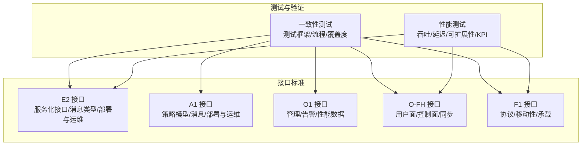
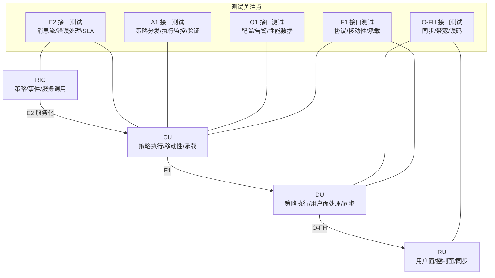
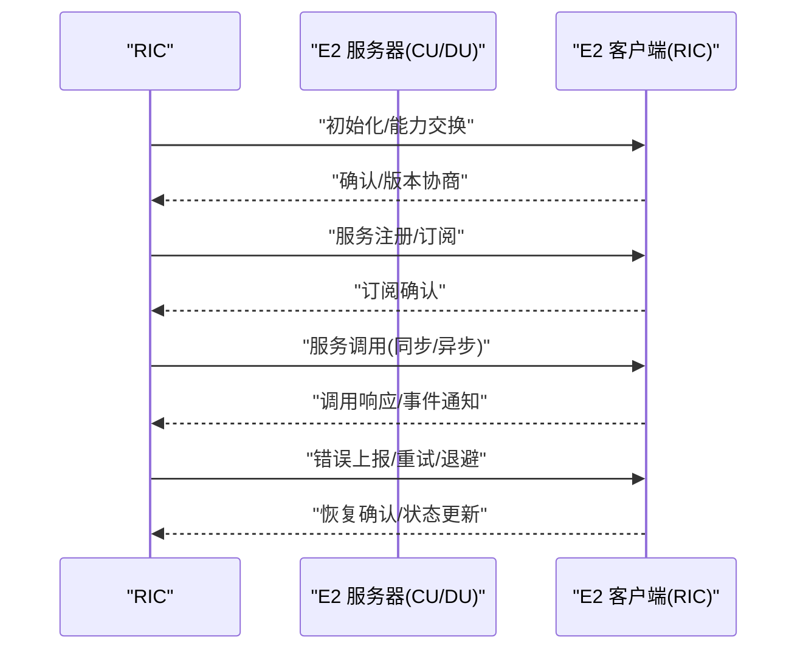
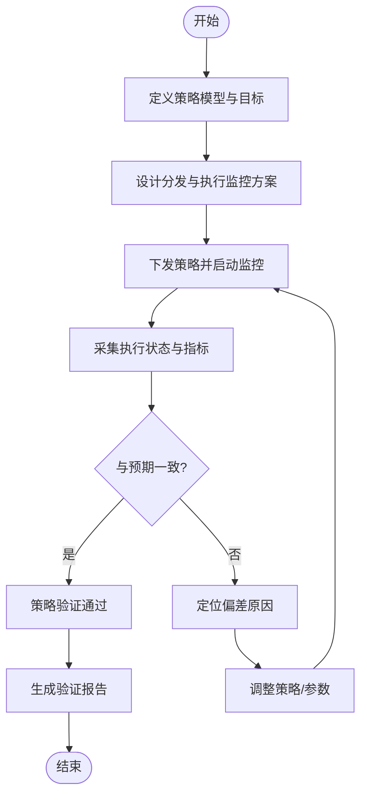
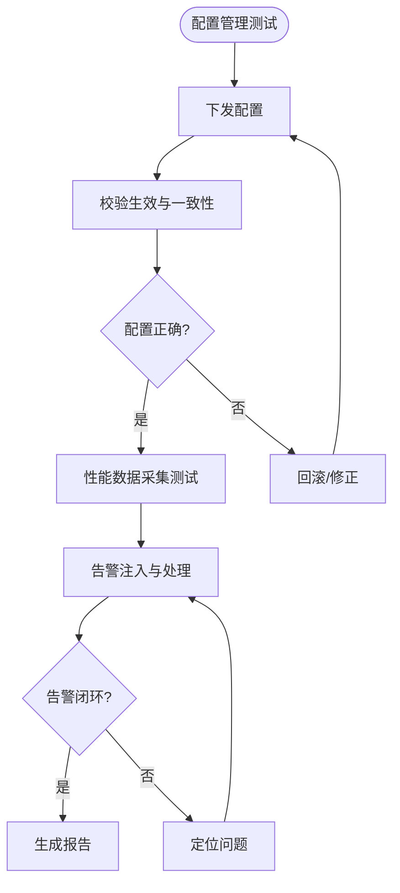
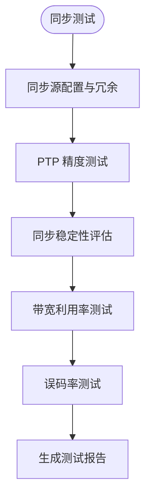
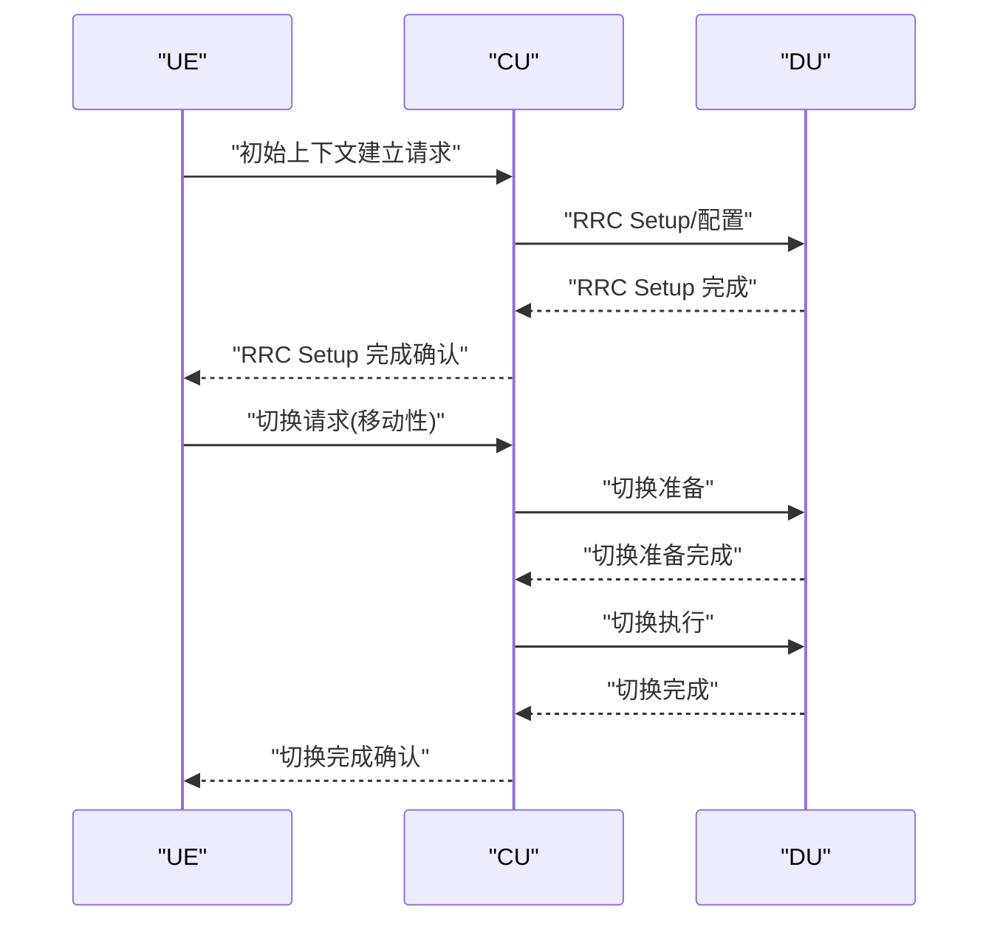
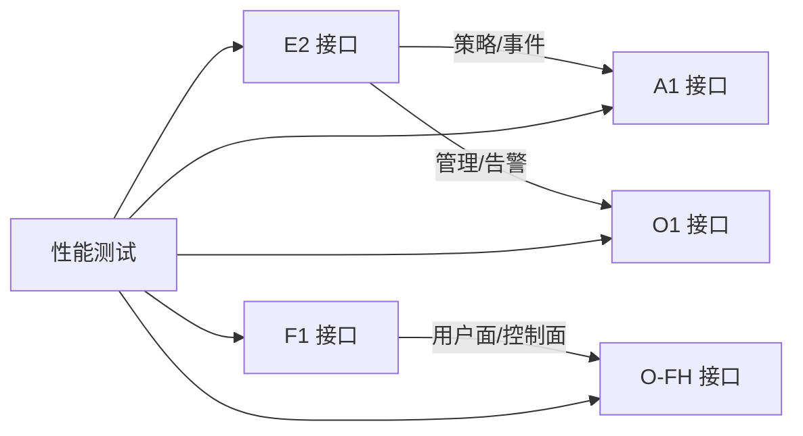

# 接口测试

<cite>
**本文引用的文件**
- [E2 接口](file://03-interface-standards/e2-interface.md)
- [O-FH 接口](file://03-interface-standards/o-fh-interface.md)
- [A1 接口](file://03-interface-standards/a1-interface.md)
- [O1 接口](file://03-interface-standards/o1-interface.md)
- [F1 接口](file://03-interface-standards/f1-interface.md)
- [性能测试](file://13-testing-validation/performance-testing/performance-testing-zh.md)
- [一致性测试](file://13-testing-validation/conformance-testing/o-ran-conformance-testing.md)
</cite>

## 目录
1. [简介](#简介)
2. [项目结构](#项目结构)
3. [核心组件](#核心组件)
4. [架构总览](#架构总览)
5. [详细组件分析](#详细组件分析)
6. [依赖关系分析](#依赖关系分析)
7. [性能考虑](#性能考虑)
8. [故障排查指南](#故障排查指南)
9. [结论](#结论)
10. [附录](#附录)

## 简介
本文件面向 O-RAN 接口测试，围绕 E2、A1、O1、O-FH、F1 等关键接口，系统化给出测试指导：消息流设计、错误处理机制、性能验证方法；策略下发与验证、管理与告警、前传同步与带宽利用率、CU-DU 协议与移动性/承载管理流程；并提供测试用例模板、自动化测试方案与测试报告分析方法，辅以最佳实践与常见问题解决方案。

## 项目结构
本仓库按主题域组织 O-RAN 文档，接口测试相关内容主要分布在“接口标准”与“测试与验证”两大板块：
- 接口标准：E2、A1、O1、O-FH、F1 的协议与流程说明
- 测试与验证：性能测试、一致性测试、互操作测试、测试工具与框架

章节来源
- file://03-interface-standards/e2-interface.md#L1-L337
- file://03-interface-standards/o-fh-interface.md#L1-L397
- file://13-testing-validation/performance-testing/performance-testing-zh.md#L1-L327
- file://13-testing-validation/conformance-testing/o-ran-conformance-testing.md#L1-L67

## 核心组件
- E2 接口：基于 SCTP/STREAMS 的服务化接口，支持服务发现、调用、事件通知与订阅管理，强调低延迟与可靠性。
- A1 接口：策略模型与消息流程，关注策略分发、执行监控与策略验证。
- O1 接口：管理面接口，涵盖配置管理、告警处理与性能数据采集。
- O-FH 接口：前传接口，支持用户面 IQ 数据、控制面 RU 管理与高精度同步。
- F1 接口：CU-DU 通信协议，涉及移动性程序与承载管理。

章节来源
- file://03-interface-standards/e2-interface.md#L1-L337
- file://03-interface-standards/a1-interface.md#L1-L200
- file://03-interface-standards/o1-interface.md#L1-L200
- file://03-interface-standards/o-fh-interface.md#L1-L397
- file://03-interface-standards/f1-interface.md#L1-L200

## 架构总览
下图展示测试视角下的接口交互与关键验证点：

## 详细组件分析

### E2 接口测试
- 消息流设计
  - 初始化/注册/调用/事件/订阅/错误消息的完整序列验证
  - 多流传输与优先级配置对时延与吞吐的影响
- 错误处理机制
  - 连接断连、消息解析失败、服务不可用、订阅异常等场景的恢复与退避
- 性能验证方法
  - 基于 SCTP 的吞吐/延迟/抖动测试，结合批量处理与缓存策略
  - Near-RT RIC 的端到端时延与丢包率验证

章节来源
- file://03-interface-standards/e2-interface.md#L1-L337
- file://13-testing-validation/performance-testing/performance-testing-zh.md#L1-L327

### A1 接口测试
- 策略分发流程
  - 策略模型定义、策略下发、执行状态上报与确认
- 执行监控方法
  - 周期性状态采样、阈值告警、异常检测
- 策略验证标准
  - 期望输出与实际输出对比、收敛时间、抖动容忍度

章节来源
- file://03-interface-standards/a1-interface.md#L1-L200
- file://13-testing-validation/conformance-testing/o-ran-conformance-testing.md#L1-L67

### O1 接口测试
- 配置管理
  - 设备/端口/协议参数的增删改查与一致性校验
- 告警处理
  - 告警产生、传播、关联分析与处置闭环
- 性能数据采集测试
  - 指标采集周期、精度与完整性验证

章节来源
- file://03-interface-standards/o1-interface.md#L1-L200
- file://13-testing-validation/conformance-testing/o-ran-conformance-testing.md#L1-L67

### O-FH 接口测试
- 同步精度
  - PTP/SyncE 同步源部署、精度与稳定性测试
- 带宽利用率
  - IQ 数据压缩、链路聚合与 QoS 对带宽占用的影响
- 误码率测试
  - 光纤链路/无线链路质量评估与误码检测

章节来源
- file://03-interface-standards/o-fh-interface.md#L1-L397
- file://13-testing-validation/performance-testing/performance-testing-zh.md#L1-L327

### F1 接口测试
- CU-DU 通信协议
  - 消息类型、序列号、重传与确认机制
- 移动性程序
  - 切换准备/执行/完成流程与回退机制
- 承载管理
  - QoS/DRB/SRB 的建立、修改与释放

章节来源
- file://03-interface-standards/f1-interface.md#L1-L200
- file://13-testing-validation/performance-testing/performance-testing-zh.md#L1-L327

## 依赖关系分析
- E2 与 A1/O1 的耦合体现在策略与事件的双向流转
- O-FH 与 F1 的耦合体现在 DU 的用户面/控制面与同步能力
- 性能测试对各接口的端到端指标具有统一验证价值

## 性能考虑
- 网络性能：吞吐、延迟、抖动、丢包、连接密度
- 资源性能：CPU/内存/存储/网络带宽/功耗
- 可扩展性：水平/垂直扩展、负载分布、容量规划
- 关键 KPI：峰值吞吐、用户面/控制面延迟、切换成功率、会话/事务速率、容器启动/虚拟机配置时间、自动扩展响应、负载均衡器延迟、存储 IOPS

章节来源
- file://13-testing-validation/performance-testing/performance-testing-zh.md#L1-L327

## 故障排查指南
- E2 接口
  - 常见故障：连接断连、消息失败、服务不可用、性能劣化
  - 定位手段：告警分析、日志分析、信令追踪、测试验证
  - 恢复策略：重连/配置调整/服务重启/升级修复
- O-FH 接口
  - 常见故障：连接不稳定、同步丢失、性能下降、硬件故障
  - 定位手段：告警/日志/连通性测试/同步测试
  - 恢复策略：修复链路/同步源/硬件/回滚配置
- A1/O1 接口
  - 常见问题：策略未生效、告警不闭环、指标缺失
  - 处理建议：检查策略模型/下发路径/监控链路/告警关联

章节来源
- file://03-interface-standards/e2-interface.md#L170-L240
- file://03-interface-standards/o-fh-interface.md#L247-L327
- file://13-testing-validation/conformance-testing/o-ran-conformance-testing.md#L35-L67

## 结论
O-RAN 接口测试需以接口标准为依据，结合性能测试与一致性测试框架，形成覆盖消息流、错误处理、性能与可扩展性的完整测试体系。针对 E2/A1/O1/O-FH/F1 各接口，应分别设计专项测试方案，并通过自动化与监控体系保障测试效率与质量。

## 附录

### 测试用例设计模板
- 通用模板字段
  - 用例编号、标题、前置条件、测试步骤、预期结果、实际结果、通过判定、优先级、标签
- E2 接口
  - 场景：服务发现/调用/事件/订阅/错误恢复
  - 指标：时延、吞吐、错误率、重试次数
- A1 接口
  - 场景：策略下发/执行监控/验证
  - 指标：收敛时间、抖动、一致性
- O1 接口
  - 场景：配置下发/告警闭环/指标采集
  - 指标：生效时间、告警准确率、采集完整性
- O-FH 接口
  - 场景：同步精度/带宽利用率/误码率
  - 指标：时间/频率同步误差、带宽占用、BER
- F1 接口
  - 场景：RRC 建立/切换/承载管理
  - 指标：建立/切换时延、成功率、重建次数

### 自动化测试实现方案
- 测试框架
  - 一致性测试：测试用例管理、自动执行引擎、结果分析与回归机制
  - 性能测试：持续吞吐/延迟/可扩展性测试，系统指标采集与稳定性评估
- 监控与分析
  - Prometheus/Grafana 指标采集与可视化
  - 自动化告警与趋势分析，容量规划与合规性报告

章节来源
- file://13-testing-validation/conformance-testing/o-ran-conformance-testing.md#L1-L67
- file://13-testing-validation/performance-testing/performance-testing-zh.md#L1-L327