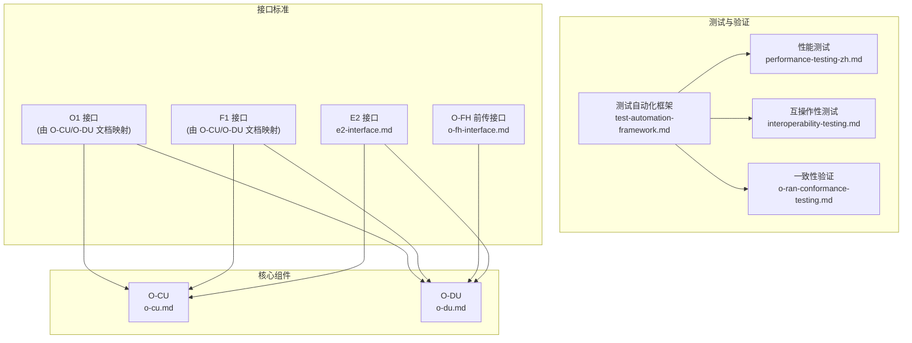
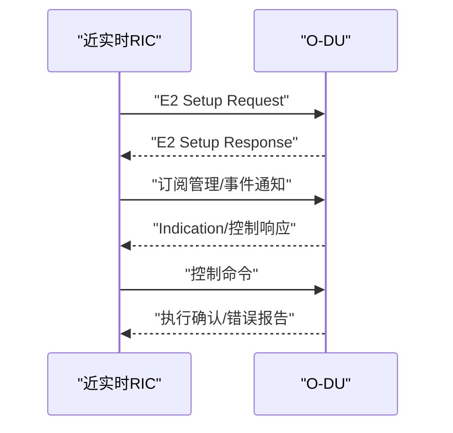
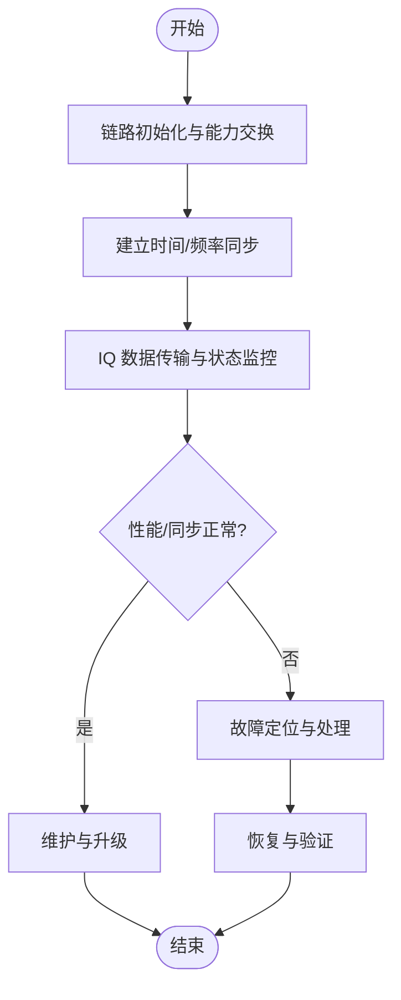
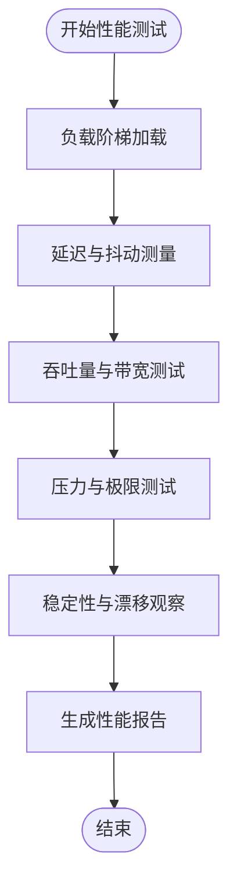
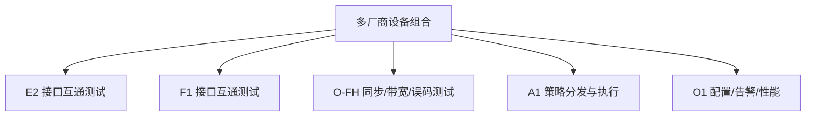
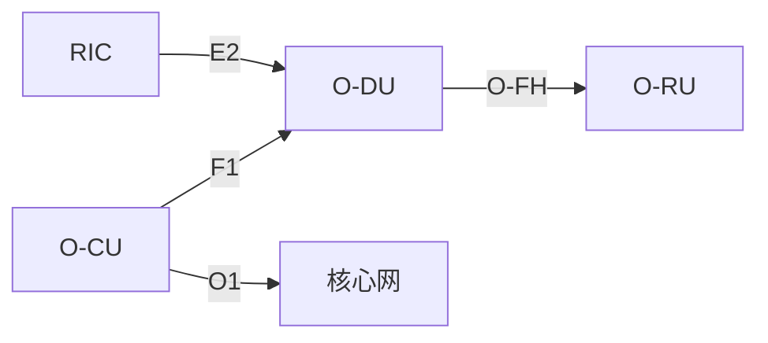

# 集成测试策略

<cite>
**本文引用的文件**
- [O-RAN 性能测试](file://13-testing-validation/performance-testing/performance-testing-zh.md)
- [O-RAN 测试一致性验证](file://13-testing-validation/conformance-testing/o-ran-conformance-testing.md)
- [O-RAN 互操作性测试](file://13-testing-validation/interoperability/interoperability-testing.md)
- [O-RAN 测试自动化框架](file://13-testing-validation/automation-framework/test-automation-framework.md)
- [E2 接口](file://03-interface-standards/e2-interface.md)
- [O-FH 前传接口](file://03-interface-standards/o-fh-interface.md)
- [O-CU 集中式单元](file://02-core-components/o-cu.md)
- [O-DU 分布式单元](file://02-core-components/o-du.md)
</cite>

## 目录
1. [简介](#简介)
2. [项目结构](#项目结构)
3. [核心组件](#核心组件)
4. [架构总览](#架构总览)
5. [详细组件分析](#详细组件分析)
6. [依赖关系分析](#依赖关系分析)
7. [性能考虑](#性能考虑)
8. [故障排查指南](#故障排查指南)
9. [结论](#结论)
10. [附录](#附录)

## 简介
本文件面向 O-RAN 集成测试，围绕端到端业务与多厂商协同，系统化构建测试策略与实施路径。重点覆盖以下方面：
- 接口测试：E2 接口功能与错误处理、A1 接口策略分发与执行监控、O1 接口配置/告警/性能数据、O-FH 前传接口同步/带宽/误码率、F1 接口 CU-DU 通信与移动性程序
- 功能测试：网络元素功能验证、端到端业务测试、移动性测试（手握转换/重选）、承载管理与 QoS 验证
- 性能测试：负载/压力/延迟/吞吐量/稳定性测试
- 互操作性测试：多厂商兼容性、接口协议一致性、跨厂商功能测试与 O-RAN Plugfest 参与策略
- 回归测试：软件升级/配置变更/补丁安装、自动化测试套件与 CI/CD 流程

## 项目结构
本仓库按主题域组织 O-RAN 文档，与测试策略直接相关的内容主要分布在“测试与验证”“接口标准”“核心组件”三大板块。测试策略需以接口标准为依据，以核心组件为载体，以测试框架为手段，以性能/互操作/一致性为度量。



**图表来源**
- [O-RAN 性能测试](file://13-testing-validation/performance-testing/performance-testing-zh.md#L1-L327)
- [O-RAN 测试一致性验证](file://13-testing-validation/conformance-testing/o-ran-conformance-testing.md#L1-L67)
- [O-RAN 互操作性测试](file://13-testing-validation/interoperability/interoperability-testing.md#L1-L231)
- [O-RAN 测试自动化框架](file://13-testing-validation/automation-framework/test-automation-framework.md#L1-L134)
- [E2 接口](file://03-interface-standards/e2-interface.md#L1-L337)
- [O-FH 前传接口](file://03-interface-standards/o-fh-interface.md#L1-L397)
- [O-CU 集中式单元](file://02-core-components/o-cu.md#L1-L419)
- [O-DU 分布式单元](file://02-core-components/o-du.md#L1-L415)

**章节来源**
- [O-RAN 性能测试](file://13-testing-validation/performance-testing/performance-testing-zh.md#L1-L327)
- [O-RAN 测试一致性验证](file://13-testing-validation/conformance-testing/o-ran-conformance-testing.md#L1-L67)
- [O-RAN 互操作性测试](file://13-testing-validation/interoperability/interoperability-testing.md#L1-L231)
- [O-RAN 测试自动化框架](file://13-testing-validation/automation-framework/test-automation-framework.md#L1-L134)
- [E2 接口](file://03-interface-standards/e2-interface.md#L1-L337)
- [O-FH 前传接口](file://03-interface-standards/o-fh-interface.md#L1-L397)
- [O-CU 集中式单元](file://02-core-components/o-cu.md#L1-L419)
- [O-DU 分布式单元](file://02-core-components/o-du.md#L1-L415)

## 核心组件
- O-RAN 接口与协议
  - E2 接口：基于 SCTP/STREAMS 的服务化接口，支持服务发现/调用/事件通知/订阅管理，强调 Near-RT RIC 的低延迟与可靠性
  - O-FH 接口：连接 O-DU 与 O-RU，支持 eCPRI/RoE 协议，关注带宽、延迟、同步精度与误码率
  - F1 接口：CU-DU 控制面/用户面分离，承载 RRC/RLC/MAC/PDCP/SDAP 等层功能
  - O1 接口：面向运维与管理，涵盖配置、告警、性能数据采集与下发
- 核心网元
  - O-CU：控制面(CU-CP)/用户面(CU-UP)分离，承担 RRC/NG/F1 控制面、PDCP/SDAP 用户面处理
  - O-DU：物理层/部分 MAC 层处理，承担下行编码/调制、上行解调/均衡、随机接入、HARQ、调度等，对实时性要求高

上述组件共同构成端到端测试的对象与边界，测试策略需以接口协议与组件能力为依据，设计覆盖功能、性能、互操作与一致性的测试场景。

**章节来源**
- [E2 接口](file://03-interface-standards/e2-interface.md#L1-L337)
- [O-FH 前传接口](file://03-interface-standards/o-fh-interface.md#L1-L397)
- [O-CU 集中式单元](file://02-core-components/o-cu.md#L1-L419)
- [O-DU 分布式单元](file://02-core-components/o-du.md#L1-L415)

## 架构总览
下图展示 O-RAN 集成测试视角下的端到端路径与关键接口交互，以及测试框架与被测对象的关系。

```mermaid
graph TB
subgraph "测试框架"
TF["测试自动化框架<br/>AT"]
PERF["性能测试<br/>PT"]
CONS["一致性验证<br/>CT"]
IO["互操作性测试<br/>IT"]
end
subgraph "核心网元"
RIC["RIC<br/>E2"]
CU["O-CU<br/>CU-CP/CU-UP"]
DU["O-DU"]
RU["O-RU"]
CORE["核心网"]
end
TF --> PERF
TF --> CONS
TF --> IO
RIC <- --> CU
CU < --> DU
DU < --> RU
CU --> CORE
PERF --> RIC
PERF --> CU
PERF --> DU
PERF --> RU
CONS --> RIC
CONS --> CU
CONS --> DU
CONS --> RU
IT --> RIC
IT --> CU
IT --> DU
IT --> RU
```

**图表来源**
- [O-RAN 测试自动化框架](file://13-testing-validation/automation-framework/test-automation-framework.md#L1-L134)
- [O-RAN 性能测试](file://13-testing-validation/performance-testing/performance-testing-zh.md#L1-L327)
- [O-RAN 测试一致性验证](file://13-testing-validation/conformance-testing/o-ran-conformance-testing.md#L1-L67)
- [O-RAN 互操作性测试](file://13-testing-validation/interoperability/interoperability-testing.md#L1-L231)
- [E2 接口](file://03-interface-standards/e2-interface.md#L1-L337)
- [O-FH 前传接口](file://03-interface-standards/o-fh-interface.md#L1-L397)
- [O-CU 集中式单元](file://02-core-components/o-cu.md#L1-L419)
- [O-DU 分布式单元](file://02-core-components/o-du.md#L1-L415)

## 详细组件分析

### E2 接口测试策略
- 测试目标
  - 连接建立/维持/恢复：E2 Setup/Teardown、订阅管理、事件通知、控制命令执行
  - 时延与可靠性：Near-RT RIC 延迟 <10ms；消息吞吐与错误率
  - 跨厂商一致性：不同厂商 RIC 与 DU 的消息格式、时序与错误处理一致性
- 关键流程
  - 初始化与服务发现：E2 Setup Request/Response、服务注册/发现
  - 订阅与事件：订阅创建/修改/删除、Indication 消息处理
  - 控制与错误：控制命令下发与确认、异常与恢复
- 错误处理
  - 连接断连、消息解析失败、服务不可用、超时重试与退避
  - 告警与日志：异常计数、错误码统计、根因定位
- 性能与监控
  - 延迟分布（P95/P99）、吞吐量、抖动、丢包率
  - 与监控系统联动，设置阈值告警与异常检测



**图表来源**
- [E2 接口](file://03-interface-standards/e2-interface.md#L79-L89)

**章节来源**
- [E2 接口](file://03-interface-standards/e2-interface.md#L1-L337)

### A1 接口策略测试策略
- 测试目标
  - 策略分发：策略下发、版本管理、生效与回滚
  - 执行监控：策略执行状态、指标上报、异常告警
  - 跨厂商一致性：不同厂商 RIC 与 DU 的策略模型与执行语义一致
- 关键流程
  - 策略生命周期：创建/更新/删除/查询
  - 执行反馈：执行进度、结果、失败原因
  - 监控与审计：策略执行日志、KPI 指标、合规性检查
- 错误处理
  - 策略格式错误、执行失败、超时、版本冲突
  - 自动化重试与降级策略

**章节来源**
- [O-RAN 互操作性测试](file://13-testing-validation/interoperability/interoperability-testing.md#L1-L231)

### O1 接口管理测试策略
- 测试目标
  - 配置：参数下发、校验、回读一致性
  - 告警：告警上报、分类、去重、收敛
  - 性能数据：指标采集、聚合、上报、存储
- 关键流程
  - 配置下发与验证：字段校验、生效时间、回滚
  - 告警处理：产生/清除/升级/抑制
  - 性能采集：周期、粒度、阈值触发
- 错误处理
  - 配置冲突、参数越界、上报失败、存储异常

**章节来源**
- [O-CU 集中式单元](file://02-core-components/o-cu.md#L1-L419)
- [O-DU 分布式单元](file://02-core-components/o-du.md#L1-L415)

### O-FH 前传接口测试策略
- 测试目标
  - 同步：PTP/SyncE 精度、切换、保护
  - 带宽：峰值/持续吞吐、QoS 保障
  - 误码率：链路质量、抖动、丢包
- 关键流程
  - 初始化：链路协商、协议版本、能力交换
  - 正常运行：同步建立、IQ 数据传输、状态监控、故障处理
  - 维护：软件升级、诊断测试、配置更新
- 错误处理
  - 连接断开、同步丢失、性能劣化、硬件故障
- 性能与监控
  - 延迟分布、误码率、抖动、带宽利用率
  - 与监控系统联动，设置阈值与异常检测



**图表来源**
- [O-FH 前传接口](file://03-interface-standards/o-fh-interface.md#L98-L116)

**章节来源**
- [O-FH 前传接口](file://03-interface-standards/o-fh-interface.md#L1-L397)

### F1 接口测试策略
- 测试目标
  - CU-DU 通信：F1-C/F1-U 建立、维护、释放
  - 移动性程序：Xn 接口切换、上下文迁移、QoS 保持
- 关键流程
  - F1 Setup：RRC 消息、系统信息、UE 上下文
  - 移动性：Handover、Xn 切换、数据转发与 QoS 保障
  - 资源管理：RB 分配、调度、HARQ、功率控制
- 错误处理
  - 接口断连、上下文缺失、切换失败、QoS 不达

**章节来源**
- [O-CU 集中式单元](file://02-core-components/o-cu.md#L101-L121)
- [O-DU 分布式单元](file://02-core-components/o-du.md#L68-L86)

### 功能测试：网络元素与端到端业务
- 网络元素功能验证
  - O-CU：RRC/NG/F1 控制面、PDCP/SDAP 用户面、E1 接口
  - O-DU：物理层/部分 MAC 层、F1/O-FH/E2 接口
- 端到端业务测试
  - 注册/附着、会话建立、业务转发、QoS 保障
- 移动性测试
  - 手握转换：Xn 切换、上下文迁移、数据面连续性
  - 重选：小区重选、切换判决、失败恢复
- 承载与 QoS
  - EPS 承载/5QI/QFI 映射、GBR/MBR、优先级与抢占

**章节来源**
- [O-CU 集中式单元](file://02-core-components/o-cu.md#L1-L419)
- [O-DU 分布式单元](file://02-core-components/o-du.md#L1-L415)

### 性能测试：负载/压力/延迟/吞吐量/稳定性
- 负载测试：逐步提升并发连接/吞吐量，观测延迟、抖动、丢包
- 压力测试：超过设计上限，验证系统保护与恢复能力
- 延迟测试：端到端、控制面/用户面、不同数据包尺寸
- 吞吐量测试：峰值/持续吞吐、带宽利用率
- 稳定性测试：长时间运行，监控资源与性能漂移



**图表来源**
- [O-RAN 性能测试](file://13-testing-validation/performance-testing/performance-testing-zh.md#L60-L138)

**章节来源**
- [O-RAN 性能测试](file://13-testing-validation/performance-testing/performance-testing-zh.md#L1-L327)

### 互操作性测试：多厂商/协议一致性/跨厂商功能
- 多厂商兼容性：不同厂商 RIC/DU/CU/RU 的互通与一致性
- 接口协议一致性：E2/F1/O-FH/A1/O1 的消息格式与时序
- 跨厂商功能测试：端到端业务、移动性、策略执行
- Plugfest 参与：官方测试活动、认证流程、持续合规



**图表来源**
- [O-RAN 互操作性测试](file://13-testing-validation/interoperability/interoperability-testing.md#L28-L178)

**章节来源**
- [O-RAN 互操作性测试](file://13-testing-validation/interoperability/interoperability-testing.md#L1-L231)

### 回归测试：升级/变更/补丁/自动化/CI/CD
- 软件升级：版本升级前后功能/性能对比
- 配置变更：参数变更影响评估与回归
- 补丁安装：安全补丁与功能补丁的回归验证
- 自动化测试套件：接口/功能/性能/互操作自动化
- CI/CD：流水线触发测试、覆盖率与报告、告警与阻断

**章节来源**
- [O-RAN 测试自动化框架](file://13-testing-validation/automation-framework/test-automation-framework.md#L1-L134)
- [O-RAN 测试一致性验证](file://13-testing-validation/conformance-testing/o-ran-conformance-testing.md#L1-L67)

## 依赖关系分析
- 接口依赖
  - E2 依赖 RIC 与 DU 的服务模型与协议栈
  - F1 依赖 CU 与 DU 的控制面/用户面协议
  - O-FH 依赖 DU/RU 的 eCPRI/RoE 与同步协议
  - O1 依赖 O-CU/O-DU 的管理接口
- 组件耦合
  - O-CU 与 O-DU 通过 F1/O-FH/E2 紧密耦合
  - RIC 与 DU 通过 E2 管理协同
- 外部依赖
  - 同步：PTP/SyncE
  - 网络：QoS、带宽、延迟
  - 监控：Prometheus/Grafana



**图表来源**
- [E2 接口](file://03-interface-standards/e2-interface.md#L74-L78)
- [O-FH 前传接口](file://03-interface-standards/o-fh-interface.md#L98-L116)
- [O-CU 集中式单元](file://02-core-components/o-cu.md#L101-L121)
- [O-DU 分布式单元](file://02-core-components/o-du.md#L68-L86)

**章节来源**
- [E2 接口](file://03-interface-standards/e2-interface.md#L1-L337)
- [O-FH 前传接口](file://03-interface-standards/o-fh-interface.md#L1-L397)
- [O-CU 集中式单元](file://02-core-components/o-cu.md#L1-L419)
- [O-DU 分布式单元](file://02-core-components/o-du.md#L1-L415)

## 性能考虑
- 网络层面：QoS、带宽、延迟、抖动、丢包、同步精度
- 系统层面：CPU/内存/存储/网络 I/O 利用率、容器/虚拟化资源限制
- 应用层面：算法效率、缓存策略、数据库优化、API 响应时间
- 可扩展性：水平/垂直扩展、负载分布、容量规划、增长建模

**章节来源**
- [O-RAN 性能测试](file://13-testing-validation/performance-testing/performance-testing-zh.md#L1-L327)

## 故障排查指南
- E2 接口
  - 连接/消息/服务/性能故障定位与恢复
  - 告警分级、关联分析、自动化处理
- O-FH 接口
  - 同步丢失/性能劣化/硬件故障的定位与恢复
  - 带宽/延迟/误码率监控与阈值告警
- O-CU/O-DU
  - 信令/接口/性能/资源/配置类故障的定位与恢复
  - 监控体系、自动化运维、容量管理

**章节来源**
- [E2 接口](file://03-interface-standards/e2-interface.md#L148-L260)
- [O-FH 前传接口](file://03-interface-standards/o-fh-interface.md#L199-L288)
- [O-CU 集中式单元](file://02-core-components/o-cu.md#L197-L264)
- [O-DU 分布式单元](file://02-core-components/o-du.md#L224-L288)

## 结论
本策略以接口标准与核心组件能力为依据，结合测试自动化框架与一致性/互操作/性能测试方法，形成覆盖端到端业务、多厂商协同与持续交付的集成测试体系。建议在实际落地中：
- 基于接口规范细化测试用例矩阵
- 建立自动化测试流水线与监控告警
- 持续开展性能回归与互操作验证
- 参与 Plugfest 与认证流程，确保合规与兼容

## 附录
- 测试环境与工具
  - 测试自动化框架：Jenkins/GitLab CI/GitHub Actions、Docker/Kubernetes、Prometheus/Grafana
  - 性能测试：iperf3、容器网络指标、延迟分析脚本
  - 互操作测试：Spirent/Landslide、Keysight/ixia、开源 srsRAN/OAI
- 关键指标与目标
  - 峰值吞吐、端到端/控制面延迟、切换成功率、连接建立时间、资源利用率、可用性/可靠性

**章节来源**
- [O-RAN 测试自动化框架](file://13-testing-validation/automation-framework/test-automation-framework.md#L1-L134)
- [O-RAN 性能测试](file://13-testing-validation/performance-testing/performance-testing-zh.md#L1-L327)
- [O-RAN 互操作性测试](file://13-testing-validation/interoperability/interoperability-testing.md#L213-L231)