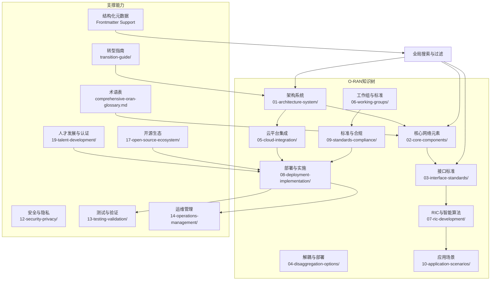
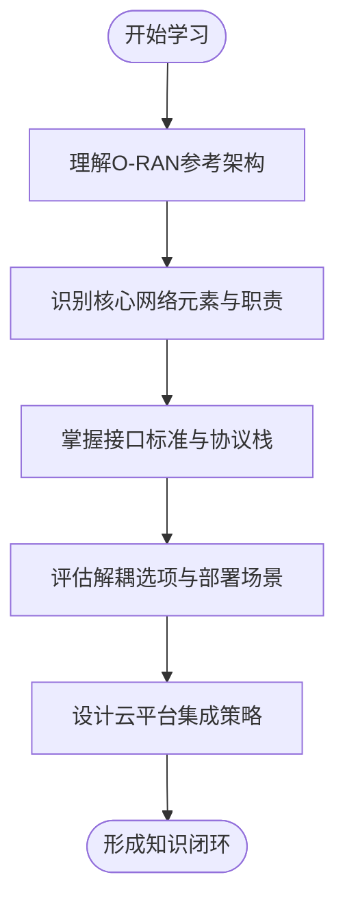
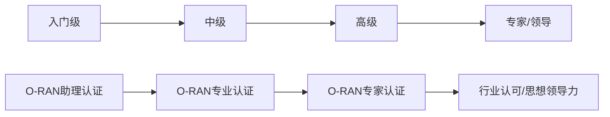
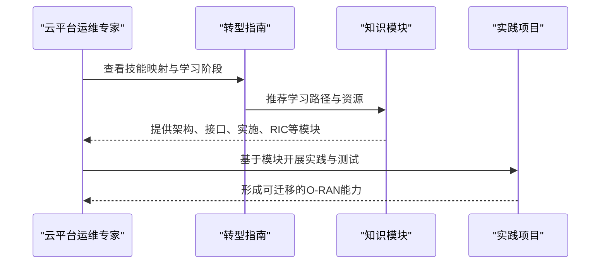
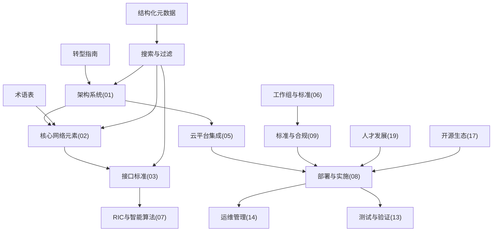

# 项目概述

<cite>
**本文引用的文件**
- [README.md](file://README.md)
- [README-zh.md](file://README-zh.md)
- [transition-guide/readme.md](file://transition-guide/readme.md)
- [transition-guide/readme-zh.md](file://transition-guide/readme-zh.md)
- [comprehensive-oran-glossary.md](file://comprehensive-oran-glossary.md)
- [19-talent-development/readme.md](file://19-talent-development/readme.md)
- [19-talent-development/learning-paths/o-ran-learning-roadmaps-zh.md](file://19-talent-development/learning-paths/o-ran-learning-roadmaps-zh.md)
- [19-talent-development/career-development/o-ran-career-pathways-zh.md](file://19-talent-development/career-development/o-ran-career-pathways-zh.md)
- [01-architecture-system/readme.md](file://01-architecture-system/readme.md)
- [17-open-source-ecosystem/readme.md](file://17-open-source-ecosystem/readme.md)
- [17-open-source-ecosystem/community-resources/open-source-community-guide-zh.md](file://17-open-source-ecosystem/community-resources/open-source-community-guide-zh.md)
- [scripts/add-frontmatter.py](file://scripts/add-frontmatter.py)
</cite>

## 更新摘要
**所做更改**
- 更新了文档的frontmatter元数据结构，支持更好的搜索性和过滤功能
- 增强了多语言支持和版本管理
- 改进了关键词分类和类别系统
- 优化了文档的可发现性和组织性

## 目录
1. [引言](#引言)
2. [项目结构](#项目结构)
3. [核心组件](#核心组件)
4. [架构总览](#架构总览)
5. [详细组件分析](#详细组件分析)
6. [依赖关系分析](#依赖关系分析)
7. [性能考量](#性能考量)
8. [故障排查指南](#故障排查指南)
9. [结论](#结论)
10. [附录](#附录)

## 引言
本项目是面向云平台运维专业人士的"O-RAN专家知识库"，旨在帮助具备云原生、虚拟化、容器编排、监控观测、安全与自动化等技能的专业人士，系统性地从云平台能力迁移到O-RAN专业知识，掌握从架构到实现、从接口协议到RIC应用开发、从标准合规到行业场景落地的完整知识体系。项目采用模块化结构与渐进式学习路径，既适合初学者循序渐进入门，也为有经验的开发者提供深度技术内容与实战参考。

**最新更新** 项目已添加结构化frontmatter元数据支持，包括标题、描述、分类、语言、版本、最后更新时间及关键词等元数据字段，显著提升了文档的搜索性、可发现性和过滤功能。

## 项目结构
项目以"知识模块化 + 学习路径 + 职业发展"三位一体的方式组织，覆盖O-RAN从基础架构到前沿应用的全栈知识，并配套术语表、过渡指南、开源生态与贡献指南等辅助资源。

```mermaid
graph TB
A["知识库总览<br/>README.md"] --> B["架构与系统基础<br/>01-architecture-system/"]
A --> C["核心网络元素<br/>02-core-components/"]
A --> D["接口标准体系<br/>03-interface-standards/"]
A --> E["解耦与部署分析<br/>04-disaggregation-options/"]
A --> F["云平台集成<br/>05-cloud-integration/"]
A --> G["工作组与标准<br/>06-working-groups/"]
A --> H["RIC与智能算法<br/>07-ric-development/"]
A --> I["部署与实施<br/>08-deployment-implementation/"]
A --> J["标准与合规<br/>09-standards-compliance/"]
A --> K["应用场景<br/>10-application-scenarios/"]
A --> L["学术论文集合<br/>11-academic-papers/"]
A --> M["安全与隐私<br/>12-security-privacy/"]
A --> N["测试与验证<br/>13-testing-validation/"]
A --> O["运维管理<br/>14-operations-management/"]
A --> P["未来与创新<br/>15-future-development/"]
A --> Q["行业解决方案<br/>16-industry-solutions/"]
A --> R["开源生态与贡献<br/>17-open-source-ecosystem/"]
A --> S["成本效益分析<br/>18-cost-benefit-analysis/"]
A --> T["人才发展与认证<br/>19-talent-development/"]
A --> U["案例研究<br/>21-case-studies/"]
A --> V["工具与平台<br/>22-tool-platforms/"]
A --> W["国际部署与跨文化<br/>23-international-deployment/"]
A --> X["可持续发展<br/>24-sustainable-development/"]
A --> Y["法律与监管<br/>25-legal-regulations/"]
A --> Z["性能优化<br/>26-performance-optimization/"]
A --> AA["故障排查与诊断<br/>27-troubleshooting-diagnosis/"]
A --> AB["监控与告警<br/>28-monitoring-alerting/"]
A --> AC["安全威胁与防护<br/>29-security-threats/"]
A --> AD["最佳实践<br/>30-best-practices/"]
A --> AE["资源与术语表<br/>resources/ 与 comprehensive-oran-glossary.md"]
A --> AF["转型指南<br/>transition-guide/"]
```



**图表来源**
- [README.md:1-514](file://README.md#L1-L514)
- [README-zh.md:1-392](file://README-zh.md#L1-L392)

章节来源
- [README.md:1-514](file://README.md#L1-L514)
- [README-zh.md:1-392](file://README-zh.md#L1-L392)

## 核心组件
- **云平台到O-RAN的知识映射与技能迁移**：将云基础设施、虚拟化、容器编排、监控观测、安全、自动化、DevOps、可扩展性等技能映射到O-RAN的部署架构、CU/DU虚拟化、服务管理、运维观测、安全框架、自动化与CI/CD、容量管理等知识域。
- **学习路径与阶段性目标**：围绕O-RAN基础、技术架构与接口、实施部署、高级技术（RIC/xApps）、标准与行业实践等六个阶段，提供可执行的学习活动与资源清单。
- **术语表与多语言支持**：提供中英俄三语术语表，覆盖200+核心概念，便于跨语言协作与知识沉淀。
- **人才发展与认证**：明确不同角色（网络工程师、RIC开发者、安全专家、云基础设施专家、无线优化专家）的发展路径、认证体系与能力画像。
- **结构化元数据支持**：所有文档均包含标准化的frontmatter元数据，支持标题、描述、分类、语言、版本、最后更新时间及关键词等字段，显著提升搜索性和过滤功能。

章节来源
- [README.md:320-431](file://README.md#L320-L431)
- [transition-guide/readme.md:1-126](file://transition-guide/readme.md#L1-L126)
- [transition-guide/readme-zh.md:1-126](file://transition-guide/readme-zh.md#L1-L126)
- [comprehensive-oran-glossary.md:1-200](file://comprehensive-oran-glossary.md#L1-L200)
- [19-talent-development/readme.md:1-71](file://19-talent-development/readme.md#L1-L71)

## 架构总览
O-RAN专家知识库采用"模块化知识树 + 渐进式学习路径"的设计理念，强调以下关键点：
- 以O-RAN参考架构为主线，串联核心网络元素（O-RU/O-DU/O-CU/O-RIC/SMO）与接口标准（E2/A1/O1/O-FH/F1/OAM）。
- 将云平台技能与O-RAN实施相结合，突出弹性扩展、云原生架构、容器编排、微服务、自动化部署与监控集成。
- 以工作流为导向，从"理解—分析—设计—实现—验证—运维—优化—创新"的闭环路径推进学习与实践。
- **新增** 通过结构化frontmatter元数据增强文档的组织性和可发现性，支持按分类、语言、版本等多维度筛选。



**图表来源**
- [README.md:1-514](file://README.md#L1-L514)
- [README-zh.md:1-392](file://README-zh.md#L1-L392)
- [scripts/add-frontmatter.py:1-187](file://scripts/add-frontmatter.py#L1-L187)

章节来源
- [README.md:1-514](file://README.md#L1-L514)
- [README-zh.md:1-392](file://README-zh.md#L1-L392)

## 详细组件分析

### 1) 架构与系统基础（01-architecture-system）
- **目标**：建立O-RAN参考架构的系统性认知，理解从传统RAN到O-RAN的演进、分层架构、功能分布、O-Cloud与弹性扩展。
- **关键内容**：架构演进、分层架构（服务层/控制层/管理层）、功能分布、O-Cloud架构、弹性扩展；核心网络元素（O-RU/O-DU/O-CU/CU-CP/CU-UP/O-RIC/SMO/O-CUCP/O-CUUP）；接口标准（F1/O-FH/E2/A1/O1/O2/OAM）；解耦选项（功能分割/前传分割/部署场景/性能影响/成本效益）；O-RAN联盟工作组；云平台集成（云原生、容器编排、微服务、自动化部署、监控集成）。
- **学习产出**：能够绘制O-RAN架构图、识别各组件职责、评估不同解耦方案、设计云平台集成策略。



**图表来源**
- [01-architecture-system/readme.md:1-200](file://01-architecture-system/readme.md#L1-L200)

章节来源
- [01-architecture-system/readme.md:1-200](file://01-architecture-system/readme.md#L1-L200)

### 2) 人才发展与学习路径（19-talent-development）
- **角色导向学习路径**：网络工程师路径、RIC开发者路径、专业化轨道（安全专家、云基础设施、无线优化）。
- **阶段化能力发展**：入门级（理论+实践）、中级（配置+排障）、高级（优化+领导力）。
- **认证体系**：O-RAN联盟认证、设备厂商认证、云服务提供商认证、国际认证、运营商内部认证、开源项目认证。
- **职业发展**：技术专家路线、管理路线、创业路线，配套软技能与商业敏感度培养。



**图表来源**
- [19-talent-development/learning-paths/o-ran-learning-roadmaps-zh.md:1-297](file://19-talent-development/learning-paths/o-ran-learning-roadmaps-zh.md#L1-L297)
- [19-talent-development/career-development/o-ran-career-pathways-zh.md:1-268](file://19-talent-development/career-development/o-ran-career-pathways-zh.md#L1-L268)
- [19-talent-development/readme.md:1-71](file://19-talent-development/readme.md#L1-L71)

章节来源
- [19-talent-development/learning-paths/o-ran-learning-roadmaps-zh.md:1-297](file://19-talent-development/learning-paths/o-ran-learning-roadmaps-zh.md#L1-L297)
- [19-talent-development/career-development/o-ran-career-pathways-zh.md:1-268](file://19-talent-development/career-development/o-ran-career-pathways-zh.md#L1-L268)
- [19-talent-development/readme.md:1-71](file://19-talent-development/readme.md#L1-L71)

### 3) 云平台到O-RAN专家的转型路径（transition-guide）
- **知识映射**：将云基础设施映射到O-RAN部署、虚拟化映射到CU/DU虚拟化、容器编排映射到O-RAN服务管理、监控观测映射到O-RAN运维、安全映射到O-RAN安全、自动化映射到RIC与xApps、DevOps映射到O-RAN CI/CD、可扩展性映射到RAN容量管理。
- **新技能补强**：RAN基础、O-RAN架构、接口协议（E2/A1/O1/O-FH）、RIC应用开发、RAN优化、多厂商集成。
- **学习阶段**：O-RAN基础（1-2周）、技术架构与接口（2-3周）、O-RAN实施（3-4周）、高级技术（4-6周）、标准与行业实践（2-3周）。



**图表来源**
- [transition-guide/readme.md:1-126](file://transition-guide/readme.md#L1-L126)
- [transition-guide/readme-zh.md:1-126](file://transition-guide/readme-zh.md#L1-L126)

章节来源
- [transition-guide/readme.md:1-126](file://transition-guide/readme.md#L1-L126)
- [transition-guide/readme-zh.md:1-126](file://transition-guide/readme-zh.md#L1-L126)

### 4) 术语表与多语言支持（comprehensive-oran-glossary）
- **覆盖200+核心概念**，提供中英俄三语对照，按字母排序便于检索。
- **适用场景**：跨语言协作、文档撰写、知识沉淀、教学与培训。
- **结构化元数据**：每个术语条目都包含标准化的元数据，支持按语言、分类等维度进行筛选和搜索。

章节来源
- [comprehensive-oran-glossary.md:1-200](file://comprehensive-oran-glossary.md#L1-L200)

### 5) 开源生态与贡献（17-open-source-ecosystem）
- **聚合O-RAN相关开源项目**、社区资源、开发者工具，推动技术创新与生态发展。
- **贡献参与**：代码提交与评审、缺陷报告与修复、功能增强与优化、文档改进与翻译；社区参与：技术委员会选举、标准制定参与、项目治理投票、生态建设贡献。
- **最佳实践**：开发标准（代码风格、测试覆盖率、安全编码、性能优化）、协作流程（分支管理、版本发布、问题跟踪、贡献者认可机制）。

章节来源
- [17-open-source-ecosystem/readme.md:1-200](file://17-open-source-ecosystem/readme.md#L1-L200)
- [17-open-source-ecosystem/community-resources/open-source-community-guide-zh.md:1-494](file://17-open-source-ecosystem/community-resources/open-source-community-guide-zh.md#L1-L494)

### 6) 结构化元数据系统（新增）
- **Frontmatter元数据结构**：所有文档均包含标准化的frontmatter元数据，包括title（标题）、description（描述）、category（分类）、language（语言）、version（版本）、last_updated（最后更新时间）、keywords（关键词）等字段。
- **自动化工具支持**：通过`scripts/add-frontmatter.py`脚本自动为Markdown文件添加结构化元数据，支持批量处理和智能分类。
- **搜索与过滤增强**：结构化元数据显著提升文档的搜索性、可发现性和过滤功能，支持按分类、语言、版本等多维度筛选。
- **多语言支持**：自动检测文档语言（zh-CN/en-US），支持国际化内容管理。

**章节来源**
- [scripts/add-frontmatter.py:1-187](file://scripts/add-frontmatter.py#L1-L187)
- [README.md:1-9](file://README.md#L1-L9)
- [README-zh.md:1-9](file://README-zh.md#L1-L9)
- [comprehensive-oran-glossary.md:1-9](file://comprehensive-oran-glossary.md#L1-L9)

## 依赖关系分析
- **模块内聚与耦合**：架构系统（01）为全局基础，接口标准（03）与核心网络元素（02）高度耦合；云平台集成（05）贯穿部署与运维（08/14）；人才发展（19）与标准合规（09）相互支撑；开源生态（17）为技术验证与贡献提供平台。
- **外部依赖**：O-RAN联盟规范、ETSI标准、3GPP RAN规范、开源社区项目（如ONF、ONAP、OAI、OSC）。
- **依赖可视化**：



**图表来源**
- [README.md:1-514](file://README.md#L1-L514)
- [scripts/add-frontmatter.py:1-187](file://scripts/add-frontmatter.py#L1-L187)

章节来源
- [README.md:1-514](file://README.md#L1-L514)

## 性能考量
- **云原生与弹性扩展**：结合弹性扩展理念与云平台能力，优化O-RAN部署的资源利用率与弹性伸缩。
- **接口与协议**：理解E2/A1/O1等接口的协议开销与实时性要求，合理选择解耦方案与前传分割点。
- **RAN优化**：结合无线资源管理、干扰协调、容量规划与性能优化，平衡吞吐量、时延与可靠性。
- **自动化与可观测性**：通过监控观测与自动化手段，缩短故障定位与恢复时间，提升整体系统稳定性。
- **搜索性能优化**：结构化元数据显著提升文档检索效率，支持快速定位相关内容。

## 故障排查指南
- **问题分类**：硬件故障、软件故障、网络问题、接口异常、安全事件。
- **排查流程**：问题分类与分级、根因分析、工具使用、修复与验证、复盘与改进。
- **常用工具**：监控告警系统、日志分析、协议抓包、性能基准测试、自动化巡检脚本。

章节来源
- [README.md:411-431](file://README.md#L411-L431)

## 结论
本知识库以"云平台专家的O-RAN转型"为核心目标，通过系统化的模块组织、渐进式学习路径、权威标准与开源生态支撑，帮助用户高效完成从云平台技能到O-RAN专业知识的迁移。**最新增强**的结构化frontmatter元数据系统进一步提升了文档的搜索性、可发现性和过滤功能，使知识获取更加高效便捷。无论是初学者还是有经验的开发者，都能在此找到适合自身水平的内容与实践路径，并在认证与职业发展方面获得清晰指引。

## 附录

### 使用指南与最佳实践
- **从转型指南入手**，明确自身技能与O-RAN知识的映射关系。
- **按阶段推进学习**：先理解架构与接口，再深入实施与运维，最后进入RIC开发与标准合规。
- **利用结构化元数据**：通过标题、描述、分类、关键词等元数据进行精准搜索和内容筛选。
- **结合开源生态与社区资源**，参与测试床、Plugfest与技术会议，积累实战经验。
- **利用术语表与多语言文档**，提升跨语言协作与知识表达能力。

**章节来源**
- [README.md:378-431](file://README.md#L378-L431)
- [transition-guide/readme.md:1-126](file://transition-guide/readme.md#L1-L126)
- [17-open-source-ecosystem/community-resources/open-source-community-guide-zh.md:370-494](file://17-open-source-ecosystem/community-resources/open-source-community-guide-zh.md#L370-L494)

### 结构化元数据使用示例
所有文档现在都包含标准化的frontmatter元数据，例如：

```yaml
---
title: "O-RAN Expert Knowledge Base"
description: "This knowledge base is designed specifically for cloud platform operations professionals looking to transition to O-RAN expertise."
category: "documentation"
language: "en-US"
version: "1.0"
last_updated: "2026-08-25"
keywords: ['O-RAN', 'AI-RAN', 'RIC', '5G']
---
```

这种结构化的元数据支持：
- **精确搜索**：通过标题、描述、关键词进行内容检索
- **智能过滤**：按分类、语言、版本等维度筛选内容
- **版本管理**：跟踪文档更新历史和版本信息
- **多语言支持**：自动识别和管理多语言内容
- **SEO优化**：提升搜索引擎对内容的理解和索引

**章节来源**
- [README.md:1-9](file://README.md#L1-L9)
- [README-zh.md:1-9](file://README-zh.md#L1-L9)
- [comprehensive-oran-glossary.md:1-9](file://comprehensive-oran-glossary.md#L1-L9)
- [scripts/add-frontmatter.py:88-125](file://scripts/add-frontmatter.py#L88-L125)